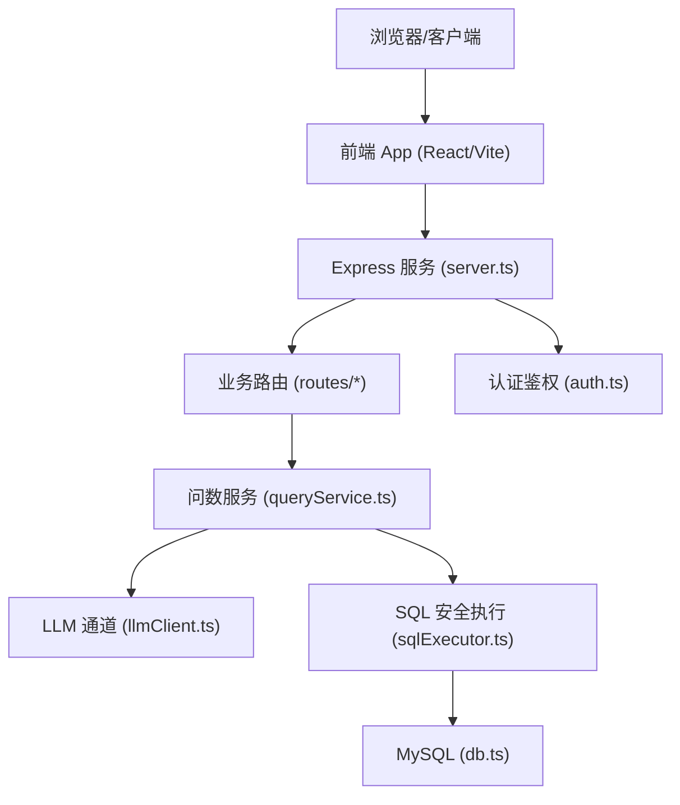
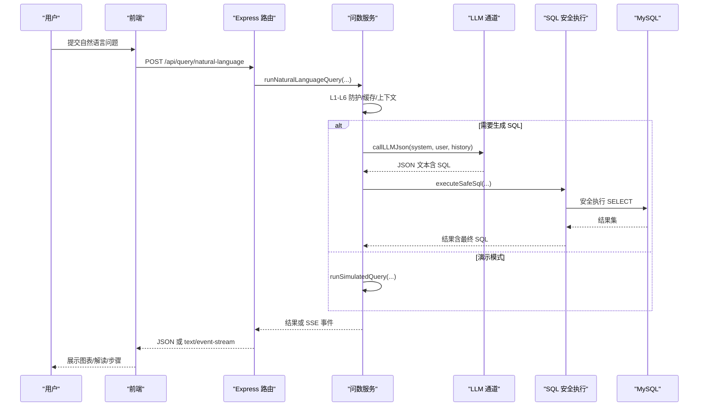
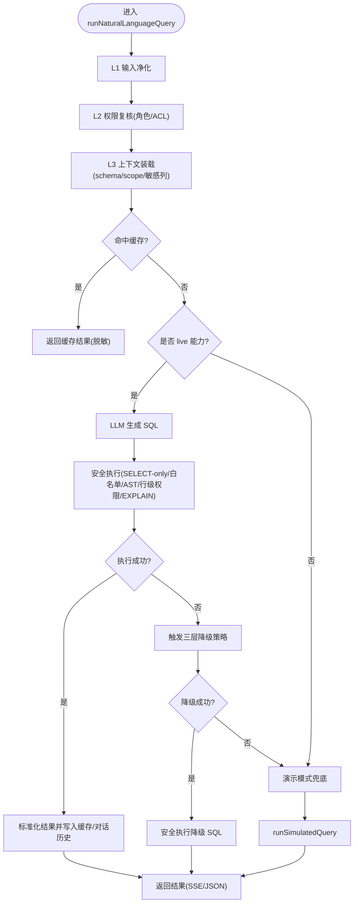
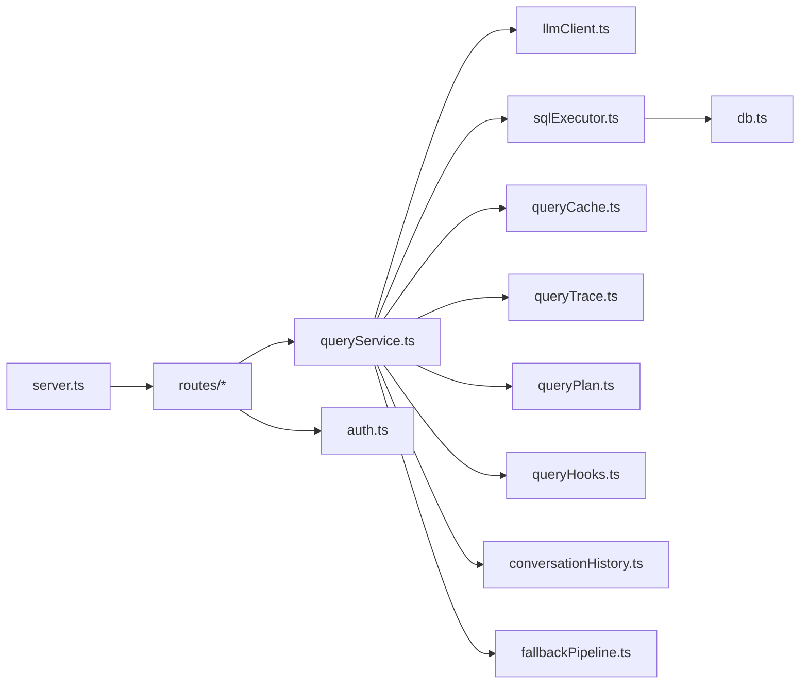

# 组织管理系统

<cite>
**本文引用的文件**
- [server.ts](file://server.ts)
- [package.json](file://package.json)
- [README.md](file://README.md)
- [src/App.tsx](file://src/App.tsx)
- [server/routes/query.ts](file://server/routes/query.ts)
- [server/auth/auth.ts](file://server/auth/auth.ts)
- [server/llm/llmClient.ts](file://server/llm/llmClient.ts)
- [server/query/sqlExecutor.ts](file://server/query/sqlExecutor.ts)
- [server/infra/db.ts](file://server/infra/db.ts)
- [server/routes/auth.ts](file://server/routes/auth.ts)
- [server/query/queryService.ts](file://server/query/queryService.ts)
</cite>

## 目录
1. [简介](#简介)
2. [项目结构](#项目结构)
3. [核心组件](#核心组件)
4. [架构总览](#架构总览)
5. [详细组件分析](#详细组件分析)
6. [依赖关系分析](#依赖关系分析)
7. [性能考量](#性能考量)
8. [故障排查指南](#故障排查指南)
9. [结论](#结论)
10. [附录](#附录)

## 简介
本系统为企业级自然语言数据分析平台，支持多数据源接入、NL2SQL 双阶段生成（先生成 SQL，再基于真实结果生成解读与图表）、SSE 流式进度、歧义澄清、语义缓存、few-shot 样例注入、外部知识库检索、对话历史落库、报告模式、异常巡检、RBAC 三角色、行级权限、审计与可观测等能力。前端采用 React + Vite + TypeScript，后端 Express + Node.js，数据库 MySQL（可选 Redis），AI 引擎支持 Ollama/通义千问/Gemini/DeepSeek。

## 项目结构
- 服务入口与中间件：server.ts 负责启动 Express、加载环境变量、初始化数据库与调度器、挂载路由、设置安全头与监控、提供健康检查与 SPA 静态资源。
- 业务路由：routes 下按领域拆分（auth、query、report、admin、datasources、knowledge、analytics、agent、patrols 等）。
- 应用服务层：server/query 下的 queryService.ts 编排 NL2SQL 主链路（输入净化、权限复核、上下文装载、缓存、live/simulated 双链路、降级策略、审计、SSE 事件发射、推导留痕）。
- 安全执行层：server/query/sqlExecutor.ts 实现 SELECT-only、白名单校验、AST 复核、行级权限注入、EXPLAIN 防线、连接池分级与超时控制。
- LLM 通道：server/llm/llmClient.ts 统一封装多引擎调用、熔断/重试/并发控制、自适应超时、用量埋点与模型目录。
- 认证授权：server/auth/auth.ts 提供 JWT 签发/校验与角色守卫；server/routes/auth.ts 提供登录、改密、OIDC 流程。
- 基础设施：server/infra/db.ts 管理 MySQL 连接池与初始化顺序（建库→建表→迁移→种子→数据迁移）。

**图示来源**
- [server.ts:97-372](file://server.ts#L97-L372)
- [server/query/queryService.ts:91-539](file://server/query/queryService.ts#L91-L539)
- [server/llm/llmClient.ts:509-588](file://server/llm/llmClient.ts#L509-L588)
- [server/query/sqlExecutor.ts:756-774](file://server/query/sqlExecutor.ts#L756-L774)
- [server/infra/db.ts:68-102](file://server/infra/db.ts#L68-L102)

**章节来源**
- [server.ts:97-372](file://server.ts#L97-L372)
- [package.json:1-83](file://package.json#L1-L83)
- [README.md:9-65](file://README.md#L9-L65)

## 核心组件
- 服务启动与健康：server.ts 完成环境加载、DB 初始化、调度器启动、路由挂载、安全头、Prometheus 指标、健康端点与优雅停机。
- 认证与授权：auth.ts 提供 JWT 签发/校验与 requireRole 守卫；auth.ts 路由提供登录、改密、OIDC 回调。
- 问数主链路：queryService.ts 编排 L1-L6 防护、缓存、live/simulated 双链路、降级策略、审计、SSE 事件与推导留痕。
- SQL 安全执行：sqlExecutor.ts 实现 SELECT-only、白名单、AST 复核、行级权限注入、EXPLAIN 防线、场景化连接池与超时。
- LLM 通道：llmClient.ts 统一多引擎调用、熔断/重试/并发、自适应超时、用量统计与模型目录。
- 数据库持久化：db.ts 负责连接池、建库建表、迁移与种子数据。

**章节来源**
- [server.ts:97-372](file://server.ts#L97-L372)
- [server/auth/auth.ts:60-127](file://server/auth/auth.ts#L60-L127)
- [server/routes/auth.ts:42-157](file://server/routes/auth.ts#L42-L157)
- [server/query/queryService.ts:91-539](file://server/query/queryService.ts#L91-L539)
- [server/query/sqlExecutor.ts:288-384](file://server/query/sqlExecutor.ts#L288-L384)
- [server/llm/llmClient.ts:509-588](file://server/llm/llmClient.ts#L509-L588)
- [server/infra/db.ts:68-102](file://server/infra/db.ts#L68-L102)

## 架构总览
系统采用前后端分离与模块化分层：
- 前端：React + Vite，懒加载大组件，状态管理与工具函数位于 src/hooks/utils。
- 后端：Express 路由层仅做参数解析与响应映射，核心逻辑下沉至应用服务层（queryService）与安全执行层（sqlExecutor）。
- 数据层：MySQL 作为元数据与业务数据源；可选 Redis 用于限流/配额/缓存状态外置。
- AI 层：统一 LLM 通道，支持多引擎与熔断/重试/并发控制，具备用量统计与自适应超时。

**图示来源**
- [server/routes/query.ts:46-114](file://server/routes/query.ts#L46-L114)
- [server/query/queryService.ts:91-539](file://server/query/queryService.ts#L91-L539)
- [server/llm/llmClient.ts:509-588](file://server/llm/llmClient.ts#L509-L588)
- [server/query/sqlExecutor.ts:756-774](file://server/query/sqlExecutor.ts#L756-L774)

## 详细组件分析

### 服务启动与路由装配（server.ts）
- 启动时加载 .env.local/.env，初始化 MySQL 结构与种子数据，预热 Redis（若启用），启动任务队列、Ollama 健康检查、SSE 重放缓冲清扫、漂移检测、异常巡检调度。
- 注册全局中间件：请求日志、Prometheus 指标、安全响应头（生产启用 HSTS/CSP）。
- 挂载各模块路由（auth/admin/datasources/knowledge/query/report/patrols/analytics/agent 等），并提供 /api/health/live、/api/health/ready、/metrics 等基础设施端点。
- 优雅停机：SIGTERM/SIGINT 停止任务工作进程并关闭连接池。

**章节来源**
- [server.ts:97-372](file://server.ts#L97-L372)

### 认证与授权（server/auth/auth.ts 与 server/routes/auth.ts）
- auth.ts：JWT 签发/校验，鉴权后回查 users 表确保禁用/角色变更即时生效；requireRole 守卫限制访问范围；强制首登改密拦截。
- routes/auth.ts：登录接口限流，校验密码强度，更新最后登录时间；改密接口校验新旧密码；OIDC 状态查询、授权跳转与回调签本地 JWT。

**章节来源**
- [server/auth/auth.ts:60-127](file://server/auth/auth.ts#L60-L127)
- [server/routes/auth.ts:42-157](file://server/routes/auth.ts#L42-L157)

### 问数主链路（server/query/queryService.ts）
- 六层防护：输入净化（截断+注入检测）、权限复核（角色+ACL）、上下文装载（schema+scope+敏感列过滤+缓存）、历史净化、频率限制（滑动窗口+并发槽）、审计留痕。
- 双阶段真实执行：数据库型/已落库文件型走 live 链路（LLM 生成 SQL → 安全执行 → 真实 rows 回喂分析）；否则走 simulated 演示模式。
- 缓存：L1 精确键（含模型变体与金额单位）与 L2 语义缓存（embedding 近似命中）；refreshCache 跳过读取。
- 降级策略：三层 fallback（rule_based → simpler_prompt → human_approval），失败则返回模拟数据兜底。
- SSE 与推导留痕：stage/trace/error 事件通过 sink 发射；traceId 用于断线续传与回放。

**图示来源**
- [server/query/queryService.ts:91-539](file://server/query/queryService.ts#L91-L539)
- [server/query/sqlExecutor.ts:288-384](file://server/query/sqlExecutor.ts#L288-L384)

**章节来源**
- [server/query/queryService.ts:91-539](file://server/query/queryService.ts#L91-L539)

### SQL 安全执行层（server/query/sqlExecutor.ts）
- 只读保障：仅允许 SELECT（含 WITH CTE），拒绝危险关键字与 INTO 写操作。
- 白名单与 AST 复核：提取 FROM/JOIN 表名，排除 CTE 别名；AST 解析失败时正则防线兜底但标记 astFallback。
- 行级权限注入：将受控表包裹为派生表并注入 WHERE 谓词，递归覆盖子查询/UNION/CTE。
- EXPLAIN 防线：预估扫描行数超阈值则拦截（fail-closed），PG/MySQL 分别解析计划树。
- 场景化连接池：interactive/chain/export 三类场景独立配额与超时；MySQL 注入 MAX_EXECUTION_TIME hint。
- 结果上限：MAX_ROWS=100000，QUERY_RESULT_ROWS_MAX 控制交互上限（0=不限制回落硬上限）。

**章节来源**
- [server/query/sqlExecutor.ts:288-384](file://server/query/sqlExecutor.ts#L288-L384)
- [server/query/sqlExecutor.ts:393-493](file://server/query/sqlExecutor.ts#L393-L493)
- [server/query/sqlExecutor.ts:535-679](file://server/query/sqlExecutor.ts#L535-L679)
- [server/query/sqlExecutor.ts:708-748](file://server/query/sqlExecutor.ts#L708-L748)

### LLM 通道（server/llm/llmClient.ts）
- 多引擎统一：Ollama/Gemini/Qwen/DeepSeek，按优先级选择（请求级覆盖 > 阶段级路由 > 环境变量/密钥存在性）。
- 韧性机制：信号量并发控制、退避重试、熔断（连续失败开路）、自适应超时（P95×3 动态收紧）。
- 用量埋点：记录 prompt/completion tokens 与耗时，支持按用户维度聚合。
- 模型目录：实时拉取 Ollama 已安装模型，云端引擎按密钥列出默认模型。

**章节来源**
- [server/llm/llmClient.ts:65-120](file://server/llm/llmClient.ts#L65-L120)
- [server/llm/llmClient.ts:142-168](file://server/llm/llmClient.ts#L142-L168)
- [server/llm/llmClient.ts:509-588](file://server/llm/llmClient.ts#L509-L588)
- [server/llm/llmClient.ts:334-380](file://server/llm/llmClient.ts#L334-L380)

### 数据库初始化（server/infra/db.ts）
- 启动顺序：创建数据库 → 建立连接池 → 执行 schema 定义（幂等 DDL） → 结构迁移 → 初始种子 → 数据迁移（回填/加密）。
- 连接池容量公式化：APP_POOL_MAX 或按 EXPECTED_CONCURRENT_USERS 推导，clamp 到 [10, 50]。

**章节来源**
- [server/infra/db.ts:26-40](file://server/infra/db.ts#L26-L40)
- [server/infra/db.ts:68-102](file://server/infra/db.ts#L68-L102)

### 前端入口与路由（src/App.tsx）
- 登录后加载数据源，根据角色守卫 Tab 可见性（VIEWER 不可访问 query/flexquery，非 ADMIN 不可访问 datasources/admin）。
- 懒加载大组件（CustomDashboard/FlexQueryBuilder/QueryReportCenter）减少首屏体积。
- 处理 OIDC 回跳 sso_token，失败显示错误并重载。

**章节来源**
- [src/App.tsx:20-83](file://src/App.tsx#L20-L83)

## 依赖关系分析
- 服务入口依赖：infra（db/stateStore/monitoring/shutdown）、auth、llm、query、routes、taskHandlers、anomalyPatrol。
- 路由依赖：authMiddleware、rateLimiter、requireRole、queryGuard、schemaContext、sqlExecutor、queryService、auditLog、userQueryLimit。
- 服务层依赖：queryGuard、schemaContext、llmClient、sqlExecutor、queryCache、queryTrace、queryPlan、queryHooks、conversationHistory、fallbackPipeline。
- 执行层依赖：mysql2/pg、node-sql-parser、secretsCrypto、monitoring、logger。

**图示来源**
- [server.ts:21-77](file://server.ts#L21-L77)
- [server/routes/query.ts:19-40](file://server/routes/query.ts#L19-L40)
- [server/query/queryService.ts:11-37](file://server/query/queryService.ts#L11-L37)
- [server/query/sqlExecutor.ts:11-22](file://server/query/sqlExecutor.ts#L11-L22)
- [server/infra/db.ts:1-12](file://server/infra/db.ts#L1-L12)

**章节来源**
- [server.ts:21-77](file://server.ts#L21-L77)
- [server/routes/query.ts:19-40](file://server/routes/query.ts#L19-L40)
- [server/query/queryService.ts:11-37](file://server/query/queryService.ts#L11-L37)

## 性能考量
- LLM 调用：并发信号量、退避重试、熔断、自适应超时，避免雪崩与拖慢。
- SQL 执行：场景化连接池与超时（interactive/chain/export），EXPLAIN 防线拦截大扫描，MAX_ROWS 防 OOM。
- 缓存：L1 精确键与 L2 语义缓存显著降低重复提问延迟。
- SSE 与断线续传：事件入缓冲，客户端断开不阻断链路，重连按 traceId+序号续传。
- 健康检查：/api/health/live 存活探测，/api/health/ready 就绪探测（含依赖健康），便于编排系统摘流。

[本节为通用指导，无需特定文件引用]

## 故障排查指南
- 认证失败：检查 JWT_SECRET 配置与 token 有效性；确认账号状态 ACTIVE；首次登录需改密。
- 问数被拒：查看 L1 输入净化原因（注入特征/长度超限）、ACL 权限、数据源开关（disconnected）。
- SQL 执行失败：关注 AST 解析失败（astFallback 标记）、白名单/敏感列拒绝、行级权限注入失败、EXPLAIN 防线拦截。
- LLM 不可用：观察熔断状态与故障转移日志；检查引擎密钥与网络连通；查看用量统计与超时告警。
- 导出/报表：注意 body 大小限制与异步任务队列状态；检查 PDF/PPT/Excel 导出依赖。

**章节来源**
- [server/auth/auth.ts:67-113](file://server/auth/auth.ts#L67-L113)
- [server/query/queryService.ts:117-156](file://server/query/queryService.ts#L117-L156)
- [server/query/sqlExecutor.ts:288-384](file://server/query/sqlExecutor.ts#L288-L384)
- [server/query/sqlExecutor.ts:646-679](file://server/query/sqlExecutor.ts#L646-L679)
- [server/llm/llmClient.ts:142-168](file://server/llm/llmClient.ts#L142-L168)

## 结论
该系统以“安全优先、可用优先”为原则，构建了从输入到输出全链路的纵深防御与高可用保障：严格的 SQL 安全执行、多层缓存与降级策略、多引擎 LLM 的韧性设计、完善的审计与可观测性，以及面向企业的安全与治理特性（RBAC、行级权限、敏感列过滤、审计日志）。通过模块化分层与清晰的职责边界，系统具备良好的扩展性与可维护性。

[本节为总结性内容，无需特定文件引用]

## 附录
- 快速开始与环境变量：参考 README 中的安装、启动、Docker 部署与环境变量说明。
- 测试与检查：npm test、npm run lint；评测集与负载测试脚本见 package.json scripts。
- 文档约定：功能单一事实源与维护规范见 README 文档维护约定与注释规范。

**章节来源**
- [README.md:67-164](file://README.md#L67-L164)
- [package.json:6-24](file://package.json#L6-L24)