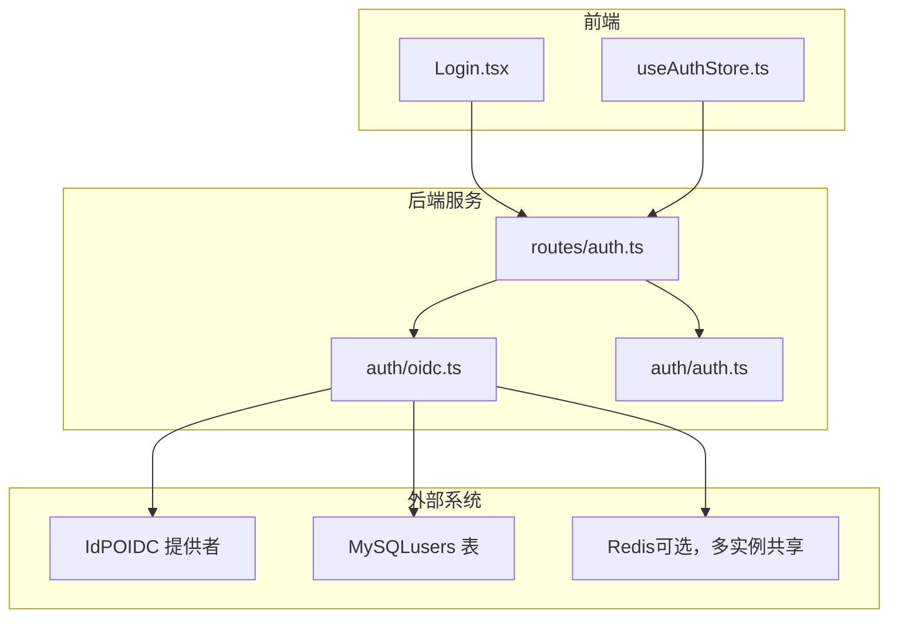
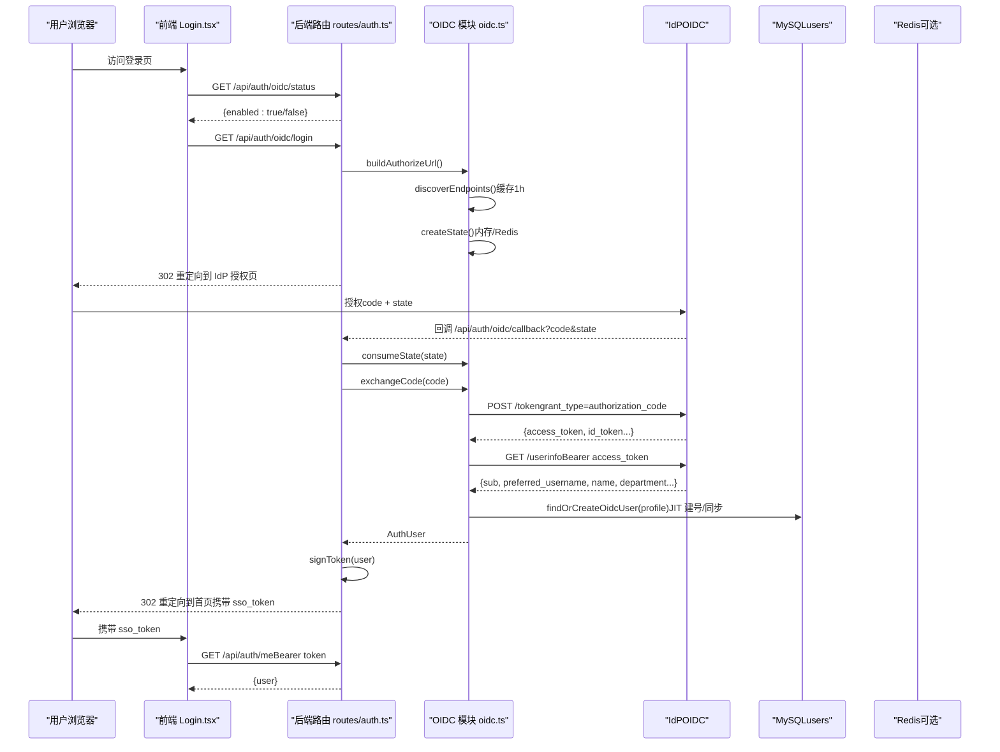
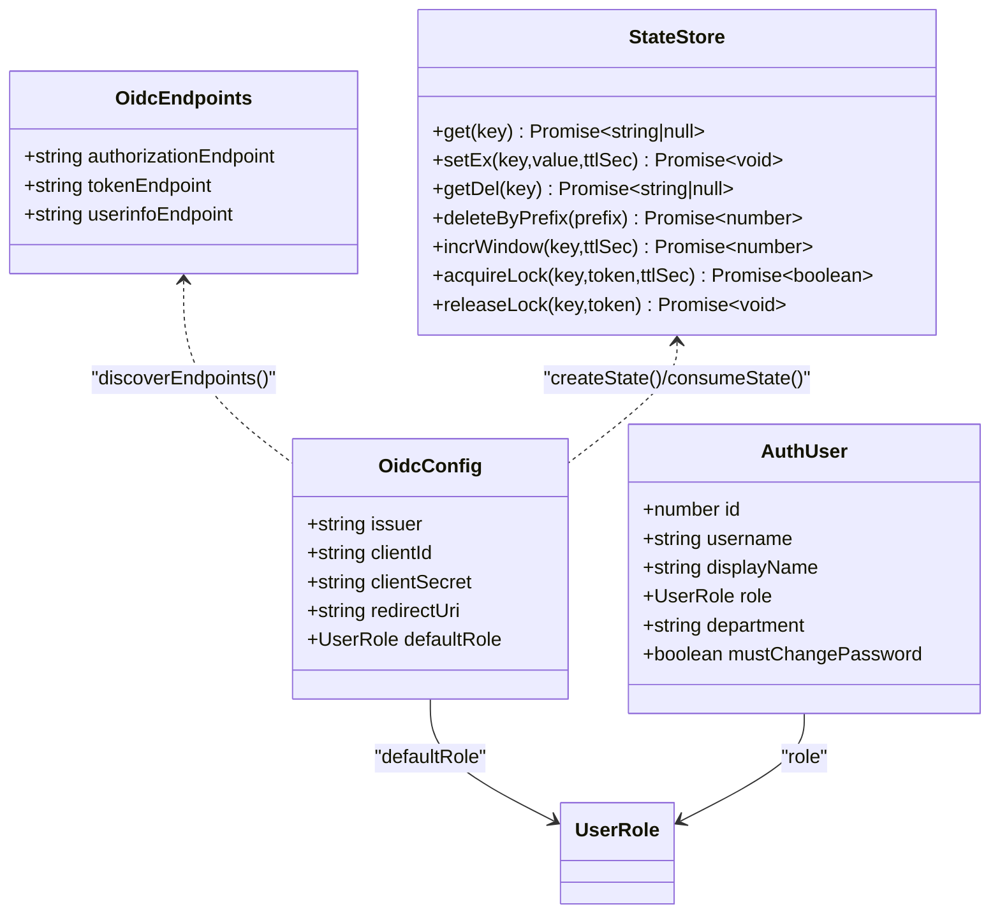
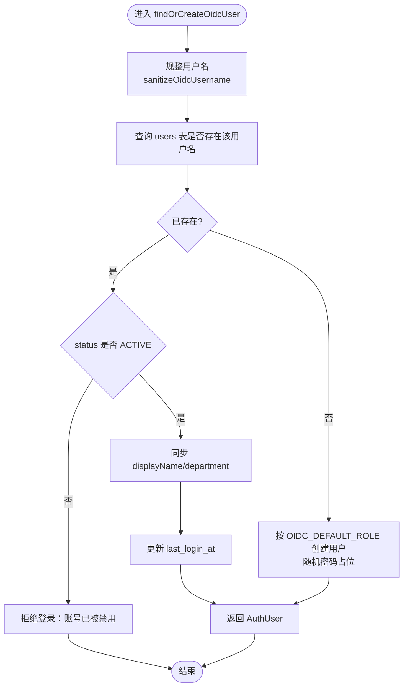
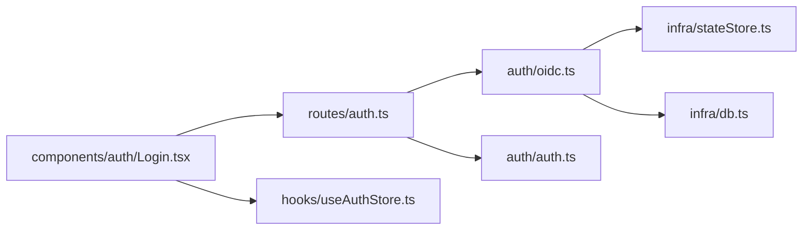

# OIDC企业集成

<cite>
**本文引用的文件**
- [server/auth/oidc.ts](file://server/auth/oidc.ts)
- [server/routes/auth.ts](file://server/routes/auth.ts)
- [server/auth/auth.ts](file://server/auth/auth.ts)
- [src/components/auth/Login.tsx](file://src/components/auth/Login.tsx)
- [src/hooks/useAuthStore.ts](file://src/hooks/useAuthStore.ts)
- [server/infra/stateStore.ts](file://server/infra/stateStore.ts)
- [server/infra/db.ts](file://server/infra/db.ts)
- [docker-compose.multi-instance.yml](file://docker-compose.multi-instance.yml)
</cite>

## 目录
1. [简介](#简介)
2. [项目结构](#项目结构)
3. [核心组件](#核心组件)
4. [架构总览](#架构总览)
5. [详细组件分析](#详细组件分析)
6. [依赖关系分析](#依赖关系分析)
7. [性能与可扩展性](#性能与可扩展性)
8. [故障排查指南](#故障排查指南)
9. [结论](#结论)
10. [附录：配置与最佳实践](#附录配置与最佳实践)

## 简介
本文件面向企业级身份集成，围绕 OpenID Connect（OIDC）协议在本项目中的实现进行系统化说明。内容涵盖：
- 身份提供商（IdP）配置、OAuth2 授权码流程、ID 令牌与用户信息处理
- 用户信息同步机制、角色映射策略、部门信息传递
- 单点登录（SSO）实现、登出与会话管理
- 主流 IdP（Azure AD、Okta、Keycloak）的配置要点
- OIDC 回调处理、错误处理与调试技巧
- 与企业 LDAP/AD 域控的集成思路

本项目采用“零新依赖”的 OIDC 实现：发现文档、授权、令牌交换、用户信息拉取均通过全局 fetch；state 票据支持内存或 Redis（多实例共享），确保 CSRF 防护与水平扩展能力。

## 项目结构
与 OIDC 相关的代码主要分布在以下位置：
- server/auth/oidc.ts：OIDC 核心逻辑（配置解析、发现缓存、state 票据、授权链接构建、令牌交换、用户信息获取、JIT 建号/同步）
- server/routes/auth.ts：认证路由（本地登录、当前用户、改密、OIDC 状态/登录/回调）
- server/auth/auth.ts：JWT 签发/校验、鉴权中间件、角色守卫
- src/components/auth/Login.tsx：前端登录页（含 SSO 入口展示）
- src/hooks/useAuthStore.ts：前端认证状态管理（SSO 回跳后使用本地 JWT 完成登录）
- server/infra/stateStore.ts：状态存储抽象（内存/Redis），支撑多实例 state 共享
- server/infra/db.ts：数据库初始化与 users 表结构（含 department 字段）
- docker-compose.multi-instance.yml：多实例部署示例（含 Redis 共享）

图表来源
- [server/routes/auth.ts:116-153](file://server/routes/auth.ts#L116-L153)
- [server/auth/oidc.ts:41-189](file://server/auth/oidc.ts#L41-L189)
- [server/auth/auth.ts:60-113](file://server/auth/auth.ts#L60-L113)
- [src/components/auth/Login.tsx:11-25](file://src/components/auth/Login.tsx#L11-L25)
- [src/hooks/useAuthStore.ts:41-52](file://src/hooks/useAuthStore.ts#L41-L52)
- [server/infra/stateStore.ts:169-187](file://server/infra/stateStore.ts#L169-L187)

章节来源
- [server/auth/oidc.ts:1-244](file://server/auth/oidc.ts#L1-L244)
- [server/routes/auth.ts:1-156](file://server/routes/auth.ts#L1-L156)
- [server/auth/auth.ts:1-127](file://server/auth/auth.ts#L1-L127)
- [src/components/auth/Login.tsx:1-137](file://src/components/auth/Login.tsx#L1-L137)
- [src/hooks/useAuthStore.ts:1-84](file://src/hooks/useAuthStore.ts#L1-L84)
- [server/infra/stateStore.ts:1-219](file://server/infra/stateStore.ts#L1-L219)
- [server/infra/db.ts:72-102](file://server/infra/db.ts#L72-L102)
- [docker-compose.multi-instance.yml:1-50](file://docker-compose.multi-instance.yml#L1-L50)

## 核心组件
- OIDC 配置与启用开关：从环境变量解析 Issuer、Client ID/Secret、Redirect URI、默认角色；未配置时不展示 SSO 入口。
- 端点发现与缓存：读取 IdP 的 .well-known/openid-configuration，缓存 1 小时减少回源压力。
- State 票据防 CSRF：一次性随机串，TTL 10 分钟；支持内存 Map 或 Redis（多实例共享）。
- 授权码流程：构建授权 URL → 重定向到 IdP → 回调校验 state → 交换 access_token → 拉取 userinfo → JIT 建号/同步 → 签发本地 JWT → 重定向回前端携带 token。
- 用户信息同步：每次登录以 IdP 为权威源更新 displayName/department，并刷新最后登录时间。
- 角色映射策略：JIT 建号时使用 OIDC_DEFAULT_ROLE（白名单：ADMIN/ANALYST/VIEWER），已存在用户保留原角色。
- 鉴权与权限：JWT 校验 + 实时回查 users 表（禁用/角色变更立即生效）；提供 requireRole 守卫。
- 前端登录态：SSO 回跳后使用本地 JWT 调用 /api/auth/me 完成用户信息填充。

章节来源
- [server/auth/oidc.ts:41-189](file://server/auth/oidc.ts#L41-L189)
- [server/routes/auth.ts:116-153](file://server/routes/auth.ts#L116-L153)
- [server/auth/auth.ts:60-127](file://server/auth/auth.ts#L60-L127)
- [src/hooks/useAuthStore.ts:41-52](file://src/hooks/useAuthStore.ts#L41-L52)

## 架构总览
下图展示了 OIDC 授权码流程在系统中的完整交互，包括前端、后端路由、OIDC 模块、IdP、数据库与可选 Redis。

图表来源
- [server/routes/auth.ts:121-153](file://server/routes/auth.ts#L121-L153)
- [server/auth/oidc.ts:70-189](file://server/auth/oidc.ts#L70-L189)
- [server/auth/auth.ts:60-113](file://server/auth/auth.ts#L60-L113)
- [server/infra/stateStore.ts:169-187](file://server/infra/stateStore.ts#L169-L187)

## 详细组件分析

### OIDC 配置与端点发现
- 配置解析：从环境变量读取 OIDC_ISSUER、OIDC_CLIENT_ID、OIDC_CLIENT_SECRET、OIDC_REDIRECT_URI、OIDC_DEFAULT_ROLE；issuer 自动去除尾部斜杠；默认角色在白名单外回退至 VIEWER。
- 端点发现：请求 IdP 的 /.well-known/openid-configuration，提取 authorization_endpoint、token_endpoint、userinfo_endpoint；结果按 issuer 缓存 1 小时。
- 失败处理：HTTP 非 200 或文档不完整直接抛错，便于快速定位配置问题。

章节来源
- [server/auth/oidc.ts:41-87](file://server/auth/oidc.ts#L41-L87)

### State 票据与 CSRF 防护
- 生成：创建一次性随机 state，写入内存 Map 或 Redis（TTL 10 分钟）。
- 消费：回调时原子消费（Redis 优先使用 GETDEL，否则 GET+DEL），内存模式则删除对应键；未知或过期 state 拒绝登录。
- 多实例：配置 REDIS_URL 后，state 由 Redis 共享，避免不同实例间无法校验的问题。

章节来源
- [server/auth/oidc.ts:95-127](file://server/auth/oidc.ts#L95-L127)
- [server/infra/stateStore.ts:169-187](file://server/infra/stateStore.ts#L169-L187)

### 授权码交换与用户信息拉取
- 授权链接：response_type=code，scope 包含 openid profile email，附带 state。
- 令牌交换：POST token 端点，携带 grant_type=authorization_code、code、redirect_uri、client_id，可选 client_secret；响应需包含 access_token。
- 用户信息：GET userinfo 端点，携带 Authorization: Bearer access_token；规整为 sub、username、displayName、department。

章节来源
- [server/auth/oidc.ts:129-189](file://server/auth/oidc.ts#L129-L189)

### JIT 建号与用户信息同步
- 用户名规整：转小写、非法字符替换、长度截断，过短补 sso_ 前缀。
- 已存在用户：若 status 非 ACTIVE 则拒绝登录；同步 displayName/department 并刷新 last_login_at。
- 新用户：按 OIDC_DEFAULT_ROLE 创建账号，密码哈希为随机占位（禁止本地密码登录），记录日志。

章节来源
- [server/auth/oidc.ts:191-243](file://server/auth/oidc.ts#L191-L243)
- [server/infra/db.ts:72-102](file://server/infra/db.ts#L72-L102)

### 鉴权中间件与角色守卫
- JWT 签发：将 sub、username、role 写入 token，过期时间可配置。
- 鉴权中间件：校验 Bearer token，回查 users 表确认状态与角色，注入 req.user；强制改密拦截（仅放行 /api/auth/*）。
- 角色守卫：requireRole(...) 用于保护管理员/分析师等敏感操作。

章节来源
- [server/auth/auth.ts:46-127](file://server/auth/auth.ts#L46-L127)

### 前端登录与 SSO 回跳
- 登录页：查询 /api/auth/oidc/status 决定是否显示“企业统一登录（SSO）”入口；支持显示回调错误信息。
- 回跳处理：从 URL 参数获取 sso_token，调用 /api/auth/me 验证并填充用户信息；切换账号时清理本地分析缓存。

章节来源
- [src/components/auth/Login.tsx:11-25](file://src/components/auth/Login.tsx#L11-L25)
- [src/hooks/useAuthStore.ts:41-52](file://src/hooks/useAuthStore.ts#L41-L52)

### 类图（OIDC 相关类型与模块）

图表来源
- [server/auth/oidc.ts:33-67](file://server/auth/oidc.ts#L33-L67)
- [server/auth/auth.ts:13-24](file://server/auth/auth.ts#L13-L24)
- [server/infra/stateStore.ts:10-23](file://server/infra/stateStore.ts#L10-L23)

### 流程图（JIT 建号/同步）

图表来源
- [server/auth/oidc.ts:207-243](file://server/auth/oidc.ts#L207-L243)

## 依赖关系分析
- 模块耦合：
  - routes/auth.ts 依赖 oidc.ts 与 auth.ts，负责路由编排与错误处理。
  - oidc.ts 依赖 stateStore.ts（state 票据）、db.ts（用户表）、auth.ts（签名与角色）。
  - 前端 Login.tsx 与 useAuthStore.ts 通过 REST API 与后端交互。
- 外部依赖：
  - IdP：通过标准 OIDC 接口通信（无第三方 SDK）。
  - MySQL：持久化用户信息与业务数据。
  - Redis：可选，用于多实例共享 state 与限流等。

图表来源
- [server/routes/auth.ts:1-156](file://server/routes/auth.ts#L1-L156)
- [server/auth/oidc.ts:1-244](file://server/auth/oidc.ts#L1-L244)
- [server/auth/auth.ts:1-127](file://server/auth/auth.ts#L1-L127)
- [server/infra/stateStore.ts:1-219](file://server/infra/stateStore.ts#L1-L219)
- [server/infra/db.ts:1-817](file://server/infra/db.ts#L1-L817)
- [src/components/auth/Login.tsx:1-137](file://src/components/auth/Login.tsx#L1-L137)
- [src/hooks/useAuthStore.ts:1-84](file://src/hooks/useAuthStore.ts#L1-L84)

章节来源
- [server/routes/auth.ts:1-156](file://server/routes/auth.ts#L1-L156)
- [server/auth/oidc.ts:1-244](file://server/auth/oidc.ts#L1-L244)
- [server/auth/auth.ts:1-127](file://server/auth/auth.ts#L1-L127)
- [server/infra/stateStore.ts:1-219](file://server/infra/stateStore.ts#L1-L219)
- [server/infra/db.ts:1-817](file://server/infra/db.ts#L1-L817)
- [src/components/auth/Login.tsx:1-137](file://src/components/auth/Login.tsx#L1-L137)
- [src/hooks/useAuthStore.ts:1-84](file://src/hooks/useAuthStore.ts#L1-L84)

## 性能与可扩展性
- 端点发现缓存：1 小时 TTL，显著降低 IdP 回源频率。
- State 票据：Redis 模式下支持水平扩展；内存模式适用于单机。
- 鉴权中间件：每次请求回查 users 表，确保禁用/角色变更即时生效；在高并发场景下建议合理设置连接池大小。
- 多实例部署：通过 Redis 共享 state，结合 Nginx 负载均衡，实现无状态副本扩展。

章节来源
- [server/auth/oidc.ts:62-87](file://server/auth/oidc.ts#L62-L87)
- [server/infra/stateStore.ts:169-187](file://server/infra/stateStore.ts#L169-L187)
- [server/auth/auth.ts:66-113](file://server/auth/auth.ts#L66-L113)
- [docker-compose.multi-instance.yml:1-50](file://docker-compose.multi-instance.yml#L1-L50)

## 故障排查指南
- OIDC 未启用：检查是否配置了 OIDC_ISSUER 与 OIDC_CLIENT_ID；前端会据此隐藏 SSO 入口。
- discovery 失败：确认 IdP 地址可达且返回完整的 openid-configuration；关注 HTTP 状态码与缺失字段。
- state 无效或过期：确认回调参数 state 存在且未被重复消费；多实例需配置 REDIS_URL。
- token 交换失败：检查 code、redirect_uri、client_id、client_secret 是否正确；查看 IdP 返回的错误信息。
- userinfo 获取失败：确认 IdP 暴露了 userinfo 端点且返回包含 sub；检查网络与超时。
- JIT 建号失败：检查 users 表结构与权限；确认 OIDC_DEFAULT_ROLE 在白名单内。
- 鉴权失败：确认 JWT_SECRET 在生产环境固定配置；检查 token 是否过期或用户被禁用。

章节来源
- [server/auth/oidc.ts:41-189](file://server/auth/oidc.ts#L41-L189)
- [server/routes/auth.ts:116-153](file://server/routes/auth.ts#L116-L153)
- [server/auth/auth.ts:46-113](file://server/auth/auth.ts#L46-L113)

## 结论
本项目实现了轻量、安全、可扩展的 OIDC 企业集成方案：
- 通过标准 OIDC 协议与主流 IdP 对接，无需额外依赖
- 支持 JIT 建号与用户信息同步，简化运维
- 提供 CSRF 防护与多实例 state 共享，保障高可用
- 鉴权中间件与角色守卫确保权限控制及时生效
- 前端无缝衔接 SSO 回跳，提升用户体验

## 附录：配置与最佳实践

### 环境变量清单
- OIDC_ISSUER：IdP 根地址（如 https://idp.example.com/realms/main）
- OIDC_CLIENT_ID / OIDC_CLIENT_SECRET：客户端标识与密钥（公共客户端可留空）
- OIDC_REDIRECT_URI：回调地址（默认 http://localhost:{PORT}/api/auth/oidc/callback）
- OIDC_DEFAULT_ROLE：JIT 建号默认角色（ADMIN/ANALYST/VIEWER）
- JWT_SECRET：生产环境必须配置固定强密钥
- JWT_EXPIRES_IN：JWT 过期时间（默认 12h）
- REDIS_URL：多实例部署时启用 Redis 共享 state

章节来源
- [server/auth/oidc.ts:8-56](file://server/auth/oidc.ts#L8-L56)
- [server/auth/auth.ts:46-58](file://server/auth/auth.ts#L46-L58)
- [docker-compose.multi-instance.yml:19-39](file://docker-compose.multi-instance.yml#L19-L39)

### 主流 IdP 配置要点
- Azure AD：
  - 应用注册中启用“ID 令牌”和“访问令牌”，配置重定向 URI 为 /api/auth/oidc/callback
  - 在声明中启用 preferred_username、name、department（如需）
  - 设置允许的租户范围或选择“任何组织目录中的账户”
- Okta：
  - 创建 Web 应用，设置登录重定向 URI 为 /api/auth/oidc/callback
  - 在 User Attributes 中添加 department 映射
  - 根据需求配置 Token Scopes（openid、profile、email）
- Keycloak：
  - 创建 Client，启用 Standard Flow，设置 Valid Redirect URIs
  - 在 Mapper 中添加 department 字段（来自 user attribute 或 realm attribute）
  - 配置 Role Mapping 与 Default Roles（可选）

[本节为概念性指导，不直接引用具体代码文件]

### 与企业 LDAP/AD 域控的集成思路
- 方案一：通过企业 IdP（如 Azure AD、Okta、Keycloak）桥接 LDAP/AD，OIDC 作为统一入口
- 方案二：在 IdP 层配置 LDAP 连接器，将 LDAP 用户映射为 OIDC 用户，再与本系统对接
- 方案三：若需直连 LDAP，可在 OIDC 模块中增加 LDAP 查询步骤（需谨慎评估安全性与性能）

[本节为概念性指导，不直接引用具体代码文件]

### 登出与会话管理
- 服务端：销毁本地 JWT 会话（前端清除 token 与用户信息）
- 前端：调用 logout 方法清空本地状态，必要时跳转至 IdP 登出端点
- 多实例：由于 JWT 无状态，登出不依赖 Redis；但如需集中撤销，可引入黑名单机制

[本节为概念性指导，不直接引用具体代码文件]