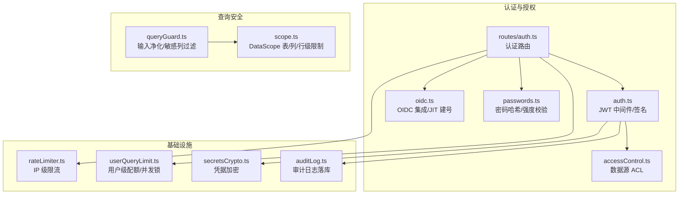
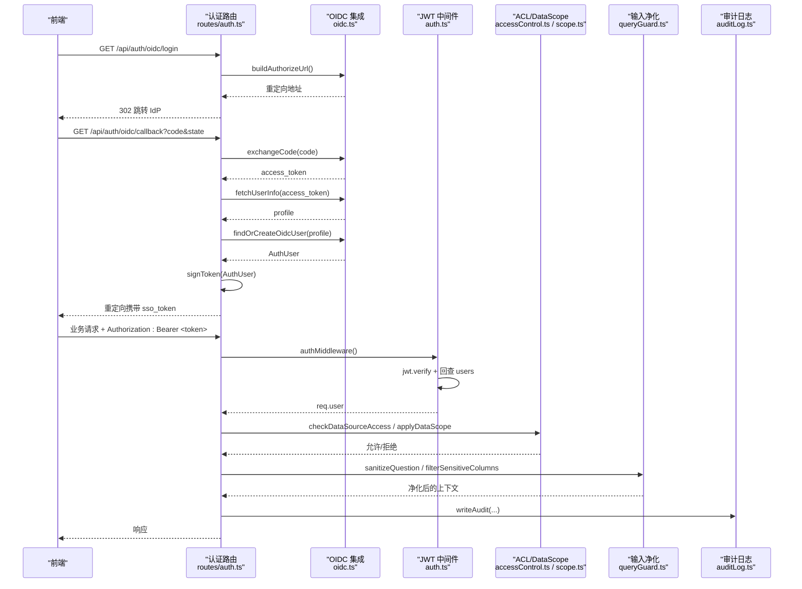
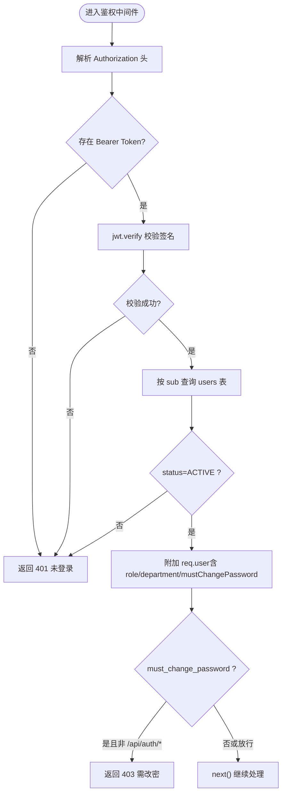
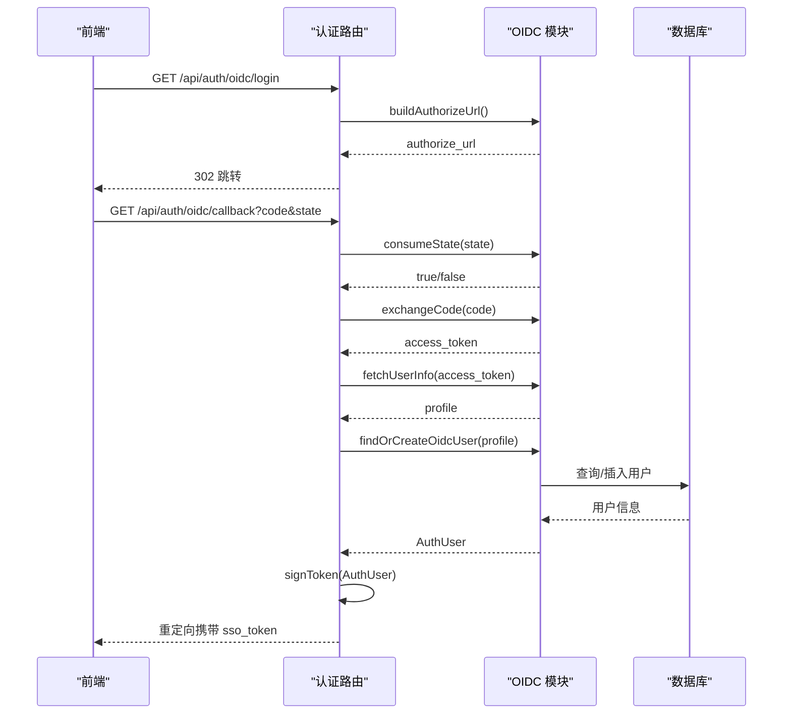
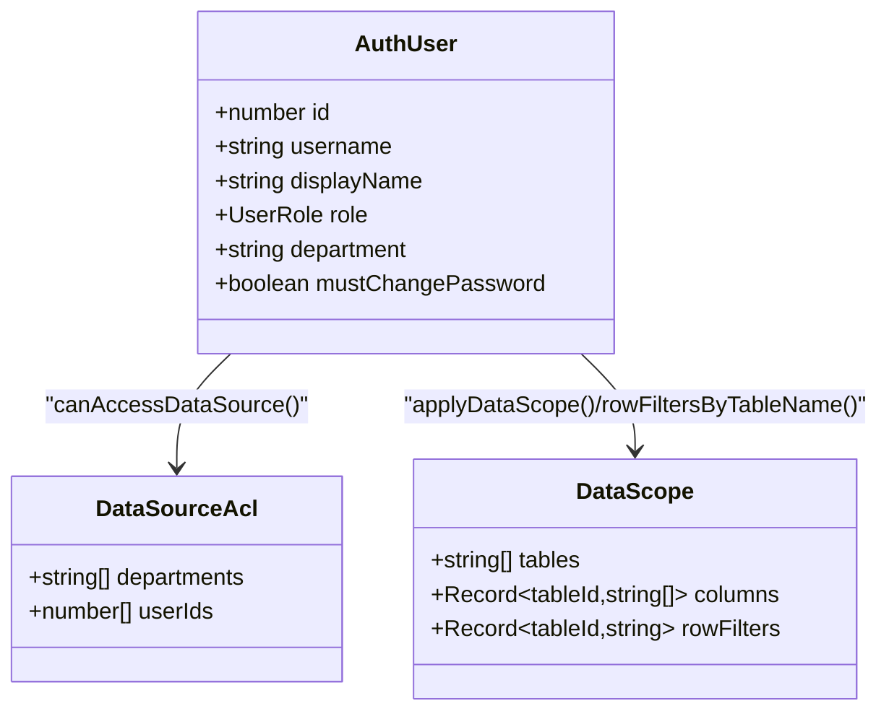
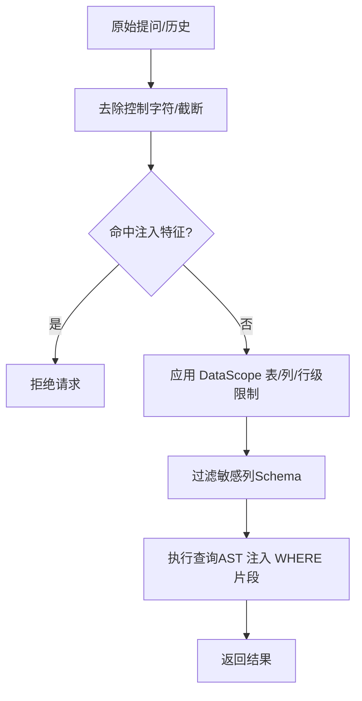
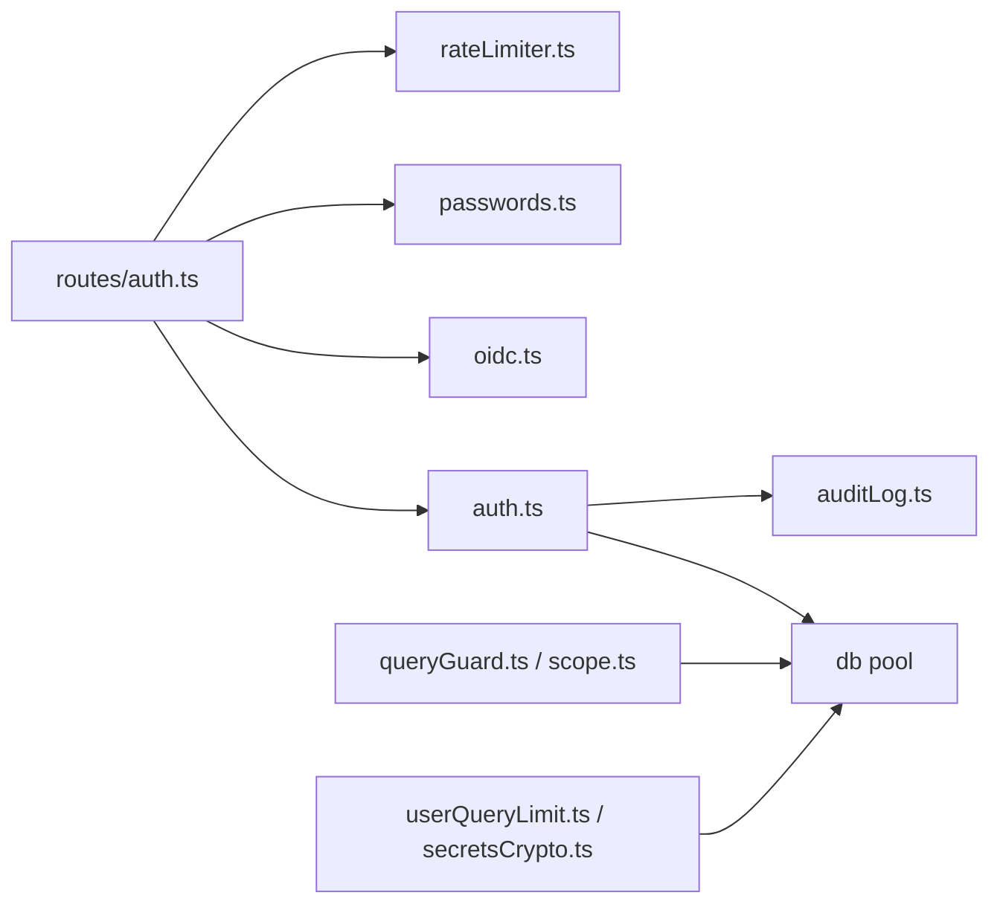

# 安全与认证

<cite>
**本文引用的文件**
- [server/auth/auth.ts](file://server/auth/auth.ts)
- [server/routes/auth.ts](file://server/routes/auth.ts)
- [server/auth/oidc.ts](file://server/auth/oidc.ts)
- [server/auth/accessControl.ts](file://server/auth/accessControl.ts)
- [server/query/queryGuard.ts](file://server/query/queryGuard.ts)
- [server/query/scope.ts](file://server/query/scope.ts)
- [server/infra/rateLimiter.ts](file://server/infra/rateLimiter.ts)
- [server/infra/userQueryLimit.ts](file://server/infra/userQueryLimit.ts)
- [server/infra/secretsCrypto.ts](file://server/infra/secretsCrypto.ts)
- [server/infra/auditLog.ts](file://server/infra/auditLog.ts)
- [server/auth/passwords.ts](file://server/auth/passwords.ts)
</cite>

## 目录
1. [简介](#简介)
2. [项目结构](#项目结构)
3. [核心组件](#核心组件)
4. [架构总览](#架构总览)
5. [详细组件分析](#详细组件分析)
6. [依赖关系分析](#依赖关系分析)
7. [性能考虑](#性能考虑)
8. [故障排查指南](#故障排查指南)
9. [结论](#结论)
10. [附录](#附录)

## 简介
本文件面向“智能问数据分析系统”的安全与认证模块，系统性说明以下能力：
- JWT 令牌签发、验证、刷新与撤销策略
- OIDC 企业登录集成（授权码流程、JIT 建号、用户信息同步）
- RBAC 权限控制模型（角色、资源、操作细粒度控制）
- SQL 注入防护、数据脱敏、敏感信息过滤
- 审计日志记录、操作追溯、合规报告支撑
- 安全配置指南、权限设计最佳实践与安全漏洞防护方案

## 项目结构
安全与认证相关代码主要分布在 server/auth、server/routes、server/query、server/infra 四个层次：
- server/auth：JWT、OIDC、密码哈希、访问控制（ACL）
- server/routes：认证路由（登录、当前用户、改密、OIDC 回调）
- server/query：输入净化、上下文敏感列过滤、数据范围（DataScope）行级权限
- server/infra：限流、用户配额、审计日志、凭据加密、状态存储

**图表来源**
- [server/auth/auth.ts:1-127](file://server/auth/auth.ts#L1-L127)
- [server/routes/auth.ts:1-156](file://server/routes/auth.ts#L1-L156)
- [server/auth/oidc.ts:1-244](file://server/auth/oidc.ts#L1-L244)
- [server/auth/accessControl.ts:1-108](file://server/auth/accessControl.ts#L1-L108)
- [server/query/queryGuard.ts:1-101](file://server/query/queryGuard.ts#L1-L101)
- [server/query/scope.ts:1-101](file://server/query/scope.ts#L1-L101)
- [server/infra/rateLimiter.ts:1-54](file://server/infra/rateLimiter.ts#L1-L54)
- [server/infra/userQueryLimit.ts:1-98](file://server/infra/userQueryLimit.ts#L1-L98)
- [server/infra/secretsCrypto.ts:1-50](file://server/infra/secretsCrypto.ts#L1-L50)
- [server/infra/auditLog.ts:1-62](file://server/infra/auditLog.ts#L1-L62)

**章节来源**
- [server/auth/auth.ts:1-127](file://server/auth/auth.ts#L1-L127)
- [server/routes/auth.ts:1-156](file://server/routes/auth.ts#L1-L156)

## 核心组件
- JWT 认证与鉴权中间件：负责令牌签发、验证、附加用户上下文，并在每次请求回查用户状态（禁用/角色变更即时生效）。
- OIDC 企业登录：基于授权码流程的 SSO，支持 discovery、state 防 CSRF、token 交换、userinfo 拉取、JIT 建号与用户信息同步。
- 密码与凭据安全：scrypt 哈希+pepper、弱口令检测、AES-256-GCM 凭据加密。
- 访问控制：RBAC + 数据源 ACL（部门/个人维度），DataScope 表/列/行级限制。
- 输入与上下文安全：提示注入防护、控制字符清理、敏感列过滤。
- 限流与配额：IP 级限流、用户级频率与并发限制。
- 审计与可观测性：全链路审计日志写入与 Prometheus 旁路埋点。

**章节来源**
- [server/auth/auth.ts:1-127](file://server/auth/auth.ts#L1-L127)
- [server/auth/oidc.ts:1-244](file://server/auth/oidc.ts#L1-L244)
- [server/auth/passwords.ts:1-100](file://server/auth/passwords.ts#L1-L100)
- [server/infra/secretsCrypto.ts:1-50](file://server/infra/secretsCrypto.ts#L1-L50)
- [server/auth/accessControl.ts:1-108](file://server/auth/accessControl.ts#L1-L108)
- [server/query/queryGuard.ts:1-101](file://server/query/queryGuard.ts#L1-L101)
- [server/query/scope.ts:1-101](file://server/query/scope.ts#L1-L101)
- [server/infra/rateLimiter.ts:1-54](file://server/infra/rateLimiter.ts#L1-L54)
- [server/infra/userQueryLimit.ts:1-98](file://server/infra/userQueryLimit.ts#L1-L98)
- [server/infra/auditLog.ts:1-62](file://server/infra/auditLog.ts#L1-L62)

## 架构总览
下图展示从前端到后端的认证与安全处理主路径，包括 OIDC 登录、JWT 签发、鉴权中间件、ACL/DataScope 检查、输入净化与审计。

**图表来源**
- [server/routes/auth.ts:1-156](file://server/routes/auth.ts#L1-L156)
- [server/auth/oidc.ts:1-244](file://server/auth/oidc.ts#L1-L244)
- [server/auth/auth.ts:1-127](file://server/auth/auth.ts#L1-L127)
- [server/auth/accessControl.ts:1-108](file://server/auth/accessControl.ts#L1-L108)
- [server/query/scope.ts:1-101](file://server/query/scope.ts#L1-L101)
- [server/query/queryGuard.ts:1-101](file://server/query/queryGuard.ts#L1-L101)
- [server/infra/auditLog.ts:1-62](file://server/infra/auditLog.ts#L1-L62)

## 详细组件分析

### JWT 令牌认证机制
- 令牌签发：登录成功后使用用户标识、用户名、角色签发短期有效 JWT；生产环境要求配置固定强密钥，开发环境自动随机密钥并告警。
- 令牌验证：鉴权中间件解析 Authorization 头，校验签名后回查数据库用户状态（ACTIVE）、角色与强制改密标记，确保禁用/角色变更立即生效。
- 刷新策略：当前实现为短期令牌；建议结合前端在过期前发起刷新接口（可扩展 refresh 端点），后端校验旧令牌并签发新令牌。
- 撤销策略：通过数据库 status=DISABLED 或 must_change_password 标志配合中间件回查实现即时失效；也可扩展黑名单/短 TTL 策略。

**图表来源**
- [server/auth/auth.ts:60-113](file://server/auth/auth.ts#L60-L113)

**章节来源**
- [server/auth/auth.ts:1-127](file://server/auth/auth.ts#L1-L127)
- [server/routes/auth.ts:41-77](file://server/routes/auth.ts#L41-L77)

### OIDC 企业登录集成
- 身份提供商配置：通过环境变量配置 issuer、client_id、client_secret、redirect_uri、默认角色；未配置时不启用。
- 单点登录流程：授权码流程，state 一次性票据防 CSRF（内存 Map 或 Redis），discovery 缓存 1 小时。
- 用户信息同步：userinfo 获取后 JIT 建号或更新 displayName/department，记录最后登录时间。
- 安全要点：state 原子消费、超时清理；失败统一重定向至前端错误页。

**图表来源**
- [server/routes/auth.ts:116-153](file://server/routes/auth.ts#L116-L153)
- [server/auth/oidc.ts:41-244](file://server/auth/oidc.ts#L41-L244)

**章节来源**
- [server/auth/oidc.ts:1-244](file://server/auth/oidc.ts#L1-L244)
- [server/routes/auth.ts:116-153](file://server/routes/auth.ts#L116-L153)

### RBAC 权限控制模型
- 角色定义：ADMIN、ANALYST、VIEWER。
- 资源权限：数据源 ACL（departments/userIds），管理员豁免；未配置 ACL 表示不限制。
- 操作权限：requireRole 守卫用于接口级角色校验；DataScope 提供表/列/行级限制。
- 组合策略：ACL 决定能否访问数据源，DataScope 决定可用表/列/行；两者正交叠加。

**图表来源**
- [server/auth/auth.ts:15-24](file://server/auth/auth.ts#L15-L24)
- [server/auth/accessControl.ts:13-55](file://server/auth/accessControl.ts#L13-L55)
- [server/query/scope.ts:10-15](file://server/query/scope.ts#L10-L15)

**章节来源**
- [server/auth/accessControl.ts:1-108](file://server/auth/accessControl.ts#L1-L108)
- [server/query/scope.ts:1-101](file://server/query/scope.ts#L1-L101)
- [server/auth/auth.ts:115-127](file://server/auth/auth.ts#L115-L127)

### SQL 注入防护与查询安全
- 输入净化：控制字符过滤、提示注入特征匹配、长度截断，防止恶意指令进入 LLM。
- 上下文敏感列过滤：识别疑似敏感列并从 Schema 中剔除，避免泄露敏感字段名。
- 行级权限谓词清洗：仅保留合法谓词片段，禁止多语句、注释、子查询、SELECT/INTO 等危险结构。
- 执行层保障：DataScope 在 AST 层强制注入行级过滤条件，确保最小可见集。

**图表来源**
- [server/query/queryGuard.ts:27-101](file://server/query/queryGuard.ts#L27-L101)
- [server/query/scope.ts:17-101](file://server/query/scope.ts#L17-L101)

**章节来源**
- [server/query/queryGuard.ts:1-101](file://server/query/queryGuard.ts#L1-L101)
- [server/query/scope.ts:1-101](file://server/query/scope.ts#L1-L101)

### 数据脱敏与敏感信息过滤
- 开关与豁免：可通过环境变量开启/关闭 DLP；默认 ADMIN 豁免，可按策略调整。
- 规则匹配：列名命中（如 mobile、id_card、email、card_no）或内容抽样命中（手机号、身份证、邮箱等）进行掩码。
- 输出保护：对查询结果整体脱敏并附带 dlp 标记，原 payload 不被修改以保障缓存安全。
- 敏感列过滤：在进入 LLM 的 Schema 阶段剔除疑似敏感列，降低泄露风险。

**章节来源**
- [server/query/queryGuard.ts:71-101](file://server/query/queryGuard.ts#L71-L101)
- [server/query/dlp.test.ts:1-165](file://server/query/dlp.test.ts#L1-L165)

### 审计日志、操作追溯与合规报告
- 全链路审计：成功、降级、错误、被拒绝（输入/权限/频率/开关）均落库；写入失败仅告警不阻塞主流程。
- 审计字段：用户、端点、数据源、问题、状态、详情、执行 SQL、行数、耗时等。
- 可观测性：Prometheus 旁路埋点，便于指标采集与告警。

**章节来源**
- [server/infra/auditLog.ts:1-62](file://server/infra/auditLog.ts#L1-L62)

### 密码与凭据安全
- 密码哈希：scrypt + pepper，兼容新旧格式，timingSafeEqual 防时序攻击；弱口令黑名单与强度校验。
- 凭据加密：AES-256-GCM 加密数据源密码，密钥来源于 DS_SECRET_KEY 或 JWT_SECRET；迁移期兼容明文存量。

**章节来源**
- [server/auth/passwords.ts:1-100](file://server/auth/passwords.ts#L1-L100)
- [server/infra/secretsCrypto.ts:1-50](file://server/infra/secretsCrypto.ts#L1-L50)

### 限流与配额
- IP 级限流：滑动窗口（内存）或固定分钟窗口（Redis），超限返回 429。
- 用户级配额：每小时次数上限与并发互斥（分布式锁/内存槽），超限给出重试时间。

**章节来源**
- [server/infra/rateLimiter.ts:1-54](file://server/infra/rateLimiter.ts#L1-L54)
- [server/infra/userQueryLimit.ts:1-98](file://server/infra/userQueryLimit.ts#L1-L98)

## 依赖关系分析
- 认证路由依赖 JWT 中间件、OIDC 模块、密码工具、限流器。
- 鉴权中间件依赖数据库连接池、LLM 用户上下文注入、审计日志。
- 查询安全依赖 schema 类型、DataScope 与输入净化。
- 基础设施层提供状态存储（内存/Redis）、监控埋点、审计落库。

**图表来源**
- [server/routes/auth.ts:1-156](file://server/routes/auth.ts#L1-L156)
- [server/auth/auth.ts:1-127](file://server/auth/auth.ts#L1-L127)
- [server/auth/oidc.ts:1-244](file://server/auth/oidc.ts#L1-L244)
- [server/auth/passwords.ts:1-100](file://server/auth/passwords.ts#L1-L100)
- [server/query/queryGuard.ts:1-101](file://server/query/queryGuard.ts#L1-L101)
- [server/query/scope.ts:1-101](file://server/query/scope.ts#L1-L101)
- [server/infra/userQueryLimit.ts:1-98](file://server/infra/userQueryLimit.ts#L1-L98)
- [server/infra/secretsCrypto.ts:1-50](file://server/infra/secretsCrypto.ts#L1-L50)

**章节来源**
- [server/routes/auth.ts:1-156](file://server/routes/auth.ts#L1-L156)
- [server/auth/auth.ts:1-127](file://server/auth/auth.ts#L1-L127)

## 性能考虑
- 令牌有效期：短期令牌减少长期暴露面；建议结合刷新机制提升体验。
- Discovery 缓存：OIDC 端点缓存 1 小时，降低 IdP 调用开销。
- 状态存储：Redis 模式支持多实例共享 state、限流计数与并发锁，具备更好扩展性。
- 审计写入：异步落库，失败不阻塞主流程，避免成为可用性瓶颈。
- 输入净化与敏感列过滤：纯函数、轻量正则，开销可控。

[本节为通用性能建议，无需特定文件引用]

## 故障排查指南
- 登录失败（401/403）：检查 JWT 是否有效、用户状态是否 ACTIVE、是否处于强制改密状态。
- OIDC 登录失败：确认 OIDC_ISSUER/OIDC_CLIENT_ID 已配置；检查 state 是否过期或被重复消费；查看 token 交换与 userinfo 获取日志。
- 权限不足（403）：核对 requireRole 守卫与 ACL/DataScope 配置；确认用户部门与数据源 ACL 匹配。
- 限流/配额触发：检查 RATE_LIMIT_MAX、USER_QUERY_RATE_MAX 与环境变量；确认 Redis 状态存储可用。
- 审计写入失败：关注审计写入异常告警，不影响主流程但需修复存储问题。

**章节来源**
- [server/auth/auth.ts:66-113](file://server/auth/auth.ts#L66-L113)
- [server/routes/auth.ts:116-153](file://server/routes/auth.ts#L116-L153)
- [server/infra/rateLimiter.ts:14-42](file://server/infra/rateLimiter.ts#L14-L42)
- [server/infra/userQueryLimit.ts:24-68](file://server/infra/userQueryLimit.ts#L24-L68)
- [server/infra/auditLog.ts:38-61](file://server/infra/auditLog.ts#L38-L61)

## 结论
本系统构建了覆盖认证、授权、数据安全与审计的企业级安全体系：
- 以 JWT 为核心，结合数据库回查实现即时权限生效
- 通过 OIDC 实现企业 SSO，支持 JIT 建号与信息同步
- 采用 RBAC + ACL + DataScope 的多维权限控制
- 强化输入净化、敏感列过滤与行级权限注入，防范注入与越权
- 提供限流、配额、审计与凭据加密等企业特性
建议在生产环境严格配置密钥、启用 Redis 状态存储、完善刷新与撤销机制，并结合审计日志开展合规报告与持续改进。

[本节为总结性内容，无需特定文件引用]

## 附录
- 安全配置清单（示例）
  - JWT：JWT_SECRET（生产固定强密钥）、JWT_EXPIRES_IN（短期令牌）
  - OIDC：OIDC_ISSUER、OIDC_CLIENT_ID、OIDC_CLIENT_SECRET、OIDC_REDIRECT_URI、OIDC_DEFAULT_ROLE
  - 密码：SCRYPT_PEPPER（可选，增强离线爆破成本）
  - 凭据加密：DS_SECRET_KEY（优先）或 JWT_SECRET
  - 限流：RATE_LIMIT_MAX（默认 30/分钟）
  - 配额：USER_QUERY_RATE_MAX（默认 20/小时）
  - DLP：DLP_ENABLED（默认开启）、DLP_EXEMPT_ADMIN（默认豁免管理员）
- 权限设计最佳实践
  - 最小权限原则：默认 VIEWER，按需提升
  - 数据源 ACL 按部门为主、个人为辅，定期审计
  - DataScope 表/列/行级限制与 ACL 正交叠加
  - 接口级 requireRole 与业务逻辑内校验并重
- 安全漏洞防护方案
  - 输入净化与提示注入防护
  - 行级权限谓词白名单与 AST 注入
  - 敏感列过滤与结果脱敏
  - 限流与配额防滥用
  - 审计日志与可观测性闭环

[本节为通用指导，无需特定文件引用]