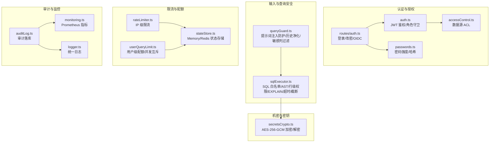
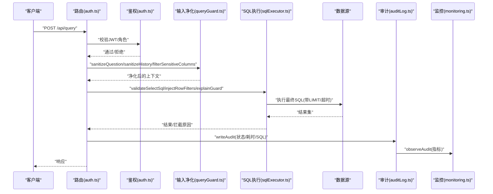
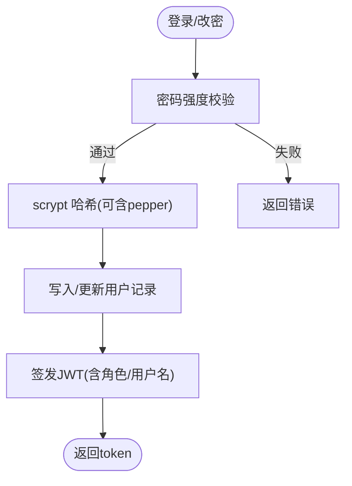
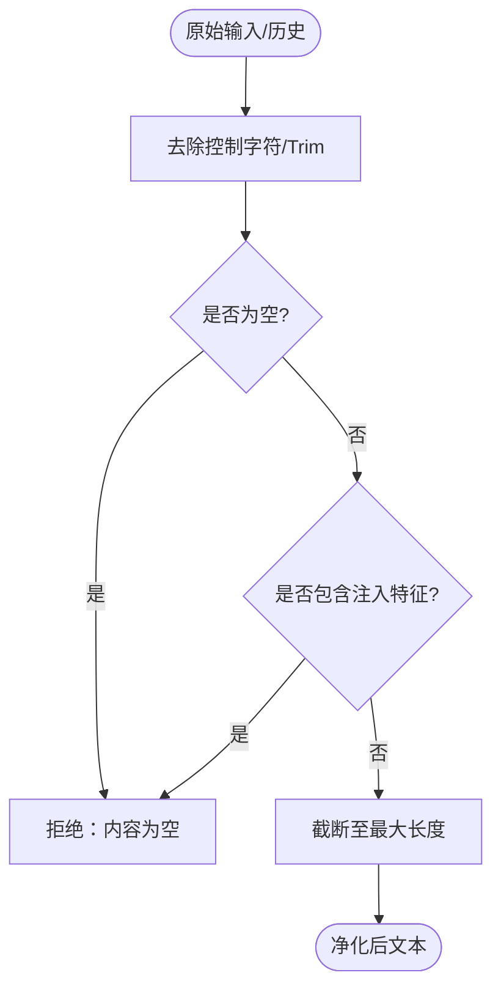
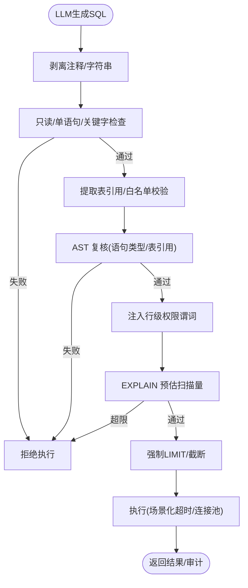
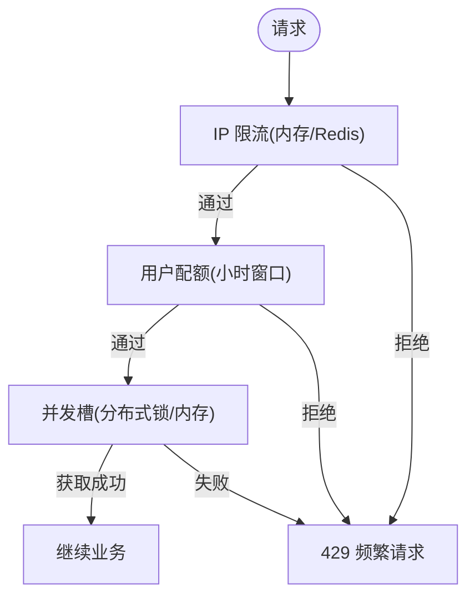
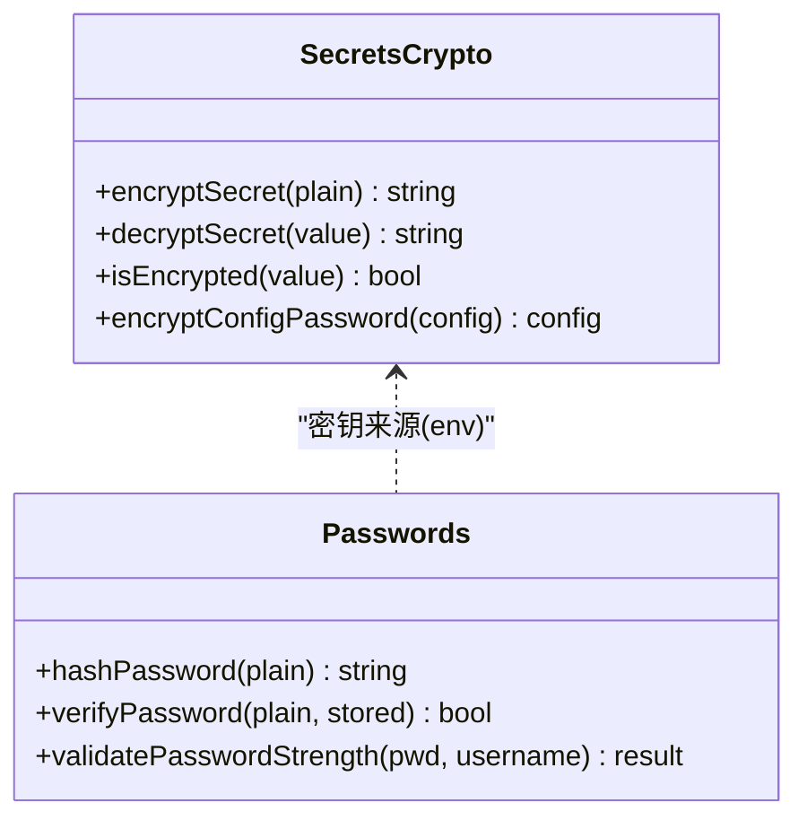
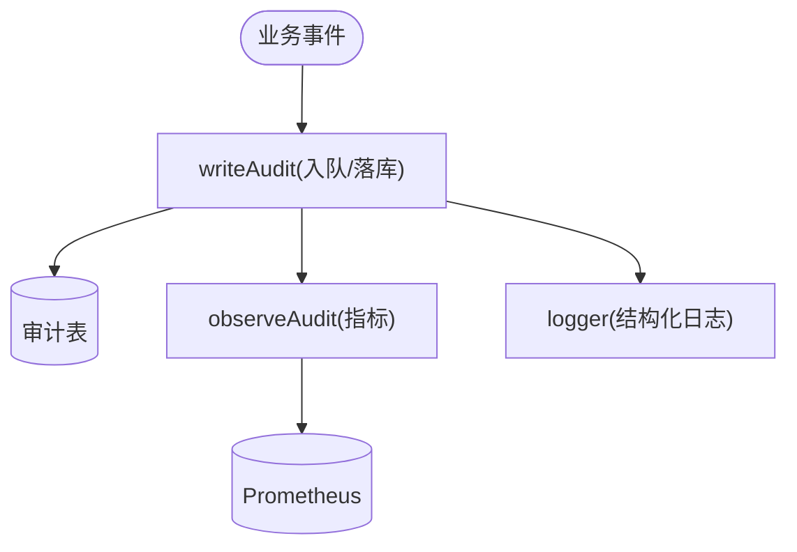
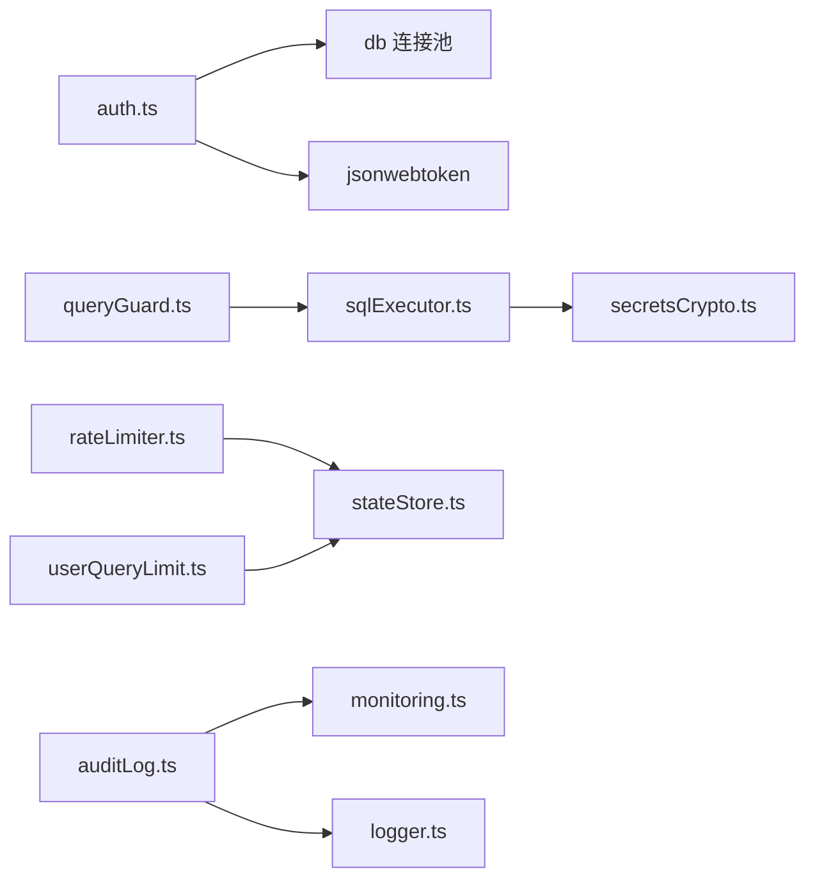

# 安全防护

<cite>
**本文引用的文件**
- [server/auth/auth.ts](file://server/auth/auth.ts)
- [server/routes/auth.ts](file://server/routes/auth.ts)
- [server/auth/passwords.ts](file://server/auth/passwords.ts)
- [server/auth/accessControl.ts](file://server/auth/accessControl.ts)
- [server/infra/secretsCrypto.ts](file://server/infra/secretsCrypto.ts)
- [server/infra/rateLimiter.ts](file://server/infra/rateLimiter.ts)
- [server/infra/userQueryLimit.ts](file://server/infra/userQueryLimit.ts)
- [server/infra/stateStore.ts](file://server/infra/stateStore.ts)
- [server/query/queryGuard.ts](file://server/query/queryGuard.ts)
- [server/query/sqlExecutor.ts](file://server/query/sqlExecutor.ts)
- [server/infra/auditLog.ts](file://server/infra/auditLog.ts)
- [server/infra/monitoring.ts](file://server/infra/monitoring.ts)
- [server/infra/logger.ts](file://server/infra/logger.ts)
</cite>

## 目录
1. [简介](#简介)
2. [项目结构](#项目结构)
3. [核心组件](#核心组件)
4. [架构总览](#架构总览)
5. [详细组件分析](#详细组件分析)
6. [依赖关系分析](#依赖关系分析)
7. [性能与安全权衡](#性能与安全权衡)
8. [故障排查指南](#故障排查指南)
9. [结论](#结论)
10. [附录：配置与最佳实践](#附录配置与最佳实践)

## 简介
本文件面向企业级安全落地，围绕智能问数系统的安全防护机制进行系统化说明。内容覆盖：
- SQL 注入防护、输入验证、输出编码策略
- 敏感数据加密存储、传输加密、密钥管理
- 请求频率限制、用户配额、并发互斥、异常检测
- 安全配置、漏洞扫描、渗透测试建议
- 数据脱敏、日志脱敏、安全审计
- 常见攻击防护、安全最佳实践、应急响应流程

## 项目结构
安全相关能力按职责分层组织：
- 认证与授权：JWT 签发/校验、角色守卫、密码强度与哈希、OIDC 集成、数据源访问控制（ACL）
- 输入与查询安全：提示词注入防护、SQL 白名单与 AST 校验、行级权限注入、EXPLAIN 防线、结果行数截断
- 限流与配额：IP 级限流、用户级配额与并发互斥、Redis/内存双实现
- 机密与密钥：数据源凭据 AES-256-GCM 加密、scrypt 加盐哈希与 pepper
- 审计与监控：全链路审计落库、Prometheus 指标埋点、统一日志出口
- 状态存储抽象：Memory/Redis 统一接口，支撑限流、缓存、锁等

**图表来源**
- [server/auth/auth.ts:1-127](file://server/auth/auth.ts#L1-L127)
- [server/routes/auth.ts:1-156](file://server/routes/auth.ts#L1-L156)
- [server/auth/passwords.ts:1-100](file://server/auth/passwords.ts#L1-L100)
- [server/auth/accessControl.ts:1-108](file://server/auth/accessControl.ts#L1-L108)
- [server/query/queryGuard.ts:1-101](file://server/query/queryGuard.ts#L1-L101)
- [server/query/sqlExecutor.ts:1-832](file://server/query/sqlExecutor.ts#L1-L832)
- [server/infra/rateLimiter.ts:1-54](file://server/infra/rateLimiter.ts#L1-L54)
- [server/infra/userQueryLimit.ts:1-98](file://server/infra/userQueryLimit.ts#L1-L98)
- [server/infra/stateStore.ts:1-219](file://server/infra/stateStore.ts#L1-L219)
- [server/infra/secretsCrypto.ts:1-50](file://server/infra/secretsCrypto.ts#L1-L50)
- [server/infra/auditLog.ts:1-62](file://server/infra/auditLog.ts#L1-L62)
- [server/infra/monitoring.ts:1-153](file://server/infra/monitoring.ts#L1-L153)
- [server/infra/logger.ts:1-41](file://server/infra/logger.ts#L1-L41)

**章节来源**
- [server/auth/auth.ts:1-127](file://server/auth/auth.ts#L1-L127)
- [server/routes/auth.ts:1-156](file://server/routes/auth.ts#L1-L156)
- [server/query/sqlExecutor.ts:1-832](file://server/query/sqlExecutor.ts#L1-L832)
- [server/infra/rateLimiter.ts:1-54](file://server/infra/rateLimiter.ts#L1-L54)
- [server/infra/userQueryLimit.ts:1-98](file://server/infra/userQueryLimit.ts#L1-L98)
- [server/infra/secretsCrypto.ts:1-50](file://server/infra/secretsCrypto.ts#L1-L50)
- [server/infra/auditLog.ts:1-62](file://server/infra/auditLog.ts#L1-L62)
- [server/infra/monitoring.ts:1-153](file://server/infra/monitoring.ts#L1-L153)

## 核心组件
- 认证与授权
  - JWT 签发/校验与强制改密策略；每次鉴权回查用户状态，确保禁用/角色变更即时生效
  - 角色守卫用于细粒度路由保护
  - 密码强度校验与 scrypt 哈希，支持 pepper 与环境隔离
  - OIDC 集成（可选），统一身份接入
  - 数据源 ACL：部门/个人维度访问控制，与管理审批联动
- 输入与查询安全
  - 提示词注入特征拦截、控制字符清理、长度限制
  - 历史消息净化，防止模型输出回流污染上下文
  - 敏感列识别与剔除，避免进入 LLM 上下文
  - SQL 安全执行层：仅 SELECT、单语句、表名白名单、AST 复核、敏感列拒绝、强制 LIMIT、执行超时、结果行数截断、行级权限注入、EXPLAIN 预估扫描量拦截
- 限流与配额
  - IP 级滑动窗口限流（内存或 Redis 固定窗口）
  - 用户级每小时配额 + 同用户并发互斥（分布式锁/内存槽）
- 机密与密钥
  - 数据源凭据 AES-256-GCM 加密存储，迁移期兼容明文
  - 密码哈希使用 scrypt，参数可调，支持 pepper
- 审计与监控
  - 全链路审计落库（成功/降级/错误/拒绝），失败不阻塞主流程
  - Prometheus 指标埋点（低基数 label，fail-open）
  - 统一日志出口，级别可控

**章节来源**
- [server/auth/auth.ts:1-127](file://server/auth/auth.ts#L1-L127)
- [server/auth/passwords.ts:1-100](file://server/auth/passwords.ts#L1-L100)
- [server/auth/accessControl.ts:1-108](file://server/auth/accessControl.ts#L1-L108)
- [server/query/queryGuard.ts:1-101](file://server/query/queryGuard.ts#L1-L101)
- [server/query/sqlExecutor.ts:1-832](file://server/query/sqlExecutor.ts#L1-L832)
- [server/infra/rateLimiter.ts:1-54](file://server/infra/rateLimiter.ts#L1-L54)
- [server/infra/userQueryLimit.ts:1-98](file://server/infra/userQueryLimit.ts#L1-L98)
- [server/infra/secretsCrypto.ts:1-50](file://server/infra/secretsCrypto.ts#L1-L50)
- [server/infra/auditLog.ts:1-62](file://server/infra/auditLog.ts#L1-L62)
- [server/infra/monitoring.ts:1-153](file://server/infra/monitoring.ts#L1-L153)

## 架构总览
下图展示一次“问数”请求从前端到数据库的完整安全路径，涵盖认证、输入净化、SQL 安全执行、审计与监控。

**图表来源**
- [server/routes/auth.ts:1-156](file://server/routes/auth.ts#L1-L156)
- [server/auth/auth.ts:1-127](file://server/auth/auth.ts#L1-L127)
- [server/query/queryGuard.ts:1-101](file://server/query/queryGuard.ts#L1-L101)
- [server/query/sqlExecutor.ts:1-832](file://server/query/sqlExecutor.ts#L1-L832)
- [server/infra/auditLog.ts:1-62](file://server/infra/auditLog.ts#L1-L62)
- [server/infra/monitoring.ts:1-153](file://server/infra/monitoring.ts#L1-L153)

## 详细组件分析

### 认证与授权（JWT、角色、密码、ACL、OIDC）
- JWT 签发与校验：服务端在鉴权中间件中解析 token 并回查用户状态，附加 req.user；支持强制首次改密策略
- 角色守卫：基于角色的路由级访问控制
- 密码强度与哈希：统一入口校验，scrypt 加盐，支持 pepper；兼容旧格式
- OIDC：可选的统一身份登录流程（授权码模式）
- 数据源 ACL：部门/个人维度授权，管理员豁免；提供审批并入个人授权的原子更新

**图表来源**
- [server/routes/auth.ts:41-77](file://server/routes/auth.ts#L41-L77)
- [server/auth/passwords.ts:30-56](file://server/auth/passwords.ts#L30-L56)
- [server/auth/auth.ts:60-64](file://server/auth/auth.ts#L60-L64)

**章节来源**
- [server/auth/auth.ts:1-127](file://server/auth/auth.ts#L1-L127)
- [server/routes/auth.ts:1-156](file://server/routes/auth.ts#L1-L156)
- [server/auth/passwords.ts:1-100](file://server/auth/passwords.ts#L1-L100)
- [server/auth/accessControl.ts:1-108](file://server/auth/accessControl.ts#L1-L108)

### 输入净化与提示词注入防护
- 控制字符清理、空值校验、长度限制
- 提示词注入特征匹配（中英文），命中即拒绝
- 历史消息净化：仅保留 user 消息，丢弃 assistant 输出，防止上下文污染
- 敏感列识别：将疑似敏感列从 Schema 中剔除，避免泄露至 LLM 上下文

**图表来源**
- [server/query/queryGuard.ts:27-69](file://server/query/queryGuard.ts#L27-L69)

**章节来源**
- [server/query/queryGuard.ts:1-101](file://server/query/queryGuard.ts#L1-L101)

### SQL 安全执行层（防注入、白名单、AST、行级权限、EXPLAIN、超时、截断）
- 仅允许 SELECT，单语句，禁止危险关键字与 INTO 写操作
- 表名白名单校验（结合 scope 与敏感列过滤后的 Schema）
- AST 二道防线：语法树级复核语句类型与表引用
- 行级权限注入：对受控表自动包裹 WHERE 谓词，递归处理子查询/CTE/UNION
- EXPLAIN 防线：预估扫描行数超阈值则拦截，保护后端数据库
- 强制 LIMIT 与结果行数截断；MySQL 注入 MAX_EXECUTION_TIME hint
- 场景化连接池与超时：交互/分析链/导出独立配额与超时档位

**图表来源**
- [server/query/sqlExecutor.ts:155-387](file://server/query/sqlExecutor.ts#L155-L387)
- [server/query/sqlExecutor.ts:389-489](file://server/query/sqlExecutor.ts#L389-L489)
- [server/query/sqlExecutor.ts:531-662](file://server/query/sqlExecutor.ts#L531-L662)
- [server/query/sqlExecutor.ts:686-726](file://server/query/sqlExecutor.ts#L686-L726)

**章节来源**
- [server/query/sqlExecutor.ts:1-832](file://server/query/sqlExecutor.ts#L1-L832)

### 限流与配额（IP 级、用户级、并发互斥）
- IP 级限流：内存滑动窗口或 Redis 固定分钟窗口计数，超限返回 429
- 用户级配额：每小时 N 次上限（默认 20），Redis 模式为固定小时窗口 INCR
- 并发互斥：同一用户同时仅允许一个进行中查询，Redis 分布式锁或内存槽，TTL 兜底释放

**图表来源**
- [server/infra/rateLimiter.ts:14-42](file://server/infra/rateLimiter.ts#L14-L42)
- [server/infra/userQueryLimit.ts:24-68](file://server/infra/userQueryLimit.ts#L24-L68)
- [server/infra/stateStore.ts:140-162](file://server/infra/stateStore.ts#L140-L162)

**章节来源**
- [server/infra/rateLimiter.ts:1-54](file://server/infra/rateLimiter.ts#L1-L54)
- [server/infra/userQueryLimit.ts:1-98](file://server/infra/userQueryLimit.ts#L1-L98)
- [server/infra/stateStore.ts:1-219](file://server/infra/stateStore.ts#L1-L219)

### 机密与密钥（数据源凭据加密、密码哈希）
- 数据源凭据：AES-256-GCM 加密存储，密文前缀标识；解密密钥来自环境变量派生，缺失时启动拦截
- 密码哈希：scrypt 加盐，参数可调，支持 pepper；兼容旧格式；弱口令黑名单
- 密钥管理：生产环境必须配置强密钥；开发环境随机密钥（重启失效）

**图表来源**
- [server/infra/secretsCrypto.ts:1-50](file://server/infra/secretsCrypto.ts#L1-L50)
- [server/auth/passwords.ts:1-100](file://server/auth/passwords.ts#L1-L100)

**章节来源**
- [server/infra/secretsCrypto.ts:1-50](file://server/infra/secretsCrypto.ts#L1-L50)
- [server/auth/passwords.ts:1-100](file://server/auth/passwords.ts#L1-L100)

### 审计与监控（全链路审计、指标、日志）
- 审计落库：记录用户、端点、状态、SQL、行数、耗时；写入失败仅告警不阻塞主流程
- 指标埋点：低基数 label，fail-open；覆盖 NL2SQL、缓存、LLM、SQL 执行、HTTP 接口
- 统一日志：级别可控，test 环境降噪

**图表来源**
- [server/infra/auditLog.ts:38-62](file://server/infra/auditLog.ts#L38-L62)
- [server/infra/monitoring.ts:92-133](file://server/infra/monitoring.ts#L92-L133)
- [server/infra/logger.ts:1-41](file://server/infra/logger.ts#L1-L41)

**章节来源**
- [server/infra/auditLog.ts:1-62](file://server/infra/auditLog.ts#L1-L62)
- [server/infra/monitoring.ts:1-153](file://server/infra/monitoring.ts#L1-L153)
- [server/infra/logger.ts:1-41](file://server/infra/logger.ts#L1-L41)

## 依赖关系分析
- 认证模块依赖数据库连接池与 JWT 库；鉴权中间件在路由前执行，影响后续所有受保护接口
- 输入净化与 SQL 执行层串联：先净化再校验，AST 与正则双重保障；行级权限注入在真执行前完成
- 限流与配额依赖状态存储抽象，支持内存/Redis 切换；多实例部署推荐 Redis
- 审计与监控作为旁路，不影响主流程可用性
- 机密模块被数据源配置加载与密码模块复用

**图表来源**
- [server/auth/auth.ts:1-127](file://server/auth/auth.ts#L1-L127)
- [server/query/queryGuard.ts:1-101](file://server/query/queryGuard.ts#L1-L101)
- [server/query/sqlExecutor.ts:1-832](file://server/query/sqlExecutor.ts#L1-L832)
- [server/infra/rateLimiter.ts:1-54](file://server/infra/rateLimiter.ts#L1-L54)
- [server/infra/userQueryLimit.ts:1-98](file://server/infra/userQueryLimit.ts#L1-L98)
- [server/infra/stateStore.ts:1-219](file://server/infra/stateStore.ts#L1-L219)
- [server/infra/secretsCrypto.ts:1-50](file://server/infra/secretsCrypto.ts#L1-L50)
- [server/infra/auditLog.ts:1-62](file://server/infra/auditLog.ts#L1-L62)
- [server/infra/monitoring.ts:1-153](file://server/infra/monitoring.ts#L1-L153)
- [server/infra/logger.ts:1-41](file://server/infra/logger.ts#L1-L41)

**章节来源**
- [server/auth/auth.ts:1-127](file://server/auth/auth.ts#L1-L127)
- [server/query/sqlExecutor.ts:1-832](file://server/query/sqlExecutor.ts#L1-L832)
- [server/infra/stateStore.ts:1-219](file://server/infra/stateStore.ts#L1-L219)

## 性能与安全权衡
- SQL 执行层采用“正则+AST”双重校验，兼顾误杀率与安全性；CTE 场景下优先 AST 解析，失败 fail-closed
- EXPLAIN 防线以预估扫描量为依据，保护后端数据库免受大范围扫描；EXPLAIN 失败 fail-open 放行但不影响安全底线
- 连接池按场景分级（交互/分析链/导出），避免后台任务挤占交互资源；超时按场景差异化配置
- 限流与配额在 Redis 模式下具备全局共享与 TTL 自动过期能力，提升多实例可用性与一致性
- 审计与监控采用旁路设计，失败不阻塞主流程，保证高可用

**章节来源**
- [server/query/sqlExecutor.ts:111-153](file://server/query/sqlExecutor.ts#L111-L153)
- [server/query/sqlExecutor.ts:531-662](file://server/query/sqlExecutor.ts#L531-L662)
- [server/infra/rateLimiter.ts:1-54](file://server/infra/rateLimiter.ts#L1-L54)
- [server/infra/userQueryLimit.ts:1-98](file://server/infra/userQueryLimit.ts#L1-L98)
- [server/infra/monitoring.ts:1-153](file://server/infra/monitoring.ts#L1-L153)

## 故障排查指南
- 登录失败/权限不足
  - 检查 JWT_SECRET 是否配置；确认用户状态与角色；查看鉴权中间件日志
  - 参考：[server/auth/auth.ts:66-113](file://server/auth/auth.ts#L66-L113)、[server/routes/auth.ts:41-77](file://server/routes/auth.ts#L41-L77)
- 提示词注入/输入被拒
  - 检查输入是否命中注入特征；查看净化日志
  - 参考：[server/query/queryGuard.ts:27-69](file://server/query/queryGuard.ts#L27-L69)
- SQL 被拒绝/未执行
  - 检查是否非 SELECT、包含危险关键字、引用范围外表、涉及敏感列；查看 AST 与白名单
  - 参考：[server/query/sqlExecutor.ts:155-387](file://server/query/sqlExecutor.ts#L155-L387)
- EXPLAIN 拦截
  - 调整查询条件缩小范围；或根据场景提高阈值
  - 参考：[server/query/sqlExecutor.ts:531-662](file://server/query/sqlExecutor.ts#L531-L662)
- 限流/配额触发
  - 检查 IP 与用户级配额；Redis 模式下关注键空间与 TTL
  - 参考：[server/infra/rateLimiter.ts:14-42](file://server/infra/rateLimiter.ts#L14-L42)、[server/infra/userQueryLimit.ts:24-68](file://server/infra/userQueryLimit.ts#L24-L68)
- 审计/指标异常
  - 检查审计表写入与 Prometheus 采集；确认低基数 label 配置
  - 参考：[server/infra/auditLog.ts:38-62](file://server/infra/auditLog.ts#L38-L62)、[server/infra/monitoring.ts:92-133](file://server/infra/monitoring.ts#L92-L133)

**章节来源**
- [server/auth/auth.ts:66-113](file://server/auth/auth.ts#L66-L113)
- [server/routes/auth.ts:41-77](file://server/routes/auth.ts#L41-L77)
- [server/query/queryGuard.ts:27-69](file://server/query/queryGuard.ts#L27-L69)
- [server/query/sqlExecutor.ts:155-387](file://server/query/sqlExecutor.ts#L155-L387)
- [server/query/sqlExecutor.ts:531-662](file://server/query/sqlExecutor.ts#L531-L662)
- [server/infra/rateLimiter.ts:14-42](file://server/infra/rateLimiter.ts#L14-L42)
- [server/infra/userQueryLimit.ts:24-68](file://server/infra/userQueryLimit.ts#L24-L68)
- [server/infra/auditLog.ts:38-62](file://server/infra/auditLog.ts#L38-L62)
- [server/infra/monitoring.ts:92-133](file://server/infra/monitoring.ts#L92-L133)

## 结论
本系统构建了从输入到执行的纵深防御体系：认证授权、输入净化、SQL 白名单与 AST 校验、行级权限、EXPLAIN 防线、结果截断与超时控制，配合 IP 级限流、用户级配额与并发互斥，形成多层次防护。机密管理通过 AES-256-GCM 与 scrypt 哈希强化数据安全。审计与监控提供可观测性，便于问题定位与持续改进。整体设计在高可用前提下最大化安全边界，适合企业级部署。

## 附录：配置与最佳实践
- 密钥与机密
  - 生产环境必须配置 JWT_SECRET、DS_SECRET_KEY；必要时启用 SCRYPT_PEPPER
  - 定期轮换密钥；密钥与代码分离，使用密钥管理服务
  - 参考：[server/auth/auth.ts:46-58](file://server/auth/auth.ts#L46-L58)、[server/infra/secretsCrypto.ts:11-21](file://server/infra/secretsCrypto.ts#L11-L21)、[server/auth/passwords.ts:15-16](file://server/auth/passwords.ts#L15-L16)
- 输入与查询
  - 保持提示词注入特征清单保守更新；定期评估误杀率
  - 合理设置 MAX_ROWS、EXPLAIN 阈值与场景化超时
  - 参考：[server/query/queryGuard.ts:7-10](file://server/query/queryGuard.ts#L7-L10)、[server/query/sqlExecutor.ts:41-42](file://server/query/sqlExecutor.ts#L41-L42)、[server/query/sqlExecutor.ts:531-540](file://server/query/sqlExecutor.ts#L531-L540)
- 限流与配额
  - 多实例部署启用 REDIS_URL；根据业务调整 RATE_LIMIT_MAX、USER_QUERY_RATE_MAX
  - 参考：[server/infra/rateLimiter.ts:9-12](file://server/infra/rateLimiter.ts#L9-L12)、[server/infra/userQueryLimit.ts:9-12](file://server/infra/userQueryLimit.ts#L9-L12)、[server/infra/stateStore.ts:169-187](file://server/infra/stateStore.ts#L169-L187)
- 审计与监控
  - 开启 Prometheus 指标采集；配置 METRICS_TOKEN 保护 /metrics
  - 定期审查审计日志，识别异常模式与潜在风险
  - 参考：[server/infra/monitoring.ts:135-153](file://server/infra/monitoring.ts#L135-L153)、[server/infra/auditLog.ts:38-62](file://server/infra/auditLog.ts#L38-L62)
- 安全配置与运维
  - 最小权限原则：数据源账号仅授予必要权限；启用行级权限与 ACL
  - 网络层：仅暴露必要端口；使用反向代理与 TLS 终止
  - 漏洞扫描与渗透测试：定期扫描依赖与容器镜像；模拟注入、越权、爆破等攻击面
  - 应急响应：发现异常立即收紧限流/配额、关闭可疑数据源访问、冻结账户、回溯审计日志

**章节来源**
- [server/auth/auth.ts:46-58](file://server/auth/auth.ts#L46-L58)
- [server/infra/secretsCrypto.ts:11-21](file://server/infra/secretsCrypto.ts#L11-L21)
- [server/auth/passwords.ts:15-16](file://server/auth/passwords.ts#L15-L16)
- [server/query/queryGuard.ts:7-10](file://server/query/queryGuard.ts#L7-L10)
- [server/query/sqlExecutor.ts:41-42](file://server/query/sqlExecutor.ts#L41-L42)
- [server/query/sqlExecutor.ts:531-540](file://server/query/sqlExecutor.ts#L531-L540)
- [server/infra/rateLimiter.ts:9-12](file://server/infra/rateLimiter.ts#L9-L12)
- [server/infra/userQueryLimit.ts:9-12](file://server/infra/userQueryLimit.ts#L9-L12)
- [server/infra/stateStore.ts:169-187](file://server/infra/stateStore.ts#L169-L187)
- [server/infra/monitoring.ts:135-153](file://server/infra/monitoring.ts#L135-L153)
- [server/infra/auditLog.ts:38-62](file://server/infra/auditLog.ts#L38-L62)