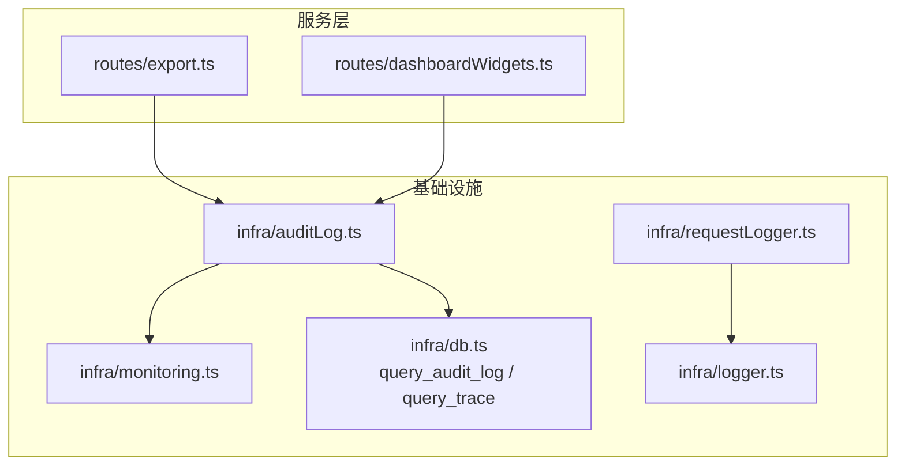
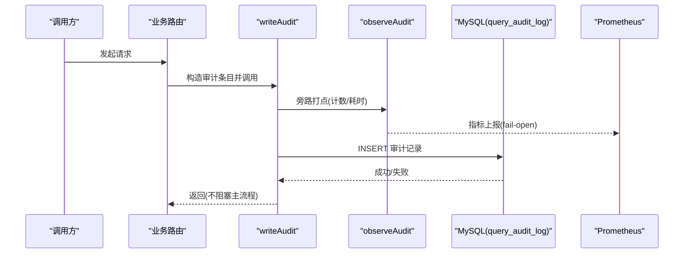
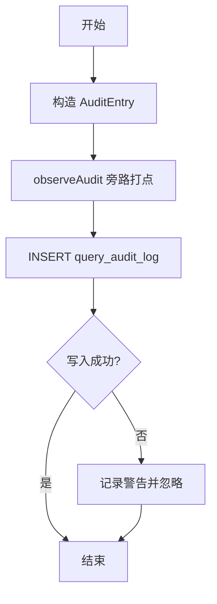
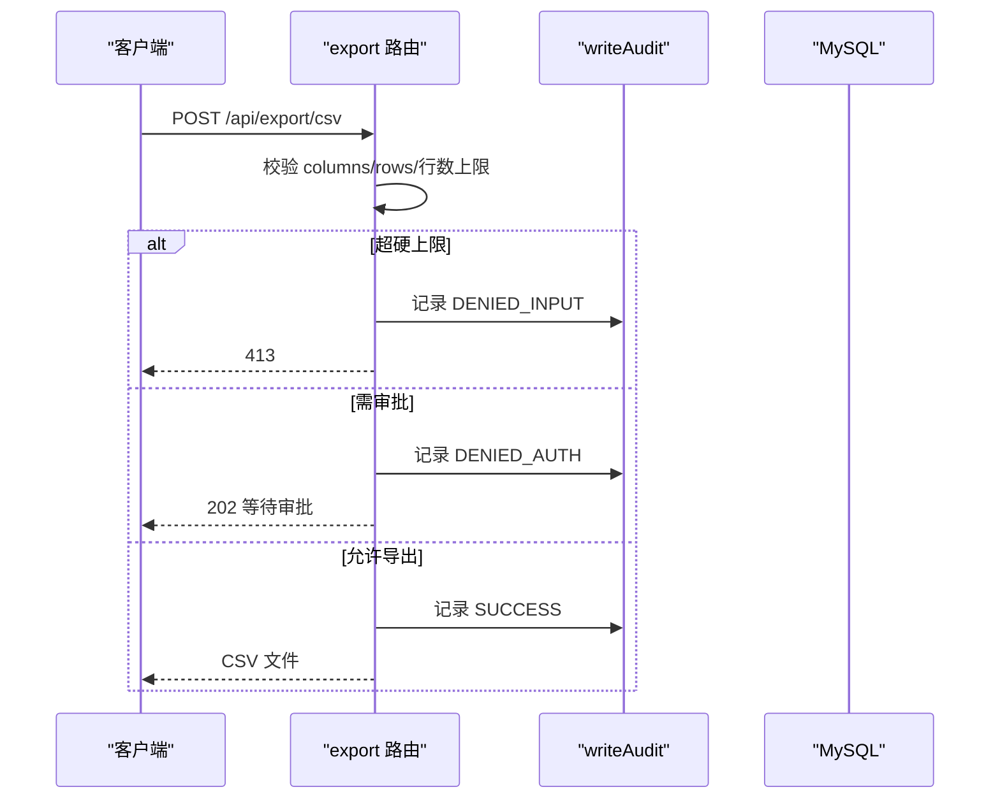
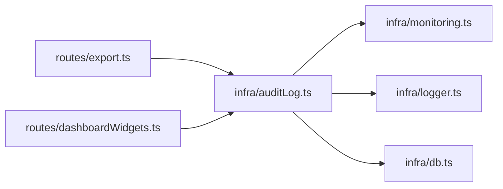

# 审计日志

<cite>
**本文引用的文件**
- [auditLog.ts](file://server/infra/auditLog.ts)
- [logger.ts](file://server/infra/logger.ts)
- [requestLogger.ts](file://server/infra/requestLogger.ts)
- [monitoring.ts](file://server/infra/monitoring.ts)
- [db.ts](file://server/infra/db.ts)
- [export.ts](file://server/routes/export.ts)
- [dashboardWidgets.ts](file://server/routes/dashboardWidgets.ts)
- [reconcile-metrics.ts](file://scripts/reconcile-metrics.ts)
</cite>

## 目录
1. [简介](#简介)
2. [项目结构](#项目结构)
3. [核心组件](#核心组件)
4. [架构总览](#架构总览)
5. [详细组件分析](#详细组件分析)
6. [依赖关系分析](#依赖关系分析)
7. [性能与容量规划](#性能与容量规划)
8. [故障排查指南](#故障排查指南)
9. [结论](#结论)
10. [附录：查询、合规与报表](#附录：查询合规与报表)

## 简介
本文件面向企业级“智能问数”系统的审计日志能力，系统性说明操作审计记录机制（用户行为追踪、关键操作记录、变更历史追溯）、日志结构与级别管理、存储策略、敏感信息过滤与脱敏、查询分析与合规报告导出、归档策略、性能优化、故障排查，以及与 SIEM 集成、实时告警和合规审计等特性。

## 项目结构
审计相关能力集中在 server/infra 层，并通过各业务路由在关键操作点调用统一写入接口；监控指标通过 Prometheus 暴露；数据库表由初始化脚本创建并维护索引。

图表来源
- [auditLog.ts:38-61](file://server/infra/auditLog.ts#L38-L61)
- [monitoring.ts:92-100](file://server/infra/monitoring.ts#L92-L100)
- [db.ts:180-234](file://server/infra/db.ts#L180-L234)
- [export.ts:91-165](file://server/routes/export.ts#L91-L165)
- [dashboardWidgets.ts:100-180](file://server/routes/dashboardWidgets.ts#L100-L180)

章节来源
- [auditLog.ts:1-62](file://server/infra/auditLog.ts#L1-L62)
- [monitoring.ts:1-153](file://server/infra/monitoring.ts#L1-L153)
- [db.ts:180-234](file://server/infra/db.ts#L180-L234)
- [export.ts:1-200](file://server/routes/export.ts#L1-L200)
- [dashboardWidgets.ts:1-180](file://server/routes/dashboardWidgets.ts#L1-L180)
- [requestLogger.ts:1-36](file://server/infra/requestLogger.ts#L1-L36)
- [logger.ts:1-41](file://server/infra/logger.ts#L1-L41)

## 核心组件
- 审计写入入口：统一通过 writeAudit 将请求终态落库，包含成功、降级、错误与被拒绝等状态，写入失败仅告警不阻塞主流程。
- 监控埋点：observeAudit 对同一写路径进行旁路打点（计数+直方图），fail-open 不影响业务可用性。
- 访问日志：为每个 /api 请求生成 requestId 并记录方法、URL、状态码与耗时，便于关联审计记录。
- 存储模型：query_audit_log 表包含用户、端点、数据源、问题摘要、状态、详情、执行 SQL、行数、耗时与时间戳，并提供按用户与时间的索引。
- 链路追踪：query_trace 表用于全链路步骤留痕，支撑事后回放与根因定位。

章节来源
- [auditLog.ts:10-61](file://server/infra/auditLog.ts#L10-L61)
- [monitoring.ts:19-35](file://server/infra/monitoring.ts#L19-L35)
- [requestLogger.ts:19-35](file://server/infra/requestLogger.ts#L19-L35)
- [db.ts:180-234](file://server/infra/db.ts#L180-L234)

## 架构总览
审计系统采用“单点写入 + 旁路监控 + 结构化访问日志”的架构：业务路由在关键操作点调用 writeAudit；writeAudit 同时触发 observeAudit 上报指标，并异步落库；若落库失败仅记录警告，确保高可用。

图表来源
- [auditLog.ts:38-61](file://server/infra/auditLog.ts#L38-L61)
- [monitoring.ts:92-100](file://server/infra/monitoring.ts#L92-L100)
- [db.ts:180-199](file://server/infra/db.ts#L180-L199)

## 详细组件分析

### 审计写入与状态机
- 状态枚举覆盖 SUCCESS、CACHE、FALLBACK、ERROR、CLARIFY、REFUSED、QUEUED、DENIED_INPUT、DENIED_AUTH、DENIED_RATE、DENIED_SWITCH，覆盖问数全链路终态。
- 字段设计：
  - 用户维度：userId、username
  - 资源维度：endpoint、dataSourceId、question
  - 结果维度：status、detail、executedSql、rowCount、durationMs
  - 时间维度：created_at
- 安全与健壮性：
  - 字符串长度截断（如 question ≤500、executedSql ≤2000）
  - 写入失败仅 warn 告警，不抛错到上层
  - 旁路指标统计 fail-open

图表来源
- [auditLog.ts:38-61](file://server/infra/auditLog.ts#L38-L61)

章节来源
- [auditLog.ts:10-61](file://server/infra/auditLog.ts#L10-L61)

### 监控指标与可观测性
- 指标类型：
  - nl2sql_requests_total：按 status、endpoint 计数
  - nl2sql_duration_seconds：按 status 的耗时直方图
  - http_request_duration_seconds：HTTP 接口耗时
  - llm_call_duration_seconds、llm_tokens_total：LLM 用量
  - sql_execute_duration_seconds、sql_explain_guard_total：SQL 执行与 EXPLAIN 防线
- 暴露方式：/metrics 端点，支持可选 METRICS_TOKEN 鉴权
- 设计原则：低基数 label、fail-open、不侵入热路径

章节来源
- [monitoring.ts:1-153](file://server/infra/monitoring.ts#L1-L153)

### 访问日志与请求关联
- 为每个请求生成唯一 requestId，并在响应头回传 X-Request-Id，便于前端与后端日志关联。
- 仅记录 /api/* 请求，避免静态资源噪音。
- 结合审计记录中的 userId、username、endpoint、durationMs 等字段，可在 SIEM 中做跨日志关联。

章节来源
- [requestLogger.ts:1-36](file://server/infra/requestLogger.ts#L1-L36)
- [logger.ts:1-41](file://server/infra/logger.ts#L1-L41)

### 存储模型与索引
- query_audit_log：
  - 主键 id，用户/端点/时间索引
  - 关键字段：user_id、username、endpoint、data_source_id、question、status、detail、executed_sql、row_count、duration_ms、created_at
- query_trace：
  - 以 trace_id 串联一次问数的多步过程，便于回放与归因
- 迁移兼容：新增 executed_sql、row_count 列时幂等处理

章节来源
- [db.ts:180-234](file://server/infra/db.ts#L180-L234)

### 典型使用场景：CSV 导出审计
- 硬上限拦截：超过最大行数直接拒绝并记录 DENIED_INPUT
- 审批阈值：超过阈值且非管理员则生成下载审批单，记录 DENIED_AUTH
- 成功导出：记录 SUCCESS，附带水印信息与行数
- 审批动作：管理员通过/驳回均记录审计

图表来源
- [export.ts:91-165](file://server/routes/export.ts#L91-L165)
- [auditLog.ts:38-61](file://server/infra/auditLog.ts#L38-L61)

章节来源
- [export.ts:1-200](file://server/routes/export.ts#L1-L200)
- [auditLog.ts:10-61](file://server/infra/auditLog.ts#L10-L61)

### 看板与固定报表审计
- 看板图表固化、排序调整、删除等操作均记录审计，越权删除记录 DENIED_AUTH
- 固定报表保存与删除同样纳入审计

章节来源
- [dashboardWidgets.ts:100-180](file://server/routes/dashboardWidgets.ts#L100-L180)
- [auditLog.ts:10-61](file://server/infra/auditLog.ts#L10-L61)

## 依赖关系分析
- auditLog 依赖 db（连接池）、monitoring（指标）、logger（告警）
- 各路由依赖 auditLog 作为统一审计出口
- monitoring 暴露 /metrics 供采集
- db 负责表结构初始化与迁移

图表来源
- [export.ts:91-165](file://server/routes/export.ts#L91-L165)
- [dashboardWidgets.ts:100-180](file://server/routes/dashboardWidgets.ts#L100-L180)
- [auditLog.ts:38-61](file://server/infra/auditLog.ts#L38-L61)
- [monitoring.ts:92-100](file://server/infra/monitoring.ts#L92-L100)
- [db.ts:180-234](file://server/infra/db.ts#L180-L234)

章节来源
- [auditLog.ts:1-62](file://server/infra/auditLog.ts#L1-L62)
- [monitoring.ts:1-153](file://server/infra/monitoring.ts#L1-L153)
- [db.ts:180-234](file://server/infra/db.ts#L180-L234)

## 性能与容量规划
- 写入路径：
  - 旁路指标：observeAudit 全部 try/catch，零开销保障
  - 落库：异步 INSERT，失败仅 warn，不阻塞主流程
- 字段裁剪：
  - question/executedSql/detail 等文本字段限制长度，降低 IO 与存储压力
- 索引设计：
  - user_id + created_at、created_at 索引，支撑按用户与时间范围的高效查询
- 指标桶配置：
  - 耗时直方图覆盖 ms 到分钟级，兼顾缓存命中与长查询
- 建议：
  - 定期归档历史数据（如按月份分表或冷热分离）
  - 对高频 endpoint 与状态组合建立聚合视图或物化表
  - 结合 SIEM 侧流式消费，避免集中式拉取造成峰值抖动

[本节为通用指导，无需特定文件引用]

## 故障排查指南
- 审计未落库：
  - 检查数据库连接与权限
  - 查看 logger.warn 输出，确认是否捕获到写入异常
- 指标与数据不一致：
  - 使用 reconcile 脚本对比 Prometheus increase 与 query_audit_log 计数，定位重复/遗漏埋点
- 慢查询与超时：
  - 关注 nl2sql_duration_seconds 分布，定位长尾请求
  - 检查 SQL 执行耗时与 EXPLAIN 守卫统计
- 访问日志缺失：
  - 确认请求路径是否为 /api/*，以及 requestId 是否在响应头中返回

章节来源
- [auditLog.ts:58-61](file://server/infra/auditLog.ts#L58-L61)
- [reconcile-metrics.ts:84-114](file://scripts/reconcile-metrics.ts#L84-L114)
- [monitoring.ts:80-88](file://server/infra/monitoring.ts#L80-L88)
- [requestLogger.ts:19-35](file://server/infra/requestLogger.ts#L19-L35)

## 结论
本审计系统通过统一的 writeAudit 入口、旁路监控与结构化访问日志，实现了高可用、可扩展的企业级审计能力。配合 query_trace 与指标体系，可满足用户行为追踪、关键操作记录、变更历史追溯与合规审计需求。建议在生产环境启用 SIEM 集成、定时归档与对账脚本，持续优化性能与可观测性。

[本节为总结，无需特定文件引用]

## 附录：查询、合规与报表
- 查询与分析
  - 按用户/时间/端点/状态检索：基于 query_audit_log 的索引字段进行高效过滤
  - 链路回放：通过 trace_id 在 query_trace 中还原完整步骤
- 合规报告
  - 导出审计明细：从 query_audit_log 导出 CSV，结合 watermark 与审批记录形成证据链
  - 指标对账：使用 reconcile 脚本验证指标与审计表一致性
- 归档策略
  - 按时间分表或冷热分层，保留策略遵循合规要求
- SIEM 集成与实时告警
  - 将 query_audit_log 与 HTTP 访问日志接入 SIEM，设置规则：
    - 高频 DENIED_AUTH/DENIED_INPUT 告警
    - 大导出审批通过率异常告警
    - 长耗时请求突增告警
  - 通过 /metrics 暴露指标，供 Prometheus 采集与告警

章节来源
- [db.ts:180-234](file://server/infra/db.ts#L180-L234)
- [reconcile-metrics.ts:84-114](file://scripts/reconcile-metrics.ts#L84-L114)
- [monitoring.ts:135-153](file://server/infra/monitoring.ts#L135-L153)
- [export.ts:91-165](file://server/routes/export.ts#L91-L165)