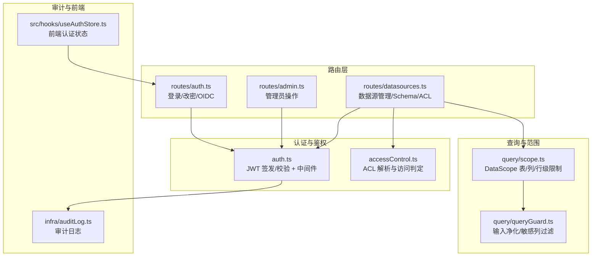
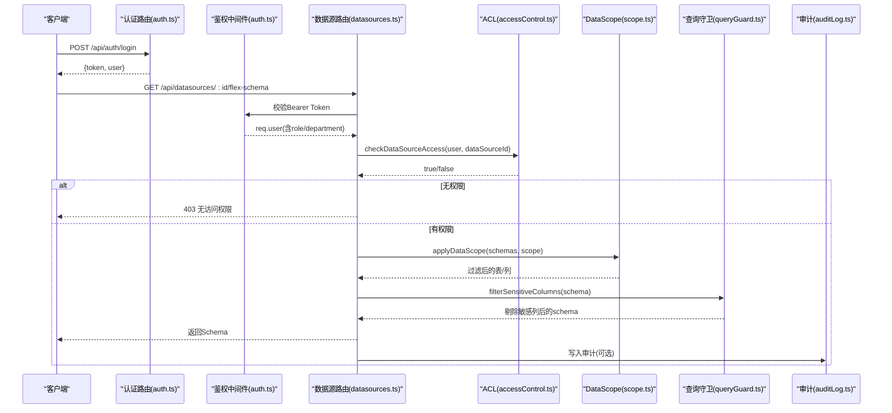
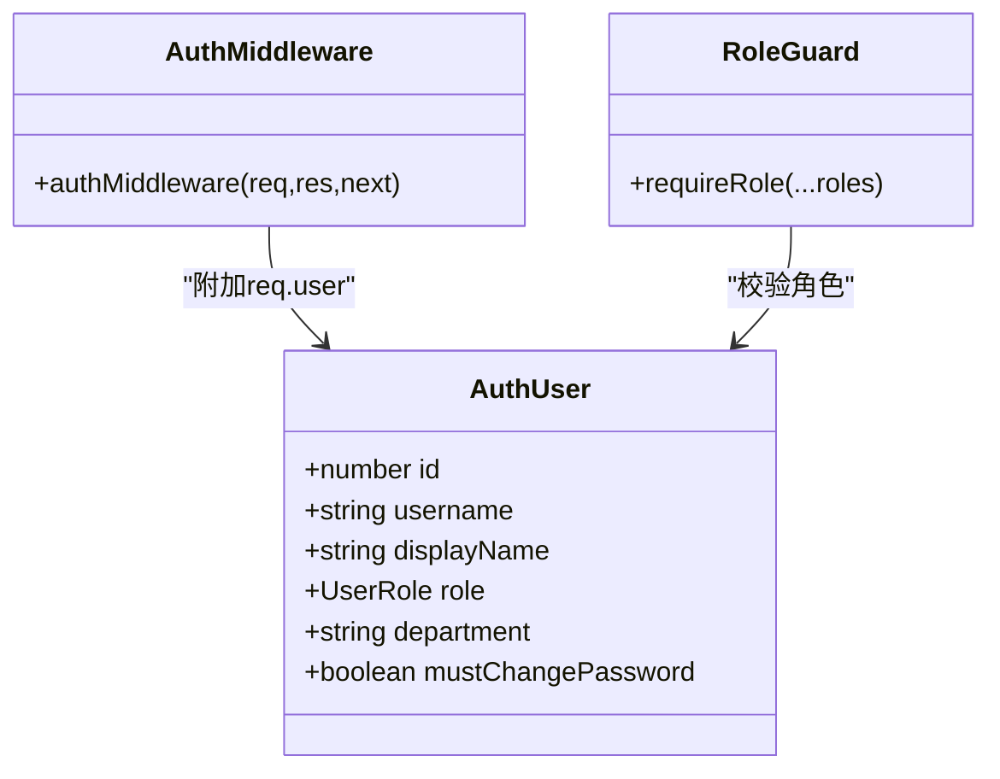
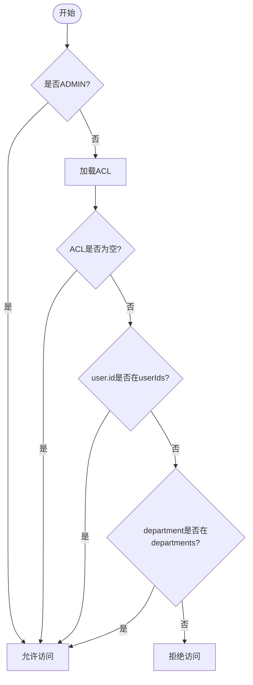
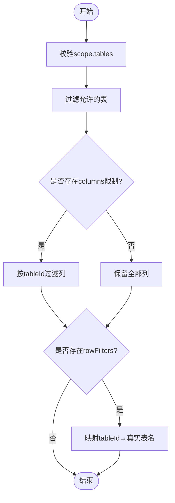
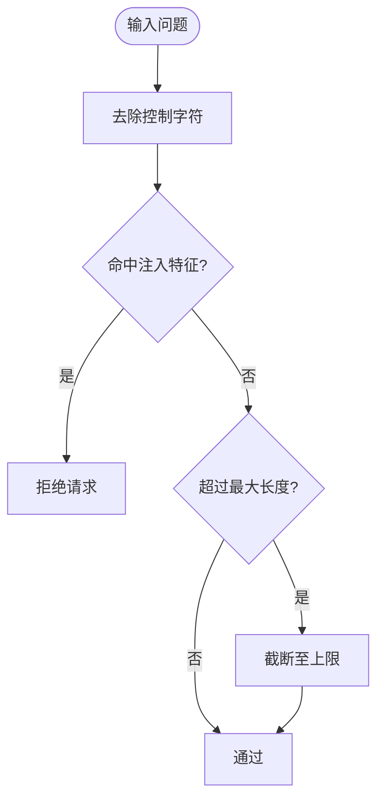
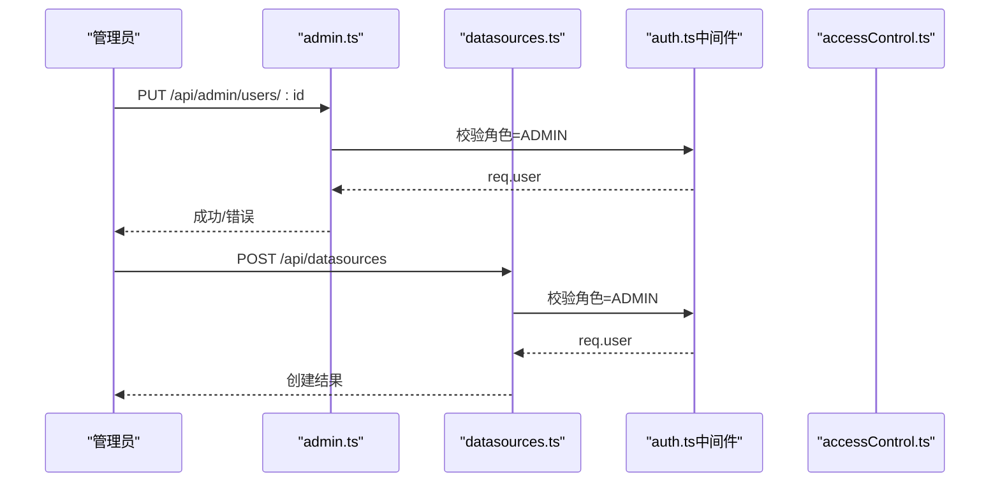
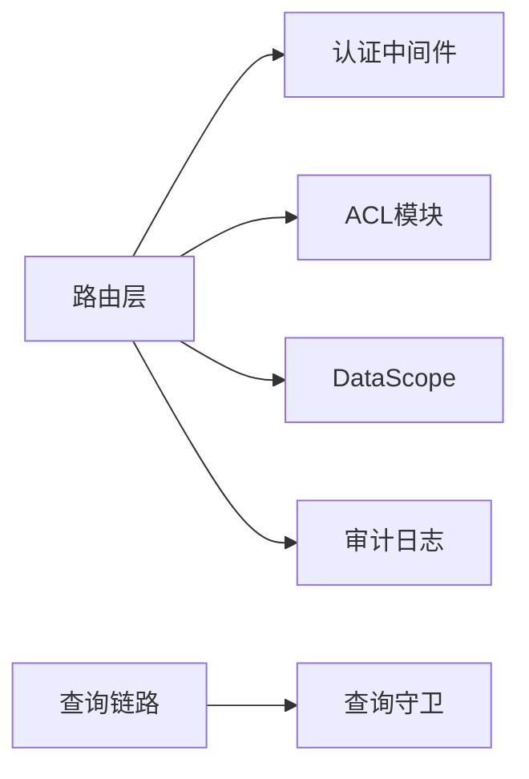

# 权限控制

<cite>
**本文引用的文件**
- [server/auth/auth.ts](file://server/auth/auth.ts)
- [server/auth/accessControl.ts](file://server/auth/accessControl.ts)
- [server/routes/auth.ts](file://server/routes/auth.ts)
- [server/routes/admin.ts](file://server/routes/admin.ts)
- [server/routes/datasources.ts](file://server/routes/datasources.ts)
- [server/query/scope.ts](file://server/query/scope.ts)
- [server/query/queryGuard.ts](file://server/query/queryGuard.ts)
- [server/infra/auditLog.ts](file://server/infra/auditLog.ts)
- [src/hooks/useAuthStore.ts](file://src/hooks/useAuthStore.ts)
</cite>

## 目录
1. [简介](#简介)
2. [项目结构](#项目结构)
3. [核心组件](#核心组件)
4. [架构总览](#架构总览)
5. [详细组件分析](#详细组件分析)
6. [依赖关系分析](#依赖关系分析)
7. [性能与可扩展性](#性能与可扩展性)
8. [故障排查指南](#故障排查指南)
9. [结论](#结论)
10. [附录：最佳实践与审计方案](#附录最佳实践与审计方案)

## 简介
本文件系统性地梳理并文档化基于角色的访问控制（RBAC）体系，覆盖用户角色定义、角色继承策略、资源级与操作级权限验证、数据范围限制、部门维度授权、数据源级别权限、API 接口权限管理、动态权限评估、以及权限审计方案。该体系以 JWT 认证为基础，结合 Express 中间件与路由守卫实现细粒度控制，并通过 ACL（访问控制清单）与 DataScope（数据范围）共同完成“能否访问”和“能访问哪些数据”的双重约束。

## 项目结构
权限相关代码主要分布在以下模块：
- 认证与鉴权：JWT 签发/校验、Express 鉴权中间件、角色守卫
- 数据源访问控制：ACL 解析、部门/个人白名单判定、服务端访问校验入口
- 路由层权限：登录、管理员操作、数据源管理等接口的角色与访问控制
- 数据范围与执行保护：表/列/行级范围过滤、敏感信息防护
- 审计日志：全链路审计落库与监控埋点
- 前端状态：本地存储 token 与用户信息、角色判断

**图表来源**
- [server/auth/auth.ts:60-126](file://server/auth/auth.ts#L60-L126)
- [server/auth/accessControl.ts:18-73](file://server/auth/accessControl.ts#L18-L73)
- [server/routes/auth.ts:41-153](file://server/routes/auth.ts#L41-L153)
- [server/routes/admin.ts:12-14](file://server/routes/admin.ts#L12-L14)
- [server/routes/datasources.ts:62-440](file://server/routes/datasources.ts#L62-L440)
- [server/query/scope.ts:10-101](file://server/query/scope.ts#L10-L101)
- [server/query/queryGuard.ts:38-100](file://server/query/queryGuard.ts#L38-L100)
- [server/infra/auditLog.ts:38-61](file://server/infra/auditLog.ts#L38-L61)
- [src/hooks/useAuthStore.ts:26-62](file://src/hooks/useAuthStore.ts#L26-L62)

**章节来源**
- [server/auth/auth.ts:60-126](file://server/auth/auth.ts#L60-L126)
- [server/auth/accessControl.ts:18-73](file://server/auth/accessControl.ts#L18-L73)
- [server/routes/auth.ts:41-153](file://server/routes/auth.ts#L41-L153)
- [server/routes/admin.ts:12-14](file://server/routes/admin.ts#L12-L14)
- [server/routes/datasources.ts:62-440](file://server/routes/datasources.ts#L62-L440)
- [server/query/scope.ts:10-101](file://server/query/scope.ts#L10-L101)
- [server/query/queryGuard.ts:38-100](file://server/query/queryGuard.ts#L38-L100)
- [server/infra/auditLog.ts:38-61](file://server/infra/auditLog.ts#L38-L61)
- [src/hooks/useAuthStore.ts:26-62](file://src/hooks/useAuthStore.ts#L26-L62)

## 核心组件
- 认证与角色
  - JWT 签发与校验：在鉴权中间件中验证 token 并回查用户状态，附加 req.user（包含 id、username、displayName、role、department、mustChangePassword）。
  - 角色守卫 requireRole：用于路由级角色校验，支持多角色组合。
- 数据源访问控制（ACL）
  - 解析 acl_json 为 departments/userIds 白名单；ADMIN 或空配置视为不限制。
  - checkDataSourceAccess：服务端统一入口，结合用户角色与 ACL 判定是否可访问某数据源。
- 数据范围（DataScope）
  - 表/列/行级限制：tables 白名单、columns 字段白名单、rowFilters 行级谓词（AST 强制注入）。
  - sanitizeDataScope：清洗漂移后的 scope，确保仅对存在表生效。
- 查询安全与敏感信息防护
  - 输入净化、历史净化、敏感列过滤，防止提示注入与敏感信息泄露。
- 审计日志
  - 全链路审计落库，记录成功、降级、拒绝等状态，失败不阻塞主流程。
- 前端认证状态
  - 本地持久化 token 与用户信息，提供 hasRole 等便捷方法。

**章节来源**
- [server/auth/auth.ts:60-126](file://server/auth/auth.ts#L60-L126)
- [server/auth/accessControl.ts:18-73](file://server/auth/accessControl.ts#L18-L73)
- [server/query/scope.ts:10-101](file://server/query/scope.ts#L10-L101)
- [server/query/queryGuard.ts:38-100](file://server/query/queryGuard.ts#L38-L100)
- [server/infra/auditLog.ts:38-61](file://server/infra/auditLog.ts#L38-L61)
- [src/hooks/useAuthStore.ts:26-62](file://src/hooks/useAuthStore.ts#L26-L62)

## 架构总览
下图展示了从请求进入、认证鉴权、到数据源访问控制与数据范围限制的完整链路。

**图表来源**
- [server/routes/auth.ts:41-77](file://server/routes/auth.ts#L41-L77)
- [server/auth/auth.ts:67-113](file://server/auth/auth.ts#L67-L113)
- [server/routes/datasources.ts:419-440](file://server/routes/datasources.ts#L419-L440)
- [server/auth/accessControl.ts:58-73](file://server/auth/accessControl.ts#L58-L73)
- [server/query/scope.ts:28-43](file://server/query/scope.ts#L28-L43)
- [server/query/queryGuard.ts:82-100](file://server/query/queryGuard.ts#L82-L100)
- [server/infra/auditLog.ts:38-61](file://server/infra/auditLog.ts#L38-L61)

## 详细组件分析

### 认证与角色（JWT + 中间件 + 角色守卫）
- 角色定义：ADMIN、ANALYST、VIEWER。
- 中间件职责：校验 Bearer token、回查用户状态、注入 req.user、处理强制改密拦截。
- 角色守卫：requireRole(...) 用于路由级权限控制，未通过则返回 401/403。

**图表来源**
- [server/auth/auth.ts:13-24](file://server/auth/auth.ts#L13-L24)
- [server/auth/auth.ts:67-126](file://server/auth/auth.ts#L67-L126)

**章节来源**
- [server/auth/auth.ts:60-126](file://server/auth/auth.ts#L60-L126)

### 数据源访问控制（ACL）
- 模型：data_sources.acl_json = { departments: string[], userIds: number[] }
- 规则：
  - NULL 或两组皆空 → 不限制（全员可见）
  - 非空 → 仅 ADMIN / 清单内部门成员 / 清单内个人用户可访问
- 函数：
  - parseAcl：解析原始值并归一化
  - canAccessDataSource：纯函数判定
  - loadDataSourceAcl：读取指定数据源的 ACL
  - checkDataSourceAccess：服务端统一入口
  - grantUserAccess：审批通过后并入个人授权
  - sanitizeAcl：入参清洗与长度上限

**图表来源**
- [server/auth/accessControl.ts:18-73](file://server/auth/accessControl.ts#L18-L73)

**章节来源**
- [server/auth/accessControl.ts:18-73](file://server/auth/accessControl.ts#L18-L73)

### 数据范围（DataScope）与行级权限
- 表/列限制：tables 白名单、columns[tableId] 字段白名单
- 行级权限：rowFilters[tableId] 谓词，执行层 AST 强制注入
- 清洗与映射：sanitizeDataScope 清理漂移；rowFiltersByTableName 将 tableId 映射到真实表名

**图表来源**
- [server/query/scope.ts:28-101](file://server/query/scope.ts#L28-L101)

**章节来源**
- [server/query/scope.ts:28-101](file://server/query/scope.ts#L28-L101)

### 查询安全与敏感信息防护
- 输入净化：去除控制字符、检测注入特征、截断超长提问
- 历史净化：仅保留 user 消息、丢弃 assistant 输出、最多保留最近 5 轮
- 敏感列过滤：匹配密码/密钥/身份证等模式，从 Schema 中剔除并记录 removed

**图表来源**
- [server/query/queryGuard.ts:38-53](file://server/query/queryGuard.ts#L38-L53)

**章节来源**
- [server/query/queryGuard.ts:38-100](file://server/query/queryGuard.ts#L38-L100)

### API 接口权限管理
- 登录与 OIDC：
  - /api/auth/login：限流器保护，校验用户名/密码，签发 JWT
  - /api/auth/me：需鉴权，返回当前用户
  - /api/auth/change-password：需鉴权，统一强度校验
  - /api/auth/oidc/*：企业统一登录流程
- 管理员路由：
  - /api/admin/*：全局挂载 authMiddleware + requireRole('ADMIN')
  - 自我保护：不能修改/删除自己，至少保留一个 ACTIVE 管理员
- 数据源路由：
  - 列表：所有登录用户可见，非 ADMIN 剥离 tables 详情；ACL 控制 accessDenied
  - flex-schema：需 ADMIN/ANALYST 且通过 checkDataSourceAccess
  - 创建/更新/同步/导入：仅 ADMIN

**图表来源**
- [server/routes/admin.ts:12-14](file://server/routes/admin.ts#L12-L14)
- [server/routes/auth.ts:41-153](file://server/routes/auth.ts#L41-L153)
- [server/routes/datasources.ts:442-482](file://server/routes/datasources.ts#L442-L482)
- [server/auth/auth.ts:67-126](file://server/auth/auth.ts#L67-L126)

**章节来源**
- [server/routes/auth.ts:41-153](file://server/routes/auth.ts#L41-L153)
- [server/routes/admin.ts:12-14](file://server/routes/admin.ts#L12-L14)
- [server/routes/datasources.ts:364-440](file://server/routes/datasources.ts#L364-L440)

### 部门维度与数据源级别权限
- 部门维度：用户.department 作为 ACL 匹配键，管理员可维护用户部门
- 数据源级别：acl_json 的 departments/userIds 白名单决定谁能访问该数据源
- 列表接口：非 ADMIN 对无权限的数据源仅下发最小信息并标记 accessDenied

**章节来源**
- [server/auth/accessControl.ts:18-73](file://server/auth/accessControl.ts#L18-L73)
- [server/routes/datasources.ts:364-401](file://server/routes/datasources.ts#L364-L401)
- [server/routes/admin.ts:93-97](file://server/routes/admin.ts#L93-L97)

### 动态权限评估与自定义检查器
- 动态评估：checkDataSourceAccess 在服务端根据实时用户上下文与 ACL 进行判定
- 自定义检查器：canAccessDataSource 为纯函数，便于单元测试与扩展
- 审批并入：grantUserAccess 将审批通过的用户并入个人授权清单

**章节来源**
- [server/auth/accessControl.ts:43-86](file://server/auth/accessControl.ts#L43-L86)

## 依赖关系分析
- 路由层依赖认证中间件与角色守卫，确保只有合法用户与具备角色的请求进入业务逻辑
- 数据源路由依赖 ACL 模块进行数据源访问控制，依赖 DataScope 进行表/列/行级限制
- 查询链路依赖 queryGuard 进行输入与上下文净化，保障 LLM 调用安全
- 审计模块独立于主流程，写入失败不影响可用性

**图表来源**
- [server/routes/datasources.ts:62-440](file://server/routes/datasources.ts#L62-L440)
- [server/auth/auth.ts:67-126](file://server/auth/auth.ts#L67-L126)
- [server/auth/accessControl.ts:58-73](file://server/auth/accessControl.ts#L58-L73)
- [server/query/scope.ts:28-101](file://server/query/scope.ts#L28-L101)
- [server/query/queryGuard.ts:38-100](file://server/query/queryGuard.ts#L38-L100)
- [server/infra/auditLog.ts:38-61](file://server/infra/auditLog.ts#L38-L61)

**章节来源**
- [server/routes/datasources.ts:62-440](file://server/routes/datasources.ts#L62-L440)
- [server/auth/auth.ts:67-126](file://server/auth/auth.ts#L67-L126)
- [server/auth/accessControl.ts:58-73](file://server/auth/accessControl.ts#L58-L73)
- [server/query/scope.ts:28-101](file://server/query/scope.ts#L28-L101)
- [server/query/queryGuard.ts:38-100](file://server/query/queryGuard.ts#L38-L100)
- [server/infra/auditLog.ts:38-61](file://server/infra/auditLog.ts#L38-L61)

## 性能与可扩展性
- 缓存失效：数据源结构/配置/口径/范围变更后，主动失效 Schema 缓存、执行器池与查询缓存，保证一致性
- 轻量探测：数据版本指纹接口采用轻量探测与短期缓存，避免频繁写审计造成噪音
- 审计旁路：审计写入失败仅告警不阻塞主流程，提升可用性
- 可扩展点：
  - ACL 可进一步扩展组织树匹配、组角色映射
  - DataScope 可引入更复杂的谓词表达式与条件编译
  - 角色守卫可扩展为策略模式，支持动态策略与上下文感知

[本节为通用指导，无需具体文件引用]

## 故障排查指南
- 登录失败
  - 检查用户名/密码是否正确、账号是否被禁用
  - 查看限流器是否触发
- 无权限访问数据源
  - 确认用户角色与 ACL 配置（departments/userIds）
  - 检查列表接口返回的 accessDenied 标记
- Schema 获取失败
  - 检查数据源连接状态与密码配置
  - 查看同步失败的具体错误信息
- 审计日志缺失
  - 检查数据库连接与写入异常，关注警告日志

**章节来源**
- [server/routes/auth.ts:41-77](file://server/routes/auth.ts#L41-L77)
- [server/routes/datasources.ts:419-440](file://server/routes/datasources.ts#L419-L440)
- [server/infra/auditLog.ts:38-61](file://server/infra/auditLog.ts#L38-L61)

## 结论
本 RBAC 体系以 JWT 认证为核心，结合角色守卫、ACL 与 DataScope，实现了从接口级到数据级的细粒度权限控制。通过部门维度授权、行级权限谓词、敏感信息防护与全链路审计，满足企业级权限管理的合规与安全需求。建议在后续迭代中持续完善策略扩展与审计可视化，以提升可观测性与运维效率。

[本节为总结，无需具体文件引用]

## 附录：最佳实践与审计方案
- 权限设计最佳实践
  - 最小权限原则：默认拒绝，按需授予
  - 角色分层：ADMIN/ANALYST/VIEWER 明确职责边界
  - 资源隔离：数据源 ACL 与 DataScope 正交，分别控制“能否访问”与“能访问哪些数据”
- 权限矩阵规划
  - 接口级：登录、管理员操作、数据源管理等按角色开放
  - 资源级：数据源 ACL 按部门/个人白名单控制
  - 数据级：DataScope 表/列/行级限制，配合敏感列过滤
- 权限审计方案
  - 全链路审计：记录 endpoint、dataSourceId、question、status、executedSql、rowCount、durationMs
  - 防阻塞：写入失败仅告警，不阻断主流程
  - 可视化：结合 Prometheus 埋点与日志系统，构建权限使用看板

**章节来源**
- [server/infra/auditLog.ts:24-61](file://server/infra/auditLog.ts#L24-L61)
- [server/routes/datasources.ts:364-440](file://server/routes/datasources.ts#L364-L440)
- [server/query/scope.ts:28-101](file://server/query/scope.ts#L28-L101)
- [server/query/queryGuard.ts:71-100](file://server/query/queryGuard.ts#L71-L100)