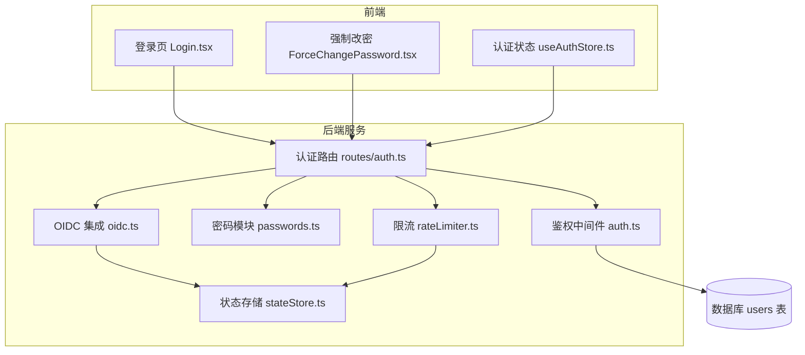
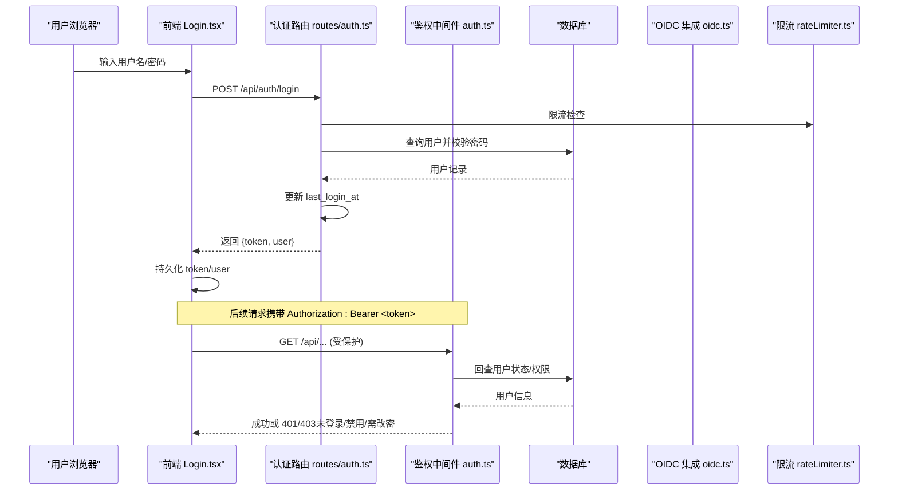
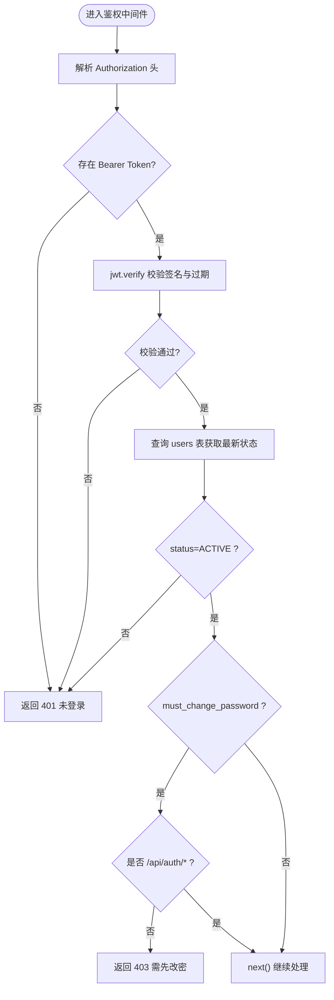
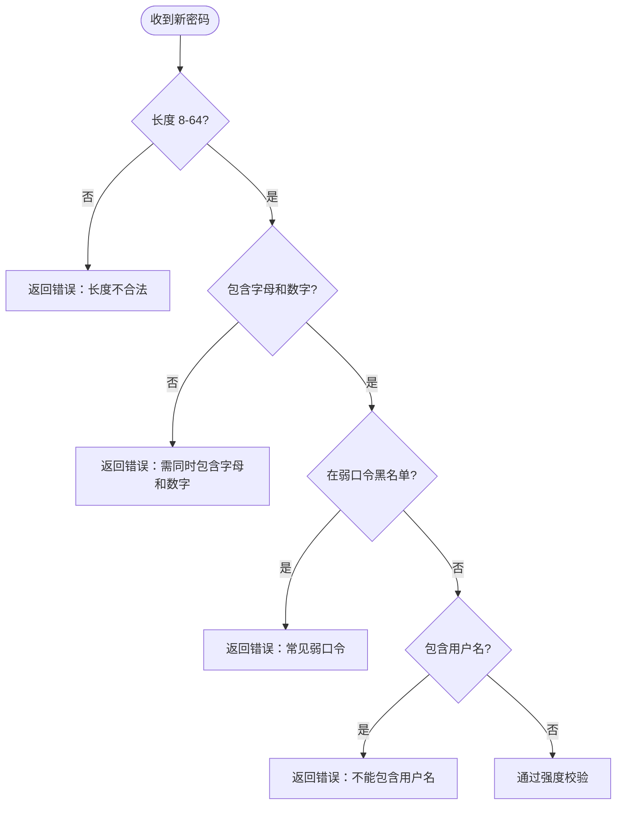
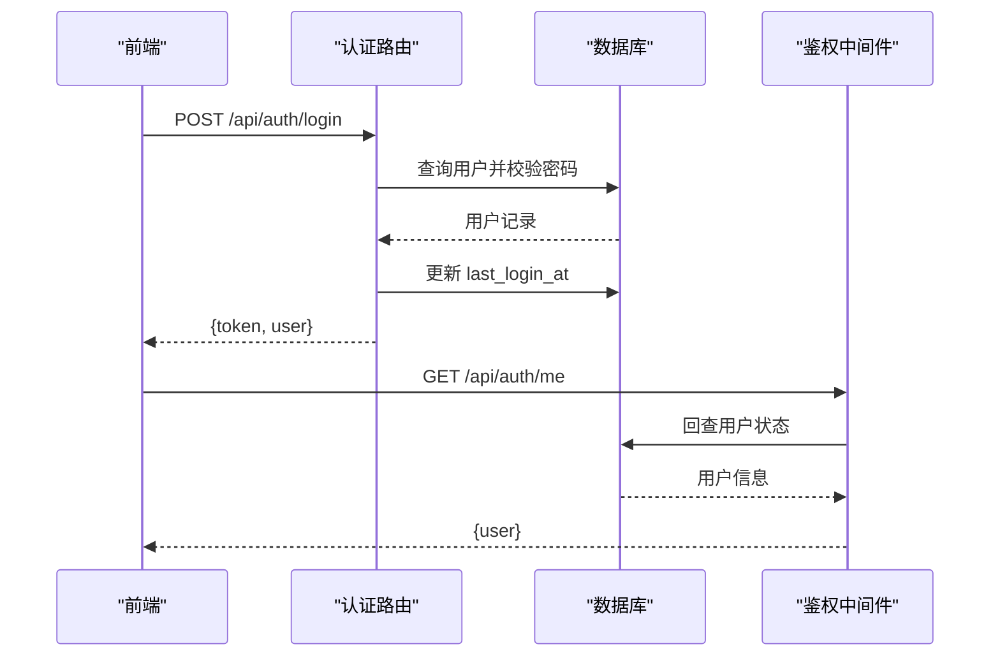
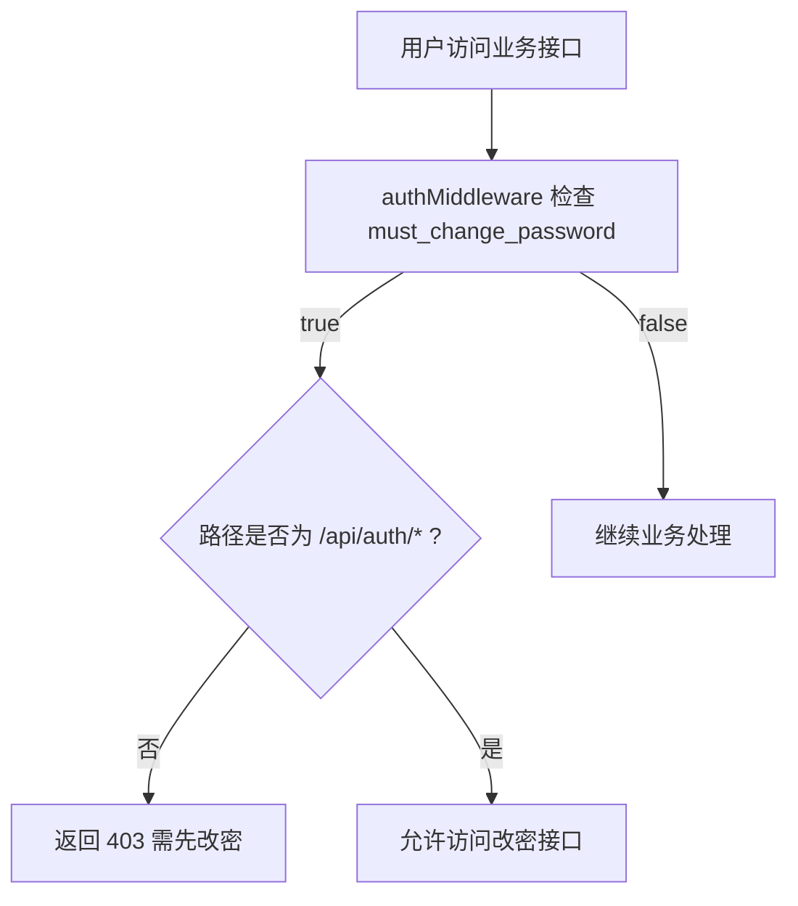
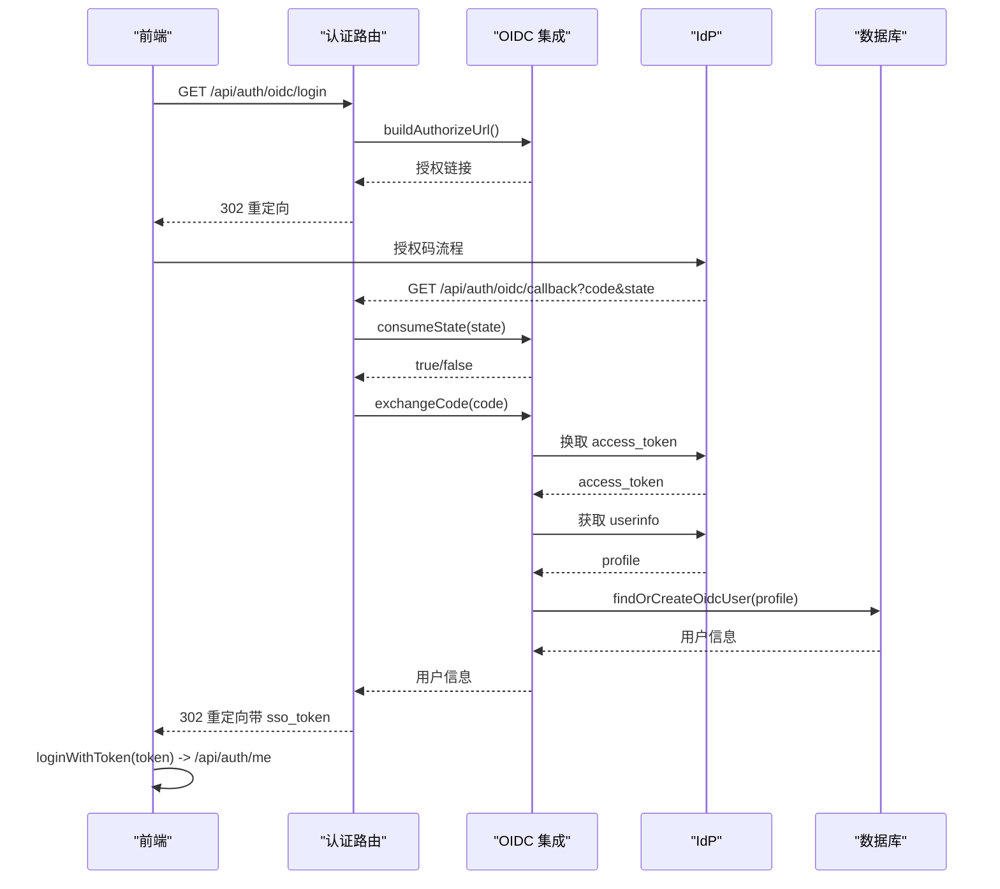
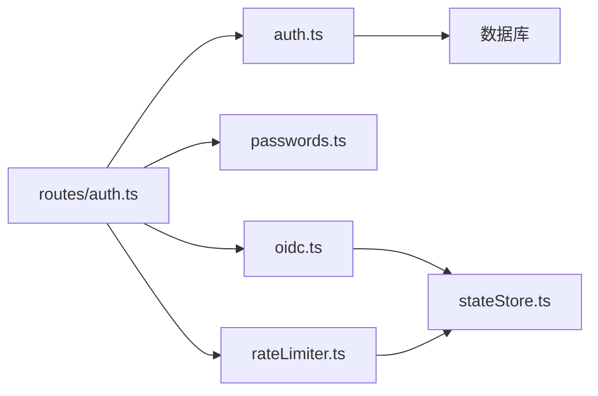

# 认证机制

<cite>
**本文引用的文件**
- [server/auth/auth.ts](file://server/auth/auth.ts)
- [server/routes/auth.ts](file://server/routes/auth.ts)
- [server/auth/passwords.ts](file://server/auth/passwords.ts)
- [server/auth/oidc.ts](file://server/auth/oidc.ts)
- [src/hooks/useAuthStore.ts](file://src/hooks/useAuthStore.ts)
- [src/components/auth/Login.tsx](file://src/components/auth/Login.tsx)
- [src/components/auth/ForceChangePassword.tsx](file://src/components/auth/ForceChangePassword.tsx)
- [server/infra/rateLimiter.ts](file://server/infra/rateLimiter.ts)
- [server/infra/stateStore.ts](file://server/infra/stateStore.ts)
- [server.ts](file://server.ts)
</cite>

## 目录
1. [简介](#简介)
2. [项目结构](#项目结构)
3. [核心组件](#核心组件)
4. [架构总览](#架构总览)
5. [详细组件分析](#详细组件分析)
6. [依赖关系分析](#依赖关系分析)
7. [性能与安全考量](#性能与安全考量)
8. [故障排查指南](#故障排查指南)
9. [结论](#结论)
10. [附录：配置与最佳实践](#附录配置与最佳实践)

## 简介
本文件系统性阐述智能问数据分析系统的认证机制，重点覆盖 JWT 令牌签发与校验、强制改密流程、密码安全存储、会话管理策略、OIDC 企业统一登录集成、限流防护以及生产环境安全配置。文档面向开发与运维人员，提供从原理到落地的完整说明，并附带可操作的错误处理策略与最佳实践建议。

## 项目结构
认证相关代码主要分布在服务端认证模块、路由层、前端状态管理与 UI 组件中：
- 服务端认证核心：JWT 签发/校验、角色守卫、用户上下文注入
- 密码安全：基于 scrypt 的哈希与验证、强度校验、pepper 支持
- 认证路由：登录、当前用户、修改密码、OIDC 授权码回调
- 前端状态：本地持久化 token/user、登录/登出、强制改密标记
- 基础设施：限流器（IP 维度）、分布式状态存储（Redis/Memory）

图表来源
- [server/routes/auth.ts:1-156](file://server/routes/auth.ts#L1-L156)
- [server/auth/auth.ts:1-127](file://server/auth/auth.ts#L1-L127)
- [server/auth/passwords.ts:1-100](file://server/auth/passwords.ts#L1-L100)
- [server/auth/oidc.ts:1-244](file://server/auth/oidc.ts#L1-L244)
- [server/infra/rateLimiter.ts:1-54](file://server/infra/rateLimiter.ts#L1-L54)
- [server/infra/stateStore.ts:1-219](file://server/infra/stateStore.ts#L1-L219)

章节来源
- [server/auth/auth.ts:1-127](file://server/auth/auth.ts#L1-L127)
- [server/routes/auth.ts:1-156](file://server/routes/auth.ts#L1-L156)
- [server/auth/passwords.ts:1-100](file://server/auth/passwords.ts#L1-L100)
- [server/auth/oidc.ts:1-244](file://server/auth/oidc.ts#L1-L244)
- [server/infra/rateLimiter.ts:1-54](file://server/infra/rateLimiter.ts#L1-L54)
- [server/infra/stateStore.ts:1-219](file://server/infra/stateStore.ts#L1-L219)

## 核心组件
- JWT 签发与校验
  - 签发：使用固定或进程级随机密钥生成短生命周期令牌，载荷包含用户标识、用户名与角色。
  - 校验：解析 Bearer Token，验证签名与有效期，并回查数据库确认账号状态与权限，将用户信息挂载至请求上下文。
- 强制改密与白名单放行
  - 当用户 must_change_password 为真时，除 /api/auth/* 外，所有业务接口返回“需先改密”的错误码。
- 密码安全存储
  - 采用 scrypt 参数化哈希，支持 pepper 增强；兼容旧格式哈希；内置弱口令黑名单与强度校验。
- 会话管理
  - 无状态 JWT 会话；通过过期时间控制；首次登录/管理员重置后强制改密；登录成功后更新最后登录时间。
- 企业统一登录（OIDC）
  - 授权码流程 + JIT 建号；state 一次性票据防 CSRF；可选 Redis 共享 state；按 IdP 权威同步用户信息。
- 限流防护
  - 登录等敏感接口启用 IP 维度的滑动窗口限流；多实例部署下通过 Redis 实现全局计数。

章节来源
- [server/auth/auth.ts:46-113](file://server/auth/auth.ts#L46-L113)
- [server/routes/auth.ts:41-114](file://server/routes/auth.ts#L41-L114)
- [server/auth/passwords.ts:18-99](file://server/auth/passwords.ts#L18-L99)
- [server/auth/oidc.ts:95-243](file://server/auth/oidc.ts#L95-L243)
- [server/infra/rateLimiter.ts:14-42](file://server/infra/rateLimiter.ts#L14-L42)

## 架构总览
下图展示从前端登录到后端鉴权的完整调用链，包括 OIDC 与企业统一登录路径。

图表来源
- [server/routes/auth.ts:41-82](file://server/routes/auth.ts#L41-L82)
- [server/auth/auth.ts:66-113](file://server/auth/auth.ts#L66-L113)
- [server/infra/rateLimiter.ts:14-42](file://server/infra/rateLimiter.ts#L14-L42)

## 详细组件分析

### JWT 令牌签发与校验
- 签发 signToken
  - 载荷包含用户 ID、用户名、角色；使用环境变量或进程级临时密钥签名；设置过期时间。
  - 生产环境要求配置固定强密钥，否则拒绝启动。
- 校验 authMiddleware
  - 解析 Bearer Token，验证签名与有效期；回查 users 表确认账号状态与角色；注入 req.user。
  - 若 must_change_password 为真且访问非 /api/auth/*，返回强制改密错误。
  - 同时注入 LLM 用量统计的用户上下文。

图表来源
- [server/auth/auth.ts:66-113](file://server/auth/auth.ts#L66-L113)
- [server.ts:91-96](file://server.ts#L91-L96)

章节来源
- [server/auth/auth.ts:46-113](file://server/auth/auth.ts#L46-L113)
- [server.ts:91-96](file://server.ts#L91-L96)

### 密码安全存储与强度校验
- 哈希算法：scrypt，参数 N=2^15、r=8、p=1，内存上限放宽以适配默认限制；支持 pepper（SCRYPT_PEPPER）。
- 兼容旧格式：4 段与 7 段两种存储格式均支持验证。
- 强度规则：长度 8-64 位；必须包含字母与数字；排除常见弱口令；禁止包含用户名。
- 使用场景：登录校验、修改密码、管理员重置密码入口统一走强度校验。

图表来源
- [server/auth/passwords.ts:18-48](file://server/auth/passwords.ts#L18-L48)

章节来源
- [server/auth/passwords.ts:18-99](file://server/auth/passwords.ts#L18-L99)

### 登录流程与会话管理
- 登录
  - 接收用户名/密码，进行限流保护；查询用户并校验密码；更新最后登录时间；签发 JWT；返回 token 与用户信息。
- 当前用户
  - 需要鉴权；返回当前用户信息。
- 修改密码
  - 需要鉴权；校验原密码与新密码强度；更新密码哈希并清除 must_change_password 标志。
- 会话策略
  - 无状态 JWT；通过过期时间控制；首次登录/重置后强制改密；登录成功后更新最后活跃时间。

图表来源
- [server/routes/auth.ts:41-82](file://server/routes/auth.ts#L41-L82)
- [server/auth/auth.ts:66-113](file://server/auth/auth.ts#L66-L113)

章节来源
- [server/routes/auth.ts:41-114](file://server/routes/auth.ts#L41-L114)
- [server/auth/auth.ts:66-113](file://server/auth/auth.ts#L66-L113)

### 强制改密机制
- 触发条件
  - 首次登录（初始密码）或管理员重置密码后，must_change_password 置位。
- 拦截策略
  - 鉴权中间件对非 /api/auth/* 的请求返回强制改密错误码。
- 前端处理
  - 强制改密页面调用修改密码接口；成功后清除本地 must_change_password 标记并放行。

图表来源
- [server/auth/auth.ts:104-107](file://server/auth/auth.ts#L104-L107)
- [src/components/auth/ForceChangePassword.tsx:23-41](file://src/components/auth/ForceChangePassword.tsx#L23-L41)

章节来源
- [server/auth/auth.ts:104-107](file://server/auth/auth.ts#L104-L107)
- [src/components/auth/ForceChangePassword.tsx:1-138](file://src/components/auth/ForceChangePassword.tsx#L1-L138)

### 企业统一登录（OIDC）
- 授权码流程
  - 构建授权链接（含一次性 state）；重定向到 IdP；回调时校验 state；交换 access_token；拉取 userinfo；JIT 建号/同步；签发本地 JWT；重定向回前端完成登录。
- 安全特性
  - state 一次性消费，TTL 10 分钟；支持 Redis 共享 state（多实例）；discovery 端点缓存 1 小时；失败关闭策略。
- 用户同步
  - 已存在用户每次登录同步 displayName/department；不存在则按默认角色创建（随机占位密码，无法本地密码登录）。

图表来源
- [server/routes/auth.ts:116-153](file://server/routes/auth.ts#L116-L153)
- [server/auth/oidc.ts:129-243](file://server/auth/oidc.ts#L129-L243)

章节来源
- [server/routes/auth.ts:116-153](file://server/routes/auth.ts#L116-L153)
- [server/auth/oidc.ts:129-243](file://server/auth/oidc.ts#L129-L243)

### 前端认证状态与交互
- 登录
  - 调用 /api/auth/login；成功后持久化 token 与 user；切换账号清理分析缓存。
- OIDC 回跳
  - 使用 sso_token 调用 /api/auth/me 完成登录；清理分析缓存。
- 强制改密
  - 调用修改密码接口；成功后清除 must_change_password 标记；退出强制改密页。
- 登出
  - 清空本地认证状态与分析缓存。

章节来源
- [src/hooks/useAuthStore.ts:25-76](file://src/hooks/useAuthStore.ts#L25-L76)
- [src/components/auth/Login.tsx:14-39](file://src/components/auth/Login.tsx#L14-L39)
- [src/components/auth/ForceChangePassword.tsx:23-41](file://src/components/auth/ForceChangePassword.tsx#L23-L41)

## 依赖关系分析
- 模块耦合
  - 认证路由依赖鉴权中间件、密码模块、限流器与 OIDC 集成。
  - 鉴权中间件依赖数据库连接池与 LLM 用户上下文注入。
  - OIDC 集成依赖状态存储（Memory/Redis）用于 state 一次性票据。
  - 限流器依赖状态存储实现多实例共享计数。
- 外部依赖
  - MySQL 数据库（users 表）；可选 Redis（多实例共享状态）。
- 潜在循环依赖
  - 前端使用裸 fetch 避免与 apiFetch 的循环依赖；后端模块通过函数导出解耦。

图表来源
- [server/routes/auth.ts:1-156](file://server/routes/auth.ts#L1-L156)
- [server/auth/auth.ts:1-127](file://server/auth/auth.ts#L1-L127)
- [server/auth/passwords.ts:1-100](file://server/auth/passwords.ts#L1-L100)
- [server/auth/oidc.ts:1-244](file://server/auth/oidc.ts#L1-L244)
- [server/infra/rateLimiter.ts:1-54](file://server/infra/rateLimiter.ts#L1-L54)
- [server/infra/stateStore.ts:1-219](file://server/infra/stateStore.ts#L1-L219)

章节来源
- [server/routes/auth.ts:1-156](file://server/routes/auth.ts#L1-L156)
- [server/auth/auth.ts:1-127](file://server/auth/auth.ts#L1-L127)
- [server/auth/passwords.ts:1-100](file://server/auth/passwords.ts#L1-L100)
- [server/auth/oidc.ts:1-244](file://server/auth/oidc.ts#L1-L244)
- [server/infra/rateLimiter.ts:1-54](file://server/infra/rateLimiter.ts#L1-L54)
- [server/infra/stateStore.ts:1-219](file://server/infra/stateStore.ts#L1-L219)

## 性能与安全考量
- 性能
  - JWT 无状态校验开销低；数据库回查仅在鉴权中间件执行；OIDC discovery 端点缓存 1 小时；state 与限流在多实例下通过 Redis 共享。
  - scrypt 哈希计算成本较高但参数可控；登录/改密接口具备限流保护。
- 安全
  - 生产环境强制要求 JWT_SECRET；开发环境使用进程级随机密钥（重启失效）。
  - 密码哈希采用 scrypt + pepper；弱口令黑名单；强制改密防止默认密码长期有效。
  - OIDC state 一次性票据防 CSRF；回调失败关闭策略；userinfo 获取失败直接拒绝。
  - 响应头安全策略（HSTS、CSP、X-Frame-Options、X-Content-Type-Options）。
- 扩展性
  - 多实例部署通过 Redis 共享 state 与限流计数；预热 Redis 连接减少冷启动抖动。

章节来源
- [server.ts:91-96](file://server.ts#L91-L96)
- [server/auth/passwords.ts:18-99](file://server/auth/passwords.ts#L18-L99)
- [server/auth/oidc.ts:95-127](file://server/auth/oidc.ts#L95-L127)
- [server/infra/rateLimiter.ts:14-42](file://server/infra/rateLimiter.ts#L14-L42)
- [server/infra/stateStore.ts:169-219](file://server/infra/stateStore.ts#L169-L219)

## 故障排查指南
- 登录失败
  - 检查用户名/密码是否正确；查看限流是否触发（429）；确认数据库连接正常。
- 鉴权失败（401/403）
  - 检查 Authorization 头是否携带正确 Bearer Token；确认 Token 未过期；确认账号状态 ACTIVE；如 must_change_password 为真，仅允许访问 /api/auth/*。
- 强制改密拦截
  - 确认当前请求路径是否为 /api/auth/change-password；如被拦截，请先完成改密。
- OIDC 登录失败
  - 检查 state 是否有效（一次性、TTL 10 分钟）；确认 IdP 配置（issuer、client_id、secret、redirect_uri）；查看回调错误参数。
- 限流触发
  - 同一 IP 在 60 秒内请求过多；调整 RATE_LIMIT_MAX 或优化重试策略；多实例下确认 Redis 可用。

章节来源
- [server/routes/auth.ts:41-77](file://server/routes/auth.ts#L41-L77)
- [server/auth/auth.ts:66-113](file://server/auth/auth.ts#L66-L113)
- [server/auth/oidc.ts:114-127](file://server/auth/oidc.ts#L114-L127)
- [server/infra/rateLimiter.ts:14-42](file://server/infra/rateLimiter.ts#L14-L42)

## 结论
本系统采用 JWT 无状态认证结合数据库回查，确保账号状态与权限变更即时生效；通过强制改密机制保障初始密码与重置密码的安全性；密码存储采用 scrypt + pepper，兼顾安全与兼容性；OIDC 集成提供企业统一登录能力，支持多实例部署与一次性 state 防 CSRF；限流与响应头安全策略进一步提升整体安全性与稳定性。生产环境需严格配置密钥与环境变量，遵循最小权限与失败关闭原则。

## 附录：配置与最佳实践
- 环境变量
  - JWT_SECRET：生产环境必须配置固定强密钥；开发环境可留空（进程级随机密钥，重启失效）。
  - JWT_EXPIRES_IN：令牌过期时间（默认 12h）。
  - SCRYPT_PEPPER：可选 pepper，提升离线爆破成本。
  - OIDC_ISSUER/OIDC_CLIENT_ID/OIDC_CLIENT_SECRET/OIDC_REDIRECT_URI/OIDC_DEFAULT_ROLE：企业统一登录配置。
  - REDIS_URL：启用多实例共享状态（state、限流、缓存等）。
  - RATE_LIMIT_MAX：登录等接口的每分钟最大请求数（默认 30）。
  - PORT/HOST/NODE_ENV：服务端口、监听地址、运行环境。
- 最佳实践
  - 生产环境开启 HSTS 与严格 CSP；限制 API 访问范围；定期轮换 JWT_SECRET。
  - 使用强密码策略与弱口令黑名单；强制首次登录改密。
  - 多实例部署启用 Redis；启动时预热连接；监控限流与鉴权失败率。
  - 对敏感接口启用限流；记录审计日志；最小化错误信息泄露。

章节来源
- [server.ts:91-96](file://server.ts#L91-L96)
- [server/auth/auth.ts:46-58](file://server/auth/auth.ts#L46-L58)
- [server/auth/passwords.ts:15-17](file://server/auth/passwords.ts#L15-L17)
- [server/auth/oidc.ts:41-56](file://server/auth/oidc.ts#L41-L56)
- [server/infra/rateLimiter.ts:9-12](file://server/infra/rateLimiter.ts#L9-L12)
- [server/infra/stateStore.ts:169-219](file://server/infra/stateStore.ts#L169-L219)