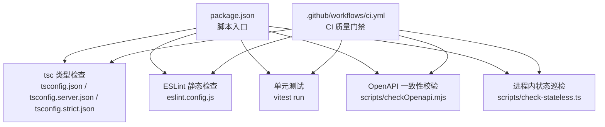
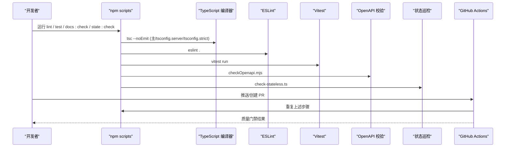
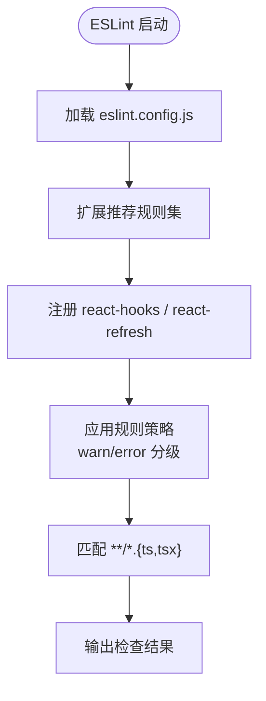
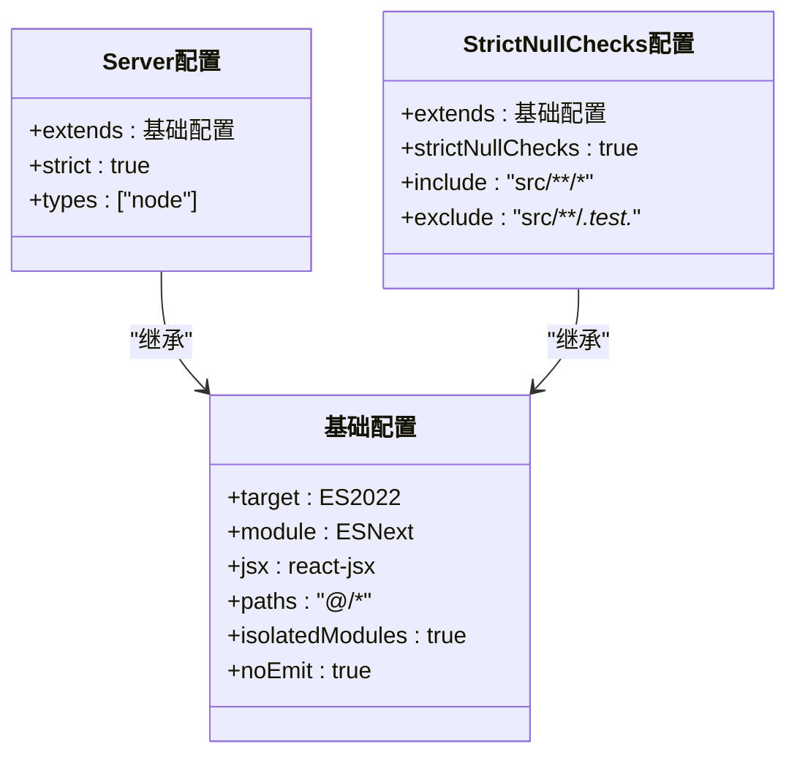
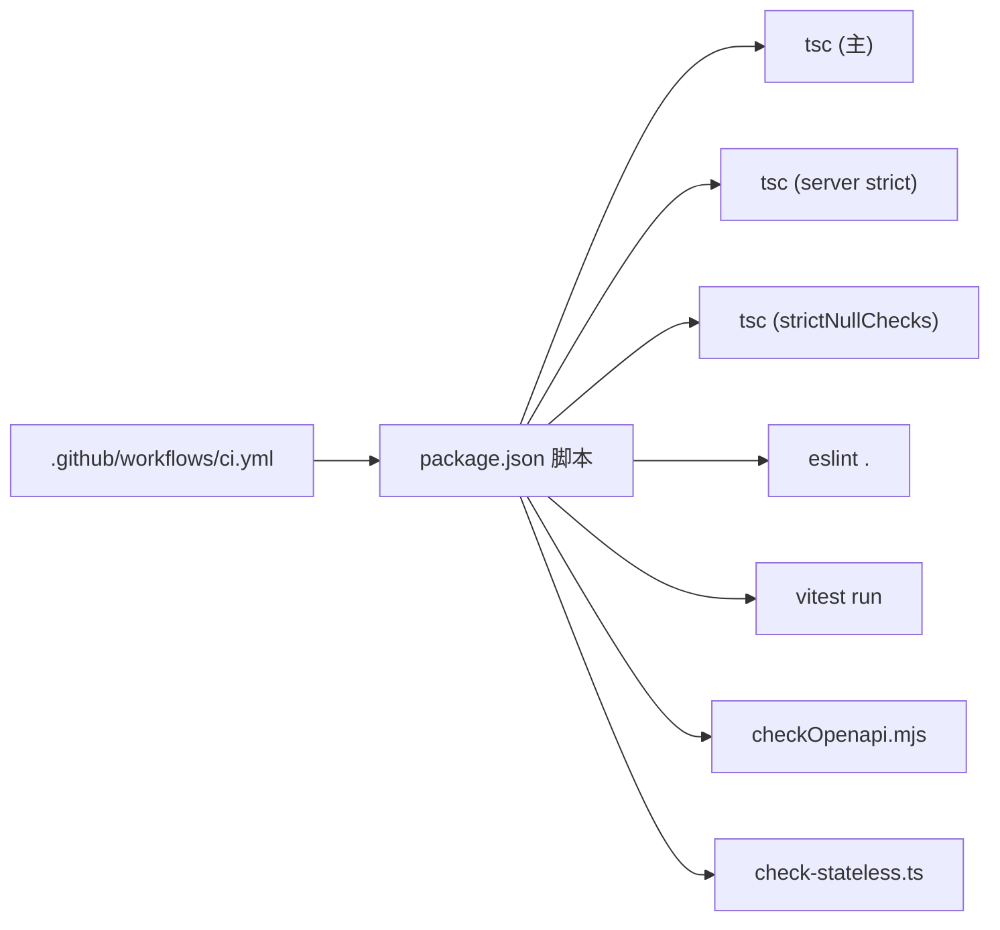

# 代码规范与质量

<cite>
**本文引用的文件**
- [eslint.config.js](file://eslint.config.js)
- [tsconfig.json](file://tsconfig.json)
- [tsconfig.strict.json](file://tsconfig.strict.json)
- [tsconfig.server.json](file://tsconfig.server.json)
- [package.json](file://package.json)
- [.github/workflows/ci.yml](file://.github/workflows/ci.yml)
- [.browserslistrc](file://.browserslistrc)
</cite>

## 目录
1. [简介](#简介)
2. [项目结构](#项目结构)
3. [核心组件](#核心组件)
4. [架构总览](#架构总览)
5. [详细组件分析](#详细组件分析)
6. [依赖分析](#依赖分析)
7. [性能考虑](#性能考虑)
8. [故障排查指南](#故障排查指南)
9. [结论](#结论)
10. [附录](#附录)

## 简介
本指南面向“智能问数据分析系统”的开发者与维护者，聚焦代码规范与质量控制。内容覆盖：
- ESLint 规则配置（TypeScript、React Hooks、自定义规则）
- TypeScript 严格模式（类型检查、空值处理、不可变性约束）
- 代码格式化标准（Prettier 建议、命名约定、文件结构规范）
- Git 提交规范（commit message、分支命名、代码审查流程）
- 代码质量检查工具链（静态分析、复杂度检测、安全扫描）
- 常见问题示例与修复建议

## 项目结构
本项目采用前后端同仓组织：前端源码位于 src，服务端源码位于 server，构建与质量门禁通过 npm scripts 与 GitHub Actions 串联。关键质量相关配置集中在根目录的配置文件与 CI 流水线中。

**图表来源**
- [package.json:6-24](file://package.json#L6-L24)
- [.github/workflows/ci.yml:14-38](file://.github/workflows/ci.yml#L14-L38)

**章节来源**
- [package.json:6-24](file://package.json#L6-L24)
- [.github/workflows/ci.yml:14-38](file://.github/workflows/ci.yml#L14-L38)

## 核心组件
本节从“规范与质量”的角度，梳理并解释各配置的职责与协作关系。

- ESLint 配置
  - 启用 TypeScript ESLint 推荐规则集，统一 TS/TSX 风格与类型感知检查。
  - 集成 React Hooks 插件，启用 hooks 最佳实践；对 React Compiler 级规则采用渐进式 warn，避免阻塞开发。
  - 针对 any 使用与未使用变量给出告警策略。
  - 浏览器与 Node 全局环境合并，适配全栈代码。

- TypeScript 配置
  - 主配置定义模块解析、目标版本、JSX 模式与路径别名等基础能力。
  - Server 专用配置开启 strict 模式并限定 Node 类型，保障服务端强类型。
  - Strict Null Checks 独立配置用于前端增量严格检查，逐步收敛空值风险。

- 构建与测试脚本
  - 提供 lint、lint:server、lint:strict、lint:js、test 等命令，便于本地与 CI 复用。
  - 额外脚本支持 OpenAPI 同步校验与进程内状态巡检，提升运行时健壮性。

- CI 质量门禁
  - 在 push/PR 到 main 时执行 tsc（多配置）、ESLint、Vitest 单测、OpenAPI 一致性校验与状态巡检。
  - 评测集门禁：结构校验与阈值契约，prompt 变更触发提醒。

**章节来源**
- [eslint.config.js:1-38](file://eslint.config.js#L1-L38)
- [tsconfig.json:1-27](file://tsconfig.json#L1-L27)
- [tsconfig.server.json:1-9](file://tsconfig.server.json#L1-L9)
- [tsconfig.strict.json:1-9](file://tsconfig.strict.json#L1-L9)
- [package.json:6-24](file://package.json#L6-L24)
- [.github/workflows/ci.yml:14-38](file://.github/workflows/ci.yml#L14-L38)

## 架构总览
下图展示“本地开发 → 提交 → CI 门禁”的质量流水线，以及各工具之间的调用关系。

**图表来源**
- [package.json:6-24](file://package.json#L6-L24)
- [.github/workflows/ci.yml:14-38](file://.github/workflows/ci.yml#L14-L38)

## 详细组件分析

### ESLint 规则配置
- 语言与插件
  - 使用 TypeScript ESLint 推荐规则集，确保 TS/TSX 的类型感知检查。
  - 启用 react-hooks 与 react-refresh 插件，强化 React Hooks 正确性与刷新行为。
- 规则策略
  - 将 React Compiler 级规则（如 set-state-in-effect、purity、refs、immutability）设为 warn，作为渐进改进提示，不阻断门禁。
  - 对 any 使用与未使用变量设置 warn，鼓励逐步消除隐患。
  - 合并浏览器与 Node 全局，减少误报。
- 忽略范围
  - 忽略 dist、node_modules、plugins、assets 等无关目录，聚焦业务代码。

**图表来源**
- [eslint.config.js:1-38](file://eslint.config.js#L1-L38)

**章节来源**
- [eslint.config.js:1-38](file://eslint.config.js#L1-L38)

### TypeScript 严格模式配置
- 基础配置
  - 目标 ES2022，启用装饰器实验特性，模块解析为 bundler 模式，隔离模块与强制模块检测，允许 JS 混入与 TS 扩展导入，关闭 emit 仅做类型检查。
  - 路径别名 @/* 指向根目录，简化导入。
- Server 严格模式
  - 继承基础配置并开启 strict 模式，限定 Node 类型，保障服务端强类型。
- 前端严格空值检查
  - 单独配置启用 strictNullChecks，仅包含 src 业务代码，排除测试文件，逐步收紧空值风险。

**图表来源**
- [tsconfig.json:1-27](file://tsconfig.json#L1-L27)
- [tsconfig.server.json:1-9](file://tsconfig.server.json#L1-L9)
- [tsconfig.strict.json:1-9](file://tsconfig.strict.json#L1-L9)

**章节来源**
- [tsconfig.json:1-27](file://tsconfig.json#L1-L27)
- [tsconfig.server.json:1-9](file://tsconfig.server.json#L1-L9)
- [tsconfig.strict.json:1-9](file://tsconfig.strict.json#L1-L9)

### 代码格式化标准（建议）
- Prettier
  - 建议与 ESLint 集成，统一缩进、引号、分号、换行等格式；在编辑器保存时自动格式化。
  - 与 TypeScript 和 JSX 兼容，避免与 ESLint 冲突。
- 命名约定
  - 组件与 Hook 使用帕斯卡/驼峰命名；常量使用大写蛇形；私有成员以下划线前缀区分。
  - 文件命名与模块职责一致，尽量单一职责。
- 文件结构规范
  - 前端按功能域划分目录（components、hooks、utils、types），服务端按领域划分（auth、query、report、infra 等）。
  - 测试文件与源码就近放置，便于维护与定位。

[本节为通用建议，不直接引用具体文件]

### Git 提交规范（建议）
- Commit Message
  - 采用约定式提交：type(scope): subject，例如 feat(query): 新增澄清对话缓存、fix(auth): 修复密码重置跳转。
  - 描述变更动机与影响范围，必要时附链接或问题编号。
- 分支命名
  - 功能分支：feature/<描述>；修复分支：fix/<描述>；发布分支：release/<版本>。
- 代码审查流程
  - 所有变更需通过 PR 评审，至少一名 reviewer 批准；CI 必须全部通过方可合并。
  - 涉及 prompt、评测、核心链路变更需附加回归说明或评测结果。

[本节为通用建议，不直接引用具体文件]

### 代码质量检查工具链
- 静态分析
  - TypeScript 类型检查：三档配置覆盖前端、服务端与严格空值检查。
  - ESLint：类型感知规则 + React Hooks 规则，warn 策略渐进改进。
- 复杂度检测
  - 建议在 ESLint 中引入复杂度限制规则（如 max-depth、max-lines-per-function），结合 IDE 提示逐步优化。
- 安全扫描
  - 建议在 CI 中加入依赖漏洞扫描（如 npm audit 或第三方服务），拦截高危依赖。
- 运行时健壮性
  - OpenAPI 一致性校验：保证路由与接口文档同步。
  - 进程内状态巡检：防止非法可变状态扩散。

**章节来源**
- [package.json:6-24](file://package.json#L6-L24)
- [.github/workflows/ci.yml:14-38](file://.github/workflows/ci.yml#L14-L38)

## 依赖分析
下图展示质量工具链的依赖关系与执行顺序。

**图表来源**
- [package.json:6-24](file://package.json#L6-L24)
- [.github/workflows/ci.yml:14-38](file://.github/workflows/ci.yml#L14-L38)

**章节来源**
- [package.json:6-24](file://package.json#L6-L24)
- [.github/workflows/ci.yml:14-38](file://.github/workflows/ci.yml#L14-L38)

## 性能考虑
- 类型检查与 Lint
  - 使用 noEmit 与 isolatedModules 提升增量编译效率；合理忽略无关目录减少扫描范围。
- 评测与 Prompt
  - CI 中对 prompt 变更触发评测提醒，避免大规模回归；评测集结构校验降低无效数据带来的噪声。
- 浏览器兼容性
  - 通过 browserslist 控制目标浏览器范围，平衡兼容性与打包体积。

**章节来源**
- [tsconfig.json:1-27](file://tsconfig.json#L1-L27)
- [.github/workflows/ci.yml:40-67](file://.github/workflows/ci.yml#L40-L67)
- [.browserslistrc:1-17](file://.browserslistrc#L1-L17)

## 故障排查指南
- 类型检查失败
  - 优先查看 tsc 错误信息，确认是否由 strictNullChecks 或 server strict 引起；必要时临时放宽局部类型或使用类型守卫。
- ESLint 报错
  - 关注 any 使用与未使用变量警告；对 React Hooks 规则，按 warn 提示逐步重构。
- CI 失败
  - 对照质量门禁步骤逐一复现：tsc、eslint、vitest、OpenAPI 一致性、状态巡检；根据日志定位具体环节。
- 评测集门禁失败
  - 检查评测集规模与分类覆盖；若为 prompt 变更，请补充评测结果与回归说明。

**章节来源**
- [package.json:6-24](file://package.json#L6-L24)
- [.github/workflows/ci.yml:14-38](file://.github/workflows/ci.yml#L14-L38)
- [.github/workflows/ci.yml:40-67](file://.github/workflows/ci.yml#L40-L67)

## 结论
本项目已建立较为完善的质量体系：以 TypeScript 严格模式与 ESLint 为核心，配合 CI 门禁、OpenAPI 一致性校验与进程内状态巡检，形成从本地到流水线的闭环。建议在现有基础上继续推进：
- 渐进式收紧 React Compiler 级规则至 error
- 引入复杂度与安全扫描规则
- 完善 Prettier 与 Git 提交规范落地

## 附录
- 常见代码问题与修复建议
  - 任意类型 any 滥用：替换为精确类型或联合类型，使用类型守卫收窄。
  - 未使用变量：清理无用导入与参数，必要时用下划线前缀忽略。
  - 空值风险：启用 strictNullChecks，对可能为空的值进行显式判断或默认值处理。
  - Hooks 使用不当：遵循依赖数组与副作用边界，避免在渲染期产生副作用。
  - 组件职责过大：拆分大组件为小模块，提升可测试性与可维护性。

[本节为通用建议，不直接引用具体文件]