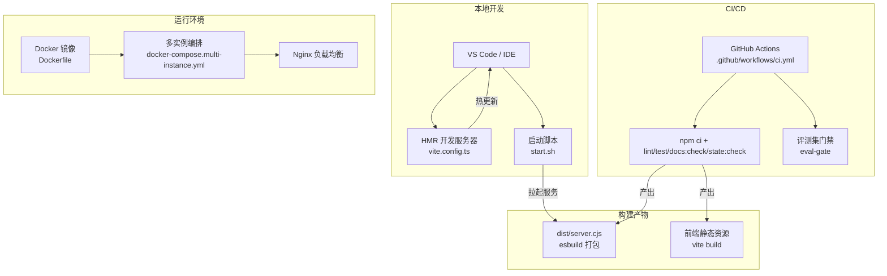
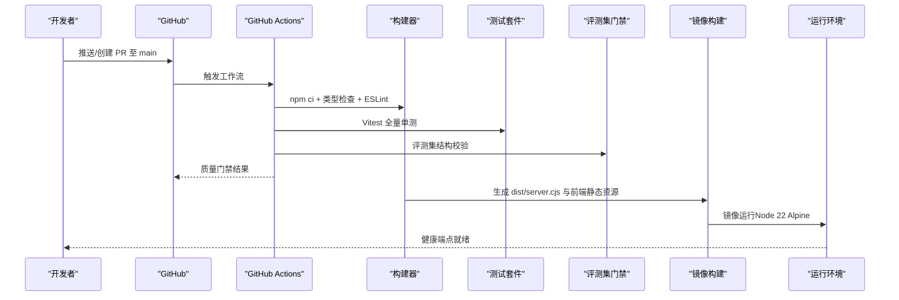
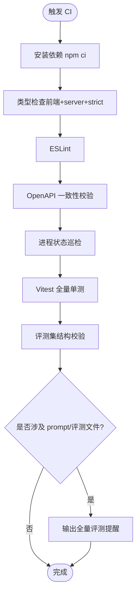
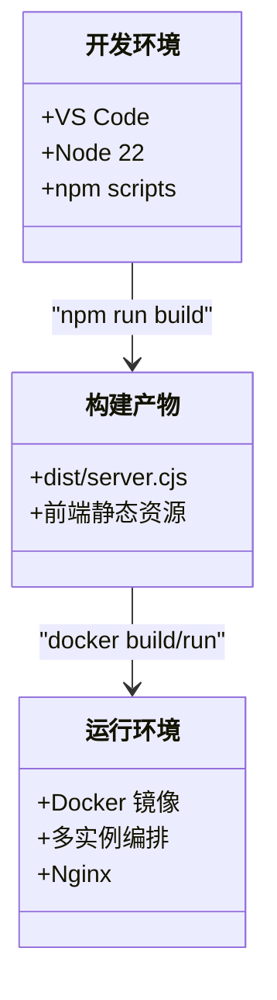
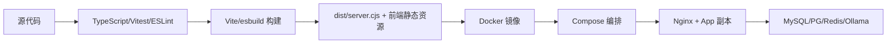

# 开发工作流程

<cite>
**本文引用的文件**
- [ci.yml](file://.github/workflows/ci.yml)
- [package.json](file://package.json)
- [Dockerfile](file://Dockerfile)
- [docker-compose.multi-instance.yml](file://docker-compose.multi-instance.yml)
- [start.sh](file://start.sh)
- [vite.config.ts](file://vite.config.ts)
- [tsconfig.json](file://tsconfig.json)
- [playwright.config.ts](file://playwright.config.ts)
- [eslint.config.js](file://eslint.config.js)
- [系统功能说明书.md](file://docs/系统功能说明书.md)
</cite>

## 目录
1. [简介](#简介)
2. [项目结构](#项目结构)
3. [核心组件](#核心组件)
4. [架构总览](#架构总览)
5. [详细组件分析](#详细组件分析)
6. [依赖关系分析](#依赖关系分析)
7. [性能考量](#性能考量)
8. [故障排除指南](#故障排除指南)
9. [结论](#结论)
10. [附录](#附录)

## 简介
本指南面向“智能问数据分析系统”的开发者与运维人员，围绕以下目标提供可落地的开发工作流程：
- Git 分支管理策略（主分支保护、功能分支命名、合并请求流程）
- 持续集成配置（GitHub Actions 工作流、自动化测试、构建部署）
- 代码审查流程（审查清单、反馈处理、质量门禁）
- 发布管理流程（版本标签、变更日志、回滚策略）
- 开发工具链集成（IDE 调试、远程开发、容器化开发）
- 常见问题解决与故障排除

本指南严格基于仓库现有配置与脚本进行说明，确保与实际工程一致。

## 项目结构
仓库采用前后端一体化 Node.js 工程组织方式：
- 前端：Vite + React + TailwindCSS，使用 Vitest 进行单元测试，Playwright 进行端到端测试
- 后端：Express + TypeScript，通过 esbuild 打包为单文件 server.cjs
- 构建与运行：npm scripts 统一编排；Docker 多阶段构建；Compose 提供多实例示例
- CI：GitHub Actions 在 push/PR 到 main 时执行类型检查、ESLint、OpenAPI 一致性校验、进程状态巡检、全量单测与评测集门禁

图示来源
- [ci.yml:1-67](file://.github/workflows/ci.yml#L1-L67)
- [package.json:6-24](file://package.json#L6-L24)
- [Dockerfile:18-46](file://Dockerfile#L18-L46)
- [docker-compose.multi-instance.yml:1-50](file://docker-compose.multi-instance.yml#L1-L50)
- [vite.config.ts:10-40](file://vite.config.ts#L10-L40)
- [start.sh:116-138](file://start.sh#L116-L138)

章节来源
- [package.json:6-24](file://package.json#L6-L24)
- [vite.config.ts:10-40](file://vite.config.ts#L10-L40)
- [Dockerfile:18-46](file://Dockerfile#L18-L46)
- [docker-compose.multi-instance.yml:1-50](file://docker-compose.multi-instance.yml#L1-L50)
- [start.sh:116-138](file://start.sh#L116-L138)

## 核心组件
- 持续集成质量门禁：TypeScript 类型检查（前端+server strict）、ESLint、OpenAPI 同步校验、进程状态巡检、Vitest 全量单测
- 评测集门禁：对评测集结构与覆盖率进行强制校验，并在 prompt/评测相关文件变更时提示本地全量评测
- 构建与打包：Vite 构建前端，esbuild 打包 server 为单文件，生产镜像仅包含运行时依赖
- 多实例部署：Compose 编排应用副本、Redis 共享状态、Nginx 负载均衡
- 本地一键启动：start.sh 自动检测并拉起 MySQL/Redis/Ollama，健康检查后打开浏览器

章节来源
- [ci.yml:15-67](file://.github/workflows/ci.yml#L15-L67)
- [package.json:6-24](file://package.json#L6-L24)
- [Dockerfile:18-46](file://Dockerfile#L18-L46)
- [docker-compose.multi-instance.yml:1-50](file://docker-compose.multi-instance.yml#L1-L50)
- [start.sh:43-138](file://start.sh#L43-L138)

## 架构总览
下图展示从代码提交到构建、测试、部署的完整流水线，以及本地开发与容器化运行的关系。

图示来源
- [ci.yml:8-67](file://.github/workflows/ci.yml#L8-L67)
- [package.json:6-24](file://package.json#L6-L24)
- [Dockerfile:18-46](file://Dockerfile#L18-L46)

## 详细组件分析

### Git 分支管理与合并请求流程
- 主分支保护
  - 将 main 设为受保护分支，要求至少一名 reviewer 批准
  - 强制通过 CI 质量门禁（类型检查、ESLint、单测、评测集门禁）后方可合并
- 功能分支命名
  - 建议格式：feature/<模块>-<简述>、fix/<问题编号>-<简述>、chore/<任务>、docs/<文档>
  - 分支粒度小而精，便于评审与回溯
- 合并请求流程
  - 提交前：本地执行 npm run lint、npm test、npm run docs:check、npm run state:check
  - 提交后：等待 CI 结果；根据评论迭代修复
  - 合并前：确保无冲突、所有检查通过、至少一位 reviewer 批准
  - 合并后：观察制品与部署结果

章节来源
- [ci.yml:8-38](file://.github/workflows/ci.yml#L8-L38)
- [ci.yml:40-67](file://.github/workflows/ci.yml#L40-L67)

### 持续集成配置（GitHub Actions）
- 触发条件：push/PR 到 main
- 质量作业
  - 安装依赖：npm ci
  - 类型检查：前端 tsc（noEmit）、server strict、前端 strictNullChecks
  - 代码规范：ESLint
  - OpenAPI 一致性：docs:check
  - 进程状态巡检：state:check
  - 单元测试：Vitest 全量
- 评测集门禁
  - 校验评测集规模与六类覆盖
  - 宽表评测集独立校验
  - 当 prompt/评测相关文件变更时输出全量评测提醒

图示来源
- [ci.yml:15-67](file://.github/workflows/ci.yml#L15-L67)
- [package.json:6-24](file://package.json#L6-L24)

章节来源
- [ci.yml:15-67](file://.github/workflows/ci.yml#L15-L67)
- [package.json:6-24](file://package.json#L6-L24)

### 代码审查流程
- 审查清单
  - 变更范围最小化，聚焦单一职责
  - 新增/修改逻辑需补充或更新单测
  - 接口变更需同步更新 OpenAPI 并通过 docs:check
  - 敏感配置与环境变量不硬编码
  - 性能与安全：避免 N+1 查询、注入风险、越权访问
- 反馈处理
  - 使用 GitHub Review Comments 逐条回复
  - 小步提交，保持历史清晰
  - 复杂变更拆分为多个 PR，降低认知负荷
- 质量门禁
  - 未通过 CI 不得合并
  - 评测集门禁通过后合并
  - 关键路径（prompt/评测相关）变更需本地全量评测并记录结果

章节来源
- [ci.yml:15-67](file://.github/workflows/ci.yml#L15-L67)

### 发布管理流程
- 版本标签
  - 版本号来源于 package.json 的 version 字段，作为唯一事实源
  - 发布前更新版本号并提交，打 tag 对应 commit
- 变更日志
  - 依据功能说明书变更记录与 PR 描述整理变更摘要
  - 用户可见变更需在发布说明中体现
- 回滚策略
  - 优先回滚镜像与配置到上一个稳定版本
  - 数据库变更需具备向下兼容或可逆迁移脚本
  - 灰度发布与快速回滚结合，缩短影响面

章节来源
- [package.json:1-10](file://package.json#L1-L10)
- [系统功能说明书.md:1-20](file://docs/系统功能说明书.md#L1-L20)

### 开发工具链集成
- IDE 调试
  - 使用 tsx 直接运行 server.ts 进行后端调试
  - Vite 提供 HMR 与前端调试
  - 可通过环境变量控制 HMR 开关以适配 AI Studio 等场景
- 远程开发
  - 推荐 SSH + VS Code Remote 或 Codespaces
  - 在远端复用仓库脚本与依赖，保证环境一致
- 容器化开发
  - Docker 多阶段构建：构建期编译前端与打包 server，运行期仅含生产依赖
  - Compose 示例：两副本应用 + Redis + Nginx 负载均衡
  - 健康检查：容器内通过 HTTP 探活端点判定就绪

图示来源
- [vite.config.ts:25-35](file://vite.config.ts#L25-L35)
- [package.json:6-24](file://package.json#L6-L24)
- [Dockerfile:18-46](file://Dockerfile#L18-L46)
- [docker-compose.multi-instance.yml:1-50](file://docker-compose.multi-instance.yml#L1-L50)

章节来源
- [vite.config.ts:25-35](file://vite.config.ts#L25-L35)
- [package.json:6-24](file://package.json#L6-L24)
- [Dockerfile:18-46](file://Dockerfile#L18-L46)
- [docker-compose.multi-instance.yml:1-50](file://docker-compose.multi-instance.yml#L1-L50)

### 端到端测试与验收
- Playwright 配置
  - 默认复用已运行的服务（reuseExistingServer），CI 下自动拉起 server.ts
  - 超时、重试、截图、追踪等策略已配置
  - 浏览器通道优先使用系统 Chrome，减少下载依赖
- 验收建议
  - 关键用户路径编写 E2E 用例
  - 失败时保留截图与追踪用于定位
  - 与 UI 变更联动回归

章节来源
- [playwright.config.ts:1-39](file://playwright.config.ts#L1-L39)

## 依赖关系分析
- 构建与测试依赖
  - TypeScript、Vitest、ESLint、Vite、esbuild、Playwright
- 运行依赖
  - Node 22、Express、数据库驱动（MySQL/PostgreSQL）、Redis、Ollama（可选）
- 外部集成
  - Prometheus/Grafana 监控（部署目录提供配置文件）
  - Nginx 反向代理与负载均衡

图示来源
- [package.json:26-74](file://package.json#L26-L74)
- [Dockerfile:18-46](file://Dockerfile#L18-L46)
- [docker-compose.multi-instance.yml:1-50](file://docker-compose.multi-instance.yml#L1-L50)

章节来源
- [package.json:26-74](file://package.json#L26-L74)
- [Dockerfile:18-46](file://Dockerfile#L18-L46)
- [docker-compose.multi-instance.yml:1-50](file://docker-compose.multi-instance.yml#L1-L50)

## 性能考量
- 构建优化
  - 多阶段构建减小镜像体积
  - 仅安装生产依赖，清理缓存
- 运行优化
  - 连接池与并发上限按场景分级配额
  - 语义缓存与 SSE 流式响应提升体验
- 可观测性
  - 内置指标暴露，配合 Prometheus/Grafana 观测趋势与告警

章节来源
- [Dockerfile:27-46](file://Dockerfile#L27-L46)
- [系统功能说明书.md:198-200](file://docs/系统功能说明书.md#L198-L200)

## 故障排除指南
- 启动失败
  - 检查 .env.local 是否存在且必要变量已配置
  - 确认 MySQL/Redis/Ollama 端口可达
  - 查看 start.sh 输出的最近日志
- 健康检查失败
  - 确认 /api/health 可访问
  - 检查容器 HEALTHCHECK 与端口映射
- CI 失败
  - 先复现本地：npm run lint、npm test、npm run docs:check、npm run state:check
  - 关注评测集门禁与 prompt 变更提醒
- 多实例异常
  - 核对 REDIS_URL、JWT_SECRET 一致性
  - 检查 Nginx 配置与上游 app 端口映射

章节来源
- [start.sh:43-138](file://start.sh#L43-L138)
- [Dockerfile:27-46](file://Dockerfile#L27-L46)
- [ci.yml:15-67](file://.github/workflows/ci.yml#L15-L67)
- [docker-compose.multi-instance.yml:1-50](file://docker-compose.multi-instance.yml#L1-L50)

## 结论
本指南基于仓库现有配置，提供了从分支管理、CI、代码审查、发布到容器化开发的完整流程。遵循该流程可显著提升代码质量、交付效率与稳定性。建议在团队内推广并持续完善最佳实践。

## 附录
- 常用命令
  - 本地开发：npm run dev
  - 构建：npm run build
  - 测试：npm test
  - E2E：npm run test:e2e
  - 文档校验：npm run docs:check
  - 状态巡检：npm run state:check
- 环境变量要点
  - JWT_SECRET、MYSQL_*、REDIS_URL、OLLAMA_URL、ADMIN_USERNAME/PASSWORD
- 监控与告警
  - 参考 deploy 目录下的 Prometheus/Grafana/Alertmanager 配置

章节来源
- [package.json:6-24](file://package.json#L6-L24)
- [docker-compose.multi-instance.yml:1-50](file://docker-compose.multi-instance.yml#L1-L50)
- [Dockerfile:27-46](file://Dockerfile#L27-L46)