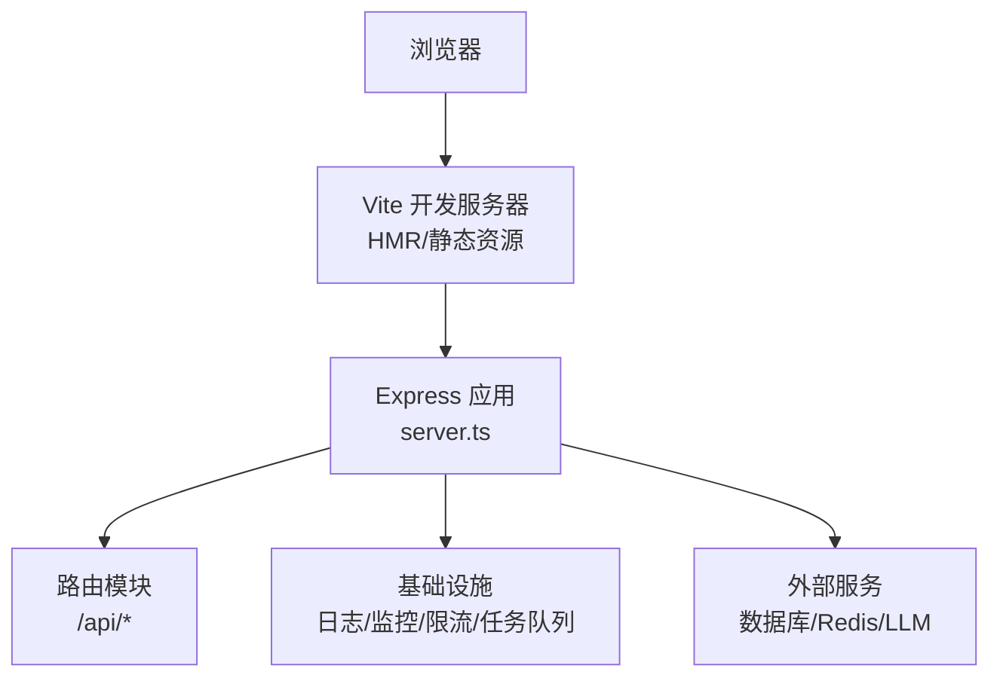
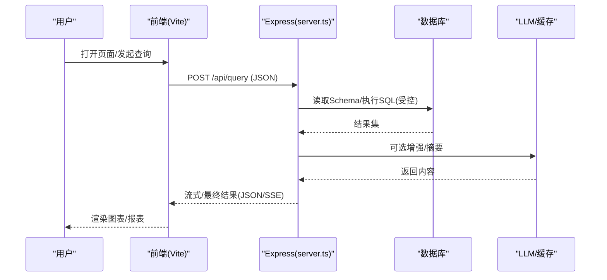
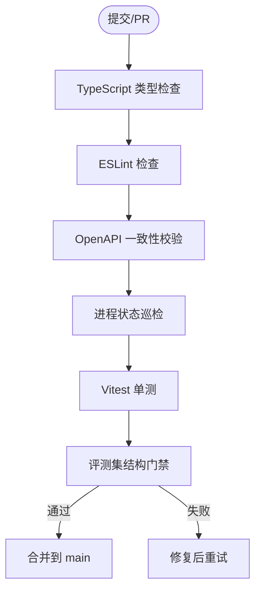
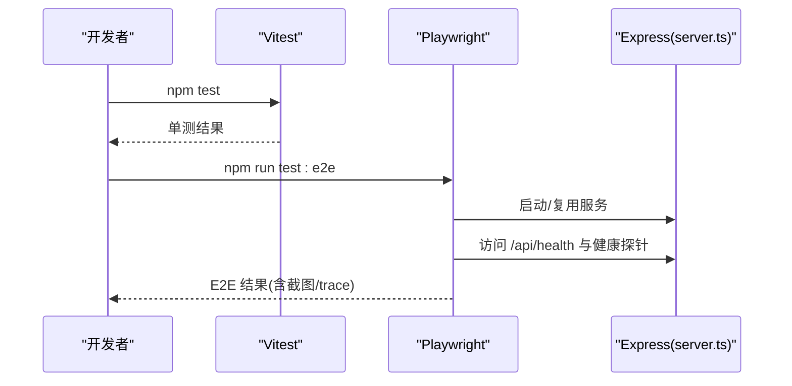
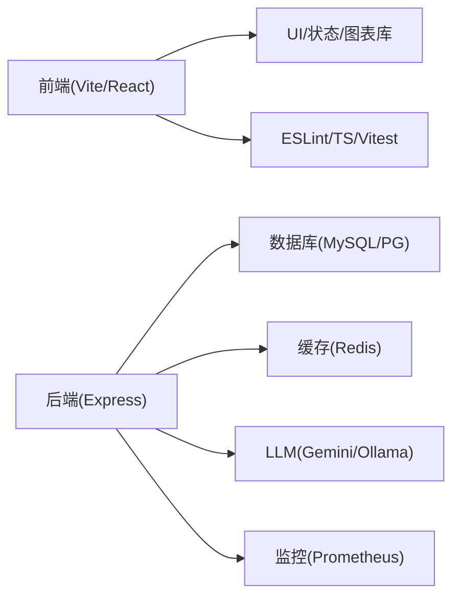

# 开发指南

<cite>
**本文引用的文件**
- [package.json](file://package.json)
- [tsconfig.json](file://tsconfig.json)
- [tsconfig.strict.json](file://tsconfig.strict.json)
- [eslint.config.js](file://eslint.config.js)
- [vite.config.ts](file://vite.config.ts)
- [playwright.config.ts](file://playwright.config.ts)
- [.github/workflows/ci.yml](file://.github/workflows/ci.yml)
- [server.ts](file://server.ts)
- [tests/e2e/smoke.spec.ts](file://tests/e2e/smoke.spec.ts)
- [server/infra/logger.ts](file://server/infra/logger.ts)
- [server/infra/errorCodes.ts](file://server/infra/errorCodes.ts)
</cite>

## 目录
1. [简介](#简介)
2. [项目结构](#项目结构)
3. [核心组件](#核心组件)
4. [架构总览](#架构总览)
5. [详细组件分析](#详细组件分析)
6. [依赖分析](#依赖分析)
7. [性能考虑](#性能考虑)
8. [故障排查指南](#故障排查指南)
9. [结论](#结论)
10. [附录](#附录)

## 简介
本指南面向智能问数据分析系统的开发者，覆盖开发环境搭建、代码规范与质量门禁、测试策略（单元/集成/E2E）、Git 工作流与分支管理、发布流程、工具链配置、性能分析与调试技巧，以及贡献与问题反馈流程。文档基于仓库现有配置与实现进行说明，确保与实际工程一致。

## 项目结构
- 前端：React + Vite + TailwindCSS，使用 TypeScript 与 ESLint 统一规范；Vitest 负责单元测试；Playwright 负责端到端测试。
- 后端：Express + TypeScript，提供 REST API、鉴权、数据源管理、知识库、报告导出、指标采集等能力；通过 Vite 中间件在开发期提供 SPA 热更新。
- 构建与运行：Vite 构建前端，esbuild 打包服务端；支持 .env/.env.local 环境变量加载；生产模式静态资源托管与 SPA 回退。
- 质量与 CI：TypeScript 类型检查（含严格模式）、ESLint、OpenAPI 同步校验、进程状态巡检、全量单测、评测集结构门禁。

图表来源
- [server.ts:82-296](file://server.ts#L82-L296)
- [vite.config.ts:10-39](file://vite.config.ts#L10-L39)

章节来源
- [package.json:6-24](file://package.json#L6-L24)
- [vite.config.ts:10-39](file://vite.config.ts#L10-L39)
- [server.ts:82-296](file://server.ts#L82-L296)

## 核心组件
- 应用入口与生命周期：Express 启动、中间件注册、健康检查、模型信息、鉴权与路由挂载、Vite 开发中间件或生产静态资源、全局错误处理。
- 环境与配置：.env/.env.local 多路径加载；生产安全校验（JWT_SECRET）；CSP 响应头；请求体大小限制按路由差异化。
- 可观测性：Prometheus 指标、请求日志、健康检查端点。
- 任务与调度：异步任务队列、中间表清理、SSE 重放缓冲清理、漂移检测清扫。
- 前端构建：版本常量注入、别名、Tailwind、React 插件、Vitest 排除 E2E。

章节来源
- [server.ts:12-19](file://server.ts#L12-L19)
- [server.ts:82-131](file://server.ts#L82-L131)
- [server.ts:133-183](file://server.ts#L133-L183)
- [server.ts:187-296](file://server.ts#L187-L296)
- [vite.config.ts:7-18](file://vite.config.ts#L7-L18)
- [vite.config.ts:20-39](file://vite.config.ts#L20-L39)

## 架构总览
系统采用前后端同仓的单体应用形态：前端通过 Vite 提供开发与构建能力，后端以 Express 承载 API，并在开发模式下通过 Vite 中间件提供 HMR；生产模式由 esbuild 打包为 Node CJS 并托管静态资源。关键链路包括鉴权、数据源管理、知识库、问数与报告、指标与运维、任务队列与清理调度。

图表来源
- [server.ts:187-296](file://server.ts#L187-L296)
- [vite.config.ts:25-34](file://vite.config.ts#L25-L34)

## 详细组件分析

### 开发环境与工具链
- 运行时与包管理
  - Node 22（CI 指定），npm scripts 提供 dev/build/start/lint/test/e2e 等命令。
  - 构建产物：前端由 Vite 构建，服务端由 esbuild 打包为 dist/server.cjs。
- 编辑器与扩展建议
  - TypeScript 语言服务：启用 strictNullChecks（strict 配置）。
  - ESLint：启用 React Hooks、React Refresh、TS 推荐规则。
  - 格式化：配合 Prettier（若团队引入）与 ESLint 冲突最小化。
- 调试
  - 开发模式：tsx server.ts 启动，Vite HMR 自动刷新前端。
  - 断点调试：VS Code 使用 Node 调试器附加至 tsx 进程；或使用 IDE 内置 TS 调试。
  - 日志级别：通过 LOG_LEVEL 控制输出粒度（debug/info/warn/error）。

章节来源
- [package.json:6-24](file://package.json#L6-L24)
- [package.json:26-74](file://package.json#L26-L74)
- [tsconfig.json:1-25](file://tsconfig.json#L1-L25)
- [tsconfig.strict.json:1-8](file://tsconfig.strict.json#L1-L8)
- [eslint.config.js:7-35](file://eslint.config.js#L7-L35)
- [server/infra/logger.ts:1-41](file://server/infra/logger.ts#L1-L41)

### 代码规范与质量门禁
- TypeScript
  - 基础配置：target ES2022、module ESNext、jsx react-jsx、路径别名 @/*。
  - 严格模式：独立 tsconfig.strict.json 开启 strictNullChecks，仅用于 src 业务代码。
- ESLint
  - 启用 JS/TS 推荐规则、React Hooks 规则、React Refresh 检查。
  - 针对本项目现状将部分“编译器级”规则降级为 warn，避免阻塞提交。
- 质量门禁（CI）
  - 类型检查：主 tsconfig、server strict、前端 strictNullChecks。
  - ESLint：lint:js。
  - OpenAPI 一致性校验：docs:check。
  - 进程状态巡检：state:check。
  - 全量单测：vitest run。
  - 评测集门禁：规模与分层覆盖校验，prompt 变更触发提醒。

图表来源
- [.github/workflows/ci.yml:14-38](file://.github/workflows/ci.yml#L14-L38)
- [.github/workflows/ci.yml:40-67](file://.github/workflows/ci.yml#L40-L67)

章节来源
- [tsconfig.json:1-25](file://tsconfig.json#L1-L25)
- [tsconfig.strict.json:1-8](file://tsconfig.strict.json#L1-L8)
- [eslint.config.js:7-35](file://eslint.config.js#L7-L35)
- [.github/workflows/ci.yml:14-67](file://.github/workflows/ci.yml#L14-L67)

### 测试策略与框架
- 单元测试
  - 框架：Vitest（包含于 vite.config.ts 的 test 配置中）。
  - 范围：src/** 下的 *.test.ts/.tsx，排除 tests/e2e。
  - 执行：npm test。
- 端到端测试
  - 框架：Playwright，配置文件 playwright.config.ts。
  - 行为：默认复用已运行的开发/生产服务；CI 下可自动拉起 server.ts；失败截图与追踪保留。
  - 冒烟用例：覆盖登录、核心 API JSON 响应、知识库面板加载等关键路径。
  - 执行：npm run test:e2e。

图表来源
- [vite.config.ts:36-39](file://vite.config.ts#L36-L39)
- [playwright.config.ts:1-39](file://playwright.config.ts#L1-L39)
- [tests/e2e/smoke.spec.ts:1-87](file://tests/e2e/smoke.spec.ts#L1-L87)

章节来源
- [vite.config.ts:36-39](file://vite.config.ts#L36-L39)
- [playwright.config.ts:1-39](file://playwright.config.ts#L1-L39)
- [tests/e2e/smoke.spec.ts:1-87](file://tests/e2e/smoke.spec.ts#L1-L87)

### Git 工作流与分支管理
- 分支策略
  - main 为受保护分支，所有变更通过 PR 合并。
  - CI 对 push/PR to main 触发质量门禁与评测集门禁。
- 提交规范
  - 建议在本地通过 Husky 钩子执行 lint/test（prepare 脚本已安装 husky）。
  - 结合团队约定使用 conventional commits（如 feat/fix/chore 等）。
- 代码审查
  - 强制 PR 评审，CI 通过后合并。
- 版本发布
  - 版本号维护于 package.json 的 version 字段；构建时注入到前端作为全局常量。
  - 发布前确保：类型检查、ESLint、单测、E2E、评测集门禁全部通过。

章节来源
- [package.json:2-5](file://package.json#L2-L5)
- [package.json:24](file://package.json#L24)
- [.github/workflows/ci.yml:8-13](file://.github/workflows/ci.yml#L8-L13)
- [vite.config.ts:7-18](file://vite.config.ts#L7-L18)

### 构建与部署要点
- 构建
  - 前端：vite build。
  - 服务端：esbuild 打包为 dist/server.cjs（Node CJS）。
- 运行
  - 开发：tsx server.ts。
  - 生产：node dist/server.cjs。
- 环境变量
  - 优先级：进程环境变量 > .env.local > .env；搜索路径包含 __dirname、父目录、cwd。
  - 生产必须设置 JWT_SECRET，否则拒绝启动。
- 静态资源与 SPA
  - 生产模式托管 dist 目录，未匹配路径回退 index.html。

章节来源
- [package.json:6-10](file://package.json#L6-L10)
- [server.ts:12-19](file://server.ts#L12-L19)
- [server.ts:87-96](file://server.ts#L87-L96)
- [server.ts:282-296](file://server.ts#L282-L296)

### 性能分析与调试技巧
- 指标采集
  - Prometheus 直方图：/metrics 暴露接口耗时；/api/* 请求按路由模式记录。
- 日志
  - 统一 logger 封装，支持 LOG_LEVEL 控制；测试环境静默非 error 日志。
- 调试
  - 开发模式：Vite HMR + Express 中间件；可在 server.ts 打断点。
  - 生产：结合日志与指标定位瓶颈；必要时开启更细粒度日志。
- 网络与安全
  - CSP 在生产与开发分别配置；请求体大小按路由差异化限制。

章节来源
- [server.ts:145-183](file://server.ts#L145-L183)
- [server/infra/logger.ts:1-41](file://server/infra/logger.ts#L1-L41)

### 错误处理与可观测性
- 统一错误码
  - 集中定义 ERROR_CODES，便于前端按 code 做精准分支处理。
- 全局错误兜底
  - Express 全局错误处理器返回 JSON，避免 HTML 错误页导致前端解析异常。
- 进程异常
  - unhandledRejection/uncaughtException 捕获并记录，不直接崩溃。

章节来源
- [server/infra/errorCodes.ts:1-36](file://server/infra/errorCodes.ts#L1-L36)
- [server.ts:72-80](file://server.ts#L72-L80)
- [server.ts:273-280](file://server.ts#L273-L280)

## 依赖分析
- 前端依赖：React、Recharts、Zustand、TailwindCSS、Vite、Vitest、Playwright、ESLint、TypeScript。
- 后端依赖：Express、MySQL/PostgreSQL 驱动、Redis（ioredis）、JWT、Prometheus 客户端、Ollama/Gemini SDK 等。
- 构建依赖：esbuild、tsx、@vitejs/plugin-react、@tailwindcss/vite。

图表来源
- [package.json:26-74](file://package.json#L26-L74)

章节来源
- [package.json:26-74](file://package.json#L26-L74)

## 性能考虑
- 请求体大小：按路由差异化限制，避免大报文拖慢通用解析器。
- 指标采样：仅对 /api/* 记录耗时，降低 label 基数压力。
- 缓存与预热：Redis 连接预热，减少冷启动抖动；SSE 重放缓冲定期清理。
- 任务队列：长任务异步化，避免阻塞请求线程。
- 中间表清理：定时清理过期中间表，释放存储与索引压力。

章节来源
- [server.ts:133-143](file://server.ts#L133-L143)
- [server.ts:172-183](file://server.ts#L172-L183)
- [server.ts:120-131](file://server.ts#L120-L131)

## 故障排查指南
- 常见问题
  - 端口占用：修改 PORT/HOST 环境变量后重启。
  - 环境变量缺失：生产环境必须设置 JWT_SECRET；其他密钥按需配置。
  - 404 返回 HTML：确认 /api/* 路由存在且未被 SPA fallback 拦截。
  - 白屏/渲染异常：查看 ErrorBoundary 是否触发；检查 E2E 冒烟用例。
- 诊断步骤
  - 查看日志：调整 LOG_LEVEL 获取更详细信息。
  - 检查指标：访问 /metrics 观察接口耗时与错误率。
  - 复现路径：使用 Playwright 录制 trace，定位 UI 层问题。
  - 类型错误：运行 npm run lint:strict 定位潜在空值问题。

章节来源
- [server.ts:82-96](file://server.ts#L82-L96)
- [server.ts:267-280](file://server.ts#L267-L280)
- [server/infra/logger.ts:12-25](file://server/infra/logger.ts#L12-L25)
- [tests/e2e/smoke.spec.ts:32-51](file://tests/e2e/smoke.spec.ts#L32-L51)

## 结论
本指南基于仓库现有配置与实现，提供了从环境搭建、代码规范、测试策略到 CI 门禁与发布流程的完整开发指引。遵循本文档的实践，可有效提升代码质量、稳定性与可维护性，保障团队协作效率与交付质量。

## 附录
- 常用命令
  - 开发：npm run dev
  - 构建：npm run build
  - 启动：npm start
  - 类型检查：npm run lint / npm run lint:server / npm run lint:strict
  - 代码检查：npm run lint:js
  - 单测：npm test
  - E2E：npm run test:e2e
  - OpenAPI 校验：npm run docs:check
  - 状态巡检：npm run state:check
- 环境变量
  - PORT/HOST：服务监听地址
  - NODE_ENV：production 启用生产安全检查与静态资源模式
  - JWT_SECRET：生产必需
  - LOG_LEVEL：日志级别
  - DISABLE_HMR：禁用 HMR（AI Studio 场景）
  - E2E_BASE_URL/E2E_NO_SERVER：E2E 运行参数

章节来源
- [package.json:6-24](file://package.json#L6-L24)
- [server.ts:82-96](file://server.ts#L82-L96)
- [vite.config.ts:25-34](file://vite.config.ts#L25-L34)
- [playwright.config.ts:15-21](file://playwright.config.ts#L15-L21)