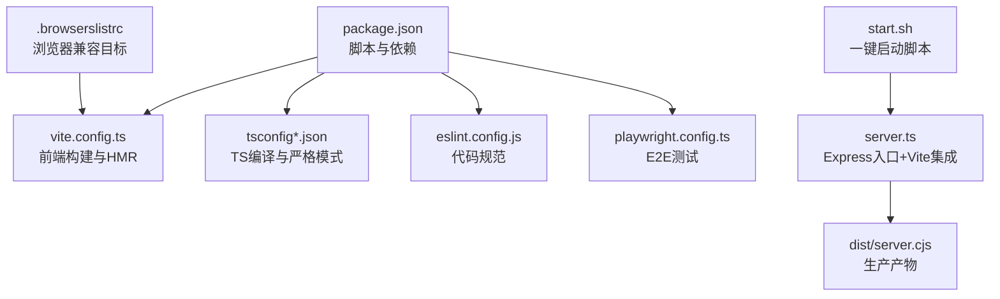
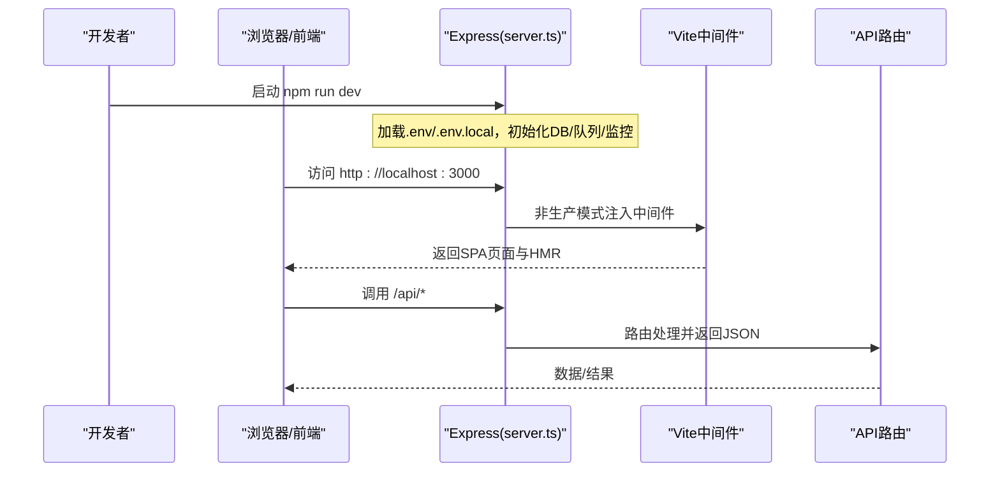
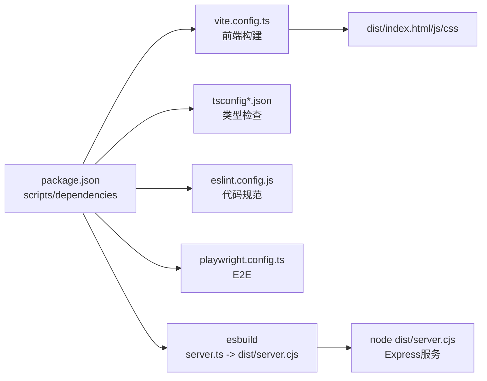

# 开发环境配置

<cite>
**本文引用的文件**
- [package.json](file://package.json)
- [tsconfig.json](file://tsconfig.json)
- [tsconfig.server.json](file://tsconfig.server.json)
- [tsconfig.strict.json](file://tsconfig.strict.json)
- [vite.config.ts](file://vite.config.ts)
- [eslint.config.js](file://eslint.config.js)
- [playwright.config.ts](file://playwright.config.ts)
- [server.ts](file://server.ts)
- [start.sh](file://start.sh)
- [Dockerfile](file://Dockerfile)
- [.browserslistrc](file://.browserslistrc)
</cite>

## 目录
1. [简介](#简介)
2. [项目结构](#项目结构)
3. [核心组件](#核心组件)
4. [架构总览](#架构总览)
5. [详细组件分析](#详细组件分析)
6. [依赖关系分析](#依赖关系分析)
7. [性能注意事项](#性能注意事项)
8. [故障排查指南](#故障排查指南)
9. [结论](#结论)
10. [附录](#附录)

## 简介
本指南面向“智能问数据分析系统”的开发环境搭建与本地调试，覆盖 Node.js/npm/yarn 版本要求、依赖安装与初始化流程；详解 TypeScript 配置（严格模式、路径别名、编译选项）；说明 Vite 构建与开发服务器配置（热重载、代理/安全头）；介绍 Husky Git 钩子与提交前检查；提供 VS Code 等 IDE 推荐配置；并汇总常见环境问题与解决方案。

## 项目结构
本项目采用前后端同仓工程：前端基于 React + Vite，后端使用 Express + TypeScript，通过统一入口 server.ts 在开发期集成 Vite 中间件，在生产期提供静态资源与 API。关键配置文件包括 package.json、TypeScript 多配置、Vite 配置、ESLint 规则、Playwright E2E 配置以及启动脚本。

**图表来源**
- [package.json:6-24](file://package.json#L6-L24)
- [vite.config.ts:10-40](file://vite.config.ts#L10-L40)
- [tsconfig.json:2-25](file://tsconfig.json#L2-L25)
- [eslint.config.js:7-36](file://eslint.config.js#L7-L36)
- [playwright.config.ts:7-38](file://playwright.config.ts#L7-L38)
- [server.ts:82-296](file://server.ts#L82-L296)
- [start.sh:43-137](file://start.sh#L43-L137)
- [.browserslistrc:9-16](file://.browserslistrc#L9-L16)

**章节来源**
- [package.json:6-24](file://package.json#L6-L24)
- [server.ts:82-296](file://server.ts#L82-L296)
- [start.sh:43-137](file://start.sh#L43-L137)

## 核心组件
- 包管理与脚本：通过 package.json 的 scripts 提供 dev/build/start/lint/test/e2e 等命令，统一开发体验。
- TypeScript：基础 tsconfig.json 定义模块目标、JSX、路径别名与 noEmit；tsconfig.server.json 启用 strict；tsconfig.strict.json 开启 strictNullChecks 用于 src 业务代码。
- 构建与开发：vite.config.ts 配置 React/Tailwind 插件、别名、HMR、CSP 响应头与 Vitest 排除项。
- 服务端：server.ts 负责 Express 应用初始化、环境变量加载、路由挂载、健康检查、Prometheus 指标、Vite 开发中间件或生产静态资源服务。
- 质量保障：eslint.config.js 统一 TS/React 规则；playwright.config.ts 管理 E2E 用例执行与浏览器通道。
- 启动与部署：start.sh 自动检测依赖与外部服务（MySQL/Redis/Ollama），一键拉起应用；Dockerfile 提供多阶段构建与运行镜像。

**章节来源**
- [package.json:6-24](file://package.json#L6-L24)
- [tsconfig.json:2-25](file://tsconfig.json#L2-L25)
- [tsconfig.server.json:1-8](file://tsconfig.server.json#L1-L8)
- [tsconfig.strict.json:1-8](file://tsconfig.strict.json#L1-L8)
- [vite.config.ts:10-40](file://vite.config.ts#L10-L40)
- [eslint.config.js:7-36](file://eslint.config.js#L7-L36)
- [playwright.config.ts:7-38](file://playwright.config.ts#L7-L38)
- [server.ts:82-296](file://server.ts#L82-L296)
- [start.sh:43-137](file://start.sh#L43-L137)
- [Dockerfile:18-46](file://Dockerfile#L18-L46)

## 架构总览
下图展示开发期与生产期的请求处理路径差异：开发期由 Express 内嵌 Vite 中间件提供 HMR 与热更新；生产期直接提供 dist 静态资源。

**图表来源**
- [server.ts:82-122](file://server.ts#L82-L122)
- [server.ts:133-183](file://server.ts#L133-L183)
- [server.ts:282-296](file://server.ts#L282-L296)
- [vite.config.ts:25-35](file://vite.config.ts#L25-L35)

## 详细组件分析

### Node.js、npm/yarn 与依赖安装
- Node.js 版本：Dockerfile 使用 node:22-alpine 作为构建与运行基线，建议本地使用 Node.js 22 LTS。
- 包管理器：项目根存在 package-lock.json，推荐使用 npm；yarn 亦可但需保证 lock 一致。
- 依赖安装：首次运行 start.sh 会检测 node_modules 并执行 npm install；也可手动执行 npm install。
- 脚本命令：
  - 开发：npm run dev（tsx server.ts）
  - 构建：npm run build（vite build + esbuild 打包 server.cjs）
  - 启动：npm start（node dist/server.cjs）
  - 类型检查：npm run lint / lint:server / lint:strict
  - 单元测试：npm test（vitest）
  - E2E：npm run test:e2e（playwright）

**章节来源**
- [Dockerfile:18-46](file://Dockerfile#L18-L46)
- [package.json:6-24](file://package.json#L6-L24)
- [start.sh:43-50](file://start.sh#L43-L50)

### TypeScript 配置
- 基础配置（tsconfig.json）：
  - 目标与模块：target ES2022，module ESNext，moduleResolution bundler，isolatedModules true，moduleDetection force。
  - JSX：react-jsx。
  - 路径别名：@/* -> ./*，配合 vite.resolve.alias 实现统一解析。
  - 其他：skipLibCheck true，allowImportingTsExtensions true，noEmit true（仅类型检查）。
- 服务端严格配置（tsconfig.server.json）：
  - 继承基础配置，启用 strict，限定 types 为 node，包含 server/** 与 server.ts。
- 前端严格空值检查（tsconfig.strict.json）：
  - 继承基础配置，启用 strictNullChecks，仅作用于 src/**，排除测试文件。

实践建议：
- 新增服务端代码时，确保被 tsconfig.server.json 的 include 覆盖，以启用严格模式。
- 新增前端业务代码时，可参考 tsconfig.strict.json 逐步开启 strictNullChecks。

**章节来源**
- [tsconfig.json:2-25](file://tsconfig.json#L2-L25)
- [tsconfig.server.json:1-8](file://tsconfig.server.json#L1-L8)
- [tsconfig.strict.json:1-8](file://tsconfig.strict.json#L1-L8)

### Vite 构建与开发服务器
- 插件与别名：启用 @vitejs/plugin-react 与 @tailwindcss/vite；别名 @ 指向项目根。
- 环境变量注入：将 package.json 中的 version 注入为 import.meta.env.VITE_APP_VERSION，供前端读取。
- 开发服务器：
  - HMR：可通过 DISABLE_HMR=true 关闭文件监听与 HMR（适用于 AI Studio 编辑场景）。
  - 安全头：开发模式下设置宽松 CSP，允许 HMR 与内联脚本；生产模式在 Express 中设置更严格的 CSP。
- 测试排除：Vitest 排除 node_modules、dist 与 tests/e2e（E2E 由 Playwright 单独运行）。

注意：若需要代理到后端 API，可在 vite.config.ts 的 server.proxy 中添加规则（当前未配置，可按需扩展）。

**章节来源**
- [vite.config.ts:10-40](file://vite.config.ts#L10-L40)
- [server.ts:145-167](file://server.ts#L145-L167)

### Husky Git 钩子与提交前检查
- 准备脚本：package.json 中包含 prepare 钩子，安装依赖后自动执行 husky 初始化。
- 钩子目录：.husky/_ 已存在，表明已启用 Husky。
- 建议工作流：
  - pre-commit：执行 tsc --noEmit（lint）、eslint、vitest 单测。
  - commit-msg：校验提交信息格式（可选）。
  - 结合 CI：在 GitHub Actions 中重复相同检查。

提示：如需自定义具体命令，请在 .husky 下添加对应钩子脚本并在其中调用 npm run lint / test 等命令。

**章节来源**
- [package.json:24](file://package.json#L24)
- [eslint.config.js:7-36](file://eslint.config.js#L7-L36)

### IDE 推荐配置（VS Code）
- 扩展建议：
  - ESLint：启用保存时检查，遵循 eslint.config.js 规则。
  - Prettier（可选）：与 ESLint 集成进行格式化。
  - Tailwind CSS IntelliSense：享受类名补全。
  - Error Lens：行内显示错误与警告。
  - Vue/React 相关工具（按需）。
- 调试配置（launch.json 示例思路）：
  - Node 调试：运行 npm run dev，附加到正在运行的 tsx server.ts 进程。
  - Chrome 调试：打开浏览器后使用内置调试器连接前端。
- 代码片段：
  - 为常用组件/函数创建 snippets，提升效率。
- 工作区设置：
  - 将 tsconfig.json 设为默认 TS 配置；对 server 代码使用 tsconfig.server.json。

[本节为通用建议，不直接引用具体文件]

### 启动与运行
- 一键启动：执行 ./start.sh，会自动检查 Node、MySQL、Redis、Ollama 并启动应用。
- 环境变量：支持 .env.local 与 .env，优先级按 server.ts 中加载顺序生效。
- 端口与主机：默认 PORT=3000，HOST=127.0.0.1；生产容器设置为 HOST=0.0.0.0。
- 健康检查：/api/health 返回 ok；Docker HEALTHCHECK 使用该端点。

**章节来源**
- [start.sh:43-137](file://start.sh#L43-L137)
- [server.ts:12-19](file://server.ts#L12-L19)
- [server.ts:82-96](file://server.ts#L82-L96)
- [Dockerfile:27-46](file://Dockerfile#L27-L46)

## 依赖关系分析
- 运行时依赖：Express、数据库驱动（mysql2/pg）、Redis（ioredis）、JWT、Prometheus 客户端等。
- 开发依赖：Vite、esbuild、TypeScript、Vitest、Playwright、ESLint、TailwindCSS 等。
- 构建链路：vite build 生成前端产物；esbuild 将 server.ts 打包为 dist/server.cjs；生产通过 node dist/server.cjs 启动。

**图表来源**
- [package.json:6-24](file://package.json#L6-L24)
- [vite.config.ts:10-40](file://vite.config.ts#L10-L40)
- [tsconfig.json:2-25](file://tsconfig.json#L2-L25)
- [eslint.config.js:7-36](file://eslint.config.js#L7-L36)
- [playwright.config.ts:7-38](file://playwright.config.ts#L7-L38)

**章节来源**
- [package.json:26-74](file://package.json#L26-L74)

## 性能注意事项
- 开发期 HMR：可通过 DISABLE_HMR 控制，避免在特定编辑器场景下频繁刷新导致卡顿。
- 资源体积：Tailwind 与 Recharts 等库较大，建议按需引入与 Tree-shaking。
- 后端限流与缓存：Redis 预热与状态外置可减少冷启动抖动；合理设置 JSON body 大小限制。
- 浏览器兼容：.browserslistrc 指定现代浏览器范围，减少不必要的 polyfill。

**章节来源**
- [vite.config.ts:25-35](file://vite.config.ts#L25-L35)
- [server.ts:112-122](file://server.ts#L112-L122)
- [.browserslistrc:9-16](file://.browserslistrc#L9-L16)

## 故障排查指南
- 无法启动或端口占用：
  - 检查 3000 端口是否被占用；start.sh 会尝试停止旧实例。
  - 确认 MySQL/Redis/Ollama 是否就绪（start.sh 有轮询逻辑）。
- 环境变量未生效：
  - 确认 .env.local 或 .env 放置位置与加载顺序；server.ts 优先加载 __dirname 与父目录。
- 生产密钥缺失：
  - 生产环境必须设置 JWT_SECRET，否则拒绝启动。
- 前端样式异常：
  - 检查 Tailwind 插件与 CSP 头；开发模式允许内联脚本与 unsafe-inline。
- E2E 失败：
  - 检查 playwright.config.ts 的 webServer 与 baseURL；CI 环境下可自动拉起服务。
- Docker 健康检查失败：
  - 确认 /api/health 可达；HEALTHCHECK 每 30s 探测一次。

**章节来源**
- [start.sh:43-137](file://start.sh#L43-L137)
- [server.ts:12-19](file://server.ts#L12-L19)
- [server.ts:91-96](file://server.ts#L91-L96)
- [server.ts:145-167](file://server.ts#L145-L167)
- [playwright.config.ts:7-38](file://playwright.config.ts#L7-L38)
- [Dockerfile:41-46](file://Dockerfile#L41-L46)

## 结论
通过统一的脚本与配置，本项目实现了从开发到生产的完整闭环：TypeScript 严格模式保障类型安全，Vite 提供高效的前端开发与构建，Express 整合 API 与静态资源，Husky 与 ESLint 保障代码质量，Playwright 覆盖端到端测试。按照本指南完成环境配置与依赖安装后，即可快速进入开发与调试。

## 附录
- 常用命令速查：
  - 开发：npm run dev
  - 构建：npm run build
  - 启动：npm start
  - 类型检查：npm run lint / lint:server / lint:strict
  - 单测：npm test
  - E2E：npm run test:e2e
- 浏览器兼容目标：见 .browserslistrc，覆盖主流现代浏览器。

**章节来源**
- [package.json:6-24](file://package.json#L6-L24)
- [.browserslistrc:9-16](file://.browserslistrc#L9-L16)