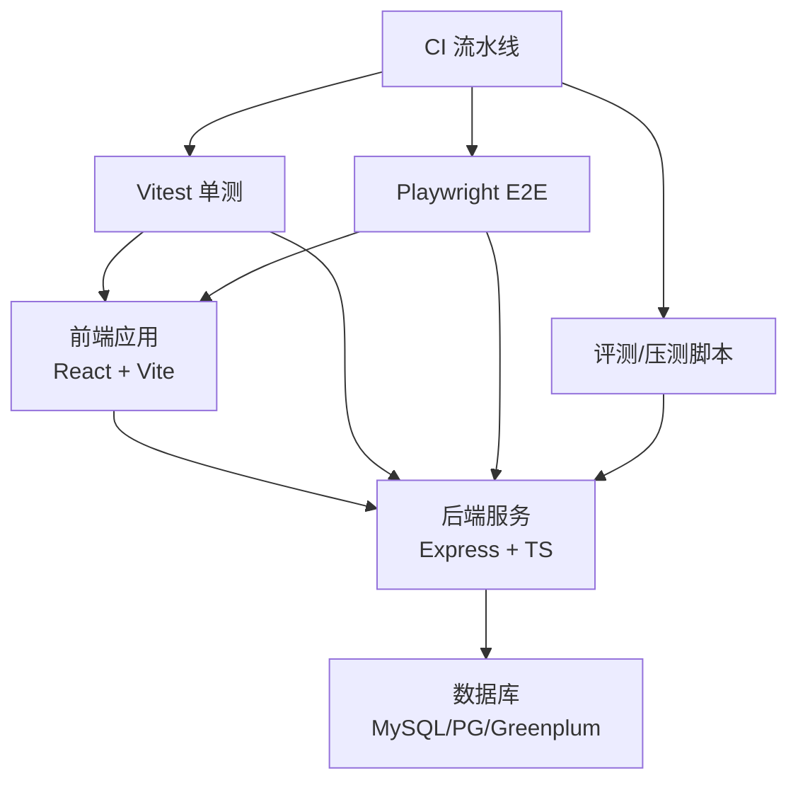
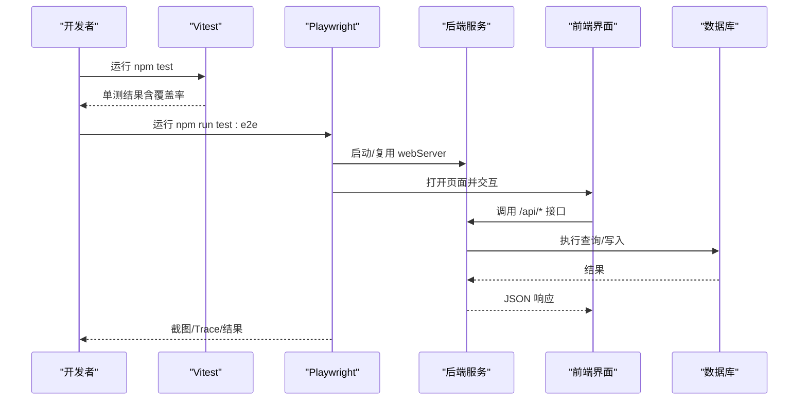
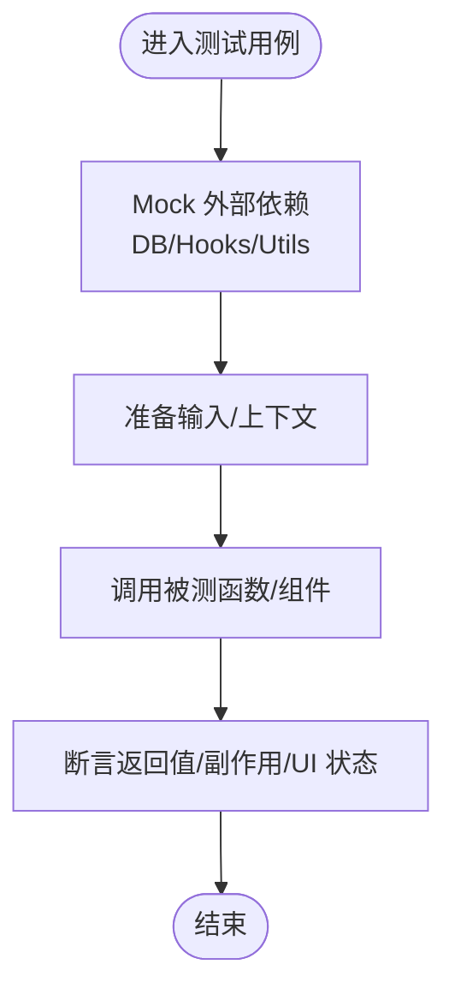
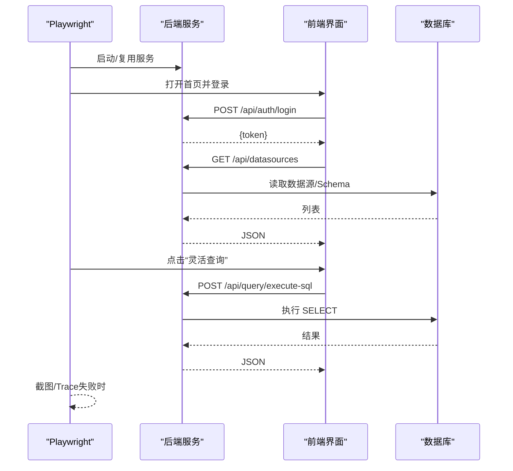
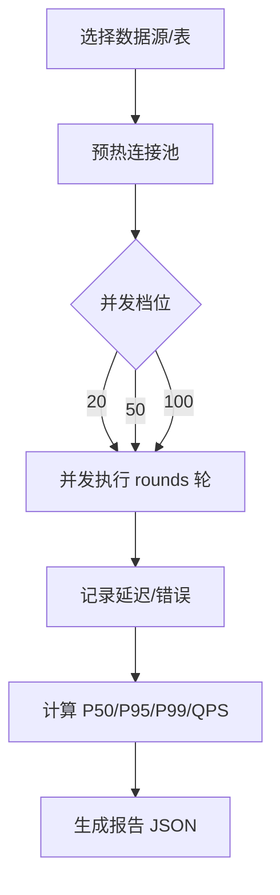
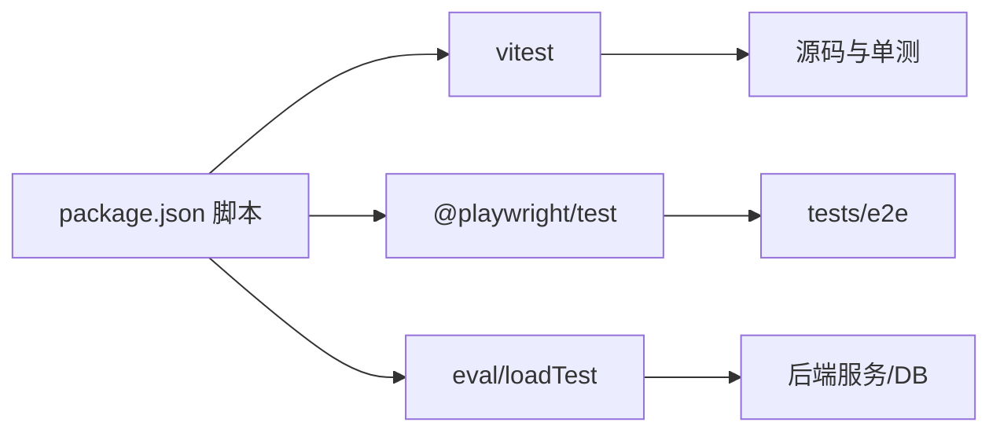

# 测试策略与实践

<cite>
**本文引用的文件**
- [package.json](file://package.json)
- [vite.config.ts](file://vite.config.ts)
- [playwright.config.ts](file://playwright.config.ts)
- [.github/workflows/ci.yml](file://.github/workflows/ci.yml)
- [tests/e2e/smoke.spec.ts](file://tests/e2e/smoke.spec.ts)
- [tests/e2e/flexquery.spec.ts](file://tests/e2e/flexquery.spec.ts)
- [server/auth/accessControl.test.ts](file://server/auth/accessControl.test.ts)
- [src/utils/flexQueryBuilder.test.ts](file://src/utils/flexQueryBuilder.test.ts)
- [src/components/charts/DataTable.test.tsx](file://src/components/charts/DataTable.test.tsx)
- [server/eval/loadTest.ts](file://server/eval/loadTest.ts)
- [server/eval/runEval.ts](file://server/eval/runEval.ts)
</cite>

## 目录
1. [简介](#简介)
2. [项目结构](#项目结构)
3. [核心组件](#核心组件)
4. [架构总览](#架构总览)
5. [详细组件分析](#详细组件分析)
6. [依赖分析](#依赖分析)
7. [性能考虑](#性能考虑)
8. [故障排查指南](#故障排查指南)
9. [结论](#结论)
10. [附录](#附录)

## 简介
本指南面向“智能问数据分析系统”的测试策略与工程实践，围绕测试金字塔（单元测试、集成测试、端到端测试）展开，结合项目现有实现，给出可落地的配置说明、数据管理方案、最佳实践与 CI/CD 集成方法。重点覆盖：
- Vitest 单元测试环境、Mock 策略与覆盖率报告
- Playwright E2E 浏览器自动化、页面交互与截图对比
- 测试数据管理（测试数据库、Mock 数据、用例设计）
- 测试编写规范（命名、断言、异步处理）
- 执行命令、CI 门禁与性能评测方法

## 项目结构
仓库采用前后端同仓组织，测试代码按层级分布：
- 单元测试：与源码就近放置（如 server/*/*.test.ts、src/utils/*.test.ts、src/components/**/*.test.tsx），由 Vite/Vitest 统一发现与运行
- 端到端测试：集中在 tests/e2e 下，使用 Playwright 驱动真实浏览器进行冒烟与关键流程回归
- 评测与压测：server/eval 提供评测集校验、LLM 准确率评测与连接池压测脚本
- CI：.github/workflows/ci.yml 定义质量门禁（类型检查、ESLint、OpenAPI 同步、状态巡检、Vitest 全量单测、评测集结构门禁）

**章节来源**
- [package.json:6-24](file://package.json#L6-L24)
- [vite.config.ts:36-39](file://vite.config.ts#L36-L39)
- [playwright.config.ts:7-38](file://playwright.config.ts#L7-L38)
- [.github/workflows/ci.yml:14-38](file://.github/workflows/ci.yml#L14-L38)

## 核心组件
- 测试框架与工具链
  - Vitest：用于前端与后端单元测试，排除 E2E 用例，支持 jsdom 环境渲染 React 组件
  - Playwright：E2E 自动化，默认复用本地开发服务器，失败时截图与 Trace 留存
  - Testing Library：React 组件测试，配合 vi.mock 隔离外部依赖
- 评测与压测
  - 评测入口 runEval：支持指定评测集、最小准确率阈值，非零退出用于 CI 门禁
  - 压测脚本 loadTest：对 SQL 执行层进行多并发档位压测，输出 P50/P95/P99、QPS 与错误样本

**章节来源**
- [package.json:47-74](file://package.json#L47-L74)
- [vite.config.ts:36-39](file://vite.config.ts#L36-L39)
- [playwright.config.ts:15-21](file://playwright.config.ts#L15-L21)
- [server/eval/runEval.ts:1-51](file://server/eval/runEval.ts#L1-L51)
- [server/eval/loadTest.ts:1-161](file://server/eval/loadTest.ts#L1-L161)

## 架构总览
测试金字塔在本项目的落地方式：
- 单元测试（底层）：覆盖纯函数、工具类、服务端逻辑分支与边界条件；通过 Mock 隔离 DB/网络等外部依赖
- 集成测试（中层）：以真实或轻量化的外部依赖验证模块协作（例如 SQL 执行层、鉴权与 ACL 解析）
- 端到端测试（顶层）：基于真实浏览器与服务，覆盖登录、路由返回 JSON、知识库面板加载、灵活查询主流程等关键路径

**图表来源**
- [playwright.config.ts:30-37](file://playwright.config.ts#L30-L37)
- [tests/e2e/smoke.spec.ts:32-51](file://tests/e2e/smoke.spec.ts#L32-L51)
- [tests/e2e/flexquery.spec.ts:69-93](file://tests/e2e/flexquery.spec.ts#L69-L93)

**章节来源**
- [playwright.config.ts:7-38](file://playwright.config.ts#L7-L38)
- [tests/e2e/smoke.spec.ts:1-87](file://tests/e2e/smoke.spec.ts#L1-L87)
- [tests/e2e/flexquery.spec.ts:1-128](file://tests/e2e/flexquery.spec.ts#L1-L128)

## 详细组件分析

### 单元测试（Vitest）
- 环境与配置
  - 通过 vite.config.ts 的 test.exclude 将 E2E 用例排除在 Vitest 之外，避免重复执行
  - React 组件测试使用 @vitest-environment jsdom，便于 DOM 操作与断言
- Mock 策略
  - 使用 vi.mock 对模块级依赖进行替换（如 hooks、工具函数、数据库连接池）
  - 针对数据库访问，mock pool.query 以控制返回值，验证业务分支与异常路径
- 覆盖率报告
  - 可在 Vitest 中开启覆盖率收集（如 --coverage），结合 CI 输出 HTML/JSON 报告，纳入质量门禁

示例参考：
- 服务端 ACL 解析与授权逻辑的单测，覆盖解析、清洗、判定与 DB 交互
- 灵活查询 SQL 构建器单测，覆盖多方言、安全过滤、JOIN、HAVING、金额单位换算等场景
- 前端 DataTable 组件测试，覆盖空态、搜索、排序、分页、格式化与导出行为

**图表来源**
- [server/auth/accessControl.test.ts:97-146](file://server/auth/accessControl.test.ts#L97-L146)
- [src/utils/flexQueryBuilder.test.ts:36-130](file://src/utils/flexQueryBuilder.test.ts#L36-L130)
- [src/components/charts/DataTable.test.tsx:33-103](file://src/components/charts/DataTable.test.tsx#L33-L103)

**章节来源**
- [vite.config.ts:36-39](file://vite.config.ts#L36-L39)
- [server/auth/accessControl.test.ts:1-147](file://server/auth/accessControl.test.ts#L1-L147)
- [src/utils/flexQueryBuilder.test.ts:1-458](file://src/utils/flexQueryBuilder.test.ts#L1-L458)
- [src/components/charts/DataTable.test.tsx:1-104](file://src/components/charts/DataTable.test.tsx#L1-L104)

### 端到端测试（Playwright）
- 配置要点
  - 测试目录 tests/e2e，超时与重试策略适配 CI
  - 自动拉起/复用 webServer（tsx server.ts），健康检查 URL 就绪后开始用例
  - 失败截图与 Trace 保留，便于定位问题
- 用例设计
  - 冒烟回归：登录主界面渲染、核心 API 一律返回 JSON、知识库面板加载
  - 灵活查询：选源选表→添加维度/指标→SQL 预览→执行查询→结果展示；多表 JOIN；行数上限防爆量

**图表来源**
- [playwright.config.ts:30-37](file://playwright.config.ts#L30-L37)
- [tests/e2e/smoke.spec.ts:23-85](file://tests/e2e/smoke.spec.ts#L23-L85)
- [tests/e2e/flexquery.spec.ts:69-127](file://tests/e2e/flexquery.spec.ts#L69-L127)

**章节来源**
- [playwright.config.ts:1-39](file://playwright.config.ts#L1-L39)
- [tests/e2e/smoke.spec.ts:1-87](file://tests/e2e/smoke.spec.ts#L1-L87)
- [tests/e2e/flexquery.spec.ts:1-128](file://tests/e2e/flexquery.spec.ts#L1-L128)

### 评测与性能测试
- 评测集门禁
  - 结构校验：规模、分层覆盖、权限类覆盖
  - 准确率阈值：低于阈值则 CI 失败
- 连接池压测
  - 对 executeSafeSql 全链路施压，统计延迟分位与 QPS，验证池容量公式与无连接耗尽
  - 报告落盘至 reports 目录，便于回溯

**图表来源**
- [server/eval/loadTest.ts:45-154](file://server/eval/loadTest.ts#L45-L154)

**章节来源**
- [server/eval/runEval.ts:1-51](file://server/eval/runEval.ts#L1-L51)
- [server/eval/loadTest.ts:1-161](file://server/eval/loadTest.ts#L1-L161)

## 依赖分析
- 测试与运行脚本
  - package.json 暴露 test、test:e2e、eval、loadtest 等脚本，统一入口
- 测试框架与插件
  - vitest、@playwright/test、@testing-library/react、jsdom
- 运行时依赖
  - express、mysql2/pg、prom-client 等（E2E 与压测会涉及真实服务/数据库）

**图表来源**
- [package.json:6-24](file://package.json#L6-L24)
- [package.json:47-74](file://package.json#L47-L74)

**章节来源**
- [package.json:6-24](file://package.json#L6-L24)
- [package.json:47-74](file://package.json#L47-L74)

## 性能考虑
- 压测目标：聚焦 SQL 执行层的连接池与吞吐，避开 LLM 长耗时环节
- 关键指标：P50/P95/P99 延迟、QPS、错误率、最大延迟
- 调优建议：
  - 根据 dsPoolMax 调整并发档位，观察是否出现连接耗尽
  - 通过 evaluate 报告定位瓶颈（DB 侧 vs 应用侧）
  - 结合 Prometheus 指标（如 prom-client）做线上观测

[本节为通用指导，不直接分析具体文件]

## 故障排查指南
- E2E 失败快速定位
  - 查看失败截图与 Trace（playwright.config.ts 已配置 only-on-failure 与 retain-on-failure）
  - 确认 webServer 是否成功启动与健康检查通过
- 单测失败常见原因
  - Mock 未正确设置导致 DB/Hook 调用异常
  - 组件测试环境缺失（需 jsdom 环境）
- 评测/压测失败
  - 检查数据库连接与 Schema 初始化
  - 确认数据源类型与表存在，探针 SQL 可执行

**章节来源**
- [playwright.config.ts:15-21](file://playwright.config.ts#L15-L21)
- [server/eval/loadTest.ts:57-90](file://server/eval/loadTest.ts#L57-L90)
- [server/eval/runEval.ts:34-50](file://server/eval/runEval.ts#L34-L50)

## 结论
本项目已形成较完整的测试体系：以 Vitest 为核心的单元/集成测试保障代码正确性，以 Playwright 为主的 E2E 守护关键用户路径，辅以评测与压测脚本保障质量与稳定性。建议在团队内推广以下实践：
- 严格遵循测试金字塔，优先写高价值、低成本的单测
- 使用 Mock 隔离外部依赖，确保单测稳定与快速
- E2E 用例聚焦关键路径与回归防线，避免脆弱选择器
- 将覆盖率与评测阈值纳入 CI 门禁，持续改进质量

[本节为总结性内容，不直接分析具体文件]

## 附录

### 测试金字塔职责与层次
- 单元测试：验证函数/模块内部逻辑、边界与异常路径；快速、稳定、可并行
- 集成测试：验证模块间协作与外部依赖交互（如 DB、缓存、消息队列）
- 端到端测试：验证用户旅程与跨层集成（登录、查询、报表、导出）

[本节为概念性说明，不直接分析具体文件]

### Vitest 配置与覆盖率
- 排除 E2E：vite.config.ts 中 test.exclude 排除 tests/e2e
- 组件测试环境：jsdom 用于 React 组件测试
- 覆盖率：可通过 Vitest 参数启用，并在 CI 中收集报告

**章节来源**
- [vite.config.ts:36-39](file://vite.config.ts#L36-L39)
- [src/components/charts/DataTable.test.tsx:1-4](file://src/components/charts/DataTable.test.tsx#L1-L4)

### Playwright E2E 配置要点
- 自动拉起/复用服务：webServer 命令与 health check
- 失败截图与 Trace：仅失败时保留，节省空间
- 浏览器渠道：优先使用系统 Chrome，CI 可切换 chromium

**章节来源**
- [playwright.config.ts:15-37](file://playwright.config.ts#L15-L37)

### 测试数据管理
- 测试数据库：E2E 与压测依赖真实数据源；单测通过 Mock 隔离
- Mock 数据：单测中构造最小数据集，覆盖正常与异常分支
- 用例设计：按功能域拆分，关注边界值与安全校验（如 SQL 注入防护、白名单）

**章节来源**
- [server/auth/accessControl.test.ts:97-146](file://server/auth/accessControl.test.ts#L97-L146)
- [tests/e2e/flexquery.spec.ts:18-37](file://tests/e2e/flexquery.spec.ts#L18-L37)

### 测试编写最佳实践
- 命名：describe/it 清晰表达场景与预期
- 断言：使用领域化断言（如 toBeVisible、toHaveCount），避免硬编码文本
- 异步：合理使用 waitForResponse、waitForTimeout 与超时配置
- 隔离：用 vi.mock 隔离外部依赖，保证单测稳定性

**章节来源**
- [tests/e2e/smoke.spec.ts:23-85](file://tests/e2e/smoke.spec.ts#L23-L85)
- [tests/e2e/flexquery.spec.ts:69-127](file://tests/e2e/flexquery.spec.ts#L69-L127)
- [server/auth/accessControl.test.ts:17-95](file://server/auth/accessControl.test.ts#L17-L95)

### 执行命令与 CI/CD 集成
- 本地执行
  - 单测：npm test
  - E2E：npm run test:e2e
  - 评测：npm run eval
  - 压测：npm run loadtest
- CI 门禁
  - 类型检查、ESLint、OpenAPI 同步、状态巡检、Vitest 全量单测
  - 评测集结构校验与准确率阈值门禁

**章节来源**
- [package.json:6-24](file://package.json#L6-L24)
- [.github/workflows/ci.yml:14-67](file://.github/workflows/ci.yml#L14-L67)