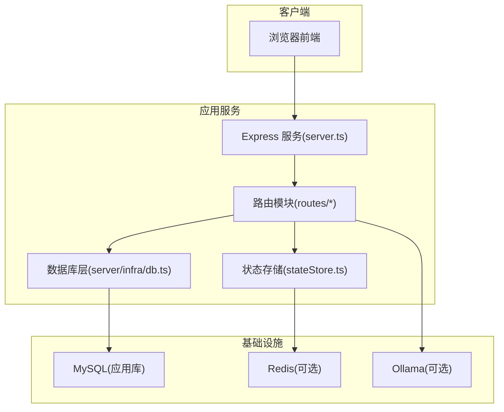
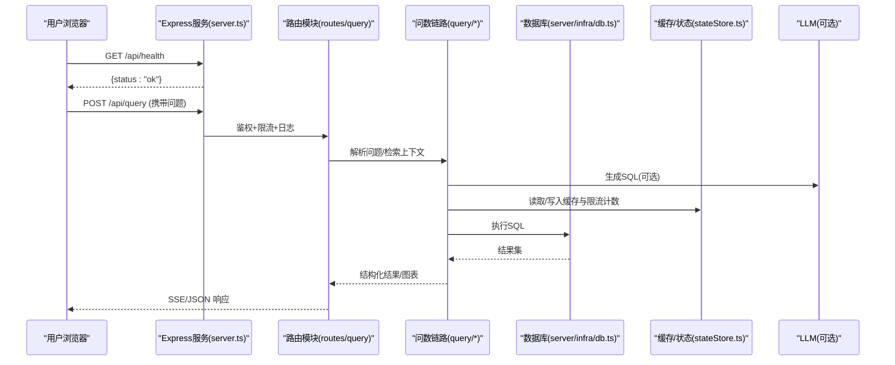
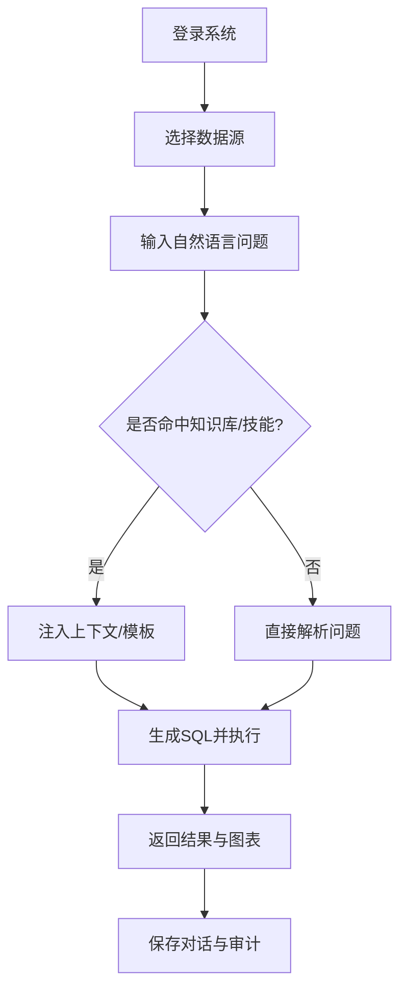
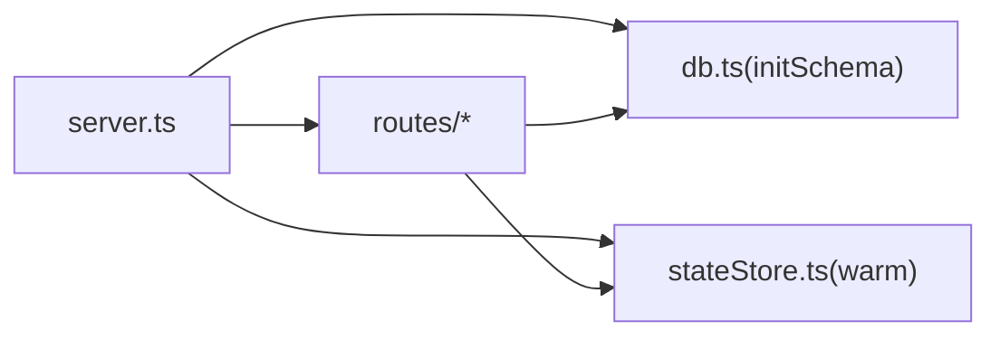

# 快速开始

<cite>
**本文引用的文件**
- [package.json](file://package.json)
- [Dockerfile](file://Dockerfile)
- [docker-compose.multi-instance.yml](file://docker-compose.multi-instance.yml)
- [server.ts](file://server.ts)
- [start.sh](file://start.sh)
- [server/infra/db.ts](file://server/infra/db.ts)
- [scripts/init-data-resource.ts](file://scripts/init-data-resource.ts)
- [scripts/init_data_resource_db.sql](file://scripts/init_data_resource_db.sql)
- [server/routes/admin.ts](file://server/routes/admin.ts)
- [src/components/admin/EnvironmentConfigPanel.tsx](file://src/components/admin/EnvironmentConfigPanel.tsx)
- [server/seedData.ts](file://server/seedData.ts)
- [server/infra/stateStore.ts](file://server/infra/stateStore.ts)
</cite>

## 目录
1. [简介](#简介)
2. [项目结构](#项目结构)
3. [核心组件](#核心组件)
4. [架构总览](#架构总览)
5. [详细组件分析](#详细组件分析)
6. [依赖关系分析](#依赖关系分析)
7. [性能注意事项](#性能注意事项)
8. [故障排查指南](#故障排查指南)
9. [结论](#结论)
10. [附录](#附录)

## 简介
本指南面向首次接触“智能问数据分析系统”的用户，目标是在30分钟内完成本地环境搭建、数据库初始化、运行服务并执行第一个自然语言查询。内容涵盖：
- 环境要求（Node.js、MySQL/PostgreSQL、Redis）
- 本地开发环境一键启动与配置
- Docker 单实例与多实例部署
- 数据资源库初始化与第一个查询演示
- 常见问题与排错建议

## 项目结构
系统采用前后端一体化交付：前端通过 Vite 构建，后端使用 Express 提供 REST API；应用状态可落库 MySQL，可选外置共享状态到 Redis；支持 Ollama/Gemini 等 LLM 后端；提供多实例编排示例与监控配置。

图表来源
- [server.ts:82-199](file://server.ts#L82-L199)
- [server/infra/db.ts:52-70](file://server/infra/db.ts#L52-L70)
- [server/infra/stateStore.ts:169-218](file://server/infra/stateStore.ts#L169-L218)

章节来源
- [server.ts:82-199](file://server.ts#L82-L199)
- [package.json:6-24](file://package.json#L6-L24)

## 核心组件
- 启动入口与中间件：加载环境变量、注册安全头、请求日志、Prometheus 指标、健康检查与路由挂载。
- 数据库初始化：自动建库建表、种子数据（管理员账号、演示数据源、模板等）。
- 状态存储：默认内存实现，配置 REDIS_URL 后切换为 Redis，支持分布式锁、限流窗口、键前缀清理。
- 数据资源初始化脚本：一键创建业务库、导入样本数据、注册数据源、知识库与技能模板。
- 多实例编排：Compose 编排两个无状态应用副本 + Redis + Nginx 负载均衡。

章节来源
- [server.ts:82-199](file://server.ts#L82-L199)
- [server/infra/db.ts:52-798](file://server/infra/db.ts#L52-L798)
- [server/infra/stateStore.ts:169-218](file://server/infra/stateStore.ts#L169-L218)
- [scripts/init-data-resource.ts:48-187](file://scripts/init-data-resource.ts#L48-L187)
- [docker-compose.multi-instance.yml:1-50](file://docker-compose.multi-instance.yml#L1-L50)

## 架构总览
下图展示从浏览器发起查询到返回结果的端到端流程，包括鉴权、NL2SQL、SQL 执行、结果渲染与审计埋点。

图表来源
- [server.ts:187-265](file://server.ts#L187-L265)
- [server/infra/db.ts:52-70](file://server/infra/db.ts#L52-L70)
- [server/infra/stateStore.ts:169-218](file://server/infra/stateStore.ts#L169-L218)

## 详细组件分析

### 环境与依赖要求
- Node.js：建议使用 LTS 版本（容器基于 node:22-alpine）。
- 数据库：
  - MySQL：应用库由服务启动时自动创建与初始化（utf8mb4）。
  - PostgreSQL：可作为数据源接入（见数据源类型与配置）。
- Redis：可选，用于多实例共享状态、限流与缓存；未配置时回退进程内存模式。
- Ollama：可选，用于本地模型推理；缺失仅提示不阻断。

章节来源
- [Dockerfile:18-46](file://Dockerfile#L18-L46)
- [server/infra/db.ts:16-24](file://server/infra/db.ts#L16-L24)
- [server/infra/stateStore.ts:169-218](file://server/infra/stateStore.ts#L169-L218)
- [start.sh:94-114](file://start.sh#L94-L114)

### 本地开发环境搭建（30分钟快速上手）
步骤概览：
1) 准备依赖与环境变量
- 安装 Node.js（LTS），确保 npm 可用。
- 复制并编辑 .env.local（或 .env），至少配置：
  - JWT_SECRET（生产必须，开发可临时）
  - MYSQL_HOST/MYSQL_PORT/MYSQL_USER/MYSQL_PASSWORD/MYSQL_DATABASE
  - 可选：REDIS_URL、OLLAMA_URL、LLM_MODEL 等

2) 启动 MySQL
- 确保本机 MySQL 已运行（端口 3306），或通过 brew/mysql.server 启动。

3) 启动 Redis（可选）
- 若配置了 REDIS_URL 且指向本机，脚本会尝试拉起；远端 Redis 仅做连通性检测。

4) 启动 Ollama（可选）
- 确保 :11434 可达；首次问数前按需拉取模型。

5) 安装依赖并启动服务
- 执行 npm install（首次）
- 执行 ./start.sh 或直接 npx tsx server.ts
- 访问 http://localhost:3000，默认管理员 admin/admin123（首次登录强制改密）

6) 初始化数据资源库（可选，便于立即体验）
- 执行 npm run init:data-resource，将创建 data_resource_db 并导入样本数据与知识条目。

章节来源
- [start.sh:43-138](file://start.sh#L43-L138)
- [scripts/init-data-resource.ts:48-187](file://scripts/init-data-resource.ts#L48-L187)
- [scripts/init_data_resource_db.sql:15-78](file://scripts/init_data_resource_db.sql#L15-L78)
- [server.ts:12-19](file://server.ts#L12-L19)

### Docker 一键部署
- 构建镜像：docker build -t smart-data-analytics .
- 运行容器：
  - 暴露 3000 端口
  - 注入必要环境变量（JWT_SECRET、MYSQL_*、ADMIN_*、可选 REDIS_URL）
  - 健康检查：/api/health

- 多实例部署：
  - 使用 docker-compose.multi-instance.yml 启动 app1/app2 + redis + nginx
  - 通过 :8080 访问，Nginx 轮询分发到 3001/3002

章节来源
- [Dockerfile:18-46](file://Dockerfile#L18-L46)
- [docker-compose.multi-instance.yml:1-50](file://docker-compose.multi-instance.yml#L1-L50)

### 环境变量与运行时配置
- 关键环境变量：
  - JWT_SECRET：生产必须设置，否则拒绝启动
  - MYSQL_*：连接应用库
  - ADMIN_USERNAME/ADMIN_PASSWORD：初始管理员账号
  - REDIS_URL：启用 Redis 共享状态（多实例必需）
  - OLLAMA_URL/LLM_MODEL：可选 LLM 后端与模型
- 动态配置管理：
  - 管理员可在“系统管理 → 环境配置”中更新白名单内的配置项（如 OLLAMA_URL、LLM_MODEL、MYSQL_*、JWT_SECRET 等），变更会被审计记录。

章节来源
- [server.ts:91-96](file://server.ts#L91-L96)
- [server/routes/admin.ts:235-294](file://server/routes/admin.ts#L235-L294)
- [src/components/admin/EnvironmentConfigPanel.tsx:37-90](file://src/components/admin/EnvironmentConfigPanel.tsx#L37-L90)

### 数据库初始化与种子数据
- 启动时自动：
  - 创建应用库（smart_analytics）
  - 建表（用户、数据源、审计、知识库、任务队列、看板等）
  - 插入默认管理员账号（首次登录强制改密）
  - 插入演示数据源与预设报告模板
- 数据资源库初始化（独立脚本）：
  - 创建 data_resource_db，导入业务/财务宽表样本数据
  - 在应用库中注册数据源、导入知识与技能模板、评测用例

章节来源
- [server/infra/db.ts:52-798](file://server/infra/db.ts#L52-L798)
- [scripts/init-data-resource.ts:48-187](file://scripts/init-data-resource.ts#L48-L187)
- [scripts/init_data_resource_db.sql:15-78](file://scripts/init_data_resource_db.sql#L15-L78)

### 第一个查询完整演示
目标：从数据源连接到自然语言查询，得到可视化结果。

步骤：
1) 准备数据源
- 方式A：使用内置演示数据源（服务启动时自动写入）
- 方式B：执行数据资源库初始化脚本，获得真实样本数据与知识条目

2) 登录系统
- 打开 http://localhost:3000，使用 admin/admin123 登录并按提示修改密码

3) 选择数据源并提问
- 进入“智能问数”，选择“企业综合运营数仓(Demo)”或“数据资源库”
- 输入问题，例如：“累计投放金额是多少？”或“本月投资收益趋势如何？”

4) 查看结果
- 系统将生成 SQL 并在数据源上执行，返回表格与图表
- 可通过“对话历史”查看历史问答与执行轨迹

图表来源
- [server/seedData.ts:60-100](file://server/seedData.ts#L60-L100)
- [scripts/init-data-resource.ts:48-187](file://scripts/init-data-resource.ts#L48-L187)
- [server/infra/db.ts:780-798](file://server/infra/db.ts#L780-L798)

章节来源
- [server/seedData.ts:60-100](file://server/seedData.ts#L60-L100)
- [scripts/init-data-resource.ts:48-187](file://scripts/init-data-resource.ts#L48-L187)
- [server/infra/db.ts:780-798](file://server/infra/db.ts#L780-L798)

## 依赖关系分析
- 应用服务依赖：
  - MySQL：持久化用户、数据源、审计、知识库、任务队列等
  - Redis：多实例共享状态（限流、缓存、分布式锁）
  - Ollama/Gemini：可选的 LLM 后端
- 启动顺序：
  - 先初始化数据库 schema，再预热 Redis（若启用），最后挂载路由并监听端口

图表来源
- [server.ts:98-131](file://server.ts#L98-L131)
- [server/infra/db.ts:52-70](file://server/infra/db.ts#L52-L70)
- [server/infra/stateStore.ts:194-218](file://server/infra/stateStore.ts#L194-L218)

章节来源
- [server.ts:98-131](file://server.ts#L98-L131)
- [server/infra/db.ts:52-70](file://server/infra/db.ts#L52-L70)
- [server/infra/stateStore.ts:194-218](file://server/infra/stateStore.ts#L194-L218)

## 性能注意事项
- 连接池容量：应用库连接池按并发用户数估算，可通过 APP_POOL_MAX 或 EXPECTED_CONCURRENT_USERS 调整。
- 请求体大小：报告导出与知识库导入放宽至 10MB，其余接口保持 2MB。
- 缓存与限流：启用 Redis 后可提升命中率与跨实例一致性；未启用时回退内存模式。
- 健康检查：容器内每 30s 探测 /api/health，启动宽限 20s。

章节来源
- [server/infra/db.ts:29-43](file://server/infra/db.ts#L29-L43)
- [server.ts:133-143](file://server.ts#L133-L143)
- [server/infra/stateStore.ts:169-218](file://server/infra/stateStore.ts#L169-L218)
- [Dockerfile:41-46](file://Dockerfile#L41-L46)

## 故障排查指南
- 无法启动（生产环境缺少 JWT_SECRET）
  - 现象：进程退出并打印安全告警
  - 处理：设置 JWT_SECRET 环境变量后重启
  - 参考路径：[server.ts:91-96](file://server.ts#L91-L96)

- MySQL 连接失败
  - 现象：initSchema 报错或无法建库
  - 处理：检查 MYSQL_* 环境变量、网络可达性与权限
  - 参考路径：[server/infra/db.ts:16-24](file://server/infra/db.ts#L16-L24)

- Redis 不可用导致限流/缓存异常
  - 现象：冷启动抖动、限流 429、缓存未命中
  - 处理：确认 REDIS_URL 正确；或使用 start.sh 自动拉起本地 Redis；未配置时自动回退内存模式
  - 参考路径：[server/infra/stateStore.ts:169-218](file://server/infra/stateStore.ts#L169-L218), [start.sh:64-92](file://start.sh#L64-L92)

- Ollama 未就绪
  - 现象：首次问数前提示模型未安装
  - 处理：启动 Ollama 并拉取所需模型
  - 参考路径：[start.sh:94-114](file://start.sh#L94-L114)

- 数据资源库初始化失败
  - 现象：脚本执行报错
  - 处理：检查 MySQL 连通性、权限与 SQL 文件完整性
  - 参考路径：[scripts/init-data-resource.ts:48-187](file://scripts/init-data-resource.ts#L48-L187), [scripts/init_data_resource_db.sql:15-78](file://scripts/init_data_resource_db.sql#L15-L78)

- 多实例部署访问异常
  - 现象：Nginx 无法转发或应用无响应
  - 处理：检查 compose 编排、端口映射与健康检查；确认各 app 实例 3000 端口可访问
  - 参考路径：[docker-compose.multi-instance.yml:1-50](file://docker-compose.multi-instance.yml#L1-L50)

章节来源
- [server.ts:91-96](file://server.ts#L91-L96)
- [server/infra/db.ts:16-24](file://server/infra/db.ts#L16-L24)
- [server/infra/stateStore.ts:169-218](file://server/infra/stateStore.ts#L169-L218)
- [start.sh:64-114](file://start.sh#L64-L114)
- [scripts/init-data-resource.ts:48-187](file://scripts/init-data-resource.ts#L48-L187)
- [docker-compose.multi-instance.yml:1-50](file://docker-compose.multi-instance.yml#L1-L50)

## 结论
通过本指南，你可以在30分钟内完成环境准备、服务启动与第一个查询。推荐优先使用 start.sh 进行本地开发，使用 Docker Compose 进行多实例部署；在生产环境务必配置 JWT_SECRET 与安全的数据库凭据，并根据负载调整连接池与缓存策略。

## 附录
- 常用命令
  - 本地开发：npm run dev 或 npx tsx server.ts
  - 构建产物：npm run build && npm start
  - 数据资源库初始化：npm run init:data-resource
- 健康检查
  - 浏览器访问 http://localhost:3000/api/health
- 默认账号
  - admin/admin123（首次登录强制修改密码）

章节来源
- [package.json:6-24](file://package.json#L6-L24)
- [server.ts:187-199](file://server.ts#L187-L199)
- [server/infra/db.ts:755-763](file://server/infra/db.ts#L755-L763)