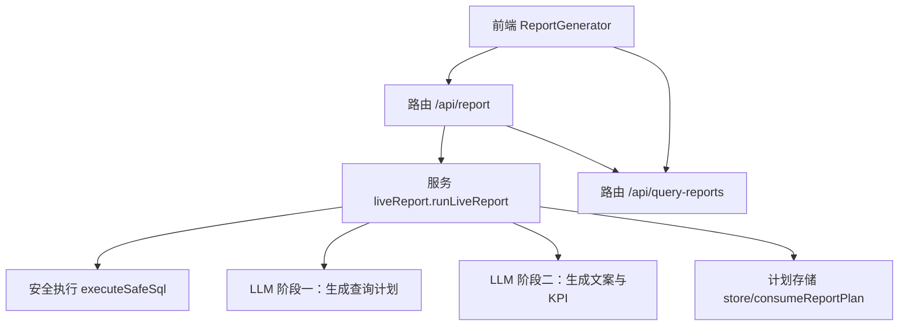
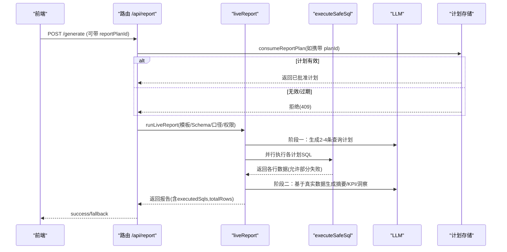
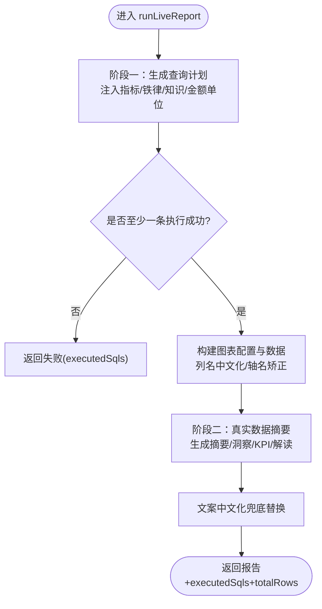
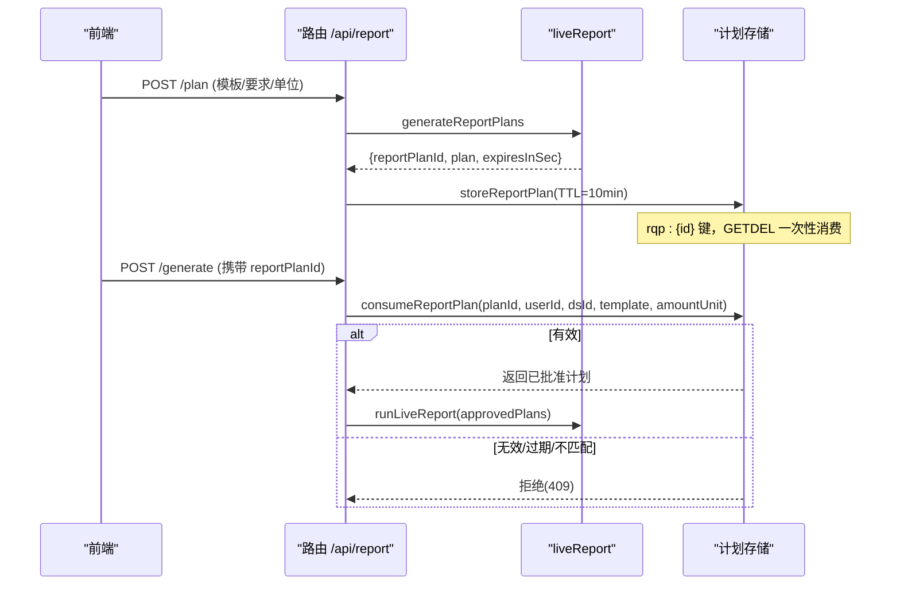
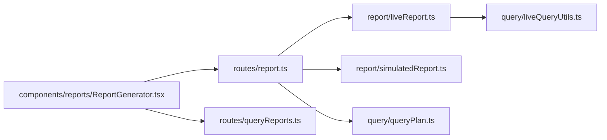
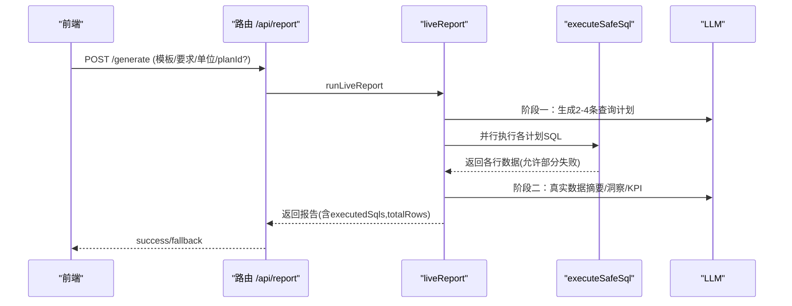
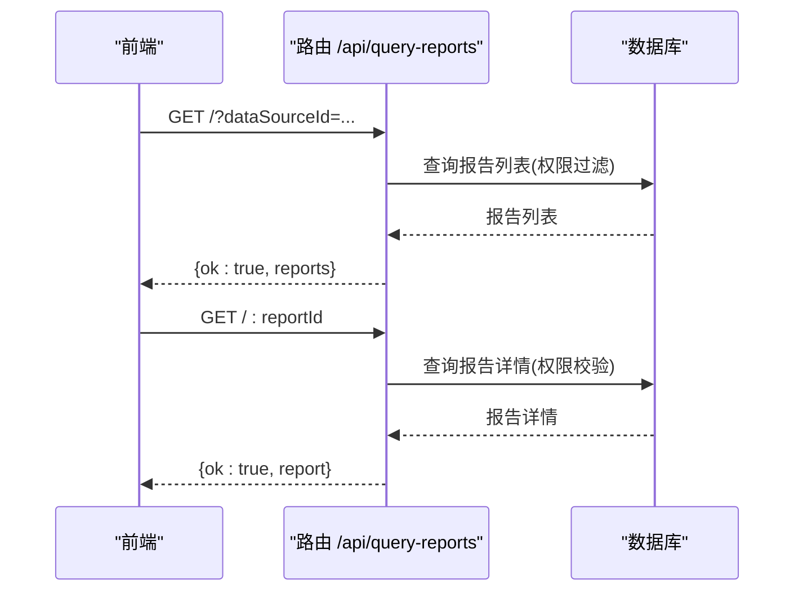

# 动态报表

<cite>
**本文引用的文件**
- [server/report/liveReport.ts](file://server/report/liveReport.ts)
- [server/report/simulatedReport.ts](file://server/report/simulatedReport.ts)
- [server/routes/report.ts](file://server/routes/report.ts)
- [server/query/queryPlan.ts](file://server/query/queryPlan.ts)
- [server/query/liveQueryUtils.ts](file://server/query/liveQueryUtils.ts)
- [src/components/reports/ReportGenerator.tsx](file://src/components/reports/ReportGenerator.tsx)
- [src/utils/reportRegen.ts](file://src/utils/reportRegen.ts)
- [server/routes/reportTemplates.ts](file://server/routes/reportTemplates.ts)
- [server/routes/queryReports.ts](file://server/routes/queryReports.ts)
</cite>

## 目录
1. [简介](#简介)
2. [项目结构](#项目结构)
3. [核心组件](#核心组件)
4. [架构总览](#架构总览)
5. [详细组件分析](#详细组件分析)
6. [依赖关系分析](#依赖关系分析)
7. [性能与并发](#性能与并发)
8. [故障与降级](#故障与降级)
9. [结论](#结论)
10. [附录：关键流程时序图](#附录关键流程时序图)

## 简介
本文件面向“智能问数据分析系统”的动态报表功能，聚焦两阶段报表生成机制、M4 报告计划批准流程、实时数据绑定与中文化处理、模板与提示词配置、金额单位换算等企业级能力，并给出性能优化、错误降级与并发控制等实现细节。目标是帮助读者在不深入源码的情况下理解端到端的数据流与控制流，并在需要时快速定位到具体实现位置。

## 项目结构
动态报表由前端报表生成器、后端路由编排、真实查询执行与 LLM 文案生成共同组成。核心路径如下：
- 前端：ReportGenerator 负责模板选择、自定义提示词、金额单位选择、M4 计划模式开关、异步任务轮询与历史报表维护。
- 路由层：/api/report 提供同步/异步生成、M4 计划、导出等接口；/api/query-reports 提供问数报告中心列表与详情。
- 服务层：liveReport 实现双阶段报表生成（阶段一：LLM 生成 2-4 条聚合查询计划；阶段二：基于真实数据生成高管摘要、洞察与 KPI）。
- 工具层：liveQueryUtils 提供金额单位、列名映射、数值转换、图表键矫正等纯函数能力。
- 存储与状态：queryPlan 提供 M2/M4 计划存储与一次性消费防重放（内存 Map 或 Redis）；report 模块内维护报告计划 TTL 与消费校验。

**图示来源**
- [server/routes/report.ts:31-160](file://server/routes/report.ts#L31-L160)
- [server/report/liveReport.ts:350-492](file://server/report/liveReport.ts#L350-L492)
- [server/query/queryPlan.ts:56-100](file://server/query/queryPlan.ts#L56-L100)

**章节来源**
- [server/routes/report.ts:31-160](file://server/routes/report.ts#L31-L160)
- [server/report/liveReport.ts:350-492](file://server/report/liveReport.ts#L350-L492)
- [server/query/queryPlan.ts:56-100](file://server/query/queryPlan.ts#L56-L100)

## 核心组件
- 两阶段报表生成器（liveReport）
  - 阶段一：注入 Schema、业务口径指引、语义指标、铁律规则、知识库片段与金额单位约定，调用 LLM 输出 2-4 条聚合查询计划（SQL、图表类型、坐标轴、列名映射、用途说明），支持一次纠偏重试。
  - 并行执行：多条计划通过安全执行层执行，允许部分失败，至少一条成功继续；汇总保持原顺序以对齐图表索引。
  - 阶段二：将各图表的真实行样本与列统计回喂 LLM，生成高管摘要、洞察、KPI 与逐图解读；最终对文案做英文标识符中文化兜底替换。
- 演示模式报表（simulatedReport）
  - 非数据库直连场景下，单阶段由 LLM 生成演示数据与报告结构，响应标记 simulated。
- 计划存储与消费（liveReport + queryPlan）
  - 报告计划采用 10 分钟 TTL，支持内存 Map 或外置 Redis；消费使用 GETDEL 原子一次性消费，防止重放；校验用户归属、数据源与模板匹配、金额单位一致性。
- 模板与提示词管理（reportTemplates）
  - 模板内容必须为合法 JSON 且包含 sections 数组（每个 section 含 title 与 prompt），支持增删改查，预设模板不可编辑/删除。
- 问数报告中心（queryReports）
  - 展示从问数对话生成的报告列表与详情，支持权限控制与审计。

**章节来源**
- [server/report/liveReport.ts:237-343](file://server/report/liveReport.ts#L237-L343)
- [server/report/simulatedReport.ts:30-76](file://server/report/simulatedReport.ts#L30-L76)
- [server/routes/reportTemplates.ts:44-67](file://server/routes/reportTemplates.ts#L44-L67)
- [server/routes/queryReports.ts:46-104](file://server/routes/queryReports.ts#L46-L104)

## 架构总览
动态报表的端到端流程包括：
- 前端发起请求（同步或异步），路由层进行权限、注入检测、限流与并发槽控制。
- 若携带 reportPlanId，则先校验计划有效性（过期/越权/不匹配 → 拒绝）。
- 根据数据源类型决定走 live 双阶段或 simulated 单阶段。
- live 链路：阶段一生成查询计划 → 并行安全执行 → 阶段二生成文案 → 中文化兜底 → 返回结果（带 executedSqls 与 totalRows）。
- 异步化：提交即返回 taskId，后台 worker 独立执行，完成后通过任务队列返回结果。

**图示来源**
- [server/routes/report.ts:31-160](file://server/routes/report.ts#L31-L160)
- [server/report/liveReport.ts:350-492](file://server/report/liveReport.ts#L350-L492)
- [server/query/queryPlan.ts:56-100](file://server/query/queryPlan.ts#L56-L100)

## 详细组件分析

### 两阶段报表生成（liveReport）
- 阶段一
  - 输入：模板主题、自定义要求、Schema、业务口径指引、数据源类型、金额单位、数据源 ID。
  - 上下文注入：语义指标、铁律规则、知识库 RAG、金额单位约定，全部失败降级为空串，不影响主流程。
  - 输出契约：{"reportTitle","queries":[{"title","sql","chartType","xAxisKey","yAxisKeys","columnNames","purpose"}]}，最多 4 条。
  - 容错：首次未通过校验会追加上次错误信息并重试一次。
- 执行
  - 并行执行各计划 SQL，超时与 DLP 过滤、行级权限强制注入；允许部分失败，至少一条成功继续。
  - 图表轴名与列名中文化：优先使用 schema description，其次 LLM columnNames 覆盖，最后按词根推断中文表头。
- 阶段二
  - 输入：各图表的真实行样本（采样上限）、列统计、SQL 与用途说明。
  - 输出契约：{"title","summary","insights","kpiList","commentaries"}，并对金额单位表述严格约束。
  - 兜底：LLM 异常或解析为空对象时记录日志并降级，保留图表与基础摘要。
- 中文化兜底
  - 对标题、摘要、洞察、KPI、图表解读中的英文标识符统一替换为中文业务名称，确保最终文案不含英文表名/列名。

**图示来源**
- [server/report/liveReport.ts:237-343](file://server/report/liveReport.ts#L237-L343)
- [server/report/liveReport.ts:350-492](file://server/report/liveReport.ts#L350-L492)
- [server/query/liveQueryUtils.ts:111-149](file://server/query/liveQueryUtils.ts#L111-L149)

**章节来源**
- [server/report/liveReport.ts:237-343](file://server/report/liveReport.ts#L237-L343)
- [server/report/liveReport.ts:350-492](file://server/report/liveReport.ts#L350-L492)
- [server/query/liveQueryUtils.ts:111-149](file://server/query/liveQueryUtils.ts#L111-L149)

### M4 报告计划批准机制
- 计划生成：/api/report/plan 调用 generateReportPlans，返回 reportPlanId、计划内容与有效期（600 秒）。
- 计划存储：storeReportPlan 写入内存 Map 或 Redis（rqp:{id}），设置 TTL 10 分钟，附带模板类型、用户 ID、数据源 ID、金额单位。
- 计划消费：consumeReportPlan 使用 GETDEL 原子一次性消费，校验过期时间、用户归属、数据源与模板匹配、金额单位一致性；任一失败均拒绝。
- 前端交互：ReportGenerator 支持开启“先制定计划”，批准后携带 reportPlanId 提交生成。

**图示来源**
- [server/routes/report.ts:162-226](file://server/routes/report.ts#L162-L226)
- [server/report/liveReport.ts:124-188](file://server/report/liveReport.ts#L124-L188)
- [server/query/queryPlan.ts:56-100](file://server/query/queryPlan.ts#L56-L100)

**章节来源**
- [server/routes/report.ts:162-226](file://server/routes/report.ts#L162-L226)
- [server/report/liveReport.ts:124-188](file://server/report/liveReport.ts#L124-L188)
- [server/query/queryPlan.ts:56-100](file://server/query/queryPlan.ts#L56-L100)

### 实时报表数据绑定机制
- Schema 元数据注入：阶段一系统提示词注入序列化后的 Schema，限制仅使用白名单表与列，避免编造。
- 业务口径指引：guidance 文本注入阶段一系统提示词，指导维度与指标选择。
- 语义指标匹配：按模板主题与自定义要求匹配活跃指标，失败降级为空串，不影响主流程。
- 图表轴名中文化：buildColumnNames 优先 schema description，其次 LLM columnNames 覆盖，最后按词根推断中文表头，保证前端渲染与可读性。

**章节来源**
- [server/report/liveReport.ts:275-343](file://server/report/liveReport.ts#L275-L343)
- [server/query/liveQueryUtils.ts:111-149](file://server/query/liveQueryUtils.ts#L111-L149)

### 报表文案中文化处理
- 英文标识符替换：sanitizeReportNarrative 遍历报表对象指定字段，将英文表名/列名替换为中文业务名称。
- 词根推断：inferChineseHeader 对英文列别名保守推断中文表头，全部词根命中才转换，未识别保持原值，避免编造。
- 金额单位约束：阶段二系统提示词强制文案沿用 SQL 已换算的单位，禁止自行换算或进位改写。

**章节来源**
- [server/report/liveReport.ts:39-63](file://server/report/liveReport.ts#L39-L63)
- [server/query/liveQueryUtils.ts:151-189](file://server/query/liveQueryUtils.ts#L151-L189)
- [server/report/liveReport.ts:322-343](file://server/report/liveReport.ts#L322-L343)

### 报表模板配置与自定义提示词
- 模板结构：JSON 包含 sections 数组，每个 section 必须有 title 与 prompt。
- 权限控制：仅 ADMIN 可新增/编辑/删除模板，预设模板不可编辑/删除。
- 前端集成：ReportGenerator 内置模板选项，支持选择模板与填写自定义关注点；模板内容会被合并注入阶段一。

**章节来源**
- [server/routes/reportTemplates.ts:44-67](file://server/routes/reportTemplates.ts#L44-L67)
- [src/components/reports/ReportGenerator.tsx:170-196](file://src/components/reports/ReportGenerator.tsx#L170-L196)

### 金额单位换算与企业级功能
- 单位白名单：亿元/百万元/万元/元，非白名单直接拒绝。
- SQL 换算：阶段一注入金额单位约定，要求对金额列聚合结果除以除数并保留两位小数，别名带后缀，图表与解读沿用该单位。
- 前端选择：AmountUnitSelect 支持模块级单位选择，提交时读取当前生效单位。
- 计划一致性：批准执行时校验金额单位与计划制定时一致，否则需重新制定。

**章节来源**
- [server/query/liveQueryUtils.ts:10-29](file://server/query/liveQueryUtils.ts#L10-L29)
- [server/routes/report.ts:52-57](file://server/routes/report.ts#L52-L57)
- [server/report/liveReport.ts:247-256](file://server/report/liveReport.ts#L247-L256)
- [server/report/liveReport.ts:169-186](file://server/report/liveReport.ts#L169-L186)

### 历史报表维护与自动重生成
- 条件快照：genParams 保存模板主题、自定义要求与金额单位，用于重新生成时恢复参数。
- 准入判定：仅 live 报表（有真实数据源）且操作人有权限时可重新生成。
- 就地替换：applyRegenResult 保留原报表 id 与批注，更新内容字段与生成条件快照。
- 自动重生成：监听数据版本变化，自动提交异步任务重新生成并就地替换。

**章节来源**
- [src/utils/reportRegen.ts:18-69](file://src/utils/reportRegen.ts#L18-L69)
- [src/components/reports/ReportGenerator.tsx:107-156](file://src/components/reports/ReportGenerator.tsx#L107-L156)

## 依赖关系分析
- 路由层依赖服务层：/api/report 调用 liveReport 与 simulatedReport，同时依赖 queryPlan 的计划存储与消费。
- 服务层依赖工具层：liveReport 复用 liveQueryUtils 的金额单位、列名映射、数值转换与图表键矫正。
- 前端依赖路由与服务：ReportGenerator 通过 apiFetch 调用 /api/report 与 /api/query-reports，并轮询任务状态。
- 外部依赖：LLM 客户端、数据库连接池、Redis（可选）、任务队列（异步化）。

**图示来源**
- [server/routes/report.ts:31-160](file://server/routes/report.ts#L31-L160)
- [server/report/liveReport.ts:350-492](file://server/report/liveReport.ts#L350-L492)
- [server/query/liveQueryUtils.ts:111-149](file://server/query/liveQueryUtils.ts#L111-L149)

**章节来源**
- [server/routes/report.ts:31-160](file://server/routes/report.ts#L31-L160)
- [server/report/liveReport.ts:350-492](file://server/report/liveReport.ts#L350-L492)
- [server/query/liveQueryUtils.ts:111-149](file://server/query/liveQueryUtils.ts#L111-L149)

## 性能与并发
- 并行执行：阶段一的多条查询计划通过 Promise.all 并行执行，墙钟时间由“逐条相加”降为“最慢一条”，提升吞吐。
- 连接池配额：chain 场景默认 5，export 场景默认 2，按场景分级配额排队兜底，避免资源争用。
- 异步化：/api/report/generate/async 与 /api/report/generate-from-query/async 提交即返回 taskId，后台 worker 独立执行，不占用户交互并发槽。
- 限流与并发槽：路由层共享用户配额与并发互斥，防止同一用户重复提交导致过载。
- Token 预算保护：阶段二每图回喂 LLM 的真实行采样上限（10 行），结合列统计减少 token 消耗。

**章节来源**
- [server/report/liveReport.ts:363-375](file://server/report/liveReport.ts#L363-L375)
- [server/routes/report.ts:374-423](file://server/routes/report.ts#L374-L423)
- [server/report/liveReport.ts:30-31](file://server/report/liveReport.ts#L30-L31)

## 故障与降级
- 阶段一失败：LLM 输出未通过契约校验时追加错误信息重试一次；仍失败返回失败分支（executedSqls）。
- 执行失败：允许部分查询失败，至少一条成功继续；失败 SQL 记录于 executedSqls 供审计与下钻。
- 阶段二失败：LLM 调用失败或解析为空对象时记录日志并降级，保留图表与基础摘要，KPI/洞察缺失。
- 演示模式：当数据源不支持 live 或 live 失败时，回退至 simulated 模式，显式标记 dataProvenance 为 simulated。
- 计划失效：consumeReportPlan 返回过期/越权/不匹配等错误，路由层返回 409，前端清空待批准计划并提示重新制定。

**章节来源**
- [server/report/liveReport.ts:257-273](file://server/report/liveReport.ts#L257-L273)
- [server/report/liveReport.ts:363-451](file://server/report/liveReport.ts#L363-L451)
- [server/routes/report.ts:88-98](file://server/routes/report.ts#L88-L98)

## 结论
动态报表通过“两阶段生成 + 计划批准 + 真实数据绑定 + 中文化兜底”的企业级设计，在保证安全与可控的前提下，实现了从自然语言到可视化决策简报的高效转化。其并行执行、异步化、限流与降级策略确保了高可用与可扩展性；模板与提示词配置、金额单位换算、历史报表维护等功能进一步提升了企业级使用的灵活性与可维护性。

## 附录：关键流程时序图

### 报表生成（同步/异步）

**图示来源**
- [server/routes/report.ts:31-160](file://server/routes/report.ts#L31-L160)
- [server/report/liveReport.ts:350-492](file://server/report/liveReport.ts#L350-L492)

### 问数报告中心（列表与详情）

**图示来源**
- [server/routes/queryReports.ts:46-104](file://server/routes/queryReports.ts#L46-L104)