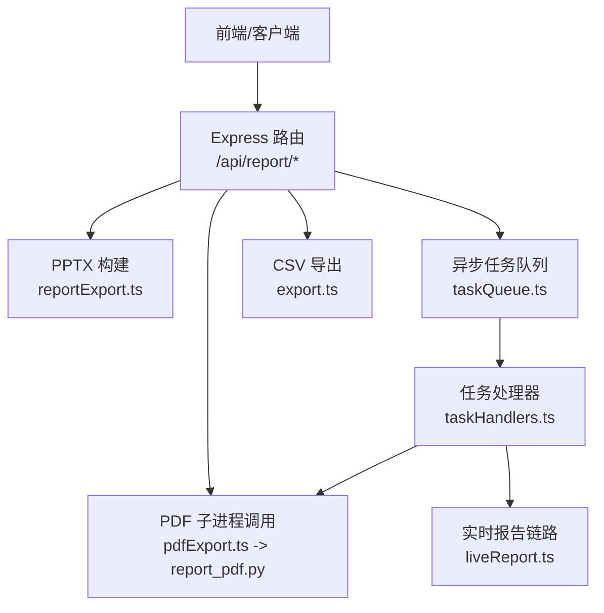
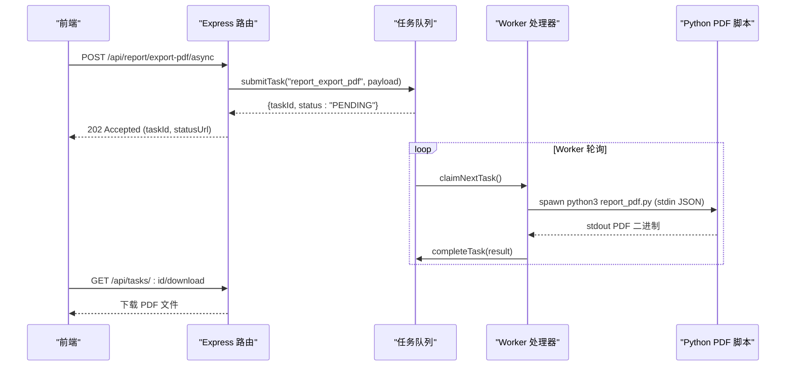
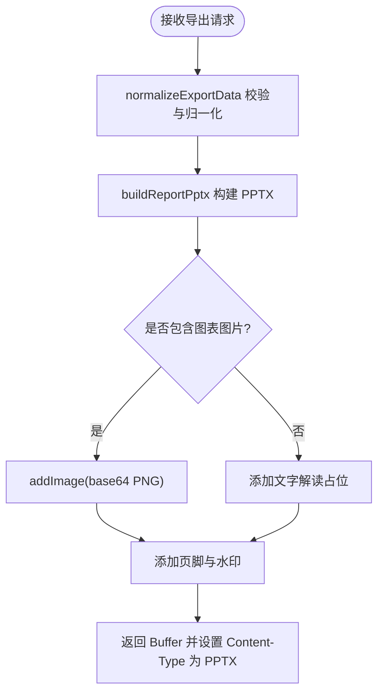
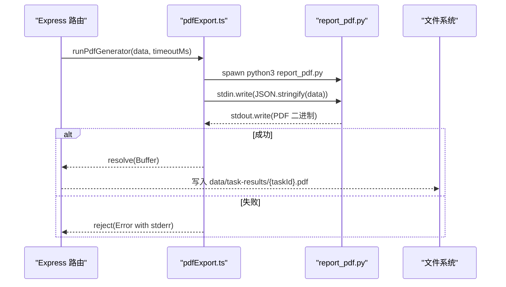
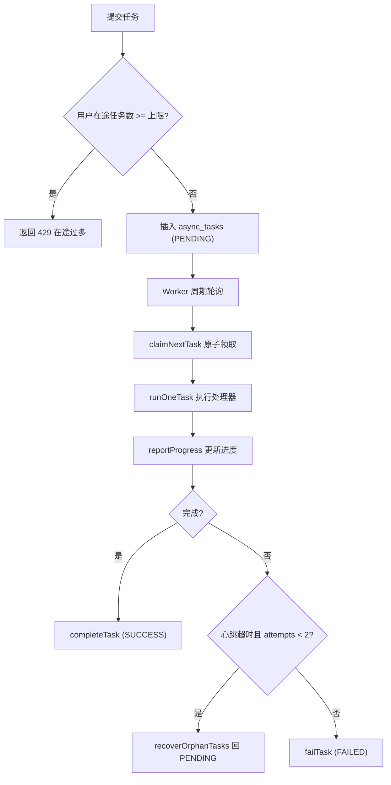
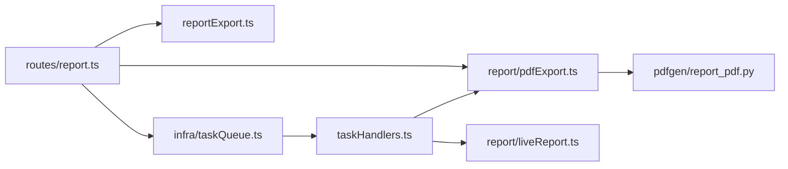

# 导出功能

<cite>
**本文引用的文件**
- [server/routes/report.ts](file://server/routes/report.ts)
- [server/report/reportExport.ts](file://server/report/reportExport.ts)
- [server/report/pdfExport.ts](file://server/report/pdfExport.ts)
- [server/pdfgen/report_pdf.py](file://server/pdfgen/report_pdf.py)
- [server/infra/taskQueue.ts](file://server/infra/taskQueue.ts)
- [server/taskHandlers.ts](file://server/taskHandlers.ts)
- [server/routes/export.ts](file://server/routes/export.ts)
- [src/utils/conversationExport.ts](file://src/utils/conversationExport.ts)
</cite>

## 目录
1. [简介](#简介)
2. [项目结构](#项目结构)
3. [核心组件](#核心组件)
4. [架构总览](#架构总览)
5. [详细组件分析](#详细组件分析)
6. [依赖关系分析](#依赖关系分析)
7. [性能考虑](#性能考虑)
8. [故障排查指南](#故障排查指南)
9. [结论](#结论)
10. [附录](#附录)

## 简介
本章节面向“智能问数据分析系统”的报表导出能力，重点说明 PPT 与 PDF 两种导出方式的实现机制、Python 脚本与 Node.js 后端的集成方式、异步任务队列与进度跟踪、失败重试策略、内容定制选项（图表渲染、布局调整、品牌定制）、以及导出格式规范、兼容性处理与浏览器支持等。文档以代码为依据，提供可追溯的文件路径与行号引用，帮助读者快速定位实现细节。

## 项目结构
导出相关代码主要分布在以下模块：
- 路由层：统一入口与鉴权、限流、审计、参数校验
- 报告生成与导出：PPTX 构建、PDF 子进程调用
- 异步任务：MySQL 持久化任务表 + 内置 worker 循环
- Python 脚本：ReportLab 原生排版生成 PDF
- CSV 导出：带水印与审批流程的统一通道

**图示来源**
- [server/routes/report.ts:515-581](file://server/routes/report.ts#L515-L581)
- [server/report/reportExport.ts:111-214](file://server/report/reportExport.ts#L111-L214)
- [server/report/pdfExport.ts:66-131](file://server/report/pdfExport.ts#L66-L131)
- [server/pdfgen/report_pdf.py:274-293](file://server/pdfgen/report_pdf.py#L274-L293)
- [server/infra/taskQueue.ts:120-138](file://server/infra/taskQueue.ts#L120-L138)
- [server/taskHandlers.ts:165-190](file://server/taskHandlers.ts#L165-L190)

**章节来源**
- [server/routes/report.ts:1-584](file://server/routes/report.ts#L1-L584)
- [server/report/reportExport.ts:1-222](file://server/report/reportExport.ts#L1-L222)
- [server/report/pdfExport.ts:1-132](file://server/report/pdfExport.ts#L1-L132)
- [server/pdfgen/report_pdf.py:1-294](file://server/pdfgen/report_pdf.py#L1-L294)
- [server/infra/taskQueue.ts:1-347](file://server/infra/taskQueue.ts#L1-L347)
- [server/taskHandlers.ts:1-198](file://server/taskHandlers.ts#L1-L198)
- [server/routes/export.ts:1-226](file://server/routes/export.ts#L1-L226)

## 核心组件
- PPTX 导出：基于 pptxgenjs 在服务端组装幻灯片，包含封面、高管摘要、KPI 指标、每图一页（base64 PNG 图表）、结论与建议；支持 DLP 水印注入。
- PDF 导出：通过 Node.js 子进程调用 Python ReportLab 脚本，使用 CID 字体进行中文矢量排版，嵌入前端截取的 base64 PNG 图表；支持横竖版切换与页眉页脚。
- 异步任务队列：MySQL 任务表 + 内置 worker，支持并发上限、心跳超时回收、最大重试次数、用户排队限制。
- CSV 导出：统一 CSV 导出通道，含数据水印、阈值审批、审计记录。
- 对话导出：前端 Markdown 导出工具函数，便于会话内容归档。

**章节来源**
- [server/report/reportExport.ts:8-40](file://server/report/reportExport.ts#L8-L40)
- [server/report/reportExport.ts:111-214](file://server/report/reportExport.ts#L111-L214)
- [server/report/pdfExport.ts:66-131](file://server/report/pdfExport.ts#L66-L131)
- [server/pdfgen/report_pdf.py:213-271](file://server/pdfgen/report_pdf.py#L213-L271)
- [server/infra/taskQueue.ts:21-37](file://server/infra/taskQueue.ts#L21-L37)
- [server/routes/export.ts:91-165](file://server/routes/export.ts#L91-L165)
- [src/utils/conversationExport.ts:12-43](file://src/utils/conversationExport.ts#L12-L43)

## 架构总览
导出功能采用“路由层 + 构建器 + 子进程 + 异步任务”的分层架构：
- 路由层负责鉴权、限流、输入校验、审计与响应封装
- 构建器负责将结构化报告数据转换为 PPTX/PDF 二进制
- 子进程负责执行 Python 脚本，隔离渲染环境并避免阻塞主进程
- 异步任务用于长耗时导出，提交即返回 taskId，worker 独立执行并持久化结果

**图示来源**
- [server/routes/report.ts:480-513](file://server/routes/report.ts#L480-L513)
- [server/infra/taskQueue.ts:120-138](file://server/infra/taskQueue.ts#L120-L138)
- [server/taskHandlers.ts:165-190](file://server/taskHandlers.ts#L165-L190)
- [server/report/pdfExport.ts:66-131](file://server/report/pdfExport.ts#L66-L131)

## 详细组件分析

### PPT 导出（PPTX）
- 模板填充：服务端根据 ReportExportData 结构组装封面、摘要、KPI、图表页、结论与建议；支持 templateType 与 createdAt 元信息。
- 图表渲染：前端通过 ECharts getDataURL() 导出 base64 PNG，服务端直接嵌入到幻灯片指定区域。
- 样式定制：内置配色常量（靛青体系），卡片圆角、分隔线、页脚水印；支持导出人水印（DLP）。
- 文件名安全：buildExportFilename 对标题进行清洗，附加日期后缀。

**图示来源**
- [server/report/reportExport.ts:67-103](file://server/report/reportExport.ts#L67-L103)
- [server/report/reportExport.ts:111-214](file://server/report/reportExport.ts#L111-L214)
- [server/routes/report.ts:515-546](file://server/routes/report.ts#L515-L546)

**章节来源**
- [server/report/reportExport.ts:8-40](file://server/report/reportExport.ts#L8-L40)
- [server/report/reportExport.ts:67-103](file://server/report/reportExport.ts#L67-L103)
- [server/report/reportExport.ts:111-214](file://server/report/reportExport.ts#L111-L214)
- [server/routes/report.ts:515-546](file://server/routes/report.ts#L515-L546)

### PDF 导出（ReportLab 子进程）
- 模板填充：Python 脚本读取 stdin JSON，按段落、表格、图片顺序构建页面；支持 orientation（portrait/landscape）。
- 图表渲染：解析 base64 PNG，计算等比缩放以适配页宽与最大高度；异常时降级仅保留标题与解读。
- 样式定制：使用 ReportLab 内置 STSong-Light 字体进行中文排版；页眉显示报告标题与系统名，页脚显示页码与 DLP 水印。
- 进程通信：Node.js 通过 child_process.spawn 启动 Python 脚本，stdin 传递 JSON，stdout 接收 PDF 二进制；stderr 收集错误信息。
- 超时与健壮性：默认 60s 超时，非 0 退出码视为失败；输出校验 PDF 头确保有效性。

**图示来源**
- [server/report/pdfExport.ts:66-131](file://server/report/pdfExport.ts#L66-L131)
- [server/pdfgen/report_pdf.py:274-293](file://server/pdfgen/report_pdf.py#L274-L293)
- [server/taskHandlers.ts:165-190](file://server/taskHandlers.ts#L165-L190)

**章节来源**
- [server/report/pdfExport.ts:1-132](file://server/report/pdfExport.ts#L1-L132)
- [server/pdfgen/report_pdf.py:1-294](file://server/pdfgen/report_pdf.py#L1-L294)
- [server/taskHandlers.ts:165-190](file://server/taskHandlers.ts#L165-L190)

### 异步任务队列与进度跟踪
- 任务提交：submitTask 检查用户在途任务数，超过上限拒绝；否则插入 async_tasks 表，状态 PENDING。
- Worker 循环：claimNextTask 原子领取下一个待执行任务（FOR UPDATE SKIP LOCKED），更新 RUNNING 并记录心跳；runOneTask 执行处理器并维护心跳与超时。
- 进度跟踪：reportProgress 调用 heartbeatTask 更新 progress 字段；前端轮询 /api/tasks/:id 获取状态与进度。
- 失败重试：孤儿任务回收 recoverOrphanTasks 检测心跳超时，attempts < 2 回 PENDING 重跑，否则标 FAILED。
- 结果存储：PDF 导出成功后写入 data/task-results/{taskId}.pdf，result 中携带文件名与大小。

**图示来源**
- [server/infra/taskQueue.ts:120-138](file://server/infra/taskQueue.ts#L120-L138)
- [server/infra/taskQueue.ts:144-175](file://server/infra/taskQueue.ts#L144-L175)
- [server/infra/taskQueue.ts:206-227](file://server/infra/taskQueue.ts#L206-L227)
- [server/taskHandlers.ts:165-190](file://server/taskHandlers.ts#L165-L190)

**章节来源**
- [server/infra/taskQueue.ts:21-37](file://server/infra/taskQueue.ts#L21-L37)
- [server/infra/taskQueue.ts:120-138](file://server/infra/taskQueue.ts#L120-L138)
- [server/infra/taskQueue.ts:144-175](file://server/infra/taskQueue.ts#L144-L175)
- [server/infra/taskQueue.ts:206-227](file://server/infra/taskQueue.ts#L206-L227)
- [server/taskHandlers.ts:165-190](file://server/taskHandlers.ts#L165-L190)

### CSV 导出（带水印与审批）
- 水印：首尾行嵌入导出人、部门、时间、行数；防止外传并可溯源。
- 审批阈值：超过阈值且非 ADMIN 需管理员审批；已批准 24h 内一次性消费。
- 审计：所有导出与拦截均落 audit log。

**章节来源**
- [server/routes/export.ts:21-56](file://server/routes/export.ts#L21-L56)
- [server/routes/export.ts:91-165](file://server/routes/export.ts#L91-L165)
- [server/routes/export.ts:167-223](file://server/routes/export.ts#L167-L223)

### 对话导出（Markdown）
- 构建：将消息列表转为 Markdown，包含问题、回答与 SQL。
- 下载：前端 Blob + a.click 触发下载。

**章节来源**
- [src/utils/conversationExport.ts:12-43](file://src/utils/conversationExport.ts#L12-L43)

## 依赖关系分析
- 路由层依赖：authMiddleware、rateLimiter、errorCodes、auditLog、schemaContext、liveReport、simulatedReport、reportExport、pdfExport、taskQueue。
- 构建器依赖：pptxgenjs（PPTX）、ReportLab + PIL（PDF 子进程）。
- 任务队列依赖：mysql2/promise、logger、db pool。
- Python 脚本依赖：reportlab、PIL（通过 ReportLab 间接使用）。

**图示来源**
- [server/routes/report.ts:1-26](file://server/routes/report.ts#L1-L26)
- [server/report/reportExport.ts:6-7](file://server/report/reportExport.ts#L6-L7)
- [server/report/pdfExport.ts:11-14](file://server/report/pdfExport.ts#L11-L14)
- [server/pdfgen/report_pdf.py:22-31](file://server/pdfgen/report_pdf.py#L22-L31)
- [server/infra/taskQueue.ts:16-19](file://server/infra/taskQueue.ts#L16-L19)
- [server/taskHandlers.ts:6-18](file://server/taskHandlers.ts#L6-L18)

**章节来源**
- [server/routes/report.ts:1-26](file://server/routes/report.ts#L1-L26)
- [server/report/reportExport.ts:6-7](file://server/report/reportExport.ts#L6-L7)
- [server/report/pdfExport.ts:11-14](file://server/report/pdfExport.ts#L11-L14)
- [server/pdfgen/report_pdf.py:22-31](file://server/pdfgen/report_pdf.py#L22-L31)
- [server/infra/taskQueue.ts:16-19](file://server/infra/taskQueue.ts#L16-L19)
- [server/taskHandlers.ts:6-18](file://server/taskHandlers.ts#L6-L18)

## 性能考虑
- 内存管理：PPTX 构建使用 Buffer 累积，避免大对象泄漏；PDF 子进程独立运行，主进程不持有渲染状态。
- 并发控制：任务队列 worker 并发上限可配置（默认 2），用户级在途任务上限（默认 3）防排队风暴。
- 缓存机制：当前实现未引入导出结果缓存；如需提升重复导出性能，可在任务结果层增加哈希键与 TTL 缓存。
- I/O 优化：PDF 子进程 stdin/stdout 管道传输，避免命令行参数注入；超时保护防止僵尸进程占用连接。
- 网络与浏览器：PPTX 与 PDF 均为服务器端生成，前端仅需下载；CSV 导出使用 text/csv 与 UTF-8 BOM 兼容 Excel。

[本节为通用指导，无需特定文件引用]

## 故障排查指南
- PDF 生成失败：检查 Python 环境与 reportlab/PIL 安装；查看 stderr 摘要；确认脚本路径存在。
- 任务超时：确认 taskExecTimeoutMs 与 TASK_HEARTBEAT_TIMEOUT_MS 配置；检查 worker 心跳是否正常。
- 孤儿任务：recoverOrphanTasks 会回收心跳超时的 RUNNING 任务；若频繁出现，检查底层 LLM/数据库连接池。
- 权限与限流：确认角色权限（ADMIN/ANALYST）与 rateLimiter 配置；审计日志可查看 DENIED_AUTH/DENIED_RATE。
- CSV 审批：超过阈值的导出需管理员审批；查询 /api/export/requests/mine 与 /api/export/requests 跟踪状态。

**章节来源**
- [server/report/pdfExport.ts:36-60](file://server/report/pdfExport.ts#L36-L60)
- [server/report/pdfExport.ts:86-117](file://server/report/pdfExport.ts#L86-L117)
- [server/infra/taskQueue.ts:206-227](file://server/infra/taskQueue.ts#L206-L227)
- [server/routes/report.ts:515-581](file://server/routes/report.ts#L515-L581)
- [server/routes/export.ts:167-223](file://server/routes/export.ts#L167-L223)

## 结论
本系统的导出功能通过分层设计与异步任务队列实现了高可用与可扩展的 PPT/PDF 导出能力。PPTX 构建与服务端渲染确保了图表与样式的稳定性；PDF 通过 Python 子进程隔离渲染环境，结合 ReportLab 的中文矢量排版提升了输出质量。异步任务机制提供了进度跟踪与失败重试，配合 DLP 水印与审计日志满足企业级合规要求。建议在生产环境中关注 Python 环境依赖、任务超时与并发配置，并根据业务需求评估缓存与批处理优化。

[本节为总结性内容，无需特定文件引用]

## 附录
- 导出接口概览：
  - PPTX 同步导出：POST /api/report/export
  - PDF 同步导出：POST /api/report/export-pdf
  - PDF 异步导出：POST /api/report/export-pdf/async
  - CSV 导出：POST /api/export/csv
  - 任务状态查询：GET /api/tasks/:id
- 兼容性：
  - PPTX：application/vnd.openxmlformats-officedocument.presentationml.presentation
  - PDF：application/pdf
  - CSV：text/csv; charset=utf-8（含 BOM 与水印）
- 浏览器支持：
  - 下载行为由浏览器决定；建议使用现代浏览器以确保附件下载与编码正确。

[本节为补充信息，无需特定文件引用]