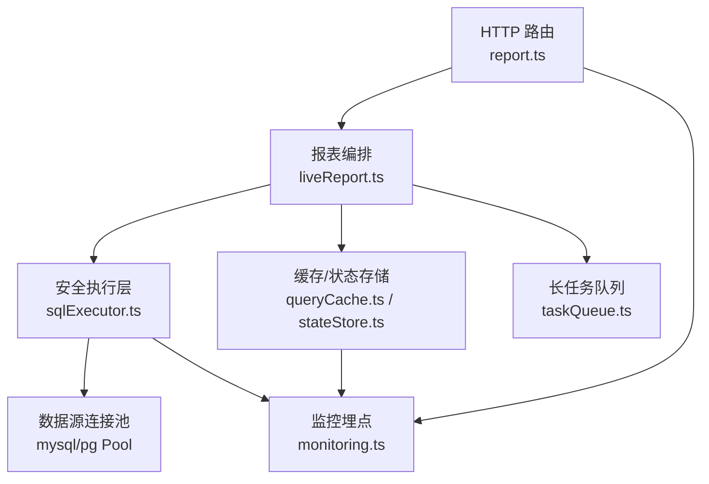
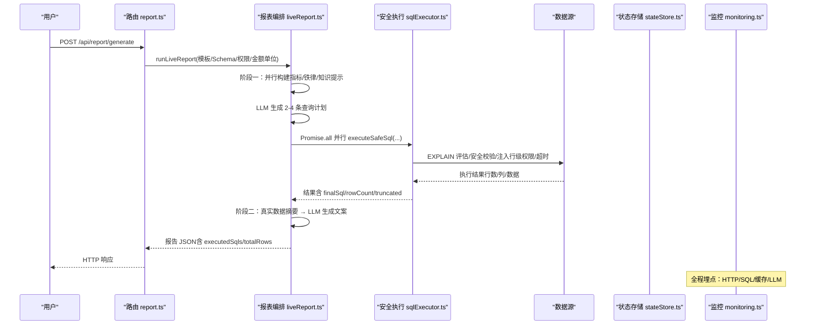
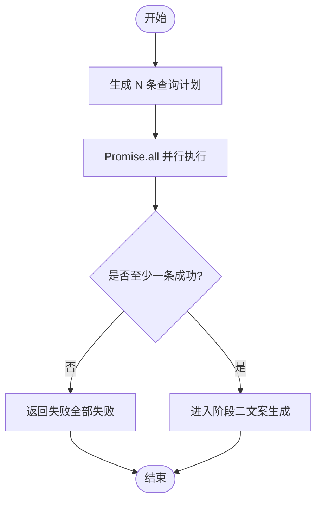
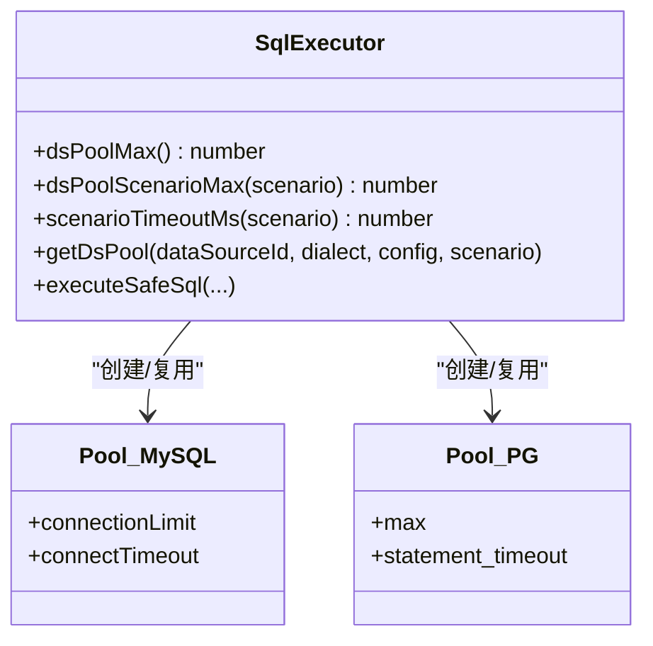
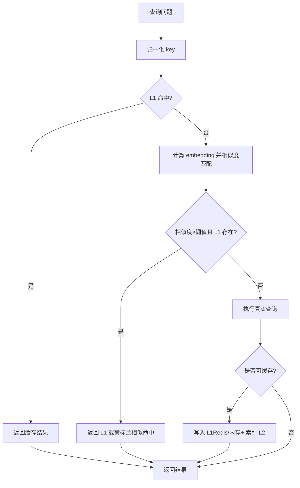
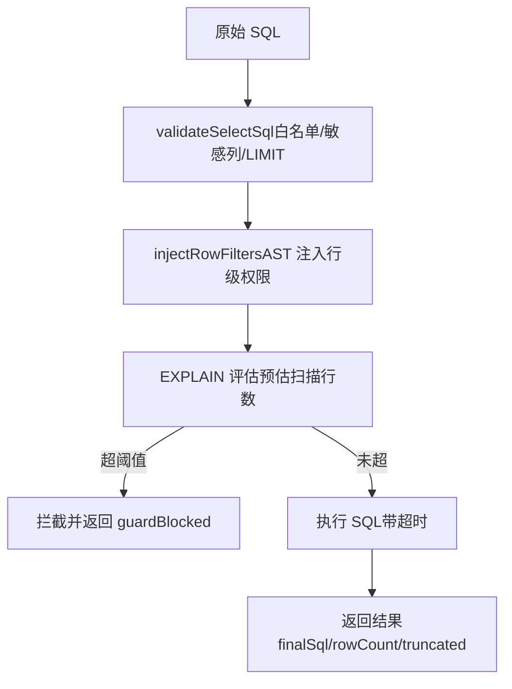
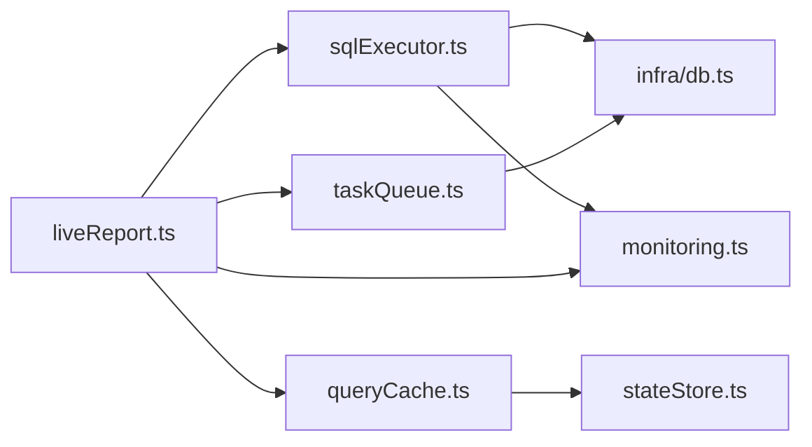

# 性能优化

<cite>
**本文引用的文件**
- [sqlExecutor.ts](file://server/query/sqlExecutor.ts)
- [sqlExecutorPool.test.ts](file://server/query/sqlExecutorPool.test.ts)
- [queryCache.ts](file://server/query/queryCache.ts)
- [liveReport.ts](file://server/report/liveReport.ts)
- [taskQueue.ts](file://server/infra/taskQueue.ts)
- [monitoring.ts](file://server/infra/monitoring.ts)
- [stateStore.ts](file://server/infra/stateStore.ts)
- [report.ts](file://server/routes/report.ts)
</cite>

## 目录
1. [简介](#简介)
2. [项目结构](#项目结构)
3. [核心组件](#核心组件)
4. [架构总览](#架构总览)
5. [详细组件分析](#详细组件分析)
6. [依赖关系分析](#依赖关系分析)
7. [性能考量](#性能考量)
8. [故障排查指南](#故障排查指南)
9. [结论](#结论)
10. [附录](#附录)

## 简介
本文件聚焦“智能问数据分析系统”报表中心的性能优化，围绕以下企业级能力展开：查询并行执行与并发控制、连接池配额与超时管理、结果缓存（Redis/内存/TTL/失效）、内存优化（分页/流式/GC）、数据库查询优化（执行计划/索引/重写）、监控诊断（指标/慢查询/资源监控），以及并发安全、故障恢复与弹性伸缩策略。内容基于仓库中实际实现进行梳理与可视化说明。

## 项目结构
报表中心的关键性能路径由“路由层 → 编排层 → 安全执行层 → 数据源连接池 → 缓存/状态存储 → 监控埋点”构成。其中：
- 路由层负责鉴权、限流、审计与入参校验；
- 编排层（报表双阶段）组织 LLM 生成与真实 SQL 执行；
- 安全执行层提供 SQL 白名单、行级权限注入、EXPLAIN 防线、场景化超时与连接池；
- 缓存与状态存储提供语义缓存、计划一次性消费、分布式锁等能力；
- 监控埋点贯穿全链路，输出 Prometheus 指标。

图表来源
- [report.ts:31-160](file://server/routes/report.ts#L31-L160)
- [liveReport.ts:350-493](file://server/report/liveReport.ts#L350-L493)
- [sqlExecutor.ts:734-832](file://server/query/sqlExecutor.ts#L734-L832)
- [queryCache.ts:43-114](file://server/query/queryCache.ts#L43-L114)
- [stateStore.ts:169-219](file://server/infra/stateStore.ts#L169-L219)
- [taskQueue.ts:120-227](file://server/infra/taskQueue.ts#L120-L227)
- [monitoring.ts:19-153](file://server/infra/monitoring.ts#L19-L153)

章节来源
- [report.ts:31-160](file://server/routes/report.ts#L31-L160)
- [liveReport.ts:350-493](file://server/report/liveReport.ts#L350-L493)

## 核心组件
- 查询并行执行与并发控制：报表阶段一对多条查询计划使用 Promise.all 并行执行，通过场景化连接池配额与超时限制并发与耗时。
- 连接池配额与超时：按数据源+场景分级建池，支持交互/分析链/导出三类场景的独立配额与超时档位。
- 结果缓存策略：L1 精确匹配（内存或 Redis）+ L2 语义相似度命中（embedding），TTL 可配置，数据源变更时前缀失效。
- 内存优化：结果集截断（MAX_ROWS）、图表采样行数限制、大对象不写入 Redis 的体积上限。
- 数据库查询优化：AST 安全校验 + EXPLAIN 预估扫描量拦截、MySQL MAX_EXECUTION_TIME hint、PG statement_timeout。
- 监控与诊断：Prometheus 指标覆盖请求耗时、SQL 执行耗时、缓存命中、EXPLAIN 防线、LLM 调用耗时与 token 消耗。
- 并发安全与故障恢复：任务队列心跳与孤儿回收、计划一次性消费（getDel）、连接池失效重建、缓存失败降级。
- 弹性伸缩：多实例共享缓存/计划（Redis）、任务队列 SKIP LOCKED 避免重复领取、worker 并发上限可调。

章节来源
- [liveReport.ts:363-375](file://server/report/liveReport.ts#L363-L375)
- [sqlExecutor.ts:491-726](file://server/query/sqlExecutor.ts#L491-L726)
- [queryCache.ts:12-21](file://server/query/queryCache.ts#L12-L21)
- [monitoring.ts:63-153](file://server/infra/monitoring.ts#L63-L153)
- [taskQueue.ts:140-227](file://server/infra/taskQueue.ts#L140-L227)

## 架构总览
报表中心采用“双阶段”编排：阶段一生成查询计划（或复用已批准计划），阶段二基于真实数据摘要生成文案。关键性能点如下：
- 阶段一：指标/铁律/知识库检索并行构建提示词；LLM 生成 2-4 条查询计划；
- 阶段执行：Promise.all 并行执行各计划，至少一条成功继续；
- 阶段二：对每条图的数据摘要（含列统计与样本）回喂 LLM 生成解读；
- 全链路埋点：HTTP、SQL、缓存、LLM 均打点，便于定位瓶颈。

图表来源
- [report.ts:31-160](file://server/routes/report.ts#L31-L160)
- [liveReport.ts:237-320](file://server/report/liveReport.ts#L237-L320)
- [liveReport.ts:350-493](file://server/report/liveReport.ts#L350-L493)
- [sqlExecutor.ts:622-662](file://server/query/sqlExecutor.ts#L622-L662)
- [monitoring.ts:19-153](file://server/infra/monitoring.ts#L19-L153)

## 详细组件分析

### 查询并行执行机制（Promise.all 并发控制）
- 报表阶段一对多条查询计划使用 Promise.all 并行执行，墙钟时间由“逐条相加”降为“最慢一条”，显著降低端到端延迟。
- 并发受限于场景化连接池配额（chain/export），避免同时占用过多数据源连接。
- 允许部分失败：至少一条成功才继续后续阶段，提升鲁棒性。

图表来源
- [liveReport.ts:363-375](file://server/report/liveReport.ts#L363-L375)

章节来源
- [liveReport.ts:363-375](file://server/report/liveReport.ts#L363-L375)

### 连接池配额管理与超时处理
- 场景分级：interactive（交互）、chain（分析链/报表）、export（异步导出）。默认配额与超时分别为：
  - interactive：配额 base，超时 15s
  - chain：配额 base/2，超时 120s
  - export：配额 base/5，超时 60s
- 环境变量覆盖：DS_POOL_MAX、DS_POOL_INTERACTIVE/CHAIN/EXPORT、QUERY_TIMEOUT_*_MS。
- MySQL：connectionLimit=场景配额；statement 级通过 MAX_EXECUTION_TIME hint 注入；
- PG：max=场景配额；statement_timeout=场景超时。
- 连接池按 dataSourceId+scenario 隔离，配置变更后 invalidateExecutorPool 失效重建。

图表来源
- [sqlExecutor.ts:491-726](file://server/query/sqlExecutor.ts#L491-L726)

章节来源
- [sqlExecutor.ts:491-726](file://server/query/sqlExecutor.ts#L491-L726)
- [sqlExecutorPool.test.ts:46-170](file://server/query/sqlExecutorPool.test.ts#L46-L170)

### 结果缓存策略（Redis/内存、TTL、失效）
- L1 精确命中：key = dataSourceId::normalizeQuestion(variant?)，优先 Redis（多实例共享），否则进程内 Map。
- TTL：默认 30 分钟，可通过 QUERY_CACHE_TTL_MINUTES 覆盖；写 Redis 时 setEx 设置过期。
- L2 语义命中：embedding 向量余弦相似度≥阈值（默认 0.95），命中后读取对应 L1 载荷并标注“来自相似问题缓存”。
- 失效：数据源变更时按前缀删除 qc:* 与 qcidx:*，保证一致性。
- 体积保护：超过 REDIS_MAX_PAYLOAD_BYTES 的大结果不缓存，避免撑爆内存库。

图表来源
- [queryCache.ts:22-214](file://server/query/queryCache.ts#L22-L214)
- [queryCache.ts:231-254](file://server/query/queryCache.ts#L231-L254)

章节来源
- [queryCache.ts:12-214](file://server/query/queryCache.ts#L12-L214)

### 内存优化技术（分页/流式/GC）
- 结果集截断：MAX_ROWS 默认 100000，防止 OOM；PG/MySQL 方言下 LIMIT 规范化裁剪。
- 图表采样：阶段二每图仅取少量样本（如 10 行）用于 LLM 解读，减少 token 与内存占用。
- 大结果不缓存：超过 Redis 负载上限的结果不写入缓存，避免大对象长期驻留。
- 内存模式容量控制：Map 超过 MAX_ENTRIES 淘汰最早条目，避免无限增长。

章节来源
- [sqlExecutor.ts:41-42](file://server/query/sqlExecutor.ts#L41-L42)
- [sqlExecutor.ts:364-386](file://server/query/sqlExecutor.ts#L364-L386)
- [liveReport.ts:28-31](file://server/report/liveReport.ts#L28-L31)
- [queryCache.ts:18-20](file://server/query/queryCache.ts#L18-L20)
- [queryCache.ts:78-84](file://server/query/queryCache.ts#L78-L84)

### 数据库查询优化（执行计划/索引/重写）
- AST 安全校验：拒绝非 SELECT 语句、表名白名单校验、敏感列拒绝、CTE 名排除。
- 行级权限注入：AST 包裹派生表强制注入过滤谓词，递归覆盖子查询/UNION/CTE。
- EXPLAIN 防线：解析 MySQL/PG 计划树，预估扫描行数超阈值则拦截，避免拖垮业务库。
- 服务端超时：MySQL 注入 MAX_EXECUTION_TIME hint；PG 使用 statement_timeout。
- 查询重写：LIMIT 规范化（PG 仅支持 LIMIT n OFFSET m），表名前缀纠偏（tbl_/t_）。

图表来源
- [sqlExecutor.ts:291-386](file://server/query/sqlExecutor.ts#L291-L386)
- [sqlExecutor.ts:396-489](file://server/query/sqlExecutor.ts#L396-L489)
- [sqlExecutor.ts:622-662](file://server/query/sqlExecutor.ts#L622-L662)

章节来源
- [sqlExecutor.ts:291-489](file://server/query/sqlExecutor.ts#L291-L489)
- [sqlExecutor.ts:622-662](file://server/query/sqlExecutor.ts#L622-L662)

### 监控与诊断工具（指标/慢查询/资源）
- 指标维度：
  - HTTP 请求耗时（method/route/status）
  - NL2SQL 请求总数与耗时（status/endpoint）
  - SQL 执行耗时（result ok/error）
  - EXPLAIN 防线（outcome: passed/blocked/error; dialect）
  - 缓存命中（layer: l1/l2）
  - LLM 调用耗时与 token 消耗（channel/engine/model/ok）
- 暴露端点：/metrics（可选 METRICS_TOKEN 保护）
- 慢查询定位：结合 SQL 执行耗时直方图与 EXPLAIN 拦截计数，快速识别异常 SQL。

章节来源
- [monitoring.ts:19-153](file://server/infra/monitoring.ts#L19-L153)

### 并发安全保证、故障恢复与弹性伸缩
- 并发安全：
  - 任务领取：MySQL FOR UPDATE SKIP LOCKED 避免重复领取；
  - 计划一次性消费：Redis GETDEL 原子操作防重放；
  - 分布式锁：acquireLock/releaseLock（Lua 原子比对）。
- 故障恢复：
  - 任务心跳与孤儿回收：RUNNING 心跳超时自动回 PENDING 重试或标 FAILED；
  - 连接池失效：配置变更后关闭旧池并重建；
  - 缓存/状态存储失败：fail-open 降级，不影响主链路。
- 弹性伸缩：
  - 多实例共享缓存/计划（Redis）；
  - worker 并发上限可调（TASK_WORKER_CONCURRENCY）；
  - 用户排队上限（TASK_QUEUE_USER_MAX）防风暴。

章节来源
- [taskQueue.ts:140-227](file://server/infra/taskQueue.ts#L140-L227)
- [stateStore.ts:105-163](file://server/infra/stateStore.ts#L105-L163)
- [sqlExecutor.ts:499-515](file://server/query/sqlExecutor.ts#L499-L515)

## 依赖关系分析
- liveReport 依赖 sqlExecutor 的安全执行能力与 queryCache 的语义缓存；
- sqlExecutor 依赖 infra/db 获取应用库连接、infra/monitoring 埋点、llmClient 用于纠偏（可选）；
- taskQueue 依赖 infra/db 持久化任务状态，并与 liveReport 的异步导出协同；
- stateStore 抽象了内存/Redis 两种实现，供 queryCache 与报表计划消费；
- monitoring 被多处旁路埋点，不侵入业务热路径。

图表来源
- [liveReport.ts:15-26](file://server/report/liveReport.ts#L15-L26)
- [sqlExecutor.ts:11-21](file://server/query/sqlExecutor.ts#L11-L21)
- [queryCache.ts:8-10](file://server/query/queryCache.ts#L8-L10)
- [taskQueue.ts:16-19](file://server/infra/taskQueue.ts#L16-L19)
- [stateStore.ts:7-8](file://server/infra/stateStore.ts#L7-L8)
- [monitoring.ts:11-14](file://server/infra/monitoring.ts#L11-L14)

## 性能考量
- 并行度与资源隔离：通过场景化连接池配额将交互/分析链/导出隔离，避免相互抢占；
- 超时与兜底：MySQL hint + PG statement_timeout 双重保障，EXPLAIN 防线提前拦截大扫描；
- 缓存命中率：L1 精确命中为主，L2 语义命中作为同义改写补充，TTL 适配分析型场景；
- 内存与网络：结果集截断、图表采样、大结果不缓存，降低峰值内存与网络开销；
- 监控驱动优化：利用 Prometheus 指标定位热点接口、慢 SQL、缓存未命中与 LLM 瓶颈。

[本节为通用指导，无需特定文件引用]

## 故障排查指南
- 慢查询定位：查看 sql_execute_duration_seconds 直方图与 nl2sql_duration_seconds，结合 executedSqls 定位具体 SQL；
- EXPLAIN 拦截：观察 sql_explain_guard_total 的 blocked 计数，调整筛选条件或增加索引；
- 缓存未命中：检查 nl2sql_cache_hits_total 的 l1/l2 比率，确认 TTL 与数据源变更失效逻辑；
- 任务卡住：检查 async_tasks 的心跳与 attempts，确认孤儿回收是否生效；
- 连接池耗尽：核对 DS_POOL_MAX 与场景配额，必要时提高上限或拆分数据源；
- LLM 超时：关注 llm_call_duration_seconds 与 llm_tokens_total，考虑切换快速模型或缩减 prompt。

章节来源
- [monitoring.ts:63-153](file://server/infra/monitoring.ts#L63-L153)
- [taskQueue.ts:202-227](file://server/infra/taskQueue.ts#L202-L227)
- [sqlExecutor.ts:622-662](file://server/query/sqlExecutor.ts#L622-L662)

## 结论
该报表中心在“安全执行 + 并行执行 + 多级缓存 + 连接池隔离 + 监控诊断”的组合下，实现了高吞吐、低延迟与企业级可靠性。通过场景化配额与超时、EXPLAIN 防线、语义缓存与任务队列心跳/孤儿回收，系统在复杂查询与高并发场景下仍保持稳定。建议在生产环境中结合 Prometheus 指标持续调优连接池大小、TTL 与阈值，并根据业务特征微调 L2 相似度阈值与采样行数。

[本节为总结，无需特定文件引用]

## 附录
- 关键环境变量参考：
  - DS_POOL_MAX、DS_POOL_INTERACTIVE/CHAIN/EXPORT
  - QUERY_TIMEOUT_INTERACTIVE_MS/CHAIN_MS/EXPORT_MS
  - SQL_EXPLAIN_MAX_ROWS
  - QUERY_CACHE_TTL_MINUTES
  - SEMANTIC_CACHE_THRESHOLD
  - TASK_WORKER_CONCURRENCY、TASK_QUEUE_USER_MAX、TASK_HEARTBEAT_TIMEOUT_MS、TASK_EXEC_TIMEOUT_MS
  - REDIS_URL、METRICS_TOKEN

[本节为配置参考，无需特定文件引用]