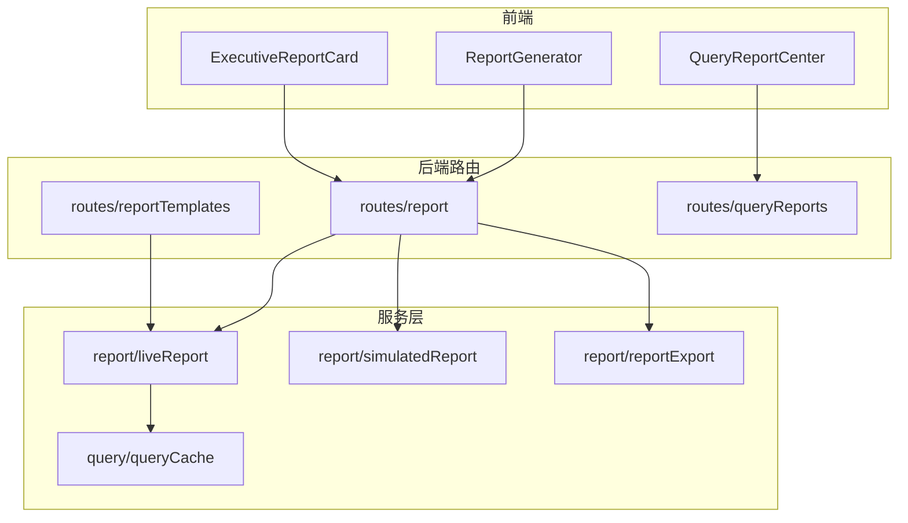
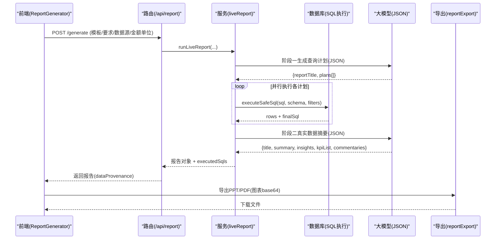
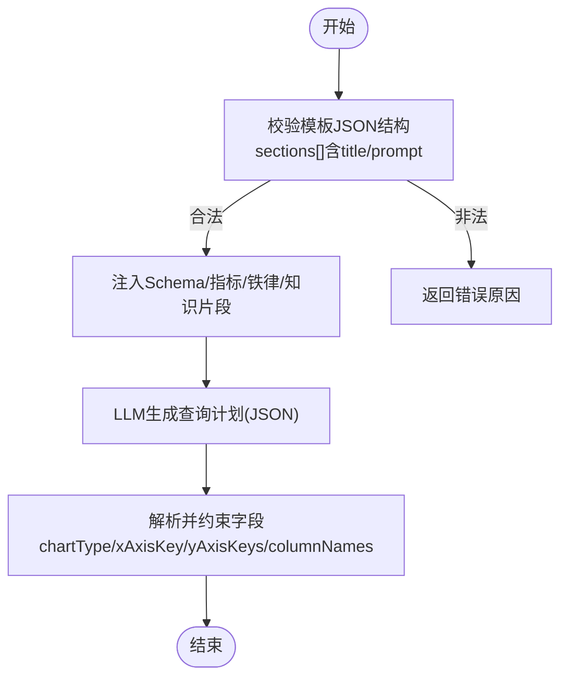
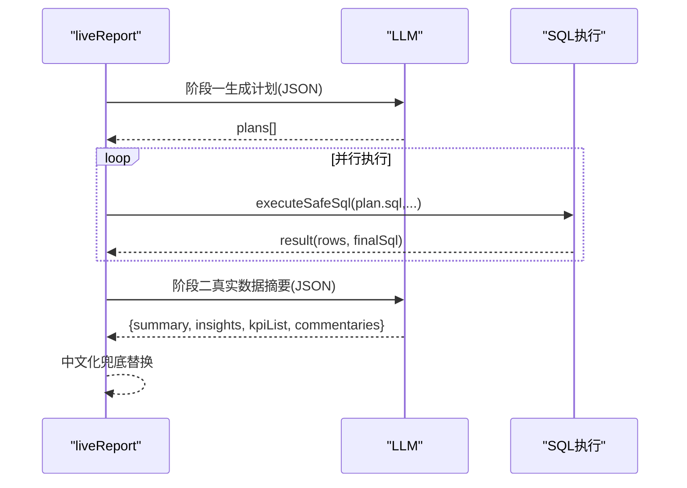
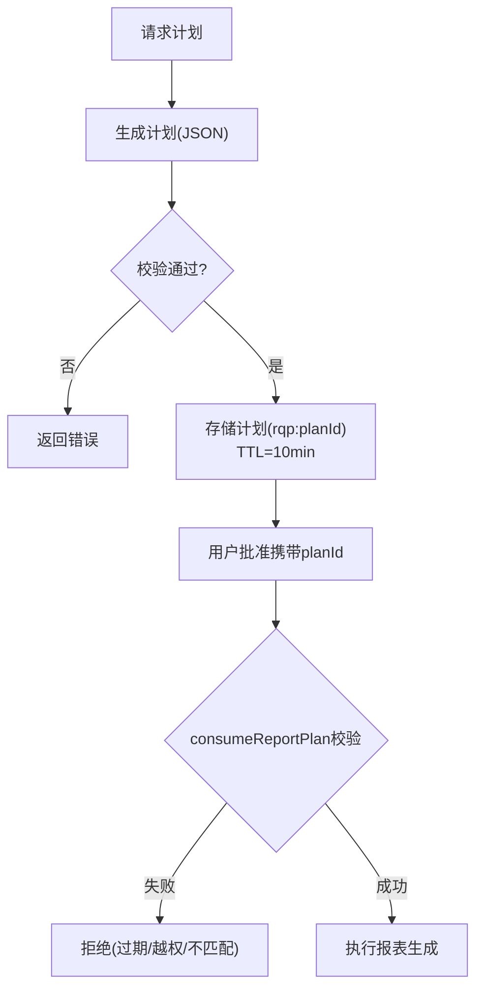
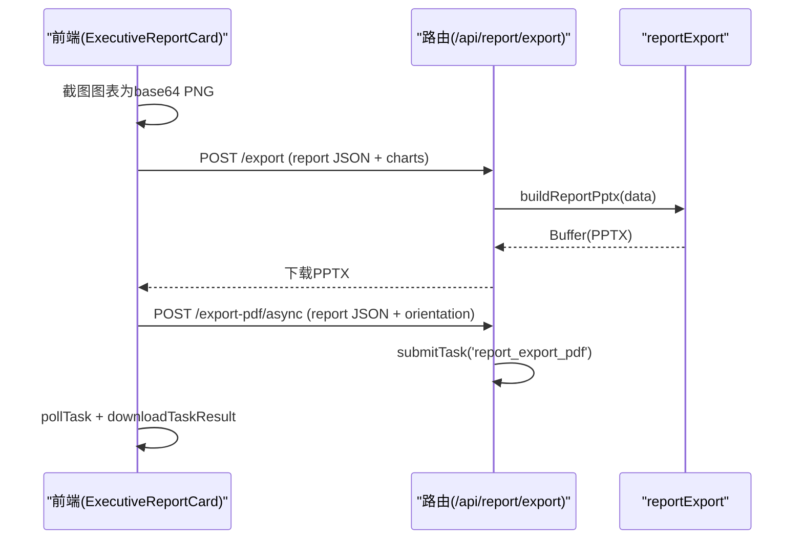
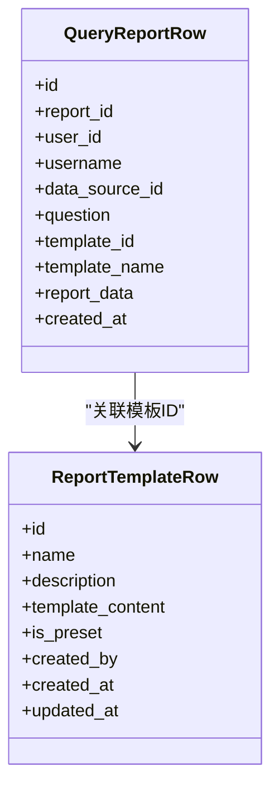
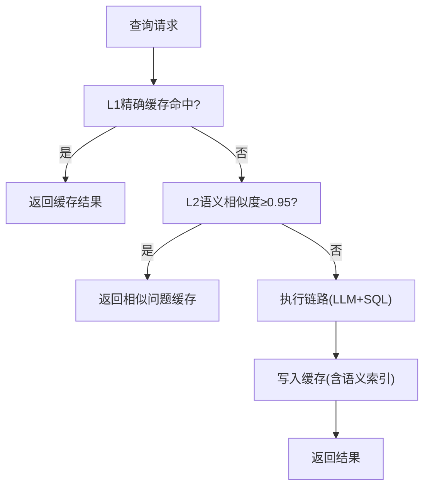
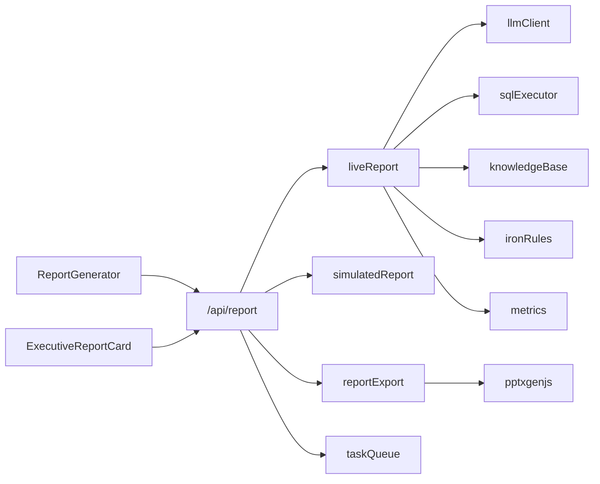

# 报表中心

<cite>
**本文引用的文件**
- [server/report/liveReport.ts](file://server/report/liveReport.ts)
- [server/report/simulatedReport.ts](file://server/report/simulatedReport.ts)
- [server/report/reportExport.ts](file://server/report/reportExport.ts)
- [server/routes/report.ts](file://server/routes/report.ts)
- [server/routes/queryReports.ts](file://server/routes/queryReports.ts)
- [server/routes/reportTemplates.ts](file://server/routes/reportTemplates.ts)
- [src/components/reports/QueryReportCenter.tsx](file://src/components/reports/QueryReportCenter.tsx)
- [src/components/reports/ExecutiveReportCard.tsx](file://src/components/reports/ExecutiveReportCard.tsx)
- [src/components/reports/ReportGenerator.tsx](file://src/components/reports/ReportGenerator.tsx)
- [server/query/queryCache.ts](file://server/query/queryCache.ts)
- [src/utils/reportPersistence.ts](file://src/utils/reportPersistence.ts)
</cite>

## 目录
1. [简介](#简介)
2. [项目结构](#项目结构)
3. [核心组件](#核心组件)
4. [架构总览](#架构总览)
5. [详细组件分析](#详细组件分析)
6. [依赖关系分析](#依赖关系分析)
7. [性能与并发](#性能与并发)
8. [故障排查指南](#故障排查指南)
9. [结论](#结论)
10. [附录：开发指南与最佳实践](#附录开发指南与最佳实践)

## 简介
本文件面向“智能问数据分析系统”的报表中心，系统性说明动态报表的创建与管理、实时报表生成机制、PPT/PDF导出能力、分享协作与权限控制、以及企业级性能优化与内存管理。文档同时提供模板设计最佳实践、导出格式配置与常见问题排查建议，帮助开发者快速上手并稳定扩展报表能力。

## 项目结构
报表中心由前端页面、后端路由与服务模块组成，围绕“模板—计划—执行—渲染—导出—持久化”的主线组织：
- 前端
  - ReportGenerator：报表生成入口、模板选择、计划模式开关、历史报表维护（重新生成/删除）
  - ExecutiveReportCard：报告渲染、异常扫描、图表下钻、PDF/PPT导出、打印
  - QueryReportCenter：问数对话生成的报告列表与详情查看
- 后端
  - routes/report：报告生成/计划/导出等API（同步与异步）
  - report/liveReport：双阶段真实数据报表生成（查询计划→并行执行→文案生成）
  - report/simulatedReport：演示模式单阶段生成
  - report/reportExport：PPTX构建与文件名生成
  - routes/reportTemplates：模板CRUD与校验
  - routes/queryReports：问数报告列表/详情/删除
  - query/queryCache：语义缓存（L1精确+L2语义相似度）
  - utils/reportPersistence：历史报表服务端持久化辅助函数

**图示来源**
- [src/components/reports/ReportGenerator.tsx:198-306](file://src/components/reports/ReportGenerator.tsx#L198-L306)
- [src/components/reports/ExecutiveReportCard.tsx:283-366](file://src/components/reports/ExecutiveReportCard.tsx#L283-L366)
- [server/routes/report.ts:31-160](file://server/routes/report.ts#L31-L160)
- [server/report/liveReport.ts:350-492](file://server/report/liveReport.ts#L350-L492)
- [server/report/reportExport.ts:111-214](file://server/report/reportExport.ts#L111-L214)
- [server/query/queryCache.ts:43-90](file://server/query/queryCache.ts#L43-L90)

**章节来源**
- [src/components/reports/ReportGenerator.tsx:1-706](file://src/components/reports/ReportGenerator.tsx#L1-L706)
- [server/routes/report.ts:1-584](file://server/routes/report.ts#L1-L584)
- [server/report/liveReport.ts:1-493](file://server/report/liveReport.ts#L1-L493)
- [server/report/reportExport.ts:1-222](file://server/report/reportExport.ts#L1-L222)
- [server/query/queryCache.ts:1-254](file://server/query/queryCache.ts#L1-L254)

## 核心组件
- 动态报表创建与管理
  - 模板设计：通过 /api/report-templates 管理模板内容（JSON 结构含 sections），支持预设与自定义模板，管理员可增删改
  - 数据绑定：基于数据源 Schema 注入业务口径、指标定义、铁律规则与知识库片段，驱动 LLM 生成 SQL 查询计划
  - 图表配置：每条计划指定 chartType、xAxisKey、yAxisKeys、columnNames，自动中文化轴名与图例
- 实时报表生成机制
  - 双阶段流程：阶段一生成 2-4 条聚合查询计划；阶段二将真实结果摘要回喂 LLM 生成高管摘要、洞察、KPI 与图表解读
  - 查询优化：多条计划并行执行、连接池配额排队、允许部分失败；金额单位换算统一注入；SQL 安全执行层拦截
  - 增量更新：数据版本变化时自动触发重新生成（仅 live 报表），保留批注与条件快照
  - 缓存策略：L1 精确键 + L2 语义相似度命中，TTL 默认 30 分钟，Redis 或内存存储
- PPT 与 PDF 导出
  - PPT：前端截图图表为 base64 PNG，服务端用 pptxgenjs 组装封面/摘要/KPI/每图一页/结论页，带水印与页码
  - PDF：前端提交图表图片，服务端调用 ReportLab 脚本排版，支持横竖版，异步任务轮询下载
- 分享与协作
  - 权限控制：角色鉴权（ADMIN/ANALYST），报告列表按用户隔离，ADMIN 可查看全部
  - 版本管理：历史报表本地与服务端持久化，支持就地替换与条件快照
  - 订阅通知：数据版本变化监听，自动重新生成并提示状态
- 企业级特性
  - 并发与限流：用户级并发槽互斥、速率限制、任务队列异步化
  - 内存管理：缓存条目上限、payload 体积限制、索引容量限制
  - 审计与监控：全链路审计日志、Prometheus 埋点（缓存命中等）

**章节来源**
- [server/routes/reportTemplates.ts:44-67](file://server/routes/reportTemplates.ts#L44-L67)
- [server/report/liveReport.ts:237-320](file://server/report/liveReport.ts#L237-L320)
- [server/report/liveReport.ts:350-492](file://server/report/liveReport.ts#L350-L492)
- [server/query/queryCache.ts:12-28](file://server/query/queryCache.ts#L12-L28)
- [server/report/reportExport.ts:111-214](file://server/report/reportExport.ts#L111-L214)
- [src/components/reports/ReportGenerator.tsx:97-156](file://src/components/reports/ReportGenerator.tsx#L97-L156)
- [server/routes/report.ts:374-423](file://server/routes/report.ts#L374-L423)

## 架构总览
报表中心采用“前端交互—路由鉴权—服务编排—外部资源”的分层架构：
- 前端负责模板选择、参数输入、图表截图、导出触发与历史报表维护
- 路由层负责鉴权、限流、注入检测、上下文加载与审计
- 服务层实现双阶段报表生成、演示模式、导出构建与缓存
- 外部资源包括数据库（SQL执行）、LLM（JSON输出）、Python ReportLab（PDF）、pptxgenjs（PPT）

**图示来源**
- [server/routes/report.ts:31-160](file://server/routes/report.ts#L31-L160)
- [server/report/liveReport.ts:237-320](file://server/report/liveReport.ts#L237-L320)
- [server/report/liveReport.ts:350-492](file://server/report/liveReport.ts#L350-L492)
- [server/report/reportExport.ts:111-214](file://server/report/reportExport.ts#L111-L214)

## 详细组件分析

### 动态报表模板设计与数据绑定
- 模板结构：JSON 包含 sections 数组，每个 section 需有 title 与 prompt；服务端严格校验
- 数据绑定：阶段一系统提示词注入 Schema、业务备注、指标口径、铁律规则、知识库片段；金额单位白名单校验
- 图表配置：每条计划声明 chartType、xAxisKey、yAxisKeys、columnNames；服务端自动中文化轴名与图例

**图示来源**
- [server/routes/reportTemplates.ts:44-67](file://server/routes/reportTemplates.ts#L44-L67)
- [server/report/liveReport.ts:237-320](file://server/report/liveReport.ts#L237-L320)

**章节来源**
- [server/routes/reportTemplates.ts:69-132](file://server/routes/reportTemplates.ts#L69-L132)
- [server/report/liveReport.ts:275-320](file://server/report/liveReport.ts#L275-L320)

### 实时报表生成机制（双阶段）
- 阶段一：LLM 根据主题与 Schema 生成 2-4 条聚合 SQL 计划，支持重试与校验
- 执行：并行执行各计划，连接池配额排队，允许部分失败，至少一条成功继续
- 阶段二：将真实数据摘要（行数、列统计、样本）回喂 LLM 生成高管摘要、洞察、KPI 与图表解读
- 兜底：若阶段二失败，记录警告并降级为空对象；最终对文案做英文标识符中文化替换

**图示来源**
- [server/report/liveReport.ts:237-320](file://server/report/liveReport.ts#L237-L320)
- [server/report/liveReport.ts:350-492](file://server/report/liveReport.ts#L350-L492)

**章节来源**
- [server/report/liveReport.ts:350-492](file://server/report/liveReport.ts#L350-L492)

### 查询计划批准模式（M4）
- 先由 LLM 生成查询计划（不执行），返回 planId（10 分钟 TTL）
- 用户批准后携带 planId 执行生成，服务端校验过期、越权、数据源/模板匹配、金额单位一致性
- 支持 Redis 外置存储与原子一次性消费（GETDEL）

**图示来源**
- [server/report/liveReport.ts:124-188](file://server/report/liveReport.ts#L124-L188)
- [server/routes/report.ts:162-226](file://server/routes/report.ts#L162-L226)

**章节来源**
- [server/report/liveReport.ts:124-188](file://server/report/liveReport.ts#L124-L188)
- [server/routes/report.ts:162-226](file://server/routes/report.ts#L162-L226)

### PPT 与 PDF 导出
- PPT：前端收集图表 DOM/SVG 转 base64 PNG，服务端用 pptxgenjs 组装多页（封面/摘要/KPI/每图一页/结论），页脚带水印与页码
- PDF：前端提交图表图片，服务端调用 ReportLab 脚本排版，支持横竖版，异步任务提交与轮询下载
- 文件名：基于标题与安全字符处理生成

**图示来源**
- [src/components/reports/ExecutiveReportCard.tsx:255-366](file://src/components/reports/ExecutiveReportCard.tsx#L255-L366)
- [server/report/reportExport.ts:111-214](file://server/report/reportExport.ts#L111-L214)
- [server/routes/report.ts:480-513](file://server/routes/report.ts#L480-L513)

**章节来源**
- [server/report/reportExport.ts:62-103](file://server/report/reportExport.ts#L62-L103)
- [server/report/reportExport.ts:111-214](file://server/report/reportExport.ts#L111-L214)
- [server/routes/report.ts:515-581](file://server/routes/report.ts#L515-L581)

### 分享与协作（权限、版本、订阅）
- 权限控制：路由层 authMiddleware + requireRole，报告列表按用户隔离，ADMIN 可查看全部
- 版本管理：历史报表本地与服务端持久化，支持就地替换与条件快照；内置演示报表不落库
- 订阅通知：数据版本变化监听，自动重新生成 live 报表并提示状态

**图示来源**
- [server/routes/queryReports.ts:16-44](file://server/routes/queryReports.ts#L16-L44)
- [server/routes/reportTemplates.ts:18-42](file://server/routes/reportTemplates.ts#L18-L42)

**章节来源**
- [server/routes/queryReports.ts:46-149](file://server/routes/queryReports.ts#L46-L149)
- [server/routes/reportTemplates.ts:69-253](file://server/routes/reportTemplates.ts#L69-L253)
- [src/utils/reportPersistence.ts:1-32](file://src/utils/reportPersistence.ts#L1-L32)

### 性能优化与内存管理
- 缓存策略：L1 精确键（dataSourceId::question::variant），L2 语义相似度（阈值≥0.95），TTL 默认 30 分钟，Redis/内存存储
- 并发与限流：用户级并发槽互斥、速率限制、任务队列异步化（生成/导出）
- 内存控制：缓存条目上限（Map 200）、Redis payload 上限（200KB）、语义索引上限（100）
- 查询优化：并行执行计划、连接池配额分级（chain/export）、允许部分失败

**图示来源**
- [server/query/queryCache.ts:43-90](file://server/query/queryCache.ts#L43-L90)
- [server/query/queryCache.ts:116-254](file://server/query/queryCache.ts#L116-L254)

**章节来源**
- [server/query/queryCache.ts:12-28](file://server/query/queryCache.ts#L12-L28)
- [server/query/queryCache.ts:43-90](file://server/query/queryCache.ts#L43-L90)
- [server/query/queryCache.ts:116-254](file://server/query/queryCache.ts#L116-L254)

## 依赖关系分析
- 前端依赖
  - ReportGenerator 依赖 useAnalyticsStore、useAuthStore、useEngineInfo、AmountUnitSelect、apiFetch
  - ExecutiveReportCard 依赖 DynamicChart、anomalyDetector、ChartCommentSection、DrillModal、asyncTask
- 后端依赖
  - routes/report 依赖 liveReport、simulatedReport、reportExport、taskQueue、schemaContext、auth、rateLimiter
  - liveReport 依赖 llmClient、sqlExecutor、metrics、ironRules、knowledgeBase、stateStore
  - reportExport 依赖 pptxgenjs
  - queryCache 依赖 stateStore、llmClient(embedding)、monitoring

**图示来源**
- [src/components/reports/ReportGenerator.tsx:1-706](file://src/components/reports/ReportGenerator.tsx#L1-L706)
- [src/components/reports/ExecutiveReportCard.tsx:1-800](file://src/components/reports/ExecutiveReportCard.tsx#L1-L800)
- [server/routes/report.ts:1-584](file://server/routes/report.ts#L1-L584)
- [server/report/liveReport.ts:1-493](file://server/report/liveReport.ts#L1-L493)
- [server/report/reportExport.ts:1-222](file://server/report/reportExport.ts#L1-L222)

**章节来源**
- [server/routes/report.ts:1-584](file://server/routes/report.ts#L1-L584)
- [server/report/liveReport.ts:1-493](file://server/report/liveReport.ts#L1-L493)
- [server/report/reportExport.ts:1-222](file://server/report/reportExport.ts#L1-L222)

## 性能与并发
- 并发控制
  - 用户级并发槽互斥：确保同一用户不会同时发起多个报告生成任务
  - 速率限制：防止滥用与过载
  - 异步任务：生成与导出均支持异步提交与轮询，不阻塞用户交互
- 内存管理
  - 缓存条目上限与 TTL：避免内存无限增长
  - Redis payload 上限：防止大结果集撑爆内存库
  - 语义索引上限：限制同数据源索引数量
- 查询优化
  - 并行执行：多条查询计划并行过安全执行层，墙钟时间由逐条相加降为最慢一条
  - 连接池配额：chain 默认 5，export 默认 2，按场景分级
  - 部分失败容忍：至少一条成功才继续，提升鲁棒性

[本节为通用性能讨论，无需特定文件引用]

## 故障排查指南
- 报告生成失败
  - 检查角色权限（ADMIN/ANALYST）与数据源状态（disconnected）
  - 查看注入特征检测与金额单位白名单校验结果
  - 关注阶段一/阶段二 LLM 调用失败日志与降级路径
- 导出失败
  - PPT：确认图表 base64 格式正确，服务端构建过程是否异常
  - PDF：确认 Python 环境与 ReportLab 可用，异步任务是否完成
- 缓存未命中
  - 检查 L1/L2 阈值与 TTL，确认数据源变更是否触发失效
  - 观察 Prometheus 埋点（cache hit）定位瓶颈
- 权限与审计
  - 查看审计日志中的 DENIED_AUTH/DENIED_INPUT/DENIED_RATE 等状态
  - 确认报告列表按用户隔离，ADMIN 可查看全部

**章节来源**
- [server/routes/report.ts:31-160](file://server/routes/report.ts#L31-L160)
- [server/routes/report.ts:480-581](file://server/routes/report.ts#L480-L581)
- [server/query/queryCache.ts:43-90](file://server/query/queryCache.ts#L43-L90)
- [server/query/queryCache.ts:116-254](file://server/query/queryCache.ts#L116-L254)

## 结论
报表中心以“模板—计划—执行—渲染—导出—持久化”为主线，结合双阶段真实数据生成、语义缓存、异步任务与企业级权限控制，提供了从动态报表创建到高质量导出的完整能力。通过并行执行、连接池配额、内存限制与审计监控，系统在性能与稳定性方面具备企业级保障。开发者可基于模板管理与数据绑定机制快速扩展新模板与新图表类型，并通过导出接口满足多样化交付需求。

[本节为总结性内容，无需特定文件引用]

## 附录：开发指南与最佳实践
- 模板设计最佳实践
  - 每个 section 必须包含 title 与 prompt，确保 LLM 能理解意图
  - 结合 Schema 与业务口径，明确维度与指标定义
  - 使用铁律规则与知识库片段强化约束与准确性
- 数据绑定与图表配置
  - 明确 xAxisKey 与 yAxisKeys，确保与 SQL 输出列一致
  - 使用 columnNames 映射中文表头，避免英文标识符出现在文案中
  - 合理选择 chartType（时间趋势用 line/area，类别对比用 bar，占比用 pie/donut）
- 导出格式配置
  - PPT：前端截图图表为 base64 PNG，服务端自动组装多页
  - PDF：支持横竖版，异步任务轮询下载，页脚嵌入水印
- 性能优化建议
  - 利用语义缓存减少重复 LLM 调用
  - 合理使用计划模式，先审批再执行，降低风险
  - 监控缓存命中率与任务队列长度，调整 TTL 与阈值
- 分享与协作
  - 权限控制：仅 ADMIN/ANALYST 可生成与导出，报告列表按用户隔离
  - 版本管理：历史报表支持就地替换与条件快照，便于追溯
  - 订阅通知：数据版本变化时自动重新生成 live 报表，保持时效性

[本节为通用指导，无需特定文件引用]