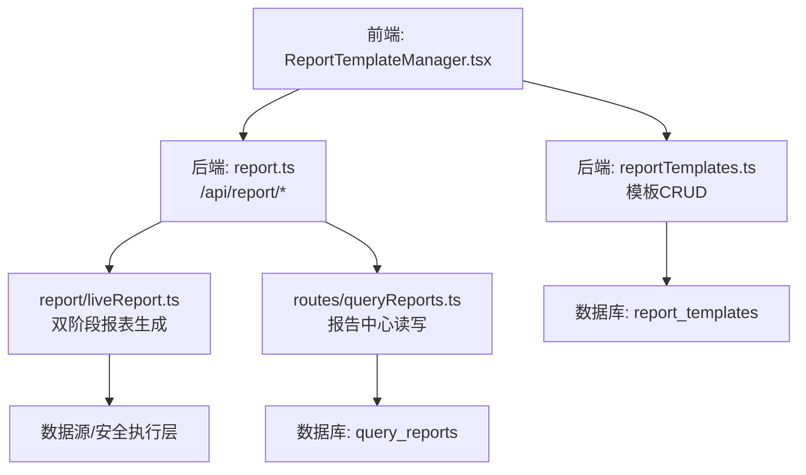
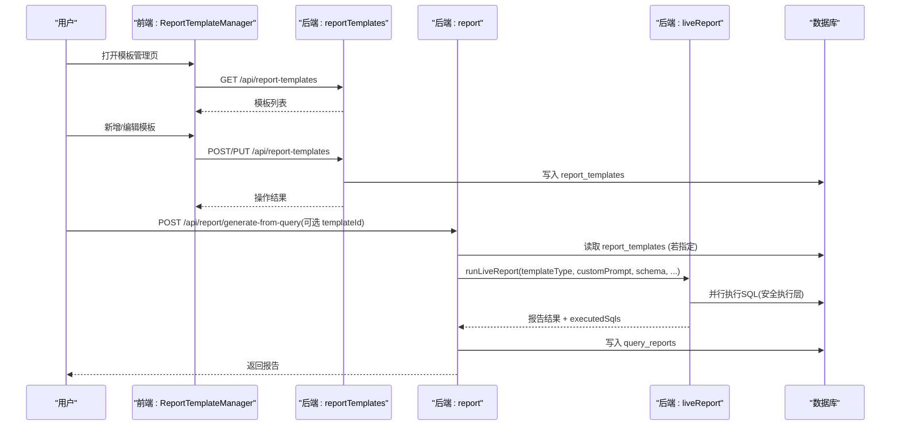
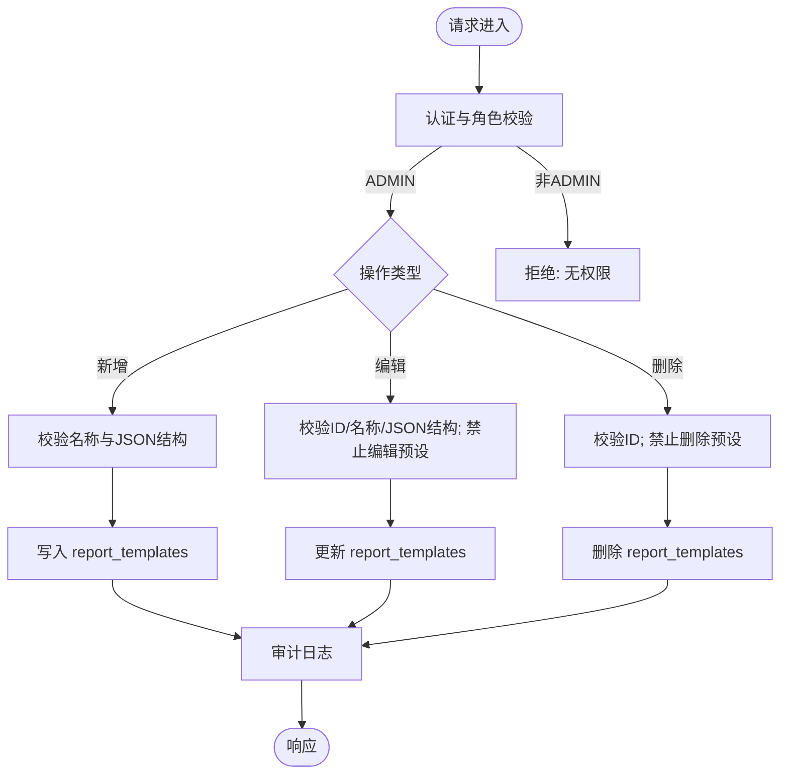
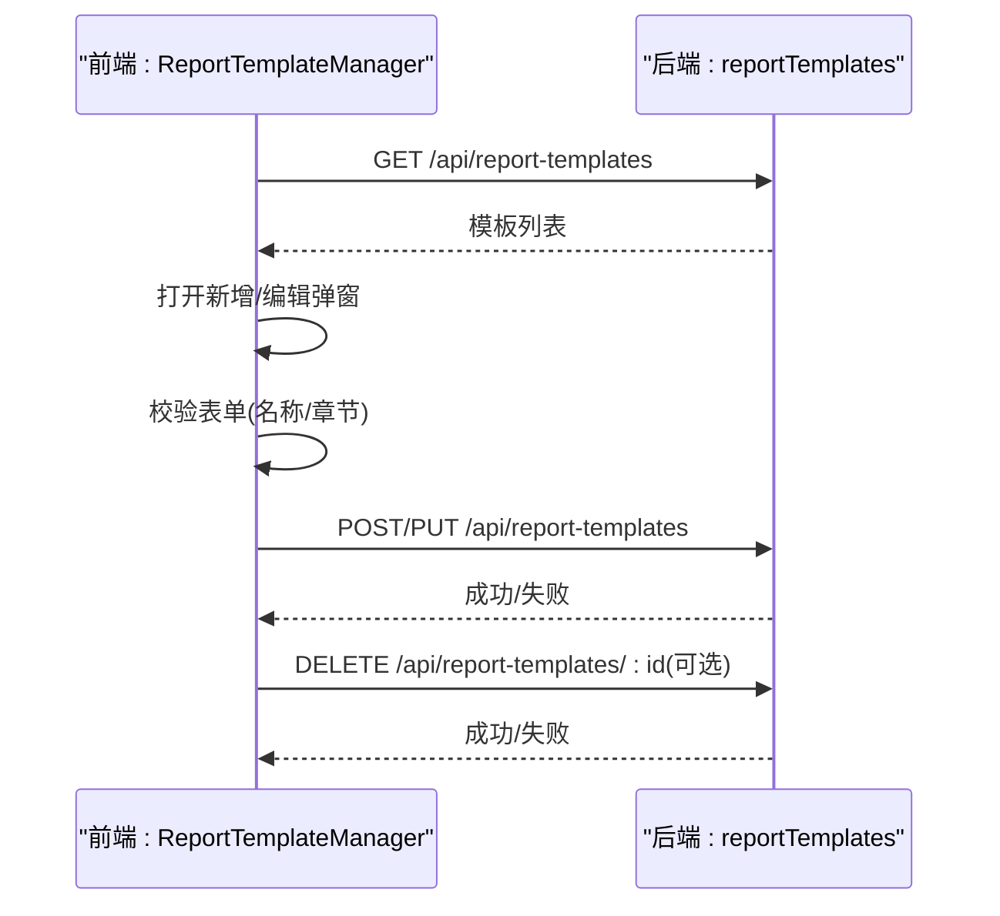
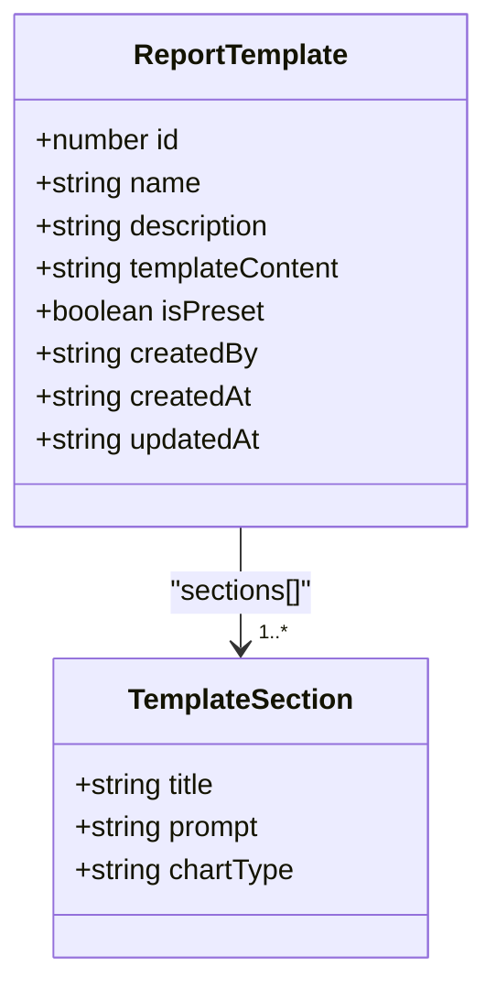
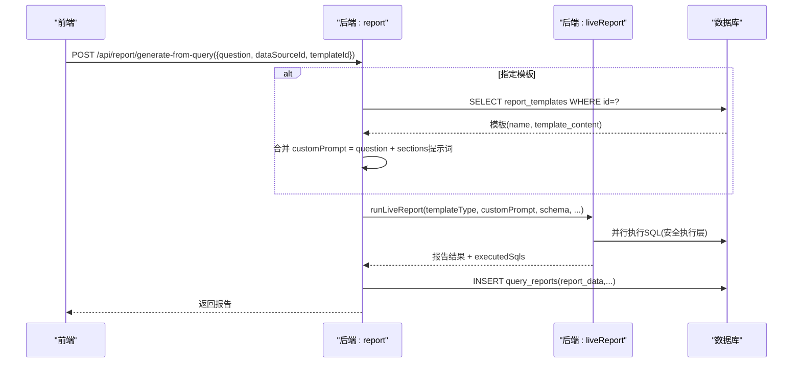
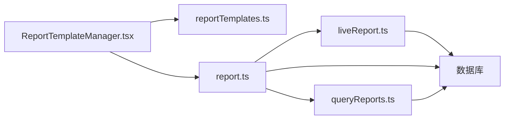

# 模板管理

<cite>
**本文引用的文件**
- [server/routes/reportTemplates.ts](file://server/routes/reportTemplates.ts)
- [src/components/admin/ReportTemplateManager.tsx](file://src/components/admin/ReportTemplateManager.tsx)
- [src/types/analytics.ts](file://src/types/analytics.ts)
- [server/routes/report.ts](file://server/routes/report.ts)
- [server/report/liveReport.ts](file://server/report/liveReport.ts)
- [server/routes/queryReports.ts](file://server/routes/queryReports.ts)
- [src/utils/reportRegen.ts](file://src/utils/reportRegen.ts)
</cite>

## 目录
1. [简介](#简介)
2. [项目结构](#项目结构)
3. [核心组件](#核心组件)
4. [架构总览](#架构总览)
5. [详细组件分析](#详细组件分析)
6. [依赖关系分析](#依赖关系分析)
7. [性能考虑](#性能考虑)
8. [故障排查指南](#故障排查指南)
9. [结论](#结论)
10. [附录](#附录)

## 简介
本文件面向“智能问数据分析系统”的报表模板管理功能，覆盖模板的增删改查、模板结构定义（章节、图表类型、提示词）、模板与报告生成的集成、权限控制、错误处理与性能优化等。当前实现以“报告模板”为核心：管理员可创建/编辑/删除自定义模板；系统预设模板不可编辑或删除；模板内容采用 JSON 结构，包含若干章节，每章具备标题、提示词与可选图表类型；报告生成链路支持按模板主题驱动查询计划与文案生成。

## 项目结构
围绕模板管理的代码主要分布在以下位置：
- 后端路由：提供模板 CRUD 接口与报告生成入口
- 前端管理页：提供模板列表、新增/编辑弹窗、删除确认
- 类型定义：统一前后端数据结构
- 报告执行链路：将模板主题注入到 LLM 阶段一/阶段二流程中
- 报告中心：记录基于模板生成的报告实例

**图示来源**
- [src/components/admin/ReportTemplateManager.tsx:1-382](file://src/components/admin/ReportTemplateManager.tsx#L1-L382)
- [server/routes/reportTemplates.ts:1-253](file://server/routes/reportTemplates.ts#L1-L253)
- [server/routes/report.ts:1-584](file://server/routes/report.ts#L1-L584)
- [server/report/liveReport.ts:1-493](file://server/report/liveReport.ts#L1-L493)
- [server/routes/queryReports.ts:1-150](file://server/routes/queryReports.ts#L1-L150)

**章节来源**
- [server/routes/reportTemplates.ts:1-253](file://server/routes/reportTemplates.ts#L1-L253)
- [src/components/admin/ReportTemplateManager.tsx:1-382](file://src/components/admin/ReportTemplateManager.tsx#L1-L382)
- [server/routes/report.ts:1-584](file://server/routes/report.ts#L1-L584)
- [server/report/liveReport.ts:1-493](file://server/report/liveReport.ts#L1-L493)
- [server/routes/queryReports.ts:1-150](file://server/routes/queryReports.ts#L1-L150)

## 核心组件
- 模板管理路由（后端）
  - 获取模板列表：所有登录用户可读
  - 新增模板：仅 ADMIN，校验名称唯一性与模板内容结构
  - 编辑模板：仅 ADMIN，禁止编辑预设模板
  - 删除模板：仅 ADMIN，禁止删除预设模板
- 模板管理页面（前端）
  - 展示模板列表、区分系统预设与自定义
  - 新增/编辑弹窗：维护模板名称、描述、章节数组（标题、提示词、图表类型）
  - 删除确认：对非预设模板生效
- 报告生成链路（后端）
  - 支持通过模板主题（templateType）驱动阶段一查询计划生成与阶段二文案生成
  - 支持从对话中选择模板并合并模板章节提示词为 customPrompt
- 报告中心（后端）
  - 保存基于模板生成的报告实例，支持按数据源过滤查看与详情读取
  - 权限控制：本人或管理员可访问/删除

**章节来源**
- [server/routes/reportTemplates.ts:18-253](file://server/routes/reportTemplates.ts#L18-L253)
- [src/components/admin/ReportTemplateManager.tsx:16-382](file://src/components/admin/ReportTemplateManager.tsx#L16-L382)
- [server/routes/report.ts:228-372](file://server/routes/report.ts#L228-L372)
- [server/routes/queryReports.ts:16-150](file://server/routes/queryReports.ts#L16-L150)

## 架构总览
模板管理与报告生成形成“配置—执行—持久化”闭环：
- 配置：管理员在模板管理中维护模板结构与章节提示词
- 执行：报告生成时根据模板主题与自定义要求，调用 LLM 生成查询计划，并行执行 SQL，再基于真实数据生成文案
- 持久化：报告结果写入报告中心，便于后续查看、导出与重新生成

**图示来源**
- [server/routes/reportTemplates.ts:69-253](file://server/routes/reportTemplates.ts#L69-L253)
- [server/routes/report.ts:228-372](file://server/routes/report.ts#L228-L372)
- [server/report/liveReport.ts:350-493](file://server/report/liveReport.ts#L350-L493)
- [server/routes/queryReports.ts:46-150](file://server/routes/queryReports.ts#L46-L150)

## 详细组件分析

### 模板管理后端接口（reportTemplates）
- 能力
  - 列表：GET /api/report-templates（认证后均可读）
  - 新增：POST /api/report-templates（ADMIN），校验名称唯一性与模板内容结构
  - 编辑：PUT /api/report-templates/:id（ADMIN），禁止编辑预设模板
  - 删除：DELETE /api/report-templates/:id（ADMIN），禁止删除预设模板
- 模板内容校验
  - 必须为合法 JSON
  - 必须包含 sections 数组
  - 每个章节必须包含 title 与 prompt
- 权限与安全
  - 使用认证中间件与角色校验
  - 预设模板受保护，编辑/删除均拒绝并审计
  - 异常统一记录日志与错误码

**图示来源**
- [server/routes/reportTemplates.ts:69-253](file://server/routes/reportTemplates.ts#L69-L253)

**章节来源**
- [server/routes/reportTemplates.ts:18-253](file://server/routes/reportTemplates.ts#L18-L253)

### 模板管理前端（ReportTemplateManager）
- 功能
  - 加载模板列表，区分系统预设与自定义
  - 新增/编辑弹窗：维护模板名称、描述、章节数组（title、prompt、chartType）
  - 删除：二次确认后调用删除接口
- 交互逻辑
  - 提交前前端校验：至少一个有效章节（标题+提示词）
  - 提交载荷：name、description、templateContent(JSON字符串)
  - 错误提示：统一通知条显示成功/失败信息

**图示来源**
- [src/components/admin/ReportTemplateManager.tsx:52-158](file://src/components/admin/ReportTemplateManager.tsx#L52-L158)
- [server/routes/reportTemplates.ts:69-253](file://server/routes/reportTemplates.ts#L69-L253)

**章节来源**
- [src/components/admin/ReportTemplateManager.tsx:16-382](file://src/components/admin/ReportTemplateManager.tsx#L16-L382)

### 模板结构定义
- 存储格式
  - 模板内容以 JSON 字符串存储在 template_content 字段
  - 结构约定：{ sections: [{ title, prompt, chartType? }] }
- 字段说明
  - title：章节标题（必填）
  - prompt：分析提示词（必填）
  - chartType：图表类型（可选，用于前端渲染建议）
- 类型映射
  - 前端类型：ReportTemplate.templateContent 为 JSON 字符串
  - 后端校验：validateTemplateContent 确保 sections 存在且每项含 title/prompt

**图示来源**
- [src/types/analytics.ts:347-357](file://src/types/analytics.ts#L347-L357)
- [server/routes/reportTemplates.ts:44-67](file://server/routes/reportTemplates.ts#L44-L67)

**章节来源**
- [src/types/analytics.ts:347-357](file://src/types/analytics.ts#L347-L357)
- [server/routes/reportTemplates.ts:44-67](file://server/routes/reportTemplates.ts#L44-L67)

### 模板与报告生成集成
- 报告生成入口
  - POST /api/report/generate-from-query：支持传入 templateId，若存在则读取模板内容，将章节提示词合并入 customPrompt，并以模板名称作为 templateType
- 双阶段生成
  - 阶段一：LLM 生成 2-4 条聚合查询计划（SQL），受 Schema、指标口径、铁律规则、知识库片段约束
  - 阶段二：基于真实查询结果生成高管摘要、洞察、KPI 与各图解读
- 金额单位与中文化
  - 金额单位白名单校验，阶段二强制沿用单位表述
  - 服务端兜底替换英文标识符为中文业务名称

**图示来源**
- [server/routes/report.ts:228-372](file://server/routes/report.ts#L228-L372)
- [server/report/liveReport.ts:350-493](file://server/report/liveReport.ts#L350-L493)

**章节来源**
- [server/routes/report.ts:228-372](file://server/routes/report.ts#L228-L372)
- [server/report/liveReport.ts:237-493](file://server/report/liveReport.ts#L237-L493)

### 版本管理、变更历史与回滚
- 现状
  - 当前未实现模板版本表与变更历史；模板直接覆盖更新
  - 报告中心记录每次生成的报告快照（query_reports.report_data），可用于回溯报告内容
- 建议扩展
  - 引入模板版本表（version、diff、created_by、created_at），编辑时插入新版本
  - 提供回滚接口：将模板内容恢复至指定版本
  - 报告中心增加“基于某模板版本重新生成”的能力

[本节为概念性说明，不直接分析具体文件]

### 共享与协作、权限控制
- 模板可见性
  - 模板列表对所有登录用户可见
  - 模板修改/删除仅限 ADMIN
  - 预设模板不可编辑/删除
- 报告可见性
  - 报告列表按数据源过滤：ADMIN 可查看全部，其他用户仅本人
  - 报告详情：仅本人或 ADMIN 可访问
- 审计
  - 关键操作（新增/编辑/删除模板、访问他人报告）均记录审计日志

**章节来源**
- [server/routes/reportTemplates.ts:69-253](file://server/routes/reportTemplates.ts#L69-L253)
- [server/routes/queryReports.ts:46-150](file://server/routes/queryReports.ts#L46-L150)

### 导入导出与迁移
- 模板导入导出
  - 当前未提供模板批量导入/导出接口；可通过数据库直出/导入 report_templates 表完成迁移
  - 模板内容为 JSON，需遵循 sections 结构规范
- 报告导出
  - 支持 PPTX/PDF 导出（独立接口），可在报告中心查看并导出
- 迁移工具
  - 前端提供本地遗留报表迁移筛选函数，可将本地 SavedReport 迁移至服务端（与模板无关）

**章节来源**
- [server/routes/report.ts:515-580](file://server/routes/report.ts#L515-L580)
- [src/utils/reportPersistence.ts:1-32](file://src/utils/reportPersistence.ts#L1-L32)

### 默认模板配置与管理
- 系统预设模板
  - 通过 is_preset=1 标记，不可编辑/删除
  - 可作为报告生成的默认主题（如“综合经营分析”）
- 企业标准模板
  - 由 ADMIN 创建自定义模板，作为团队标准模板
  - 报告生成时可指定模板 ID，自动合并章节提示词

**章节来源**
- [server/routes/reportTemplates.ts:18-253](file://server/routes/reportTemplates.ts#L18-L253)
- [server/routes/report.ts:228-372](file://server/routes/report.ts#L228-L372)

### 验证规则、错误检测与性能优化
- 验证规则
  - 模板内容：JSON 合法性、sections 存在、每项含 title/prompt
  - 名称唯一性：新增/编辑时检查重复
  - 权限：ADMIN 才能修改/删除；预设模板受保护
- 错误检测
  - 非法输入返回 INVALID_INPUT
  - 资源不存在返回 NOT_FOUND
  - 权限不足返回 FORBIDDEN
  - 内部错误返回 INTERNAL_ERROR
- 性能优化
  - 报告生成阶段一查询计划并行执行，降低整体耗时
  - 限制单份报表最大查询数与采样行数，避免资源占用过高
  - 异步任务：报告生成/导出支持异步提交，避免阻塞用户交互

**章节来源**
- [server/routes/reportTemplates.ts:84-253](file://server/routes/reportTemplates.ts#L84-L253)
- [server/report/liveReport.ts:28-31](file://server/report/liveReport.ts#L28-L31)
- [server/report/liveReport.ts:363-422](file://server/report/liveReport.ts#L363-L422)
- [server/routes/report.ts:374-478](file://server/routes/report.ts#L374-L478)

## 依赖关系分析
- 模块耦合
  - 前端 ReportTemplateManager 依赖后端 reportTemplates 接口
  - 报告生成路由 report.ts 依赖 liveReport 执行链路
  - 报告中心 queryReports.ts 负责报告实例的存取
- 外部依赖
  - 数据库：report_templates、query_reports
  - 安全执行层：executeSafeSql（SQL 安全校验与执行）
  - LLM 客户端：callLLMJson（阶段一/阶段二）
  - 状态存储：Redis/内存（报告计划缓存）

**图示来源**
- [src/components/admin/ReportTemplateManager.tsx:1-382](file://src/components/admin/ReportTemplateManager.tsx#L1-L382)
- [server/routes/reportTemplates.ts:1-253](file://server/routes/reportTemplates.ts#L1-L253)
- [server/routes/report.ts:1-584](file://server/routes/report.ts#L1-L584)
- [server/report/liveReport.ts:1-493](file://server/report/liveReport.ts#L1-L493)
- [server/routes/queryReports.ts:1-150](file://server/routes/queryReports.ts#L1-L150)

**章节来源**
- [server/routes/reportTemplates.ts:1-253](file://server/routes/reportTemplates.ts#L1-L253)
- [server/routes/report.ts:1-584](file://server/routes/report.ts#L1-L584)
- [server/report/liveReport.ts:1-493](file://server/report/liveReport.ts#L1-L493)
- [server/routes/queryReports.ts:1-150](file://server/routes/queryReports.ts#L1-L150)

## 性能考虑
- 并发与限流
  - 报告生成与问数共享用户配额与并发互斥，防止过载
  - 异步任务队列：报告生成/导出提交即返回 taskId，后台 worker 执行
- 查询计划并行
  - 多查询计划并行执行，墙钟时间取最慢一条
  - 限制单份报表最大查询数与采样行数，控制资源占用
- 降级策略
  - 阶段二 LLM 失败时保留图表与基础摘要，保证可用性
  - 非数据库型数据源走演示模式，保障体验

[本节为通用性能讨论，不直接分析具体文件]

## 故障排查指南
- 常见错误
  - 模板内容非法：检查 JSON 结构与 sections 字段
  - 名称重复：新增/编辑时确保名称唯一
  - 权限不足：确认角色为 ADMIN；尝试编辑/删除预设模板将被拒绝
  - 报告生成失败：检查数据源连接、Schema 上下文、金额单位白名单
- 审计与日志
  - 所有关键操作均有审计日志，便于追踪
  - 错误路径会记录原因与参数，辅助定位问题

**章节来源**
- [server/routes/reportTemplates.ts:84-253](file://server/routes/reportTemplates.ts#L84-L253)
- [server/routes/report.ts:31-160](file://server/routes/report.ts#L31-L160)

## 结论
当前模板管理实现了基础的 CRUD 与权限控制，模板内容以 JSON 结构组织，支持章节级提示词与图表类型建议。报告生成链路深度集成模板主题，通过双阶段 LLM 流程生成高质量报表。未来可扩展模板版本管理、批量导入导出、团队协作与权限细化等功能，以提升可维护性与协作效率。

## 附录
- 重新生成条件解析（前端纯函数）
  - 优先使用 genParams 快照，否则回退旧版字段
  - 仅 live 报表可重新生成，保留批注与交互状态

**章节来源**
- [src/utils/reportRegen.ts:1-69](file://src/utils/reportRegen.ts#L1-L69)