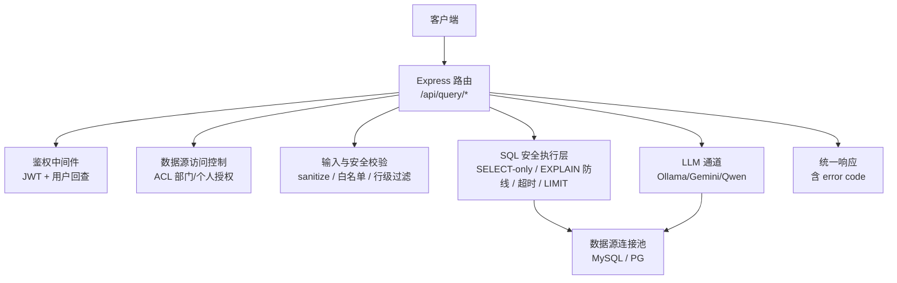
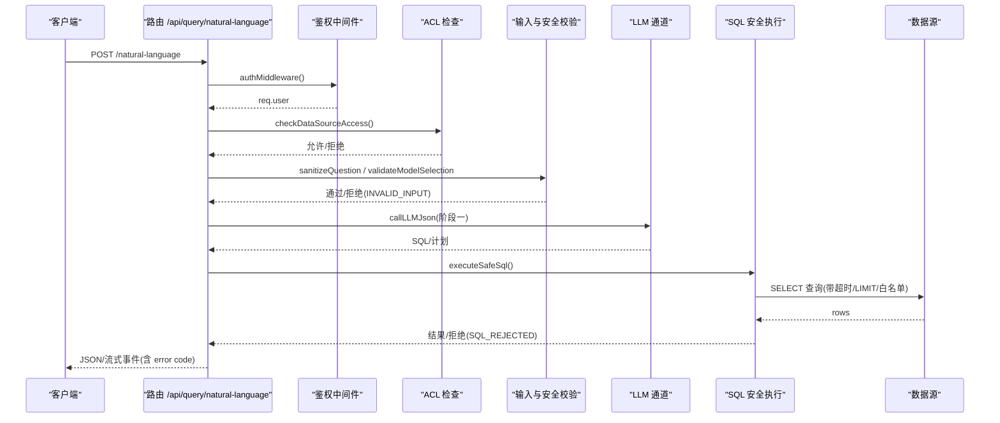
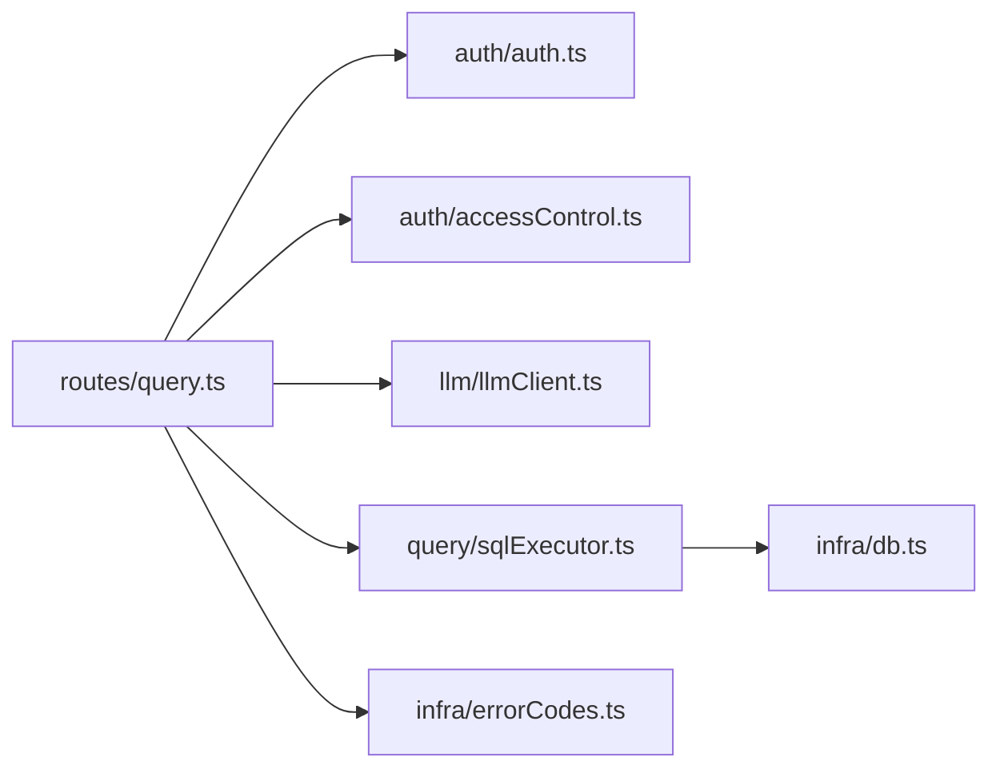

# 常见问题

<cite>
**本文引用的文件**
- [errorCodes.ts](file://server/infra/errorCodes.ts)
- [sqlExecutor.ts](file://server/query/sqlExecutor.ts)
- [accessControl.ts](file://server/auth/accessControl.ts)
- [llmClient.ts](file://server/llm/llmClient.ts)
- [query.ts](file://server/routes/query.ts)
- [db.ts](file://server/infra/db.ts)
- [auth.ts](file://server/auth/auth.ts)
- [liveQuery.ts](file://server/query/liveQuery.ts)
- [rateLimiter.ts](file://server/infra/rateLimiter.ts)
</cite>

## 目录
1. [简介](#简介)
2. [项目结构](#项目结构)
3. [核心组件](#核心组件)
4. [架构总览](#架构总览)
5. [详细组件分析](#详细组件分析)
6. [依赖关系分析](#依赖关系分析)
7. [性能注意事项](#性能注意事项)
8. [故障排查指南](#故障排查指南)
9. [结论](#结论)

## 简介
本指南面向智能问数据分析系统的运维与研发人员，聚焦常见问题的定位与解决。内容覆盖连接问题（数据库连接失败、网络超时、认证失败）、权限错误（FORBIDDEN、DS_ACCESS_DENIED）、输入验证失败（INVALID_INPUT）、资源不存在（NOT_FOUND）与冲突（CONFLICT）、SQL 执行被拒绝（SQL_REJECTED），以及 LLM 服务不可用（LLM_UNAVAILABLE）的降级方案。每个问题均给出“错误现象—原因分析—解决步骤—预防措施”的结构化说明，并附带关键流程的可视化图示，帮助快速定位根因并采取行动。

## 项目结构
系统后端以 Express 路由为入口，串联鉴权、限流、安全校验、LLM 调用、SQL 安全执行与结果返回等模块；统一错误码集中定义，便于前端按 code 分支处理。

**图表来源**
- [query.ts:47-393](file://server/routes/query.ts#L47-L393)
- [auth.ts:67-113](file://server/auth/auth.ts#L67-L113)
- [accessControl.ts:66-73](file://server/auth/accessControl.ts#L66-L73)
- [sqlExecutor.ts:734-752](file://server/query/sqlExecutor.ts#L734-L752)
- [db.ts:47-70](file://server/infra/db.ts#L47-L70)

**章节来源**
- [query.ts:47-393](file://server/routes/query.ts#L47-L393)
- [errorCodes.ts:6-33](file://server/infra/errorCodes.ts#L6-L33)

## 核心组件
- 统一错误码：集中定义 INVALID_INPUT、FORBIDDEN、DS_ACCESS_DENIED、NOT_FOUND、CONFLICT、SQL_REJECTED、LLM_UNAVAILABLE 等，供各端点统一返回。
- 鉴权与授权：JWT 校验、角色守卫、数据源 ACL（部门/个人）。
- 输入与安全：问题清洗、模型选择校验、SQL 安全执行（SELECT-only、表白名单、敏感列拒绝、AST 复核、EXPLAIN 防线、强制 LIMIT、超时）。
- LLM 通道：多引擎（Ollama/Gemini/Qwen）、重试、熔断、并发信号量、自适应超时、故障转移。
- 数据源连接池：按数据源+场景分级缓存，配置变更失效，连接/语句超时保护。

**章节来源**
- [errorCodes.ts:6-33](file://server/infra/errorCodes.ts#L6-L33)
- [auth.ts:67-127](file://server/auth/auth.ts#L67-L127)
- [accessControl.ts:18-73](file://server/auth/accessControl.ts#L18-L73)
- [sqlExecutor.ts:155-387](file://server/query/sqlExecutor.ts#L155-L387)
- [llmClient.ts:125-161](file://server/llm/llmClient.ts#L125-L161)
- [sqlExecutor.ts:686-726](file://server/query/sqlExecutor.ts#L686-L726)

## 架构总览
下图展示一次自然语言问数请求从进入路由到返回结果的完整链路，包括鉴权、ACL、输入校验、LLM 生成 SQL、安全执行、结果返回与降级路径。

**图表来源**
- [query.ts:47-393](file://server/routes/query.ts#L47-L393)
- [sqlExecutor.ts:734-752](file://server/query/sqlExecutor.ts#L734-L752)
- [llmClient.ts:449-525](file://server/llm/llmClient.ts#L449-L525)

## 详细组件分析

### 连接问题排查（数据库连接失败、网络超时、认证失败）
- 错误现象
  - 接口返回内部错误或提示“查询处理异常”，或长时间无响应后超时。
  - 在 SQL 重跑或下钻时直接返回执行失败信息。
- 原因分析
  - 应用库连接池未初始化或配置错误导致无法获取连接。
  - 数据源连接池参数（host/port/user/password/database）不正确或网络不通。
  - 连接/语句超时阈值过低或目标数据库负载过高。
  - 认证凭据错误（用户名/密码/令牌）。
- 解决步骤
  - 确认应用库已初始化并可用：检查 getPool 是否可返回连接池实例。
  - 核对数据源配置：host、port、user、password、database 是否正确；必要时重启使连接池失效重建。
  - 调整超时与容量：根据 EXPECTED_CONCURRENT_USERS 与环境变量 DS_POOL_MAX、QUERY_TIMEOUT_* 合理设置。
  - 检查网络连通性与数据库状态：端口可达、账号权限、最大连接数限制。
- 预防措施
  - 启动时校验数据库连通性，失败即 fail-fast。
  - 使用环境变量集中管理凭据，避免硬编码。
  - 监控连接池使用率与慢查询，动态调优容量与超时。

**章节来源**
- [db.ts:47-70](file://server/infra/db.ts#L47-L70)
- [sqlExecutor.ts:686-726](file://server/query/sqlExecutor.ts#L686-L726)
- [sqlExecutor.ts:51-109](file://server/query/sqlExecutor.ts#L51-L109)

### 权限错误（FORBIDDEN、DS_ACCESS_DENIED）
- 错误现象
  - 访问受限接口返回 403，或提示“没有该数据源的访问权限”。
- 原因分析
  - 当前用户角色不满足接口要求（如仅 ADMIN/ANALYST 可访问）。
  - 数据源 ACL 未包含当前用户或其部门，且非管理员。
- 解决步骤
  - 检查用户角色与接口 requireRole 要求是否匹配。
  - 若需访问特定数据源，申请 ACL 授权（部门或个人 ID 加入 acl_json）。
  - 管理员审批通过后，系统自动并入个人授权。
- 预防措施
  - 最小权限原则配置 ACL，定期审计。
  - 对敏感接口增加二次确认或审批流。

**章节来源**
- [query.ts:58-68](file://server/routes/query.ts#L58-L68)
- [accessControl.ts:44-73](file://server/auth/accessControl.ts#L44-L73)
- [accessControl.ts:79-86](file://server/auth/accessControl.ts#L79-L86)

### 输入验证失败（INVALID_INPUT）
- 错误现象
  - 提交问题或参数后返回 400，提示“金额单位仅支持…”、“SQL 长度超出限制”等。
- 原因分析
  - 问题文本包含非法字符或被注入特征拒绝。
  - 模型选择 engine/model 不合法。
  - SQL 长度超过上限或字段缺失。
- 解决步骤
  - 修正问题文本，避免特殊字符与注入特征。
  - 使用合法的 engine 与 model 组合。
  - 缩短 SQL 或拆分复杂查询。
- 预防措施
  - 前端做输入预校验与长度限制。
  - 服务端严格白名单校验（如金额单位、模型名正则）。

**章节来源**
- [query.ts:70-93](file://server/routes/query.ts#L70-L93)
- [query.ts:571-582](file://server/routes/query.ts#L571-L582)
- [query.ts:631-639](file://server/routes/query.ts#L631-L639)

### 资源不存在（NOT_FOUND）与资源冲突（CONFLICT）
- 错误现象
  - SSE 续传或推导回放返回 404，提示“会话不存在或已过期”、“未找到该推导记录”。
  - 提交计划模式时返回 409，提示“计划无效/问题与计划不匹配”。
- 原因分析
  - traceId 不存在或已过期。
  - 计划已被消费或不匹配当前问题。
- 解决步骤
  - 重新发起查询获取新的 traceId。
  - 重新制定并批准分析计划后再提交。
- 预防措施
  - 前端在断线续传前校验 traceId 有效性。
  - 计划有效期管理与幂等消费。

**章节来源**
- [query.ts:397-409](file://server/routes/query.ts#L397-L409)
- [query.ts:459-475](file://server/routes/query.ts#L459-L475)
- [query.ts:189-203](file://server/routes/query.ts#L189-L203)

### SQL 执行被拒绝（SQL_REJECTED）的安全检查机制
- 错误现象
  - 执行 SQL 或下钻明细时返回 422，提示“SQL 未通过安全校验被拒绝执行”。
- 原因分析
  - SQL 非只读（包含写操作关键字）。
  - 引用了不在白名单的表或受保护的敏感列。
  - AST 解析失败（WITH 场景）或行级权限注入失败。
  - EXPLAIN 预估扫描行数超过阈值被拦截。
- 解决步骤
  - 将 SQL 改写为只读 SELECT，避免危险关键字。
  - 确保引用表在数据源 scope 白名单内，避免敏感列。
  - 简化复杂 CTE 或分步执行，减少 AST 解析失败概率。
  - 增加筛选条件缩小范围，降低预估扫描行数。
- 预防措施
  - 在 SQL 编辑器中提供实时安全检查与高亮提示。
  - 结合业务口径与铁律规则，约束 SQL 生成。

**章节来源**
- [sqlExecutor.ts:155-387](file://server/query/sqlExecutor.ts#L155-L387)
- [sqlExecutor.ts:396-489](file://server/query/sqlExecutor.ts#L396-L489)
- [sqlExecutor.ts:629-662](file://server/query/sqlExecutor.ts#L629-L662)
- [query.ts:691-693](file://server/routes/query.ts#L691-L693)

### LLM 服务不可用（LLM_UNAVAILABLE）的降级方案
- 错误现象
  - 接口返回 502/500，提示“AI 服务暂时不可用”或“分析计划生成失败”。
- 原因分析
  - 主引擎连续失败触发熔断，备用引擎也未就绪。
  - 网络超时、配额不足或服务端异常。
- 解决步骤
  - 等待熔断冷却期后重试。
  - 切换备用引擎（如 Ollama → Qwen/Gemini），或调整 LLM 模型/超时。
  - 检查密钥与端点配置（QWEN_API_KEY、GEMINI_API_KEY、AI_ENGINE）。
- 降级策略
  - 真实执行失败时自动降级到演示模式，返回明确标记 isFallback/simulated。
  - 前端根据 dataProvenance 提示数据来源。
- 预防措施
  - 配置多引擎与自适应超时，提升韧性。
  - 监控 LLM 用量与成功率，及时扩容或更换模型。

**章节来源**
- [llmClient.ts:125-161](file://server/llm/llmClient.ts#L125-L161)
- [llmClient.ts:449-525](file://server/llm/llmClient.ts#L449-L525)
- [query.ts:293-314](file://server/routes/query.ts#L293-L314)
- [query.ts:522-526](file://server/routes/query.ts#L522-L526)
- [query.ts:645-651](file://server/routes/query.ts#L645-L651)

## 依赖关系分析
- 路由层依赖鉴权、ACL、输入校验、LLM、SQL 执行与结果归一化。
- SQL 执行层依赖数据源连接池、AST 解析器、EXPLAIN 评估与驱动超时。
- LLM 通道依赖多引擎实现、熔断/重试/信号量与用量埋点。
- 错误码在各层统一使用，保证前后端一致处理。

**图表来源**
- [query.ts:47-393](file://server/routes/query.ts#L47-L393)
- [sqlExecutor.ts:734-752](file://server/query/sqlExecutor.ts#L734-L752)
- [llmClient.ts:449-525](file://server/llm/llmClient.ts#L449-L525)
- [errorCodes.ts:6-33](file://server/infra/errorCodes.ts#L6-L33)

**章节来源**
- [query.ts:47-393](file://server/routes/query.ts#L47-L393)
- [sqlExecutor.ts:734-752](file://server/query/sqlExecutor.ts#L734-L752)
- [llmClient.ts:449-525](file://server/llm/llmClient.ts#L449-L525)
- [errorCodes.ts:6-33](file://server/infra/errorCodes.ts#L6-L33)

## 性能注意事项
- 连接池容量与超时按场景分级，避免交互问数被后台导出任务阻塞。
- EXPLAIN 防线拦截大扫描，保护数据源性能。
- LLM 调用具备重试、熔断、并发排队与自适应超时，防止雪崩。
- 结果缓存（精确与语义）显著降低重复提问耗时。

[本节为通用指导，不直接分析具体文件]

## 故障排查指南
- 连接问题
  - 检查应用库与数据源配置、网络连通性、凭据正确性。
  - 调整 DS_POOL_MAX、QUERY_TIMEOUT_* 与连接超时。
- 权限问题
  - 核对用户角色与 ACL 清单，必要时申请授权。
- 输入问题
  - 遵循白名单与长度限制，修正非法参数。
- 资源问题
  - 重新获取 traceId 或计划，确保有效性与匹配度。
- SQL 拒绝
  - 改为只读 SELECT，避免敏感列与越界表，缩小范围。
- LLM 不可用
  - 等待熔断恢复，切换备用引擎，检查密钥与端点。

**章节来源**
- [rateLimiter.ts:14-42](file://server/infra/rateLimiter.ts#L14-L42)
- [query.ts:47-393](file://server/routes/query.ts#L47-L393)
- [sqlExecutor.ts:629-662](file://server/query/sqlExecutor.ts#L629-L662)
- [llmClient.ts:125-161](file://server/llm/llmClient.ts#L125-L161)

## 结论
通过统一错误码、多层安全校验、连接池与 LLM 韧性设计，系统在可用性、安全性与可观测性方面具备良好基础。遇到问题时，建议按“连接—权限—输入—资源—SQL—LLM”的顺序逐步排查，并结合监控与日志定位根因。长期应持续优化容量、超时与模型策略，完善前端提示与审批流程，降低故障影响面。