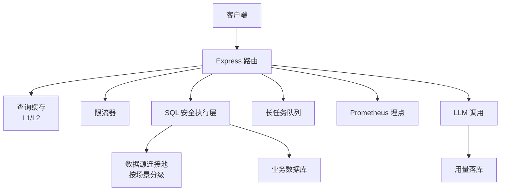
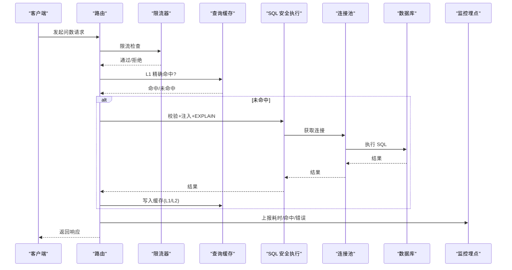
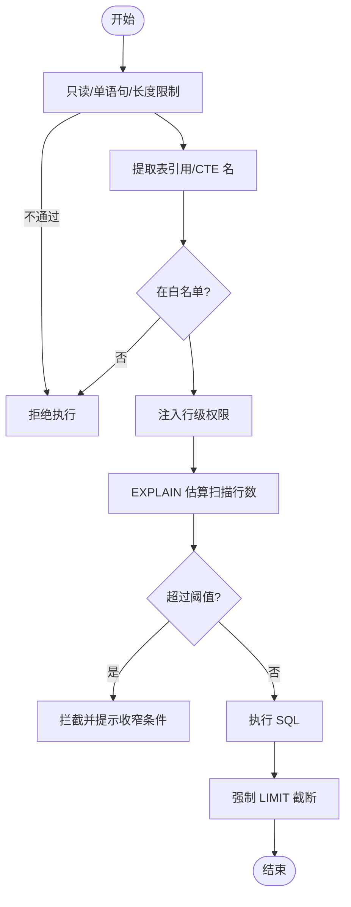
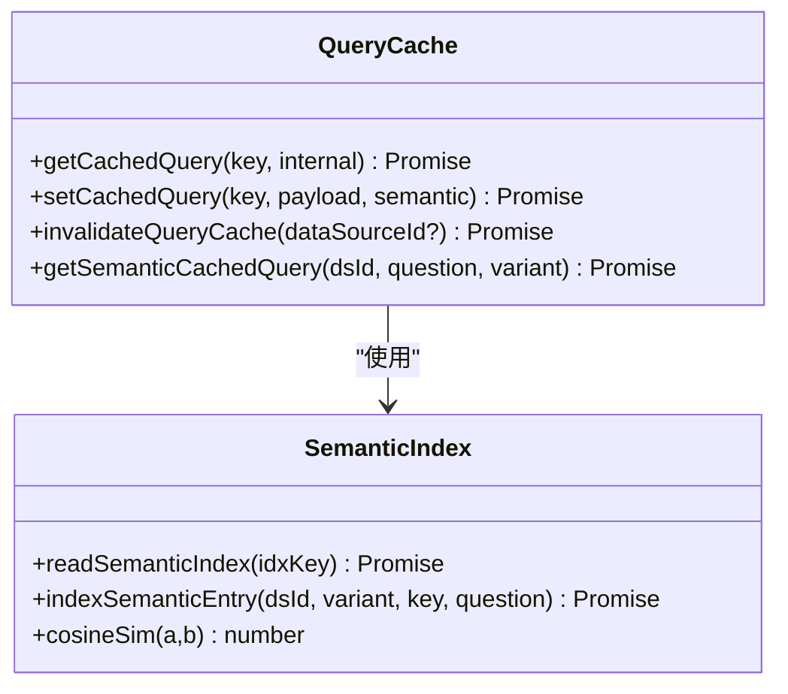
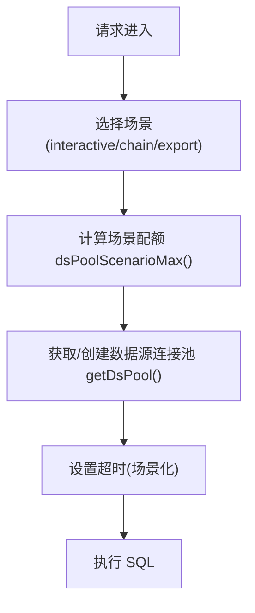
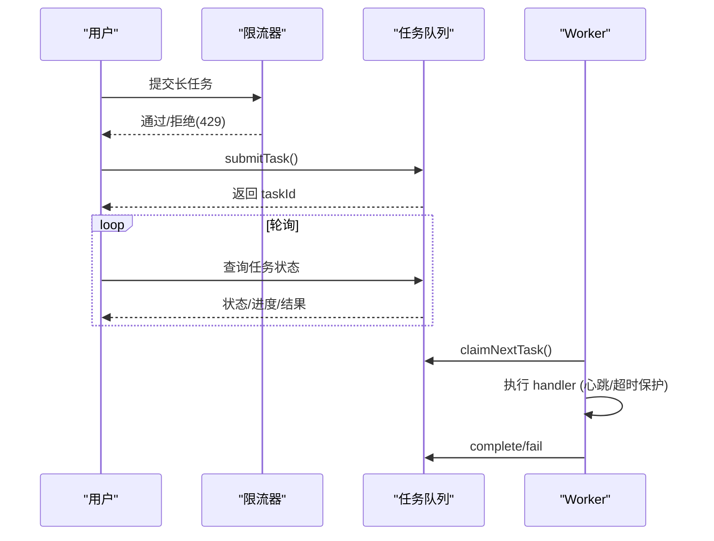
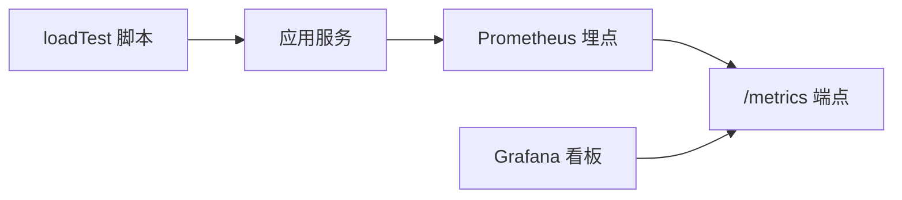
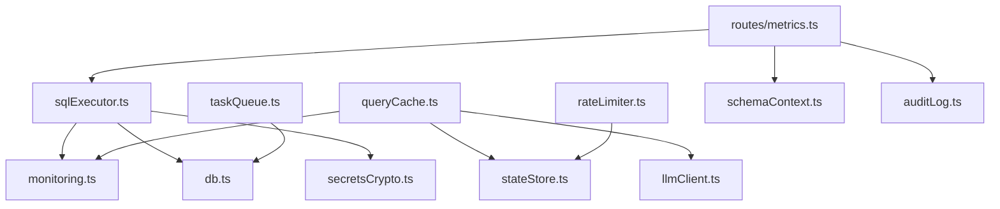

# 性能问题

<cite>
**本文引用的文件**
- [server/infra/monitoring.ts](file://server/infra/monitoring.ts)
- [server/query/sqlExecutor.ts](file://server/query/sqlExecutor.ts)
- [server/query/queryCache.ts](file://server/query/queryCache.ts)
- [server/infra/rateLimiter.ts](file://server/infra/rateLimiter.ts)
- [server/infra/taskQueue.ts](file://server/infra/taskQueue.ts)
- [server/llm/llmUsage.ts](file://server/llm/llmUsage.ts)
- [server/routes/metrics.ts](file://server/routes/metrics.ts)
- [docs/容量规划与压测报告-P1-9.md](file://docs/容量规划与压测报告-P1-9.md)
- [docs/性能专项评估报告-20260902.md](file://docs/性能专项评估报告-20260902.md)
</cite>

## 目录
1. [引言](#引言)
2. [项目结构](#项目结构)
3. [核心组件](#核心组件)
4. [架构总览](#架构总览)
5. [详细组件分析](#详细组件分析)
6. [依赖关系分析](#依赖关系分析)
7. [性能考量](#性能考量)
8. [故障排查指南](#故障排查指南)
9. [结论](#结论)
10. [附录](#附录)

## 引言
本指南面向智能问数据分析系统的性能问题诊断与优化，聚焦以下目标：
- 慢查询识别与分析：SQL 执行计划、EXPLAIN 防线、索引优化建议。
- 内存与资源：Node.js 堆内存分析思路、对象生命周期管理要点。
- 并发处理：连接池配置、限流策略、请求队列管理。
- 缓存策略：查询结果缓存（L1/L2）、LLM 响应缓存、热点数据预加载。
- 监控与基准：Prometheus 指标、Grafana 看板、基准测试方法。
- 瓶颈定位与调优：工具链与最佳实践。

## 项目结构
系统后端以 Express 路由为入口，关键性能相关模块分布如下：
- SQL 安全执行与连接池：server/query/sqlExecutor.ts
- 查询语义缓存（L1 精确 + L2 语义）：server/query/queryCache.ts
- Prometheus 埋点与指标导出：server/infra/monitoring.ts
- 限流器（IP 级滑动窗口/固定分钟窗口）：server/infra/rateLimiter.ts
- 长任务队列（MySQL 持久化 + Worker）：server/infra/taskQueue.ts
- LLM 用量统计与成本分析：server/llm/llmUsage.ts
- 指标层管理与统一查询接口：server/routes/metrics.ts
- 容量规划与压测报告：docs/容量规划与压测报告-P1-9.md
- 性能专项评估报告：docs/性能专项评估报告-20260902.md

图表来源
- [server/query/sqlExecutor.ts:686-726](file://server/query/sqlExecutor.ts#L686-L726)
- [server/query/queryCache.ts:43-90](file://server/query/queryCache.ts#L43-L90)
- [server/infra/monitoring.ts:92-133](file://server/infra/monitoring.ts#L92-L133)
- [server/infra/rateLimiter.ts:14-42](file://server/infra/rateLimiter.ts#L14-L42)
- [server/infra/taskQueue.ts:120-175](file://server/infra/taskQueue.ts#L120-L175)
- [server/llm/llmUsage.ts:26-50](file://server/llm/llmUsage.ts#L26-L50)

章节来源
- [server/query/sqlExecutor.ts:1-110](file://server/query/sqlExecutor.ts#L1-L110)
- [server/query/queryCache.ts:1-90](file://server/query/queryCache.ts#L1-L90)
- [server/infra/monitoring.ts:1-90](file://server/infra/monitoring.ts#L1-L90)
- [server/infra/rateLimiter.ts:1-54](file://server/infra/rateLimiter.ts#L1-L54)
- [server/infra/taskQueue.ts:1-120](file://server/infra/taskQueue.ts#L1-L120)
- [server/llm/llmUsage.ts:1-50](file://server/llm/llmUsage.ts#L1-L50)

## 核心组件
- SQL 安全执行层：白名单校验、AST 复核、行级权限注入、LIMIT 强制、EXPLAIN 防线、场景化超时与连接池配额。
- 查询缓存：L1 精确命中（内存/Redis），L2 语义命中（embedding 相似度阈值），TTL 可配，失效联动。
- 监控埋点：nl2sql 耗时直方图、缓存命中计数、SQL 执行耗时、HTTP 接口耗时、LLM 调用耗时与 token 消耗。
- 限流器：按 IP 的滑动窗口或 Redis 固定分钟窗口，多实例共享计数。
- 长任务队列：MySQL 表持久化，worker 并发上限，心跳与孤儿回收，用户排队上限。
- LLM 用量：每次调用记录 token 与耗时，支持按引擎/模型/用户聚合。

章节来源
- [server/query/sqlExecutor.ts:291-387](file://server/query/sqlExecutor.ts#L291-L387)
- [server/query/sqlExecutor.ts:531-662](file://server/query/sqlExecutor.ts#L531-L662)
- [server/query/queryCache.ts:22-90](file://server/query/queryCache.ts#L22-L90)
- [server/query/queryCache.ts:116-254](file://server/query/queryCache.ts#L116-L254)
- [server/infra/monitoring.ts:21-88](file://server/infra/monitoring.ts#L21-L88)
- [server/infra/rateLimiter.ts:14-42](file://server/infra/rateLimiter.ts#L14-L42)
- [server/infra/taskQueue.ts:65-84](file://server/infra/taskQueue.ts#L65-L84)
- [server/llm/llmUsage.ts:12-50](file://server/llm/llmUsage.ts#L12-L50)

## 架构总览
下图展示一次“问数”请求的关键路径：路由进入 → 限流 → 缓存命中检查 → 安全 SQL 校验与 EXPLAIN 防线 → 连接池执行 → 结果返回；同时埋点上报至 Prometheus。

图表来源
- [server/infra/rateLimiter.ts:14-42](file://server/infra/rateLimiter.ts#L14-L42)
- [server/query/queryCache.ts:43-90](file://server/query/queryCache.ts#L43-L90)
- [server/query/sqlExecutor.ts:734-752](file://server/query/sqlExecutor.ts#L734-L752)
- [server/query/sqlExecutor.ts:686-726](file://server/query/sqlExecutor.ts#L686-L726)
- [server/infra/monitoring.ts:92-133](file://server/infra/monitoring.ts#L92-L133)

## 详细组件分析

### SQL 安全执行与 EXPLAIN 防线
- 安全校验：仅 SELECT、单语句、白名单表、敏感列拒绝、强制 LIMIT。
- AST 二道防线：解析失败时回退正则防线，WITH 场景需 AST 成功。
- 行级权限注入：AST 包裹派生表并递归注入谓词，失败即拒绝。
- EXPLAIN 防线：在真实执行前估算扫描行数，超阈值拦截；兼容 MySQL 与 PG 计划树。
- 场景化超时与连接池配额：interactive/chain/export 三档独立配额与超时；MySQL 注入 MAX_EXECUTION_TIME hint。

图表来源
- [server/query/sqlExecutor.ts:291-387](file://server/query/sqlExecutor.ts#L291-L387)
- [server/query/sqlExecutor.ts:396-489](file://server/query/sqlExecutor.ts#L396-L489)
- [server/query/sqlExecutor.ts:531-662](file://server/query/sqlExecutor.ts#L531-L662)
- [server/query/sqlExecutor.ts:118-153](file://server/query/sqlExecutor.ts#L118-L153)

章节来源
- [server/query/sqlExecutor.ts:291-387](file://server/query/sqlExecutor.ts#L291-L387)
- [server/query/sqlExecutor.ts:396-489](file://server/query/sqlExecutor.ts#L396-L489)
- [server/query/sqlExecutor.ts:531-662](file://server/query/sqlExecutor.ts#L531-L662)
- [server/query/sqlExecutor.ts:686-726](file://server/query/sqlExecutor.ts#L686-L726)

### 查询缓存（L1 精确 + L2 语义）
- L1：归一化问题键（小写、去空白标点），内存 Map 或 Redis 存储，默认 TTL 可配置（环境变量覆盖）。
- L2：embedding 相似度匹配，阈值默认 0.95，命中后读取 L1 载荷并标注 matchedQuestion。
- 失效：数据源结构变更时清理对应前缀键与语义索引。
- 监控：分别统计 L1/L2 命中次数。

图表来源
- [server/query/queryCache.ts:22-90](file://server/query/queryCache.ts#L22-L90)
- [server/query/queryCache.ts:116-254](file://server/query/queryCache.ts#L116-L254)

章节来源
- [server/query/queryCache.ts:22-90](file://server/query/queryCache.ts#L22-L90)
- [server/query/queryCache.ts:116-254](file://server/query/queryCache.ts#L116-L254)

### 连接池与场景化配额
- 公式化容量：DS_POOL_MAX 显式优先，否则基于 EXPECTED_CONCURRENT_USERS 推导并 clamp。
- 场景分级：interactive/chain/export 各自配额与超时；PG 设置 statement_timeout，MySQL 注入 MAX_EXECUTION_TIME。
- 池隔离：按 dataSourceId + scenario 建池；配置变更后按数据源失效全部场景池。

图表来源
- [server/query/sqlExecutor.ts:51-109](file://server/query/sqlExecutor.ts#L51-L109)
- [server/query/sqlExecutor.ts:686-726](file://server/query/sqlExecutor.ts#L686-L726)

章节来源
- [server/query/sqlExecutor.ts:51-109](file://server/query/sqlExecutor.ts#L51-L109)
- [server/query/sqlExecutor.ts:686-726](file://server/query/sqlExecutor.ts#L686-L726)

### 限流与请求队列
- 限流器：内存滑动窗口或 Redis 固定分钟窗口；异常 fail-closed 拒绝。
- 任务队列：提交即返回 taskId，worker 并发上限，用户排队上限，心跳与孤儿回收，失败重试上限。

图表来源
- [server/infra/rateLimiter.ts:14-42](file://server/infra/rateLimiter.ts#L14-L42)
- [server/infra/taskQueue.ts:120-175](file://server/infra/taskQueue.ts#L120-L175)
- [server/infra/taskQueue.ts:277-338](file://server/infra/taskQueue.ts#L277-L338)

章节来源
- [server/infra/rateLimiter.ts:14-42](file://server/infra/rateLimiter.ts#L14-L42)
- [server/infra/taskQueue.ts:120-175](file://server/infra/taskQueue.ts#L120-L175)
- [server/infra/taskQueue.ts:277-338](file://server/infra/taskQueue.ts#L277-L338)

### 监控指标与基准测试
- Prometheus 指标：nl2sql 请求总数/耗时、缓存命中、SQL 执行耗时、HTTP 接口耗时、LLM 调用耗时与 token。
- /metrics 端点：可选鉴权，暴露 metricsRegister 内容。
- 基准测试：loadTest 脚本对 executeSafeSql 全链路施压，统计 P50/P95/P99/max 与吞吐。

图表来源
- [server/infra/monitoring.ts:21-88](file://server/infra/monitoring.ts#L21-L88)
- [server/infra/monitoring.ts:137-153](file://server/infra/monitoring.ts#L137-L153)
- [docs/容量规划与压测报告-P1-9.md:40-67](file://docs/容量规划与压测报告-P1-9.md#L40-L67)

章节来源
- [server/infra/monitoring.ts:21-88](file://server/infra/monitoring.ts#L21-L88)
- [server/infra/monitoring.ts:137-153](file://server/infra/monitoring.ts#L137-L153)
- [docs/容量规划与压测报告-P1-9.md:40-67](file://docs/容量规划与压测报告-P1-9.md#L40-L67)

### LLM 用量与成本观测
- 每次调用记录 engine/model/channel/token/duration/ok，异步落库 llm_usage。
- 提供按引擎/模型/用户聚合接口，支撑成本对比与异常排查。

章节来源
- [server/llm/llmUsage.ts:12-50](file://server/llm/llmUsage.ts#L12-L50)
- [server/llm/llmUsage.ts:64-133](file://server/llm/llmUsage.ts#L64-L133)

## 依赖关系分析
- sqlExecutor 依赖 monitoring（埋点）、secretsCrypto（密码解密）、db（应用库连接）、llmClient（自愈/纠偏）。
- queryCache 依赖 stateStore（内存/Redis）、llmClient（embedding）、monitoring（命中计数）。
- rateLimiter 依赖 stateStore（Redis 模式）。
- taskQueue 依赖 db（MySQL 表）、logger。
- routes/metrics 复用 executeSafeSql、schemaContext、auditLog、userQueryLimit。

图表来源
- [server/query/sqlExecutor.ts:11-21](file://server/query/sqlExecutor.ts#L11-L21)
- [server/query/queryCache.ts:8-11](file://server/query/queryCache.ts#L8-L11)
- [server/infra/rateLimiter.ts:6-8](file://server/infra/rateLimiter.ts#L6-L8)
- [server/infra/taskQueue.ts:16-19](file://server/infra/taskQueue.ts#L16-L19)
- [server/routes/metrics.ts:24-33](file://server/routes/metrics.ts#L24-L33)

章节来源
- [server/query/sqlExecutor.ts:11-21](file://server/query/sqlExecutor.ts#L11-L21)
- [server/query/queryCache.ts:8-11](file://server/query/queryCache.ts#L8-L11)
- [server/infra/rateLimiter.ts:6-8](file://server/infra/rateLimiter.ts#L6-L8)
- [server/infra/taskQueue.ts:16-19](file://server/infra/taskQueue.ts#L16-L19)
- [server/routes/metrics.ts:24-33](file://server/routes/metrics.ts#L24-L33)

## 性能考量
- 慢查询识别
  - 启用 EXPLAIN 防线，观察 sql_explain_guard_total 的 blocked/error/passed 分布。
  - 关注 sql_execute_duration_seconds 的 P95/P99，结合 nl2sql_duration_seconds 定位端到端瓶颈。
  - 针对大扫描：增加时间范围/维度筛选、建立合适索引（如过滤列、JOIN 键、排序/分组列）。
- 索引优化建议
  - 高频 WHERE/JOIN/GROUP BY/ORDER BY 列建立复合索引。
  - 避免选择性差的宽泛过滤导致全表扫描。
  - 对 CTE/子查询中的中间结果，尽量物化或引入临时表（视业务容忍度）。
- 内存与对象生命周期
  - 监控 Node.js 堆增长（process.memoryUsage、外部工具如 node --inspect）。
  - 注意大结果集缓存体积限制（REDIS_MAX_PAYLOAD_BYTES），避免撑爆内存库。
  - 及时释放连接池（配置变更时 invalidateExecutorPool）。
- 并发与限流
  - 合理设置 DS_POOL_MAX 与场景配额，避免导出/链式任务挤占交互资源。
  - 开启限流器防止突发流量打满连接池与 LLM。
  - 长任务走队列，控制 worker 并发与用户排队上限。
- 缓存策略
  - 延长 TTL（QUERY_CACHE_TTL_MINUTES），提升命中率。
  - 放宽 L2 语义阈值需谨慎（默认 0.95 宁缺毋滥）。
  - 确保数据源结构变更时触发失效（已实现多处联动）。
- 监控与基准
  - 部署 Grafana 看板（nl2sql-overview/infra/llm/business）。
  - 定期运行 loadTest 评估不同 pool 配置下的 P50/P95/P99 与吞吐。

章节来源
- [server/query/sqlExecutor.ts:531-662](file://server/query/sqlExecutor.ts#L531-L662)
- [server/query/queryCache.ts:14-20](file://server/query/queryCache.ts#L14-L20)
- [server/query/queryCache.ts:126-129](file://server/query/queryCache.ts#L126-L129)
- [server/infra/monitoring.ts:21-88](file://server/infra/monitoring.ts#L21-L88)
- [docs/容量规划与压测报告-P1-9.md:5-38](file://docs/容量规划与压测报告-P1-9.md#L5-L38)
- [docs/性能专项评估报告-20260902.md:52-153](file://docs/性能专项评估报告-20260902.md#L52-L153)

## 故障排查指南
- 慢查询/大扫描
  - 查看 sql_explain_guard_total 中 blocked 计数上升原因，结合 SQL 文本调整过滤条件或索引。
  - 若 EXPLAIN 失败（error），确认权限/方言差异，必要时放宽阈值或关闭防线（风险自负）。
- 缓存未命中
  - 检查 normalizeQuestion 是否一致（大小写/标点/空白），确认 Redis 可用与 TTL 设置。
  - 若 L2 未命中，考虑适当降低 SEMANTIC_CACHE_THRESHOLD（谨慎评估误命中风险）。
- 连接耗尽/排队
  - 观察 http_request_duration_seconds 与 nl2sql_duration_seconds，结合 dsPoolScenarioMax 调整配额。
  - 检查是否有长任务占用过多连接（export/chain 场景）。
- 限流触发
  - 若频繁 429，检查 RATE_LIMIT_MAX 与客户端重试策略，必要时放宽限流或优化前端退避。
- 任务卡死/孤儿
  - 检查 heartbeat_at 与 recoverOrphanTasks 回收情况，确认 TASK_HEARTBEAT_TIMEOUT_MS 与 TASK_EXEC_TIMEOUT_MS。
- LLM 高延迟/高成本
  - 查看 llm_call_duration_seconds 与 llm_tokens_total，按 model/channel 定位慢调用。
  - 结合性能评估报告，评估小模型路由命中率与复杂度判定。

章节来源
- [server/query/sqlExecutor.ts:531-662](file://server/query/sqlExecutor.ts#L531-L662)
- [server/query/queryCache.ts:22-90](file://server/query/queryCache.ts#L22-L90)
- [server/query/queryCache.ts:126-129](file://server/query/queryCache.ts#L126-L129)
- [server/infra/rateLimiter.ts:14-42](file://server/infra/rateLimiter.ts#L14-L42)
- [server/infra/taskQueue.ts:206-227](file://server/infra/taskQueue.ts#L206-L227)
- [server/llm/llmUsage.ts:64-133](file://server/llm/llmUsage.ts#L64-L133)
- [docs/性能专项评估报告-20260902.md:52-153](file://docs/性能专项评估报告-20260902.md#L52-L153)

## 结论
- 系统已在 SQL 安全执行、EXPLAIN 防线、连接池分级、缓存体系与监控埋点上形成完整闭环。
- 真实性能瓶颈集中在 LLM 推理链路，缓存命中可显著改善重复/相似提问体验。
- 建议优先实施：放宽小模型路由、延长缓存 TTL、完善演示模式缓存、接入真实流式输出、并行化 LLM 调用。
- 生产侧应持续跟踪 Prometheus 指标与 Grafana 看板，定期压测验证容量与稳定性。

## 附录
- 关键环境变量参考
  - DS_POOL_MAX、EXPECTED_CONCURRENT_USERS：数据源连接池容量公式。
  - QUERY_TIMEOUT_INTERACTIVE_MS/CHAIN_MS/EXPORT_MS：场景化执行超时。
  - QUERY_CACHE_TTL_MINUTES：缓存 TTL（分钟）。
  - SEMANTIC_CACHE_THRESHOLD：L2 语义缓存相似度阈值。
  - RATE_LIMIT_MAX：每分钟最大请求数。
  - TASK_WORKER_CONCURRENCY/TASK_QUEUE_USER_MAX/TASK_HEARTBEAT_TIMEOUT_MS/TASK_EXEC_TIMEOUT_MS：任务队列参数。
  - METRICS_TOKEN：/metrics 访问令牌。

章节来源
- [server/query/sqlExecutor.ts:51-109](file://server/query/sqlExecutor.ts#L51-L109)
- [server/query/queryCache.ts:14-20](file://server/query/queryCache.ts#L14-L20)
- [server/query/queryCache.ts:126-129](file://server/query/queryCache.ts#L126-L129)
- [server/infra/rateLimiter.ts:9-12](file://server/infra/rateLimiter.ts#L9-L12)
- [server/infra/taskQueue.ts:65-84](file://server/infra/taskQueue.ts#L65-L84)
- [server/infra/monitoring.ts:137-153](file://server/infra/monitoring.ts#L137-L153)