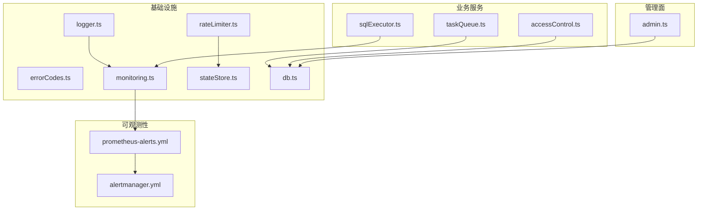
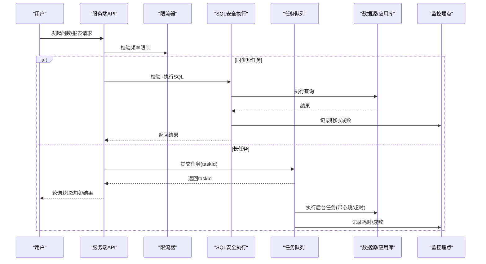
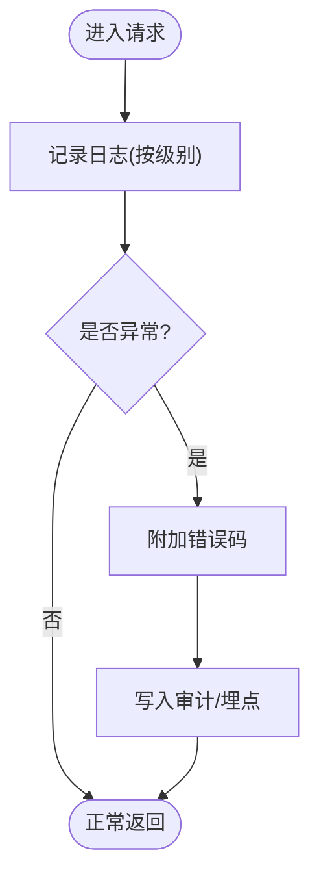
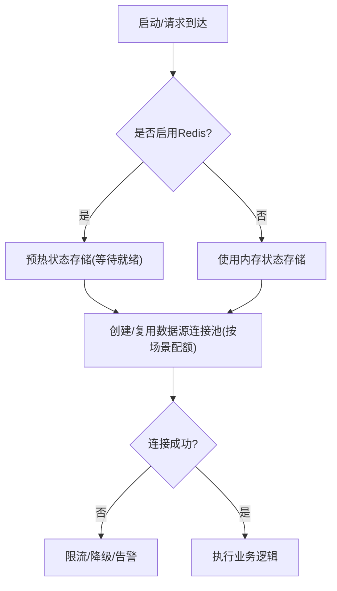
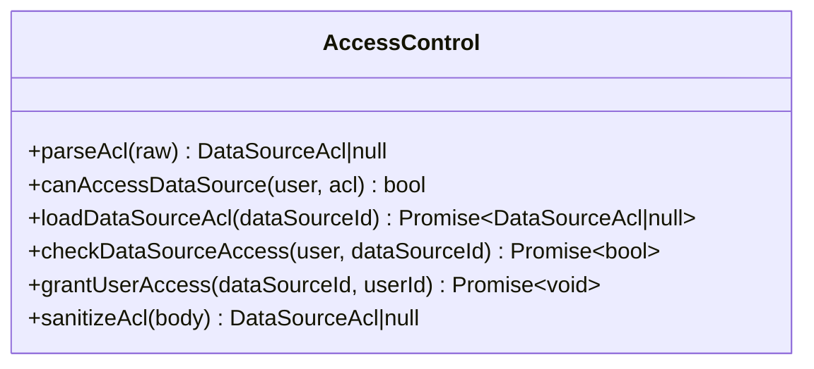
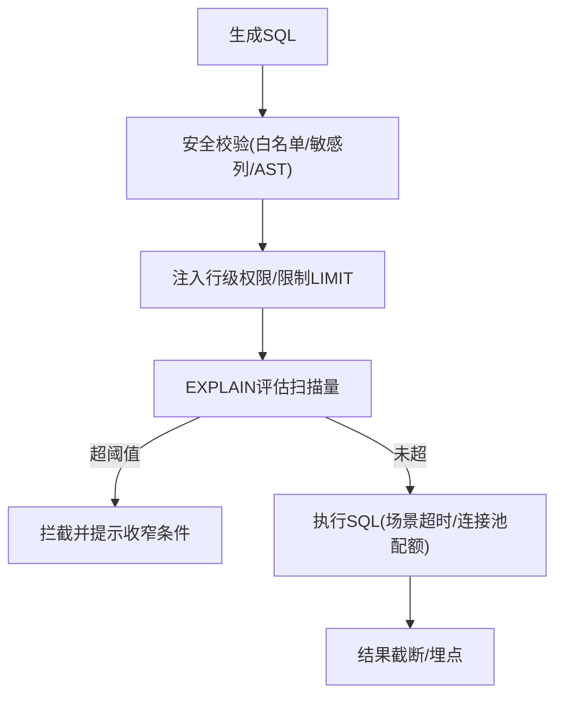
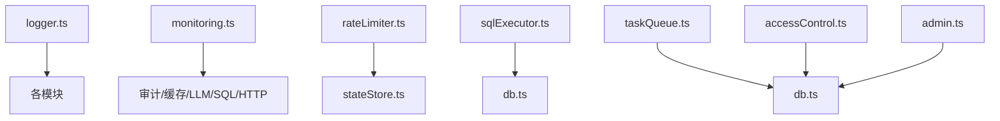

# 故障排查

<cite>
**本文引用的文件**
- [server/infra/logger.ts](file://server/infra/logger.ts)
- [server/infra/errorCodes.ts](file://server/infra/errorCodes.ts)
- [server/infra/monitoring.ts](file://server/infra/monitoring.ts)
- [server/infra/rateLimiter.ts](file://server/infra/rateLimiter.ts)
- [server/infra/taskQueue.ts](file://server/infra/taskQueue.ts)
- [server/infra/db.ts](file://server/infra/db.ts)
- [server/infra/stateStore.ts](file://server/infra/stateStore.ts)
- [server/query/sqlExecutor.ts](file://server/query/sqlExecutor.ts)
- [server/auth/accessControl.ts](file://server/auth/accessControl.ts)
- [server/routes/admin.ts](file://server/routes/admin.ts)
- [deploy/prometheus-alerts.yml](file://deploy/prometheus-alerts.yml)
- [deploy/alertmanager.yml](file://deploy/alertmanager.yml)
</cite>

## 目录
1. [简介](#简介)
2. [项目结构](#项目结构)
3. [核心组件](#核心组件)
4. [架构总览](#架构总览)
5. [详细组件分析](#详细组件分析)
6. [依赖关系分析](#依赖关系分析)
7. [性能注意事项](#性能注意事项)
8. [故障排查指南](#故障排查指南)
9. [结论](#结论)
10. [附录](#附录)

## 简介
本指南面向运维与研发人员，聚焦智能问数据分析系统的常见故障定位与恢复：连接问题、性能问题、内存泄漏、权限错误等；提供日志分析方法、错误追踪、性能分析；说明调试工具使用（浏览器开发者工具、服务器调试、数据库查询分析）；给出慢查询优化、内存优化、并发优化建议；并覆盖系统健康检查、监控告警、自动恢复机制及应急预案。

## 项目结构
系统采用分层架构：
- 基础设施层：日志、错误码、监控埋点、限流、状态存储（内存/Redis）、数据库初始化与连接池
- 业务服务层：鉴权与访问控制、SQL 安全执行层、任务队列（长任务异步化）
- 可观测性：Prometheus 指标、Grafana 仪表盘、Alertmanager 告警
- 管理面：管理员路由（用户与环境配置）

图表来源
- [server/infra/logger.ts:1-41](file://server/infra/logger.ts#L1-L41)
- [server/infra/monitoring.ts:1-153](file://server/infra/monitoring.ts#L1-L153)
- [server/infra/rateLimiter.ts:1-54](file://server/infra/rateLimiter.ts#L1-L54)
- [server/infra/stateStore.ts:1-219](file://server/infra/stateStore.ts#L1-L219)
- [server/infra/db.ts:1-817](file://server/infra/db.ts#L1-L817)
- [server/query/sqlExecutor.ts:1-832](file://server/query/sqlExecutor.ts#L1-L832)
- [server/auth/accessControl.ts:1-108](file://server/auth/accessControl.ts#L1-L108)
- [server/routes/admin.ts:1-295](file://server/routes/admin.ts#L1-L295)
- [deploy/prometheus-alerts.yml:1-144](file://deploy/prometheus-alerts.yml#L1-L144)
- [deploy/alertmanager.yml:1-43](file://deploy/alertmanager.yml#L1-L43)

章节来源
- [server/infra/logger.ts:1-41](file://server/infra/logger.ts#L1-L41)
- [server/infra/monitoring.ts:1-153](file://server/infra/monitoring.ts#L1-L153)
- [server/infra/rateLimiter.ts:1-54](file://server/infra/rateLimiter.ts#L1-L54)
- [server/infra/stateStore.ts:1-219](file://server/infra/stateStore.ts#L1-L219)
- [server/infra/db.ts:1-817](file://server/infra/db.ts#L1-L817)
- [server/query/sqlExecutor.ts:1-832](file://server/query/sqlExecutor.ts#L1-L832)
- [server/auth/accessControl.ts:1-108](file://server/auth/accessControl.ts#L1-L108)
- [server/routes/admin.ts:1-295](file://server/routes/admin.ts#L1-L295)
- [deploy/prometheus-alerts.yml:1-144](file://deploy/prometheus-alerts.yml#L1-L144)
- [deploy/alertmanager.yml:1-43](file://deploy/alertmanager.yml#L1-L43)

## 核心组件
- 统一日志：按级别输出，测试环境降噪，便于快速定位问题
- 统一错误码：前端可按 code 分支处理，避免解析中文文案
- 监控埋点：对审计、缓存命中、LLM 调用、SQL 执行、HTTP 接口耗时进行旁路统计，fail-open
- 限流器：支持内存滑动窗口与 Redis 固定分钟窗口，多实例共享计数
- 状态存储：抽象 Memory/Redis 两种实现，提供原子计数、分布式锁、预热能力
- SQL 安全执行：白名单、敏感列拒绝、AST 复核、行级权限注入、EXPLAIN 防线、场景化超时与连接池配额
- 任务队列：MySQL 持久化 + 内置 worker，心跳与孤儿回收，重试上限，超时保护
- 数据源访问控制：部门/用户 ACL，审批并入个人授权
- 管理员路由：用户管理与环境配置更新（含审计）

章节来源
- [server/infra/logger.ts:1-41](file://server/infra/logger.ts#L1-L41)
- [server/infra/errorCodes.ts:1-36](file://server/infra/errorCodes.ts#L1-L36)
- [server/infra/monitoring.ts:1-153](file://server/infra/monitoring.ts#L1-L153)
- [server/infra/rateLimiter.ts:1-54](file://server/infra/rateLimiter.ts#L1-L54)
- [server/infra/stateStore.ts:1-219](file://server/infra/stateStore.ts#L1-L219)
- [server/query/sqlExecutor.ts:1-832](file://server/query/sqlExecutor.ts#L1-L832)
- [server/infra/taskQueue.ts:1-347](file://server/infra/taskQueue.ts#L1-L347)
- [server/auth/accessControl.ts:1-108](file://server/auth/accessControl.ts#L1-L108)
- [server/routes/admin.ts:1-295](file://server/routes/admin.ts#L1-L295)

## 架构总览
系统通过“安全执行层”和“任务队列”将高风险或长耗时操作与交互链路解耦；监控与告警贯穿全链路，确保问题早发现早处置。

图表来源
- [server/infra/rateLimiter.ts:1-54](file://server/infra/rateLimiter.ts#L1-L54)
- [server/query/sqlExecutor.ts:1-832](file://server/query/sqlExecutor.ts#L1-L832)
- [server/infra/taskQueue.ts:1-347](file://server/infra/taskQueue.ts#L1-L347)
- [server/infra/monitoring.ts:1-153](file://server/infra/monitoring.ts#L1-L153)

## 详细组件分析

### 日志与错误追踪
- 日志级别由环境变量控制，测试环境仅保留 error，减少噪音
- 所有错误响应附带统一错误码，便于前端精准降级与提示
- 审计落账与监控埋点在关键路径旁路记录，不影响主流程

图表来源
- [server/infra/logger.ts:1-41](file://server/infra/logger.ts#L1-L41)
- [server/infra/errorCodes.ts:1-36](file://server/infra/errorCodes.ts#L1-L36)
- [server/infra/monitoring.ts:1-153](file://server/infra/monitoring.ts#L1-L153)

章节来源
- [server/infra/logger.ts:1-41](file://server/infra/logger.ts#L1-L41)
- [server/infra/errorCodes.ts:1-36](file://server/infra/errorCodes.ts#L1-L36)
- [server/infra/monitoring.ts:1-153](file://server/infra/monitoring.ts#L1-L153)

### 连接问题诊断（数据库/外部依赖）
- 应用库连接池容量公式化，默认基于预期并发推导，支持显式配置
- 数据源连接池按场景分级（交互/分析链/导出），独立配额与超时
- Redis 状态存储支持预热，启动时等待就绪，降低冷启动失败率
- 限流在 Redis 模式下 fail-closed（连接异常直接拒绝），内存模式定期清理过期条目

图表来源
- [server/infra/db.ts:1-817](file://server/infra/db.ts#L1-L817)
- [server/query/sqlExecutor.ts:1-832](file://server/query/sqlExecutor.ts#L1-L832)
- [server/infra/stateStore.ts:1-219](file://server/infra/stateStore.ts#L1-L219)
- [server/infra/rateLimiter.ts:1-54](file://server/infra/rateLimiter.ts#L1-L54)

章节来源
- [server/infra/db.ts:1-817](file://server/infra/db.ts#L1-L817)
- [server/query/sqlExecutor.ts:1-832](file://server/query/sqlExecutor.ts#L1-L832)
- [server/infra/stateStore.ts:1-219](file://server/infra/stateStore.ts#L1-L219)
- [server/infra/rateLimiter.ts:1-54](file://server/infra/rateLimiter.ts#L1-L54)

### 权限错误与访问控制
- 数据源 ACL 支持部门与用户维度，ADMIN 始终放行
- 审批通过后自动并入个人授权，幂等安全
- 管理员路由保护自身账号不被降级/删除，保证至少一个活跃管理员

图表来源
- [server/auth/accessControl.ts:1-108](file://server/auth/accessControl.ts#L1-L108)
- [server/routes/admin.ts:1-295](file://server/routes/admin.ts#L1-L295)

章节来源
- [server/auth/accessControl.ts:1-108](file://server/auth/accessControl.ts#L1-L108)
- [server/routes/admin.ts:1-295](file://server/routes/admin.ts#L1-L295)

### 性能瓶颈定位与优化（慢查询/内存/并发）
- EXPLAIN 防线：预估扫描行数超阈值拦截，防拖垮数据源
- 场景化超时与连接池配额：交互/分析链/导出独立限额，避免互相挤占
- MAX_EXECUTION_TIME 注入：MySQL SELECT-only 语句强制执行时限
- 结果集截断：防止大结果导致 OOM
- 任务队列隔离：长任务走异步队列，worker 并发上限与心跳/超时保护

图表来源
- [server/query/sqlExecutor.ts:1-832](file://server/query/sqlExecutor.ts#L1-L832)
- [server/infra/taskQueue.ts:1-347](file://server/infra/taskQueue.ts#L1-L347)

章节来源
- [server/query/sqlExecutor.ts:1-832](file://server/query/sqlExecutor.ts#L1-L832)
- [server/infra/taskQueue.ts:1-347](file://server/infra/taskQueue.ts#L1-L347)

### 系统健康检查、监控告警、自动恢复
- Prometheus 指标：请求总数/耗时、缓存命中、LLM 调用耗时/token、SQL 执行耗时、HTTP 接口耗时
- 告警规则：应用不可达、MySQL/Redis 不可达、成功率低、P95 延迟高、缓存命中率低、FALLBACK 率高、内存高、磁盘空间低、监控栈自监控
- Alertmanager：抑制应用宕机时的下游业务告警，避免风暴
- 任务队列：心跳超时回收孤儿任务，自动回队重试或标记失败

图表来源
- [server/infra/monitoring.ts:1-153](file://server/infra/monitoring.ts#L1-L153)
- [deploy/prometheus-alerts.yml:1-144](file://deploy/prometheus-alerts.yml#L1-L144)
- [deploy/alertmanager.yml:1-43](file://deploy/alertmanager.yml#L1-L43)

章节来源
- [server/infra/monitoring.ts:1-153](file://server/infra/monitoring.ts#L1-L153)
- [deploy/prometheus-alerts.yml:1-144](file://deploy/prometheus-alerts.yml#L1-L144)
- [deploy/alertmanager.yml:1-43](file://deploy/alertmanager.yml#L1-L43)

## 依赖关系分析
- 日志模块被各层广泛引用，作为统一出口
- 监控埋点以旁路方式嵌入审计、缓存、LLM、SQL 执行等关键点
- 限流器依赖状态存储（内存/Redis），保障多实例一致性
- SQL 执行层依赖应用库连接池与数据源连接池，受场景化配额约束
- 任务队列依赖应用库表结构与索引，worker 周期巡检孤儿任务
- 访问控制依赖应用库 ACL 配置与管理员路由

图表来源
- [server/infra/logger.ts:1-41](file://server/infra/logger.ts#L1-L41)
- [server/infra/monitoring.ts:1-153](file://server/infra/monitoring.ts#L1-L153)
- [server/infra/rateLimiter.ts:1-54](file://server/infra/rateLimiter.ts#L1-L54)
- [server/infra/stateStore.ts:1-219](file://server/infra/stateStore.ts#L1-L219)
- [server/query/sqlExecutor.ts:1-832](file://server/query/sqlExecutor.ts#L1-L832)
- [server/infra/db.ts:1-817](file://server/infra/db.ts#L1-L817)
- [server/infra/taskQueue.ts:1-347](file://server/infra/taskQueue.ts#L1-L347)
- [server/auth/accessControl.ts:1-108](file://server/auth/accessControl.ts#L1-L108)
- [server/routes/admin.ts:1-295](file://server/routes/admin.ts#L1-L295)

章节来源
- [server/infra/logger.ts:1-41](file://server/infra/logger.ts#L1-L41)
- [server/infra/monitoring.ts:1-153](file://server/infra/monitoring.ts#L1-L153)
- [server/infra/rateLimiter.ts:1-54](file://server/infra/rateLimiter.ts#L1-L54)
- [server/infra/stateStore.ts:1-219](file://server/infra/stateStore.ts#L1-L219)
- [server/query/sqlExecutor.ts:1-832](file://server/query/sqlExecutor.ts#L1-L832)
- [server/infra/db.ts:1-817](file://server/infra/db.ts#L1-L817)
- [server/infra/taskQueue.ts:1-347](file://server/infra/taskQueue.ts#L1-L347)
- [server/auth/accessControl.ts:1-108](file://server/auth/accessControl.ts#L1-L108)
- [server/routes/admin.ts:1-295](file://server/routes/admin.ts#L1-L295)

## 性能注意事项
- 连接池与超时：按场景设置连接池配额与执行超时，避免长任务阻塞交互
- 慢查询防护：EXPLAIN 防线拦截大扫描；MAX_EXECUTION_TIME 兜底
- 结果集大小：强制 LIMIT 与截断，防止 OOM
- 缓存命中：关注缓存命中率告警，联动数据源变更失效与 TTL 配置
- 资源水位：内存与磁盘告警阈值已配置，需结合 Grafana 观察趋势
- 任务队列：合理设置 worker 并发与心跳超时，避免孤儿任务堆积

[本节为通用指导，不直接分析具体文件]

## 故障排查指南

### 常见问题与诊断方法
- 连接问题
  - 现象：登录失败、查询无响应、限流频繁
  - 排查要点：检查 MySQL/Redis 可达性、连接池容量与超时、状态存储预热是否完成
  - 参考：应用库连接池容量公式、数据源连接池场景化配额、Redis 预热
- 性能问题
  - 现象：P95 时延升高、成功率下降、缓存命中率低
  - 排查要点：查看 nl2sql_duration_seconds、llm_call_duration_seconds、sql_execute_duration_seconds、nl2sql_cache_hits_total
  - 参考：监控埋点与告警规则
- 内存泄漏
  - 现象：进程常驻内存持续上升
  - 排查要点：关注 process_resident_memory_bytes 告警，检查 embedding 缓存、审计缓冲、大结果集驻留
  - 参考：内存告警规则
- 权限错误
  - 现象：无法访问某数据源、审批后仍受限
  - 排查要点：检查 ACL 配置、审批并入个人授权、管理员路由保护策略
  - 参考：访问控制模块与管理员路由

章节来源
- [server/infra/db.ts:1-817](file://server/infra/db.ts#L1-L817)
- [server/query/sqlExecutor.ts:1-832](file://server/query/sqlExecutor.ts#L1-L832)
- [server/infra/stateStore.ts:1-219](file://server/infra/stateStore.ts#L1-L219)
- [server/infra/monitoring.ts:1-153](file://server/infra/monitoring.ts#L1-L153)
- [deploy/prometheus-alerts.yml:1-144](file://deploy/prometheus-alerts.yml#L1-L144)
- [server/auth/accessControl.ts:1-108](file://server/auth/accessControl.ts#L1-L108)
- [server/routes/admin.ts:1-295](file://server/routes/admin.ts#L1-L295)

### 日志分析方法
- 日志级别：通过环境变量调整，生产建议 info/warn/error；测试环境仅 error
- 错误追踪：结合审计落账与 trace_id，串联 LLM 调用、SQL 执行、缓存命中
- 性能分析：利用 histogram 分桶观察耗时分布，定位热点端点与模型

章节来源
- [server/infra/logger.ts:1-41](file://server/infra/logger.ts#L1-L41)
- [server/infra/monitoring.ts:1-153](file://server/infra/monitoring.ts#L1-L153)

### 调试工具使用
- 浏览器开发者工具
  - 观察 SSE/轮询任务进度、错误码与响应体
  - 检查网络耗时与重传情况
- 服务器调试
  - 查看日志级别与输出，定位异常堆栈
  - 检查 /metrics 端点暴露的指标（可选 token 保护）
- 数据库查询分析
  - 使用 EXPLAIN 验证执行计划，关注扫描行数与过滤条件
  - 核对白名单与敏感列配置，确认行级权限注入生效

章节来源
- [server/query/sqlExecutor.ts:1-832](file://server/query/sqlExecutor.ts#L1-L832)
- [server/infra/monitoring.ts:1-153](file://server/infra/monitoring.ts#L1-L153)

### 性能瓶颈定位与优化建议
- 慢查询优化
  - 增加时间范围/部门/维度筛选，降低扫描行数
  - 利用 EXPLAIN 防线提示，必要时优化索引或改写 SQL
- 内存使用优化
  - 控制结果集大小，避免大对象驻留
  - 关注 embedding 缓存与审计缓冲增长
- 并发处理优化
  - 调整场景化连接池配额与超时，避免长任务阻塞交互
  - 合理设置任务队列 worker 并发与心跳超时

章节来源
- [server/query/sqlExecutor.ts:1-832](file://server/query/sqlExecutor.ts#L1-L832)
- [server/infra/taskQueue.ts:1-347](file://server/infra/taskQueue.ts#L1-L347)

### 系统健康检查、监控告警、自动恢复
- 健康检查
  - 应用进程可达性、MySQL/Redis 可达性、/metrics 抓取耗时
- 监控告警
  - 成功率、P95 时延、缓存命中率、FALLBACK 率、内存与磁盘水位
- 自动恢复
  - 任务队列孤儿回收与重试上限
  - 限流在 Redis 异常时 fail-closed，保护后端

章节来源
- [deploy/prometheus-alerts.yml:1-144](file://deploy/prometheus-alerts.yml#L1-L144)
- [deploy/alertmanager.yml:1-43](file://deploy/alertmanager.yml#L1-L43)
- [server/infra/taskQueue.ts:1-347](file://server/infra/taskQueue.ts#L1-L347)
- [server/infra/rateLimiter.ts:1-54](file://server/infra/rateLimiter.ts#L1-L54)

### 故障处理流程、应急预案、恢复策略
- 故障处理流程
  - 发现：监控告警或用户反馈
  - 定位：日志/指标/审计/trace 关联分析
  - 处置：限流/降级/隔离/修复配置
  - 验证：指标回归与灰度发布
- 应急预案
  - 应用不可达：重启实例、扩容、切换备用数据源
  - 数据库不可达：切换只读副本、临时关闭非核心功能
  - Redis 不可达：回退内存状态存储，限流更严格
- 恢复策略
  - 任务队列：心跳超时回收、重试上限、失败标记
  - 连接池：动态调整配额与超时，避免雪崩

[本节为通用流程，不直接分析具体文件]

## 结论
通过统一的日志、错误码、监控埋点与告警体系，结合 SQL 安全执行层与任务队列的隔离设计，系统具备较强的可观测性与自愈能力。运维与研发应重点关注连接稳定性、慢查询防护、内存水位与缓存命中率，配合监控告警与自动恢复机制，快速定位并解决故障。

[本节为总结，不直接分析具体文件]

## 附录
- 关键环境变量参考
  - LOG_LEVEL：日志级别
  - APP_POOL_MAX / EXPECTED_CONCURRENT_USERS：应用库连接池容量
  - DS_POOL_MAX / DS_POOL_INTERACTIVE / DS_POOL_CHAIN / DS_POOL_EXPORT：数据源连接池配额
  - QUERY_TIMEOUT_INTERACTIVE_MS / QUERY_TIMEOUT_CHAIN_MS / QUERY_TIMEOUT_EXPORT_MS：场景化超时
  - SQL_EXPLAIN_MAX_ROWS：EXPLAIN 防线阈值
  - REDIS_URL：启用 Redis 状态存储
  - RATE_LIMIT_MAX：限流阈值
  - TASK_WORKER_CONCURRENCY / TASK_QUEUE_USER_MAX / TASK_HEARTBEAT_TIMEOUT_MS / TASK_EXEC_TIMEOUT_MS：任务队列参数
  - METRICS_TOKEN：/metrics 访问令牌

[本节为通用信息，不直接分析具体文件]