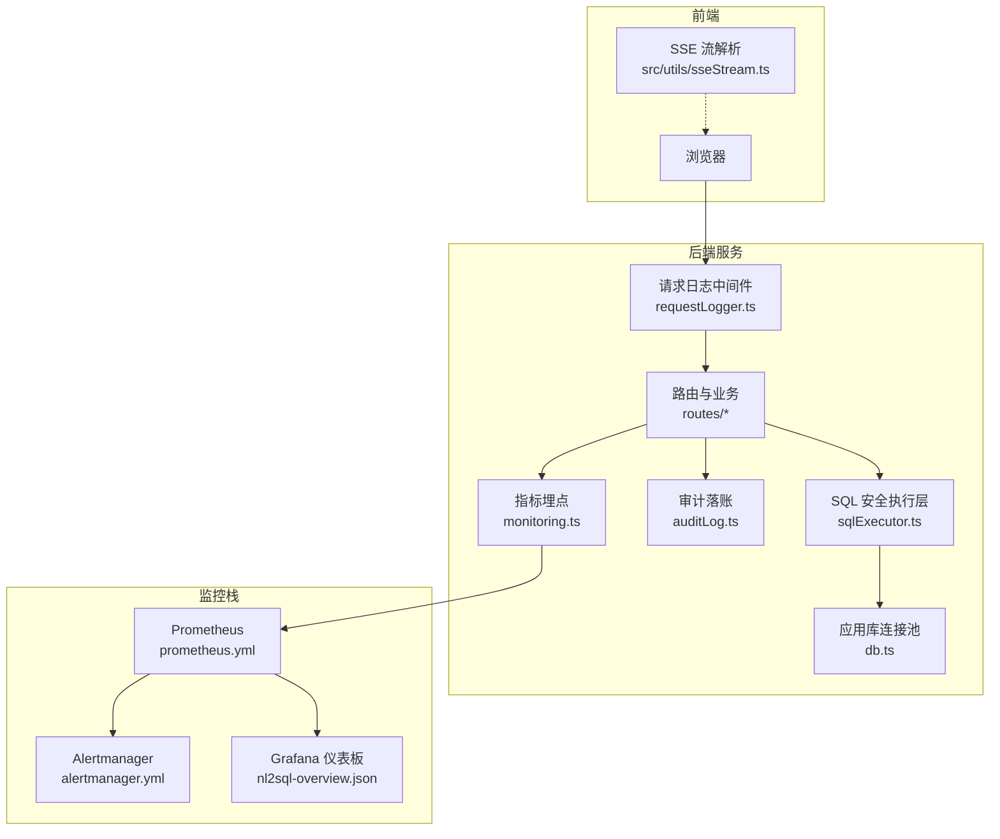
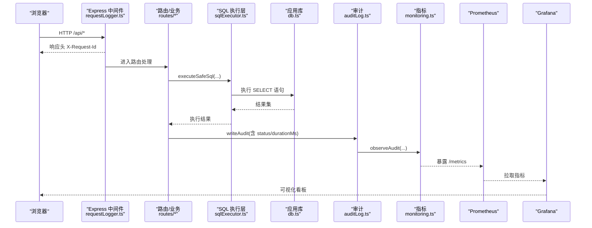
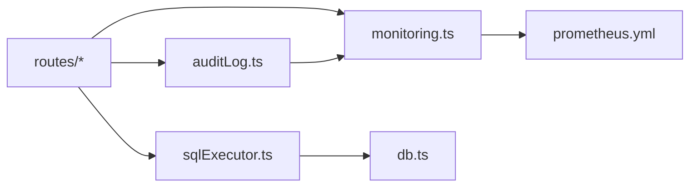

# 调试工具

<cite>
**本文引用的文件**
- [server/infra/logger.ts](file://server/infra/logger.ts)
- [server/infra/requestLogger.ts](file://server/infra/requestLogger.ts)
- [server/infra/monitoring.ts](file://server/infra/monitoring.ts)
- [deploy/prometheus.yml](file://deploy/prometheus.yml)
- [deploy/alertmanager.yml](file://deploy/alertmanager.yml)
- [deploy/grafana/dashboards/nl2sql-overview.json](file://deploy/grafana/dashboards/nl2sql-overview.json)
- [server/query/sqlExecutor.ts](file://server/query/sqlExecutor.ts)
- [server/infra/db.ts](file://server/infra/db.ts)
- [server/routes/metrics.ts](file://server/routes/metrics.ts)
- [server/infra/errorCodes.ts](file://server/infra/errorCodes.ts)
- [server/infra/auditLog.ts](file://server/infra/auditLog.ts)
- [src/utils/sseStream.ts](file://src/utils/sseStream.ts)
- [src/components/admin/MetricsPanel.tsx](file://src/components/admin/MetricsPanel.tsx)
- [.github/workflows/ci.yml](file://.github/workflows/ci.yml)
</cite>

## 目录
1. [简介](#简介)
2. [项目结构](#项目结构)
3. [核心组件](#核心组件)
4. [架构总览](#架构总览)
5. [详细组件分析](#详细组件分析)
6. [依赖关系分析](#依赖关系分析)
7. [性能考量](#性能考量)
8. [故障排查指南](#故障排查指南)
9. [结论](#结论)
10. [附录](#附录)

## 简介
本指南面向“智能问数据分析系统”的调试与可观测性实践，覆盖日志、浏览器开发者工具、服务器端调试、数据库查询分析、监控（Prometheus/Grafana/告警）以及 CI/CD 流水线中的调试与测试。目标是帮助你在本地与生产环境中快速定位问题、评估性能并保障稳定性。

## 项目结构
系统在后端提供统一的日志出口、请求级上下文追踪、指标埋点与审计落库；在部署层集成 Prometheus、Alertmanager 与 Grafana；在前端通过 SSE 流式事件推进用户可见状态；CI 流程包含类型检查、Lint、单测与评测集门禁。

图表来源
- [server/infra/requestLogger.ts:1-36](file://server/infra/requestLogger.ts#L1-L36)
- [server/query/sqlExecutor.ts:733-800](file://server/query/sqlExecutor.ts#L733-L800)
- [server/infra/db.ts:47-70](file://server/infra/db.ts#L47-L70)
- [server/infra/auditLog.ts:38-61](file://server/infra/auditLog.ts#L38-L61)
- [server/infra/monitoring.ts:92-152](file://server/infra/monitoring.ts#L92-L152)
- [deploy/prometheus.yml:1-57](file://deploy/prometheus.yml#L1-L57)
- [deploy/alertmanager.yml:1-43](file://deploy/alertmanager.yml#L1-L43)
- [deploy/grafana/dashboards/nl2sql-overview.json:1-192](file://deploy/grafana/dashboards/nl2sql-overview.json#L1-L192)

章节来源
- [server/infra/requestLogger.ts:1-36](file://server/infra/requestLogger.ts#L1-L36)
- [server/infra/monitoring.ts:1-153](file://server/infra/monitoring.ts#L1-L153)
- [deploy/prometheus.yml:1-57](file://deploy/prometheus.yml#L1-L57)
- [deploy/alertmanager.yml:1-43](file://deploy/alertmanager.yml#L1-L43)
- [deploy/grafana/dashboards/nl2sql-overview.json:1-192](file://deploy/grafana/dashboards/nl2sql-overview.json#L1-L192)

## 核心组件
- 统一日志：集中输出 debug/info/warn/error，支持按环境变量控制级别，测试环境静默非 error 日志。
- 请求级追踪：为每个 /api 请求生成 requestId，并在响应头回传，便于前后端关联。
- 指标埋点：对问数端到端耗时、缓存命中、LLM 调用、SQL 执行、HTTP 接口等关键路径进行旁路埋点，fail-open 不阻塞业务。
- SQL 安全执行：白名单表、敏感列拒绝、AST 复核、行级权限注入、EXPLAIN 防线、场景化超时与连接池配额。
- 审计落账：全链路成功/失败/拒绝/降级等状态持久化，同时触发指标埋点。
- 监控与告警：Prometheus 抓取、Alertmanager 通知、Grafana 仪表盘展示。
- 前端 SSE：阶段进度、推导步骤、流式内容、终态事件与断线续传能力。
- CI/CD：类型检查、Lint、OpenAPI 一致性校验、进程内状态巡检、Vitest 单测、评测集门禁。

章节来源
- [server/infra/logger.ts:1-41](file://server/infra/logger.ts#L1-L41)
- [server/infra/requestLogger.ts:1-36](file://server/infra/requestLogger.ts#L1-L36)
- [server/infra/monitoring.ts:1-153](file://server/infra/monitoring.ts#L1-L153)
- [server/query/sqlExecutor.ts:291-387](file://server/query/sqlExecutor.ts#L291-L387)
- [server/infra/auditLog.ts:1-62](file://server/infra/auditLog.ts#L1-L62)
- [src/utils/sseStream.ts:1-116](file://src/utils/sseStream.ts#L1-L116)
- [.github/workflows/ci.yml:1-67](file://.github/workflows/ci.yml#L1-L67)

## 架构总览
下图展示了从浏览器到后端、再到监控栈的关键交互路径，包括日志、审计、指标与 SQL 执行的安全边界。

图表来源
- [server/infra/requestLogger.ts:19-35](file://server/infra/requestLogger.ts#L19-L35)
- [server/query/sqlExecutor.ts:733-800](file://server/query/sqlExecutor.ts#L733-L800)
- [server/infra/db.ts:47-70](file://server/infra/db.ts#L47-L70)
- [server/infra/auditLog.ts:38-61](file://server/infra/auditLog.ts#L38-L61)
- [server/infra/monitoring.ts:92-152](file://server/infra/monitoring.ts#L92-L152)
- [deploy/prometheus.yml:16-39](file://deploy/prometheus.yml#L16-L39)
- [deploy/grafana/dashboards/nl2sql-overview.json:10-191](file://deploy/grafana/dashboards/nl2sql-overview.json#L10-L191)

## 详细组件分析

### 日志分析方法
- 日志级别配置
  - 通过环境变量 LOG_LEVEL 控制输出级别（debug/info/warn/error），默认 info；error 始终输出；测试环境仅保留 error。
  - 建议：开发使用 debug，生产使用 info 或 warn。
- 结构化日志格式
  - 所有服务端运行时代码经 logger 输出，未来可替换为 pino 等结构化设施而不改动业务代码。
- 错误追踪与上下文
  - 请求级 requestId：中间件为每个 /api 请求生成唯一 ID，并通过响应头 X-Request-Id 返回，便于前端报错时关联后端日志。
  - 审计落账：writeAudit 记录 endpoint、status、durationMs、executedSql、rowCount 等，用于事后回溯。
- 实用技巧
  - 结合 X-Request-Id 过滤日志，快速定位一次请求的全链路日志。
  - 关注 audit 表中 DENIED_* 状态，定位权限、限流、开关等拒绝原因。

章节来源
- [server/infra/logger.ts:1-41](file://server/infra/logger.ts#L1-L41)
- [server/infra/requestLogger.ts:1-36](file://server/infra/requestLogger.ts#L1-L36)
- [server/infra/auditLog.ts:1-62](file://server/infra/auditLog.ts#L1-L62)

### 浏览器开发者工具使用
- 网络请求调试
  - 查看 /api/* 请求的 X-Request-Id，配合后端日志定位。
  - 观察 SSE 流式事件（stage/trace/chunk/done/clarify/refuse/error），确认阶段推进与终端状态。
- 前端状态查看
  - 通过控制台输出与 UI 状态变化，验证 SSE 解析器是否正确累积内容与阶段标签。
- 性能分析
  - 使用 Performance 面板录制页面交互，识别慢渲染或长任务；结合 Network 面板查看大响应体与重复请求。

章节来源
- [src/utils/sseStream.ts:1-116](file://src/utils/sseStream.ts#L1-L116)
- [server/infra/requestLogger.ts:19-35](file://server/infra/requestLogger.ts#L19-L35)

### 服务器端调试技巧
- Node.js 调试器
  - 使用 IDE 或命令行附加调试器，设置断点在路由与 SQL 执行入口，逐步跟踪参数与返回值。
- 进程监控
  - 关注 /metrics 暴露的指标，结合系统资源监控（node-exporter）判断 CPU/内存/IO 瓶颈。
- 内存分析
  - 定期导出堆快照，结合指标中 llm_call_duration_seconds、http_request_duration_seconds 等定位异常增长。

章节来源
- [server/infra/monitoring.ts:135-152](file://server/infra/monitoring.ts#L135-L152)
- [deploy/prometheus.yml:16-39](file://deploy/prometheus.yml#L16-L39)

### 数据库查询分析工具
- 慢查询日志
  - 通过 sql_execute_duration_seconds 直方图观察 SQL 执行耗时分布；结合 EXPLAIN_GUARD 拦截统计定位高风险查询。
- 执行计划分析
  - 利用 EXPLAIN 防线（MySQL/PG）预估扫描行数，超过阈值自动拦截并给出提示；必要时手动执行 EXPLAIN 分析计划树。
- 索引优化建议
  - 若频繁出现大范围扫描被拦截，优先增加时间范围、部门或维度筛选；针对热点查询补充合适索引以降低扫描行数。
- 安全与性能
  - 强制 LIMIT、SELECT-only、AST 复核、行级权限注入、场景化超时与连接池配额，确保查询既安全又可控。

章节来源
- [server/query/sqlExecutor.ts:531-662](file://server/query/sqlExecutor.ts#L531-L662)
- [server/query/sqlExecutor.ts:291-387](file://server/query/sqlExecutor.ts#L291-L387)
- [server/query/sqlExecutor.ts:733-800](file://server/query/sqlExecutor.ts#L733-L800)

### 监控系统使用方法
- Prometheus 指标
  - nl2sql_requests_total：问数请求总数（按 status/endpoint）。
  - nl2sql_duration_seconds：端到端耗时直方图（按 status）。
  - nl2sql_cache_hits_total：缓存命中次数（按 layer=l1/l2）。
  - llm_call_duration_seconds：LLM 调用耗时（按 channel/engine/model/ok）。
  - sql_execute_duration_seconds：SQL 执行耗时（按 result=ok/error）。
  - http_request_duration_seconds：HTTP /api/* 接口耗时（按 method/route/status）。
- Grafana 仪表板
  - 总览面板包含成功率、缓存命中率、端到端 P95 时延、请求速率、状态分布、LLM 调用 P95、缓存分层、SQL vs LLM 时延对比等。
- 告警规则配置
  - Alertmanager 接收 Webhook 通知，支持 group_by、repeat_interval 等；抑制规则避免应用宕机引发的下游告警风暴。
  - 多实例抓取：通过 instance label 区分不同实例，仪表盘 sum() 聚合口径不变。

章节来源
- [server/infra/monitoring.ts:19-88](file://server/infra/monitoring.ts#L19-L88)
- [deploy/grafana/dashboards/nl2sql-overview.json:10-191](file://deploy/grafana/dashboards/nl2sql-overview.json#L10-L191)
- [deploy/prometheus.yml:16-57](file://deploy/prometheus.yml#L16-L57)
- [deploy/alertmanager.yml:1-43](file://deploy/alertmanager.yml#L1-L43)

### CI/CD 流水线中的调试与测试
- 质量门禁
  - TypeScript 类型检查（前端+server）、ESLint、OpenAPI 同步校验、进程内状态巡检、Vitest 全量单测。
- 评测集门禁
  - 结构校验（规模、六类覆盖、字段合法性），prompt 相关文件变更时提醒本地全量评测。
- 调试建议
  - 本地先跑 npm test 与 lint 命令，再提交 PR；遇到 prompt 变更务必执行完整评测以保障准确率。

章节来源
- [.github/workflows/ci.yml:1-67](file://.github/workflows/ci.yml#L1-L67)

## 依赖关系分析
- 模块耦合
  - 路由层依赖 SQL 执行层、审计与指标；SQL 执行层依赖连接池与安全策略；审计与指标均 fail-open 不影响主链路。
- 外部依赖
  - Prometheus 客户端、MySQL/PG 驱动、node-sql-parser（AST 解析）、express 中间件。
- 潜在循环依赖
  - 当前设计将监控与审计作为旁路，避免与业务热路径形成强耦合。

图表来源
- [server/routes/metrics.ts:1-302](file://server/routes/metrics.ts#L1-L302)
- [server/query/sqlExecutor.ts:733-800](file://server/query/sqlExecutor.ts#L733-L800)
- [server/infra/auditLog.ts:38-61](file://server/infra/auditLog.ts#L38-L61)
- [server/infra/monitoring.ts:92-152](file://server/infra/monitoring.ts#L92-L152)
- [server/infra/db.ts:47-70](file://server/infra/db.ts#L47-L70)
- [deploy/prometheus.yml:16-39](file://deploy/prometheus.yml#L16-L39)

章节来源
- [server/routes/metrics.ts:1-302](file://server/routes/metrics.ts#L1-L302)
- [server/query/sqlExecutor.ts:733-800](file://server/query/sqlExecutor.ts#L733-L800)
- [server/infra/auditLog.ts:38-61](file://server/infra/auditLog.ts#L38-L61)
- [server/infra/monitoring.ts:92-152](file://server/infra/monitoring.ts#L92-L152)
- [server/infra/db.ts:47-70](file://server/infra/db.ts#L47-L70)
- [deploy/prometheus.yml:16-39](file://deploy/prometheus.yml#L16-L39)

## 性能考量
- 连接池与超时
  - 应用库与数据源连接池容量公式化，按 EXPECTED_CONCURRENT_USERS 推导；场景化超时（interactive/chain/export）避免长任务拖垮交互。
- EXPLAIN 防线
  - 预估扫描行数超阈值即拦截，保护数据源性能；导出/报告任务放宽阈值但仍有限制。
- 指标桶与基数
  - 直方图桶覆盖毫秒到分钟级耗时；label 仅低基数枚举，避免高基数导致存储膨胀。
- 前端流式体验
  - SSE 分块推送减少首屏等待；阶段标签提升用户感知。

章节来源
- [server/query/sqlExecutor.ts:44-109](file://server/query/sqlExecutor.ts#L44-L109)
- [server/query/sqlExecutor.ts:531-662](file://server/query/sqlExecutor.ts#L531-L662)
- [server/infra/monitoring.ts:21-88](file://server/infra/monitoring.ts#L21-L88)
- [src/utils/sseStream.ts:6-35](file://src/utils/sseStream.ts#L6-L35)

## 故障排查指南
- 常见问题定位
  - 请求失败：查看 X-Request-Id 对应后端日志；核对 audit 表 status（DENIED_AUTH/RATE_LIMITED/REFUSED 等）。
  - 查询被拦截：检查 EXPLAIN_GUARD 统计与错误信息，缩小查询范围或增加筛选条件。
  - 指标异常：确认 /metrics 可达、Prometheus 抓取正常、Grafana 数据源配置正确。
  - 前端无进展：检查 SSE 事件是否到达（stage/trace/chunk/done），确认浏览器未拦截流式响应。
- 告警与抑制
  - 应用宕机会抑制下游业务告警，避免风暴；优先恢复应用后再排查其他告警。
- 错误码与前端分支
  - 使用统一错误码（如 DS_ACCESS_DENIED、RATE_LIMITED、LLM_UNAVAILABLE）做精准降级与提示。

章节来源
- [server/infra/errorCodes.ts:1-36](file://server/infra/errorCodes.ts#L1-L36)
- [server/infra/auditLog.ts:10-36](file://server/infra/auditLog.ts#L10-L36)
- [deploy/alertmanager.yml:38-43](file://deploy/alertmanager.yml#L38-L43)

## 结论
通过统一日志、请求级追踪、指标埋点、审计落账、SQL 安全执行与完善的监控告警体系，本系统提供了端到端的调试与可观测能力。结合浏览器开发者工具、服务器调试技巧与数据库分析工具，可高效定位问题、优化性能并保障稳定性。CI/CD 的质量门禁进一步降低了回归风险。

## 附录
- 常用环境变量
  - LOG_LEVEL：日志级别（debug/info/warn/error）
  - METRICS_TOKEN：/metrics 访问令牌（可选）
  - EXPECTED_CONCURRENT_USERS：并发用户估算，影响连接池容量
  - DS_POOL_MAX / DS_POOL_INTERACTIVE / DS_POOL_CHAIN / DS_POOL_EXPORT：数据源连接池配额
  - QUERY_TIMEOUT_INTERACTIVE_MS / QUERY_TIMEOUT_CHAIN_MS / QUERY_TIMEOUT_EXPORT_MS：场景化超时
  - SQL_EXPLAIN_MAX_ROWS：EXPLAIN 防线阈值（0 关闭）
- 前端指标管理面板
  - 语义指标库管理（创建/审批/版本回溯/导入导出）可通过前端面板操作，辅助口径治理与问题定位。

章节来源
- [server/infra/logger.ts:12-17](file://server/infra/logger.ts#L12-L17)
- [server/infra/monitoring.ts:135-152](file://server/infra/monitoring.ts#L135-L152)
- [server/query/sqlExecutor.ts:51-109](file://server/query/sqlExecutor.ts#L51-L109)
- [server/query/sqlExecutor.ts:531-540](file://server/query/sqlExecutor.ts#L531-L540)
- [src/components/admin/MetricsPanel.tsx:20-25](file://src/components/admin/MetricsPanel.tsx#L20-L25)