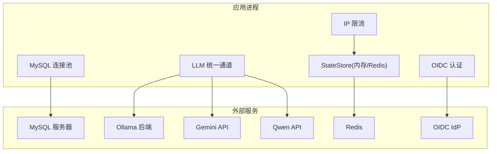
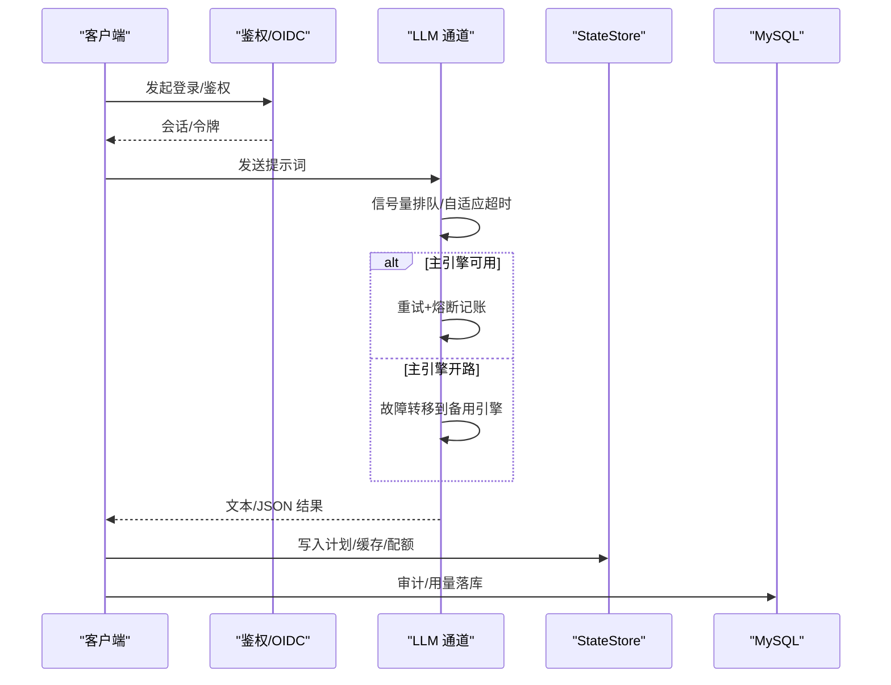
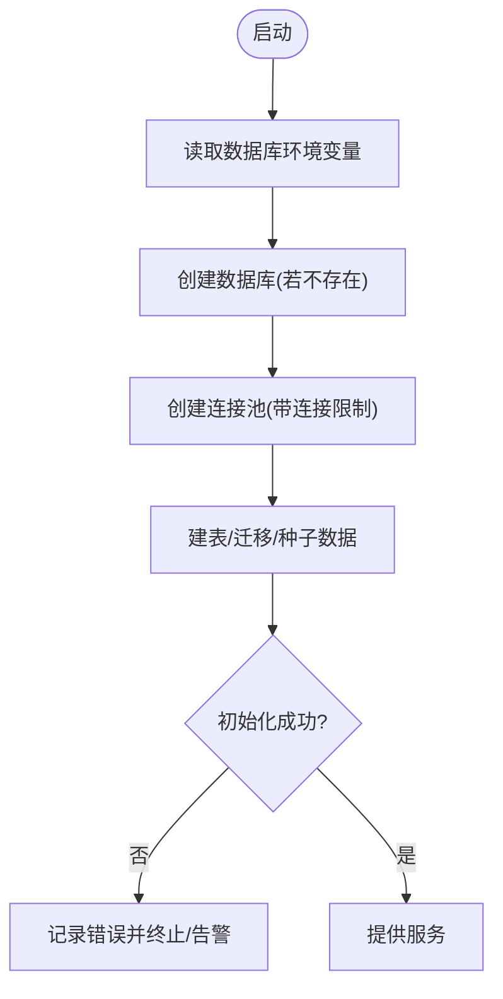
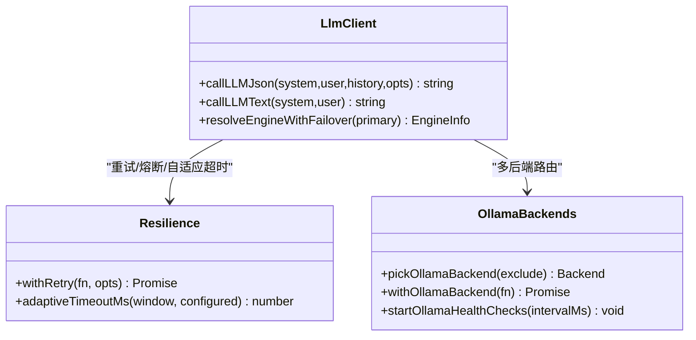
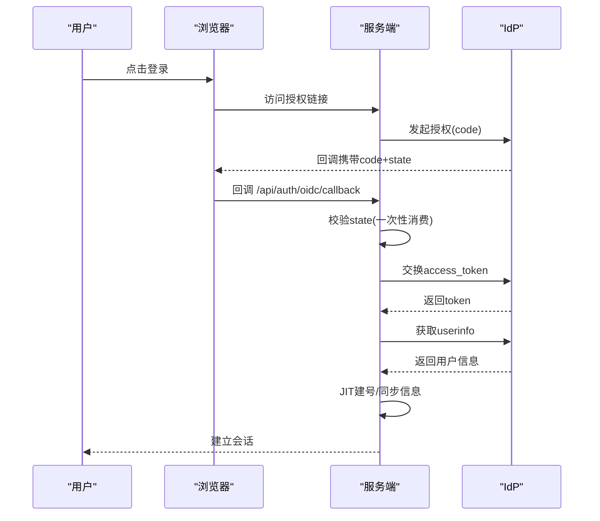
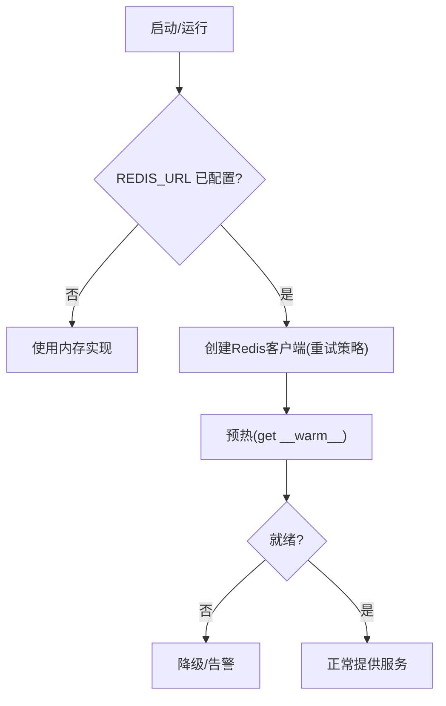
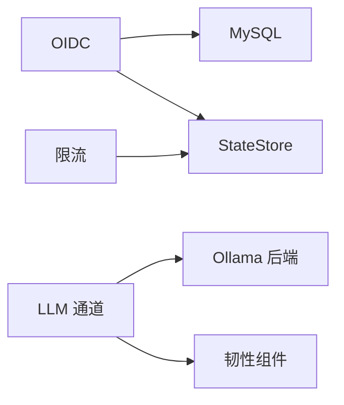

# 连接问题

<cite>
**本文引用的文件**
- [server/infra/db.ts](file://server/infra/db.ts)
- [server/auth/oidc.ts](file://server/auth/oidc.ts)
- [server/llm/llmClient.ts](file://server/llm/llmClient.ts)
- [server/llm/ollamaBackends.ts](file://server/llm/ollamaBackends.ts)
- [server/llm/llmResilience.ts](file://server/llm/llmResilience.ts)
- [server/infra/stateStore.ts](file://server/infra/stateStore.ts)
- [server/infra/rateLimiter.ts](file://server/infra/rateLimiter.ts)
</cite>

## 目录
1. [简介](#简介)
2. [项目结构](#项目结构)
3. [核心组件](#核心组件)
4. [架构总览](#架构总览)
5. [详细组件分析](#详细组件分析)
6. [依赖关系分析](#依赖关系分析)
7. [性能与容量](#性能与容量)
8. [故障排查指南](#故障排查指南)
9. [监控与告警](#监控与告警)
10. [结论](#结论)

## 简介
本指南聚焦“智能问数据分析系统”的常见连接问题，覆盖数据库（MySQL）、大模型服务（Ollama、Gemini、通义千问）、OIDC 认证、Redis 缓存与会话存储等。针对每类连接提供：配置要点、故障诊断步骤、恢复策略与健康检查、自动重连与熔断降级机制的配置方法，帮助快速定位并恢复服务。

## 项目结构
系统通过统一的基础设施层管理外部依赖：
- 数据库：应用库使用 MySQL，启动时建库建表与种子数据初始化，连接池大小可配置。
- LLM 通道：统一封装 Ollama/Gemini/Qwen，具备重试、熔断、并发控制与自适应超时。
- 状态存储：默认内存实现，启用 REDIS_URL 后切换为 Redis，支持分布式锁、窗口计数、一次性消费键。
- OIDC：基于授权码流程 + JIT 建号，state 防 CSRF 支持内存或 Redis 共享。
- 限流：按 IP 固定窗口计数，Redis 模式多实例共享。

**图表来源**
- [server/infra/db.ts:16-70](file://server/infra/db.ts#L16-L70)
- [server/llm/llmClient.ts:33-59](file://server/llm/llmClient.ts#L33-L59)
- [server/llm/ollamaBackends.ts:21-38](file://server/llm/ollamaBackends.ts#L21-L38)
- [server/infra/stateStore.ts:169-187](file://server/infra/stateStore.ts#L169-L187)
- [server/auth/oidc.ts:41-56](file://server/auth/oidc.ts#L41-L56)

**章节来源**
- [server/infra/db.ts:16-70](file://server/infra/db.ts#L16-L70)
- [server/llm/llmClient.ts:33-59](file://server/llm/llmClient.ts#L33-L59)
- [server/infra/stateStore.ts:169-187](file://server/infra/stateStore.ts#L169-L187)
- [server/auth/oidc.ts:41-56](file://server/auth/oidc.ts#L41-L56)

## 核心组件
- 数据库连接池：惰性读取环境变量，创建池并执行建库建表与种子数据；池大小可按并发用户数推导或显式配置。
- LLM 统一通道：按引擎选择优先级（请求级覆盖 > 阶段路由 > AI_ENGINE > 密钥存在性 > ollama），内置重试、熔断、信号量与自适应超时。
- 状态存储：MemoryStateStore 与 RedisStateStore 双实现，提供 get/setEx/getDel/incrWindow/acquireLock/releaseLock 等能力。
- OIDC 认证：发现端点、授权码交换、userinfo 获取、JIT 建号；state 支持内存或 Redis 共享。
- 限流：按 IP 固定窗口计数，Redis 模式多实例共享；异常时 fail-closed 返回 429。

**章节来源**
- [server/infra/db.ts:16-70](file://server/infra/db.ts#L16-L70)
- [server/llm/llmClient.ts:114-139](file://server/llm/llmClient.ts#L114-L139)
- [server/infra/stateStore.ts:10-23](file://server/infra/stateStore.ts#L10-L23)
- [server/auth/oidc.ts:62-87](file://server/auth/oidc.ts#L62-L87)
- [server/infra/rateLimiter.ts:14-42](file://server/infra/rateLimiter.ts#L14-L42)

## 架构总览
下图展示一次“问数”请求在连接层面的关键路径：鉴权（可选 OIDC）→ LLM 调用（含熔断/重试/回退）→ 结果写入/缓存（StateStore）→ 审计与用量记录（MySQL）。

**图表来源**
- [server/llm/llmClient.ts:449-525](file://server/llm/llmClient.ts#L449-L525)
- [server/llm/llmResilience.ts:179-197](file://server/llm/llmResilience.ts#L179-L197)
- [server/infra/stateStore.ts:169-187](file://server/infra/stateStore.ts#L169-L187)
- [server/infra/db.ts:47-70](file://server/infra/db.ts#L47-L70)

## 详细组件分析

### 数据库连接（MySQL）
- 连接配置
  - 主机/端口/用户/密码/数据库名均从环境变量惰性读取，避免 ESM 提升导致的时序问题。
  - 连接池大小：优先 APP_POOL_MAX；否则按 EXPECTED_CONCURRENT_USERS 推导并钳制到 [10, 50]。
  - 字符集 utf8mb4，等待连接开启，确保高并发下队列化而非直接拒绝。
- 故障诊断
  - 启动失败：确认数据库已存在且凭据正确；检查网络连通性与防火墙。
  - 连接池耗尽：观察并发峰值与查询耗时；必要时提高 APP_POOL_MAX 或优化慢查询。
  - 超时：检查 MySQL 负载与网络抖动；结合业务 SQL 进行索引与执行计划优化。
- 恢复策略
  - 动态扩容：调整 APP_POOL_MAX 并重启或热更新（如支持）。
  - 慢查询治理：结合审计日志与链路追踪定位瓶颈。
- 健康检查与监控
  - 启动时建库建表成功即视为基础健康；可配合外部探针探测连接可用性。
  - 指标建议：连接池活跃/空闲、等待时间、错误率、慢查询数量。

**图表来源**
- [server/infra/db.ts:16-70](file://server/infra/db.ts#L16-L70)

**章节来源**
- [server/infra/db.ts:16-70](file://server/infra/db.ts#L16-L70)

### LLM 服务连接（Ollama / Gemini / 通义千问）
- 连接配置
  - 引擎选择：AI_ENGINE 显式指定 > 密钥存在性 > 回退 ollama；也可通过请求级覆盖或阶段路由（SQL 生成/解读）指定模型。
  - Ollama：支持单/多后端（OLLAMA_URLS），最少并发路由，健康检查剔除故障节点。
  - Qwen：OpenAI 兼容协议，端点由 QWEN_URL 控制；超时可配置。
  - Gemini：通过 SDK 调用，需配置密钥。
- 故障诊断
  - 网络/证书：确认域名解析、代理、TLS 设置。
  - 鉴权：检查 API Key、Token、Scope 是否有效。
  - 超时/限流：关注 429/5xx；利用重试与自适应超时缓解瞬时抖动。
- 恢复策略
  - 熔断与回退：主引擎连续失败自动切换到备用引擎；全部开路则快速失败不雪崩。
  - 多后端：Ollama 失败自动换次优节点重试；后台健康检查周期恢复摘除节点。
- 健康检查与监控
  - Ollama 健康检查：周期探测 /api/tags，失败摘除，冷却后半开探测恢复。
  - 指标建议：各引擎成功率、平均/分位延迟、重试次数、熔断触发次数、回退次数。

**图表来源**
- [server/llm/llmClient.ts:449-525](file://server/llm/llmClient.ts#L449-L525)
- [server/llm/llmResilience.ts:179-197](file://server/llm/llmResilience.ts#L179-L197)
- [server/llm/ollamaBackends.ts:74-128](file://server/llm/ollamaBackends.ts#L74-L128)

**章节来源**
- [server/llm/llmClient.ts:114-139](file://server/llm/llmClient.ts#L114-L139)
- [server/llm/llmClient.ts:349-442](file://server/llm/llmClient.ts#L349-L442)
- [server/llm/ollamaBackends.ts:21-38](file://server/llm/ollamaBackends.ts#L21-L38)
- [server/llm/ollamaBackends.ts:74-128](file://server/llm/ollamaBackends.ts#L74-L128)
- [server/llm/llmResilience.ts:179-197](file://server/llm/llmResilience.ts#L179-L197)

### OIDC 认证连接
- 连接配置
  - 必需：OIDC_ISSUER、OIDC_CLIENT_ID；可选：OIDC_CLIENT_SECRET、OIDC_REDIRECT_URI、OIDC_DEFAULT_ROLE。
  - Discovery：缓存 1 小时，减少频繁回源；失败时阻断登录。
  - State：一次性随机串，TTL 10 分钟；默认内存 Map，配置 REDIS_URL 后外置共享以支持多实例。
- 故障诊断
  - Discovery 失败：检查 IdP 地址、网络、DNS、证书。
  - Token 交换失败：检查回调地址、client_secret、scope。
  - Userinfo 失败：检查 userinfo 端点与令牌权限。
  - State 校验失败：确认浏览器未拦截 Cookie/跳转；多实例部署必须启用 Redis。
- 恢复策略
  - 临时不可用：等待 IdP 恢复；必要时关闭 OIDC 入口回退本地登录。
  - 多实例一致性：启用 REDIS_URL 保证 state 全局可见。
- 健康检查与监控
  - 指标建议：Discovery 成功率、token 交换成功率、userinfo 成功率、JIT 建号次数。

**图表来源**
- [server/auth/oidc.ts:62-87](file://server/auth/oidc.ts#L62-L87)
- [server/auth/oidc.ts:100-127](file://server/auth/oidc.ts#L100-L127)
- [server/auth/oidc.ts:129-164](file://server/auth/oidc.ts#L129-L164)
- [server/auth/oidc.ts:173-189](file://server/auth/oidc.ts#L173-L189)
- [server/auth/oidc.ts:207-243](file://server/auth/oidc.ts#L207-L243)

**章节来源**
- [server/auth/oidc.ts:41-56](file://server/auth/oidc.ts#L41-L56)
- [server/auth/oidc.ts:62-87](file://server/auth/oidc.ts#L62-L87)
- [server/auth/oidc.ts:100-127](file://server/auth/oidc.ts#L100-L127)
- [server/auth/oidc.ts:129-164](file://server/auth/oidc.ts#L129-L164)
- [server/auth/oidc.ts:173-189](file://server/auth/oidc.ts#L173-L189)
- [server/auth/oidc.ts:207-243](file://server/auth/oidc.ts#L207-L243)

### Redis 连接（缓存/会话/分布式锁）
- 连接配置
  - 通过 REDIS_URL 启用；未配置时回退内存实现。
  - 连接参数：最大重试次数、禁用离线队列、指数退避重试策略。
  - 预热：启动时可调用预热函数等待就绪，消除冷启动窗口。
- 故障诊断
  - 连接失败：检查 URL、网络、ACL、密码、TLS。
  - 命令失败：GETDEL 老版本回退 GET+DEL；INCR 首次 TTL 失败会删除 key 并抛错。
  - 限流误判：Redis 异常时 fail-closed 返回 429，需检查存储健康。
- 恢复策略
  - 自动重试：ioredis 内置重试策略；异常时上层做降级（如限流拒绝）。
  - 降级：未配置 REDIS_URL 时自动回退内存实现（单机场景）。
- 健康检查与监控
  - 指标建议：连接错误率、命令失败率、TTL 设置失败次数、锁抢占成功率。

**图表来源**
- [server/infra/stateStore.ts:169-187](file://server/infra/stateStore.ts#L169-L187)
- [server/infra/stateStore.ts:200-213](file://server/infra/stateStore.ts#L200-L213)

**章节来源**
- [server/infra/stateStore.ts:10-23](file://server/infra/stateStore.ts#L10-L23)
- [server/infra/stateStore.ts:105-163](file://server/infra/stateStore.ts#L105-L163)
- [server/infra/stateStore.ts:169-187](file://server/infra/stateStore.ts#L169-L187)
- [server/infra/stateStore.ts:200-213](file://server/infra/stateStore.ts#L200-L213)

## 依赖关系分析
- db.ts 被 auth/oidc.ts 用于 JIT 建号与用户信息同步。
- llmClient.ts 依赖 ollamaBackends.ts 的多后端路由与健康检查，以及 llmResilience.ts 的重试/熔断/自适应超时。
- oidc.ts 依赖 stateStore.ts 的 get/setEx/getDel 实现 state 的一次性消费与共享。
- rateLimiter.ts 依赖 stateStore.ts 的 incrWindow 实现固定窗口计数。

**图表来源**
- [server/auth/oidc.ts:207-243](file://server/auth/oidc.ts#L207-L243)
- [server/llm/llmClient.ts:449-525](file://server/llm/llmClient.ts#L449-L525)
- [server/llm/ollamaBackends.ts:74-128](file://server/llm/ollamaBackends.ts#L74-L128)
- [server/infra/stateStore.ts:169-187](file://server/infra/stateStore.ts#L169-L187)
- [server/infra/rateLimiter.ts:14-42](file://server/infra/rateLimiter.ts#L14-L42)

**章节来源**
- [server/auth/oidc.ts:207-243](file://server/auth/oidc.ts#L207-L243)
- [server/llm/llmClient.ts:449-525](file://server/llm/llmClient.ts#L449-L525)
- [server/llm/ollamaBackends.ts:74-128](file://server/llm/ollamaBackends.ts#L74-L128)
- [server/infra/stateStore.ts:169-187](file://server/infra/stateStore.ts#L169-L187)
- [server/infra/rateLimiter.ts:14-42](file://server/infra/rateLimiter.ts#L14-L42)

## 性能与容量
- MySQL 连接池容量公式化：APP_POOL_MAX 优先；否则按 EXPECTED_CONCURRENT_USERS 推导并钳制到 [10, 50]，避免连接风暴。
- LLM 并发与超时：每引擎并发上限可配置；自适应超时根据近期 P95 动态收紧，避免长尾拖死。
- 限流：Redis 模式固定窗口 INCR，多实例共享；异常时 fail-closed 保护下游。

**章节来源**
- [server/infra/db.ts:29-43](file://server/infra/db.ts#L29-L43)
- [server/llm/llmClient.ts:61-83](file://server/llm/llmClient.ts#L61-L83)
- [server/infra/rateLimiter.ts:14-42](file://server/infra/rateLimiter.ts#L14-L42)

## 故障排查指南

### 数据库连接问题（MySQL）
- 现象
  - 启动时报无法连接数据库；连接池耗尽导致请求阻塞或超时；慢查询导致整体吞吐下降。
- 排查
  - 检查环境变量 MYSQL_HOST/MYSQL_PORT/MYSQL_USER/MYSQL_PASSWORD/MYSQL_DATABASE 是否正确。
  - 验证数据库是否存在、账号权限、网络可达性。
  - 观察连接池使用率与等待时间，评估是否需要提高 APP_POOL_MAX。
- 恢复
  - 修正凭据与网络；必要时扩容连接池或优化慢查询。
- 健康检查
  - 启动阶段完成建库建表即视为基础健康；可接入外部探针定期探测连接可用性。

**章节来源**
- [server/infra/db.ts:16-70](file://server/infra/db.ts#L16-L70)

### LLM 服务连接问题（Ollama / Gemini / 通义千问）
- 现象
  - 调用超时、鉴权失败、429 限流、服务不可用导致雪崩。
- 排查
  - 检查引擎选择与环境变量（AI_ENGINE、QWEN_URL、GEMINI_API_KEY、OLLAMA_URL(S)）。
  - 查看重试与熔断日志，确认是否触发回退。
  - 对 Ollama 多后端，检查各节点健康状态与摘除恢复。
- 恢复
  - 调整重试次数、并发上限、超时阈值；启用熔断与回退；修复网络/鉴权问题。
- 健康检查
  - 使用后端健康检查与指标面板观察成功率、延迟、熔断次数。

**章节来源**
- [server/llm/llmClient.ts:114-139](file://server/llm/llmClient.ts#L114-L139)
- [server/llm/llmClient.ts:349-442](file://server/llm/llmClient.ts#L349-L442)
- [server/llm/ollamaBackends.ts:74-128](file://server/llm/ollamaBackends.ts#L74-L128)
- [server/llm/llmResilience.ts:179-197](file://server/llm/llmResilience.ts#L179-L197)

### OIDC 认证连接问题
- 现象
  - 授权码流程失败、state 校验失败、userinfo 获取失败、JIT 建号失败。
- 排查
  - 检查 OIDC_ISSUER、OIDC_CLIENT_ID、OIDC_REDIRECT_URI 配置。
  - 确认 discovery 文档可获取；检查 token 交换与 userinfo 端点响应。
  - 多实例部署需启用 REDIS_URL 以保证 state 共享。
- 恢复
  - 修正配置与网络；必要时暂时关闭 OIDC 入口回退本地登录。
- 健康检查
  - 统计 discovery/token/userinfo 成功率与 JIT 建号次数。

**章节来源**
- [server/auth/oidc.ts:41-56](file://server/auth/oidc.ts#L41-L56)
- [server/auth/oidc.ts:62-87](file://server/auth/oidc.ts#L62-L87)
- [server/auth/oidc.ts:100-127](file://server/auth/oidc.ts#L100-L127)
- [server/auth/oidc.ts:129-164](file://server/auth/oidc.ts#L129-L164)
- [server/auth/oidc.ts:173-189](file://server/auth/oidc.ts#L173-L189)
- [server/auth/oidc.ts:207-243](file://server/auth/oidc.ts#L207-L243)

### Redis 连接问题（缓存/会话/分布式锁）
- 现象
  - 连接失败、命令报错、限流误判、锁抢占失败。
- 排查
  - 检查 REDIS_URL、网络、ACL、密码、TLS。
  - 注意 GETDEL 兼容性；INCR 首次 TTL 失败会删除 key 并抛错。
  - 限流异常时 fail-closed 返回 429，需优先恢复 Redis。
- 恢复
  - 启用预热 warmStateStore；异常时降级为内存实现（单机场景）。
- 健康检查
  - 监控连接错误率、命令失败率、TTL 设置失败次数、锁成功率。

**章节来源**
- [server/infra/stateStore.ts:105-163](file://server/infra/stateStore.ts#L105-L163)
- [server/infra/stateStore.ts:169-187](file://server/infra/stateStore.ts#L169-L187)
- [server/infra/stateStore.ts:200-213](file://server/infra/stateStore.ts#L200-L213)
- [server/infra/rateLimiter.ts:14-42](file://server/infra/rateLimiter.ts#L14-L42)

## 监控与告警
- 建议指标
  - MySQL：连接池活跃/空闲、等待时间、错误率、慢查询数量。
  - LLM：各引擎成功率、平均/分位延迟、重试次数、熔断触发次数、回退次数。
  - OIDC：discovery/token/userinfo 成功率、JIT 建号次数。
  - Redis：连接错误率、命令失败率、TTL 设置失败次数、锁抢占成功率。
- 告警策略
  - 连接失败持续 N 秒触发告警；熔断连续触发超过阈值告警；限流 429 比例突增告警。
- 可视化
  - 可使用 Grafana/Prometheus 集成现有仪表盘与自定义指标。

[本节为通用指导，无需具体文件引用]

## 结论
本系统通过统一的连接抽象与韧性机制，显著提升了对外部依赖的容错能力。实践中应重点关注：
- 合理配置连接池与并发上限，避免资源耗尽。
- 启用 LLM 熔断与回退，保障主链路稳定。
- 多实例部署务必启用 Redis 共享 state/配额/限流。
- 建立完善的健康检查与监控告警体系，快速定位并恢复连接问题。