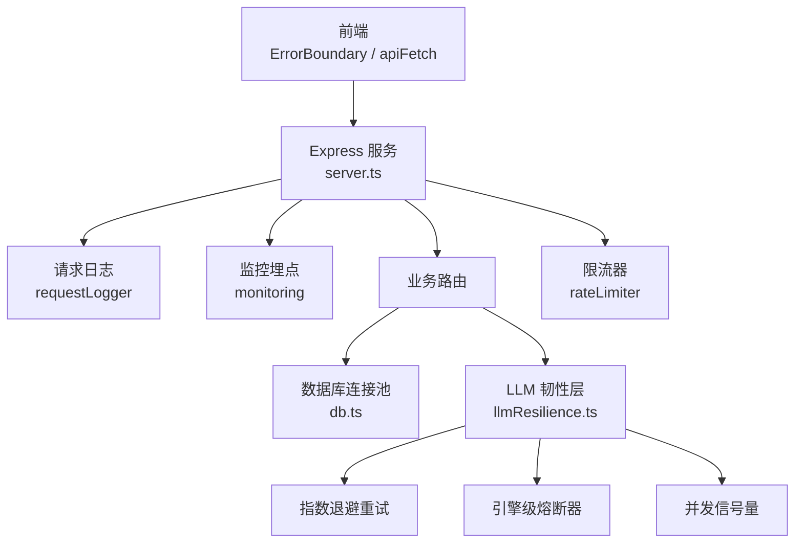
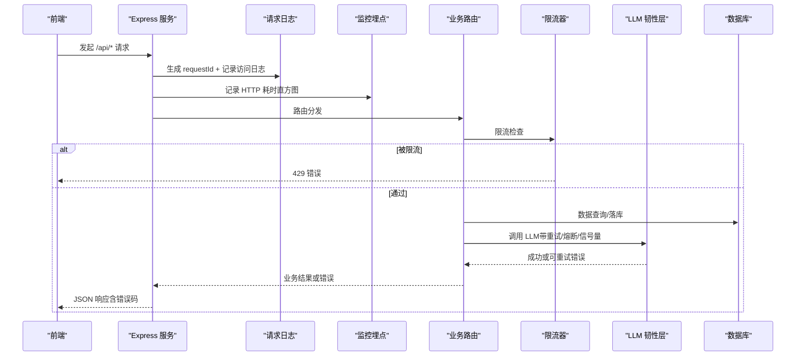
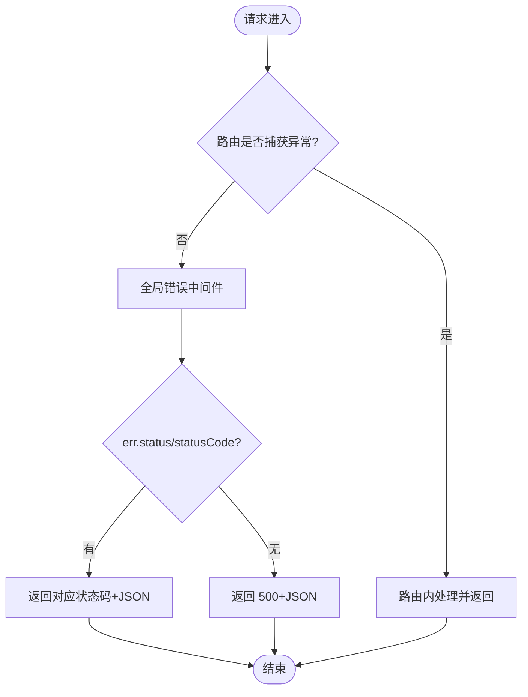
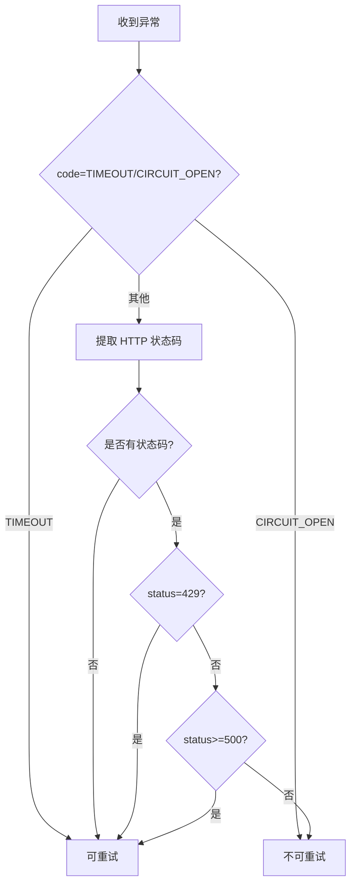
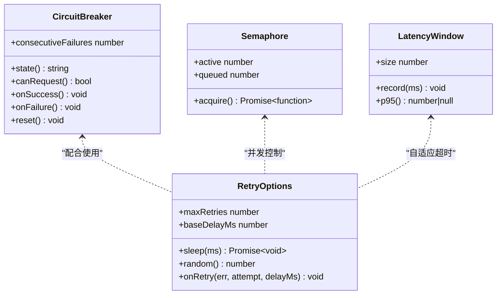
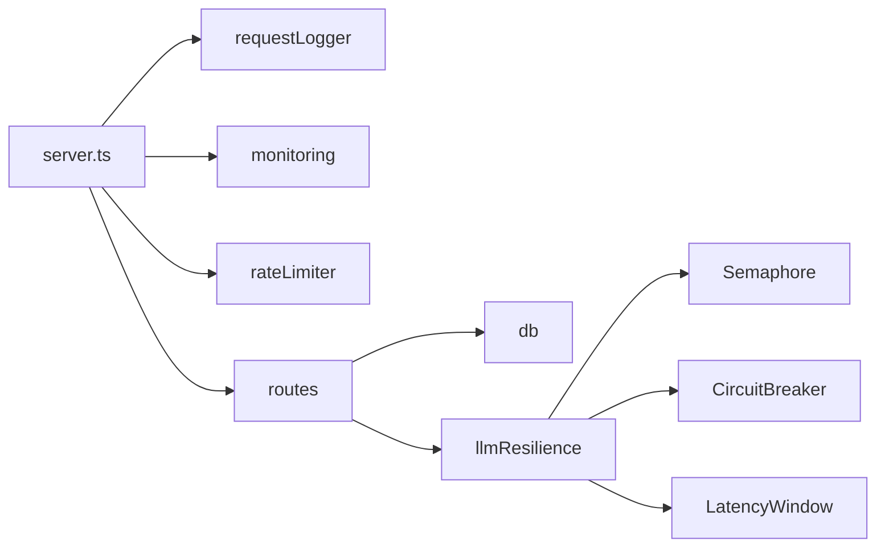

# 错误处理

<cite>
**本文引用的文件**
- [server/infra/errorCodes.ts](file://server/infra/errorCodes.ts)
- [server/infra/logger.ts](file://server/infra/logger.ts)
- [server/infra/requestLogger.ts](file://server/infra/requestLogger.ts)
- [server/infra/monitoring.ts](file://server/infra/monitoring.ts)
- [server/infra/rateLimiter.ts](file://server/infra/rateLimiter.ts)
- [server/llm/llmResilience.ts](file://server/llm/llmResilience.ts)
- [server.ts](file://server.ts)
- [src/components/ErrorBoundary.tsx](file://src/components/ErrorBoundary.tsx)
- [src/utils/apiFetch.ts](file://src/utils/apiFetch.ts)
</cite>

## 目录
1. [简介](#简介)
2. [项目结构](#项目结构)
3. [核心组件](#核心组件)
4. [架构总览](#架构总览)
5. [详细组件分析](#详细组件分析)
6. [依赖关系分析](#依赖关系分析)
7. [性能考量](#性能考量)
8. [故障排查指南](#故障排查指南)
9. [结论](#结论)
10. [附录](#附录)

## 简介
本指南面向智能问数据分析系统的错误处理体系，覆盖统一错误码、异常捕获与处理、重试与熔断、日志记录规范、监控告警配置以及错误恢复策略与用户体验优化。目标是让前后端在一致的错误语义下协作，提升系统韧性、可观测性与用户满意度。

## 项目结构
错误处理相关能力分布在服务端基础设施层、LLM 韧性层、前端边界与请求封装中：
- 服务端基础设施：统一错误码、日志、请求追踪、限流、Prometheus 指标
- LLM 韧性：重试、熔断、并发信号量、自适应超时
- 应用入口：全局异常兜底、中间件链、API 404 兜底
- 前端：全局错误边界、统一 fetch 封装

图表来源
- [server.ts:169-183](file://server.ts#L169-L183)
- [server/infra/requestLogger.ts:19-35](file://server/infra/requestLogger.ts#L19-L35)
- [server/infra/monitoring.ts:1-153](file://server/infra/monitoring.ts#L1-L153)
- [server/infra/rateLimiter.ts:14-42](file://server/infra/rateLimiter.ts#L14-L42)
- [server/llm/llmResilience.ts:1-245](file://server/llm/llmResilience.ts#L1-L245)

章节来源
- [server.ts:169-183](file://server.ts#L169-L183)
- [server/infra/requestLogger.ts:19-35](file://server/infra/requestLogger.ts#L19-L35)
- [server/infra/monitoring.ts:1-153](file://server/infra/monitoring.ts#L1-L153)
- [server/infra/rateLimiter.ts:14-42](file://server/infra/rateLimiter.ts#L14-L42)
- [server/llm/llmResilience.ts:1-245](file://server/llm/llmResilience.ts#L1-L245)

## 核心组件
- 统一错误码：集中定义业务失败原因码，前端按 code 分支处理，避免解析中文文案。
- 全局异常处理器：Express 全局错误中间件将未捕获异常转为 JSON 响应；进程级 unhandledRejection/uncaughtException 兜底记录。
- 请求追踪：为每个请求生成 requestId，写入响应头，便于前后端关联排障。
- 限流：按 IP 滑动窗口或 Redis 固定分钟窗口计数，超限返回 429。
- LLM 韧性：指数退避重试、引擎级熔断、并发信号量、自适应超时。
- 监控埋点：Prometheus 指标（请求耗时、缓存命中、LLM 用量、SQL 执行耗时等），fail-open 不阻断主链路。
- 前端错误边界：捕获渲染崩溃，展示友好提示并支持刷新恢复。
- 前端请求封装：统一错误抛出，便于上层 UI 统一处理。

章节来源
- [server/infra/errorCodes.ts:1-36](file://server/infra/errorCodes.ts#L1-L36)
- [server.ts:72-80](file://server.ts#L72-L80)
- [server.ts:273-280](file://server.ts#L273-L280)
- [server/infra/requestLogger.ts:19-35](file://server/infra/requestLogger.ts#L19-L35)
- [server/infra/rateLimiter.ts:14-42](file://server/infra/rateLimiter.ts#L14-L42)
- [server/llm/llmResilience.ts:12-49](file://server/llm/llmResilience.ts#L12-L49)
- [server/infra/monitoring.ts:90-153](file://server/infra/monitoring.ts#L90-L153)
- [src/components/ErrorBoundary.tsx:12-61](file://src/components/ErrorBoundary.tsx#L12-L61)
- [src/utils/apiFetch.ts:6-29](file://src/utils/apiFetch.ts#L6-L29)

## 架构总览
下图展示了从前端到后端的错误处理关键路径：前端通过统一 fetch 发起请求，后端经请求日志、监控埋点进入路由，路由调用限流、数据库与 LLM 韧性层，最终由全局错误中间件统一输出 JSON 错误。

图表来源
- [server/infra/requestLogger.ts:19-35](file://server/infra/requestLogger.ts#L19-L35)
- [server/infra/monitoring.ts:80-88](file://server/infra/monitoring.ts#L80-L88)
- [server/infra/rateLimiter.ts:14-42](file://server/infra/rateLimiter.ts#L14-L42)
- [server/llm/llmResilience.ts:162-197](file://server/llm/llmResilience.ts#L162-L197)
- [server.ts:273-280](file://server.ts#L273-L280)

## 详细组件分析

### 统一错误码体系
- 设计原则
  - 以“失败原因”命名，全大写蛇形，避免使用 HTTP 状态码命名。
  - 前端按 code 做精准分支（提示分级、静默降级、引导操作）。
- 分类与示例
  - 输入类：INVALID_INPUT（参数校验失败、内容被拒）
  - 权限类：FORBIDDEN、DS_ACCESS_DENIED、AI_SWITCHED_OFF
  - 资源类：NOT_FOUND、CONFLICT
  - 执行类：SQL_REJECTED、QUERY_IN_FLIGHT、PLAN_INVALID、PLAN_MISMATCH
  - 外部依赖：RATE_LIMITED、LLM_UNAVAILABLE
  - 兜底：INTERNAL_ERROR
- 前端策略建议
  - 对 INVALID_INPUT/FORBIDDEN/DS_ACCESS_DENIED/AI_SWITCHED_OFF/RATE_LIMITED/SQL_REJECTED 进行明确提示或引导。
  - 对 LLM_UNAVAILABLE/QUERY_IN_FLIGHT 触发降级或重试策略。
  - 对 NOT_FOUND/CONFLICT 走资源不存在或幂等忽略逻辑。
  - INTERNAL_ERROR 作为兜底，结合 requestId 上报。

章节来源
- [server/infra/errorCodes.ts:1-36](file://server/infra/errorCodes.ts#L1-L36)

### 异常捕获与处理机制
- 进程级兜底
  - 捕获 unhandledRejection 与 uncaughtException，记录致命错误但不崩溃服务。
- Express 全局错误中间件
  - 将任意异常转换为 JSON 响应，优先使用 err.status/statusCode，否则 500。
  - 所有未匹配的 /api/* 统一返回 404 JSON，避免前端解析 HTML 报错。
- 业务路由
  - 各路由内部 try/catch 补齐响应，确保错误可被全局中间件统一处理。

图表来源
- [server.ts:72-80](file://server.ts#L72-L80)
- [server.ts:267-280](file://server.ts#L267-L280)

章节来源
- [server.ts:72-80](file://server.ts#L72-L80)
- [server.ts:267-280](file://server.ts#L267-L280)

### 自定义错误类型与 LLM 错误
- LLM 调用错误
  - 携带 status（HTTP 状态码）与 code（如 TIMEOUT、CIRCUIT_OPEN），便于上层区分可重试与不可重试。
- 可重试判定
  - 显式超时/AbortError、5xx、429、无状态码的网络错误视为可重试。
  - 4xx（除 429）立即失败，避免浪费配额。
  - CIRCUIT_OPEN 直接失败，不再重试。

图表来源
- [server/llm/llmResilience.ts:12-49](file://server/llm/llmResilience.ts#L12-L49)

章节来源
- [server/llm/llmResilience.ts:12-49](file://server/llm/llmResilience.ts#L12-L49)

### 重试与熔断机制
- 指数退避重试
  - 默认最大重试次数 2，基础延迟 1s，带 25% 抖动，避免多实例同频重试。
  - 每次重试前回调 onRetry，可用于日志/埋点。
- 引擎级熔断器
  - 连续失败达到阈值后开路，冷却期后半开单探测恢复。
  - 提供 state()、canRequest()、onSuccess()/onFailure()、reset()。
- 并发信号量
  - 每引擎限制并发槽位，超出排队等待，保护本地 Ollama 等算力有限后端。
- 自适应超时
  - 基于近期成功调用 P95×3 动态调整超时，夹在 [floorMs, configuredMs]。

图表来源
- [server/llm/llmResilience.ts:90-160](file://server/llm/llmResilience.ts#L90-L160)
- [server/llm/llmResilience.ts:51-88](file://server/llm/llmResilience.ts#L51-L88)
- [server/llm/llmResilience.ts:199-245](file://server/llm/llmResilience.ts#L199-L245)
- [server/llm/llmResilience.ts:162-197](file://server/llm/llmResilience.ts#L162-L197)

章节来源
- [server/llm/llmResilience.ts:51-88](file://server/llm/llmResilience.ts#L51-L88)
- [server/llm/llmResilience.ts:90-160](file://server/llm/llmResilience.ts#L90-L160)
- [server/llm/llmResilience.ts:162-197](file://server/llm/llmResilience.ts#L162-L197)
- [server/llm/llmResilience.ts:199-245](file://server/llm/llmResilience.ts#L199-L245)

### 错误日志记录规范
- 统一日志出口
  - 通过 logger 输出，级别受 LOG_LEVEL 控制；test 环境仅 error。
- 请求级追踪
  - requestLogger 为每个请求生成 requestId，写入 X-Request-Id 响应头，并在 finish 时记录方法、URL、状态码、耗时与用户信息。
- 审计与跟踪
  - 审计表 query_audit_log、链路 trace 表 query_trace 用于事后回放与问题定位。
- 最佳实践
  - 错误上下文包含 requestId、endpoint、user、dataSourceId、durationMs、status、detail。
  - 堆栈跟踪仅在开发或高优先级错误时输出，生产避免泄露敏感信息。
  - 用户行为记录：登录、鉴权失败、导出审批、知识库变更等关键动作需留痕。

章节来源
- [server/infra/logger.ts:1-41](file://server/infra/logger.ts#L1-L41)
- [server/infra/requestLogger.ts:1-36](file://server/infra/requestLogger.ts#L1-L36)
- [server/infra/db.ts:181-234](file://server/infra/db.ts#L181-L234)

### 错误监控与告警配置
- Prometheus 指标
  - nl2sql_requests_total、nl2sql_duration_seconds、nl2sql_cache_hits_total、llm_call_duration_seconds、llm_tokens_total、sql_execute_duration_seconds、sql_explain_guard_total、http_request_duration_seconds。
- 埋点函数
  - observeAudit、observeCacheHit、observeExplainGuard、observeLlmUsage、observeSqlExec，全部 fail-open。
- 抓取端点
  - /metrics 暴露指标，可选 METRICS_TOKEN 保护。
- 告警建议
  - 错误率突增：基于 nl2sql_requests_total 的 error 比例与 http_request_duration_seconds 的 p95/p99。
  - LLM 不可用：llm_call_duration_seconds ok=0 占比上升、熔断器频繁开路。
  - 限流激增：429 比例升高，关注 rate limiter 配置与峰值。
  - SQL 执行异常：sql_execute_duration_seconds 错误增多、EXPLAIN 拦截 blocked/error。
- 可视化
  - 部署 Grafana 看板（nl2sql-overview.json、nl2sql-llm.json、nl2sql-infra.json、nl2sql-business.json）。

章节来源
- [server/infra/monitoring.ts:1-153](file://server/infra/monitoring.ts#L1-L153)

### 错误恢复策略与用户体验优化
- 前端错误边界
  - 捕获渲染崩溃，展示友好提示并提供一键刷新恢复。
- 前端请求封装
  - 统一错误抛出，上层可按错误码分支（提示、重试、降级）。
- 后端恢复策略
  - 限流：Redis 模式失败回退内存模式或直接拒绝（fail-closed），避免雪崩。
  - LLM：重试+熔断+信号量+自适应超时，保障慢模型不被误杀、快模型不被长超时拖死。
  - 数据库：连接池容量公式化，启动预热 Redis，异常时降级（如缓存 fail-open）。
- 用户体验
  - 对可预期错误给出明确指引（如权限申请、稍后再试、切换模型）。
  - 对不可预期错误提供 requestId 以便客服快速定位。
  - 对长时间任务提供进度与断线续传（SSE 重放缓冲）。

章节来源
- [src/components/ErrorBoundary.tsx:12-61](file://src/components/ErrorBoundary.tsx#L12-L61)
- [src/utils/apiFetch.ts:6-29](file://src/utils/apiFetch.ts#L6-L29)
- [server/infra/rateLimiter.ts:14-42](file://server/infra/rateLimiter.ts#L14-L42)
- [server/llm/llmResilience.ts:162-197](file://server/llm/llmResilience.ts#L162-L197)
- [server.ts:112-118](file://server.ts#L112-L118)

## 依赖关系分析
- 耦合与内聚
  - 错误码集中在 infra/errorCodes.ts，低耦合、高内聚，便于前后端共享。
  - 监控埋点集中在 infra/monitoring.ts，fail-open 保证不侵入热路径。
  - LLM 韧性层独立于客户端实现，可注入时钟/随机/睡眠，利于测试。
- 直接/间接依赖
  - server.ts 依赖 requestLogger、monitoring、rateLimiter、routes。
  - routes 依赖 db、llmClient、llmResilience。
  - llmResilience 提供重试/熔断/信号量/自适应超时原语，供 llmClient 集成。
- 循环依赖规避
  - 限流器与路由模块通过共享函数避免循环依赖。
- 外部依赖
  - MySQL、Redis（可选）、Prometheus/Grafana（可选）。

图表来源
- [server.ts:169-183](file://server.ts#L169-L183)
- [server/infra/rateLimiter.ts:14-42](file://server/infra/rateLimiter.ts#L14-L42)
- [server/infra/monitoring.ts:1-153](file://server/infra/monitoring.ts#L1-L153)
- [server/llm/llmResilience.ts:51-245](file://server/llm/llmResilience.ts#L51-L245)

章节来源
- [server.ts:169-183](file://server.ts#L169-L183)
- [server/infra/rateLimiter.ts:14-42](file://server/infra/rateLimiter.ts#L14-L42)
- [server/infra/monitoring.ts:1-153](file://server/infra/monitoring.ts#L1-L153)
- [server/llm/llmResilience.ts:51-245](file://server/llm/llmResilience.ts#L51-L245)

## 性能考量
- 监控埋点 fail-open，避免影响主链路性能。
- 限流器在 Redis 模式下原子计数，内存模式定期清理过期条目。
- LLM 自适应超时基于 P95×3，避免慢模型误杀与快模型长超时拖死。
- 数据库连接池容量公式化，防止连接风暴。
- SSE 重放缓冲与任务队列降低长任务对同步链路的压力。

[本节为通用指导，无需特定文件引用]

## 故障排查指南
- 快速定位
  - 使用 X-Request-Id 关联前后端日志与审计记录。
  - 查看 /metrics 指标，确认错误率、耗时分布、LLM 可用性。
- 常见问题
  - 429 限流：检查 RATE_LIMIT_MAX、Redis 连接与键空间。
  - LLM 不可用：观察熔断器状态、重试次数、P95 延迟。
  - SQL 执行失败：查看 EXPLAIN 拦截统计、sql_execute_duration_seconds 错误。
- 日志与审计
  - 检索 query_audit_log、query_trace 获取端到端轨迹。
  - 结合 requestLogger 的时间戳与 requestId 过滤。
- 恢复步骤
  - 临时降级：关闭 AI 功能、切换模型、放宽超时。
  - 扩容：增加连接池、提高限流阈值、启用 Redis 限流。
  - 修复：修正配置、重启服务、清理过期中间表。

章节来源
- [server/infra/requestLogger.ts:19-35](file://server/infra/requestLogger.ts#L19-L35)
- [server/infra/monitoring.ts:90-153](file://server/infra/monitoring.ts#L90-L153)
- [server/infra/rateLimiter.ts:14-42](file://server/infra/rateLimiter.ts#L14-L42)
- [server/infra/db.ts:181-234](file://server/infra/db.ts#L181-L234)

## 结论
本系统通过统一错误码、全局异常处理、LLM 韧性原语、结构化日志与监控埋点，构建了稳健的错误处理体系。建议在业务路由中遵循错误码约定，结合前端错误边界与请求封装，提供友好的用户体验；在生产环境中完善监控告警与恢复策略，持续优化系统韧性与可观测性。

[本节为总结，无需特定文件引用]

## 附录
- 环境变量参考
  - LOG_LEVEL：日志级别（debug/info/warn/error）
  - RATE_LIMIT_MAX：每分钟最大请求数
  - JWT_SECRET：生产环境必须设置
  - METRICS_TOKEN：/metrics 访问令牌（可选）
  - MYSQL_*：数据库连接配置
  - REDIS_URL：启用 Redis 限流与状态存储（可选）
- 部署与可视化
  - Grafana 看板：nl2sql-overview.json、nl2sql-llm.json、nl2sql-infra.json、nl2sql-business.json
  - Prometheus 抓取：/metrics

[本节为补充信息，无需特定文件引用]