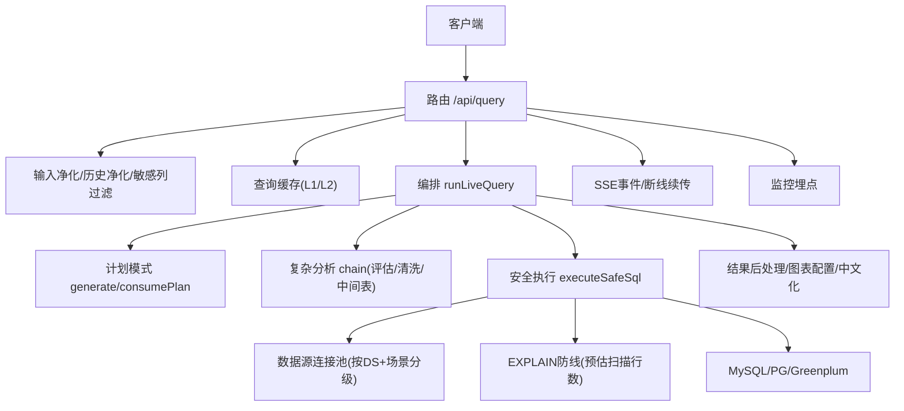
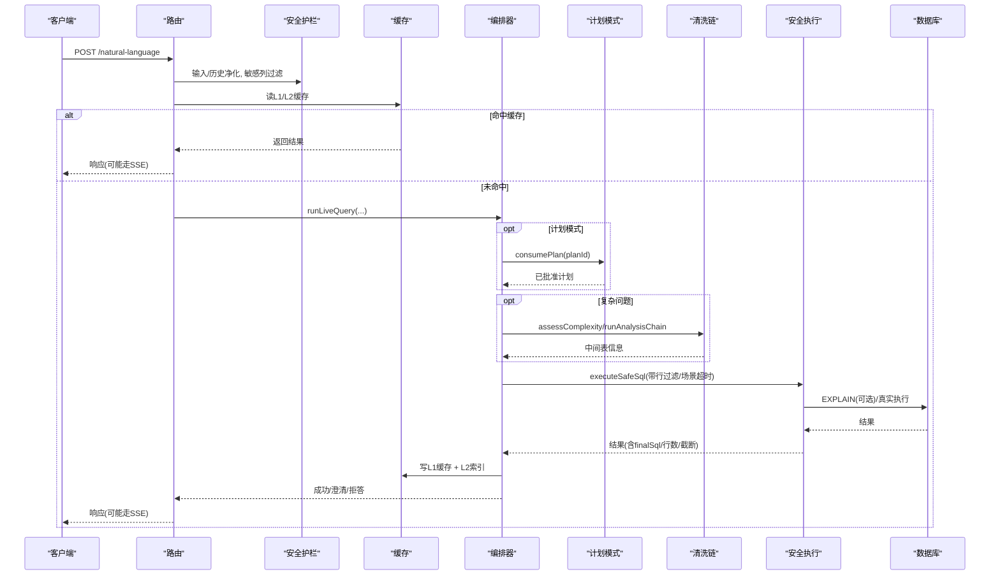
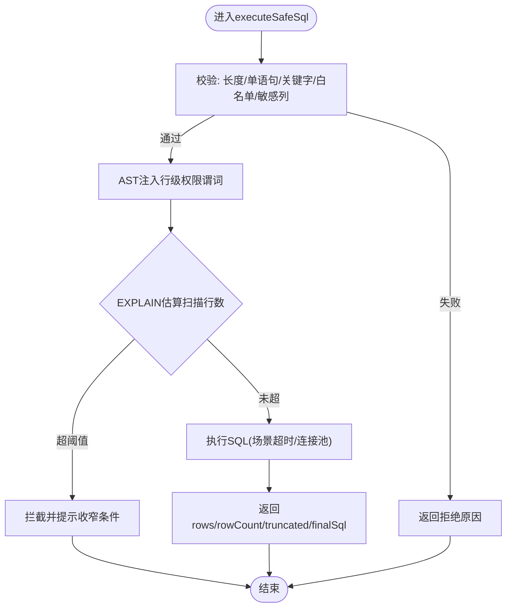
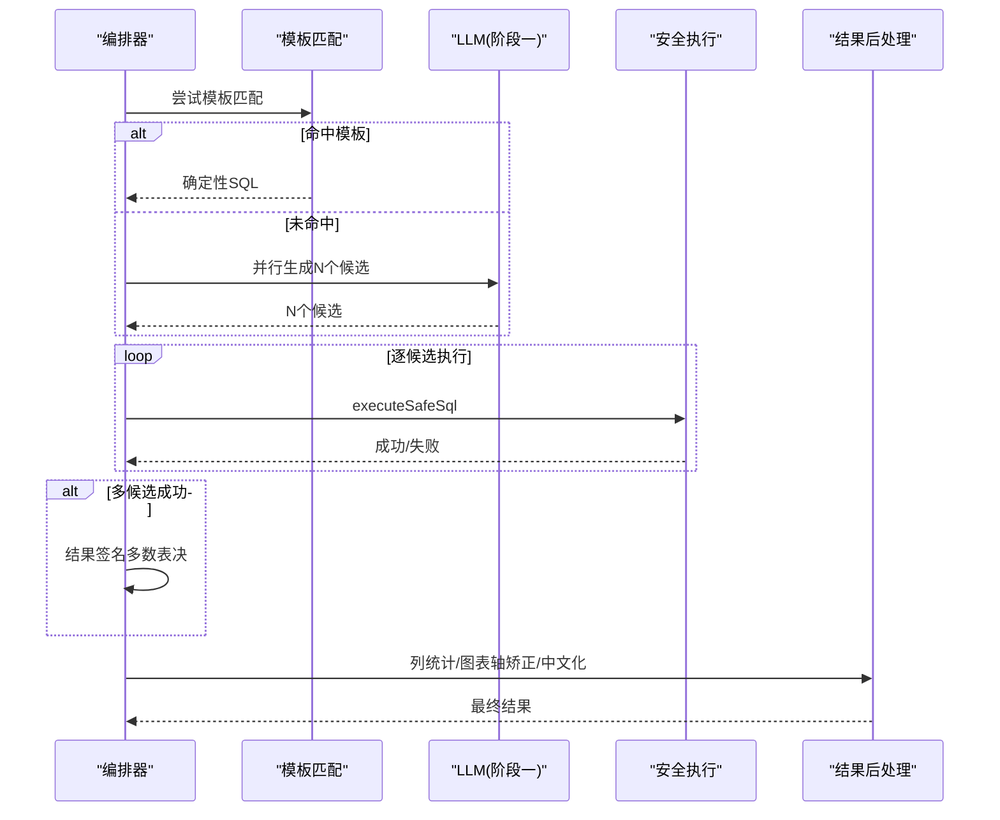
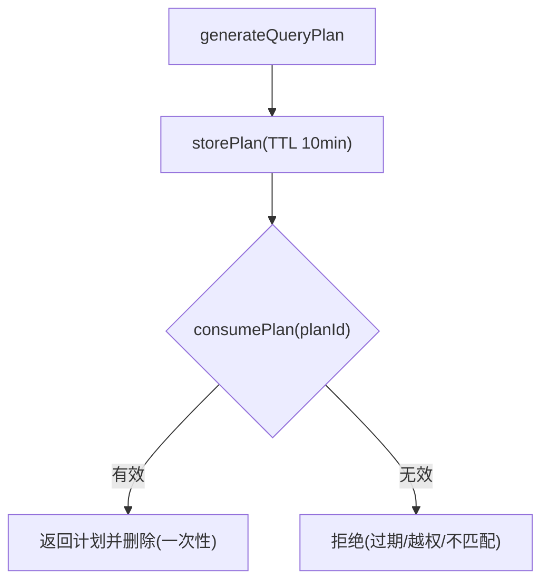
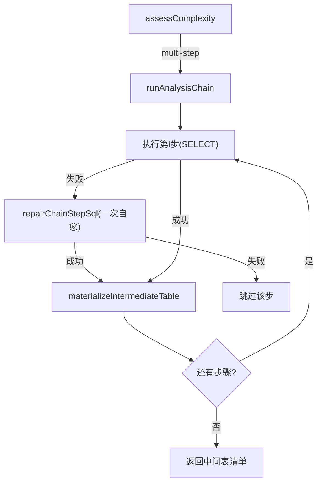
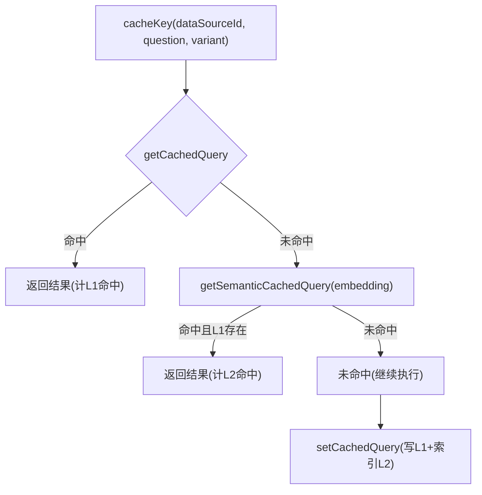
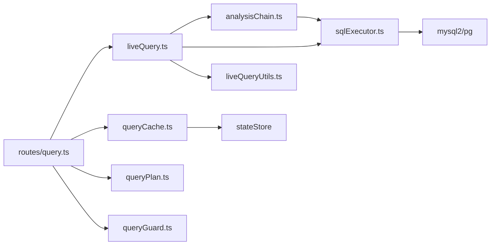

# SQL执行引擎

<cite>
**本文引用的文件**
- [sqlExecutor.ts](file://server/query/sqlExecutor.ts)
- [liveQuery.ts](file://server/query/liveQuery.ts)
- [queryPlan.ts](file://server/query/queryPlan.ts)
- [queryCache.ts](file://server/query/queryCache.ts)
- [analysisChain.ts](file://server/query/analysisChain.ts)
- [liveQueryUtils.ts](file://server/query/liveQueryUtils.ts)
- [queryGuard.ts](file://server/query/queryGuard.ts)
- [query.ts](file://server/routes/query.ts)
- [monitoring.ts](file://server/infra/monitoring.ts)
</cite>

## 目录
1. [简介](#简介)
2. [项目结构](#项目结构)
3. [核心组件](#核心组件)
4. [架构总览](#架构总览)
5. [详细组件分析](#详细组件分析)
6. [依赖关系分析](#依赖关系分析)
7. [性能考量](#性能考量)
8. [故障排查指南](#故障排查指南)
9. [结论](#结论)
10. [附录](#附录)

## 简介
本文件面向“智能问数据分析系统”的SQL执行引擎，系统性说明从自然语言到真实数据查询的全链路：查询解析、权限与安全检查、执行计划生成与优化、结果集处理（分页/排序/聚合）、缓存策略（TTL/失效/内存控制）、并发与资源隔离、超时与自愈、以及监控与慢查询治理。文档以代码为依据，提供流程图与时序图帮助理解。

## 项目结构
SQL执行相关能力主要分布在以下模块：
- 安全执行层：SELECT-only校验、表白名单、敏感列拒绝、行级权限注入、EXPLAIN防线、连接池与场景化超时
- 编排层：阶段一（LLM生成SQL）+ 阶段二（真实结果解读），多候选并行与多数表决，模板匹配兜底
- 计划模式：先出分析计划（不执行），用户批准后执行
- 中间表清洗链：复杂问题拆分为多步清洗，物化为应用库中间表，最终仅引用中间表
- 缓存：L1精确语义归一 + L2 embedding相似度命中；TTL与容量控制
- 路由与SSE：鉴权、限流、并发槽、SSE事件与断线续传、审计与DLP脱敏
- 监控：Prometheus指标埋点（请求耗时、缓存命中、SQL执行耗时、EXPLAIN拦截等）

**图示来源**
- [query.ts:47-393](file://server/routes/query.ts#L47-L393)
- [liveQuery.ts:189-749](file://server/query/liveQuery.ts#L189-L749)
- [sqlExecutor.ts:734-832](file://server/query/sqlExecutor.ts#L734-L832)
- [queryCache.ts:43-90](file://server/query/queryCache.ts#L43-L90)
- [monitoring.ts:92-133](file://server/infra/monitoring.ts#L92-L133)

**章节来源**
- [query.ts:47-393](file://server/routes/query.ts#L47-L393)
- [liveQuery.ts:189-749](file://server/query/liveQuery.ts#L189-L749)

## 核心组件
- 安全执行层（sqlExecutor.ts）：负责SQL合法性、白名单、敏感列拒绝、行级权限注入、EXPLAIN防线、连接池与超时、结果截断
- 编排器（liveQuery.ts）：上下文构建、模板匹配、多候选并行、Self-Consistency多数表决、阶段二解读、降级与拒答
- 计划模式（queryPlan.ts）：LLM生成可执行计划（不执行），一次性消费防重放，TTL管理
- 中间表清洗链（analysisChain.ts）：复杂度评估、多步清洗、物化中间表、配额与TTL清理
- 缓存（queryCache.ts）：L1精确归一 + L2语义相似度命中，TTL与容量控制，失效接口
- 安全护栏（queryGuard.ts）：输入净化、注入特征检测、历史净化、敏感列过滤
- 路由（query.ts）：鉴权、限流、并发槽、SSE、审计、DLP脱敏、缓存读写
- 监控（monitoring.ts）：Prometheus指标埋点，统一暴露/metrics

**章节来源**
- [sqlExecutor.ts:1-832](file://server/query/sqlExecutor.ts#L1-L832)
- [liveQuery.ts:1-749](file://server/query/liveQuery.ts#L1-L749)
- [queryPlan.ts:1-184](file://server/query/queryPlan.ts#L1-L184)
- [analysisChain.ts:1-411](file://server/query/analysisChain.ts#L1-L411)
- [queryCache.ts:1-254](file://server/query/queryCache.ts#L1-L254)
- [queryGuard.ts:1-101](file://server/query/queryGuard.ts#L1-L101)
- [query.ts:1-710](file://server/routes/query.ts#L1-L710)
- [monitoring.ts:1-153](file://server/infra/monitoring.ts#L1-L153)

## 架构总览
端到端流程概览（含缓存、计划、清洗链与安全执行）：

**图示来源**
- [query.ts:47-393](file://server/routes/query.ts#L47-L393)
- [liveQuery.ts:189-749](file://server/query/liveQuery.ts#L189-L749)
- [queryPlan.ts:56-100](file://server/query/queryPlan.ts#L56-L100)
- [analysisChain.ts:97-112](file://server/query/analysisChain.ts#L97-L112)
- [sqlExecutor.ts:629-662](file://server/query/sqlExecutor.ts#L629-L662)
- [queryCache.ts:43-90](file://server/query/queryCache.ts#L43-L90)

## 详细组件分析

### 安全执行层（sqlExecutor.ts）
- 查询解析与校验
  - 剥离注释与字符串，避免干扰关键字匹配
  - 强制单条SELECT，禁止危险关键字与INTO写操作
  - 表名白名单校验（支持CTE别名排除）
  - AST二次复核（node-sql-parser），非只读或越权表直接拒绝
  - 敏感列拒绝（裸列名整词匹配）
- 行级权限注入
  - 通过AST遍历将受控表包裹为过滤子查询，递归覆盖FROM/JOIN/UNION/WITH/表达式子查询
  - 注入失败fail-closed，确保不泄露受限行
- EXPLAIN防线
  - MySQL/PG分别解析EXPLAIN JSON/树形文本，取最大预估扫描行数
  - 超过阈值拦截并给出收窄建议；EXPLAIN失败fail-open放行
- 连接池与超时
  - 按dataSourceId+场景(interactive/chain/export)分级建池
  - 场景化超时：交互15s、分析链120s、导出60s；可通过环境变量覆盖
  - 连接池容量公式化：默认按并发用户数推导，上限保护后端max_connections
- 结果截断与方言适配
  - 强制LIMIT clamp到MAX_ROWS；MySQL/PG分页语法差异自动适配
  - MySQL SELECT注入MAX_EXECUTION_TIME hint（含WITH CTE定位主SELECT）

**图示来源**
- [sqlExecutor.ts:291-387](file://server/query/sqlExecutor.ts#L291-L387)
- [sqlExecutor.ts:396-489](file://server/query/sqlExecutor.ts#L396-L489)
- [sqlExecutor.ts:629-662](file://server/query/sqlExecutor.ts#L629-L662)
- [sqlExecutor.ts:734-832](file://server/query/sqlExecutor.ts#L734-L832)

**章节来源**
- [sqlExecutor.ts:1-832](file://server/query/sqlExecutor.ts#L1-L832)

### 编排器（liveQuery.ts）
- 上下文构建：few-shot、知识库RAG、外部知识、指标口径、反例、个人沉淀、铁律规则，七路并行
- 模板匹配：优先尝试确定性模板拼装SQL，失败回退自由生成
- 多候选并行与Self-Consistency：复杂问题并行生成N个候选，逐候选执行，结果签名多数表决择优
- 阶段二解读：真实rows采样+列统计回喂LLM生成解读/KPI；异常时规则化降级
- 澄清与拒答：首轮首个候选竞速判定澄清/拒答；计划模式下跳过澄清
- 中间表支持：若SQL仅引用ait_*中间表，改在应用库执行，严格白名单校验

**图示来源**
- [liveQuery.ts:221-327](file://server/query/liveQuery.ts#L221-L327)
- [liveQuery.ts:396-620](file://server/query/liveQuery.ts#L396-L620)
- [liveQuery.ts:633-749](file://server/query/liveQuery.ts#L633-L749)

**章节来源**
- [liveQuery.ts:1-749](file://server/query/liveQuery.ts#L1-L749)

### 计划模式（queryPlan.ts）
- 生成：调用LLM输出结构化分析计划（understanding/steps/relatedTables/complexity）
- 存储：内存Map或Redis（TTL=10分钟），一次性消费防重放
- 消费：校验过期、用户归属、数据源匹配，通过后删除条目

**图示来源**
- [queryPlan.ts:162-184](file://server/query/queryPlan.ts#L162-L184)
- [queryPlan.ts:56-100](file://server/query/queryPlan.ts#L56-L100)

**章节来源**
- [queryPlan.ts:1-184](file://server/query/queryPlan.ts#L1-L184)

### 中间表清洗链（analysisChain.ts）
- 复杂度评估：启发式信号预门控，必要时调用LLM评估是否需要多步清洗
- 步骤执行：每步SELECT经安全执行层，失败一次自愈重试（携带错误让模型自纠）
- 物化中间表：剔除敏感列、类型推断、批量写入应用库，注册元数据（TTL=24h）
- 配额与清理：每用户最多10张中间表，定时清理过期表

**图示来源**
- [analysisChain.ts:97-112](file://server/query/analysisChain.ts#L97-L112)
- [analysisChain.ts:268-326](file://server/query/analysisChain.ts#L268-L326)
- [analysisChain.ts:218-253](file://server/query/analysisChain.ts#L218-L253)

**章节来源**
- [analysisChain.ts:1-411](file://server/query/analysisChain.ts#L1-L411)

### 结果集处理（liveQueryUtils.ts）
- 数值列转换：DECIMAL/聚合字符串转number，便于图表与统计
- 列统计：数值列sum/avg/min/max，维度列去重计数
- 图表轴矫正：xAxisKey/yAxisKeys与真实列对齐，缺失则回退默认
- 中文表头：schema description优先，LLM columnNames覆盖，英文标识符保守推断中文
- 结果中文化：表头/图表/解释文案中的英文标识符替换为业务中文名

**章节来源**
- [liveQueryUtils.ts:34-84](file://server/query/liveQueryUtils.ts#L34-L84)
- [liveQueryUtils.ts:87-149](file://server/query/liveQueryUtils.ts#L87-L149)
- [liveQueryUtils.ts:247-282](file://server/query/liveQueryUtils.ts#L247-L282)

### 缓存策略（queryCache.ts）
- L1精确命中：问题归一化（小写/去空白标点）+ 数据源ID + 模型变体/金额单位作为键
- L2语义命中：embedding相似度≥阈值（默认0.95），命中后再校验L1存在性
- TTL与容量：默认TTL=30分钟；内存模式LRU淘汰最早条目；Redis模式setEx TTL
- 失效：数据源变更时按前缀删除缓存与语义索引
- 体积控制：大结果集不缓存（>200KB）

**图示来源**
- [queryCache.ts:23-34](file://server/query/queryCache.ts#L23-L34)
- [queryCache.ts:43-90](file://server/query/queryCache.ts#L43-L90)
- [queryCache.ts:235-253](file://server/query/queryCache.ts#L235-L253)

**章节来源**
- [queryCache.ts:1-254](file://server/query/queryCache.ts#L1-L254)

### 并发控制、资源隔离与超时
- 并发槽：同用户串行（acquire/release query slot），防止昂贵LLM链路拥塞
- 连接池分级：按dataSourceId+场景(interactive/chain/export)独立池，配额与超时隔离
- 场景超时：交互15s、分析链120s、导出60s；PG通过statement_timeout，MySQL通过hint+驱动timeout
- 结果截断：MAX_ROWS限制（默认10万），防止OOM

**章节来源**
- [query.ts:97-116](file://server/routes/query.ts#L97-L116)
- [sqlExecutor.ts:44-109](file://server/query/sqlExecutor.ts#L44-L109)
- [sqlExecutor.ts:686-726](file://server/query/sqlExecutor.ts#L686-L726)
- [sqlExecutor.ts:734-832](file://server/query/sqlExecutor.ts#L734-L832)

### 监控、慢查询与执行计划查看
- 监控埋点：请求总数/耗时、缓存命中、LLM调用耗时/token、SQL执行耗时、EXPLAIN拦截
- 慢查询治理：执行时长>3s或行数>10万标记SLOW，审计记录
- 执行计划查看：/api/sql-assist?action=explain 提供SQL解释与建议；EXPLAIN防线拦截消息包含预估扫描行数

**章节来源**
- [monitoring.ts:19-78](file://server/infra/monitoring.ts#L19-L78)
- [monitoring.ts:92-133](file://server/infra/monitoring.ts#L92-L133)
- [query.ts:558-652](file://server/routes/query.ts#L558-L652)
- [sqlExecutor.ts:531-662](file://server/query/sqlExecutor.ts#L531-L662)

## 依赖关系分析
- 路由依赖：auth/rateLimiter、queryGuard、liveQuery、queryCache、queryPlan、analysisChain、sqlExecutor、monitoring
- 编排器依赖：llmClient、schemaLinking、metrics、ironRules、knowledge、analysisChain、sqlTemplates、liveQueryUtils、liveQueryParsers/Prompts
- 安全执行层依赖：mysql2/pg、node-sql-parser、db pool、secretsCrypto、monitoring、fileDataSource
- 缓存依赖：stateStore(Redis/内存)、llmClient(embedding)、monitoring
- 清洗链依赖：sqlExecutor、llmClient、db pool、trace

**图示来源**
- [query.ts:17-42](file://server/routes/query.ts#L17-L42)
- [liveQuery.ts:16-73](file://server/query/liveQuery.ts#L16-L73)
- [sqlExecutor.ts:11-20](file://server/query/sqlExecutor.ts#L11-L20)
- [queryCache.ts:8-10](file://server/query/queryCache.ts#L8-L10)
- [analysisChain.ts:7-14](file://server/query/analysisChain.ts#L7-L14)

**章节来源**
- [query.ts:17-42](file://server/routes/query.ts#L17-L42)
- [liveQuery.ts:16-73](file://server/query/liveQuery.ts#L16-L73)
- [sqlExecutor.ts:11-20](file://server/query/sqlExecutor.ts#L11-L20)
- [queryCache.ts:8-10](file://server/query/queryCache.ts#L8-L10)
- [analysisChain.ts:7-14](file://server/query/analysisChain.ts#L7-L14)

## 性能考量
- 多候选并行：阶段一并行生成N个候选，首候选竞速判定澄清/拒答，降低平均延迟
- 模板匹配：确定性模板零偏差兜底，减少LLM复杂语法生成失败率
- 宽表列裁剪：仅注入top-N相关列，降低prompt token占用
- 缓存命中率：L1精确+L2语义命中显著降低重复昂贵链路
- 连接池分级：场景化配额与超时避免相互挤占，提升吞吐
- EXPLAIN防线：拦截大范围扫描，保护数据源稳定性
- 结果截断：MAX_ROWS防止OOM，保障服务可用性

[本节为通用性能讨论，无需特定文件引用]

## 故障排查指南
- 输入被拒绝：检查queryGuard净化结果（控制字符/注入特征/长度）
- 权限不足：确认角色与数据源ACL授权
- SQL被拒绝：查看安全执行层拒绝原因（关键字/白名单/敏感列/AST复核）
- EXPLAIN拦截：根据提示增加时间范围/部门/维度等筛选条件
- 缓存未命中：检查归一化键是否一致（大小写/标点/模型变体/金额单位）
- 中间表失败：查看清洗链步骤错误，触发一次自愈重试；检查用户配额与TTL
- 慢查询：关注审计SLOW标记，结合EXPLAIN与索引建议优化
- 监控指标：通过/metrics查看nl2sql_duration_seconds、sql_execute_duration_seconds、sql_explain_guard_total等

**章节来源**
- [queryGuard.ts:27-69](file://server/query/queryGuard.ts#L27-L69)
- [sqlExecutor.ts:291-387](file://server/query/sqlExecutor.ts#L291-L387)
- [sqlExecutor.ts:629-662](file://server/query/sqlExecutor.ts#L629-L662)
- [queryCache.ts:23-34](file://server/query/queryCache.ts#L23-L34)
- [analysisChain.ts:268-326](file://server/query/analysisChain.ts#L268-L326)
- [monitoring.ts:92-133](file://server/infra/monitoring.ts#L92-L133)

## 结论
本SQL执行引擎以“安全优先、可用至上”为原则，构建了从输入净化、权限校验、安全执行到结果解读的完整闭环。通过多候选并行、模板兜底、EXPLAIN防线、连接池分级与场景化超时，兼顾准确性与稳定性；借助L1/L2缓存与中间表清洗链，显著提升性能与可维护性。监控与慢查询治理为持续优化提供数据支撑。

[本节为总结性内容，无需特定文件引用]

## 附录
- 关键环境变量
  - DS_POOL_MAX / DS_POOL_INTERACTIVE / DS_POOL_CHAIN / DS_POOL_EXPORT：连接池容量
  - QUERY_TIMEOUT_INTERACTIVE_MS / QUERY_TIMEOUT_CHAIN_MS / QUERY_TIMEOUT_EXPORT_MS：场景超时
  - SQL_EXPLAIN_MAX_ROWS：EXPLAIN防线阈值（0关闭）
  - QUERY_CACHE_TTL_MINUTES：缓存TTL（分钟）
  - SEMANTIC_CACHE_THRESHOLD：语义缓存相似度阈值
  - SELF_CORRECT_CANDIDATES：多候选数量（1-3）
  - LLM_SQL_ROUTE_MAX_TABLES：快速模型路由表数阈值
  - ASSESS_ALWAYS_LLM：是否每题必做复杂度评估

[本节为配置说明，无需特定文件引用]