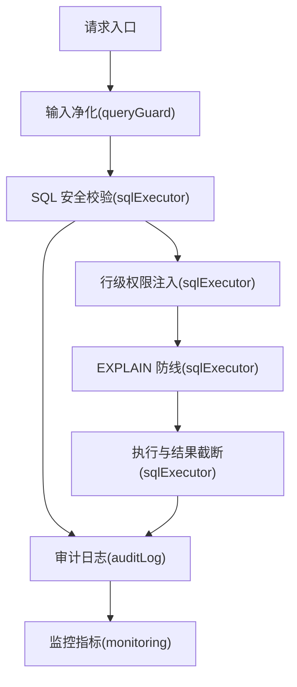
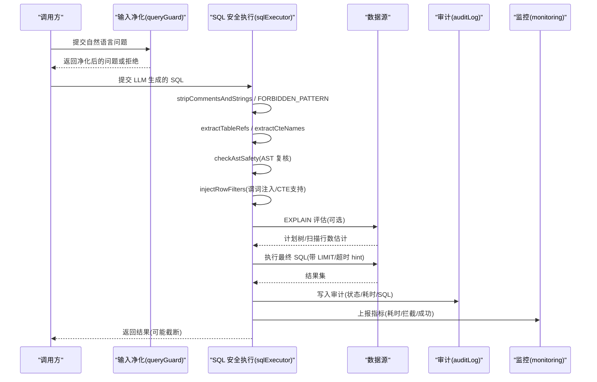
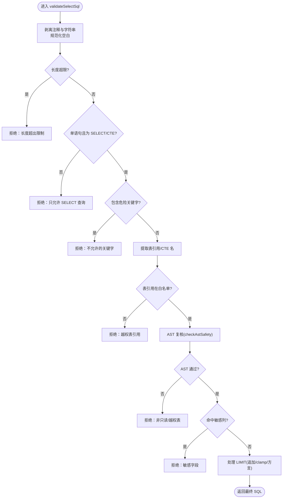
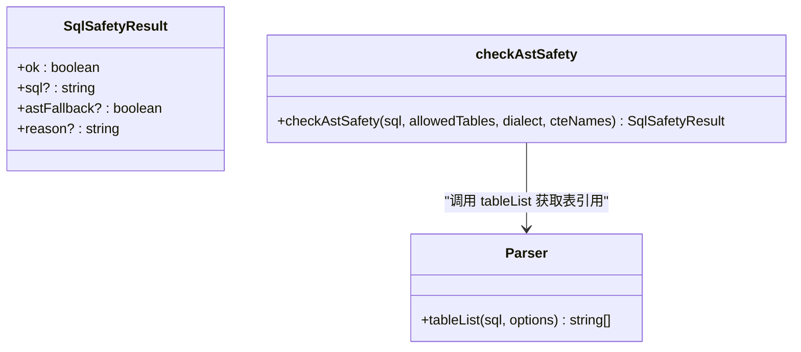
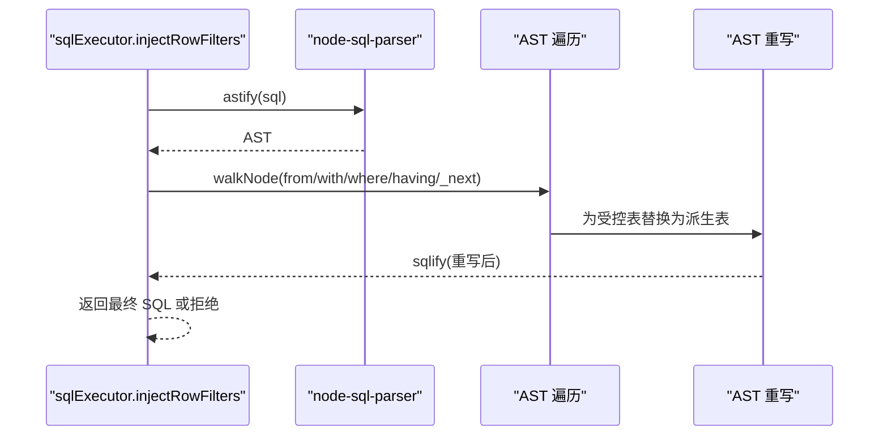
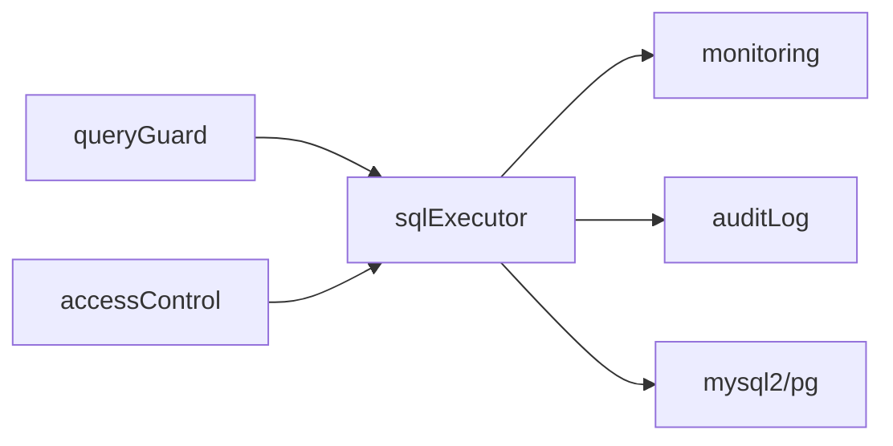

# 安全验证

<cite>
**本文引用的文件**
- [sqlExecutor.ts](file://server/query/sqlExecutor.ts)
- [queryGuard.ts](file://server/query/queryGuard.ts)
- [accessControl.ts](file://server/auth/accessControl.ts)
- [auditLog.ts](file://server/infra/auditLog.ts)
- [monitoring.ts](file://server/infra/monitoring.ts)
- [sqlExecutor.test.ts](file://server/query/sqlExecutor.test.ts)
</cite>

## 目录
1. [简介](#简介)
2. [项目结构](#项目结构)
3. [核心组件](#核心组件)
4. [架构总览](#架构总览)
5. [详细组件分析](#详细组件分析)
6. [依赖关系分析](#依赖关系分析)
7. [性能考量](#性能考量)
8. [故障排查指南](#故障排查指南)
9. [结论](#结论)
10. [附录](#附录)

## 简介
本文件系统性说明智能问数系统的安全验证体系，覆盖 SQL 安全校验、行级权限控制、敏感信息保护、SQL 注入防护、监控与审计等。重点解析 stripCommentsAndStrings 函数、FORBIDDEN_PATTERN 正则、checkAstSafety 的 AST 验证机制，并给出可操作的排障建议与最佳实践。

## 项目结构
安全能力由多个模块协同实现：
- SQL 安全执行层：负责语法/关键字/表名白名单/AST 复核、行级权限注入、EXPLAIN 防线、超时与结果截断。
- 输入净化与上下文过滤：对自然语言提问进行注入特征检测与控制字符清理；在 LLM 上下文阶段剔除敏感列。
- 访问控制（ACL）：按组织/部门/用户维度限制数据源可见性。
- 审计与监控：全链路落账与 Prometheus 指标埋点，支撑安全事件追踪与告警。

图表来源
- [sqlExecutor.ts:291-387](file://server/query/sqlExecutor.ts#L291-L387)
- [queryGuard.ts:35-53](file://server/query/queryGuard.ts#L35-L53)
- [auditLog.ts:38-61](file://server/infra/auditLog.ts#L38-L61)
- [monitoring.ts:92-133](file://server/infra/monitoring.ts#L92-L133)

章节来源
- [sqlExecutor.ts:1-120](file://server/query/sqlExecutor.ts#L1-L120)
- [queryGuard.ts:1-101](file://server/query/queryGuard.ts#L1-L101)
- [accessControl.ts:1-108](file://server/auth/accessControl.ts#L1-L108)
- [auditLog.ts:1-62](file://server/infra/auditLog.ts#L1-L62)
- [monitoring.ts:1-153](file://server/infra/monitoring.ts#L1-L153)

## 核心组件
- SQL 安全校验与执行：validateSelectSql、injectRowFilters、checkAstSafety、stripCommentsAndStrings、extractTableRefs、extractCteNames、injectMysqlMaxExecTime、explainGuard 等。
- 输入净化与敏感列过滤：sanitizeQuestion、containsInjection、filterSensitiveColumns。
- 访问控制：canAccessDataSource、checkDataSourceAccess。
- 审计与监控：writeAudit、observeAudit、observeExplainGuard、observeSqlExec。

章节来源
- [sqlExecutor.ts:155-387](file://server/query/sqlExecutor.ts#L155-L387)
- [queryGuard.ts:12-101](file://server/query/queryGuard.ts#L12-L101)
- [accessControl.ts:18-73](file://server/auth/accessControl.ts#L18-L73)
- [auditLog.ts:10-61](file://server/infra/auditLog.ts#L10-L61)
- [monitoring.ts:63-133](file://server/infra/monitoring.ts#L63-L133)

## 架构总览
下图展示一次“问数”请求从输入到执行的全链路安全控制点：

图表来源
- [sqlExecutor.ts:291-387](file://server/query/sqlExecutor.ts#L291-L387)
- [sqlExecutor.ts:396-489](file://server/query/sqlExecutor.ts#L396-L489)
- [sqlExecutor.ts:629-662](file://server/query/sqlExecutor.ts#L629-L662)
- [auditLog.ts:38-61](file://server/infra/auditLog.ts#L38-L61)
- [monitoring.ts:92-133](file://server/infra/monitoring.ts#L92-L133)

## 详细组件分析

### SQL 安全校验流程（语法解析、关键字过滤、表名白名单）
- 预处理：剥离注释与字符串字面量，避免干扰后续匹配；PG 方言保留双引号标识符。
- 关键字过滤：使用 FORBIDDEN_PATTERN 整词匹配，拒绝写/DDL/管理类关键字。
- 语句形态：仅允许 SELECT 开头；WITH 开头的 CTE 放行交由 AST 强校验。
- 表引用提取：extractTableRefs 基于 FROM/JOIN 的正则扫描，兼容子查询与逗号多表；排除 CTE 别名。
- 白名单校验：表名必须属于 allowedTables；未引用任何表直接拒绝。
- AST 二道防线：checkAstSafety 使用 node-sql-parser 解析，强制只读且表引用在白名单内；解析失败时 fail-open 但标记 astFallback，供审计记录。
- 敏感列拒绝：对裸列名做整词匹配，命中即拒绝。
- 强制 LIMIT：无 LIMIT 追加 MAX_ROWS；有 LIMIT 则 clamp 到上限，并适配 MySQL/PG 方言差异。
- 输出：返回可能被改写（追加/调整 LIMIT）的最终 SQL，以及是否发生 AST 回退的标志。

图表来源
- [sqlExecutor.ts:174-182](file://server/query/sqlExecutor.ts#L174-L182)
- [sqlExecutor.ts:159-163](file://server/query/sqlExecutor.ts#L159-L163)
- [sqlExecutor.ts:194-235](file://server/query/sqlExecutor.ts#L194-L235)
- [sqlExecutor.ts:242-266](file://server/query/sqlExecutor.ts#L242-L266)
- [sqlExecutor.ts:291-387](file://server/query/sqlExecutor.ts#L291-L387)

章节来源
- [sqlExecutor.ts:155-387](file://server/query/sqlExecutor.ts#L155-L387)
- [sqlExecutor.test.ts:280-329](file://server/query/sqlExecutor.test.ts#L280-L329)

### stripCommentsAndStrings 函数详解
- 作用：移除块注释、行注释与字符串字面量，避免其中的关键字干扰结构校验。
- 方言差异：MySQL 模式下将双引号段视为字符串并剥离；PG 模式下保留双引号段（标识符），防止误拦合法 PG SQL。
- 影响范围：后续关键字匹配、表引用提取、AST 解析均基于该预处理结果。

章节来源
- [sqlExecutor.ts:174-182](file://server/query/sqlExecutor.ts#L174-L182)
- [sqlExecutor.test.ts:201-213](file://server/query/sqlExecutor.test.ts#L201-L213)

### FORBIDDEN_PATTERN 正则与关键字策略
- 设计原则：拒绝写/DDL/管理类关键字，同时避开 SELECT 内部合法出现的词（如 DESC）。
- 覆盖范围：insert/update/delete/drop/alter/truncate/create/grant/revoke/rename/lock/unlock/exec/execute/outfile/infile/dumpfile/procedure/explain/handler/install/uninstall/kill/shutdown/analyze/optimize/repair/checksum/flush/reset/purge/binlog/prepare/deallocate/release/savepoint/rollback/commit/begin/xa 等。
- 位置：用于 validateSelectSql 中 on stripped/withoutTrailing 文本的整词匹配。

章节来源
- [sqlExecutor.ts:155-163](file://server/query/sqlExecutor.ts#L155-L163)
- [sqlExecutor.ts:322-334](file://server/query/sqlExecutor.ts#L322-L334)

### checkAstSafety 的 AST 验证机制
- 解析器：node-sql-parser，按方言（MySQL/PostgreSQL）解析 SQL 为 AST。
- 规则：
  - 语句类型必须为 select；否则拒绝。
  - 所有表引用必须在 allowedTables 白名单内；CTE 别名需排除。
  - 解析失败时 fail-open 并标记 astFallback，由路由侧审计记录。
- 集成：在正则防线之后执行，作为“第二道防线”。

图表来源
- [sqlExecutor.ts:242-266](file://server/query/sqlExecutor.ts#L242-L266)

章节来源
- [sqlExecutor.ts:237-266](file://server/query/sqlExecutor.ts#L237-L266)
- [sqlExecutor.test.ts:300-329](file://server/query/sqlExecutor.test.ts#L300-L329)

### 行级权限控制（谓词注入、子查询包裹、CTE 支持）
- 目标：将受控表的真实读取路径替换为带 WHERE 谓词的派生表，确保即使 SQL 被改写也能强制应用行级过滤。
- 机制：
  - 解析 AST，递归遍历 FROM/JOIN、子查询、UNION 链、WHERE/HAVING 中的子查询表达式。
  - 对每个受控表生成 SELECT * FROM (SELECT * FROM t WHERE pred) AS t 的派生表节点，并回填 AST。
  - WITH CTE：不仅主查询，CTE 定义内的真实表也递归注入，避免越权。
  - 注入失败（谓词非法或 AST 回写失败）fail-closed，拒绝执行。
- 方言：支持 MySQL 与 PG。

图表来源
- [sqlExecutor.ts:396-489](file://server/query/sqlExecutor.ts#L396-L489)

章节来源
- [sqlExecutor.ts:396-489](file://server/query/sqlExecutor.ts#L396-L489)
- [sqlExecutor.test.ts:331-410](file://server/query/sqlExecutor.test.ts#L331-L410)

### 敏感信息保护（敏感列拒绝、数据脱敏、访问审计）
- 敏感列拒绝：在 validateSelectSql 中对裸列名进行整词匹配，命中即拒绝执行。
- 上下文脱敏：filterSensitiveColumns 在 LLM 上下文阶段剔除疑似敏感列（密码、密钥、令牌、身份证等），降低提示注入与泄露风险。
- 访问审计：writeAudit 记录每次请求的状态、耗时、执行的 SQL、行数等，便于事后追溯。
- 监控指标：observeAudit/observeSqlExec/observeExplainGuard 提供 Prometheus 指标，支撑可视化与告警。

章节来源
- [sqlExecutor.ts:355-363](file://server/query/sqlExecutor.ts#L355-L363)
- [queryGuard.ts:71-101](file://server/query/queryGuard.ts#L71-L101)
- [auditLog.ts:10-61](file://server/infra/auditLog.ts#L10-L61)
- [monitoring.ts:92-133](file://server/infra/monitoring.ts#L92-L133)

### SQL 注入防护策略（输入验证、输出编码、异常处理）
- 输入验证：sanitizeQuestion 去除控制字符、检测提示注入特征、限制最大长度；历史消息同样净化并限制轮次。
- 输出编码：服务端不直接拼接用户输入到 SQL；SQL 由 LLM 生成后经严格校验与 AST 复核，再执行。
- 异常处理：
  - 正则/AST 解析失败：AST 失败时 fail-open 但标记审计；CTE 场景解析失败 fail-closed。
  - 行级权限注入失败：fail-closed，拒绝执行。
  - EXPLAIN 失败：fail-open，记录错误指标但不阻断正常查询。

章节来源
- [queryGuard.ts:27-69](file://server/query/queryGuard.ts#L27-L69)
- [sqlExecutor.ts:247-266](file://server/query/sqlExecutor.ts#L247-L266)
- [sqlExecutor.ts:350-353](file://server/query/sqlExecutor.ts#L350-L353)
- [sqlExecutor.ts:481-488](file://server/query/sqlExecutor.ts#L481-L488)
- [sqlExecutor.ts:656-662](file://server/query/sqlExecutor.ts#L656-L662)

### 安全监控、威胁检测、应急响应
- 监控指标：
  - 审计计数与耗时：nl2sql_requests_total、nl2sql_duration_seconds。
  - SQL 执行耗时：sql_execute_duration_seconds。
  - EXPLAIN 防线：sql_explain_guard_total（passed/blocked/error）。
- 威胁检测：
  - 输入注入特征匹配（queryGuard）。
  - 关键字/非只读/越权表/敏感列拦截（sqlExecutor）。
  - EXPLAIN 预估扫描超阈值拦截（sqlExecutor）。
- 应急响应：
  - 审计日志持久化，支持回溯与取证。
  - 指标告警（Prometheus/Grafana）联动，快速定位异常流量与攻击模式。
  - 可通过环境变量动态调整阈值（如 SQL_EXPLAIN_MAX_ROWS、DS_POOL_*、QUERY_TIMEOUT_*）。

章节来源
- [monitoring.ts:21-78](file://server/infra/monitoring.ts#L21-L78)
- [monitoring.ts:92-133](file://server/infra/monitoring.ts#L92-L133)
- [sqlExecutor.ts:531-662](file://server/query/sqlExecutor.ts#L531-L662)
- [auditLog.ts:38-61](file://server/infra/auditLog.ts#L38-L61)

## 依赖关系分析
- 模块耦合：
  - sqlExecutor 依赖 queryGuard 的输入净化与敏感列过滤策略（通过上层调用组合）。
  - sqlExecutor 依赖 monitoring 与 auditLog 进行指标与审计。
  - accessControl 独立于 SQL 执行，但在路由层决定数据源可见性，与 scope/row-filters 正交。
- 外部依赖：
  - node-sql-parser：AST 解析与重写。
  - mysql2/pg：数据库连接池与执行。
  - prom-client：指标采集。

图表来源
- [sqlExecutor.ts:11-21](file://server/query/sqlExecutor.ts#L11-L21)
- [monitoring.ts:11-15](file://server/infra/monitoring.ts#L11-L15)
- [auditLog.ts:6-8](file://server/infra/auditLog.ts#L6-L8)
- [accessControl.ts:9-11](file://server/auth/accessControl.ts#L9-L11)

章节来源
- [sqlExecutor.ts:11-21](file://server/query/sqlExecutor.ts#L11-L21)
- [monitoring.ts:1-153](file://server/infra/monitoring.ts#L1-L153)
- [auditLog.ts:1-62](file://server/infra/auditLog.ts#L1-L62)
- [accessControl.ts:1-108](file://server/auth/accessControl.ts#L1-L108)

## 性能考量
- 连接池与超时：
  - 按场景（interactive/chain/export）配置连接池容量与超时，避免大任务挤占交互资源。
  - MySQL 通过 MAX_EXECUTION_TIME hint 注入服务端超时；PG 通过 statement_timeout。
- 结果截断：MAX_ROWS 默认 100000，防止 OOM 与慢查询拖垮业务库。
- EXPLAIN 防线：预估扫描超阈值拦截，保护后端稳定性；失败时 fail-open 不阻断正常查询。
- 缓存与降级：结合缓存与演示模式，提升可用性（不在本节展开具体实现）。

章节来源
- [sqlExecutor.ts:41-117](file://server/query/sqlExecutor.ts#L41-L117)
- [sqlExecutor.ts:118-153](file://server/query/sqlExecutor.ts#L118-L153)
- [sqlExecutor.ts:531-662](file://server/query/sqlExecutor.ts#L531-L662)

## 故障排查指南
- 常见拒绝原因与定位：
  - “SQL 为空或格式无效”：检查传入 SQL 是否为字符串且非空。
  - “只允许单条 SELECT 语句”：确认分号位置与语句数量。
  - “SQL 包含不允许的关键字”：核对 FORBIDDEN_PATTERN 覆盖的词表。
  - “SQL 未引用任何数据表/越权表引用”：检查 extractTableRefs 与 allowedTables。
  - “WITH 查询无法完成语法解析确认”：CTE 场景下 AST 解析失败会拒绝。
  - “SQL 涉及受保护的敏感字段”：检查敏感列匹配逻辑。
  - “行级权限注入失败”：谓词非法或 AST 回写失败，需修正谓词。
  - “EXPLAIN_GUARD 拦截”：预估扫描过大，增加筛选条件或调整阈值。
- 调试建议：
  - 查看审计日志 executed_sql 与 status，定位失败阶段。
  - 观察监控指标 sql_explain_guard_total 与 nl2sql_duration_seconds。
  - 针对 PG 方言，确认 stripCommentsAndStrings 与 LIMIT 改写行为符合预期。

章节来源
- [sqlExecutor.ts:291-387](file://server/query/sqlExecutor.ts#L291-L387)
- [sqlExecutor.ts:396-489](file://server/query/sqlExecutor.ts#L396-L489)
- [sqlExecutor.ts:629-662](file://server/query/sqlExecutor.ts#L629-L662)
- [auditLog.ts:38-61](file://server/infra/auditLog.ts#L38-L61)
- [monitoring.ts:92-133](file://server/infra/monitoring.ts#L92-L133)

## 结论
本系统通过“正则+AST 双层校验、表名白名单、敏感列拒绝、行级权限强制注入、EXPLAIN 防线、超时与结果截断、审计与监控”构建纵深防御体系。关键函数 stripCommentsAndStrings、FORBIDDEN_PATTERN、checkAstSafety 分别承担预处理、关键字拦截与语法树复核职责，配合 injectRowFilters 实现对复杂 SQL（含 CTE/子查询/UNION）的行级安全控制。建议在部署中合理配置阈值与环境变量，并结合审计与监控建立常态化安全运营流程。

## 附录
- 环境变量参考（节选）：
  - DS_POOL_MAX：数据源连接池最大容量。
  - DS_POOL_INTERACTIVE/CHAIN/EXPORT：场景化连接池配额。
  - QUERY_TIMEOUT_INTERACTIVE_MS/CHAIN_MS/EXPORT_MS：场景化执行超时。
  - SQL_EXPLAIN_MAX_ROWS：EXPLAIN 防线阈值（0=关闭）。
- 相关测试用例：
  - 表引用提取、AST 安全校验、行级权限注入、PG 方言行为、CTE 名提取、MySQL 超时 hint 注入等均在测试文件中覆盖。

章节来源
- [sqlExecutor.ts:41-117](file://server/query/sqlExecutor.ts#L41-L117)
- [sqlExecutor.ts:118-153](file://server/query/sqlExecutor.ts#L118-L153)
- [sqlExecutor.test.ts:280-479](file://server/query/sqlExecutor.test.ts#L280-L479)