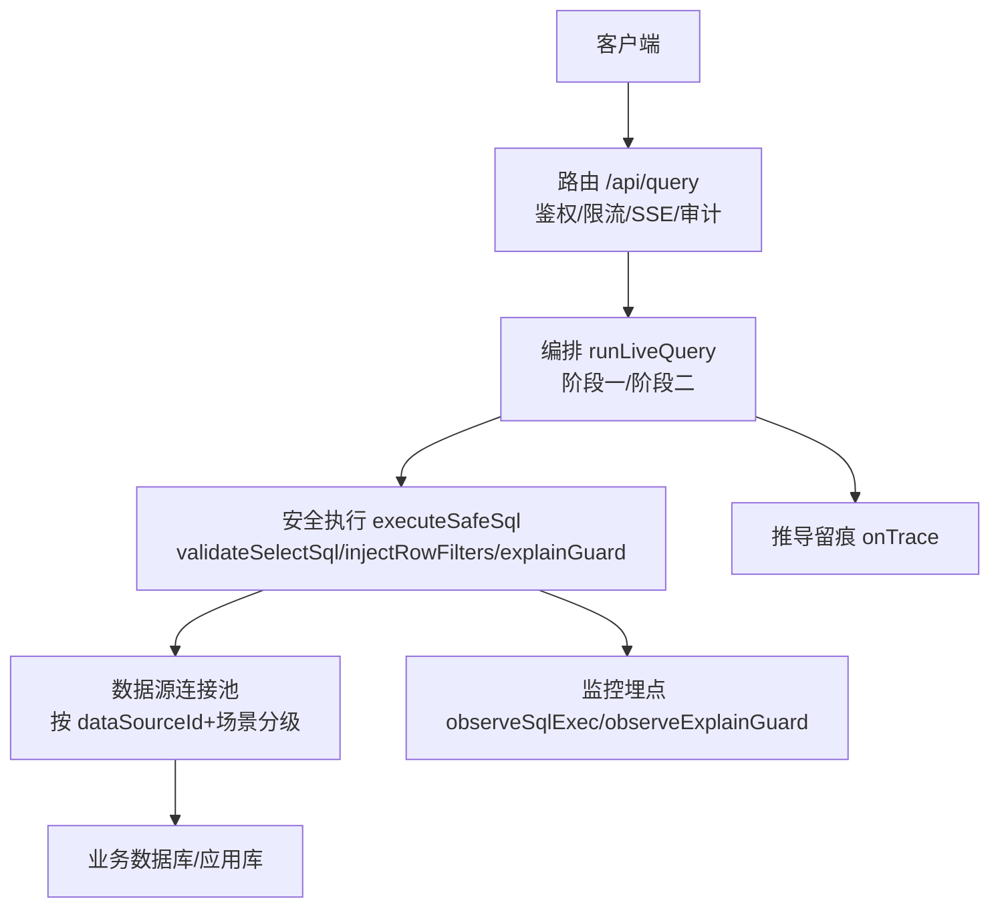
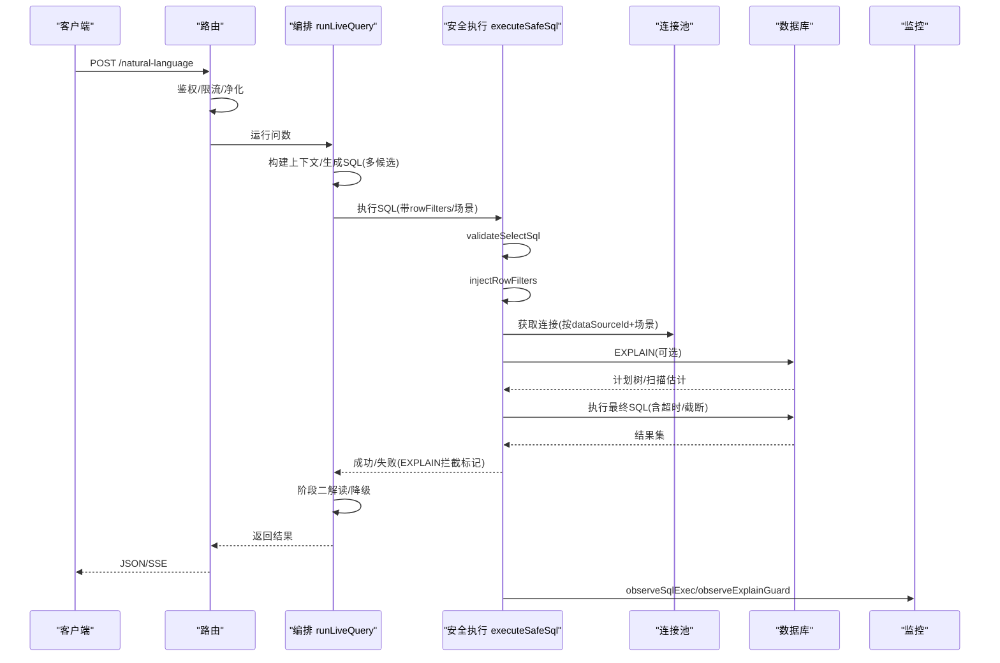
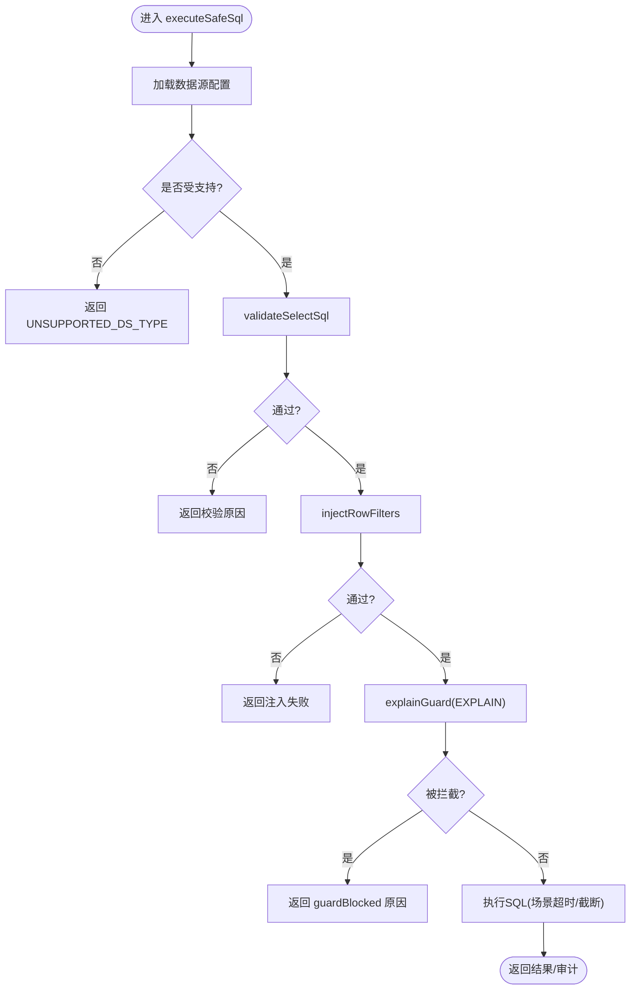
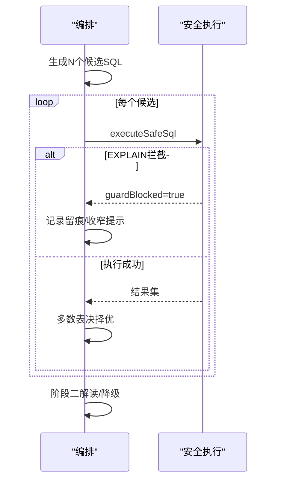
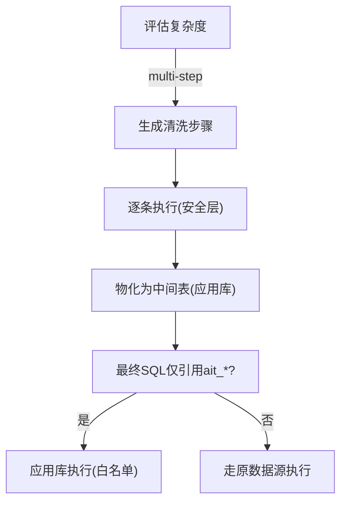
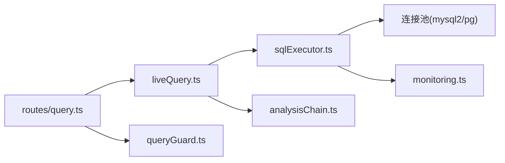

# 查询执行

<cite>
**本文引用的文件**
- [sqlExecutor.ts](file://server/query/sqlExecutor.ts)
- [liveQuery.ts](file://server/query/liveQuery.ts)
- [analysisChain.ts](file://server/query/analysisChain.ts)
- [queryGuard.ts](file://server/query/queryGuard.ts)
- [monitoring.ts](file://server/infra/monitoring.ts)
- [routes/query.ts](file://server/routes/query.ts)
</cite>

## 目录
1. [简介](#简介)
2. [项目结构](#项目结构)
3. [核心组件](#核心组件)
4. [架构总览](#架构总览)
5. [详细组件分析](#详细组件分析)
6. [依赖关系分析](#依赖关系分析)
7. [性能与超时](#性能与超时)
8. [故障排查指南](#故障排查指南)
9. [结论](#结论)

## 简介
本文件面向“智能问数”的 SQL 查询执行子系统，系统性说明从用户提问到真实数据源执行的完整生命周期：连接获取、语句准备、参数绑定、执行调度；并重点阐述安全过滤机制（SQL 注入防护、敏感词检测、危险操作拦截）、查询超时与资源清理、批量执行与事务管理策略、错误回滚方案，以及日志记录、执行时间统计与性能指标收集。文档特别聚焦以下关键流程与函数：
- validateSelectSql：SQL 安全检查主流程
- injectRowFilters：行级权限注入
- explainGuard：EXPLAIN 防线机制
- 场景化连接池与超时控制
- 监控埋点与审计

## 项目结构
查询执行链路主要分布在 server/query 下的若干模块：
- sqlExecutor.ts：安全执行层，负责校验、注入、连接池、执行与 EXPLAIN 防线
- liveQuery.ts：编排层，串联 LLM 生成 SQL、安全执行、结果解读与重试
- analysisChain.ts：复杂分析的中间表清洗链，复用安全执行层
- queryGuard.ts：输入净化与上下文敏感列过滤
- monitoring.ts：Prometheus 指标埋点
- routes/query.ts：HTTP 入口，鉴权、限流、SSE、审计与调用编排

图表来源
- [routes/query.ts:47-200](file://server/routes/query.ts#L47-L200)
- [liveQuery.ts:189-749](file://server/query/liveQuery.ts#L189-L749)
- [sqlExecutor.ts:734-832](file://server/query/sqlExecutor.ts#L734-L832)
- [monitoring.ts:63-78](file://server/infra/monitoring.ts#L63-L78)

章节来源
- [routes/query.ts:47-200](file://server/routes/query.ts#L47-L200)
- [liveQuery.ts:189-749](file://server/query/liveQuery.ts#L189-L749)
- [sqlExecutor.ts:734-832](file://server/query/sqlExecutor.ts#L734-L832)
- [monitoring.ts:63-78](file://server/infra/monitoring.ts#L63-L78)

## 核心组件
- 安全执行层（sqlExecutor.ts）
  - 校验：validateSelectSql（只读 SELECT-only、白名单表、敏感列拒绝、单语句、强制 LIMIT、长度限制、关键字黑名单）
  - 注入：injectRowFilters（AST 包裹派生表，递归覆盖子查询/UNION/CTE）
  - 防线：explainGuard（EXPLAIN 预估扫描行数阈值拦截）
  - 执行：executeSafeSqlImpl（获取连接池、MySQL hint 超时、PG statement_timeout、结果截断）
  - 连接池：getDsPool（按 dataSourceId + 场景分级缓存，支持失效）
  - 工具：stripCommentsAndStrings、extractTableRefs、extractCteNames、repairTablePrefixes、injectMysqlMaxExecTime
- 编排层（liveQuery.ts）
  - 多候选并行生成、Self-Consistency 多数表决
  - 失败回喂 LLM 重试（最多 3 次），EXPLAIN 拦截仅给一次收窄机会
  - 阶段二解读与降级
- 清洗链（analysisChain.ts）
  - 复杂度评估、中间表物化、应用库执行（ait_* 白名单）
- 输入净化（queryGuard.ts）
  - 控制字符过滤、提示注入特征拒绝、历史净化、敏感列过滤
- 监控（monitoring.ts）
  - SQL 执行耗时直方图、EXPLAIN 防线计数、HTTP 请求耗时等

章节来源
- [sqlExecutor.ts:169-489](file://server/query/sqlExecutor.ts#L169-L489)
- [sqlExecutor.ts:629-832](file://server/query/sqlExecutor.ts#L629-L832)
- [liveQuery.ts:189-749](file://server/query/liveQuery.ts#L189-L749)
- [analysisChain.ts:97-384](file://server/query/analysisChain.ts#L97-L384)
- [queryGuard.ts:27-101](file://server/query/queryGuard.ts#L27-L101)
- [monitoring.ts:63-133](file://server/infra/monitoring.ts#L63-L133)

## 架构总览
查询执行的生命周期如下：
1. HTTP 入口鉴权、限流、输入净化（sanitizeQuestion/sanitizeHistory）
2. 构建上下文（Schema Linking、知识库、指标、铁律规则、few-shot）
3. 阶段一：LLM 生成 SQL（模板匹配优先，否则自由生成），多候选并行
4. 安全执行：validateSelectSql → injectRowFilters → explainGuard → 实际执行
5. 阶段二：真实 rows 摘要回喂 LLM 生成解读（失败则规则降级）
6. 全程推导留痕（onTrace）与 SSE 事件推送
7. 监控埋点（executeSafeSql 耗时、EXPLAIN 防线状态）

图表来源
- [routes/query.ts:47-200](file://server/routes/query.ts#L47-L200)
- [liveQuery.ts:189-749](file://server/query/liveQuery.ts#L189-L749)
- [sqlExecutor.ts:734-832](file://server/query/sqlExecutor.ts#L734-L832)
- [monitoring.ts:63-133](file://server/infra/monitoring.ts#L63-L133)

## 详细组件分析

### 安全执行层（sqlExecutor.ts）
- 连接获取与场景化配额
  - getDsPool：按 dataSourceId + 场景（interactive/chain/export）创建或复用连接池；PG 使用 statement_timeout，MySQL 使用 connectTimeout 与 multipleStatements=false
  - dsPoolScenarioMax/scenarioTimeoutMs：场景化容量与超时配置（环境变量优先）
- 语句准备与安全校验
  - validateSelectSql：
    - 剥离注释与字符串，保留原始字面量用于后续 LIMIT 追加
    - 单语句、SELECT-only、禁止 INTO、关键字黑名单、表名白名单、AST 复核（node-sql-parser）
    - 敏感列拒绝（整词匹配）
    - 强制 LIMIT（无则追加，有则 clamp 到 MAX_ROWS）
    - 返回 { ok, sql, astFallback }
  - repairTablePrefixes：修复 LLM 臆造的前缀（如 tbl_/t_）
  - stripCommentsAndStrings/extractTableRefs/extractCteNames：辅助解析
- 行级权限注入
  - injectRowFilters：
    - 基于 AST 将 FROM t 改写为 FROM (SELECT * FROM t WHERE <谓词>) AS t
    - 递归覆盖子查询、UNION、WITH CTE 中的真实表引用
    - 解析失败或回写失败 fail-closed
- EXPLAIN 防线
  - explainGuard：
    - MySQL：EXPLAIN FORMAT=JSON 解析 rows_examined_per_scan/estimated_rows
    - PG：EXPLAIN (FORMAT JSON) 解析 Plan Rows
    - 超过阈值拦截（guardBlocked=true），失败 fail-open 放行
- 执行调度与超时
  - executeSafeSqlImpl：
    - 文件数据源改道应用库执行（跳过 EXPLAIN）
    - MySQL：注入 MAX_EXECUTION_TIME hint（不改变 finalSql 展示口径）
    - PG：statement_timeout 由连接池设置
    - 结果截断至 maxRows，标记 truncated
- 连接池失效
  - invalidateExecutorPool：配置变更时关闭并清空对应池

图表来源
- [sqlExecutor.ts:734-832](file://server/query/sqlExecutor.ts#L734-L832)
- [sqlExecutor.ts:291-489](file://server/query/sqlExecutor.ts#L291-L489)
- [sqlExecutor.ts:629-662](file://server/query/sqlExecutor.ts#L629-L662)

章节来源
- [sqlExecutor.ts:41-153](file://server/query/sqlExecutor.ts#L41-L153)
- [sqlExecutor.ts:169-489](file://server/query/sqlExecutor.ts#L169-L489)
- [sqlExecutor.ts:629-832](file://server/query/sqlExecutor.ts#L629-L832)

### 编排层（liveQuery.ts）
- 多候选并行生成与 Self-Consistency 多数表决
- EXPLAIN 拦截仅给一次收窄自纠错机会，二次拦截终止
- 阶段二解读失败规则降级
- 中间表引用（ait_*）在应用库执行（executeOnAppDb）

图表来源
- [liveQuery.ts:396-628](file://server/query/liveQuery.ts#L396-L628)
- [sqlExecutor.ts:629-662](file://server/query/sqlExecutor.ts#L629-L662)

章节来源
- [liveQuery.ts:189-749](file://server/query/liveQuery.ts#L189-L749)

### 清洗链（analysisChain.ts）
- 复杂度评估：启发式信号 + LLM 分类（simple/multi-step）
- 每步清洗 SQL 经安全执行层执行，结果物化为应用库 ait_* 中间表
- 最终 SQL 若仅引用 ait_*，则在应用库执行（executeOnAppDb），严格白名单校验
- TTL 清理与配额管理

图表来源
- [analysisChain.ts:97-384](file://server/query/analysisChain.ts#L97-L384)

章节来源
- [analysisChain.ts:97-384](file://server/query/analysisChain.ts#L97-L384)

### 输入净化与安全（queryGuard.ts）
- sanitizeQuestion：控制字符过滤、注入特征拒绝、长度截断
- sanitizeHistory：丢弃 assistant 输出、逐条注入检测、最多 5 轮
- filterSensitiveColumns：从 Schema 中剔除疑似敏感列（密码/密钥/身份证等）

章节来源
- [queryGuard.ts:27-101](file://server/query/queryGuard.ts#L27-L101)

### 监控与审计（monitoring.ts）
- SQL 执行耗时直方图（sqlExecDuration）
- EXPLAIN 防线计数（sqlExplainGuard：passed/blocked/error）
- HTTP 接口耗时、LLM 调用耗时与 token 用量
- 所有埋点 fail-open，不影响业务

章节来源
- [monitoring.ts:63-133](file://server/infra/monitoring.ts#L63-L133)

## 依赖关系分析
- 路由层依赖编排层与执行层，统一入口保证安全
- 编排层依赖执行层进行真实 SQL 执行，并处理重试与降级
- 执行层依赖连接池与驱动（mysql2/pg），并通过监控上报指标
- 清洗链复用执行层的安全能力，确保中间表物化过程安全可控

图表来源
- [routes/query.ts:47-200](file://server/routes/query.ts#L47-L200)
- [liveQuery.ts:189-749](file://server/query/liveQuery.ts#L189-L749)
- [sqlExecutor.ts:734-832](file://server/query/sqlExecutor.ts#L734-L832)
- [monitoring.ts:63-133](file://server/infra/monitoring.ts#L63-L133)
- [analysisChain.ts:97-384](file://server/query/analysisChain.ts#L97-L384)
- [queryGuard.ts:27-101](file://server/query/queryGuard.ts#L27-L101)

章节来源
- [routes/query.ts:47-200](file://server/routes/query.ts#L47-L200)
- [liveQuery.ts:189-749](file://server/query/liveQuery.ts#L189-L749)
- [sqlExecutor.ts:734-832](file://server/query/sqlExecutor.ts#L734-L832)
- [monitoring.ts:63-133](file://server/infra/monitoring.ts#L63-L133)
- [analysisChain.ts:97-384](file://server/query/analysisChain.ts#L97-L384)
- [queryGuard.ts:27-101](file://server/query/queryGuard.ts#L27-L101)

## 性能与超时
- 连接池容量与场景化配额
  - dsPoolMax/dsPoolScenarioMax：根据环境或并发估算动态调整，防止打爆数据源
- 场景化超时
  - scenarioTimeoutMs：interactive/chain/export 不同默认值，支持环境变量覆盖
  - MySQL：MAX_EXECUTION_TIME hint（仅作用于 SELECT，CTE 场景定位主 SELECT 注入）
  - PG：statement_timeout 在连接池创建时设置
- 结果截断
  - MAX_ROWS：默认上限，避免 OOM；结果集切片并标记 truncated
- EXPLAIN 防线
  - 预估扫描行数超阈值拦截，保护业务库；失败 fail-open 放行
- 监控指标
  - sqlExecDuration：安全执行耗时直方图
  - sqlExplainGuard：EXPLAIN 防线状态计数

章节来源
- [sqlExecutor.ts:41-153](file://server/query/sqlExecutor.ts#L41-L153)
- [sqlExecutor.ts:531-662](file://server/query/sqlExecutor.ts#L531-L662)
- [monitoring.ts:63-78](file://server/infra/monitoring.ts#L63-L78)

## 故障排查指南
- 常见拦截原因
  - 非 SELECT-only、包含危险关键字、引用未授权表、敏感列命中、SQL 过长、多条语句
  - EXPLAIN 预估扫描行数超限
- 调试建议
  - 查看 onTrace 留痕（SQL 生成、执行、EXPLAIN 拦截）
  - 检查 monitor 指标（sqlExecDuration、sqlExplainGuard）
  - 确认 rowFilters 是否正确注入（AST 包裹派生表）
  - 对于 CTE 场景，确认 MAX_EXECUTION_TIME hint 注入位置
- 资源清理
  - 数据源配置变更后调用 invalidateExecutorPool 释放连接池
  - 中间表 TTL 定时清理（每小时）

章节来源
- [sqlExecutor.ts:291-489](file://server/query/sqlExecutor.ts#L291-L489)
- [sqlExecutor.ts:629-662](file://server/query/sqlExecutor.ts#L629-L662)
- [analysisChain.ts:386-411](file://server/query/analysisChain.ts#L386-L411)
- [liveQuery.ts:553-628](file://server/query/liveQuery.ts#L553-L628)

## 结论
该查询执行系统以“安全优先、可观测、可扩展”为核心设计原则：
- 安全：多层校验（正则+AST）、行级权限注入、EXPLAIN 防线、敏感列拒绝、关键字黑名单
- 可观测：全链路留痕、Prometheus 指标、审计落账
- 可扩展：场景化连接池与超时、中间表清洗链、模板匹配与自由生成双路径
通过 validateSelectSql、injectRowFilters、explainGuard 三大关键机制，系统在保障数据安全的同时，兼顾了性能与可用性，并为复杂分析提供了中间表物化能力。