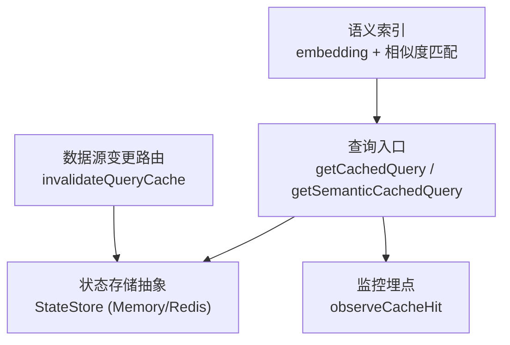
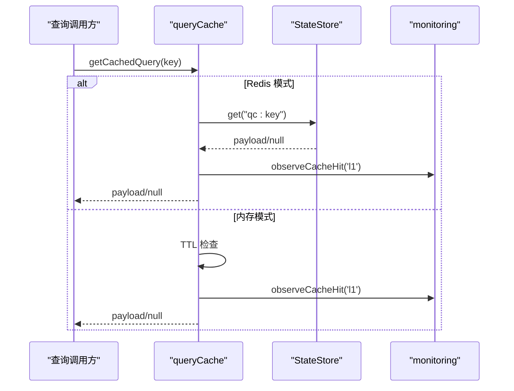
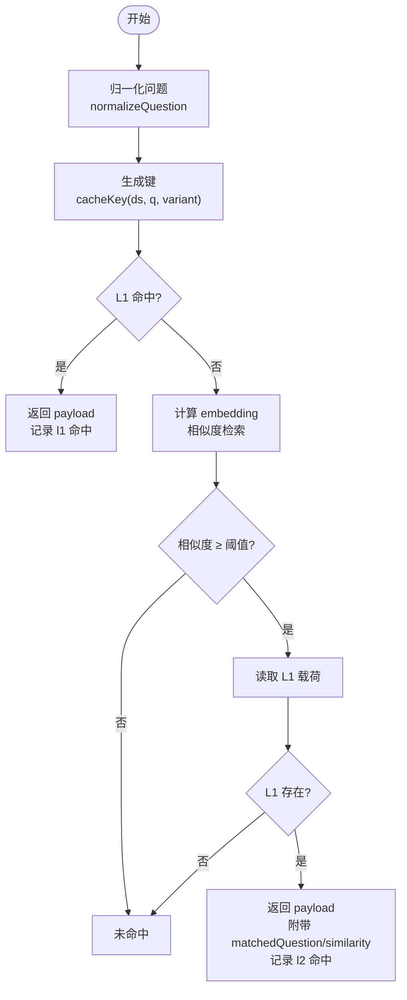
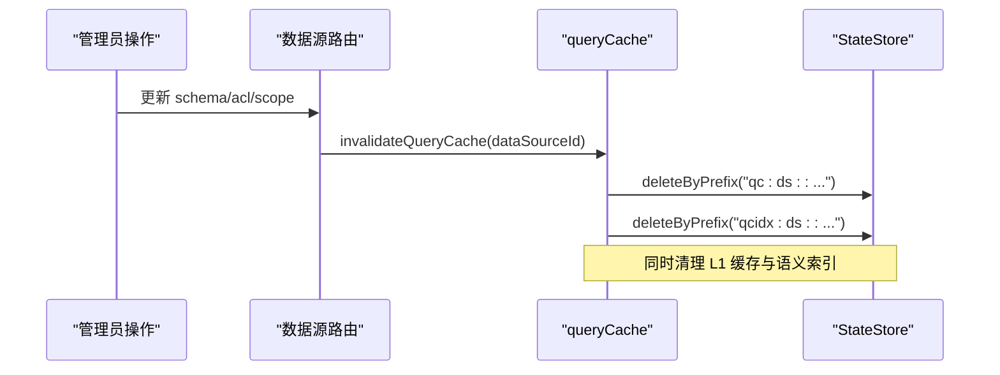
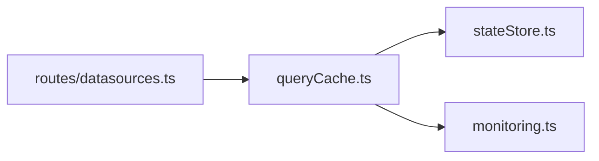

# 查询缓存

<cite>
**本文引用的文件**
- [queryCache.ts](file://server/query/queryCache.ts)
- [queryCache.test.ts](file://server/query/queryCache.test.ts)
- [stateStore.ts](file://server/infra/stateStore.ts)
- [monitoring.ts](file://server/infra/monitoring.ts)
- [datasources.ts](file://server/routes/datasources.ts)
</cite>

## 目录
1. [简介](#简介)
2. [项目结构](#项目结构)
3. [核心组件](#核心组件)
4. [架构总览](#架构总览)
5. [详细组件分析](#详细组件分析)
6. [依赖关系分析](#依赖关系分析)
7. [性能与容量规划](#性能与容量规划)
8. [故障排查指南](#故障排查指南)
9. [结论](#结论)
10. [附录](#附录)

## 简介
本文件面向“查询缓存”子系统，系统性说明其策略设计、键生成规则、失效机制、监控与容量规划方法，以及分布式多实例共享与一致性保证方案。重点覆盖：
- LRU 近似淘汰、TTL 管理、内存限制
- 缓存键生成：查询指纹、参数哈希、上下文标识（数据源、模型变体）
- 失效机制：主动失效、被动过期、依赖失效
- 命中率监控、性能分析与容量规划
- 分布式缓存、多实例共享、一致性保障
- 与数据源变更的同步、缓存预热、内存占用控制

## 项目结构
查询缓存位于 server/query/queryCache.ts，依赖 infra/stateStore.ts 提供统一的状态存储抽象（内存或 Redis），并通过 infra/monitoring.ts 输出 Prometheus 指标。数据源变更路由在 server/routes/datasources.ts 中触发缓存失效。

图表来源
- [queryCache.ts:43-90](file://server/query/queryCache.ts#L43-L90)
- [stateStore.ts:10-23](file://server/infra/stateStore.ts#L10-L23)
- [monitoring.ts:37-44](file://server/infra/monitoring.ts#L37-L44)
- [datasources.ts:808-813](file://server/routes/datasources.ts#L808-L813)

章节来源
- [queryCache.ts:1-254](file://server/query/queryCache.ts#L1-L254)
- [stateStore.ts:1-219](file://server/infra/stateStore.ts#L1-L219)
- [monitoring.ts:1-153](file://server/infra/monitoring.ts#L1-L153)
- [datasources.ts:800-971](file://server/routes/datasources.ts#L800-L971)

## 核心组件
- 归一化与键生成：normalizeQuestion、cacheKey
- L1 精确命中：getCachedQuery、setCachedQuery
- L2 语义命中：getSemanticCachedQuery、语义索引读写
- 失效：invalidateQueryCache（按数据源前缀清理）
- 存储抽象：StateStore（MemoryStateStore / RedisStateStore）
- 监控：nl2sql_cache_hits_total（l1/l2）

章节来源
- [queryCache.ts:22-34](file://server/query/queryCache.ts#L22-L34)
- [queryCache.ts:43-90](file://server/query/queryCache.ts#L43-L90)
- [queryCache.ts:93-114](file://server/query/queryCache.ts#L93-L114)
- [queryCache.ts:116-253](file://server/query/queryCache.ts#L116-L253)
- [stateStore.ts:10-23](file://server/infra/stateStore.ts#L10-L23)
- [monitoring.ts:37-44](file://server/infra/monitoring.ts#L37-L44)

## 架构总览
系统采用两级缓存：
- L1：基于归一化问题的精确键命中（进程内 Map 或 Redis）
- L2：基于 embedding 的语义相似命中（阈值≥0.95），命中后回读 L1 载荷并返回原问题与相似度

图表来源
- [queryCache.ts:43-62](file://server/query/queryCache.ts#L43-L62)
- [stateStore.ts:108-115](file://server/infra/stateStore.ts#L108-L115)
- [monitoring.ts:102-107](file://server/infra/monitoring.ts#L102-L107)

## 详细组件分析

### 缓存策略与算法
- L1 精确命中
  - 键：dataSourceId + normalizeQuestion(question) + variant（可选，用于隔离不同模型/引擎）
  - 存储：内存 Map（默认）或 Redis（配置 REDIS_URL）
  - TTL：默认 30 分钟，可通过 QUERY_CACHE_TTL_MINUTES 覆盖
  - 内存限制：内存模式下当条目数达到 MAX_ENTRIES（200）时，淘汰最早写入的条目（近似 FIFO/LRU 行为）
  - 负载大小限制：Redis 模式下超过 REDIS_MAX_PAYLOAD_BYTES（200KB）不缓存，避免大结果集撑爆内存库
- L2 语义命中
  - 通过 embedding 计算问题向量，与同数据源+同变体的语义索引进行余弦相似度比较
  - 阈值 semanticCacheThreshold() 默认 0.95，可被 SEMANTIC_CACHE_THRESHOLD 覆盖
  - 命中后需校验对应 L1 条目仍存在，防止索引残留误命中
  - 语义索引每数据源+变体最多保留 SEMANTIC_INDEX_MAX（100）条；短问题（归一化后长度小于 SEMANTIC_MIN_QUESTION_LEN=4）不参与语义缓存

图表来源
- [queryCache.ts:22-34](file://server/query/queryCache.ts#L22-L34)
- [queryCache.ts:43-62](file://server/query/queryCache.ts#L43-L62)
- [queryCache.ts:116-178](file://server/query/queryCache.ts#L116-L178)
- [queryCache.ts:231-253](file://server/query/queryCache.ts#L231-L253)

章节来源
- [queryCache.ts:12-20](file://server/query/queryCache.ts#L12-L20)
- [queryCache.ts:43-90](file://server/query/queryCache.ts#L43-L90)
- [queryCache.ts:116-178](file://server/query/queryCache.ts#L116-L178)
- [queryCache.ts:231-253](file://server/query/queryCache.ts#L231-L253)

### 缓存键生成规则
- 基础键：dataSourceId::normalizeQuestion(question)
- 上下文标识：variant（如 "engine:model"），用于隔离不同模型/引擎下的结果，避免跨模型串用缓存
- 归一化：小写、去除空白与常见标点、截断至固定长度，确保同义改写能命中同一键

章节来源
- [queryCache.ts:22-34](file://server/query/queryCache.ts#L22-L34)

### 失效机制
- 主动失效：数据源结构/配置/口径/范围变更后，调用 invalidateQueryCache(dataSourceId)，按前缀删除 qc:* 和 qcidx:* 键
- 被动过期：TTL 到期自动失效（内存模式在读取时检查并删除；Redis 模式由服务端 TTL 控制）
- 依赖失效：语义索引与 L1 解耦但强一致校验——L2 命中后必须回读 L1 载荷，若不存在则视为未命中

图表来源
- [datasources.ts:808-813](file://server/routes/datasources.ts#L808-L813)
- [datasources.ts:863-866](file://server/routes/datasources.ts#L863-L866)
- [queryCache.ts:93-114](file://server/query/queryCache.ts#L93-L114)
- [stateStore.ts:129-138](file://server/infra/stateStore.ts#L129-L138)

章节来源
- [queryCache.ts:93-114](file://server/query/queryCache.ts#L93-L114)
- [datasources.ts:808-813](file://server/routes/datasources.ts#L808-L813)
- [datasources.ts:863-866](file://server/routes/datasources.ts#L863-L866)

### 分布式缓存与一致性
- 多实例共享：启用 REDIS_URL 后，所有实例共用同一 StateStore（Redis），实现跨进程/实例共享缓存与语义索引
- 一致性保证：
  - 失效通过前缀扫描删除，保证数据源变更后全局可见
  - L2 命中以 L1 为最终事实源，避免索引残留导致的不一致
  - 写失败/读异常均 fail-open，不影响主链路可用性
- 启动预热：warmStateStore 等待 Redis 连接就绪，减少冷启动窗口导致的缓存未命中

章节来源
- [stateStore.ts:165-219](file://server/infra/stateStore.ts#L165-L219)
- [queryCache.ts:43-90](file://server/query/queryCache.ts#L43-L90)
- [queryCache.ts:180-223](file://server/query/queryCache.ts#L180-L223)

### 与数据源变更的同步
- 在数据源 schema/acl/scope 等关键元数据变更后，路由层显式调用 invalidateQueryCache，确保缓存与数据源状态一致
- 同时清理语义索引，避免旧向量继续参与相似度匹配

章节来源
- [datasources.ts:808-813](file://server/routes/datasources.ts#L808-L813)
- [datasources.ts:863-866](file://server/routes/datasources.ts#L863-L866)
- [queryCache.ts:93-114](file://server/query/queryCache.ts#L93-L114)

### 缓存预热策略
- 启动预热：warmStateStore 在进程启动时探测 Redis 连通性，降低首次请求的冷启动延迟
- 业务预热：可在数据源变更后对高频问题进行 setCachedQuery 预填充（结合业务热点统计）

章节来源
- [stateStore.ts:195-213](file://server/infra/stateStore.ts#L195-L213)
- [queryCache.ts:64-90](file://server/query/queryCache.ts#L64-L90)

### 内存占用控制
- 内存模式：
  - 最大条目数 MAX_ENTRIES=200，超出时淘汰最早写入的条目
  - 语义索引每数据源+变体上限 SEMANTIC_INDEX_MAX=100
- Redis 模式：
  - 单条载荷上限 REDIS_MAX_PAYLOAD_BYTES=200KB，超过不缓存
  - 使用 TTL 控制生命周期，避免长期驻留
- 向量压缩：语义索引将 embedding 值四舍五入到 4 位小数，减小 Redis 体积

章节来源
- [queryCache.ts:12-20](file://server/query/queryCache.ts#L12-L20)
- [queryCache.ts:78-89](file://server/query/queryCache.ts#L78-L89)
- [queryCache.ts:131-134](file://server/query/queryCache.ts#L131-L134)
- [queryCache.ts:206-213](file://server/query/queryCache.ts#L206-L213)

## 依赖关系分析
- queryCache 依赖 stateStore 提供统一的 get/setEx/deleteByPrefix 能力
- 监控模块提供 nl2sql_cache_hits_total 指标，区分 l1/l2 层
- 数据源路由在关键变更点触发 invalidateQueryCache，形成“变更→失效”闭环

图表来源
- [queryCache.ts:8-10](file://server/query/queryCache.ts#L8-L10)
- [stateStore.ts:10-23](file://server/infra/stateStore.ts#L10-L23)
- [monitoring.ts:37-44](file://server/infra/monitoring.ts#L37-L44)
- [datasources.ts:808-813](file://server/routes/datasources.ts#L808-L813)

章节来源
- [queryCache.ts:8-10](file://server/query/queryCache.ts#L8-L10)
- [stateStore.ts:10-23](file://server/infra/stateStore.ts#L10-L23)
- [monitoring.ts:37-44](file://server/infra/monitoring.ts#L37-L44)
- [datasources.ts:808-813](file://server/routes/datasources.ts#L808-L813)

## 性能与容量规划
- 命中率监控
  - 指标名：nl2sql_cache_hits_total，标签 layer=l1|l2
  - 通过 Grafana/Prometheus 观察 L1/L2 命中率趋势，评估缓存有效性
- 性能分析
  - 结合 nl2sql_duration_seconds 直方图，对比缓存命中与未命中的端到端耗时差异
  - 关注 L2 相似度阈值调整对命中率与准确率的影响
- 容量规划
  - 内存模式：根据并发与热点规模设定 MAX_ENTRIES，避免频繁淘汰
  - Redis 模式：依据结果集大小设置 REDIS_MAX_PAYLOAD_BYTES，避免大对象阻塞
  - 语义索引：SEMANTIC_INDEX_MAX 控制索引规模，平衡召回率与存储成本
- 预热与降级
  - 启动预热 warmStateStore 降低冷启动抖动
  - 外部依赖（Redis/embedding）异常时 fail-open，保证服务可用

章节来源
- [monitoring.ts:37-44](file://server/infra/monitoring.ts#L37-L44)
- [monitoring.ts:102-107](file://server/infra/monitoring.ts#L102-L107)
- [stateStore.ts:195-213](file://server/infra/stateStore.ts#L195-L213)
- [queryCache.ts:12-20](file://server/query/queryCache.ts#L12-L20)
- [queryCache.ts:131-134](file://server/query/queryCache.ts#L131-L134)

## 故障排查指南
- 缓存未命中
  - 检查是否命中 L1：确认键生成是否正确（数据源隔离、variant 隔离）
  - 检查 TTL：是否已过期或被主动失效
  - 检查 Redis：是否启用且连接正常，warmStateStore 是否成功
- 语义命中异常
  - 检查 embedding 服务是否可用，不可用时自动降级为仅 L1
  - 检查相似度阈值是否过高导致漏命中，或过低导致误命中
- 内存/存储压力
  - 内存模式：观察 cache.size 接近 MAX_ENTRIES 的频率，考虑扩容或调优 TTL
  - Redis 模式：检查大结果集是否超过 REDIS_MAX_PAYLOAD_BYTES，必要时拆分或禁用缓存

章节来源
- [queryCache.ts:43-90](file://server/query/queryCache.ts#L43-L90)
- [queryCache.ts:168-178](file://server/query/queryCache.ts#L168-L178)
- [stateStore.ts:165-213](file://server/infra/stateStore.ts#L165-L213)

## 结论
该查询缓存采用“L1 精确 + L2 语义”的双层架构，兼顾高命中率与准确性。通过 StateStore 抽象实现内存/Redis 双后端，支持多实例共享与水平扩展。TTL、内存限制与负载大小限制共同保障稳定性；数据源变更触发主动失效，保证一致性。监控指标与预热机制为性能优化与容量规划提供依据。

## 附录
- 环境变量
  - QUERY_CACHE_TTL_MINUTES：缓存 TTL（分钟），默认 30
  - SEMANTIC_CACHE_THRESHOLD：语义相似度阈值，默认 0.95
  - REDIS_URL：启用 Redis 外置缓存
- 测试要点
  - 归一化与键隔离：不同数据源/变体不应串用缓存
  - 失效正确性：数据源变更后缓存应被清理
  - 语义缓存：同义改写命中，无关问题不命中，embedding 不可用时降级

章节来源
- [queryCache.ts:12-20](file://server/query/queryCache.ts#L12-L20)
- [queryCache.ts:126-129](file://server/query/queryCache.ts#L126-L129)
- [queryCache.test.ts:20-63](file://server/query/queryCache.test.ts#L20-L63)
- [queryCache.test.ts:65-137](file://server/query/queryCache.test.ts#L65-L137)