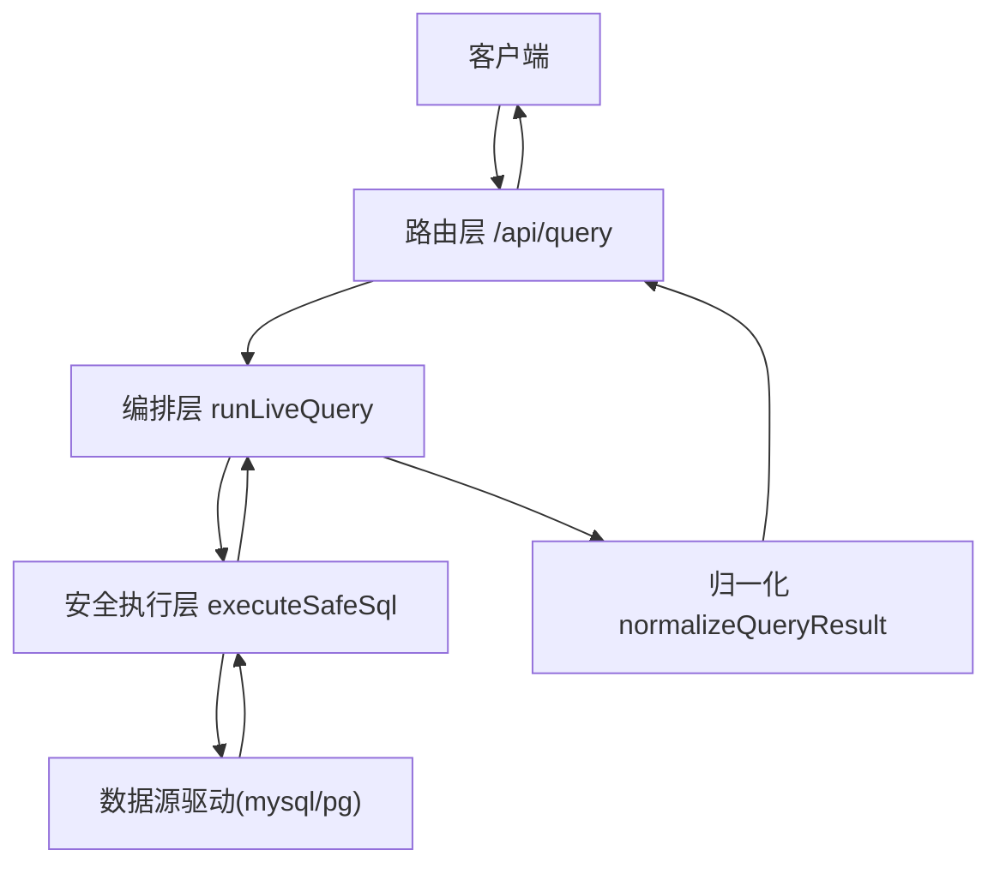
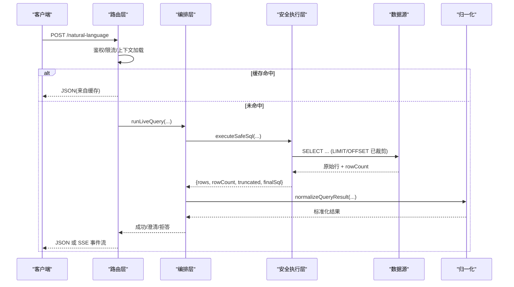
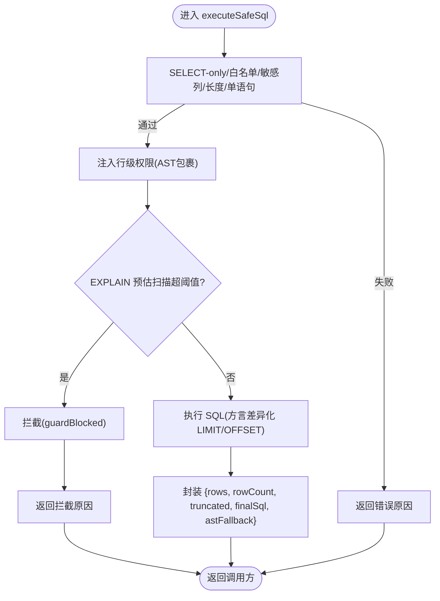
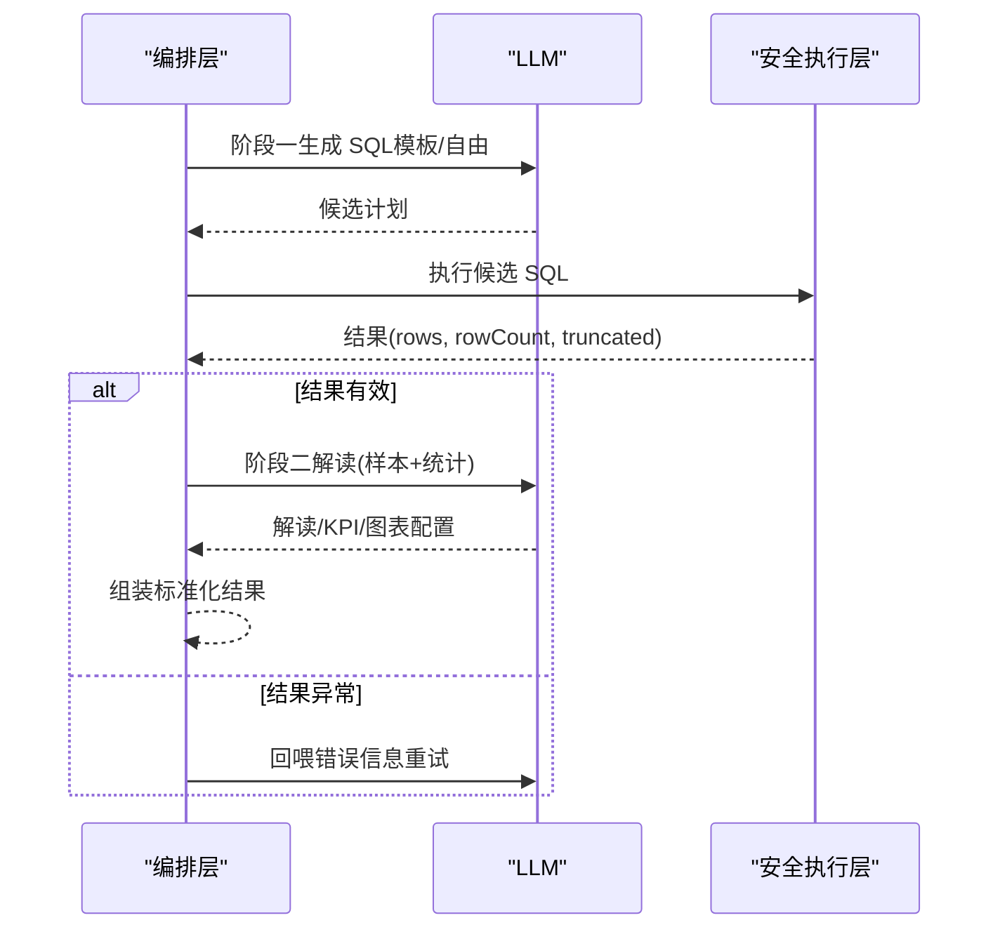
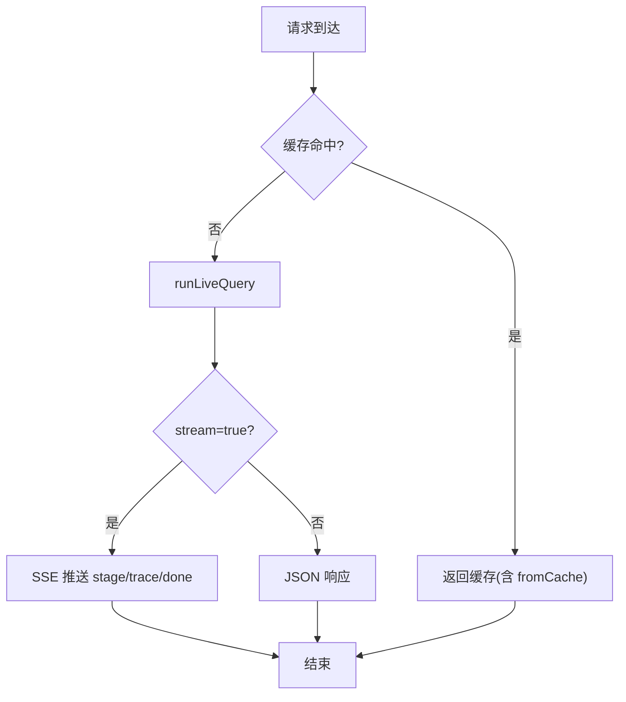
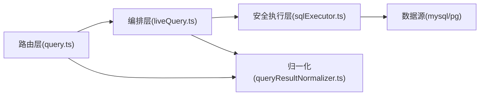

# 结果处理

<cite>
**本文引用的文件**
- [sqlExecutor.ts](file://server/query/sqlExecutor.ts)
- [liveQuery.ts](file://server/query/liveQuery.ts)
- [query.ts](file://server/routes/query.ts)
- [queryResultNormalizer.ts](file://src/utils/queryResultNormalizer.ts)
</cite>

## 目录
1. [简介](#简介)
2. [项目结构](#项目结构)
3. [核心组件](#核心组件)
4. [架构总览](#架构总览)
5. [详细组件分析](#详细组件分析)
6. [依赖关系分析](#依赖关系分析)
7. [性能与大数据量处理](#性能与大数据量处理)
8. [故障排查指南](#故障排查指南)
9. [结论](#结论)
10. [附录](#附录)

## 简介
本文件聚焦“查询结果处理”的完整链路：从数据库执行、安全校验、结果集转换到前端展示，覆盖数据类型映射、分页策略、排序与聚合、压缩与序列化、传输优化、内存与性能调优，以及 MAX_ROWS 限制与 truncated 标记的使用。目标是帮助读者理解系统如何安全、高效地返回查询结果，并在大数据场景下保持稳定与可观测性。

## 项目结构
围绕结果处理的关键代码分布在以下模块：
- 安全执行层（SQL 校验、注入行级权限、EXPLAIN 防线、连接池与超时）
- 编排层（两阶段真实查询：生成 SQL → 执行 → 解读）
- 路由层（SSE 流式响应、缓存命中、DLP 脱敏、审计）
- 归一化层（统一 LLM/后端结果结构，字段矫正与校验）

图表来源
- [query.ts:47-393](file://server/routes/query.ts#L47-L393)
- [liveQuery.ts:189-749](file://server/query/liveQuery.ts#L189-L749)
- [sqlExecutor.ts:734-832](file://server/query/sqlExecutor.ts#L734-L832)
- [queryResultNormalizer.ts:78-147](file://src/utils/queryResultNormalizer.ts#L78-L147)

章节来源
- [query.ts:47-393](file://server/routes/query.ts#L47-L393)
- [liveQuery.ts:189-749](file://server/query/liveQuery.ts#L189-L749)
- [sqlExecutor.ts:734-832](file://server/query/sqlExecutor.ts#L734-L832)
- [queryResultNormalizer.ts:78-147](file://src/utils/queryResultNormalizer.ts#L78-L147)

## 核心组件
- 安全执行层
  - SELECT-only 白名单校验、敏感列拒绝、表引用白名单、AST 复核
  - 行级权限注入（AST 包裹派生表）
  - EXPLAIN 防线拦截大扫描
  - MySQL/PG 方言差异的 LIMIT/OFFSET 强制裁剪
  - 连接池按数据源+场景分级，独立超时
  - 结果对象包含 rows、rowCount、truncated、finalSql、astFallback
- 编排层
  - 两阶段真实查询：阶段一生 SQL（模板/自由生成），阶段二基于真实行采样生成解读
  - 多候选并行生成与多数表决（Self-Consistency）
  - 空结果快速路径；异常模式回退重试
- 路由层
  - SSE 流式事件（stage/trace/done/error）
  - 精确与语义缓存命中直接返回
  - DLP 脱敏（按角色掩码敏感列）
  - 审计与慢查询标记
- 归一化层
  - 统一 LLM/后端结果结构，兼容 data/rows
  - 图表配置校验、KPI 指标规范化
  - 列名映射与中文表头兜底

章节来源
- [sqlExecutor.ts:291-387](file://server/query/sqlExecutor.ts#L291-L387)
- [sqlExecutor.ts:396-489](file://server/query/sqlExecutor.ts#L396-L489)
- [sqlExecutor.ts:531-662](file://server/query/sqlExecutor.ts#L531-L662)
- [sqlExecutor.ts:734-832](file://server/query/sqlExecutor.ts#L734-L832)
- [liveQuery.ts:189-749](file://server/query/liveQuery.ts#L189-L749)
- [query.ts:47-393](file://server/routes/query.ts#L47-L393)
- [queryResultNormalizer.ts:78-147](file://src/utils/queryResultNormalizer.ts#L78-L147)

## 架构总览
下图展示了从请求到结果返回的端到端流程，包括安全执行、结果归一化、流式传输与缓存命中。

图表来源
- [query.ts:47-393](file://server/routes/query.ts#L47-L393)
- [liveQuery.ts:189-749](file://server/query/liveQuery.ts#L189-L749)
- [sqlExecutor.ts:734-832](file://server/query/sqlExecutor.ts#L734-L832)

## 详细组件分析

### 安全执行层：SQL 校验、权限注入与结果封装
- 输入校验与白名单
  - 仅允许 SELECT（含 WITH CTE），禁止写操作关键字，长度限制，单语句
  - 表引用白名单校验，CTE 名排除
  - AST 二次校验（node-sql-parser），失败时降级为正则白名单并标记 astFallback
- 行级权限注入
  - 将受控表替换为带 WHERE 谓词的派生表，递归覆盖子查询/UNION/CTE
  - 注入失败 fail-closed，确保不泄露受限行
- EXPLAIN 防线
  - MySQL：解析 FORMAT=JSON 或树形文本中的 rows_examined_per_scan/estimated_rows/rows=N
  - PG：解析 PLAN TREE 中 Scan 节点的 Plan Rows
  - 超过阈值则拦截，返回 guardBlocked 标记，供上层做定向提示
- 方言与 LIMIT/OFFSET 裁剪
  - MySQL：支持 LIMIT offset,count；PG/Greenplum：仅支持 LIMIT n OFFSET m
  - 无 LIMIT 时追加 MAX_ROWS；有 LIMIT 时裁剪 count ≤ MAX_ROWS
- 连接池与超时
  - 按 dataSourceId + 场景（interactive/chain/export）分级建池
  - 场景化超时：交互 15s、链 120s、导出 60s；MySQL 注入 MAX_EXECUTION_TIME hint
- 结果对象
  - rows：数组（Record<string, any>[]）
  - rowCount：实际行数
  - truncated：是否被 MAX_ROWS 截断
  - finalSql：最终执行 SQL
  - astFallback：是否因 AST 解析失败走正则兜底

图表来源
- [sqlExecutor.ts:291-387](file://server/query/sqlExecutor.ts#L291-L387)
- [sqlExecutor.ts:396-489](file://server/query/sqlExecutor.ts#L396-L489)
- [sqlExecutor.ts:531-662](file://server/query/sqlExecutor.ts#L531-L662)
- [sqlExecutor.ts:734-832](file://server/query/sqlExecutor.ts#L734-L832)

章节来源
- [sqlExecutor.ts:291-387](file://server/query/sqlExecutor.ts#L291-L387)
- [sqlExecutor.ts:396-489](file://server/query/sqlExecutor.ts#L396-L489)
- [sqlExecutor.ts:531-662](file://server/query/sqlExecutor.ts#L531-L662)
- [sqlExecutor.ts:734-832](file://server/query/sqlExecutor.ts#L734-L832)

### 编排层：两阶段真实查询与结果组装
- 阶段一：生成 SQL
  - 模板匹配优先（确定性拼装），否则自由生成
  - 多候选并行生成，首个成功即执行；多候选收集后多数表决
  - 数据自省（可选）：轻量执行确认取值后再定稿
- 执行与自纠错
  - 执行失败或结果为空/全 NULL 时回喂 LLM 重试（最多 3 次）
  - EXPLAIN 拦截仅给一次收窄机会，二次拦截终止自纠错
- 阶段二：解读与 KPI
  - 使用真实行采样（前 15 行）+ 列统计回喂 LLM
  - 若 LLM 失败，规则化降级生成解读与 KPI
- 结果包装
  - 构建 chartConfig、columnNames、yAxisNames
  - 空结果快速路径：直接返回真实结论，不走阶段二

图表来源
- [liveQuery.ts:189-749](file://server/query/liveQuery.ts#L189-L749)

章节来源
- [liveQuery.ts:189-749](file://server/query/liveQuery.ts#L189-L749)

### 路由层：SSE 流式、缓存与 DLP
- SSE 流式
  - 阶段事件 stage（understanding/executed/introspecting/analyzing）
  - 推导步骤 trace（旁路落库，支持断线续传）
  - done/error 终态事件
- 缓存命中
  - 精确键（dataSourceId + query + variant）与语义近似命中
  - 命中直接返回，减少 LLM 与 DB 压力
- DLP 脱敏
  - 响应出口按角色掩码敏感列（VIEWER/ANALYST 掩码，ADMIN 豁免）
- 审计与慢查询
  - 记录 executedSql、rowCount、durationMs
  - SLOW 标记：执行时长 > 3s 或行数 > 100k

图表来源
- [query.ts:47-393](file://server/routes/query.ts#L47-L393)
- [query.ts:395-456](file://server/routes/query.ts#L395-L456)

章节来源
- [query.ts:47-393](file://server/routes/query.ts#L47-L393)
- [query.ts:395-456](file://server/routes/query.ts#L395-L456)

### 归一化层：数据结构转换与类型矫正
- 兼容 LLM 输出字段 data/rows
- 图表配置校验（类型白名单、轴键合法性）
- KPI 指标规范化（label/value/change/trend/subtext）
- 列名映射与中文表头兜底（结合 schema 与 plan 的 columnNames/yAxisNames）
- 返回统一结构 NormalizedQueryResult，便于前端消费

章节来源
- [queryResultNormalizer.ts:78-147](file://src/utils/queryResultNormalizer.ts#L78-L147)

## 依赖关系分析
- 路由层依赖编排层与安全执行层，并通过归一化层统一结果结构
- 编排层依赖安全执行层进行真实执行，同时依赖 LLM 服务进行 SQL 生成与解读
- 安全执行层依赖数据源驱动（mysql2/pg）与 EXPLAIN 能力
- 归一化层对上游结果进行结构收敛，屏蔽差异

图表来源
- [query.ts:47-393](file://server/routes/query.ts#L47-L393)
- [liveQuery.ts:189-749](file://server/query/liveQuery.ts#L189-L749)
- [sqlExecutor.ts:734-832](file://server/query/sqlExecutor.ts#L734-L832)
- [queryResultNormalizer.ts:78-147](file://src/utils/queryResultNormalizer.ts#L78-L147)

章节来源
- [query.ts:47-393](file://server/routes/query.ts#L47-L393)
- [liveQuery.ts:189-749](file://server/query/liveQuery.ts#L189-L749)
- [sqlExecutor.ts:734-832](file://server/query/sqlExecutor.ts#L734-L832)
- [queryResultNormalizer.ts:78-147](file://src/utils/queryResultNormalizer.ts#L78-L147)

## 性能与大数据量处理
- 分页策略
  - 强制 LIMIT/OFFSET 裁剪至 MAX_ROWS（默认 100000），防止 OOM
  - 当前实现以 LIMIT/OFFSET 为主；游标分页与基于 ID 的分页需在上层业务逻辑中配合（例如在应用层维护 last_id 与 ORDER BY id 条件，再传入 SQL 拼接）
- 排序与聚合
  - 由数据库侧完成（ORDER BY、GROUP BY、窗口函数等），服务端仅负责安全与裁剪
  - 复杂聚合建议通过中间表清洗链（M3）分步计算，降低单次查询复杂度
- 结果压缩与序列化
  - 服务端返回 JSON；SSE 流式推送可减少首屏等待
  - 对于超大结果，建议在应用层实现分页拉取或按需加载（如基于 last_id 的增量查询）
- 内存管理与传输优化
  - 连接池按场景分级，避免资源争用
  - MySQL 注入 MAX_EXECUTION_TIME hint，PG 使用 statement_timeout 控制长事务
  - 阶段二仅使用少量行采样（前 15 行）+ 列统计，降低 LLM 负载
- 最佳实践
  - 始终携带合理筛选条件，避免全表扫描
  - 对宽表启用列级裁剪（Schema Linking 自动 top-N 列注入）
  - 利用 EXPLAIN 防线提前拦截高风险查询
  - 使用语义缓存命中相似问题，显著降低重复开销

[本节为通用指导，不直接分析具体文件]

## 故障排查指南
- 常见错误与定位
  - SQL 被拒绝：检查是否包含非 SELECT 关键字、越权表引用、敏感列
  - EXPLAIN 拦截：根据 reason 增加时间范围/部门/维度等筛选条件
  - 结果为空：检查过滤条件是否过严；可放宽口径或调整维度
  - AST 解析失败：日志中会标记 astFallback，说明正则白名单兜底放行
- 调试建议
  - 查看 finalSql 与 executedSql 对比，确认 LIMIT/OFFSET 是否正确注入
  - 关注审计日志中的 durationMs、rowCount、SLOW 标记
  - 使用 /execute-sql 端点复现实验，逐步缩小问题范围

章节来源
- [query.ts:558-625](file://server/routes/query.ts#L558-L625)
- [sqlExecutor.ts:531-662](file://server/query/sqlExecutor.ts#L531-L662)

## 结论
本系统通过“安全执行层 + 编排层 + 路由层 + 归一化层”的分层设计，实现了查询结果的稳定、安全与高性能交付。MAX_ROWS 限制与 truncated 标记保障了内存与传输安全；EXPLAIN 防线与场景化超时保护了数据源稳定性；SSE 流式与缓存命中提升了用户体验；归一化层屏蔽了上游差异，便于前端统一消费。针对大数据量场景，建议结合应用层游标/ID 分页与中间表清洗链，进一步降低单次查询压力。

[本节为总结，不直接分析具体文件]

## 附录

### 数据类型映射与结果结构
- 数据库类型到 JavaScript 类型
  - 数值型（INT/FLOAT/DECIMAL）→ JavaScript Number
  - 字符串（VARCHAR/TEXT）→ JavaScript String
  - 布尔（BOOLEAN/TINYINT(1)）→ JavaScript Boolean（取决于驱动）
  - 日期时间（DATE/DATETIME/TIMESTAMP）→ JavaScript Date 或 ISO 字符串（取决于驱动）
  - 空值 → null/undefined（驱动行为不同，需在归一化层做防御）
- 结果对象字段
  - rows：数组（Record<string, any>[]）
  - rowCount：number
  - truncated：boolean（是否被 MAX_ROWS 截断）
  - finalSql：string
  - astFallback：boolean（是否 AST 解析失败走正则兜底）

章节来源
- [sqlExecutor.ts:517-525](file://server/query/sqlExecutor.ts#L517-L525)
- [queryResultNormalizer.ts:78-147](file://src/utils/queryResultNormalizer.ts#L78-L147)

### MAX_ROWS 限制机制与 truncated 标记
- MAX_ROWS 默认 100000，用于防止 OOM 与过度传输
- 无 LIMIT 时自动追加；有 LIMIT 时裁剪 count ≤ MAX_ROWS
- truncated 表示结果被截断，前端应提示用户“超出部分已截断”，并可引导分页或加筛

章节来源
- [sqlExecutor.ts:41-42](file://server/query/sqlExecutor.ts#L41-L42)
- [sqlExecutor.ts:364-387](file://server/query/sqlExecutor.ts#L364-L387)
- [sqlExecutor.ts:790-800](file://server/query/sqlExecutor.ts#L790-L800)

### 分页处理算法
- 当前实现：LIMIT/OFFSET 强制裁剪（跨方言适配）
- 游标分页（推荐）：在应用层维护 last_id，结合 ORDER BY id 与 WHERE id < last_id 实现高效翻页
- 基于 ID 的分页：适用于有序主键场景，避免 OFFSET 深翻页的性能退化
- 注意：当前安全执行层不直接提供游标 API，需在上层 SQL 构造时显式传入条件

[本节为通用指导，不直接分析具体文件]

### 排序与聚合的实现
- 排序：ORDER BY 由数据库执行，服务端仅保证安全与 LIMIT
- 聚合：GROUP BY、窗口函数由数据库执行；复杂聚合建议拆分为中间表清洗链（M3）
- 内存排序/流式聚合：由数据库引擎内部实现，服务端无需额外处理

[本节为通用指导，不直接分析具体文件]

### 结果集压缩、序列化与传输优化
- 序列化：JSON 格式；SSE 流式推送减少首屏等待
- 压缩：可在网关层启用 gzip/br（需考虑 CPU 与延迟权衡）
- 传输优化：分页拉取、按需加载、前端虚拟滚动

[本节为通用指导，不直接分析具体文件]

### 大数据量处理与性能调优
- 连接池：按场景分级，避免资源争用
- 超时：MySQL MAX_EXECUTION_TIME hint 与 PG statement_timeout
- 列级裁剪：宽表 top-N 列注入，降低 prompt 与执行成本
- 缓存：精确与语义缓存命中，显著降低重复开销
- 审计：慢查询标记（durationMs > 3s 或 rowCount > 100k）

章节来源
- [sqlExecutor.ts:686-726](file://server/query/sqlExecutor.ts#L686-L726)
- [query.ts:603-625](file://server/routes/query.ts#L603-L625)