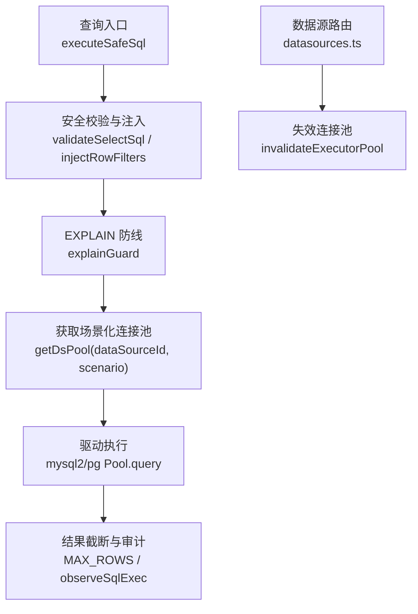
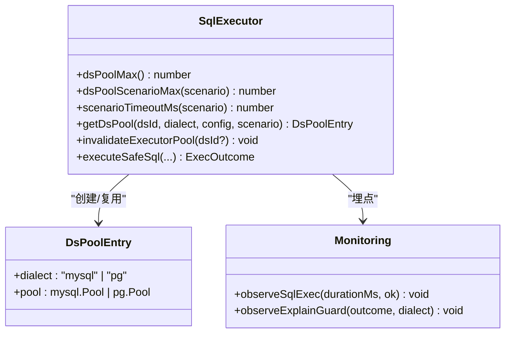
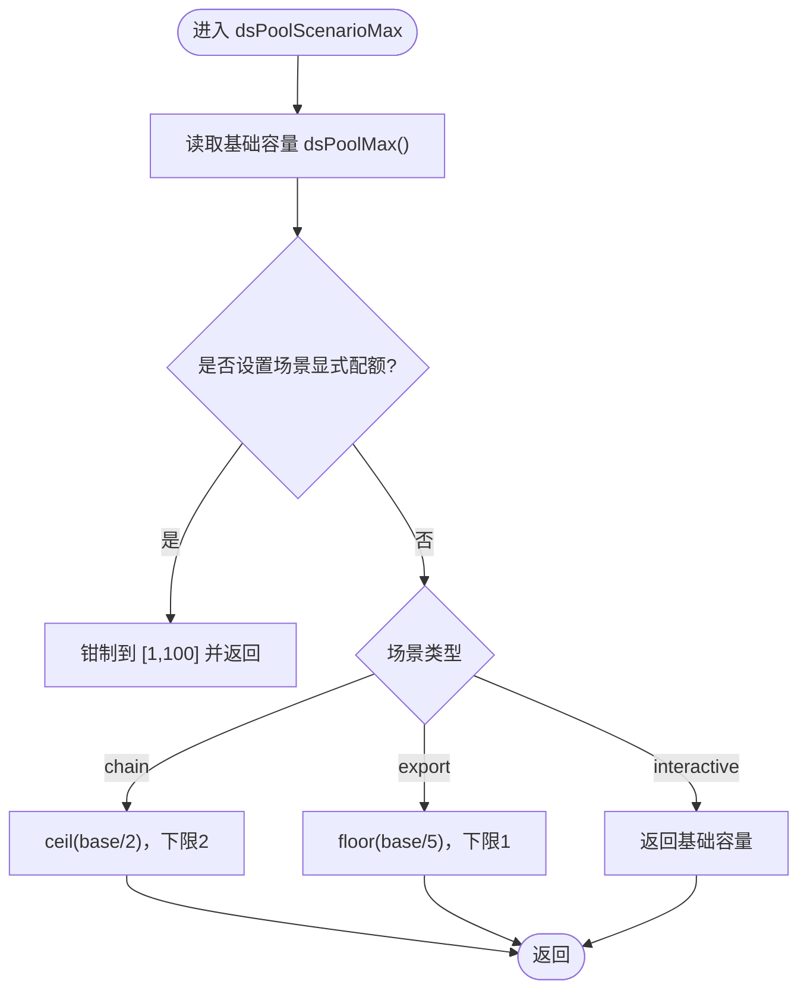
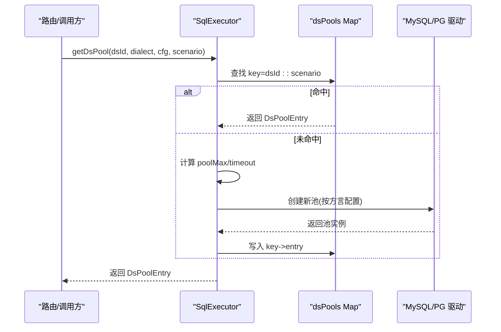
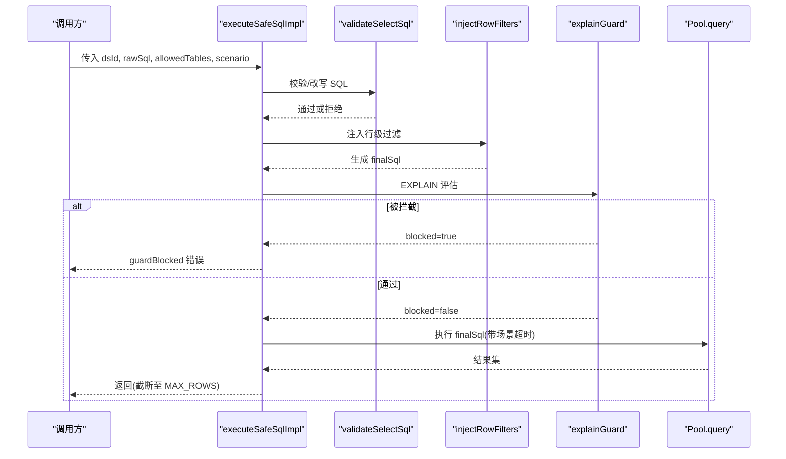
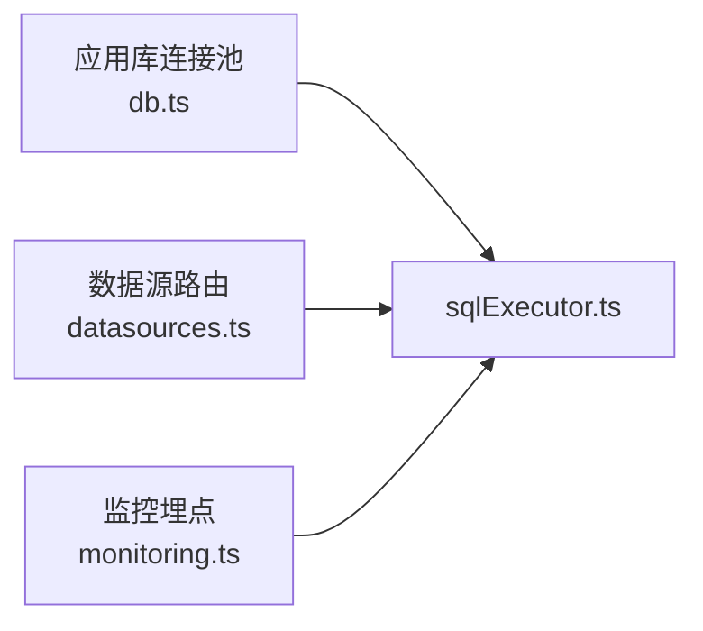

# 连接池管理

<cite>
**本文引用的文件**
- [sqlExecutor.ts](file://server/query/sqlExecutor.ts)
- [sqlExecutorPool.test.ts](file://server/query/sqlExecutorPool.test.ts)
- [datasources.ts](file://server/routes/datasources.ts)
- [db.ts](file://server/infra/db.ts)
- [monitoring.ts](file://server/infra/monitoring.ts)
</cite>

## 目录
1. [简介](#简介)
2. [项目结构](#项目结构)
3. [核心组件](#核心组件)
4. [架构总览](#架构总览)
5. [详细组件分析](#详细组件分析)
6. [依赖关系分析](#依赖关系分析)
7. [性能考量](#性能考量)
8. [故障排查指南](#故障排查指南)
9. [结论](#结论)
10. [附录](#附录)

## 简介
本文件系统性说明智能问数据分析系统的“数据源连接池”设计与实现，覆盖以下主题：
- 连接池配置策略：最大连接数、超时设置、重试机制（含服务端执行时限）
- 场景化连接池设计：interactive/chain/export 三类场景的独立配额与超时
- 生命周期管理：创建、复用、销毁、失效与恢复
- 安全与健壮性：连接泄漏防护、健康检查、负载均衡
- 监控指标、性能调优与容量规划最佳实践
- 重点函数 dsPoolScenarioMax 的工作原理、隔离机制与资源竞争处理

## 项目结构
连接池相关能力主要分布在查询执行层与基础设施层：
- 查询执行层：SQL 安全校验、EXPLAIN 防线、场景化连接池获取与执行
- 基础设施层：应用库连接池初始化、Prometheus 埋点
- 路由层：数据源配置变更时触发连接池失效

图表来源
- [sqlExecutor.ts:734-832](file://server/query/sqlExecutor.ts#L734-L832)
- [datasources.ts:647-746](file://server/routes/datasources.ts#L647-L746)

章节来源
- [sqlExecutor.ts:1-120](file://server/query/sqlExecutor.ts#L1-L120)
- [datasources.ts:640-750](file://server/routes/datasources.ts#L640-L750)

## 核心组件
- 场景化连接池配额计算：dsPoolMax、dsPoolScenarioMax
- 场景化执行超时：scenarioTimeoutMs
- 连接池获取与隔离：getDsPool、invalidateExecutorPool
- SQL 安全与执行：validateSelectSql、injectRowFilters、executeSafeSql
- EXPLAIN 防线：explainGuard、parseMysqlExplainRows、parsePgExplainRows
- MySQL 服务端执行时限注入：injectMysqlMaxExecTime
- 监控埋点：observeSqlExec、observeExplainGuard

章节来源
- [sqlExecutor.ts:44-109](file://server/query/sqlExecutor.ts#L44-L109)
- [sqlExecutor.ts:491-726](file://server/query/sqlExecutor.ts#L491-L726)
- [sqlExecutor.ts:734-832](file://server/query/sqlExecutor.ts#L734-L832)
- [monitoring.ts:110-129](file://server/infra/monitoring.ts#L110-L129)

## 架构总览
连接池按“数据源ID + 场景”维度分级缓存，不同场景拥有独立的配额与超时，避免大导出任务挤占交互体验。

图表来源
- [sqlExecutor.ts:491-726](file://server/query/sqlExecutor.ts#L491-L726)
- [monitoring.ts:110-129](file://server/infra/monitoring.ts#L110-L129)

## 详细组件分析

### 场景化连接池配额与超时
- 基础容量公式：dsPoolMax 根据 DS_POOL_MAX 或 EXPECTED_CONCURRENT_USERS 推导，限制在合理区间，避免打爆后端 max_connections。
- 场景配额：dsPoolScenarioMax 对 interactive/chain/export 分别给出独立上限；支持显式环境变量覆盖并钳制到 [1, 100]。
- 场景超时：scenarioTimeoutMs 为三类场景提供默认超时档位，支持环境变量覆盖。

图表来源
- [sqlExecutor.ts:51-92](file://server/query/sqlExecutor.ts#L51-L92)

章节来源
- [sqlExecutor.ts:51-109](file://server/query/sqlExecutor.ts#L51-L109)
- [sqlExecutorPool.test.ts:46-96](file://server/query/sqlExecutorPool.test.ts#L46-L96)

### 连接池获取与隔离
- 键空间：以 dataSourceId::scenario 作为缓存键，确保同数据源不同场景的池完全隔离。
- 创建参数：
  - MySQL：connectionLimit=场景配额，connectTimeout 固定，multipleStatements=false。
  - PG：max=场景配额，statement_timeout=场景超时，connectionTimeoutMillis 固定。
- 失效：invalidateExecutorPool 可按数据源或全局关闭旧池并清理引用，路由侧在配置变更后调用。

图表来源
- [sqlExecutor.ts:491-726](file://server/query/sqlExecutor.ts#L491-L726)

章节来源
- [sqlExecutor.ts:491-726](file://server/query/sqlExecutor.ts#L491-L726)
- [datasources.ts:647-746](file://server/routes/datasources.ts#L647-L746)
- [sqlExecutorPool.test.ts:117-170](file://server/query/sqlExecutorPool.test.ts#L117-L170)

### SQL 安全执行与 EXPLAIN 防线
- 安全校验：只允许 SELECT，白名单表、敏感列拒绝、强制 LIMIT、单语句限制。
- 行级权限：AST 注入 WHERE 谓词，递归覆盖子查询与 CTE。
- EXPLAIN 防线：执行前预估扫描行数，超过阈值拦截；失败则 fail-open 放行但记录告警。
- 执行：PG 使用 statement_timeout；MySQL 同时注入 MAX_EXECUTION_TIME hint 并设置驱动 timeout。

图表来源
- [sqlExecutor.ts:291-387](file://server/query/sqlExecutor.ts#L291-L387)
- [sqlExecutor.ts:396-489](file://server/query/sqlExecutor.ts#L396-L489)
- [sqlExecutor.ts:629-662](file://server/query/sqlExecutor.ts#L629-L662)
- [sqlExecutor.ts:801-832](file://server/query/sqlExecutor.ts#L801-L832)

章节来源
- [sqlExecutor.ts:291-387](file://server/query/sqlExecutor.ts#L291-L387)
- [sqlExecutor.ts:396-489](file://server/query/sqlExecutor.ts#L396-L489)
- [sqlExecutor.ts:629-662](file://server/query/sqlExecutor.ts#L629-L662)
- [sqlExecutor.ts:801-832](file://server/query/sqlExecutor.ts#L801-L832)

### MySQL 服务端执行时限注入
- 针对 SELECT 开头语句注入 MAX_EXECUTION_TIME(n) 优化器提示；WITH 链需定位主 SELECT 后注入。
- 仅作用于执行串，不改变审计口径中的 finalSql。

章节来源
- [sqlExecutor.ts:111-153](file://server/query/sqlExecutor.ts#L111-L153)
- [sqlExecutorPool.test.ts:98-115](file://server/query/sqlExecutorPool.test.ts#L98-L115)

### 连接池生命周期管理
- 创建：首次访问某 dsId::scenario 时按需创建，后续复用。
- 复用：Map 缓存保证同键同池；不同场景天然隔离。
- 销毁：配置变更/删除时，调用 invalidateExecutorPool 关闭旧池并清理缓存。
- 恢复：下次访问自动重建新池。

章节来源
- [sqlExecutor.ts:491-515](file://server/query/sqlExecutor.ts#L491-L515)
- [datasources.ts:647-746](file://server/routes/datasources.ts#L647-L746)

### 连接泄漏检测与健康检查
- 泄漏检测：通过 Map 键控与显式 end() 释放，配合路由侧配置变更触发失效，降低长期持有风险。
- 健康检查：驱动层 connectionTimeoutMillis/connectTimeout 保障建连快速失败；EXPLAIN 失败走 fail-open 并记录日志，避免误伤正常查询。
- 负载均衡：同一场景内由驱动内部队列分配连接；跨场景通过独立配额避免相互影响。

章节来源
- [sqlExecutor.ts:686-726](file://server/query/sqlExecutor.ts#L686-L726)
- [sqlExecutor.ts:629-662](file://server/query/sqlExecutor.ts#L629-L662)

### 监控指标与可观测性
- 执行耗时与成败：observeSqlExec 记录 duration 与 ok label。
- EXPLAIN 防线状态：observeExplainGuard 记录 passed/blocked/error 及 dialect。
- 建议采集：连接池大小、活跃连接、等待队列、超时次数、拦截次数等（结合 Prometheus 集成）。

章节来源
- [sqlExecutor.ts:734-752](file://server/query/sqlExecutor.ts#L734-L752)
- [monitoring.ts:110-129](file://server/infra/monitoring.ts#L110-L129)

## 依赖关系分析
- sqlExecutor.ts 依赖 infra/db.ts 的应用库连接池用于元数据读取与文件数据源执行。
- datasources.ts 在数据源配置变更时调用 invalidateExecutorPool，确保连接池一致性。
- monitoring.ts 提供统一埋点接口，供执行链路记录关键事件。

图表来源
- [db.ts:47-70](file://server/infra/db.ts#L47-L70)
- [datasources.ts:647-746](file://server/routes/datasources.ts#L647-L746)
- [sqlExecutor.ts:734-752](file://server/query/sqlExecutor.ts#L734-L752)

章节来源
- [db.ts:29-70](file://server/infra/db.ts#L29-L70)
- [datasources.ts:647-746](file://server/routes/datasources.ts#L647-L746)
- [sqlExecutor.ts:734-752](file://server/query/sqlExecutor.ts#L734-L752)

## 性能考量
- 容量模型：数据源连接仅在 SQL 执行阶段持有，端到端延迟主要由 LLM 主导；因此连接并发 ≈ 并发用户数/4，并通过 dsPoolMax 限制上限。
- 场景隔离：interactive 独占大部分配额，chain/export 按比例切分，避免后台任务阻塞交互。
- 超时策略：PG 使用 statement_timeout；MySQL 使用驱动 timeout + MAX_EXECUTION_TIME 双保险。
- 防抖与大查询：EXPLAIN 防线拦截超大扫描，保护业务库稳定性。
- 建议：
  - 压测后调整 DS_POOL_MAX 与场景配额，使各场景满足 SLA。
  - 关注 observeSqlExec 的 p95/p99 延迟与超时比例，必要时拆分热点数据源。
  - 对高频短查询优先复用连接池，减少频繁建连开销。

[本节为通用指导，无需特定文件来源]

## 故障排查指南
- 连接池未生效或仍沿用旧配置：确认是否在数据源更新/删除后调用 invalidateExecutorPool。
- 交互卡顿：检查 export/chain 是否占用过多配额；适当提高 DS_POOL_INTERACTIVE 或降低 DS_POOL_EXPORT/DS_POOL_CHAIN。
- 查询被拦截：查看 EXPLAIN 拦截原因，缩小时间范围或增加筛选条件。
- 超时问题：核对场景超时 env 与数据库服务端超时设置；MySQL 注意 MAX_EXECUTION_TIME 注入位置。
- 监控异常：观察 observeExplainGuard 与 observeSqlExec 指标，定位瓶颈与失败原因。

章节来源
- [datasources.ts:647-746](file://server/routes/datasources.ts#L647-L746)
- [sqlExecutor.ts:629-662](file://server/query/sqlExecutor.ts#L629-L662)
- [monitoring.ts:110-129](file://server/infra/monitoring.ts#L110-L129)

## 结论
本系统通过“数据源ID + 场景”维度的连接池隔离，结合场景化配额与超时，有效平衡了交互、分析与导出三类负载的资源竞争。配合 SQL 安全校验、EXPLAIN 防线与驱动级超时，既保障了数据安全，又提升了整体稳定性与可观测性。生产环境中建议基于压测持续调优配额与超时，并结合监控指标进行容量规划与故障定位。

[本节为总结，无需特定文件来源]

## 附录

### 环境变量参考
- DS_POOL_MAX：数据源连接池基础容量（可选）
- EXPECTED_CONCURRENT_USERS：预期并发用户数（用于推导基础容量）
- DS_POOL_INTERACTIVE / DS_POOL_CHAIN / DS_POOL_EXPORT：场景显式配额（可选）
- QUERY_TIMEOUT_INTERACTIVE_MS / QUERY_TIMEOUT_CHAIN_MS / QUERY_TIMEOUT_EXPORT_MS：场景执行超时（可选）
- SQL_EXPLAIN_MAX_ROWS：EXPLAIN 防线阈值（可选）

章节来源
- [sqlExecutor.ts:51-109](file://server/query/sqlExecutor.ts#L51-L109)

### 测试要点速览
- 场景配额公式验证：DS_POOL_MAX=10 → interactive=10, chain=5, export=2
- 场景超时默认值：interactive=15s, chain=120s, export=60s
- 连接池隔离：同数据源不同场景独立池；配置变更后失效并重建

章节来源
- [sqlExecutorPool.test.ts:46-170](file://server/query/sqlExecutorPool.test.ts#L46-L170)