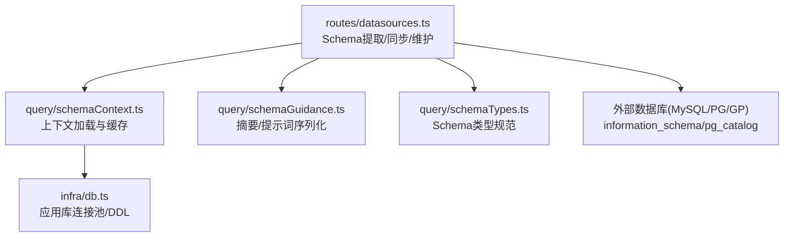
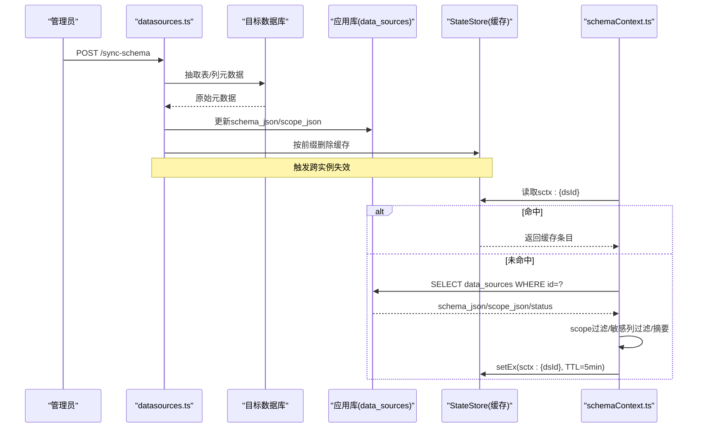
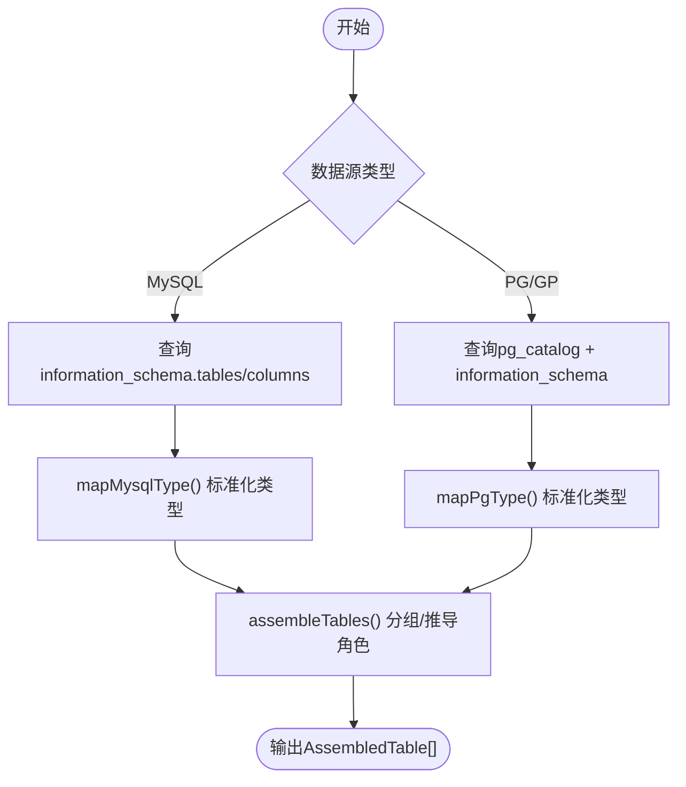
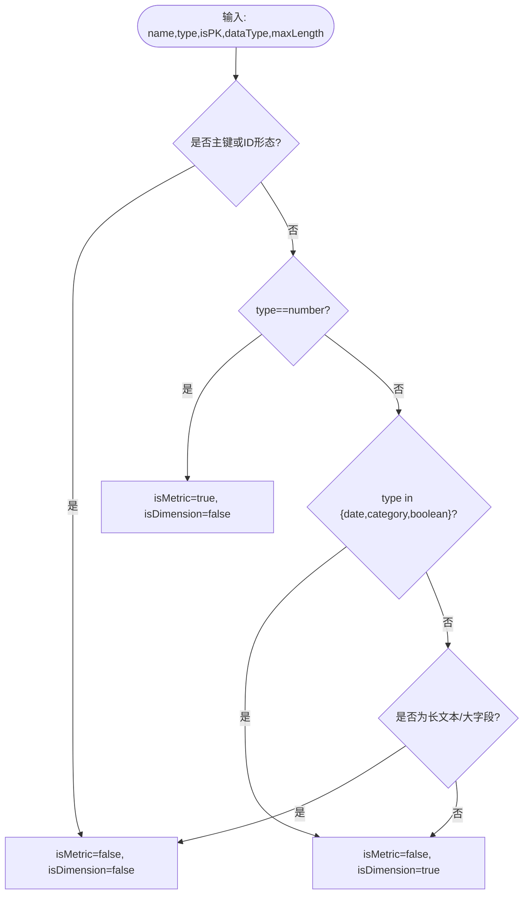
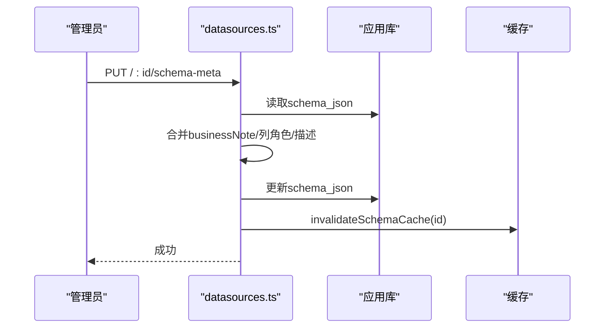
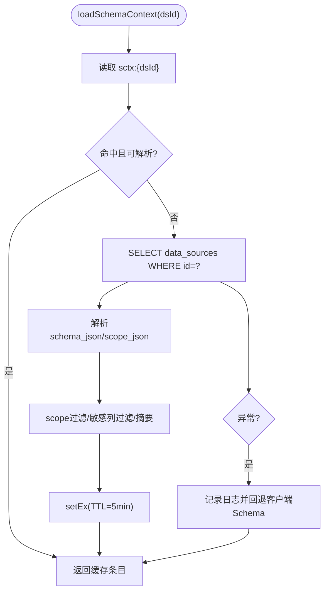
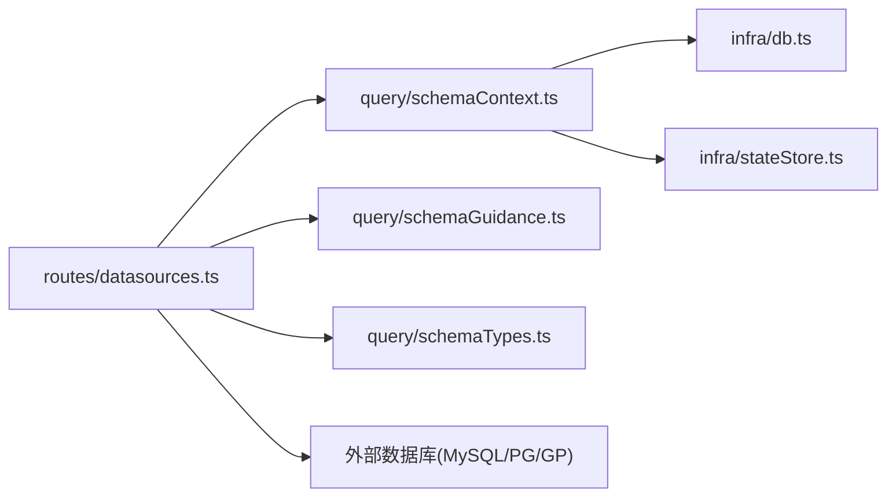

# Schema管理

<cite>
**本文引用的文件**
- [server/query/schemaTypes.ts](file://server/query/schemaTypes.ts)
- [server/query/schemaContext.ts](file://server/query/schemaContext.ts)
- [server/query/schemaGuidance.ts](file://server/query/schemaGuidance.ts)
- [server/query/schemaLinkingCache.test.ts](file://server/query/schemaLinkingCache.test.ts)
- [server/routes/datasources.ts](file://server/routes/datasources.ts)
- [server/infra/db.ts](file://server/infra/db.ts)
</cite>

## 目录
1. [简介](#简介)
2. [项目结构](#项目结构)
3. [核心组件](#核心组件)
4. [架构总览](#架构总览)
5. [详细组件分析](#详细组件分析)
6. [依赖关系分析](#依赖关系分析)
7. [性能与缓存](#性能与缓存)
8. [故障恢复与兼容性](#故障恢复与兼容性)
9. [排错指南](#排错指南)
10. [结论](#结论)

## 简介
本文件面向“智能问数据分析系统”的Schema管理模块，系统性说明Schema元数据提取机制、MySQL与PostgreSQL/Greenplum的差异与兼容处理、列角色自动推导算法（指标列vs维度列）、业务口径说明（businessNote）的管理与使用、Schema同步机制（增量更新、冲突处理、版本控制）、以及Schema缓存策略、性能优化和故障恢复。文档以代码级事实为依据，辅以可视化图示，帮助读者快速理解并正确使用该模块。

## 项目结构
Schema管理涉及以下关键位置：
- 类型定义：统一Schema表/列模型，贯穿上下文缓存、圈表/列裁剪、Prompt序列化、权限过滤等链路。
- 上下文加载：从应用库读取数据源配置与Schema，进行范围过滤、敏感列过滤、摘要生成，并缓存。
- 元数据提取：对MySQL与PG系数据库执行真实连接，抽取表/列元数据，映射为标准类型并推导列角色。
- 同步与维护：提供Schema同步接口，保留管理员手工标注；支持业务口径维护。
- 持久化：应用库中data_sources表承载schema_json、scope_json、acl_json等。

图表来源
- [server/routes/datasources.ts:224-347](file://server/routes/datasources.ts#L224-L347)
- [server/query/schemaContext.ts:108-171](file://server/query/schemaContext.ts#L108-L171)
- [server/query/schemaGuidance.ts:26-36](file://server/query/schemaGuidance.ts#L26-L36)
- [server/query/schemaTypes.ts:8-29](file://server/query/schemaTypes.ts#L8-L29)
- [server/infra/db.ts:104-117](file://server/infra/db.ts#L104-L117)

章节来源
- [server/routes/datasources.ts:224-347](file://server/routes/datasources.ts#L224-L347)
- [server/query/schemaContext.ts:108-171](file://server/query/schemaContext.ts#L108-L171)
- [server/query/schemaGuidance.ts:26-36](file://server/query/schemaGuidance.ts#L26-L36)
- [server/query/schemaTypes.ts:8-29](file://server/query/schemaTypes.ts#L8-L29)
- [server/infra/db.ts:104-117](file://server/infra/db.ts#L104-L117)

## 核心组件
- Schema类型规范：统一SchemaTable/SchemaColumn字段，包含name/type/description/isPrimaryKey/isDimension/isMetric及扩展位，作为全链路单一事实源。
- Schema上下文加载：从应用库读取数据源，执行scope白名单过滤、敏感列过滤、生成摘要，并以Key前缀缓存，支持跨实例失效。
- Schema动态摘要：基于列类型与人工标注，输出维度/指标候选列表，注入LLM Prompt，避免固定模板偏差。
- 元数据提取器：分别实现MySQL与PG系（含Greenplum）的表/列元数据抽取，统一映射为标准类型并推导列角色。
- Schema同步与维护：提供同步接口覆盖schema_json，保留业务口径与人工标注；提供业务口径维护接口。

章节来源
- [server/query/schemaTypes.ts:8-29](file://server/query/schemaTypes.ts#L8-L29)
- [server/query/schemaContext.ts:108-171](file://server/query/schemaContext.ts#L108-L171)
- [server/query/schemaGuidance.ts:26-36](file://server/query/schemaGuidance.ts#L26-L36)
- [server/routes/datasources.ts:224-347](file://server/routes/datasources.ts#L224-L347)
- [server/routes/datasources.ts:588-656](file://server/routes/datasources.ts#L588-L656)
- [server/routes/datasources.ts:754-800](file://server/routes/datasources.ts#L754-L800)

## 架构总览
Schema管理在“数据源创建/同步/维护”与“问数上下文加载”两条主路径上协同工作：
- 写入侧：管理员通过路由接口创建或同步数据源，服务端连接目标数据库抽取Schema，组装为统一结构落库，并触发缓存失效。
- 读取侧：问数链路加载Schema上下文时，优先命中缓存；未命中则从应用库读取，执行范围过滤、敏感列过滤、摘要生成后写回缓存。

图表来源
- [server/routes/datasources.ts:588-656](file://server/routes/datasources.ts#L588-L656)
- [server/query/schemaContext.ts:108-171](file://server/query/schemaContext.ts#L108-L171)
- [server/infra/db.ts:104-117](file://server/infra/db.ts#L104-L117)

## 详细组件分析

### 元数据提取机制（表结构分析、字段类型识别、关联关系推断）
- 表结构分析
  - MySQL：通过information_schema.tables获取表名、行数估算、注释；通过information_schema.columns获取列名、数据类型、是否主键、注释、最大长度。
  - PostgreSQL/Greenplum：通过pg_class/pg_namespace获取对象清单与类型映射；通过pg_attribute/pg_description获取列信息；主键检测走information_schema以保证兼容性。
- 字段类型识别
  - 将底层数据类型映射为标准类型number/date/category/boolean/string，便于后续分析与提示词生成。
  - PG系对短文本varchar/char根据atttypmod计算maxLength，用于后续长文本判定。
- 关联关系推断
  - 当前实现仅识别主键列（columnKey='PRI'），不直接推断外键关系；圈表/列裁剪由上层schemaLinking完成。

图表来源
- [server/routes/datasources.ts:224-255](file://server/routes/datasources.ts#L224-L255)
- [server/routes/datasources.ts:257-337](file://server/routes/datasources.ts#L257-L337)
- [server/routes/datasources.ts:177-204](file://server/routes/datasources.ts#L177-L204)

章节来源
- [server/routes/datasources.ts:224-347](file://server/routes/datasources.ts#L224-L347)

### MySQL与PostgreSQL/Greenplum差异与兼容性处理
- 差异点
  - 表清单来源不同：MySQL用information_schema.tables；PG系用pg_class/pg_namespace。
  - 列注释来源不同：MySQL用column_comment；PG系用pg_description。
  - 主键检测：PG系为避免某些版本限制，主键检测仍走information_schema。
- 兼容性处理
  - 统一类型映射函数mapMysqlType/mapPgType，屏蔽底层差异。
  - 统一assembleTables流程，保证输出一致。
  - Greenplum与PostgreSQL共用同一套PG系提取逻辑，并通过relkind过滤对象类型。

章节来源
- [server/routes/datasources.ts:92-110](file://server/routes/datasources.ts#L92-L110)
- [server/routes/datasources.ts:257-337](file://server/routes/datasources.ts#L257-L337)

### 列角色自动推导算法（指标列vs维度列）
- 规则要点
  - 主键与id形态的数字外键列：既不是指标也不是维度（技术性字段）。
  - 数值列：指标列。
  - 日期/枚举/布尔：维度列。
  - 短字符串（≤64字符）：维度列；长文本/JSON/BLOB：两者都不是。
- 使用场景
  - 元数据提取阶段自动推导isMetric/isDimension。
  - 摘要生成阶段基于isMetric/isDimension输出维度/指标候选列表。
  - 降级响应选择轴时，优先语义相关列，其次日期/类别维度与前两个数值指标。

图表来源
- [server/routes/datasources.ts:112-135](file://server/routes/datasources.ts#L112-L135)
- [server/query/schemaGuidance.ts:11-23](file://server/query/schemaGuidance.ts#L11-L23)

章节来源
- [server/routes/datasources.ts:112-135](file://server/routes/datasources.ts#L112-L135)
- [server/query/schemaGuidance.ts:11-23](file://server/query/schemaGuidance.ts#L11-L23)

### 业务口径说明（businessNote）的管理和使用
- 管理入口
  - 管理员可通过PUT /:id/schema-meta维护表级businessNote与列级描述/角色。
  - 同步Schema时，会保留已存在的businessNote，新列采用自动推导结果。
- 使用方式
  - businessNote随Schema下发至前端与提示词层，用于约束SQL生成与解释口径。
  - 提示词序列化时会剔除冗余字段，businessNote由独立逻辑注入，避免重复。

章节来源
- [server/routes/datasources.ts:588-656](file://server/routes/datasources.ts#L588-L656)
- [server/routes/datasources.ts:754-800](file://server/routes/datasources.ts#L754-L800)
- [server/query/schemaGuidance.ts:84-100](file://server/query/schemaGuidance.ts#L84-L100)

### Schema同步机制（增量更新、冲突处理、版本控制）
- 增量更新
  - 同步时读取旧schema_json，构建旧列/旧表备注映射；新结构合并时保留已有列的角色与描述，新增列采用自动推导。
  - 同时清洗scope_json，移除已删除的表/字段引用。
- 冲突处理
  - 若同步失败（如连接异常），保持原schema不变并返回错误；更新成功后再失效缓存与查询缓存。
- 版本控制
  - 当前schema_json为单份最新状态；变更通过覆盖写入实现“隐式版本”。如需显式版本，可在上层引入version字段与快照机制（当前未实现）。

图表来源
- [server/routes/datasources.ts:754-800](file://server/routes/datasources.ts#L754-L800)
- [server/query/schemaContext.ts:50-55](file://server/query/schemaContext.ts#L50-L55)

章节来源
- [server/routes/datasources.ts:754-800](file://server/routes/datasources.ts#L754-L800)
- [server/query/schemaContext.ts:50-55](file://server/query/schemaContext.ts#L50-L55)

### Schema缓存策略、性能优化与故障恢复
- 缓存策略
  - Key前缀：sctx:{dataSourceId}，TTL=5分钟。
  - 内容：schema、guidance、status、dsType、sensitiveRemoved、allowIntrospection、rowFilters、dataSourceName、fileBacked。
  - 多实例共享：当启用Redis时，通过deleteByPrefix广播失效。
- 性能优化
  - 上下文加载命中缓存即返回，减少数据库与解析开销。
  - 提示词序列化压缩Schema体积，降低Prompt大小。
  - 宽表列裁剪与向量缓存（测试用例验证）减少embedding调用。
- 故障恢复
  - 缓存损坏视为未命中，回退到查库重建。
  - 加载失败记录日志并回退到客户端提供的演示模式Schema。
  - 同步失败不改变原有schema，确保一致性。

图表来源
- [server/query/schemaContext.ts:108-171](file://server/query/schemaContext.ts#L108-L171)
- [server/query/schemaGuidance.ts:84-100](file://server/query/schemaGuidance.ts#L84-L100)
- [server/query/schemaLinkingCache.test.ts:17-22](file://server/query/schemaLinkingCache.test.ts#L17-L22)

章节来源
- [server/query/schemaContext.ts:108-171](file://server/query/schemaContext.ts#L108-L171)
- [server/query/schemaGuidance.ts:84-100](file://server/query/schemaGuidance.ts#L84-L100)
- [server/query/schemaLinkingCache.test.ts:17-22](file://server/query/schemaLinkingCache.test.ts#L17-L22)

## 依赖关系分析
- routes/datasources.ts依赖：
  - 应用库连接池（infra/db.ts）读写data_sources。
  - 目标数据库驱动（mysql2/pg）执行元数据抽取。
  - schemaContext、schemaGuidance、schemaTypes等模块。
- schemaContext.ts依赖：
  - 应用库连接池、stateStore（缓存）、scope、queryGuard、fileDataSource。
- schemaGuidance.ts依赖：
  - schemaTypes，提供摘要与提示词序列化能力。
- 持久化层：
  - data_sources表承载schema_json、scope_json、acl_json等。

图表来源
- [server/routes/datasources.ts:224-347](file://server/routes/datasources.ts#L224-L347)
- [server/query/schemaContext.ts:108-171](file://server/query/schemaContext.ts#L108-L171)
- [server/infra/db.ts:104-117](file://server/infra/db.ts#L104-L117)

章节来源
- [server/routes/datasources.ts:224-347](file://server/routes/datasources.ts#L224-L347)
- [server/query/schemaContext.ts:108-171](file://server/query/schemaContext.ts#L108-L171)
- [server/infra/db.ts:104-117](file://server/infra/db.ts#L104-L117)

## 性能与缓存
- 缓存命中率：相同Schema多次访问直接命中，零额外请求。
- 提示词瘦身：序列化时剔除冗余字段，显著降低Prompt体积。
- 宽表优化：列级摘要向量缓存，编辑单列仅重算该列。
- 并发与容量：应用库连接池按预期并发用户数动态计算，避免瓶颈。

章节来源
- [server/query/schemaLinkingCache.test.ts:48-95](file://server/query/schemaLinkingCache.test.ts#L48-L95)
- [server/query/schemaLinkingCache.test.ts:97-128](file://server/query/schemaLinkingCache.test.ts#L97-L128)
- [server/query/schemaGuidance.ts:84-100](file://server/query/schemaGuidance.ts#L84-L100)
- [server/infra/db.ts:29-43](file://server/infra/db.ts#L29-L43)

## 故障恢复与兼容性
- 兼容性
  - MySQL与PG系通过统一类型映射与组装流程屏蔽差异。
  - Greenplum与PostgreSQL共用PG系提取逻辑，兼容relkind与注释来源。
- 故障恢复
  - 上下文加载失败回退到客户端Schema，保障可用性。
  - 缓存损坏视为未命中，重建缓存。
  - 同步失败保持原状，避免不一致。

章节来源
- [server/routes/datasources.ts:257-337](file://server/routes/datasources.ts#L257-L337)
- [server/query/schemaContext.ts:108-171](file://server/query/schemaContext.ts#L108-L171)

## 排错指南
- 无法连接目标数据库
  - 检查数据源配置（host/port/user/password/database），确认密码加密存储正确。
  - 参考同步接口错误消息定位具体原因。
- Schema未生效
  - 确认已调用同步接口并成功；检查缓存是否被正确失效。
  - 查看应用库data_sources的schema_json是否已更新。
- 列角色不准确
  - 通过schema-meta接口手动修正isMetric/isDimension/description。
  - 注意主键与ID形态列不会被标记为指标或维度。
- 提示词过大
  - 使用序列化后的紧凑Schema；必要时精简description与columns数量。

章节来源
- [server/routes/datasources.ts:588-656](file://server/routes/datasources.ts#L588-L656)
- [server/routes/datasources.ts:754-800](file://server/routes/datasources.ts#L754-L800)
- [server/query/schemaContext.ts:108-171](file://server/query/schemaContext.ts#L108-L171)

## 结论
本Schema管理模块通过统一的类型规范、稳健的元数据提取、灵活的列角色推导、完善的业务口径管理与高效的缓存策略，实现了跨数据库类型的稳定Schema管理能力。其设计兼顾了可扩展性、性能与容错，为智能问数提供了可靠的数据基础。建议在生产环境中结合监控与审计，持续优化Schema质量与提示词效果。