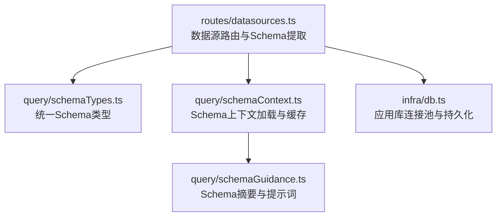
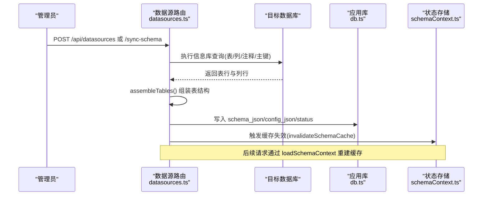
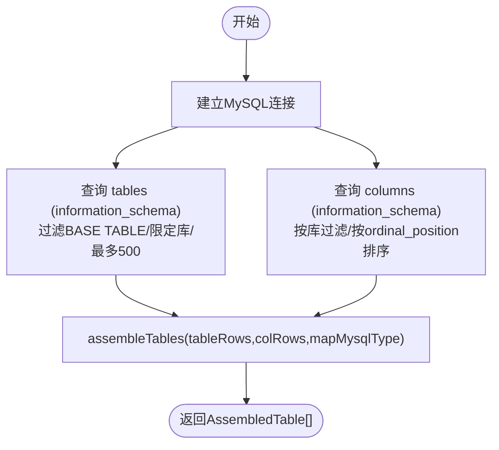
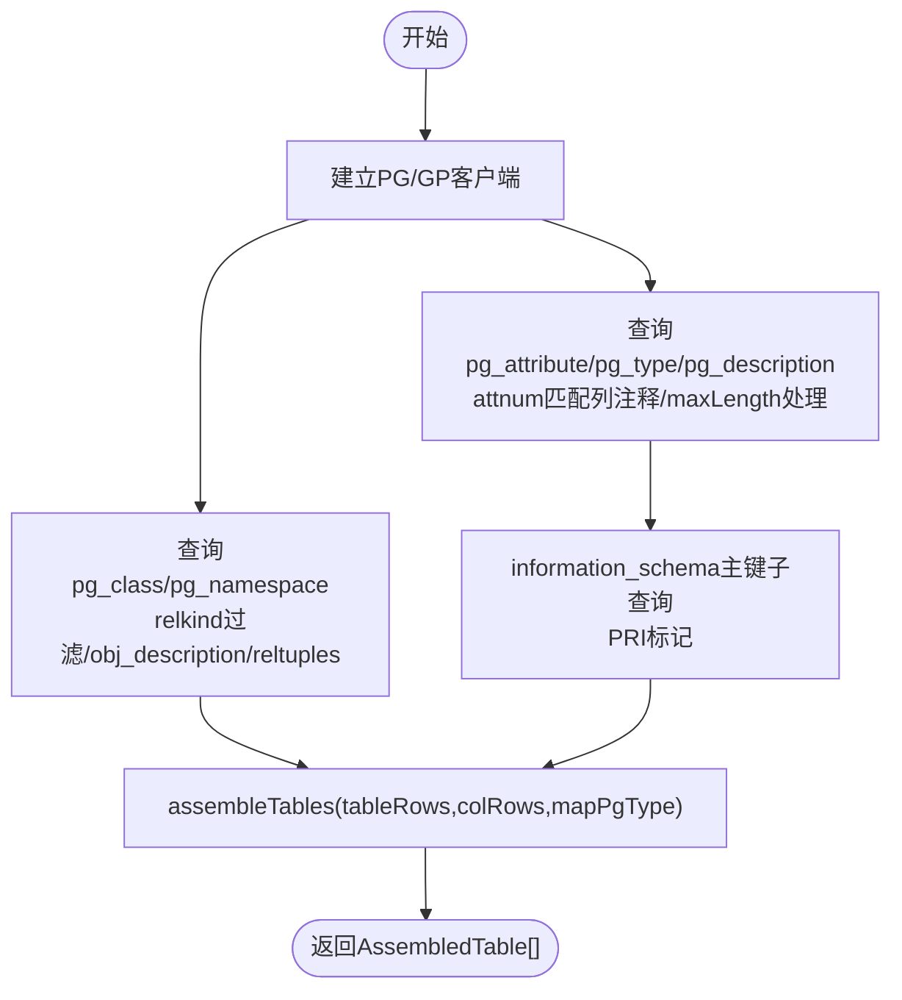
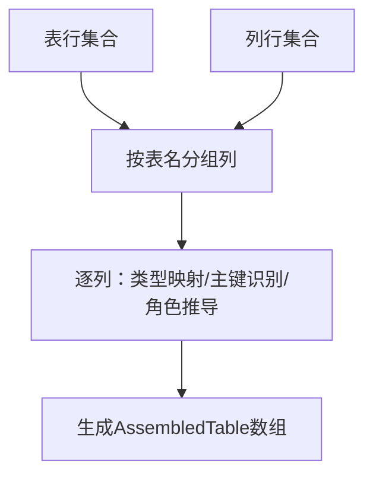
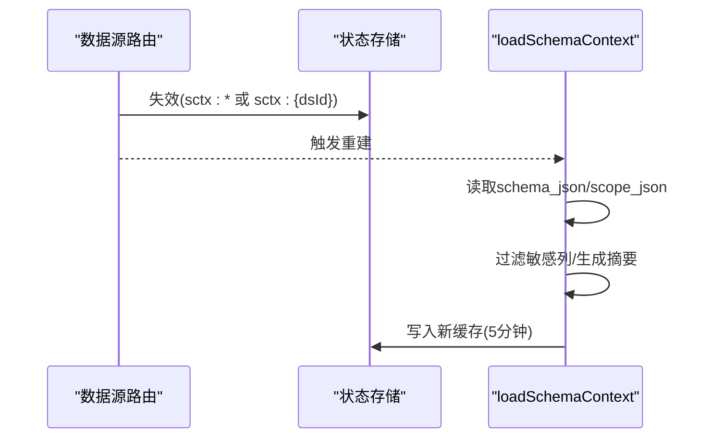
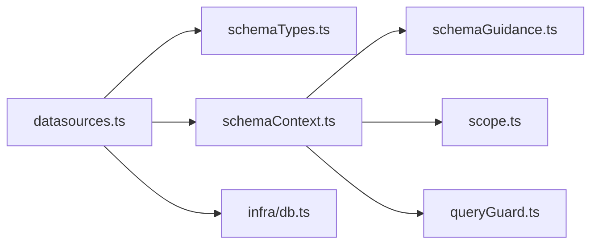

# 元数据提取

<cite>
**本文引用的文件**
- [server/routes/datasources.ts](file://server/routes/datasources.ts)
- [server/query/schemaTypes.ts](file://server/query/schemaTypes.ts)
- [server/query/schemaContext.ts](file://server/query/schemaContext.ts)
- [server/query/schemaGuidance.ts](file://server/query/schemaGuidance.ts)
- [server/infra/db.ts](file://server/infra/db.ts)
</cite>

## 目录
1. [简介](#简介)
2. [项目结构](#项目结构)
3. [核心组件](#核心组件)
4. [架构总览](#架构总览)
5. [详细组件分析](#详细组件分析)
6. [依赖关系分析](#依赖关系分析)
7. [性能考虑](#性能考虑)
8. [故障排查指南](#故障排查指南)
9. [结论](#结论)
10. [附录](#附录)

## 简介
本文件聚焦“Schema 元数据提取”的完整实现与使用方式，覆盖 MySQL 与 PostgreSQL/Greenplum 两类数据库的 schema 抽取、表行数统计、主键识别、注释读取、列角色推导、以及跨库兼容策略。重点解析 extractMysqlSchema、extractPgSchema 与 assembleTables 的实现逻辑，并说明其在数据源创建、同步、缓存失效等流程中的位置与作用。

## 项目结构
围绕 Schema 元数据提取的关键代码分布在以下模块：
- server/routes/datasources.ts：数据源路由与真实数据库连接、schema 提取、表/列组装、同步与缓存失效。
- server/query/schemaTypes.ts：统一的 SchemaTable/SchemaColumn 类型定义，作为全链路事实源。
- server/query/schemaContext.ts：加载并缓存 LLM 上下文所需的 schema（含 scope、敏感列过滤、摘要生成）。
- server/query/schemaGuidance.ts：基于 schema 生成提示词摘要、选择相关表/列等辅助能力。
- server/infra/db.ts：应用库连接池与初始化（存储数据源配置与 schema_json）。

图表来源
- [server/routes/datasources.ts:177-347](file://server/routes/datasources.ts#L177-L347)
- [server/query/schemaTypes.ts:1-30](file://server/query/schemaTypes.ts#L1-L30)
- [server/query/schemaContext.ts:108-172](file://server/query/schemaContext.ts#L108-L172)
- [server/query/schemaGuidance.ts:25-36](file://server/query/schemaGuidance.ts#L25-L36)
- [server/infra/db.ts:47-70](file://server/infra/db.ts#L47-L70)

章节来源
- [server/routes/datasources.ts:1-100](file://server/routes/datasources.ts#L1-L100)
- [server/query/schemaTypes.ts:1-30](file://server/query/schemaTypes.ts#L1-L30)

## 核心组件
- 类型契约：SchemaTable/SchemaColumn 为全链路共享的单一事实源，避免 any[] 扩散。
- 类型映射：mapMysqlType/mapPgType 将底层 data_type 映射为前端友好的 number/date/category/boolean/string。
- 列角色推导：deriveColumnRole 依据列名形态、数据类型、是否主键、长度等自动推断 isMetric/isDimension。
- 表/列组装：assembleTables 将表清单与列清单聚合为 AssembledTable[]，并注入 displayName、description、rowCount、tableType 等字段。
- 数据库适配：extractMysqlSchema 与 extractPgSchema 分别针对 MySQL 与 PG/Greenplum 执行信息库查询，统一产出 AssembledTable[]。
- 上下文加载：loadSchemaContext 从应用库读取 schema_json，结合 scope、敏感列过滤、摘要生成，并提供 5 分钟缓存。

章节来源
- [server/query/schemaTypes.ts:1-30](file://server/query/schemaTypes.ts#L1-L30)
- [server/routes/datasources.ts:92-204](file://server/routes/datasources.ts#L92-L204)
- [server/query/schemaContext.ts:108-172](file://server/query/schemaContext.ts#L108-L172)

## 架构总览
下图展示了数据源创建/同步时，Schema 元数据从数据库到落库再到上下文缓存的完整流程。

图表来源
- [server/routes/datasources.ts:223-347](file://server/routes/datasources.ts#L223-L347)
- [server/query/schemaContext.ts:50-55](file://server/query/schemaContext.ts#L50-L55)
- [server/infra/db.ts:104-117](file://server/infra/db.ts#L104-L117)

## 详细组件分析

### MySQL information_schema 提取（extractMysqlSchema）
- 表清单：从 information_schema.tables 按 table_schema 过滤，仅取 BASE TABLE，限制 500 条；读取 table_rows 作为 rowCount，table_comment 作为注释。
- 列清单：从 information_schema.columns 按 table_schema 过滤，读取 column_name、data_type、column_key、column_comment、character_maximum_length。
- 主键识别：通过 column_key = 'PRI' 标记主键列。
- 注释读取：直接读取 column_comment/table_comment。
- 类型映射：调用 mapMysqlType 将 data_type 映射为 number/date/category/boolean/string。
- 组装：传入 assembleTables，得到 AssembledTable[]。

图表来源
- [server/routes/datasources.ts:223-255](file://server/routes/datasources.ts#L223-L255)
- [server/routes/datasources.ts:92-100](file://server/routes/datasources.ts#L92-L100)
- [server/routes/datasources.ts:177-204](file://server/routes/datasources.ts#L177-L204)

章节来源
- [server/routes/datasources.ts:223-255](file://server/routes/datasources.ts#L223-L255)

### PostgreSQL/Greenplum pg_catalog 提取（extractPgSchema）
- 表清单：走 pg_class + pg_namespace，按 schema 过滤 relkind（r/p/v/m/f），并通过 obj_description(c.oid,'pg_class') 获取表注释；reltuples 作为 rowCount 估算；根据 relkind 映射 tableType（TABLE/VIEW/MATERIALIZED_VIEW/UNKNOWN）。
- 列清单：统一走 pg_attribute + pg_type + pg_description，通过 attnum 精确匹配列注释，避免 ordinal_position 错位问题；maxLength 对 varchar/bpchar 做 atttypmod-4 计算。
- 主键识别：通过 information_schema.table_constraints/key_column_usage 子查询判断 PRI，避免某些 Greenplum 版本中 pg_index.indkey ANY() 解包异常。
- 注释读取：表注释用 obj_description；列注释用 pg_description（objoid=attrelid, objsubid=attnum）。
- 类型映射：调用 mapPgType 将 data_type 映射为 number/date/boolean/string。
- 组装：传入 assembleTables，得到 AssembledTable[]。

图表来源
- [server/routes/datasources.ts:257-337](file://server/routes/datasources.ts#L257-L337)
- [server/routes/datasources.ts:102-110](file://server/routes/datasources.ts#L102-L110)
- [server/routes/datasources.ts:177-204](file://server/routes/datasources.ts#L177-L204)

章节来源
- [server/routes/datasources.ts:257-337](file://server/routes/datasources.ts#L257-L337)

### 表行数统计、主键识别、外键关系处理
- 表行数统计：
  - MySQL：使用 information_schema.tables.table_rows（近似值）。
  - PG/Greenplum：使用 pg_class.reltuples（统计器估算值）。
- 主键识别：
  - MySQL：column_key='PRI'。
  - PG/Greenplum：通过 information_schema 的主键约束子查询判定 PRI。
- 外键关系：
  - 当前 schema 提取未包含外键信息；如需可参考现有主键子查询模式扩展 information_schema 的外键视图。

章节来源
- [server/routes/datasources.ts:235-250](file://server/routes/datasources.ts#L235-L250)
- [server/routes/datasources.ts:276-333](file://server/routes/datasources.ts#L276-L333)

### 不同数据库类型的兼容性问题与解决方案
- Greenplum 兼容性：
  - 避免使用 format() 函数，采用通用 SQL 兼容 PG/GP。
  - 主键检测走 information_schema，规避部分 GP 版本 pg_index.indkey ANY() 报错。
  - 列注释通过 pg_description 与 attnum 精确匹配，避免 regclass 名称解析失败导致注释为空。
- 类型映射差异：
  - 提供 mapMysqlType 与 mapPgType 两套映射，确保前端展示一致。
- 表类型区分：
  - PG/GP 通过 relkind 映射出 TABLE/VIEW/MATERIALIZED_VIEW，便于前端分类展示。

章节来源
- [server/routes/datasources.ts:102-110](file://server/routes/datasources.ts#L102-L110)
- [server/routes/datasources.ts:276-333](file://server/routes/datasources.ts#L276-L333)

### assembleTables 的表结构组装过程
- 输入：表清单行（name/rowCount/comment/tableType）与列清单行（tableName/name/dataType/columnKey/comment/maxLength）。
- 处理：
  - 按 tableName 分组列，逐列进行类型映射、主键识别、角色推导（isMetric/isDimension）。
  - 为每表生成 id、displayName（优先注释首行）、description（默认“数据表 xxx”）、rowCount、tableType。
- 输出：AssembledTable[]，用于落库 schema_json 与下发前端。

图表来源
- [server/routes/datasources.ts:177-204](file://server/routes/datasources.ts#L177-L204)

章节来源
- [server/routes/datasources.ts:177-204](file://server/routes/datasources.ts#L177-L204)

### 错误处理与重试机制
- 连接与查询超时：
  - MySQL：connectTimeout 5s；PG/GP：connectionTimeoutMillis 5s、statement_timeout 15s（提取）/10s（测试连接）。
- 异常捕获：
  - 连接失败或查询异常时，统一返回结构化错误消息（errMsg 收窄 unknown）。
  - 测试连接端点返回 success=false 与延迟时间，便于前端提示。
- 重试机制：
  - 当前实现未内置显式重试逻辑；可通过上层调用方（如调度任务）增加指数退避重试。
- 资源释放：
  - MySQL 连接在 finally 中 end；PG 客户端在 finally 中 end（忽略关闭异常）。

章节来源
- [server/routes/datasources.ts:223-255](file://server/routes/datasources.ts#L223-L255)
- [server/routes/datasources.ts:257-337](file://server/routes/datasources.ts#L257-L337)
- [server/routes/datasources.ts:880-968](file://server/routes/datasources.ts#L880-L968)

### 与上下文缓存的集成
- 数据源创建/更新/删除后，调用 invalidateSchemaCache 使缓存失效。
- 后续请求通过 loadSchemaContext 重新构建 schema 上下文，并进行 scope 过滤、敏感列过滤、摘要生成，结果缓存 5 分钟。

图表来源
- [server/query/schemaContext.ts:50-55](file://server/query/schemaContext.ts#L50-L55)
- [server/query/schemaContext.ts:108-172](file://server/query/schemaContext.ts#L108-L172)

章节来源
- [server/query/schemaContext.ts:50-55](file://server/query/schemaContext.ts#L50-L55)
- [server/query/schemaContext.ts:108-172](file://server/query/schemaContext.ts#L108-L172)

## 依赖关系分析
- routes/datasources.ts 依赖：
  - mysql2/promise 与 pg 驱动进行真实连接。
  - schemaTypes.ts 的类型定义保证数据结构一致性。
  - schemaContext.ts 的缓存失效接口。
  - infra/db.ts 的应用库连接池用于持久化 schema_json。
- query/schemaContext.ts 依赖：
  - infra/db.ts 读取 data_sources。
  - query/scope 与 queryGuard 进行范围与敏感列过滤。
  - query/schemaGuidance.ts 生成摘要。

图表来源
- [server/routes/datasources.ts:1-28](file://server/routes/datasources.ts#L1-L28)
- [server/query/schemaContext.ts:1-16](file://server/query/schemaContext.ts#L1-L16)

章节来源
- [server/routes/datasources.ts:1-28](file://server/routes/datasources.ts#L1-L28)
- [server/query/schemaContext.ts:1-16](file://server/query/schemaContext.ts#L1-L16)

## 性能考虑
- 查询限制：
  - 表清单 LIMIT 500，避免大库拖慢提取。
- 连接与语句超时：
  - MySQL connectTimeout 5s；PG/GP connectionTimeoutMillis 5s、statement_timeout 10-15s。
- 缓存策略：
  - Schema 上下文缓存 5 分钟，减少重复构造成本。
  - 写操作后主动失效缓存，保证一致性。
- 类型映射与角色推导：
  - 轻量 CPU 操作，复杂度 O(N列)，对整体影响可忽略。
- 建议优化：
  - 对超大库可增加分页或增量同步策略。
  - 可在上层封装重试与熔断，提升鲁棒性。

[本节为通用指导，不直接分析具体文件]

## 故障排查指南
- 连接失败：
  - 检查 host/port/user/password/database 配置是否正确；测试连接端点会返回 success=false 与延迟。
- 权限不足：
  - 确认用户具备读取 information_schema/pg_catalog 的权限。
- 注释为空：
  - PG/GP 列注释需通过 pg_description 与 attnum 匹配；若仍为空，检查对象是否存在注释。
- 主键缺失：
  - 确认主键约束存在；PG/GP 主键检测依赖 information_schema 子查询。
- 缓存不一致：
  - 修改 schema 后务必调用 invalidateSchemaCache；必要时手动清理 sctx:* 前缀缓存。

章节来源
- [server/routes/datasources.ts:880-968](file://server/routes/datasources.ts#L880-L968)
- [server/query/schemaContext.ts:50-55](file://server/query/schemaContext.ts#L50-L55)

## 结论
本实现以统一类型为核心，分别针对 MySQL 与 PostgreSQL/Greenplum 实现了稳定可靠的 Schema 元数据提取，涵盖表清单、列信息、注释、行数估算与主键识别，并通过 assembleTables 完成一致的表结构组装。结合上下文缓存与缓存失效机制，保障了高并发下的性能与一致性。未来可按需在 PG/GP 侧补充外键关系提取，并在上层引入重试与熔断以提升健壮性。

[本节为总结，不直接分析具体文件]

## 附录
- 关键函数路径参考：
  - extractMysqlSchema：[server/routes/datasources.ts:223-255](file://server/routes/datasources.ts#L223-L255)
  - extractPgSchema：[server/routes/datasources.ts:257-337](file://server/routes/datasources.ts#L257-L337)
  - assembleTables：[server/routes/datasources.ts:177-204](file://server/routes/datasources.ts#L177-L204)
  - mapMysqlType/mapPgType：[server/routes/datasources.ts:92-110](file://server/routes/datasources.ts#L92-L110)
  - deriveColumnRole：[server/routes/datasources.ts:118-135](file://server/routes/datasources.ts#L118-L135)
  - loadSchemaContext：[server/query/schemaContext.ts:108-172](file://server/query/schemaContext.ts#L108-L172)
  - summarizeSchema：[server/query/schemaGuidance.ts:25-36](file://server/query/schemaGuidance.ts#L25-L36)