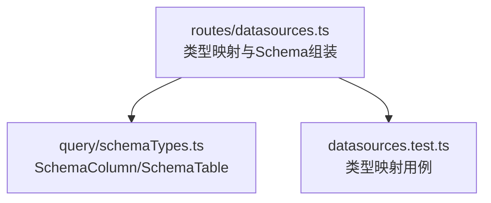
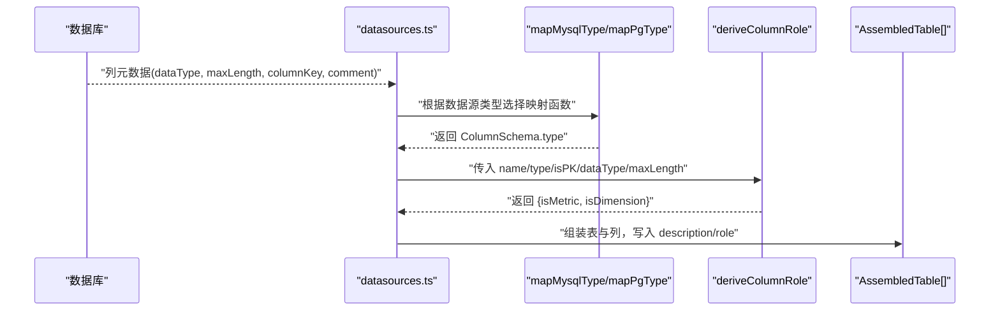
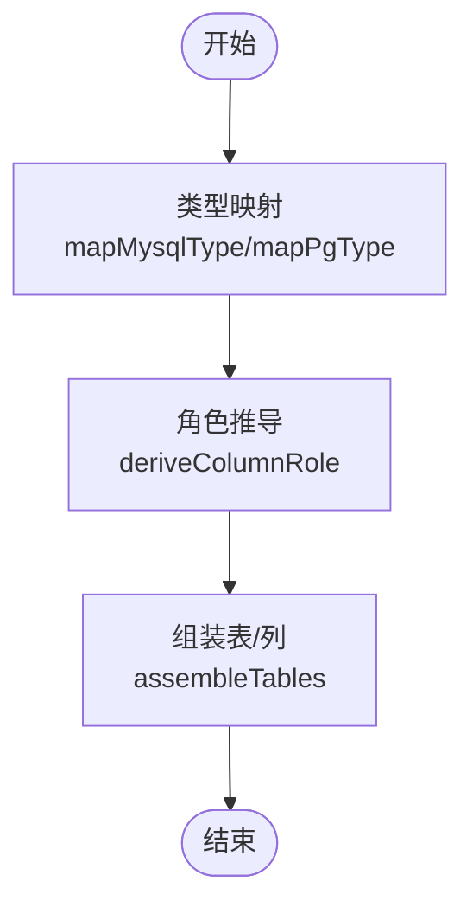

# 类型映射

<cite>
**本文引用的文件**
- [server/routes/datasources.ts](file://server/routes/datasources.ts)
- [server/routes/datasources.test.ts](file://server/routes/datasources.test.ts)
- [server/query/schemaTypes.ts](file://server/query/schemaTypes.ts)
</cite>

## 目录
1. [简介](#简介)
2. [项目结构](#项目结构)
3. [核心组件](#核心组件)
4. [架构总览](#架构总览)
5. [详细组件分析](#详细组件分析)
6. [依赖关系分析](#依赖关系分析)
7. [性能考量](#性能考量)
8. [故障排查指南](#故障排查指南)
9. [结论](#结论)
10. [附录](#附录)

## 简介
本文件聚焦于后端数据源 Schema 提取过程中的“数据类型映射”能力，详细说明 MySQL 与 PostgreSQL/Greenplum 的数据库原生类型如何统一映射为前端 ColumnSchema.type（number/date/category/boolean/string），并解释长度限制、角色推导、错误处理与扩展点。目标是帮助开发者与维护者理解：
- mapMysqlType 的映射规则与边界
- mapPgType 的统一处理策略
- varchar 长度对维度判断的影响
- 自定义/扩展类型的支持方式
- 类型验证与转换错误的最佳实践

## 项目结构
与类型映射直接相关的代码集中在数据源路由模块与 Schema 类型定义中：
- 类型映射函数：mapMysqlType、mapPgType
- 列角色推导：deriveColumnRole（结合 maxLength 进行短文本判定）
- Schema 组装：assembleTables（将数据库元数据转换为统一的 AssembledTable/AssembledColumn）
- 类型契约：SchemaColumn、SchemaTable（前端与后端共享的 schema_json 结构）



图表来源
- [server/routes/datasources.ts:93-110](file://server/routes/datasources.ts#L93-L110)
- [server/query/schemaTypes.ts:8-29](file://server/query/schemaTypes.ts#L8-L29)
- [server/routes/datasources.test.ts:4-28](file://server/routes/datasources.test.ts#L4-L28)

章节来源
- [server/routes/datasources.ts:93-110](file://server/routes/datasources.ts#L93-L110)
- [server/query/schemaTypes.ts:8-29](file://server/query/schemaTypes.ts#L8-L29)
- [server/routes/datasources.test.ts:4-28](file://server/routes/datasources.test.ts#L4-L28)

## 核心组件
- mapMysqlType：将 MySQL data_type 映射到前端 ColumnSchema.type
- mapPgType：将 PostgreSQL/Greenplum data_type 映射到前端 ColumnSchema.type
- deriveColumnRole：基于 type、name、isPK、dataType、maxLength 推导 isMetric/isDimension
- assembleTables：按表分组列，调用 map*Type 与 deriveColumnRole 生成统一 Schema

章节来源
- [server/routes/datasources.ts:93-110](file://server/routes/datasources.ts#L93-L110)
- [server/routes/datasources.ts:118-135](file://server/routes/datasources.ts#L118-L135)
- [server/routes/datasources.ts:178-204](file://server/routes/datasources.ts#L178-L204)

## 架构总览
下图展示了从数据库元数据到前端可用 Schema 的关键流程：数据库查询获取列信息 → 类型映射 → 角色推导 → 组装为表级 Schema。



图表来源
- [server/routes/datasources.ts:224-255](file://server/routes/datasources.ts#L224-L255)
- [server/routes/datasources.ts:260-337](file://server/routes/datasources.ts#L260-L337)
- [server/routes/datasources.ts:178-204](file://server/routes/datasources.ts#L178-L204)

## 详细组件分析

### MySQL 类型映射（mapMysqlType）
- 数值型映射为 number：tinyint、smallint、mediumint、int、integer、bigint、decimal、numeric、float、double、real、year
- 日期时间映射为 date：date、datetime、timestamp、time
- 枚举/集合映射为 category：enum、set
- 布尔映射为 boolean：bit、bool、boolean
- 其他类型回落为 string：如 varchar、text、json 等

说明
- 所有输入先转为小写再匹配，保证大小写不敏感
- 未覆盖的类型默认回落到 string，避免未知类型导致前端渲染异常

章节来源
- [server/routes/datasources.ts:93-100](file://server/routes/datasources.ts#L93-L100)
- [server/routes/datasources.test.ts:4-28](file://server/routes/datasources.test.ts#L4-L28)

### PostgreSQL/Greenplum 类型映射（mapPgType）
- 数值型映射为 number：smallint、integer、bigint、decimal、numeric、real、double precision、serial、bigserial、smallserial、money
- 日期时间映射为 date：date；以及以 timestamp/time 开头的完整类型（含 with/without time zone）
- 布尔映射为 boolean：boolean、bool
- 其他类型回落为 string：character varying、character、text、json、jsonb、uuid、bytea、xml 等

说明
- 使用 startsWith('timestamp') / startsWith('time') 兼容 PG 系完整类型名
- 序列类型（serial/bigserial/smallserial）与货币类型（money）统一归为 number，便于指标计算

章节来源
- [server/routes/datasources.ts:103-110](file://server/routes/datasources.ts#L103-L110)
- [server/routes/datasources.test.ts:70-92](file://server/routes/datasources.test.ts#L70-L92)

### 列角色推导与 varchar 长度限制（deriveColumnRole）
- 主键或 id 形态列（id、*_id、*Id）不参与指标与维度
- 数值列（type=number）→ 指标
- 日期/枚举/布尔列（type=date/category/boolean）→ 维度
- 字符串列：若原始类型为长文本（text/tinytext/mediumtext/longtext/json/jsonb/blob/bytea/xml）或 maxLength > 64 → 不参与指标与维度；否则视为维度
- 该逻辑使 varchar 长度成为区分“短文本维度”和“长文本内容”的关键阈值

影响
- 对于 varchar(≤64)，即使来自 MySQL/PG，也会被视作维度（如地区、名称等）
- 对于超长字段（如备注、详情），即使业务上可作维度，也会因长度被排除，避免污染分析上下文

章节来源
- [server/routes/datasources.ts:118-135](file://server/routes/datasources.ts#L118-L135)

### Schema 组装流程（assembleTables）
- 将列按表分组，依次执行：
  - 类型映射：mapMysqlType 或 mapPgType
  - 主键识别：columnKey === 'PRI'
  - 角色推导：deriveColumnRole
  - 描述填充：优先使用注释 comment
- 输出统一的 AssembledTable[]，包含 columns 数组及 isMetric/isDimension 标记

章节来源
- [server/routes/datasources.ts:178-204](file://server/routes/datasources.ts#L178-L204)

### 数据源类型分派与真实连接
- extractDbSchema 根据数据源类型选择 MySQL 或 PG/Greenplum 的提取器
- extractMysqlSchema：通过 information_schema 读取表与列元数据，并使用 mapMysqlType
- extractPgSchema：通过 pg_catalog/information_schema 读取表与列元数据，并使用 mapPgType

章节来源
- [server/routes/datasources.ts:224-255](file://server/routes/datasources.ts#L224-L255)
- [server/routes/datasources.ts:260-337](file://server/routes/datasources.ts#L260-L337)
- [server/routes/datasources.ts:340-347](file://server/routes/datasources.ts#L340-L347)

### 类图：类型映射与角色推导
```mermaid
classDiagram
class Datasources {
+mapMysqlType(dataType) : string
+mapPgType(dataType) : string
+deriveColumnRole(name, type, isPK, dataType, maxLength) : {isMetric, isDimension}
+assembleTables(tableRows, colRows, mapType) : AssembledTable[]
}
class SchemaColumn {
+string name
+string type
+string description
+boolean isPrimaryKey
+boolean isDimension
+boolean isMetric
}
class SchemaTable {
+string name
+string displayName
+string description
+number rowCount
+SchemaColumn[] columns
}
Datasources --> SchemaColumn : "生成"
Datasources --> SchemaTable : "生成"
```

图表来源
- [server/routes/datasources.ts:93-110](file://server/routes/datasources.ts#L93-L110)
- [server/routes/datasources.ts:118-135](file://server/routes/datasources.ts#L118-L135)
- [server/routes/datasources.ts:178-204](file://server/routes/datasources.ts#L178-L204)
- [server/query/schemaTypes.ts:8-29](file://server/query/schemaTypes.ts#L8-L29)

## 依赖关系分析
- 类型映射函数依赖输入 data_type 的标准化（小写）
- 角色推导依赖：
  - 类型映射结果（type）
  - 原始类型（dataType）用于长文本判断
  - 长度（maxLength）用于短文本阈值
  - 主键标识（isPK）与列名模式（id/_id/Id）
- 组装过程依赖数据库元数据查询结果（tableRows/colRows）



图表来源
- [server/routes/datasources.ts:93-110](file://server/routes/datasources.ts#L93-L110)
- [server/routes/datasources.ts:118-135](file://server/routes/datasources.ts#L118-L135)
- [server/routes/datasources.ts:178-204](file://server/routes/datasources.ts#L178-L204)

章节来源
- [server/routes/datasources.ts:93-110](file://server/routes/datasources.ts#L93-L110)
- [server/routes/datasources.ts:118-135](file://server/routes/datasources.ts#L118-L135)
- [server/routes/datasources.ts:178-204](file://server/routes/datasources.ts#L178-L204)

## 性能考量
- 类型映射为 O(1) 的常量时间查找（数组 includes/startsWith）
- 角色推导涉及少量字符串比较与条件判断，整体开销低
- 在 assembleTables 中对列进行分组与遍历，复杂度与列数线性相关
- 建议在新增类型时保持映射表简洁，避免复杂分支

[本节为通用性能讨论，不直接分析具体文件]

## 故障排查指南
常见问题与建议
- 连接失败无法提取 Schema：检查数据源配置与密码解密流程，查看错误日志中的 errMsg 输出
- 类型未正确映射：确认 data_type 是否为空或大小写不一致；必要时在 map*Type 中补充新类型
- 长文本误判为维度：检查 maxLength 是否准确；若超过 64 将被视为长文本
- 主键列参与分析：确认 columnKey 是否正确识别为主键（PRI）

错误处理要点
- 统一使用 errMsg 收窄 unknown 错误消息
- 关键路径（列表、版本探测、flex-schema、创建/更新/删除、同步）均捕获异常并返回明确错误码与中文提示
- 资源释放：PG 客户端 end() 使用 .catch(() => undefined) 防止关闭异常阻断流程

章节来源
- [server/routes/datasources.ts:57-59](file://server/routes/datasources.ts#L57-L59)
- [server/routes/datasources.ts:368-401](file://server/routes/datasources.ts#L368-L401)
- [server/routes/datasources.ts:406-417](file://server/routes/datasources.ts#L406-L417)
- [server/routes/datasources.ts:423-440](file://server/routes/datasources.ts#L423-L440)
- [server/routes/datasources.ts:444-482](file://server/routes/datasources.ts#L444-L482)
- [server/routes/datasources.ts:588-656](file://server/routes/datasources.ts#L588-L656)
- [server/routes/datasources.ts:658-727](file://server/routes/datasources.ts#L658-L727)
- [server/routes/datasources.ts:729-752](file://server/routes/datasources.ts#L729-L752)

## 结论
- mapMysqlType 与 mapPgType 提供了稳定、可扩展的类型映射机制，覆盖主流数值、日期、枚举、布尔与文本类型
- deriveColumnRole 利用 maxLength 与原始类型，合理区分短文本维度与长文本内容，避免噪声干扰
- assembleTables 将映射与推导结果统一为前端可用的 Schema 结构，保障前后端一致性
- 建议持续维护类型白名单，并在新增扩展类型时补充测试用例，确保行为可预期

[本节为总结性内容，不直接分析具体文件]

## 附录

### 类型映射规则速查
- MySQL
  - number：tinyint、smallint、mediumint、int、integer、bigint、decimal、numeric、float、double、real、year
  - date：date、datetime、timestamp、time
  - category：enum、set
  - boolean：bit、bool、boolean
  - string：其余类型（varchar、text、json 等）
- PostgreSQL/Greenplum
  - number：smallint、integer、bigint、decimal、numeric、real、double precision、serial、bigserial、smallserial、money
  - date：date、timestamp*、time*（含 with/without time zone）
  - boolean：boolean、bool
  - string：其余类型（character varying、character、text、json、jsonb、uuid、bytea、xml 等）

章节来源
- [server/routes/datasources.ts:93-110](file://server/routes/datasources.ts#L93-L110)
- [server/routes/datasources.test.ts:4-28](file://server/routes/datasources.test.ts#L4-L28)
- [server/routes/datasources.test.ts:70-92](file://server/routes/datasources.test.ts#L70-L92)

### 自定义类型与扩展类型支持方案
- 当前实现采用显式白名单匹配，未命中则回落为 string
- 扩展建议
  - 在 mapMysqlType/mapPgType 中新增类型分支，保持小写匹配
  - 若需更灵活策略，可在 deriveColumnRole 中增加原始类型黑名单/白名单
  - 为新增类型补充单元测试，覆盖正常与边界情况
- 注意
  - 避免引入过多分支导致维护成本上升
  - 对 PG/Greenplum 的复合类型（如 array、domain 等）需结合实际 data_type 返回值评估

章节来源
- [server/routes/datasources.ts:93-110](file://server/routes/datasources.ts#L93-L110)
- [server/routes/datasources.ts:118-135](file://server/routes/datasources.ts#L118-L135)
- [server/routes/datasources.test.ts:4-28](file://server/routes/datasources.test.ts#L4-L28)
- [server/routes/datasources.test.ts:70-92](file://server/routes/datasources.test.ts#L70-L92)

### 类型验证与转换错误处理最佳实践
- 输入校验
  - 统一将 data_type 转为小写后再匹配，避免大小写差异导致的误判
  - 对 maxLength 做安全转换（Number）并处理 null/undefined
- 错误处理
  - 使用 errMsg 收窄 unknown 错误，提供可读的错误消息
  - 关键接口统一捕获异常并返回明确的 HTTP 状态码与错误信息
  - 资源清理（如 PG 客户端断开）使用 .catch 忽略非致命错误
- 可观测性
  - 记录关键步骤日志（如 Schema 提取的行数、带注释列数），便于定位问题

章节来源
- [server/routes/datasources.ts:57-59](file://server/routes/datasources.ts#L57-L59)
- [server/routes/datasources.ts:260-337](file://server/routes/datasources.ts#L260-L337)
- [server/routes/datasources.ts:368-417](file://server/routes/datasources.ts#L368-L417)
- [server/routes/datasources.ts:444-482](file://server/routes/datasources.ts#L444-L482)
- [server/routes/datasources.ts:588-656](file://server/routes/datasources.ts#L588-L656)