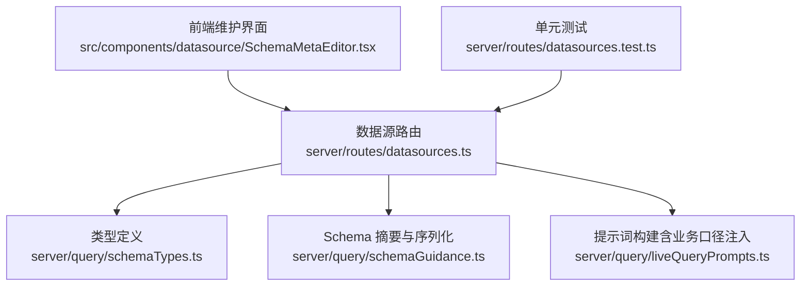
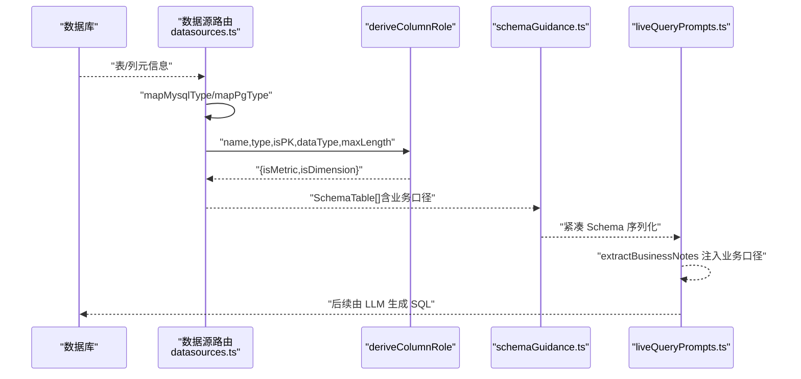
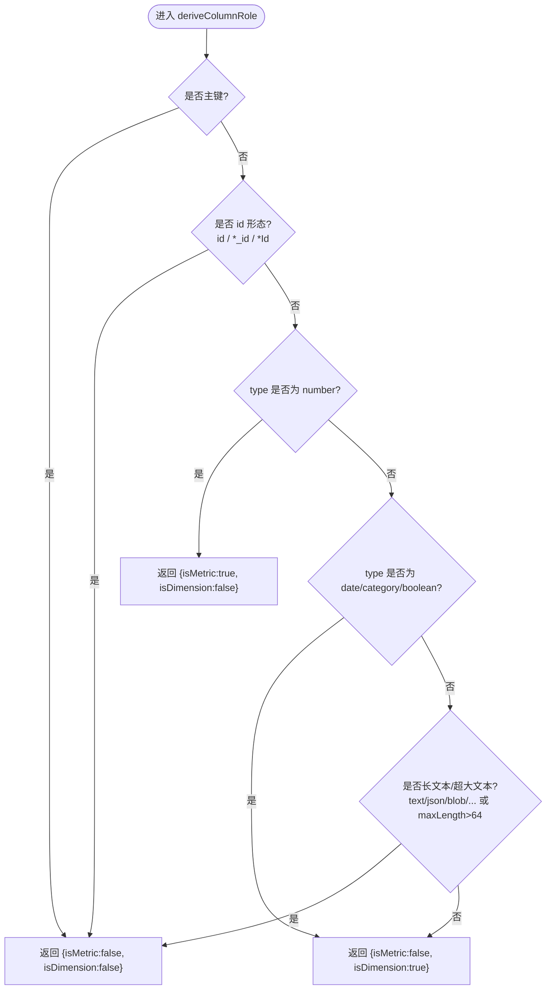
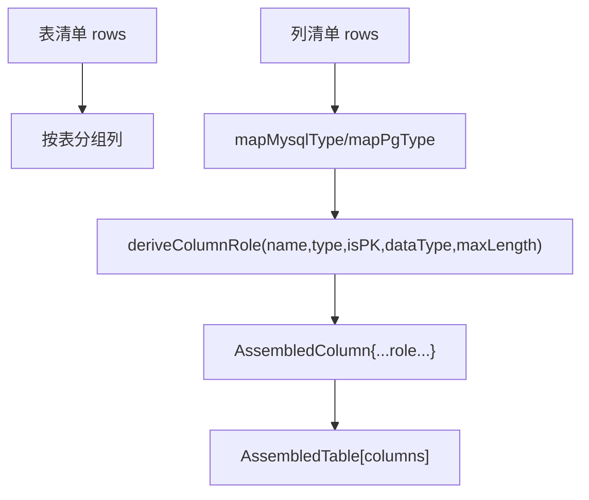
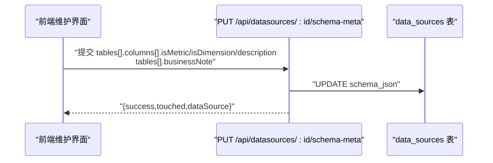
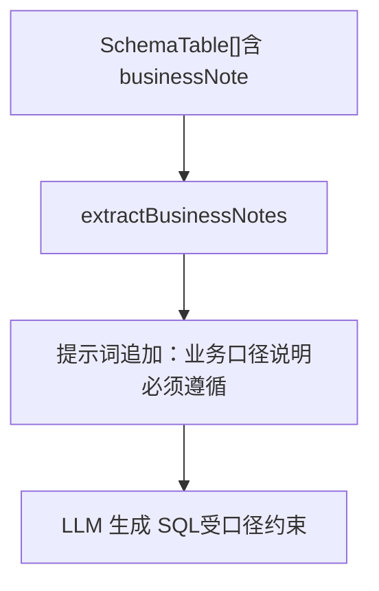
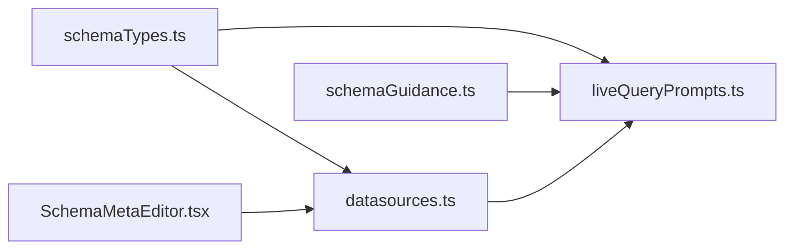

# 角色推导

<cite>
**本文引用的文件**
- [server/routes/datasources.ts](file://server/routes/datasources.ts)
- [server/query/schemaTypes.ts](file://server/query/schemaTypes.ts)
- [server/query/liveQueryPrompts.ts](file://server/query/liveQueryPrompts.ts)
- [server/query/schemaGuidance.ts](file://server/query/schemaGuidance.ts)
- [src/components/datasource/SchemaMetaEditor.tsx](file://src/components/datasource/SchemaMetaEditor.tsx)
- [server/routes/datasources.test.ts](file://server/routes/datasources.test.ts)
</cite>

## 目录
1. [简介](#简介)
2. [项目结构](#项目结构)
3. [核心组件](#核心组件)
4. [架构总览](#架构总览)
5. [详细组件分析](#详细组件分析)
6. [依赖关系分析](#依赖关系分析)
7. [性能考虑](#性能考虑)
8. [故障排查指南](#故障排查指南)
9. [结论](#结论)
10. [附录](#附录)

## 简介
本文件围绕“列角色自动推导”展开，系统性说明 deriveColumnRole 的实现逻辑、管理员手动调整列角色的方法与优先级、业务口径说明（businessNote）的注入与使用方式，以及角色推导准确性评估与优化建议。目标是帮助读者在不深入代码的前提下理解系统如何从数据库 Schema 自动识别指标与维度，并在必要时通过管理界面进行人工修正。

## 项目结构
与角色推导直接相关的后端实现集中在数据源路由模块中，类型定义在共享类型文件中；前端提供可视化维护界面；提示词构建层负责将业务口径注入 LLM 上下文。

图表来源
- [server/routes/datasources.ts:112-135](file://server/routes/datasources.ts#L112-L135)
- [server/query/schemaTypes.ts:8-29](file://server/query/schemaTypes.ts#L8-L29)
- [server/query/schemaGuidance.ts:84-100](file://server/query/schemaGuidance.ts#L84-L100)
- [server/query/liveQueryPrompts.ts:14-20](file://server/query/liveQueryPrompts.ts#L14-L20)
- [src/components/datasource/SchemaMetaEditor.tsx:81-113](file://src/components/datasource/SchemaMetaEditor.tsx#L81-L113)
- [server/routes/datasources.test.ts:30-68](file://server/routes/datasources.test.ts#L30-L68)

章节来源
- [server/routes/datasources.ts:112-135](file://server/routes/datasources.ts#L112-L135)
- [server/query/schemaTypes.ts:8-29](file://server/query/schemaTypes.ts#L8-L29)
- [server/query/liveQueryPrompts.ts:14-20](file://server/query/liveQueryPrompts.ts#L14-L20)
- [server/query/schemaGuidance.ts:84-100](file://server/query/schemaGuidance.ts#L84-L100)
- [src/components/datasource/SchemaMetaEditor.tsx:81-113](file://src/components/datasource/SchemaMetaEditor.tsx#L81-L113)
- [server/routes/datasources.test.ts:30-68](file://server/routes/datasources.test.ts#L30-L68)

## 核心组件
- 列角色自动推导函数：依据列名、类型、是否主键、原始数据类型与长度等特征，输出 isMetric/isDimension 布尔结果。
- Schema 组装流程：从数据库提取表/列元信息，映射为统一类型，并调用推导函数生成列角色。
- 管理员维护接口：PUT /api/datasources/:id/schema-meta，支持覆盖自动推导结果与写入表级业务口径说明。
- 业务口径注入：extractBusinessNotes 将 businessNote 注入到阶段一提示词，约束 SQL 生成口径。
- 前端维护界面：SchemaMetaEditor 提供可视化的列角色与描述编辑入口。

章节来源
- [server/routes/datasources.ts:112-135](file://server/routes/datasources.ts#L112-L135)
- [server/routes/datasources.ts:177-204](file://server/routes/datasources.ts#L177-L204)
- [server/routes/datasources.ts:754-818](file://server/routes/datasources.ts#L754-L818)
- [server/query/liveQueryPrompts.ts:14-20](file://server/query/liveQueryPrompts.ts#L14-L20)
- [src/components/datasource/SchemaMetaEditor.tsx:81-113](file://src/components/datasource/SchemaMetaEditor.tsx#L81-L113)

## 架构总览
下图展示了从数据库 Schema 提取到列角色推导、再到提示词注入的整体流程。

图表来源
- [server/routes/datasources.ts:92-110](file://server/routes/datasources.ts#L92-L110)
- [server/routes/datasources.ts:112-135](file://server/routes/datasources.ts#L112-L135)
- [server/query/schemaGuidance.ts:84-100](file://server/query/schemaGuidance.ts#L84-L100)
- [server/query/liveQueryPrompts.ts:14-20](file://server/query/liveQueryPrompts.ts#L14-L20)

## 详细组件分析

### 列角色自动推导（deriveColumnRole）
- 输入参数
  - name：列名
  - type：标准化后的类型（number/date/category/boolean/string）
  - isPK：是否主键
  - dataType：原始数据类型字符串
  - maxLength：文本列最大长度（可为空）
- 处理规则
  - 主键识别：isPK 为真时，不参与指标与维度。
  - id 形态检测（isIdLike）：满足以下任一条件即视为技术性外键/标识列，不参与指标与维度：
    - 列名为 id（不区分大小写）
    - 以 _id 结尾（不区分大小写）
    - 以 Id 结尾（精确匹配末尾 Id）
  - 数值列判断：type 为 number 时，标记为指标，非维度。
  - 日期/枚举/布尔列：标记为维度，非指标。
  - 短字符串作为维度：当类型为 string 且不是长文本或超长文本时，标记为维度。
  - 长文本/JSON/BLOB 排除：若原始类型为 text/tinytext/mediumtext/longtext/json/jsonb/blob/bytea/xml，或 maxLength > 64，则不参与指标与维度。
- 输出
  - { isMetric: boolean, isDimension: boolean }

图表来源
- [server/routes/datasources.ts:112-135](file://server/routes/datasources.ts#L112-L135)

章节来源
- [server/routes/datasources.ts:112-135](file://server/routes/datasources.ts#L112-L135)
- [server/routes/datasources.test.ts:30-68](file://server/routes/datasources.test.ts#L30-L68)

### Schema 组装与类型映射
- 类型映射
  - MySQL：整型/浮点→number；日期时间→date；enum/set→category；bool→boolean；其余→string。
  - PostgreSQL/Greenplum：整型/序列/货币→number；日期时间→date；bool→boolean；其余→string。
- 组装流程
  - 读取表清单与列清单
  - 对每列执行 mapXxxType 得到 type
  - 计算 isPK（columnKey === 'PRI'）
  - 调用 deriveColumnRole 得到 isMetric/isDimension
  - 按表分组形成 AssembledTable[]

图表来源
- [server/routes/datasources.ts:92-110](file://server/routes/datasources.ts#L92-L110)
- [server/routes/datasources.ts:177-204](file://server/routes/datasources.ts#L177-L204)

章节来源
- [server/routes/datasources.ts:92-110](file://server/routes/datasources.ts#L92-L110)
- [server/routes/datasources.ts:177-204](file://server/routes/datasources.ts#L177-L204)

### 管理员手动调整列角色与业务口径
- 接口
  - PUT /api/datasources/:id/schema-meta（仅管理员）
  - 请求体字段
    - tables：数组，每项包含
      - id/name：定位目标表
      - businessNote：可选，表级业务口径说明（字符串，≤500 字符）
      - columns：数组，每项包含
        - name：列名
        - isMetric：可选，布尔值
        - isDimension：可选，布尔值
        - description：可选，列描述（≤200 字符）
- 行为
  - 更新 schema_json 中的对应表与列
  - 同步失效 Schema 缓存、执行器池与查询缓存
  - 返回受影响条目数与最新 dataSource
- 优先级
  - 管理员手工标注优先于自动推导结果（保存后生效）
  - 同步 Schema 时会保留既有手工标注（新列采用自动推导）

图表来源
- [server/routes/datasources.ts:754-818](file://server/routes/datasources.ts#L754-L818)
- [src/components/datasource/SchemaMetaEditor.tsx:81-113](file://src/components/datasource/SchemaMetaEditor.tsx#L81-L113)

章节来源
- [server/routes/datasources.ts:754-818](file://server/routes/datasources.ts#L754-L818)
- [src/components/datasource/SchemaMetaEditor.tsx:81-113](file://src/components/datasource/SchemaMetaEditor.tsx#L81-L113)

### 业务口径说明（businessNote）的管理与使用
- 管理
  - 通过 PUT /api/datasources/:id/schema-meta 的 tables[].businessNote 字段设置
  - 同步 Schema 时保留既有 businessNote
- 使用
  - extractBusinessNotes 从 SchemaTable[] 中提取非空 businessNote，拼接为“必须遵循”的业务口径段落
  - 该段落在阶段一提示词中注入，约束 LLM 生成 SQL 的计算口径

图表来源
- [server/query/liveQueryPrompts.ts:14-20](file://server/query/liveQueryPrompts.ts#L14-L20)
- [server/query/liveQueryPrompts.ts:35-81](file://server/query/liveQueryPrompts.ts#L35-L81)

章节来源
- [server/query/liveQueryPrompts.ts:14-20](file://server/query/liveQueryPrompts.ts#L14-L20)
- [server/query/liveQueryPrompts.ts:35-81](file://server/query/liveQueryPrompts.ts#L35-L81)

### 角色推导准确性评估与优化建议
- 评估方法
  - 基于单元测试验证典型场景：主键/ID 形态排除、数值列为指标、日期/枚举/布尔为维度、短字符串为维度、长文本/JSON/BLOB 排除
  - 结合真实数据源同步后的 Schema 抽样核对，统计误判率（如将业务维度误判为指标）
- 优化建议
  - 在 Schema 同步后，优先检查 ID 形态列是否被正确排除
  - 对长文本列（maxLength > 64 或 text/json/blob 等）确认未误标为维度
  - 对关键业务维度补充 description，提升后续语义匹配与提示词质量
  - 对复杂度量（如比率、占比）通过业务口径说明明确计算方式，减少歧义

章节来源
- [server/routes/datasources.test.ts:30-68](file://server/routes/datasources.test.ts#L30-L68)
- [server/routes/datasources.ts:112-135](file://server/routes/datasources.ts#L112-L135)

### 常见场景下的角色配置最佳实践
- 主键与外键
  - 主键列不参与指标与维度
  - 名称为 id、以 _id 结尾或以 Id 结尾的数字外键列不参与指标与维度
- 指标列
  - 数值类型（number）默认作为指标
  - 比率/占比/金额等建议在业务口径中明确单位与计算方式
- 维度列
  - 日期、枚举、布尔类型默认作为维度
  - 短字符串（≤64 字符）可作为维度；长文本/JSON/BLOB 不建议作为维度
- 业务口径
  - 在 tables[].businessNote 中登记关键口径（如复购率、转化率），确保 LLM 生成 SQL 时遵循
- 维护流程
  - 导入/同步 Schema 后，打开“指标与维度维护”，逐列校验并修正
  - 保存后即时生效于智能问数与报告生成

章节来源
- [server/routes/datasources.ts:112-135](file://server/routes/datasources.ts#L112-L135)
- [server/query/liveQueryPrompts.ts:14-20](file://server/query/liveQueryPrompts.ts#L14-L20)
- [src/components/datasource/SchemaMetaEditor.tsx:81-113](file://src/components/datasource/SchemaMetaEditor.tsx#L81-L113)

## 依赖关系分析
- 类型契约
  - SchemaColumn/SchemaTable 定义列与表的统一结构，贯穿提取、缓存、提示词序列化与权限过滤
- 模块耦合
  - datasources.ts 依赖 schemaTypes.ts 的类型定义
  - liveQueryPrompts.ts 依赖 schemaTypes.ts 与 schemaGuidance.ts 的序列化能力
  - 前端 SchemaMetaEditor.tsx 通过 REST 接口与 datasources.ts 交互

图表来源
- [server/query/schemaTypes.ts:8-29](file://server/query/schemaTypes.ts#L8-L29)
- [server/routes/datasources.ts:112-135](file://server/routes/datasources.ts#L112-L135)
- [server/query/liveQueryPrompts.ts:14-20](file://server/query/liveQueryPrompts.ts#L14-L20)
- [server/query/schemaGuidance.ts:84-100](file://server/query/schemaGuidance.ts#L84-L100)
- [src/components/datasource/SchemaMetaEditor.tsx:81-113](file://src/components/datasource/SchemaMetaEditor.tsx#L81-L113)

章节来源
- [server/query/schemaTypes.ts:8-29](file://server/query/schemaTypes.ts#L8-L29)
- [server/routes/datasources.ts:112-135](file://server/routes/datasources.ts#L112-L135)
- [server/query/liveQueryPrompts.ts:14-20](file://server/query/liveQueryPrompts.ts#L14-L20)
- [server/query/schemaGuidance.ts:84-100](file://server/query/schemaGuidance.ts#L84-L100)
- [src/components/datasource/SchemaMetaEditor.tsx:81-113](file://src/components/datasource/SchemaMetaEditor.tsx#L81-L113)

## 性能考虑
- 提示词瘦身：serializeSchemaForPrompt 将列对象压缩为紧凑数组，显著降低注入体积，提高 LLM 响应效率
- 缓存失效：更新 schema_meta 或同步 Schema 后，主动失效 Schema 缓存、执行器池与查询缓存，保证一致性
- 长文本过滤：避免将大字段作为维度，减少不必要的上下文膨胀

章节来源
- [server/query/schemaGuidance.ts:84-100](file://server/query/schemaGuidance.ts#L84-L100)
- [server/routes/datasources.ts:754-818](file://server/routes/datasources.ts#L754-L818)

## 故障排查指南
- 问题：某列被错误地标记为指标或维度
  - 检查列名是否符合 id 形态（id/_id/Id），若是则应排除
  - 检查类型映射是否正确（MySQL/PG 系差异）
  - 检查 maxLength 是否超过 64，或原始类型是否为 text/json/blob 等
- 问题：业务口径未生效
  - 确认通过 PUT /api/datasources/:id/schema-meta 正确写入 businessNote
  - 确认同步 Schema 后 businessNote 未被覆盖（同步会保留既有口径）
- 问题：提示词过长导致响应慢
  - 检查是否误将长文本列纳入维度
  - 使用 serializeSchemaForPrompt 的紧凑格式，避免冗余字段

章节来源
- [server/routes/datasources.ts:112-135](file://server/routes/datasources.ts#L112-L135)
- [server/query/liveQueryPrompts.ts:14-20](file://server/query/liveQueryPrompts.ts#L14-L20)
- [server/query/schemaGuidance.ts:84-100](file://server/query/schemaGuidance.ts#L84-L100)

## 结论
deriveColumnRole 提供了稳定、可预期的列角色自动推导规则，结合管理员手动维护接口与业务口径注入机制，能够在多数场景下准确指导 LLM 生成符合业务意图的 SQL。实践中建议优先保障 ID 形态列的正确排除、长文本列的合理过滤，并通过业务口径明确复杂度量口径，从而持续提升问数准确率与稳定性。

## 附录
- 相关类型定义
  - SchemaColumn：name/type/description/isPrimaryKey/isDimension/isMetric
  - SchemaTable：name/id/displayName/description/businessNote/rowCount/tableType/columns
- 参考测试用例
  - 主键/ID 形态排除、数值列为指标、日期/枚举/布尔为维度、短字符串为维度、长文本/JSON/BLOB 排除

章节来源
- [server/query/schemaTypes.ts:8-29](file://server/query/schemaTypes.ts#L8-L29)
- [server/routes/datasources.test.ts:30-68](file://server/routes/datasources.test.ts#L30-L68)