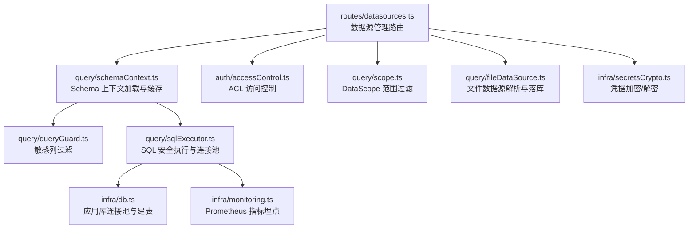
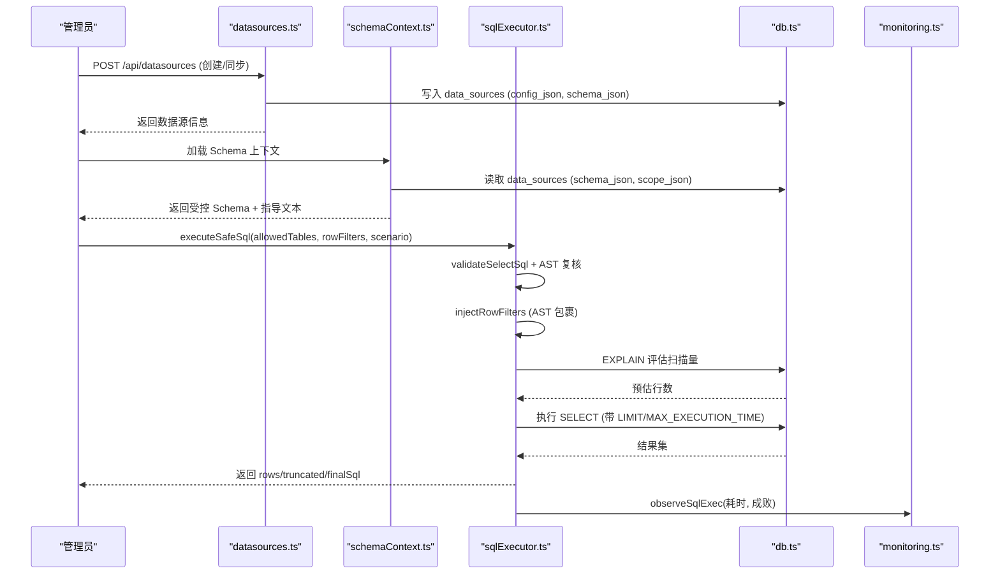
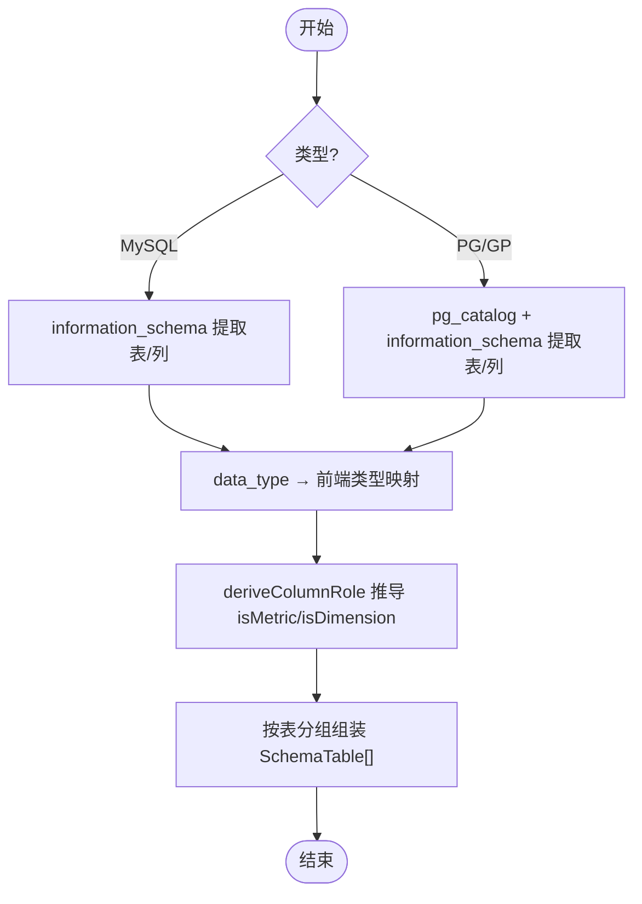
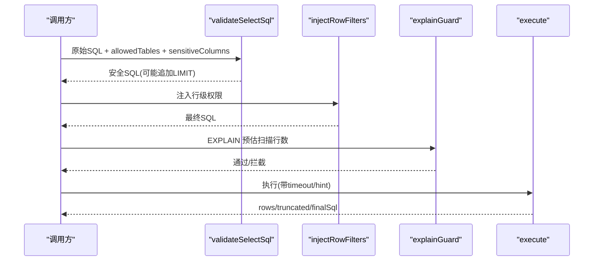
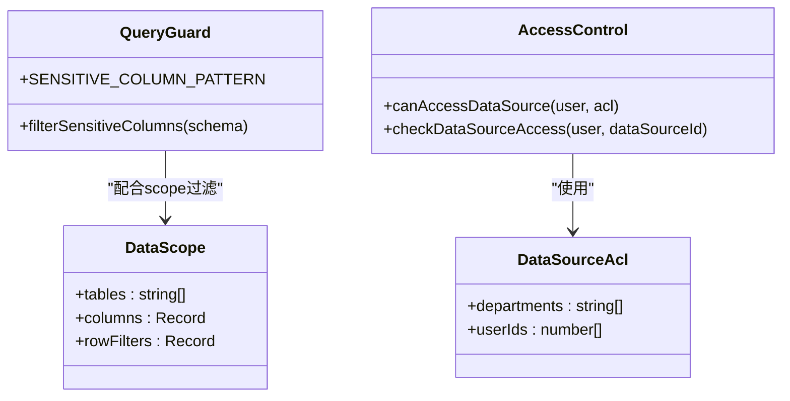
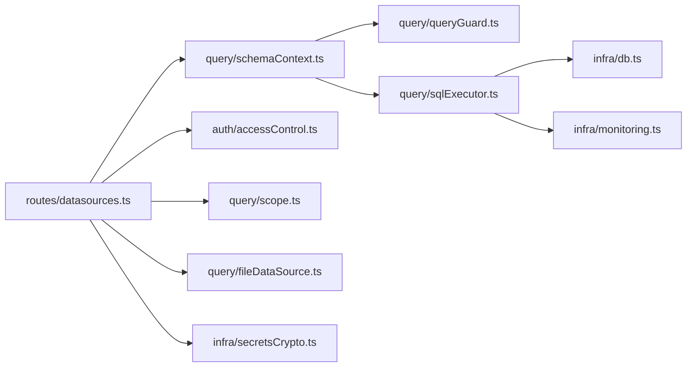

# 数据源管理

<cite>
**本文引用的文件**
- [server/routes/datasources.ts](file://server/routes/datasources.ts)
- [server/query/sqlExecutor.ts](file://server/query/sqlExecutor.ts)
- [server/query/schemaContext.ts](file://server/query/schemaContext.ts)
- [server/auth/accessControl.ts](file://server/auth/accessControl.ts)
- [server/infra/db.ts](file://server/infra/db.ts)
- [server/query/scope.ts](file://server/query/scope.ts)
- [server/query/queryGuard.ts](file://server/query/queryGuard.ts)
- [server/infra/secretsCrypto.ts](file://server/infra/secretsCrypto.ts)
- [server/query/fileDataSource.ts](file://server/query/fileDataSource.ts)
- [server/infra/monitoring.ts](file://server/infra/monitoring.ts)
</cite>

## 目录
1. [简介](#简介)
2. [项目结构](#项目结构)
3. [核心组件](#核心组件)
4. [架构总览](#架构总览)
5. [详细组件分析](#详细组件分析)
6. [依赖关系分析](#依赖关系分析)
7. [性能考量](#性能考量)
8. [故障排查指南](#故障排查指南)
9. [结论](#结论)
10. [附录：配置与调优示例](#附录配置与调优示例)

## 简介
本文件面向“智能问数据分析系统”的数据源管理能力，覆盖以下主题：
- 支持的数据源类型及连接配置与管理方式（MySQL、PostgreSQL、Greenplum、CSV/Excel/JSON 文件数据源）
- Schema 元数据提取机制（表结构分析、字段类型识别、关联关系推断）
- SQL 执行引擎（查询安全校验、执行计划评估、结果集处理）
- 数据权限控制（行级权限、列级权限、敏感列脱敏策略）
- 企业级特性（连接池分级管理、性能监控、故障恢复）
- 配置示例、权限设置指南与性能调优建议

## 项目结构
数据源管理涉及路由层、Schema 上下文、SQL 执行与安全、权限控制、持久化与加密、文件数据源解析以及监控埋点等模块。整体组织遵循“路由 → 领域服务 → 基础设施”的分层模式。

图表来源
- [server/routes/datasources.ts:1-120](file://server/routes/datasources.ts#L1-L120)
- [server/query/schemaContext.ts:1-80](file://server/query/schemaContext.ts#L1-L80)
- [server/auth/accessControl.ts:1-73](file://server/auth/accessControl.ts#L1-L73)
- [server/query/scope.ts:1-45](file://server/query/scope.ts#L1-L45)
- [server/query/fileDataSource.ts:1-60](file://server/query/fileDataSource.ts#L1-L60)
- [server/query/sqlExecutor.ts:1-120](file://server/query/sqlExecutor.ts#L1-L120)
- [server/infra/db.ts:1-70](file://server/infra/db.ts#L1-L70)
- [server/infra/monitoring.ts:1-80](file://server/infra/monitoring.ts#L1-L80)
- [server/infra/secretsCrypto.ts:1-50](file://server/infra/secretsCrypto.ts#L1-L50)

章节来源
- [server/routes/datasources.ts:1-120](file://server/routes/datasources.ts#L1-L120)
- [server/query/schemaContext.ts:1-80](file://server/query/schemaContext.ts#L1-L80)
- [server/query/sqlExecutor.ts:1-120](file://server/query/sqlExecutor.ts#L1-L120)

## 核心组件
- 数据源路由：提供数据源的增删改查、Schema 同步、文件导入、Flex Schema 读取等能力，并对不同角色进行权限控制。
- Schema 上下文：从持久化 Schema 中按 DataScope 与敏感列规则过滤，生成注入 LLM 的 Schema 摘要，并缓存。
- SQL 执行器：对 LLM 生成的 SQL 进行严格的安全校验、AST 复核、行级权限注入、EXPLAIN 防线评估与结果截断。
- 权限控制：基于 ACL 的数据源访问控制；基于 DataScope 的行/列/表范围限制；敏感列自动脱敏。
- 文件数据源：上传 CSV/Excel/JSON，解析并落应用库物理表，作为可真实问数的数据源。
- 基础设施：应用库连接池、凭据加密、监控埋点、审计日志等。

章节来源
- [server/routes/datasources.ts:364-752](file://server/routes/datasources.ts#L364-L752)
- [server/query/schemaContext.ts:108-172](file://server/query/schemaContext.ts#L108-L172)
- [server/query/sqlExecutor.ts:291-387](file://server/query/sqlExecutor.ts#L291-L387)
- [server/auth/accessControl.ts:43-73](file://server/auth/accessControl.ts#L43-L73)
- [server/query/fileDataSource.ts:138-208](file://server/query/fileDataSource.ts#L138-L208)
- [server/infra/db.ts:47-70](file://server/infra/db.ts#L47-L70)
- [server/infra/secretsCrypto.ts:27-50](file://server/infra/secretsCrypto.ts#L27-L50)
- [server/infra/monitoring.ts:63-88](file://server/infra/monitoring.ts#L63-L88)

## 架构总览
数据源管理的端到端流程如下：管理员通过路由创建或同步数据源，系统根据类型执行真实连接与 Schema 提取；问数链路通过 Schema 上下文加载受控 Schema；SQL 执行前经过多层安全校验与 EXPLAIN 防线；最终结果集被截断并返回。

图表来源
- [server/routes/datasources.ts:442-482](file://server/routes/datasources.ts#L442-L482)
- [server/query/schemaContext.ts:108-172](file://server/query/schemaContext.ts#L108-L172)
- [server/query/sqlExecutor.ts:734-800](file://server/query/sqlExecutor.ts#L734-L800)
- [server/infra/db.ts:47-70](file://server/infra/db.ts#L47-L70)
- [server/infra/monitoring.ts:128-133](file://server/infra/monitoring.ts#L128-L133)

## 详细组件分析

### 数据源类型与连接配置
- 支持的数据库类型：MySQL、PostgreSQL、Greenplum。
- 支持的文件数据源：CSV、Excel、JSON。上传后在服务端解析并落应用库物理表（upl_*），后续走真实 SQL 执行链路。
- 连接配置字段包括 host、port、username、password、database，PG/Greenplum 支持 schema 指定。
- 密码以 AES-256-GCM 密文存储，连接时解密；列表接口不返回密码。

章节来源
- [server/routes/datasources.ts:45-69](file://server/routes/datasources.ts#L45-L69)
- [server/routes/datasources.ts:223-347](file://server/routes/datasources.ts#L223-L347)
- [server/query/fileDataSource.ts:1-60](file://server/query/fileDataSource.ts#L1-L60)
- [server/infra/secretsCrypto.ts:27-50](file://server/infra/secretsCrypto.ts#L27-L50)

### Schema 元数据提取机制
- MySQL：通过 information_schema.tables/columns 获取表清单与列结构，包含主键、注释、最大长度等；将 data_type 映射为前端类型（number/date/category/boolean/string）。
- PostgreSQL/Greenplum：通过 pg_catalog/pg_description/information_schema 获取表清单与列结构，兼容视图、物化视图、外部表；同样映射类型并推导列角色。
- 列角色推导：依据列名特征（如 id/_id）、数据类型、是否主键、字符串长度等自动判断是否为指标或维度；长文本/JSON/BLOB 不参与分析。
- 表级业务口径说明（businessNote）在同步时保留，用于注入 LLM 上下文。

图表来源
- [server/routes/datasources.ts:92-135](file://server/routes/datasources.ts#L92-L135)
- [server/routes/datasources.ts:223-347](file://server/routes/datasources.ts#L223-L347)

章节来源
- [server/routes/datasources.ts:92-135](file://server/routes/datasources.ts#L92-L135)
- [server/routes/datasources.ts:223-347](file://server/routes/datasources.ts#L223-L347)

### SQL 执行引擎
- 安全校验：仅允许单条 SELECT（含 WITH CTE），拒绝危险关键字与 INTO 写操作；正则防线 + node-sql-parser AST 二道防线。
- 白名单校验：仅允许访问 DataScope 过滤后的表集合；CTE 别名排除在表白名单之外。
- 行级权限：AST 遍历 FROM/JOIN/子查询/UNION，将受控表包裹为派生表并注入 WHERE 谓词；失败 fail-closed。
- 执行计划评估：EXPLAIN 解析预估扫描行数，超过阈值拦截（fail-open 放行 EXPLAIN 失败场景）。
- 结果处理：强制 LIMIT 上限（默认 10 万），MySQL 注入 MAX_EXECUTION_TIME hint；文件数据源跳过 EXPLAIN 但保留驱动超时与 hint。
- 连接池：按数据源 ID + 场景（interactive/chain/export）分级缓存，容量与超时由环境变量控制。

图表来源
- [server/query/sqlExecutor.ts:291-387](file://server/query/sqlExecutor.ts#L291-L387)
- [server/query/sqlExecutor.ts:396-489](file://server/query/sqlExecutor.ts#L396-L489)
- [server/query/sqlExecutor.ts:629-662](file://server/query/sqlExecutor.ts#L629-L662)
- [server/query/sqlExecutor.ts:686-726](file://server/query/sqlExecutor.ts#L686-L726)

章节来源
- [server/query/sqlExecutor.ts:291-387](file://server/query/sqlExecutor.ts#L291-L387)
- [server/query/sqlExecutor.ts:396-489](file://server/query/sqlExecutor.ts#L396-L489)
- [server/query/sqlExecutor.ts:629-662](file://server/query/sqlExecutor.ts#L629-L662)
- [server/query/sqlExecutor.ts:686-726](file://server/query/sqlExecutor.ts#L686-L726)

### 数据权限控制机制
- 数据源访问控制（ACL）：按部门与用户 ID 授权；ADMIN 始终可访问；未配置 ACL 表示不限制。
- 问数范围（DataScope）：限制可用表、列与行级过滤谓词；同步时清洗已删除的表/列，确保漂移容错。
- 敏感列脱敏：基于正则匹配列名/描述，从进入 LLM 的 Schema 中剔除敏感列，并记录 removed 清单。
- 行级权限：管理员登记谓词，执行层 AST 强制注入；谓词需通过结构化清洗，禁止多语句/注释/子查询/INTO。

图表来源
- [server/auth/accessControl.ts:13-73](file://server/auth/accessControl.ts#L13-L73)
- [server/query/scope.ts:10-101](file://server/query/scope.ts#L10-L101)
- [server/query/queryGuard.ts:71-101](file://server/query/queryGuard.ts#L71-L101)

章节来源
- [server/auth/accessControl.ts:43-73](file://server/auth/accessControl.ts#L43-L73)
- [server/query/scope.ts:28-101](file://server/query/scope.ts#L28-L101)
- [server/query/queryGuard.ts:71-101](file://server/query/queryGuard.ts#L71-L101)

### 文件数据源管理
- 上传与解析：支持 CSV/Excel/JSON，统一为行列结构；列名安全化（非法/保留字改名），命中敏感词的列整列剔除。
- 物理表：upl_ 前缀白名单，参数化批量写入；删除数据源时级联 DROP 物理表。
- 类型推断：样本数值占比 ≥60% 判定为 DOUBLE，其余 TEXT；导入响应附带 stats（rows/columns/droppedSensitive/truncated）。

章节来源
- [server/query/fileDataSource.ts:73-109](file://server/query/fileDataSource.ts#L73-L109)
- [server/query/fileDataSource.ts:138-208](file://server/query/fileDataSource.ts#L138-L208)
- [server/routes/datasources.ts:484-586](file://server/routes/datasources.ts#L484-L586)

### 连接池管理与性能监控
- 应用库连接池：启动时初始化，容量公式化（默认按并发用户数推导，下限不低于原水位）。
- 数据源连接池：按数据源 ID + 场景分级缓存；容量与超时可通过环境变量显式配置；配置变更后失效重建。
- 监控埋点：Prometheus 指标覆盖请求耗时、SQL 执行耗时、EXPLAIN 防线状态、LLM 用量等；/metrics 端点可选鉴权保护。

章节来源
- [server/infra/db.ts:29-70](file://server/infra/db.ts#L29-L70)
- [server/query/sqlExecutor.ts:44-109](file://server/query/sqlExecutor.ts#L44-L109)
- [server/query/sqlExecutor.ts:491-515](file://server/query/sqlExecutor.ts#L491-L515)
- [server/infra/monitoring.ts:1-88](file://server/infra/monitoring.ts#L1-L88)
- [server/infra/monitoring.ts:135-153](file://server/infra/monitoring.ts#L135-L153)

## 依赖关系分析
- 路由层依赖 Schema 上下文、权限控制、文件数据源与加密工具。
- Schema 上下文依赖 DataScope 与敏感列过滤，并缓存到 StateStore（内存/Redis）。
- SQL 执行器依赖应用库连接池、监控埋点，并在必要时回退到演示模式。
- 权限控制与 DataScope 共同决定可见表/列与行级过滤。

图表来源
- [server/routes/datasources.ts:1-28](file://server/routes/datasources.ts#L1-L28)
- [server/query/schemaContext.ts:1-16](file://server/query/schemaContext.ts#L1-L16)
- [server/query/sqlExecutor.ts:11-21](file://server/query/sqlExecutor.ts#L11-L21)
- [server/infra/db.ts:1-13](file://server/infra/db.ts#L1-L13)
- [server/infra/monitoring.ts:1-15](file://server/infra/monitoring.ts#L1-L15)
- [server/infra/secretsCrypto.ts:1-7](file://server/infra/secretsCrypto.ts#L1-L7)

## 性能考量
- 连接池容量：应用库与数据源连接池均公式化，避免硬编码；可按 EXPECTED_CONCURRENT_USERS 与环境变量调整。
- 执行超时：按场景差异化（交互/链/导出），MySQL 注入 MAX_EXECUTION_TIME hint，PG 使用 statement_timeout。
- EXPLAIN 防线：默认 100 万行阈值，导出场景放宽 10 倍；EXPLAIN 失败 fail-open 不阻断正常查询。
- 结果截断：MAX_ROWS 默认 10 万，防止 OOM；文件数据源限流行/列上限。
- 缓存：Schema 上下文缓存 5 分钟；配置/结构变更时主动失效；查询结果缓存 TTL 延长至 30 分钟，变更时失效保证正确性。

章节来源
- [server/query/sqlExecutor.ts:41-109](file://server/query/sqlExecutor.ts#L41-L109)
- [server/query/sqlExecutor.ts:531-662](file://server/query/sqlExecutor.ts#L531-L662)
- [server/query/schemaContext.ts:30-55](file://server/query/schemaContext.ts#L30-L55)
- [server/routes/datasources.ts:642-650](file://server/routes/datasources.ts#L642-L650)

## 故障排查指南
- 数据源列表异常：检查 data_sources 表是否存在、status 是否为 connected；非 ADMIN 查看 ACL 是否限制。
- Schema 同步失败：确认数据库连接配置与密码是否正确；MySQL/PG/GP 方言差异导致的 SQL 错误；查看日志中的连接与提取过程。
- SQL 执行被拒：检查 validateSelectSql 原因（只读、关键字、表白名单、敏感列）；确认行级权限谓词是否合法；查看 AST 二道防线与 EXPLAIN 防线拦截原因。
- 连接池耗尽：观察 dsPoolMax 与场景配额；调整 DS_POOL_MAX、DS_POOL_INTERACTIVE/CHAIN/EXPORT；检查长时间查询与超时设置。
- 监控指标：通过 /metrics 查看 nl2sql_requests_total、sql_execute_duration_seconds、sql_explain_guard_total 等指标定位瓶颈。

章节来源
- [server/routes/datasources.ts:364-401](file://server/routes/datasources.ts#L364-L401)
- [server/query/sqlExecutor.ts:291-387](file://server/query/sqlExecutor.ts#L291-L387)
- [server/query/sqlExecutor.ts:629-662](file://server/query/sqlExecutor.ts#L629-L662)
- [server/infra/monitoring.ts:63-88](file://server/infra/monitoring.ts#L63-L88)

## 结论
本系统的数据源管理实现了企业级的安全与性能保障：
- 多类型数据源支持与自动化 Schema 提取
- 严格的 SQL 安全校验与执行计划评估
- 多维权限控制（ACL/DataScope/敏感列/行级权限）
- 连接池分级与超时控制、监控埋点与故障恢复
- 文件数据源落地应用库，统一问数体验

## 附录：配置与调优示例

- 数据源连接配置（示例字段）
  - MySQL：host、port、username、password、database
  - PostgreSQL/Greenplum：host、port、username、password、database、schema
  - 文件数据源：fileName、fileSize、fileType、physicalTable（服务端维护）

- 权限设置指南
  - ACL：配置 departments/userIds；未配置表示不限制；ADMIN 始终可访问
  - DataScope：tables 限制表；columns 限制列；rowFilters 登记行级谓词（需通过 sanitizeRowFilterPredicate）
  - 敏感列：自动从 Schema 中剔除，removed 清单供 UI 标记与审计

- 性能调优建议
  - 连接池：APP_POOL_MAX、DS_POOL_MAX、DS_POOL_INTERACTIVE/CHAIN/EXPORT
  - 超时：QUERY_TIMEOUT_INTERACTIVE_MS/CHAIN_MS/EXPORT_MS
  - EXPLAIN 防线：SQL_EXPLAIN_MAX_ROWS（默认 100 万，导出场景放宽）
  - 结果截断：MAX_ROWS（默认 10 万）
  - 监控：关注 /metrics 的 sql_execute_duration_seconds、nl2sql_duration_seconds、sql_explain_guard_total

章节来源
- [server/routes/datasources.ts:45-69](file://server/routes/datasources.ts#L45-L69)
- [server/query/scope.ts:17-26](file://server/query/scope.ts#L17-L26)
- [server/query/queryGuard.ts:71-101](file://server/query/queryGuard.ts#L71-L101)
- [server/query/sqlExecutor.ts:44-109](file://server/query/sqlExecutor.ts#L44-L109)
- [server/query/sqlExecutor.ts:531-662](file://server/query/sqlExecutor.ts#L531-L662)
- [server/infra/monitoring.ts:63-88](file://server/infra/monitoring.ts#L63-L88)