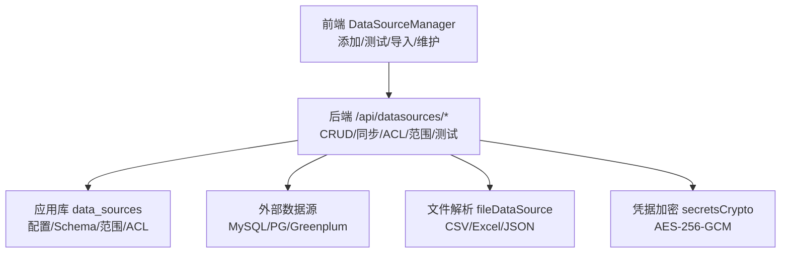
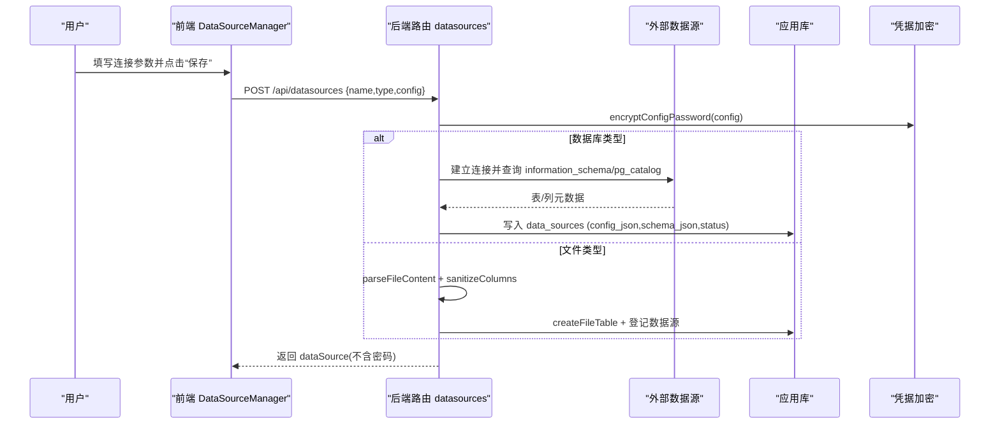
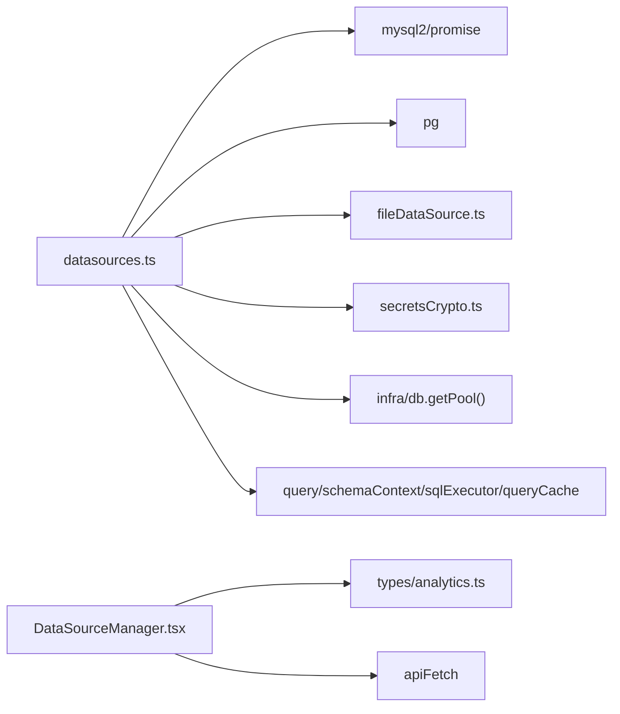

# 数据源配置

<cite>
**本文引用的文件**
- [server/routes/datasources.ts](file://server/routes/datasources.ts)
- [src/components/datasource/DataSourceManager.tsx](file://src/components/datasource/DataSourceManager.tsx)
- [server/query/fileDataSource.ts](file://server/query/fileDataSource.ts)
- [server/infra/secretsCrypto.ts](file://server/infra/secretsCrypto.ts)
- [src/types/analytics.ts](file://src/types/analytics.ts)
</cite>

## 目录
1. [简介](#简介)
2. [项目结构](#项目结构)
3. [核心组件](#核心组件)
4. [架构总览](#架构总览)
5. [详细组件分析](#详细组件分析)
6. [依赖关系分析](#依赖关系分析)
7. [性能与连接池](#性能与连接池)
8. [故障排查指南](#故障排查指南)
9. [结论](#结论)
10. [附录：配置示例与参数说明](#附录配置示例与参数说明)

## 简介
本文件面向“智能问数据分析系统”的数据源配置，覆盖支持的数据源类型、连接参数、认证与安全、Schema 同步、连接测试、企业级超时与健康检查等。系统当前内置支持 MySQL、PostgreSQL、Greenplum、CSV、Excel、JSON、API、Demo 等数据源；其中数据库类数据源可真实连接并自动提取 Schema，文件类数据源通过上传解析后落应用库物理表，API/Demo 为模拟或占位模式。

## 项目结构
数据源能力由后端路由、前端管理界面、文件解析模块、凭据加密模块以及类型定义共同构成：
- 后端路由：提供数据源的增删改查、Schema 同步、访问控制、范围限定、连接测试等接口
- 前端管理：提供新增连接、测试连接、导入文件、维护指标维度、配置问数范围与 ACL 的交互
- 文件解析：解析 CSV/Excel/JSON，安全化列名、敏感列剔除、类型推断、批量写入应用库
- 凭据加密：对密码进行 AES-256-GCM 加密存储，解密用于真实连接
- 类型定义：统一前后端的数据源、表结构、列结构、问数范围等模型

图表来源
- [server/routes/datasources.ts:1-971](file://server/routes/datasources.ts#L1-L971)
- [src/components/datasource/DataSourceManager.tsx:1-997](file://src/components/datasource/DataSourceManager.tsx#L1-L997)
- [server/query/fileDataSource.ts:1-208](file://server/query/fileDataSource.ts#L1-L208)
- [server/infra/secretsCrypto.ts:1-50](file://server/infra/secretsCrypto.ts#L1-L50)

章节来源
- [server/routes/datasources.ts:1-971](file://server/routes/datasources.ts#L1-L971)
- [src/components/datasource/DataSourceManager.tsx:1-997](file://src/components/datasource/DataSourceManager.tsx#L1-L997)

## 核心组件
- 数据源类型枚举与模型：定义支持的类型、表/列结构、问数范围、访问控制等
- 数据源路由：实现数据源生命周期管理、Schema 同步、ACL/Scope 配置、连接测试
- 文件数据源：上传 CSV/Excel/JSON，解析、清洗、类型推断、落库物理表
- 凭据加密：密码加密存储与解密，保障敏感信息不落地明文
- 前端管理：表单输入、连接测试、导入流程、元数据维护

章节来源
- [src/types/analytics.ts:1-85](file://src/types/analytics.ts#L1-L85)
- [server/routes/datasources.ts:30-175](file://server/routes/datasources.ts#L30-L175)
- [server/query/fileDataSource.ts:1-208](file://server/query/fileDataSource.ts#L1-L208)
- [server/infra/secretsCrypto.ts:1-50](file://server/infra/secretsCrypto.ts#L1-L50)
- [src/components/datasource/DataSourceManager.tsx:57-497](file://src/components/datasource/DataSourceManager.tsx#L57-L497)

## 架构总览
数据源配置的核心流程包括：
- 新增数据源：前端收集参数 → 后端校验 → 数据库类型则真实连接并提取 Schema → 持久化配置与 Schema
- 文件导入：前端上传 Base64 → 后端解析并清洗 → 创建物理表并批量写入 → 登记数据源
- 连接测试：前端触发 → 后端按类型建立连接并探测表数量 → 返回延迟与结果
- Schema 同步：管理员触发 → 重新连接并拉取最新结构 → 合并保留人工标注 → 更新缓存

图表来源
- [server/routes/datasources.ts:442-482](file://server/routes/datasources.ts#L442-L482)
- [server/routes/datasources.ts:484-586](file://server/routes/datasources.ts#L484-L586)
- [server/infra/secretsCrypto.ts:45-50](file://server/infra/secretsCrypto.ts#L45-L50)
- [server/query/fileDataSource.ts:138-201](file://server/query/fileDataSource.ts#L138-L201)

## 详细组件分析

### 支持的数据源类型与用途
- 数据库类（真实连接与 Schema 提取）
  - MySQL：使用 mysql2/promise 连接，读取 information_schema 获取表与列
  - PostgreSQL/Greenplum：使用 pg 客户端，基于 pg_catalog/information_schema 获取对象与列
- 文件类（上传解析并落应用库）
  - CSV/Excel/JSON：解析为行列结构，安全化列名、敏感列剔除、类型推断，批量写入 upl_* 物理表
- 其他类型（模拟/占位）
  - API/Demo：连接测试返回模拟响应；非数据库类型在保存时生成占位 Schema

章节来源
- [server/routes/datasources.ts:64-69](file://server/routes/datasources.ts#L64-L69)
- [server/routes/datasources.ts:223-347](file://server/routes/datasources.ts#L223-L347)
- [server/query/fileDataSource.ts:44-49](file://server/query/fileDataSource.ts#L44-L49)
- [server/routes/datasources.ts:959-967](file://server/routes/datasources.ts#L959-L967)

### 连接参数与连接字符串
- 通用参数
  - host：主机地址或域名
  - port：端口号（MySQL 默认 3306，PG/GP 默认 5432）
  - username：用户名
  - password：密码（仅服务端使用，列表下发前剔除）
  - database：数据库名
  - schema：PostgreSQL/Greenplum 的 schema（默认 public）
- 连接字符串格式
  - 系统未采用 URL 形式的连接串；参数以 JSON 对象形式传递并持久化为 config_json
  - 对于 API/Demo 等非数据库类型，config 中可能包含 url 字段用于前端展示或扩展

章节来源
- [server/routes/datasources.ts:45-54](file://server/routes/datasources.ts#L45-L54)
- [src/types/analytics.ts:54-85](file://src/types/analytics.ts#L54-L85)
- [src/components/datasource/DataSourceManager.tsx:116-148](file://src/components/datasource/DataSourceManager.tsx#L116-L148)

### 认证方式与安全传输
- 认证
  - 数据库认证：使用用户名/密码直接连接目标数据库
  - 系统鉴权：所有写操作与连接测试需 ADMIN 角色；列表对所有登录用户可见但剥离敏感字段
- 安全传输
  - 密码加密存储：使用 AES-256-GCM 加密，密文格式含 iv/authTag/cipher；密钥来源于环境变量 DS_SECRET_KEY 或 JWT_SECRET
  - 明文仅在内存中用于连接，不落库；列表响应剔除 password 字段
  - 连接测试时直接使用前端传入的明文密码（尚未落库），成功后再决定是否保存

章节来源
- [server/infra/secretsCrypto.ts:1-50](file://server/infra/secretsCrypto.ts#L1-L50)
- [server/routes/datasources.ts:71-89](file://server/routes/datasources.ts#L71-L89)
- [server/routes/datasources.ts:880-967](file://server/routes/datasources.ts#L880-L967)

### 连接池与连接选项
- 连接池
  - 应用库读写使用 getPool() 提供的连接池（来自 infra/db）
  - 外部数据库连接在 Schema 提取与连接测试中按需创建并释放（finally/end 确保关闭）
- 连接选项
  - MySQL：connectTimeout=5000ms
  - PG/GP：connectionTimeoutMillis=5000ms，statement_timeout=10000~15000ms
  - 注意：当前代码未暴露可配置的 pool 大小、最大空闲、最小空闲等高级选项

章节来源
- [server/routes/datasources.ts:223-232](file://server/routes/datasources.ts#L223-L232)
- [server/routes/datasources.ts:260-269](file://server/routes/datasources.ts#L260-L269)
- [server/routes/datasources.ts:888-901](file://server/routes/datasources.ts#L888-L901)
- [server/routes/datasources.ts:926-936](file://server/routes/datasources.ts#L926-L936)

### Schema 提取与同步
- 数据库类型
  - MySQL：从 information_schema.tables/columns 提取表清单与列信息，映射数据类型到前端类型
  - PG/GP：从 pg_catalog/information_schema 提取对象与列，兼容视图、物化视图、外部表等
- 自动推导
  - 根据列名、主键、数据类型、长度等自动推导指标/维度角色
- 同步机制
  - 支持 /sync-schema 接口重新拉取最新结构，保留管理员手工标注（业务口径、指标/维度标记）
  - 同步后清理问数范围（剔除已删除的表/字段），并失效相关缓存（Schema/执行器/查询缓存）

章节来源
- [server/routes/datasources.ts:92-135](file://server/routes/datasources.ts#L92-L135)
- [server/routes/datasources.ts:223-347](file://server/routes/datasources.ts#L223-L347)
- [server/routes/datasources.ts:588-656](file://server/routes/datasources.ts#L588-L656)

### 文件数据源（CSV/Excel/JSON）
- 解析与清洗
  - CSV：去除 BOM，自动识别分隔符，跳过空行
  - Excel：读取首个工作表，处理富文本/超链接/公式/日期
  - JSON：支持对象数组或二维数组，统一为行列结构
- 安全策略
  - 列名安全化（非法字符/保留字替换为 fN），敏感列整列剔除
  - 行数/列数上限截断（20000 行/100 列），并在响应中标注 truncated
- 落库与登记
  - 创建 upl_* 物理表，批量参数化写入
  - 登记数据源类型为 csv/json/excel，config 记录 fileName/fileSize/physicalTable

章节来源
- [server/query/fileDataSource.ts:1-208](file://server/query/fileDataSource.ts#L1-L208)
- [server/routes/datasources.ts:484-586](file://server/routes/datasources.ts#L484-L586)

### 连接测试功能
- 入口
  - 前端调用 /api/datasources/test-connection，传入 type 与 config
- 行为
  - 数据库类型：真实连接并执行 SELECT 1，统计表数量，返回 latencyMs 与 tableCount
  - 非数据库类型：返回模拟成功响应（延迟随机、表数量随机）
- 错误处理
  - 捕获异常并返回 success=false 及 message，便于前端提示

章节来源
- [src/components/datasource/DataSourceManager.tsx:116-148](file://src/components/datasource/DataSourceManager.tsx#L116-L148)
- [server/routes/datasources.ts:880-967](file://server/routes/datasources.ts#L880-L967)

### 问数范围与访问控制
- 问数范围（scope）
  - 管理员可圈定允许纳入智能问数的表与字段；为空/null 表示不限制
  - 同步 Schema 时会清理 scope，剔除已删除的表/字段
- 访问控制（ACL）
  - 支持部门与用户白名单；空/null 表示全员可见
  - 非管理员列表接口剥离 tables 详情，无权限时返回 accessDenied 标记

章节来源
- [server/routes/datasources.ts:821-873](file://server/routes/datasources.ts#L821-L873)
- [server/routes/datasources.ts:364-401](file://server/routes/datasources.ts#L364-L401)
- [src/types/analytics.ts:45-85](file://src/types/analytics.ts#L45-L85)

## 依赖关系分析
- 路由依赖
  - 数据库驱动：mysql2/promise、pg
  - 基础设施：getPool（应用库连接池）、logger、accessControl、schemaContext、sqlExecutor、queryCache、dataVersion
  - 文件解析：exceljs、papaparse
  - 凭据加密：secretsCrypto
- 前端依赖
  - 类型定义：analytics.ts
  - API 客户端：apiFetch
  - 组件：SchemaViewer、DataLineageView、SchemaMetaEditor、AclConfigModal、ScopeConfigModal、KnowledgeBasePanel、SqlExamplesPanel

图表来源
- [server/routes/datasources.ts:1-28](file://server/routes/datasources.ts#L1-L28)
- [server/query/fileDataSource.ts:14-18](file://server/query/fileDataSource.ts#L14-L18)
- [server/infra/secretsCrypto.ts:1-7](file://server/infra/secretsCrypto.ts#L1-L7)
- [src/components/datasource/DataSourceManager.tsx:23-32](file://src/components/datasource/DataSourceManager.tsx#L23-L32)

章节来源
- [server/routes/datasources.ts:1-28](file://server/routes/datasources.ts#L1-L28)
- [server/query/fileDataSource.ts:14-18](file://server/query/fileDataSource.ts#L14-L18)
- [server/infra/secretsCrypto.ts:1-7](file://server/infra/secretsCrypto.ts#L1-L7)
- [src/components/datasource/DataSourceManager.tsx:23-32](file://src/components/datasource/DataSourceManager.tsx#L23-L32)

## 性能与连接池
- 连接超时
  - MySQL：connectTimeout=5000ms
  - PG/GP：connectionTimeoutMillis=5000ms，statement_timeout=10000~15000ms
- 重试机制
  - 当前代码未实现显式重试逻辑；建议在网关或上层封装增加指数退避重试
- 健康检查
  - 连接测试即轻量健康检查（SELECT 1 + 统计表数量）
  - 可通过定时任务调用 test-connection 或执行轻量 SQL 实现周期性健康检查
- 连接池
  - 应用库使用 getPool() 提供的连接池；外部数据库连接按需创建并释放
  - 如需调整池大小、空闲策略等，可在 infra/db 层扩展配置

章节来源
- [server/routes/datasources.ts:223-232](file://server/routes/datasources.ts#L223-L232)
- [server/routes/datasources.ts:260-269](file://server/routes/datasources.ts#L260-L269)
- [server/routes/datasources.ts:888-901](file://server/routes/datasources.ts#L888-L901)
- [server/routes/datasources.ts:926-936](file://server/routes/datasources.ts#L926-L936)

## 故障排查指南
- 连接失败
  - 检查 host/port/username/password/database/schema 是否正确
  - 查看 test-connection 返回的 message 与 latencyMs
  - 确认网络可达、防火墙放行、数据库服务正常
- Schema 同步失败
  - 若历史数据源未保存密码，首次同步会失败；按提示补输密码后重试
  - 检查权限是否足够读取 information_schema/pg_catalog
- 文件导入失败
  - 确认文件格式（csv/xlsx/json）与大小限制（≤7MB）
  - 关注 droppedSensitive 与 truncated 提示，必要时精简或重命名列
- 权限问题
  - 非管理员无法执行写操作与连接测试
  - 无 ACL 权限的数据源将返回 accessDenied 标记

章节来源
- [server/routes/datasources.ts:398-401](file://server/routes/datasources.ts#L398-L401)
- [server/routes/datasources.ts:588-656](file://server/routes/datasources.ts#L588-L656)
- [server/routes/datasources.ts:484-586](file://server/routes/datasources.ts#L484-L586)
- [server/routes/datasources.ts:880-967](file://server/routes/datasources.ts#L880-L967)

## 结论
本系统提供了完善的数据源配置与管理能力：支持多种数据库与文件类型，具备真实的连接测试与 Schema 同步、安全的凭据加密存储、灵活的问数范围与访问控制。建议在生产环境中结合网络策略、数据库权限与监控告警，进一步完善连接池参数、重试与健康检查策略，以提升稳定性与可观测性。

## 附录：配置示例与参数说明

### 数据库类数据源
- MySQL
  - host：数据库主机地址
  - port：3306
  - username：数据库用户
  - password：数据库密码（加密存储）
  - database：目标数据库名
  - schema：不适用
- PostgreSQL/Greenplum
  - host：数据库主机地址
  - port：5432
  - username：数据库用户
  - password：数据库密码（加密存储）
  - database：目标数据库名
  - schema：public 或自定义 schema

章节来源
- [server/routes/datasources.ts:223-232](file://server/routes/datasources.ts#L223-L232)
- [server/routes/datasources.ts:260-269](file://server/routes/datasources.ts#L260-L269)
- [src/components/datasource/DataSourceManager.tsx:601-668](file://src/components/datasource/DataSourceManager.tsx#L601-L668)

### 文件类数据源
- CSV/Excel/JSON
  - 通过“导入本地 CSV / Excel / JSON”上传文件
  - 系统自动解析、清洗、类型推断并落库物理表
  - config 中包含 fileName、fileSize、fileType、physicalTable

章节来源
- [server/query/fileDataSource.ts:138-201](file://server/query/fileDataSource.ts#L138-L201)
- [server/routes/datasources.ts:484-586](file://server/routes/datasources.ts#L484-L586)

### API/Demo 数据源
- API
  - 作为外部接口源接入，当前连接测试返回模拟响应
  - 可用于后续扩展真实 REST 调用与数据拉取
- Demo
  - 演示模式，连接测试返回模拟成功

章节来源
- [server/routes/datasources.ts:959-967](file://server/routes/datasources.ts#L959-L967)

### 连接测试步骤
- 在前端“新增外部数据库源配置”中填写参数
- 点击“测试连接通道”，查看返回的连接状态、延迟与表数量
- 若失败，根据 message 提示排查网络、权限与参数

章节来源
- [src/components/datasource/DataSourceManager.tsx:116-148](file://src/components/datasource/DataSourceManager.tsx#L116-L148)
- [server/routes/datasources.ts:880-967](file://server/routes/datasources.ts#L880-L967)

### 企业级配置建议
- 连接超时
  - 保持 connectTimeout/connectionTimeoutMillis 在 5000ms 左右，避免长时间阻塞
- 重试机制
  - 在网关或上层封装增加重试与熔断，提升容错能力
- 健康检查
  - 定期调用 test-connection 或执行轻量 SQL，结合监控告警
- 连接池
  - 根据并发与负载调整应用库连接池大小与空闲策略（infra/db 层扩展）

章节来源
- [server/routes/datasources.ts:223-232](file://server/routes/datasources.ts#L223-L232)
- [server/routes/datasources.ts:260-269](file://server/routes/datasources.ts#L260-L269)
- [server/routes/datasources.ts:888-901](file://server/routes/datasources.ts#L888-L901)
- [server/routes/datasources.ts:926-936](file://server/routes/datasources.ts#L926-L936)