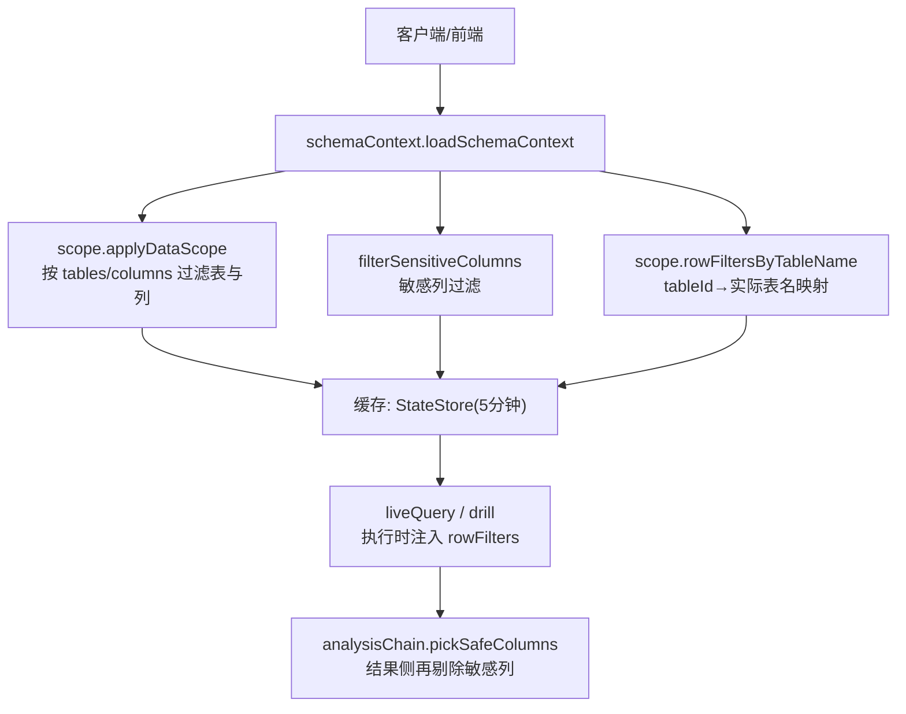
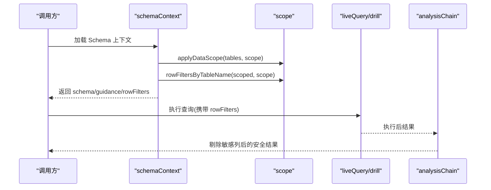
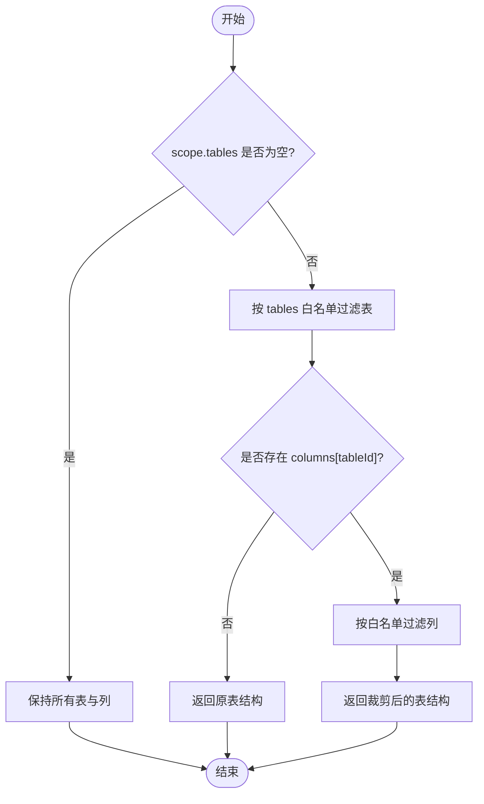
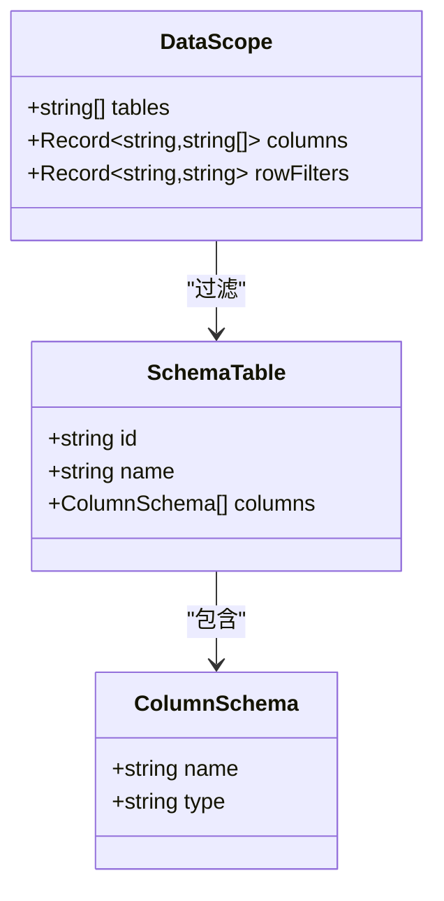
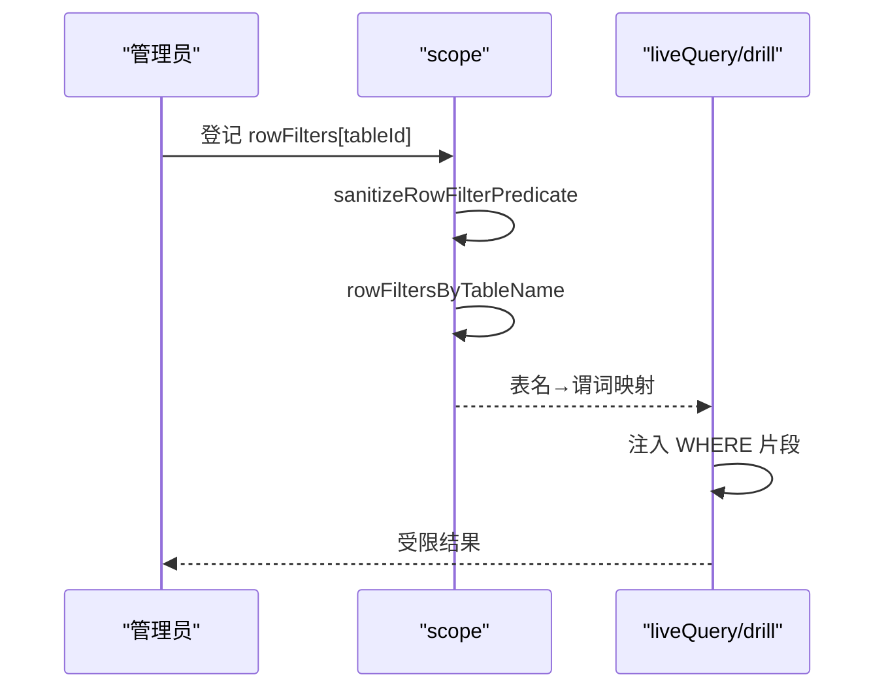
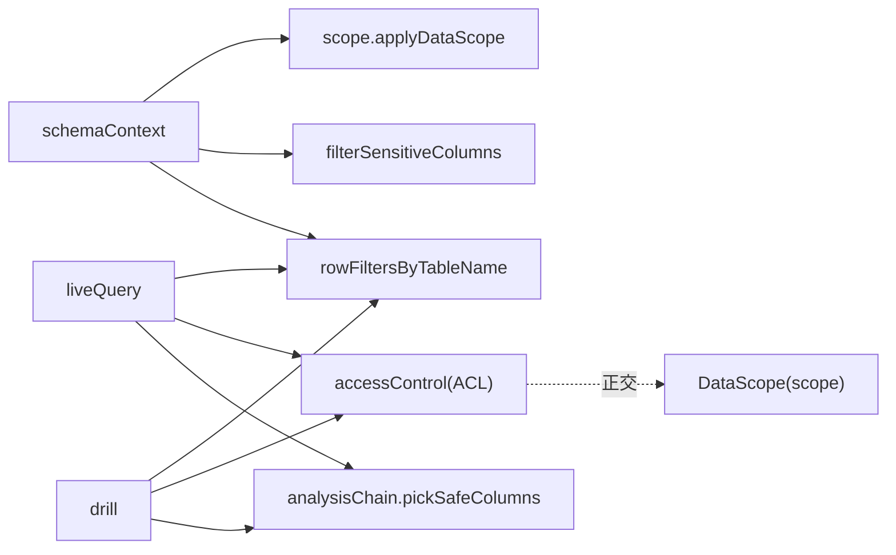

# 列级权限

<cite>
**本文引用的文件**
- [server/query/scope.ts](file://server/query/scope.ts)
- [server/query/schemaContext.ts](file://server/query/schemaContext.ts)
- [server/auth/accessControl.ts](file://server/auth/accessControl.ts)
- [src/utils/dataScope.ts](file://src/utils/dataScope.ts)
- [src/types/analytics.ts](file://src/types/analytics.ts)
- [server/query/analysisChain.ts](file://server/query/analysisChain.ts)
- [server/query/liveQuery.ts](file://server/query/liveQuery.ts)
- [server/query/drill.ts](file://server/query/drill.ts)
</cite>

## 目录
1. [简介](#简介)
2. [项目结构](#项目结构)
3. [核心组件](#核心组件)
4. [架构总览](#架构总览)
5. [详细组件分析](#详细组件分析)
6. [依赖关系分析](#依赖关系分析)
7. [性能考虑](#性能考虑)
8. [故障排查指南](#故障排查指南)
9. [结论](#结论)
10. [附录](#附录)

## 简介
本文件聚焦“列级权限控制”的完整方案，覆盖敏感列识别、动态列过滤、数据脱敏规则、列权限继承与覆盖机制，以及性能影响、查询优化与缓存策略。重点解析 applyDataScope 函数中的列过滤逻辑与 schema 级别的列权限控制，并说明行级权限谓词在查询执行层的强制注入方式。

## 项目结构
- 服务端范围与列过滤：server/query/scope.ts（applyDataScope、sanitizeDataScope、rowFiltersByTableName）
- Schema 上下文加载与缓存：server/query/schemaContext.ts（应用 scope、敏感列过滤、生成行级权限映射、缓存）
- 数据源访问控制（ACL）：server/auth/accessControl.ts（组织/部门维度授权，与 DataScope 正交）
- 前端范围过滤：src/utils/dataScope.ts（仅用于展示与构造请求；服务端再次强制过滤）
- 类型定义：src/types/analytics.ts（DataScope、TableSchema 等）
- 结果安全输出：server/query/analysisChain.ts（pickSafeColumns 剔除敏感列）
- 查询执行链路：server/query/liveQuery.ts、server/query/drill.ts（携带 sensitiveRemoved 与 rowFilters）

图表来源
- [server/query/schemaContext.ts:108-171](file://server/query/schemaContext.ts#L108-L171)
- [server/query/scope.ts:28-100](file://server/query/scope.ts#L28-L100)
- [server/query/analysisChain.ts:161-164](file://server/query/analysisChain.ts#L161-L164)
- [server/query/liveQuery.ts:190-319](file://server/query/liveQuery.ts#L190-L319)
- [server/query/drill.ts:40-47](file://server/query/drill.ts#L40-L47)

章节来源
- [server/query/scope.ts:1-101](file://server/query/scope.ts#L1-L101)
- [server/query/schemaContext.ts:1-172](file://server/query/schemaContext.ts#L1-L172)
- [server/auth/accessControl.ts:1-108](file://server/auth/accessControl.ts#L1-L108)
- [src/utils/dataScope.ts:1-22](file://src/utils/dataScope.ts#L1-L22)
- [src/types/analytics.ts:45-85](file://src/types/analytics.ts#L45-L85)

## 核心组件
- 数据范围与列过滤（DataScope + applyDataScope）
  - 作用：基于 tables 白名单限制可见表；基于 columns[tableId] 限制可见列；为空或空数组表示不限制。
  - 关键点：对每个表独立裁剪其 columns，未配置则保留原列集合。
- 行级权限谓词清洗与映射（sanitizeRowFilterPredicate + rowFiltersByTableName）
  - 作用：管理员登记行级过滤条件，经严格清洗后，在服务端执行层按真实表名注入 WHERE 片段。
  - 关键点：拒绝多语句、注释、子查询、INTO 等危险模式；长度上限；仅对可见表生效。
- Schema 上下文加载（loadSchemaContext）
  - 作用：从数据源读取 schema_json 与 scope_json，应用列过滤、敏感列过滤，生成行级权限映射，并缓存。
  - 关键点：缓存键 sctx:{dataSourceId}，TTL 5 分钟；写操作后通过 invalidateSchemaCache 失效。
- 结果安全输出（pickSafeColumns）
  - 作用：在最终结果中剔除敏感列，避免敏感信息泄露到下游。
- 数据源访问控制（ACL）
  - 作用：组织/部门维度授权，决定用户能否访问某数据源；与 DataScope 正交。

章节来源
- [server/query/scope.ts:10-100](file://server/query/scope.ts#L10-L100)
- [server/query/schemaContext.ts:30-73,108-171:30-73](file://server/query/schemaContext.ts#L30-L73)
- [server/query/analysisChain.ts:161-164](file://server/query/analysisChain.ts#L161-L164)
- [server/auth/accessControl.ts:18-73](file://server/auth/accessControl.ts#L18-L73)

## 架构总览
列级权限贯穿“上下文构建 → 查询执行 → 结果输出”全链路：
- 上下文构建阶段：应用 DataScope 进行表/列裁剪，同时计算行级权限映射（tableId→实际表名）。
- 查询执行阶段：将行级权限谓词注入到 AST/SQL 中，确保即使 LLM 生成的 SQL 也受约束。
- 结果输出阶段：再次剔除敏感列，保证最小化信息暴露。

图表来源
- [server/query/schemaContext.ts:108-171](file://server/query/schemaContext.ts#L108-L171)
- [server/query/scope.ts:28-100](file://server/query/scope.ts#L28-L100)
- [server/query/liveQuery.ts:190-319](file://server/query/liveQuery.ts#L190-L319)
- [server/query/drill.ts:40-47](file://server/query/drill.ts#L40-L47)
- [server/query/analysisChain.ts:161-164](file://server/query/analysisChain.ts#L161-L164)

## 详细组件分析

### 敏感列识别机制
- 关键词匹配：通过内置规则识别常见敏感字段名（如手机号、身份证等），并在上下文中记录被移除的列名列表（sensitiveRemoved）。
- 正则表达式：使用标识符校验与大小写归一化，确保精确匹配列名后缀。
- AI语义识别：当前代码库未实现基于语义的自动识别；敏感列识别主要依赖预定义规则与列名约定。
- 关键路径：
  - 上下文构建时调用 filterSensitiveColumns，得到 filtered.schema 与 removed 列表。
  - 结果输出阶段 analysisChain.pickSafeColumns 依据 sensitiveRemoved 再次剔除。

章节来源
- [server/query/schemaContext.ts:93-106,142-151:93-106](file://server/query/schemaContext.ts#L93-L106)
- [server/query/analysisChain.ts:161-164](file://server/query/analysisChain.ts#L161-L164)

### 动态列过滤实现（SELECT 重写、列白名单、隐藏列）
- SELECT 重写：当前实现以“列裁剪”为主，即在 schema 层面过滤列集合，而非直接改写 SQL 文本。
- 列白名单验证：applyDataScope 根据 scope.columns[tableId] 白名单过滤列；未配置则保留全部列。
- 隐藏列处理：敏感列在上下文构建时被移除（filtered.schema），不会进入 LLM 上下文与后续流程。
- 关键点：
  - 前端也有 applyDataScope，但仅为展示与构造请求；服务端会再次强制过滤，确保安全。
  - 若 tables 为空或 scope 为 null，表示不限制。

图表来源
- [server/query/scope.ts:28-43](file://server/query/scope.ts#L28-L43)
- [src/utils/dataScope.ts:7-21](file://src/utils/dataScope.ts#L7-L21)

章节来源
- [server/query/scope.ts:28-43](file://server/query/scope.ts#L28-L43)
- [src/utils/dataScope.ts:7-21](file://src/utils/dataScope.ts#L7-L21)

### 数据脱敏规则（部分显示、哈希、随机替换、空值填充）
- 当前实现以“列级剔除”为主：敏感列在上下文与结果输出阶段被完全移除，不进入下游。
- 其他脱敏策略（部分显示、哈希、随机替换、空值填充）在本仓库中未见具体实现；如需扩展，可在结果输出阶段（analysisChain 或执行层）增加列级变换器。
- 建议：在不改变现有行为的前提下，新增“列级脱敏管道”，按列类型与敏感度选择不同策略。

章节来源
- [server/query/analysisChain.ts:161-164](file://server/query/analysisChain.ts#L161-L164)

### 列权限的继承与覆盖机制
- 继承：默认情况下，若无 scope 或 scope.tables 为空，则不限制表与列；即继承数据源的完整 schema。
- 覆盖：当 scope.tables 非空时，仅允许指定表；当 columns[tableId] 非空时，进一步覆盖该表的列集合。
- 行级权限：rowFilters 可叠加于表/列限制之上，针对特定表注入 WHERE 条件，不影响列集合。
- 注意：ACL 与 DataScope 正交——ACL 决定“能否访问数据源”，DataScope 决定“可用哪些表/列/行”。

章节来源
- [server/query/scope.ts:10-15,28-43:10-15](file://server/query/scope.ts#L10-L15)
- [server/auth/accessControl.ts:1-8](file://server/auth/accessControl.ts#L1-L8)

### applyDataScope 函数详解（列过滤与 schema 级别控制）
- 输入：tables（SchemaTable[]）、scope（DataScope | null | undefined）
- 行为：
  - 若 tables 非数组，返回空数组。
  - 若 scope 为空或 tables 为空数组，返回原始 tables。
  - 否则，先按 scope.tables 过滤表，再对每个表按 scope.columns[tableId] 过滤列。
- 复杂度：O(N+M)，N 为表数，M 为列总数；使用 Set 提升查找效率。
- 安全性：仅做白名单过滤，不引入外部输入；列名来自 schema，可信。

图表来源
- [server/query/scope.ts:10-15](file://server/query/scope.ts#L10-L15)
- [server/query/scope.ts:28-43](file://server/query/scope.ts#L28-L43)
- [src/types/analytics.ts:19-43](file://src/types/analytics.ts#L19-L43)

章节来源
- [server/query/scope.ts:28-43](file://server/query/scope.ts#L28-L43)

### 行级权限谓词的安全注入
- 清洗：sanitizeRowFilterPredicate 拒绝多语句、注释、子查询、INTO 等，限制长度，确保仅保留合法比较/逻辑谓词。
- 映射：rowFiltersByTableName 将 tableId 映射到 SQL 中的实际表名，仅对 scope 过滤后可见表生效。
- 注入：在 liveQuery/drill 执行时，将 rowFilters 传入执行层，AST/SQL 强制注入 WHERE 片段。

图表来源
- [server/query/scope.ts:17-26,92-100:17-26](file://server/query/scope.ts#L17-L26)
- [server/query/liveQuery.ts:190-319](file://server/query/liveQuery.ts#L190-L319)
- [server/query/drill.ts:40-47](file://server/query/drill.ts#L40-L47)

章节来源
- [server/query/scope.ts:17-26,92-100:17-26](file://server/query/scope.ts#L17-L26)
- [server/query/liveQuery.ts:190-319](file://server/query/liveQuery.ts#L190-L319)
- [server/query/drill.ts:40-47](file://server/query/drill.ts#L40-L47)

## 依赖关系分析
- schemaContext 依赖 scope 与 queryGuard（敏感列过滤），并缓存结果。
- liveQuery/drill 依赖 schemaContext 提供的 rowFilters，并在执行时注入。
- analysisChain 依赖 sensitiveRemoved，用于结果侧二次过滤。
- accessControl 与 DataScope 正交：前者控制数据源访问，后者控制表/列/行范围。

图表来源
- [server/query/schemaContext.ts:108-171](file://server/query/schemaContext.ts#L108-L171)
- [server/query/scope.ts:28-100](file://server/query/scope.ts#L28-L100)
- [server/query/analysisChain.ts:161-164](file://server/query/analysisChain.ts#L161-L164)
- [server/auth/accessControl.ts:1-8](file://server/auth/accessControl.ts#L1-L8)

章节来源
- [server/query/schemaContext.ts:108-171](file://server/query/schemaContext.ts#L108-L171)
- [server/query/scope.ts:28-100](file://server/query/scope.ts#L28-L100)
- [server/query/analysisChain.ts:161-164](file://server/query/analysisChain.ts#L161-L164)
- [server/auth/accessControl.ts:1-8](file://server/auth/accessControl.ts#L1-L8)

## 性能考虑
- 时间复杂度
  - applyDataScope：O(N+M)，N 为表数，M 为列总数；Set 查找 O(1)。
  - sanitizeDataScope：O(T+C+F)，T 为表数，C 为列数，F 为 rowFilters 条目数。
  - rowFiltersByTableName：O(N)，N 为可见表数。
- 空间复杂度
  - 主要为 Set 与中间对象，内存占用与 schema 规模线性相关。
- 查询优化
  - 行级权限谓词在服务端强制注入，避免 LLM 绕过；减少不必要的数据扫描。
  - 列裁剪减少上下文体积，降低 LLM 成本与延迟。
- 缓存策略
  - Schema 上下文缓存 TTL 5 分钟，键 sctx:{dataSourceId}；写操作后通过 invalidateSchemaCache 失效。
  - 多实例共享缓存（Redis 模式）：deleteByPrefix 广播清理。
- 建议
  - 合理设置 TTL 与失效时机，平衡一致性与性能。
  - 对高频访问的数据源，优先启用缓存；对频繁变更的 schema，缩短 TTL。

章节来源
- [server/query/schemaContext.ts:30-55,108-171:30-55](file://server/query/schemaContext.ts#L30-L55)
- [server/query/scope.ts:45-86](file://server/query/scope.ts#L45-L86)

## 故障排查指南
- 列未被过滤
  - 检查 scope.columns[tableId] 是否包含目标列名；确认表 id 与列名一致。
  - 确认服务端再次应用 applyDataScope（前端过滤不可信）。
- 行级权限未生效
  - 检查 sanitizeRowFilterPredicate 是否放行（长度、非法字符、子查询等）。
  - 确认 rowFiltersByTableName 已生成 tableId→实际表名映射。
- 敏感列仍出现在结果中
  - 检查 analysisChain.pickSafeColumns 是否被调用；确认 sensitiveRemoved 列表正确。
- 缓存导致旧数据
  - 调用 invalidateSchemaCache 刷新；确认 Redis 模式下 deleteByPrefix 生效。

章节来源
- [server/query/scope.ts:17-26,92-100:17-26](file://server/query/scope.ts#L17-L26)
- [server/query/analysisChain.ts:161-164](file://server/query/analysisChain.ts#L161-L164)
- [server/query/schemaContext.ts:50-55](file://server/query/schemaContext.ts#L50-L55)

## 结论
本系统通过 DataScope 实现列级权限控制，结合敏感列过滤与行级权限谓词注入，形成“上下文构建—执行注入—结果输出”的全链路安全闭环。applyDataScope 作为核心，提供高效、可扩展的列裁剪能力；schemaContext 负责统一装配与缓存；analysisChain 保障结果侧最小化暴露。ACL 与 DataScope 正交设计，使权限模型清晰、可维护。建议在后续迭代中补充更多脱敏策略与更细粒度的列级策略开关。

## 附录
- 类型参考
  - DataScope：tables、columns、rowFilters
  - TableSchema/ColumnSchema：表与列元数据
- 关键路径速查
  - 列过滤：server/query/scope.ts::applyDataScope
  - 行级权限：server/query/scope.ts::sanitizeRowFilterPredicate、rowFiltersByTableName
  - 上下文缓存：server/query/schemaContext.ts::loadSchemaContext、invalidateSchemaCache
  - 结果安全：server/query/analysisChain.ts::pickSafeColumns
  - 执行注入：server/query/liveQuery.ts、server/query/drill.ts