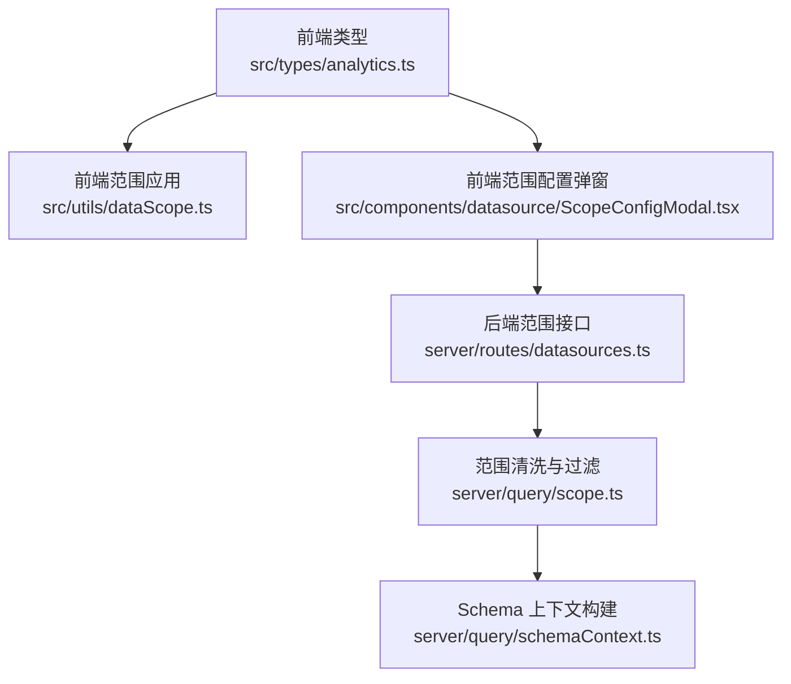
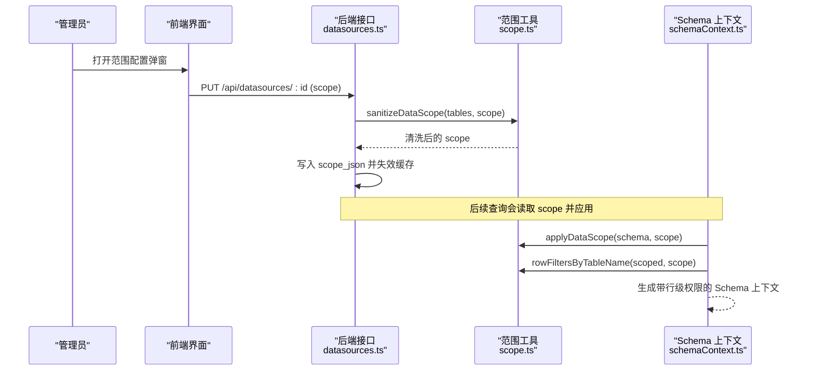
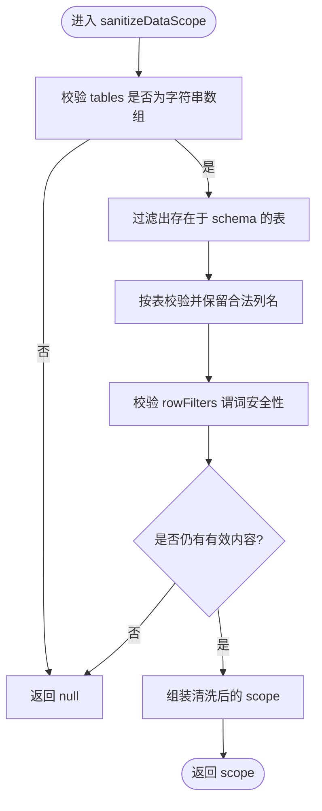
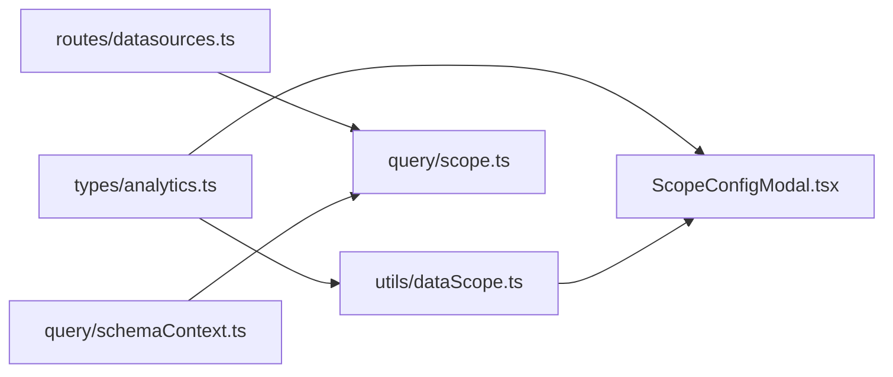
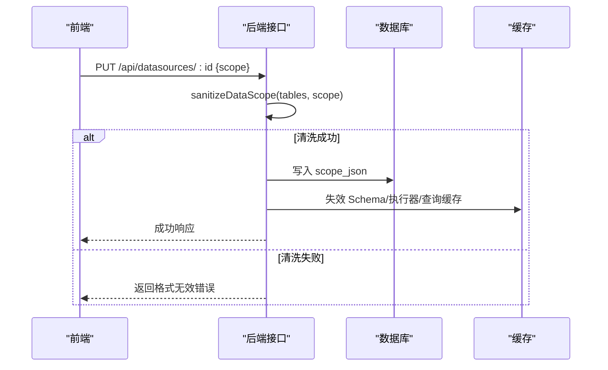
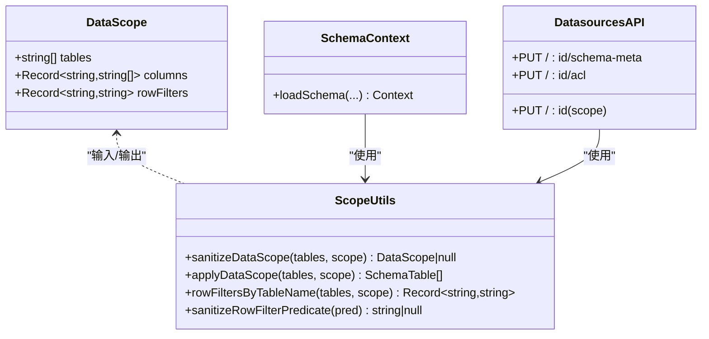

# 数据范围管理

<cite>
**本文引用的文件**
- [server/query/scope.ts](file://server/query/scope.ts)
- [server/query/schemaContext.ts](file://server/query/schemaContext.ts)
- [server/routes/datasources.ts](file://server/routes/datasources.ts)
- [src/types/analytics.ts](file://src/types/analytics.ts)
- [src/utils/dataScope.ts](file://src/utils/dataScope.ts)
- [src/components/datasource/ScopeConfigModal.tsx](file://src/components/datasource/ScopeConfigModal.tsx)
</cite>

## 目录
1. [简介](#简介)
2. [项目结构](#项目结构)
3. [核心组件](#核心组件)
4. [架构总览](#架构总览)
5. [详细组件分析](#详细组件分析)
6. [依赖关系分析](#依赖关系分析)
7. [性能考虑](#性能考虑)
8. [故障排查指南](#故障排查指南)
9. [结论](#结论)
10. [附录](#附录)

## 简介
本文件聚焦“数据范围（DataScope）”管理能力，覆盖范围定义、清洗与校验、应用与注入、以及前后端协同机制。重点包括：
- 范围数据结构与语义：表级、列级、行级权限谓词
- 服务端清洗与验证：sanitizeDataScope、sanitizeRowFilterPredicate
- 范围应用与注入：applyDataScope、rowFiltersByTableName
- 前端配置与展示：ScopeConfigModal、前端 applyDataScope
- 与 Schema 的同步与缓存失效策略

说明：当前仓库未实现基于用户/角色/数据源的继承与冲突解决算法；范围以数据源维度存储并作用于该数据源的问数上下文。若未来扩展为多租户或 RBAC 继承，可在现有接口上叠加合并与优先级规则。

## 项目结构
围绕数据范围的关键路径如下：
- 类型定义：DataScope、TableSchema、ColumnSchema 等位于前端类型文件
- 服务端范围能力：scope.ts 提供清洗、过滤、行级权限映射
- 范围在 Schema 构建中的应用：schemaContext.ts 将范围应用到 schema 并产出 rowFilters
- 范围持久化与同步：datasources.ts 提供保存/同步接口，并在变更后清理缓存
- 前端范围配置：ScopeConfigModal 用于勾选表/字段并保存范围
- 前端范围应用：utils/dataScope.ts 对前端展示的表结构进行范围裁剪

图表来源
- [src/types/analytics.ts:45-85](file://src/types/analytics.ts#L45-L85)
- [src/utils/dataScope.ts:1-22](file://src/utils/dataScope.ts#L1-L22)
- [src/components/datasource/ScopeConfigModal.tsx:1-159](file://src/components/datasource/ScopeConfigModal.tsx#L1-L159)
- [server/routes/datasources.ts:635-650](file://server/routes/datasources.ts#L635-L650)
- [server/routes/datasources.ts:850-873](file://server/routes/datasources.ts#L850-L873)
- [server/query/scope.ts:1-101](file://server/query/scope.ts#L1-L101)
- [server/query/schemaContext.ts:140-172](file://server/query/schemaContext.ts#L140-L172)

章节来源
- [src/types/analytics.ts:45-85](file://src/types/analytics.ts#L45-L85)
- [src/utils/dataScope.ts:1-22](file://src/utils/dataScope.ts#L1-L22)
- [src/components/datasource/ScopeConfigModal.tsx:1-159](file://src/components/datasource/ScopeConfigModal.tsx#L1-L159)
- [server/query/scope.ts:1-101](file://server/query/scope.ts#L1-L101)
- [server/query/schemaContext.ts:140-172](file://server/query/schemaContext.ts#L140-L172)
- [server/routes/datasources.ts:635-650](file://server/routes/datasources.ts#L635-L650)
- [server/routes/datasources.ts:850-873](file://server/routes/datasources.ts#L850-L873)

## 核心组件
- DataScope 接口（前端类型）：包含 tables、columns，用于限定可被问数使用的表与列
- sanitizeDataScope（服务端）：依据当前数据源 schema 清洗 scope，剔除不存在的表/列，并对行级权限谓词做安全校验
- applyDataScope（服务端/前端）：根据 scope 裁剪表结构与列集合
- rowFiltersByTableName（服务端）：将 tableId 到真实表名的行级权限谓词映射出来，供执行层 AST 注入
- ScopeConfigModal（前端）：可视化选择表与列，提交范围配置
- datasources.ts 接口：保存/同步范围，并在变更后使相关缓存失效

章节来源
- [src/types/analytics.ts:45-85](file://src/types/analytics.ts#L45-L85)
- [server/query/scope.ts:1-101](file://server/query/scope.ts#L1-L101)
- [src/utils/dataScope.ts:1-22](file://src/utils/dataScope.ts#L1-L22)
- [src/components/datasource/ScopeConfigModal.tsx:1-159](file://src/components/datasource/ScopeConfigModal.tsx#L1-L159)
- [server/routes/datasources.ts:635-650](file://server/routes/datasources.ts#L635-L650)
- [server/routes/datasources.ts:850-873](file://server/routes/datasources.ts#L850-L873)

## 架构总览
数据范围从管理员在前端配置开始，经后端清洗、持久化，再在服务端构建 Schema 时应用范围，并将行级权限映射给执行层注入。

图表来源
- [src/components/datasource/ScopeConfigModal.tsx:1-159](file://src/components/datasource/ScopeConfigModal.tsx#L1-L159)
- [server/routes/datasources.ts:850-873](file://server/routes/datasources.ts#L850-L873)
- [server/query/scope.ts:46-86](file://server/query/scope.ts#L46-L86)
- [server/query/schemaContext.ts:140-172](file://server/query/schemaContext.ts#L140-L172)

## 详细组件分析

### 范围定义与语法
- 表级限制：tables 数组为空或 scope 为 null 表示不限制；非空则仅允许指定表参与问数
- 列级限制：columns[tableId] 为非空数组时，进一步限制该表的可见列
- 行级权限：rowFilters[tableId] 为字符串谓词，由管理员登记，执行层强制注入 WHERE 片段
- 逻辑与嵌套：当前 scope 结构为扁平键值集合，未内置 AND/OR 表达式或函数调用；如需复杂条件，建议在数据库侧通过视图/物化视图或外部权限系统实现

章节来源
- [src/types/analytics.ts:45-85](file://src/types/analytics.ts#L45-L85)
- [server/query/scope.ts:1-15](file://server/query/scope.ts#L1-L15)

### 范围清洗与校验（sanitizeDataScope）
- 输入：当前数据源 schema（tables）、原始 scope
- 行为：
  - 校验 tables 必须为字符串数组
  - 剔除不在当前 schema 中的表
  - 对每个保留的表，校验其 columns 列表仅保留真实存在的列名
  - 对 rowFilters 中每个谓词进行安全校验（长度、禁止分号、注释、子查询/INTO 关键字等），合法才保留
  - 若最终无任何有效内容，返回 null
- 输出：清洗后的 DataScope 或 null

图表来源
- [server/query/scope.ts:46-86](file://server/query/scope.ts#L46-L86)

章节来源
- [server/query/scope.ts:46-86](file://server/query/scope.ts#L46-L86)

### 行级权限谓词清洗（sanitizeRowFilterPredicate）
- 仅接受字符串
- 长度限制与空白修剪
- 拒绝包含分号、SQL 注释、SELECT/INTO 关键字等危险模式
- 返回清洗后的谓词或 null

章节来源
- [server/query/scope.ts:17-26](file://server/query/scope.ts#L17-L26)

### 范围应用（applyDataScope）
- 服务端：对 SchemaTable[] 按 scope.tables 过滤表，并按 scope.columns 过滤列
- 前端：对 TableSchema[] 做相同逻辑，用于 UI 展示与请求构造
- 空 scope 或空 tables 表示不限制

章节来源
- [server/query/scope.ts:28-43](file://server/query/scope.ts#L28-L43)
- [src/utils/dataScope.ts:1-22](file://src/utils/dataScope.ts#L1-L22)

### 行级权限映射（rowFiltersByTableName）
- 输入：已按 scope 过滤后的 tables、scope
- 行为：遍历可见表，提取对应 tableId 的谓词并清洗，映射到 SQL 中的真实表名
- 用途：供执行层 AST 注入 WHERE 片段，确保只对问数可见表生效

章节来源
- [server/query/scope.ts:88-101](file://server/query/scope.ts#L88-L101)

### 范围在 Schema 上下文中的应用
- 加载数据源 Schema 时，先应用 applyDataScope 裁剪表/列，再过滤敏感列
- 同时计算 rowFilters 映射，供后续执行阶段注入
- 结果写入缓存，便于后续查询复用

章节来源
- [server/query/schemaContext.ts:140-172](file://server/query/schemaContext.ts#L140-L172)

### 范围持久化与同步
- 同步 Schema 后，自动清洗既有 scope（剔除已删除的表/列）并回写
- 更新 scope 接口接收任意对象，统一走 sanitizeDataScope 清洗后再落库
- 变更后会主动失效 Schema 缓存、执行器池与查询缓存，保证一致性

章节来源
- [server/routes/datasources.ts:635-650](file://server/routes/datasources.ts#L635-L650)
- [server/routes/datasources.ts:850-873](file://server/routes/datasources.ts#L850-L873)

### 前端范围配置与展示
- ScopeConfigModal：列出所有表与列，支持展开/折叠、多选表与列，底部显示计数与保存按钮
- 前端 applyDataScope：用于渲染时按 scope 裁剪表/列，避免展示不可见元素

章节来源
- [src/components/datasource/ScopeConfigModal.tsx:1-159](file://src/components/datasource/ScopeConfigModal.tsx#L1-L159)
- [src/utils/dataScope.ts:1-22](file://src/utils/dataScope.ts#L1-L22)

### 范围与 Schema 的同步机制
- 当数据源 Schema 变化时，服务端重新扫描并清洗 scope，确保范围与当前 schema 一致
- 任何影响范围/结构的变更都会触发缓存失效，避免陈旧范围导致的不一致

章节来源
- [server/routes/datasources.ts:635-650](file://server/routes/datasources.ts#L635-L650)
- [server/query/schemaContext.ts:140-172](file://server/query/schemaContext.ts#L140-L172)

## 依赖关系分析
- 类型依赖：前端 types/analytics.ts 定义了 DataScope、TableSchema、ColumnSchema
- 服务依赖：
  - schemaContext.ts 依赖 scope.ts 的 applyDataScope 与 rowFiltersByTableName
  - routes/datasources.ts 依赖 scope.ts 的 sanitizeDataScope 进行范围清洗与保存
- 前端依赖：
  - utils/dataScope.ts 复用与后端一致的过滤逻辑，保障前后端展示一致
  - ScopeConfigModal 消费 DataSource.tables/columns 进行交互

图表来源
- [src/types/analytics.ts:45-85](file://src/types/analytics.ts#L45-L85)
- [src/utils/dataScope.ts:1-22](file://src/utils/dataScope.ts#L1-L22)
- [src/components/datasource/ScopeConfigModal.tsx:1-159](file://src/components/datasource/ScopeConfigModal.tsx#L1-L159)
- [server/routes/datasources.ts:850-873](file://server/routes/datasources.ts#L850-L873)
- [server/query/scope.ts:1-101](file://server/query/scope.ts#L1-L101)
- [server/query/schemaContext.ts:140-172](file://server/query/schemaContext.ts#L140-L172)

章节来源
- [src/types/analytics.ts:45-85](file://src/types/analytics.ts#L45-L85)
- [server/query/scope.ts:1-101](file://server/query/scope.ts#L1-L101)
- [server/query/schemaContext.ts:140-172](file://server/query/schemaContext.ts#L140-L172)
- [server/routes/datasources.ts:850-873](file://server/routes/datasources.ts#L850-L873)

## 性能考虑
- 范围清洗与应用均为线性扫描，复杂度与表/列数量成正比
- 变更范围/Schema 后立即失效相关缓存，避免脏读
- 行级权限谓词长度与安全检查限制了注入风险与解析开销
- 建议：
  - 控制单数据源表/列规模，必要时拆分数据源
  - 使用视图/物化视图承载复杂行级权限，scope 仅声明必要表/列
  - 谨慎维护 rowFilters，保持简短且索引友好

[本节为通用指导，无需具体文件引用]

## 故障排查指南
- 保存范围失败
  - 检查请求体 scope 格式是否符合要求（tables 为字符串数组）
  - 确认 sanitizeDataScope 未返回 null（即至少有一项有效）
  - 参考接口错误提示与日志
- 范围不生效
  - 确认已正确调用 applyDataScope 裁剪 schema
  - 确认 rowFilters 已映射到真实表名并传入执行层
  - 检查缓存是否已失效并重新加载
- 行级权限异常
  - 检查谓词是否被 sanitizeRowFilterPredicate 拒绝（长度、关键字、注释等）
  - 核对 tableId 与真实表名映射是否正确

章节来源
- [server/routes/datasources.ts:850-873](file://server/routes/datasources.ts#L850-L873)
- [server/query/scope.ts:17-26](file://server/query/scope.ts#L17-L26)
- [server/query/scope.ts:46-86](file://server/query/scope.ts#L46-L86)
- [server/query/schemaContext.ts:140-172](file://server/query/schemaContext.ts#L140-L172)

## 结论
当前数据范围管理以“数据源维度”的扁平 scope 为核心，提供表/列级可见性控制与安全的行级权限谓词注入。通过严格的清洗与校验、与服务端 Schema 构建的紧密集成、以及变更后的缓存失效策略，保证了范围的一致性与安全性。未来可扩展为多租户/角色继承与更复杂的条件表达式，但需在不破坏现有安全边界的前提下演进。

[本节为总结，无需具体文件引用]

## 附录

### 关键流程时序图（保存范围）

图表来源
- [server/routes/datasources.ts:850-873](file://server/routes/datasources.ts#L850-L873)
- [server/query/scope.ts:46-86](file://server/query/scope.ts#L46-L86)

### 类/模块关系图

图表来源
- [src/types/analytics.ts:45-85](file://src/types/analytics.ts#L45-L85)
- [server/query/scope.ts:1-101](file://server/query/scope.ts#L1-L101)
- [server/query/schemaContext.ts:140-172](file://server/query/schemaContext.ts#L140-L172)
- [server/routes/datasources.ts:850-873](file://server/routes/datasources.ts#L850-L873)