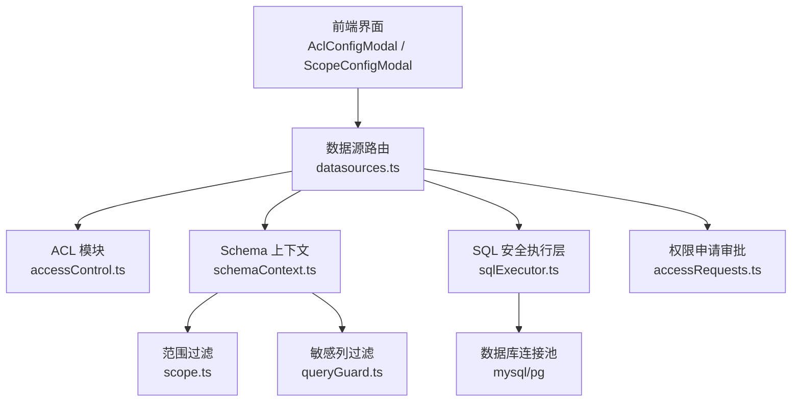
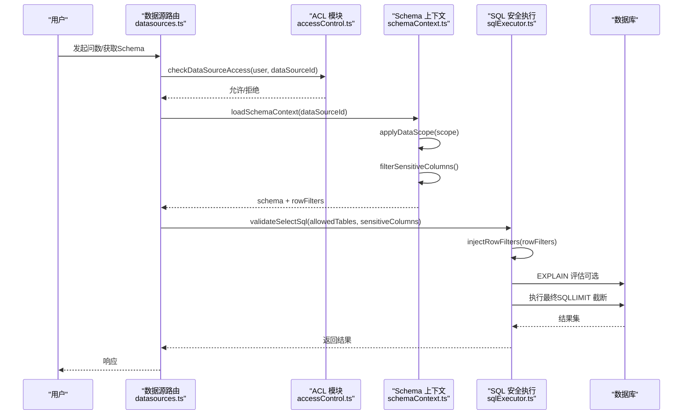
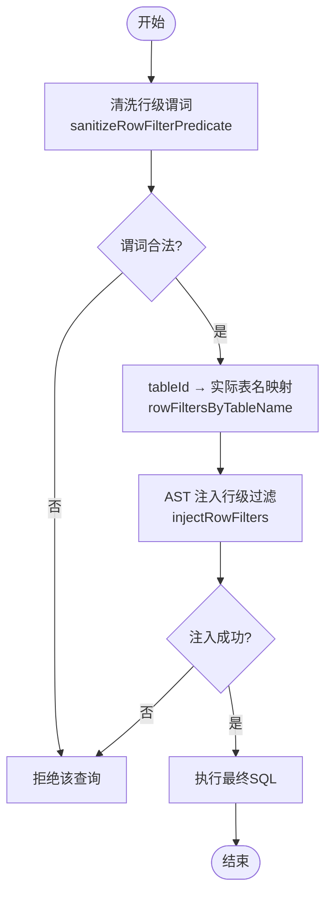
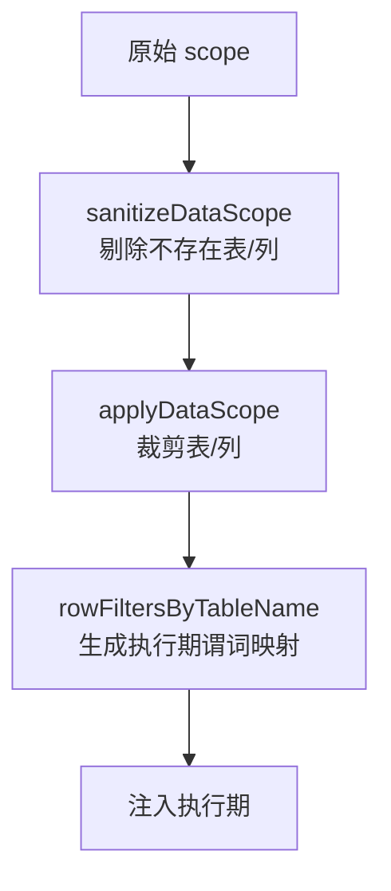
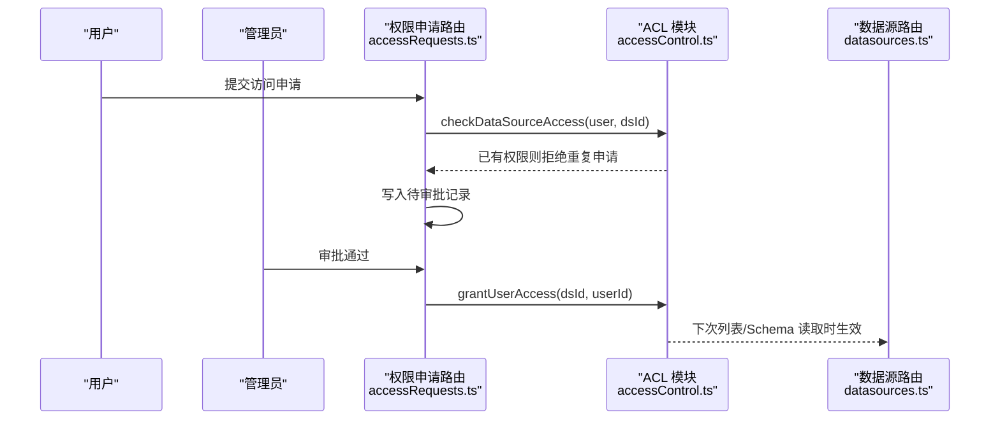
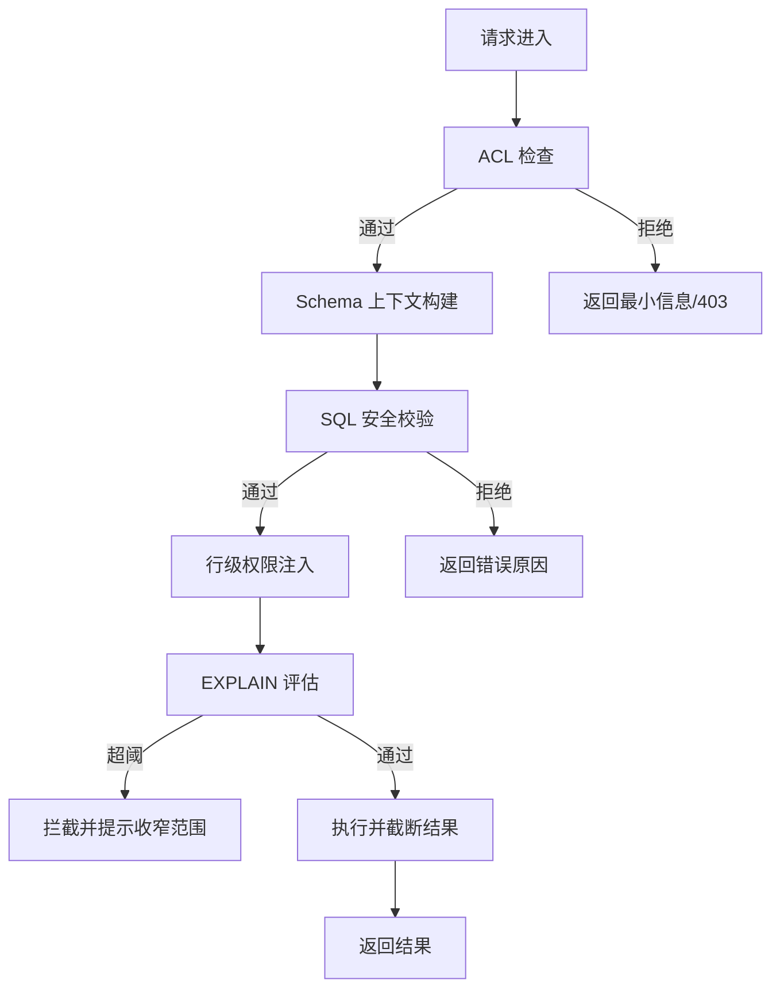
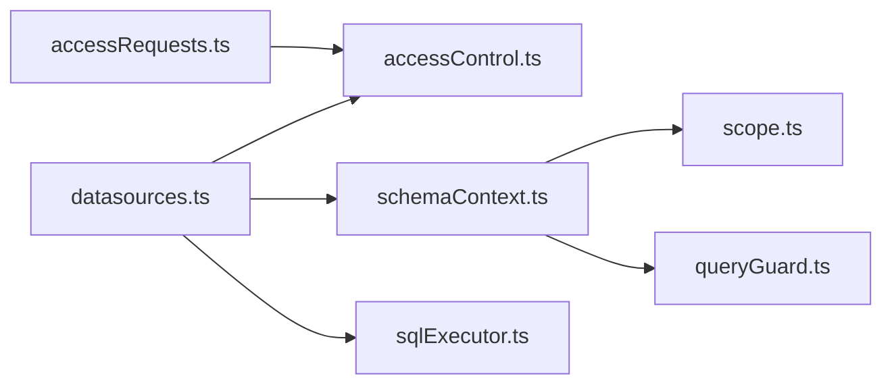

# 权限控制

<cite>
**本文引用的文件**
- [server/auth/accessControl.ts](file://server/auth/accessControl.ts)
- [server/query/scope.ts](file://server/query/scope.ts)
- [src/utils/dataScope.ts](file://src/utils/dataScope.ts)
- [server/routes/datasources.ts](file://server/routes/datasources.ts)
- [server/query/sqlExecutor.ts](file://server/query/sqlExecutor.ts)
- [server/query/schemaContext.ts](file://server/query/schemaContext.ts)
- [server/query/queryGuard.ts](file://server/query/queryGuard.ts)
- [server/routes/accessRequests.ts](file://server/routes/accessRequests.ts)
- [src/components/datasource/AclConfigModal.tsx](file://src/components/datasource/AclConfigModal.tsx)
- [src/components/datasource/ScopeConfigModal.tsx](file://src/components/datasource/ScopeConfigModal.tsx)
</cite>

## 目录
1. [简介](#简介)
2. [项目结构](#项目结构)
3. [核心组件](#核心组件)
4. [架构总览](#架构总览)
5. [详细组件分析](#详细组件分析)
6. [依赖关系分析](#依赖关系分析)
7. [性能与缓存](#性能与缓存)
8. [故障排查指南](#故障排查指南)
9. [结论](#结论)
10. [附录：最佳实践与常见问题](#附录最佳实践与常见问题)

## 简介
本文件系统性说明数据访问权限控制的实现，覆盖行级权限（WHERE 注入、租户隔离、数据范围过滤）、列级权限（敏感列识别、动态列过滤、脱敏规则应用）、数据范围（scope）管理（定义、继承、冲突解决）、ACL（用户组/资源/操作组合），以及权限验证流程、缓存策略、性能优化与配置最佳实践。

## 项目结构
权限相关代码主要分布在以下模块：
- 访问控制（ACL）：server/auth/accessControl.ts
- 数据范围（DataScope）：server/query/scope.ts、src/utils/dataScope.ts
- 查询安全执行（SQL 校验、行级注入、EXPLAIN 防线）：server/query/sqlExecutor.ts
- Schema 上下文加载（scope + 敏感列过滤 + 行级映射）：server/query/schemaContext.ts
- 输入净化与敏感列特征（L1/L3/L4）：server/query/queryGuard.ts
- 数据源路由（列表/Schema 获取/同步/更新，集成 ACL 与 scope）：server/routes/datasources.ts
- 权限申请审批流：server/routes/accessRequests.ts
- 前端 ACL/Scope 配置弹窗：src/components/datasource/AclConfigModal.tsx、src/components/datasource/ScopeConfigModal.tsx



图表来源
- [server/routes/datasources.ts:364-440](file://server/routes/datasources.ts#L364-L440)
- [server/auth/accessControl.ts:43-73](file://server/auth/accessControl.ts#L43-L73)
- [server/query/schemaContext.ts:108-171](file://server/query/schemaContext.ts#L108-L171)
- [server/query/scope.ts:28-100](file://server/query/scope.ts#L28-L100)
- [server/query/queryGuard.ts:71-100](file://server/query/queryGuard.ts#L71-L100)
- [server/query/sqlExecutor.ts:291-489](file://server/query/sqlExecutor.ts#L291-L489)

章节来源
- [server/routes/datasources.ts:364-440](file://server/routes/datasources.ts#L364-L440)
- [server/auth/accessControl.ts:18-73](file://server/auth/accessControl.ts#L18-L73)
- [server/query/scope.ts:1-100](file://server/query/scope.ts#L1-L100)
- [server/query/schemaContext.ts:1-172](file://server/query/schemaContext.ts#L1-L172)
- [server/query/queryGuard.ts:1-101](file://server/query/queryGuard.ts#L1-L101)
- [server/query/sqlExecutor.ts:1-832](file://server/query/sqlExecutor.ts#L1-L832)
- [server/routes/accessRequests.ts:1-141](file://server/routes/accessRequests.ts#L1-L141)
- [src/components/datasource/AclConfigModal.tsx:1-100](file://src/components/datasource/AclConfigModal.tsx#L1-L100)
- [src/components/datasource/ScopeConfigModal.tsx:1-159](file://src/components/datasource/ScopeConfigModal.tsx#L1-L159)

## 核心组件
- ACL（访问控制列表）：基于数据源的部门与个人白名单，决定“能否看到/使用该数据源”。管理员不受限；未配置 ACL 表示不限制。
- DataScope（数据范围）：表级白名单、列级白名单、行级谓词（WHERE 片段）。用于限定问数可见的表/列，并在执行期强制注入行级过滤。
- SQL 安全执行层：只读 SELECT、单语句、关键字黑名单、AST 复核、表名白名单、敏感列拒绝、强制 LIMIT、EXPLAIN 大扫描拦截、行级权限 AST 注入。
- Schema 上下文：从落库 schema 经 scope 过滤、敏感列过滤后生成 LLM 上下文，并缓存；同时产出执行期所需的行级谓词映射。
- 输入净化与历史净化：L1 输入净化、L3 敏感列过滤、L4 历史轮次净化，防止提示注入与上下文污染。
- 权限申请审批：用户可发起访问申请，管理员审批通过后自动并入数据源 ACL 的个人授权清单。

章节来源
- [server/auth/accessControl.ts:18-107](file://server/auth/accessControl.ts#L18-L107)
- [server/query/scope.ts:1-100](file://server/query/scope.ts#L1-L100)
- [server/query/sqlExecutor.ts:291-489](file://server/query/sqlExecutor.ts#L291-L489)
- [server/query/schemaContext.ts:108-171](file://server/query/schemaContext.ts#L108-L171)
- [server/query/queryGuard.ts:1-101](file://server/query/queryGuard.ts#L1-L101)
- [server/routes/accessRequests.ts:37-138](file://server/routes/accessRequests.ts#L37-L138)

## 架构总览
下图展示一次“智能问数”请求在权限侧的关键路径：ACL 检查 → Schema 上下文构建（scope + 敏感列过滤 + 行级映射）→ SQL 安全校验（表/列/关键字/AST）→ 行级权限 AST 注入 → EXPLAIN 防线 → 执行与结果截断。



图表来源
- [server/routes/datasources.ts:364-440](file://server/routes/datasources.ts#L364-L440)
- [server/auth/accessControl.ts:57-73](file://server/auth/accessControl.ts#L57-L73)
- [server/query/schemaContext.ts:108-171](file://server/query/schemaContext.ts#L108-L171)
- [server/query/sqlExecutor.ts:291-489](file://server/query/sqlExecutor.ts#L291-L489)

## 详细组件分析

### 行级权限（WHERE 注入、租户隔离、数据范围过滤）
- 行级谓词来源：scope.rowFilters 中 tableId → 谓词字符串。谓词需通过 sanitizeRowFilterPredicate 清洗，禁止多语句、注释、子查询、SELECT/INTO 等危险结构。
- 执行期注入：validateSelectSql 通过后，injectRowFilters 使用 AST 将受控表包裹为派生表（FROM t → FROM (SELECT * FROM t WHERE pred) AS t），递归处理 CTE、子查询、UNION 链，确保所有真实表引用均被强制加 WHERE。
- 租户隔离：rowFiltersByTableName 将 scope 中的 tableId 映射到实际表名键，仅对问数可见表生效，避免越权。
- 失败策略：注入失败或 AST 回写失败时 fail-closed，直接拒绝该查询，保证安全优先。



图表来源
- [server/query/scope.ts:17-26](file://server/query/scope.ts#L17-L26)
- [server/query/scope.ts:88-100](file://server/query/scope.ts#L88-L100)
- [server/query/sqlExecutor.ts:396-489](file://server/query/sqlExecutor.ts#L396-L489)

章节来源
- [server/query/scope.ts:17-100](file://server/query/scope.ts#L17-L100)
- [server/query/sqlExecutor.ts:396-489](file://server/query/sqlExecutor.ts#L396-L489)

### 列级权限（敏感列识别、动态列过滤、脱敏规则应用）
- 敏感列识别：queryGuard 提供 SENSITIVE_COLUMN_PATTERN，匹配密码、密钥、令牌、身份证等关键词（含中英文），命中即从 LLM 上下文剔除。
- 动态列过滤：schemaContext 在 scope 过滤之后执行 filterSensitiveColumns，返回剔除清单供 UI 标记与审计；文件导入时也复用同一清单剔除敏感列。
- 执行期拒绝：sqlExecutor.validateSelectSql 对敏感列进行整词匹配，若 SQL 引用敏感列则直接拒绝执行，形成“上下文不可见 + 执行期拒绝”的双重保护。
- 脱敏规则：当前仓库未实现运行时值级脱敏（如掩码/哈希），建议后续在结果输出层按列策略进行脱敏（例如手机号中间四位替换）。

```mermaid
classDiagram
class QueryGuard {
+MAX_QUESTION_LENGTH
+MAX_HISTORY_TURNS
+containsInjection(text) bool
+sanitizeQuestion(raw) SanitizeResult
+sanitizeHistory(raw) History[]
+SENSITIVE_COLUMN_PATTERN
+filterSensitiveColumns(schema) {schema, removed}
}
class SchemaContext {
+loadSchemaContext(id, clientSchema) SchemaContext
}
class SqlExecutor {
+validateSelectSql(sql, allowedTables, sensitiveColumns) SqlSafetyResult
}
QueryGuard <.. SchemaContext : "敏感列过滤"
QueryGuard <.. SqlExecutor : "敏感列拒绝"
```

图表来源
- [server/query/queryGuard.ts:71-100](file://server/query/queryGuard.ts#L71-L100)
- [server/query/schemaContext.ts:108-171](file://server/query/schemaContext.ts#L108-L171)
- [server/query/sqlExecutor.ts:291-387](file://server/query/sqlExecutor.ts#L291-L387)

章节来源
- [server/query/queryGuard.ts:71-100](file://server/query/queryGuard.ts#L71-L100)
- [server/query/schemaContext.ts:108-171](file://server/query/schemaContext.ts#L108-L171)
- [server/query/sqlExecutor.ts:291-387](file://server/query/sqlExecutor.ts#L291-L387)

### 数据范围（scope）管理机制（定义、继承、冲突解决）
- 范围定义：scope 包含 tables、columns[tableId]、rowFilters[tableId]。tables 为空或未配置表示不限制；columns 进一步限制字段；rowFilters 为行级 WHERE 片段。
- 作用域裁剪：applyDataScope 根据 tables/columns 裁剪 SchemaTable；sanitizeDataScope 会剔除已不存在表/列，保持与物理 schema 一致。
- 继承关系：当前实现以“数据源粒度”的 scope 为主，未体现跨层级继承（如组织→部门→个人）。如需继承，可在上层聚合多个 scope 并合并 tables/columns，冲突时取交集（更严格）。
- 冲突解决：当存在多份 scope 时，推荐采用“最小权限原则”——取各维度交集；行级谓词合并为 AND 条件；列级集合取并集但受表级限制约束。



图表来源
- [server/query/scope.ts:28-86](file://server/query/scope.ts#L28-L86)
- [server/query/scope.ts:88-100](file://server/query/scope.ts#L88-L100)

章节来源
- [server/query/scope.ts:28-100](file://server/query/scope.ts#L28-L100)

### ACL（访问控制列表）设计模式（用户组、资源权限、操作权限的组合）
- 模型：data_sources.acl_json = { departments: string[], userIds: number[] }。NULL 或两组皆空表示不限制；非空时仅 ADMIN/清单内部门成员/清单内个人用户可访问。
- 判定逻辑：canAccessDataSource 先判断角色是否为 ADMIN，再判断是否命中 acl.userIds 或 acl.departments。
- 变更与审批：grantUserAccess 将审批通过的用户 ID 并入 acl_json.userIds；accessRequests 提供申请、查看、审批、驳回接口。
- 前端配置：AclConfigModal 提供部门与个人授权清单编辑；保存时由后端 sanitizeAcl 做长度与类型清洗。



图表来源
- [server/routes/accessRequests.ts:37-138](file://server/routes/accessRequests.ts#L37-L138)
- [server/auth/accessControl.ts:75-86](file://server/auth/accessControl.ts#L75-L86)
- [server/routes/datasources.ts:364-440](file://server/routes/datasources.ts#L364-L440)

章节来源
- [server/auth/accessControl.ts:18-107](file://server/auth/accessControl.ts#L18-L107)
- [server/routes/accessRequests.ts:37-138](file://server/routes/accessRequests.ts#L37-L138)
- [server/routes/datasources.ts:364-440](file://server/routes/datasources.ts#L364-L440)
- [src/components/datasource/AclConfigModal.tsx:1-100](file://src/components/datasource/AclConfigModal.tsx#L1-L100)

### 权限验证流程与执行期保障
- 入口校验：数据源列表/Schema 端点调用 checkDataSourceAccess，无权限时返回最小信息并标记 accessDenied。
- 上下文构建：loadSchemaContext 从落库 schema 经 scope 过滤、敏感列过滤后生成 LLM 上下文，并缓存；同时产出 rowFilters。
- SQL 安全校验：validateSelectSql 执行只读、单语句、关键字黑名单、AST 复核、表名白名单、敏感列拒绝、强制 LIMIT。
- 行级注入：injectRowFilters 对受控表强制包裹 WHERE 子句，CTE/子查询/UNION 全覆盖。
- EXPLAIN 防线：预估扫描行数超过阈值则拦截，防止大扫描拖垮业务库。
- 结果截断：统一 MAX_ROWS 上限，避免 OOM。



图表来源
- [server/routes/datasources.ts:364-440](file://server/routes/datasources.ts#L364-L440)
- [server/query/schemaContext.ts:108-171](file://server/query/schemaContext.ts#L108-L171)
- [server/query/sqlExecutor.ts:291-489](file://server/query/sqlExecutor.ts#L291-L489)
- [server/query/sqlExecutor.ts:531-662](file://server/query/sqlExecutor.ts#L531-L662)

章节来源
- [server/routes/datasources.ts:364-440](file://server/routes/datasources.ts#L364-L440)
- [server/query/schemaContext.ts:108-171](file://server/query/schemaContext.ts#L108-L171)
- [server/query/sqlExecutor.ts:291-662](file://server/query/sqlExecutor.ts#L291-L662)

## 依赖关系分析
- datasources.ts 依赖 accessControl.ts 进行 ACL 检查，依赖 schemaContext.ts 构建上下文，依赖 sqlExecutor.ts 执行安全 SQL。
- schemaContext.ts 依赖 scope.ts 进行范围过滤，依赖 queryGuard.ts 进行敏感列过滤。
- sqlExecutor.ts 依赖 node-sql-parser 进行 AST 解析与注入，依赖驱动层连接池（mysql/pg）。
- accessRequests.ts 依赖 accessControl.ts 进行权限判断与授权写入。



图表来源
- [server/routes/datasources.ts:1-800](file://server/routes/datasources.ts#L1-L800)
- [server/auth/accessControl.ts:1-108](file://server/auth/accessControl.ts#L1-L108)
- [server/query/schemaContext.ts:1-172](file://server/query/schemaContext.ts#L1-L172)
- [server/query/scope.ts:1-101](file://server/query/scope.ts#L1-L101)
- [server/query/queryGuard.ts:1-101](file://server/query/queryGuard.ts#L1-L101)
- [server/query/sqlExecutor.ts:1-832](file://server/query/sqlExecutor.ts#L1-L832)
- [server/routes/accessRequests.ts:1-141](file://server/routes/accessRequests.ts#L1-L141)

章节来源
- [server/routes/datasources.ts:1-800](file://server/routes/datasources.ts#L1-L800)
- [server/auth/accessControl.ts:1-108](file://server/auth/accessControl.ts#L1-L108)
- [server/query/schemaContext.ts:1-172](file://server/query/schemaContext.ts#L1-L172)
- [server/query/scope.ts:1-101](file://server/query/scope.ts#L1-L101)
- [server/query/queryGuard.ts:1-101](file://server/query/queryGuard.ts#L1-L101)
- [server/query/sqlExecutor.ts:1-832](file://server/query/sqlExecutor.ts#L1-L832)
- [server/routes/accessRequests.ts:1-141](file://server/routes/accessRequests.ts#L1-L141)

## 性能与缓存
- Schema 上下文缓存：loadSchemaContext 使用 StateStore（支持 Redis 多实例共享）缓存 5 分钟；数据源配置/结构变更后调用 invalidateSchemaCache 失效。
- 查询结果缓存：数据源更新/删除/同步 Schema 时调用 invalidateQueryCache 失效，保证 TTL 延长后的正确性。
- 连接池分级：sqlExecutor 按数据源+场景（interactive/chain/export）建立连接池，独立配额与超时，避免后台任务挤占交互。
- 执行时限：MySQL 通过 MAX_EXECUTION_TIME hint 注入；PG 通过 statement_timeout 设置；EXPLAIN 防线拦截大扫描。
- 结果截断：统一 MAX_ROWS 上限，避免 OOM。

章节来源
- [server/query/schemaContext.ts:30-55](file://server/query/schemaContext.ts#L30-L55)
- [server/query/schemaContext.ts:108-171](file://server/query/schemaContext.ts#L108-L171)
- [server/routes/datasources.ts:639-651](file://server/routes/datasources.ts#L639-L651)
- [server/query/sqlExecutor.ts:41-109](file://server/query/sqlExecutor.ts#L41-L109)
- [server/query/sqlExecutor.ts:111-153](file://server/query/sqlExecutor.ts#L111-L153)
- [server/query/sqlExecutor.ts:531-662](file://server/query/sqlExecutor.ts#L531-L662)

## 故障排查指南
- 无法访问数据源：检查 ACL 是否配置且命中；确认用户角色与部门；查看列表接口是否返回 accessDenied。
- 问数被拒绝：查看 SQL 安全校验错误原因（非只读、关键字、表不在白名单、敏感列引用等）；检查 scope 是否包含目标表/列。
- 行级过滤未生效：确认 scope.rowFilters 已正确配置并通过 sanitizeRowFilterPredicate；检查 injectRowFilters 是否成功注入。
- 大扫描被拦截：调整查询范围（时间/部门/维度）；必要时提高 SQL_EXPLAIN_MAX_ROWS（谨慎）。
- 缓存不一致：数据源变更后确认 invalidateSchemaCache/invalidateQueryCache 已触发；Redis 模式下确认多实例共享。

章节来源
- [server/routes/datasources.ts:364-440](file://server/routes/datasources.ts#L364-L440)
- [server/query/sqlExecutor.ts:291-489](file://server/query/sqlExecutor.ts#L291-L489)
- [server/query/scope.ts:17-26](file://server/query/scope.ts#L17-L26)
- [server/query/schemaContext.ts:50-55](file://server/query/schemaContext.ts#L50-L55)

## 结论
本系统通过 ACL 与 DataScope 双层控制，结合 SQL 安全执行层的 AST 注入与 EXPLAIN 防线，实现了细粒度的行级与列级权限控制。配合缓存与连接池分级，兼顾了安全性与性能。建议在后续版本中补充运行时脱敏与更灵活的 scope 继承机制，以满足复杂租户隔离需求。

## 附录：最佳实践与常见问题
- 最佳实践
  - 始终启用 ACL：即使初期全员可用，也建议显式配置，便于后续精细化管控。
  - 合理设置 scope：仅勾选必要表/列，减少 LLM 上下文体积与误用风险。
  - 谨慎配置行级谓词：避免过长或复杂表达式，确保可维护性与可审计性。
  - 定期清理无效 scope：同步 Schema 后自动剔除不存在的表/列，保持一致性。
  - 监控 EXPLAIN 拦截：关注被拦截的查询，引导用户收窄范围。
- 常见问题
  - 为什么我的表/列看不到？检查 scope 是否勾选；确认未被敏感列规则剔除。
  - 为什么 SQL 被拒绝？检查是否引用了敏感列或范围外表；确认只读与单语句。
  - 为什么行级过滤没生效？确认 rowFilters 已配置且通过清洗；检查 AST 注入日志。
  - 为什么列表显示无权限？检查 ACL 是否配置且命中；确认用户角色与部门。

[本节为通用指导，不直接分析具体文件]