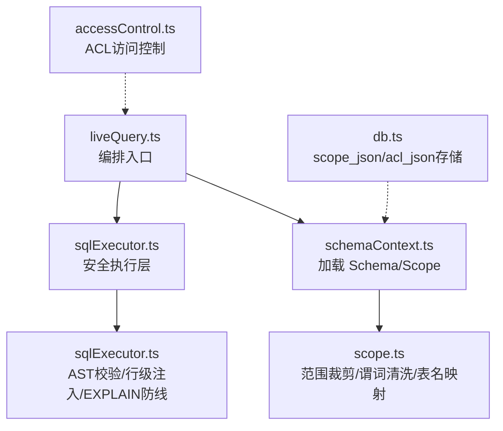
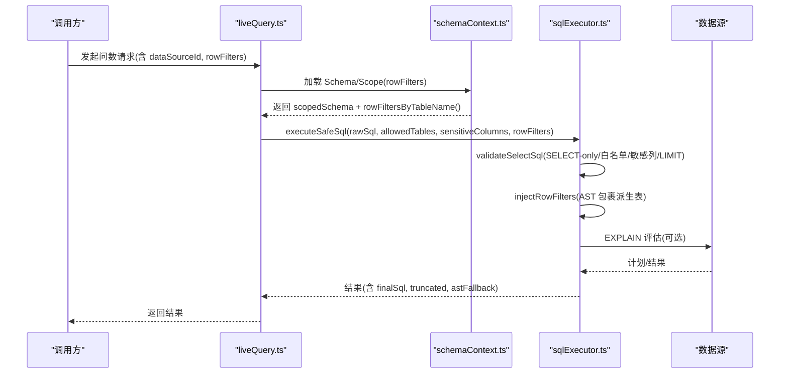
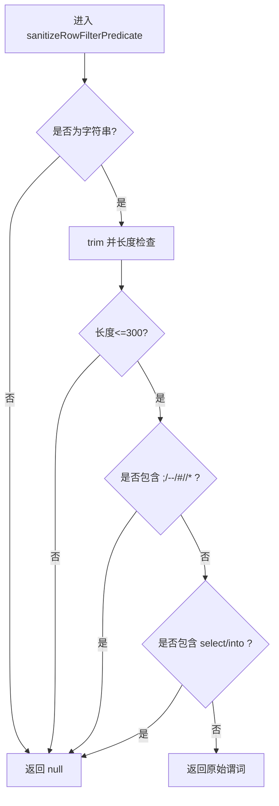
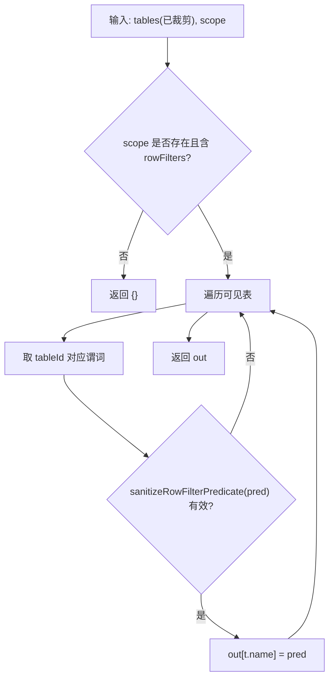
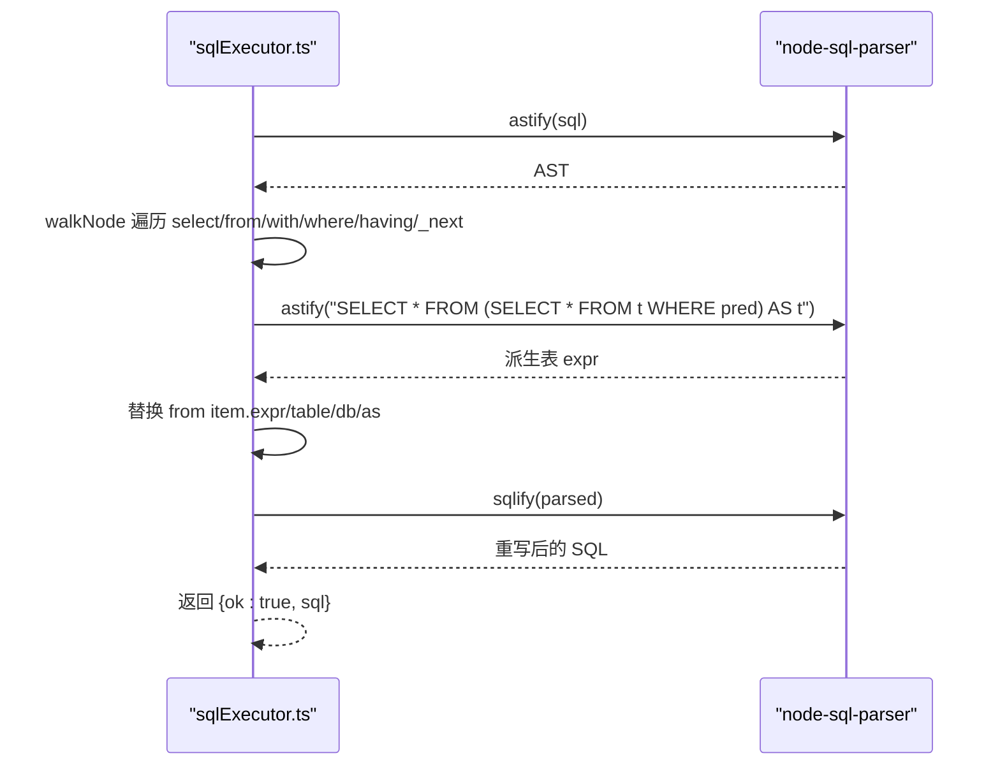
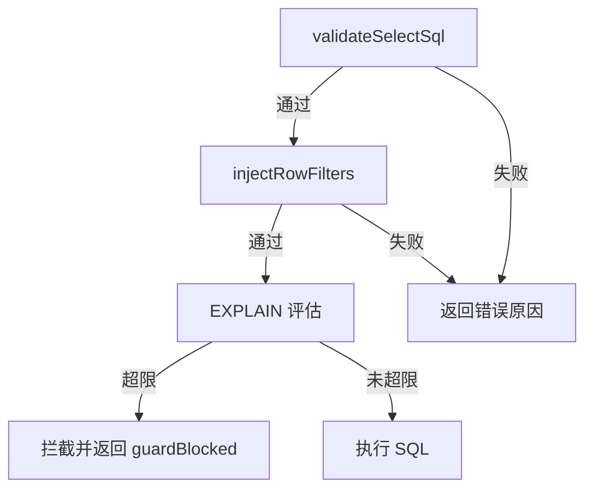
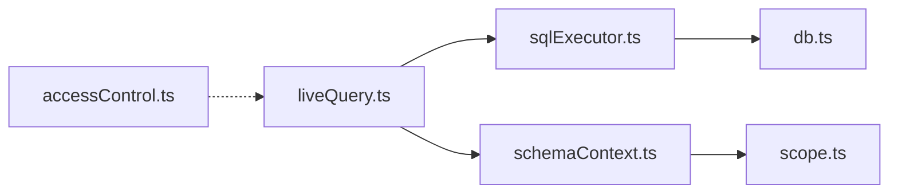

# 行级权限

<cite>
**本文引用的文件**
- [scope.ts](file://server/query/scope.ts)
- [sqlExecutor.ts](file://server/query/sqlExecutor.ts)
- [schemaContext.ts](file://server/query/schemaContext.ts)
- [accessControl.ts](file://server/auth/accessControl.ts)
- [db.ts](file://server/infra/db.ts)
- [liveQuery.ts](file://server/query/liveQuery.ts)
- [drill.ts](file://server/query/drill.ts)
</cite>

## 目录
1. [简介](#简介)
2. [项目结构](#项目结构)
3. [核心组件](#核心组件)
4. [架构总览](#架构总览)
5. [详细组件分析](#详细组件分析)
6. [依赖关系分析](#依赖关系分析)
7. [性能与优化](#性能与优化)
8. [故障排查指南](#故障排查指南)
9. [结论](#结论)
10. [附录](#附录)

## 简介
本文件聚焦“行级权限控制”的完整实现与使用，覆盖以下关键点：
- WHERE 条件注入机制：安全条件拼接、SQL 注入防护、语法验证。
- 租户隔离实现：tenant_id 过滤（以 rowFilters 形式落地）、数据边界控制、跨租户访问限制。
- 数据范围过滤算法：时间范围、组织范围、项目范围的组合查询策略。
- 权限条件的优先级与合并规则：ACL 与 DataScope 的关系、表级/列级/行级权限的叠加顺序。
- 性能优化：索引利用、EXPLAIN 防线、连接池与超时、MAX_EXECUTION_TIME hint。
- 安全防护重点：sanitizeRowFilterPredicate 的结构化清洗；rowFiltersByTableName 的表名映射逻辑。

## 项目结构
行级权限贯穿“配置—校验—注入—执行—监控”全链路，关键文件职责如下：
- server/query/scope.ts：DataScope 定义、谓词清洗、表/列/行级范围裁剪、tableId→实际表名映射。
- server/query/sqlExecutor.ts：SQL 安全执行层，包含 AST 校验、白名单、行级权限注入、EXPLAIN 防线、MySQL hint 注入等。
- server/query/schemaContext.ts：加载数据源 schema 与 scope，并生成最终可执行的 rowFilters（按可见表映射）。
- server/auth/accessControl.ts：数据源级 ACL（部门/用户）访问控制，与 DataScope 正交。
- server/infra/db.ts：数据源元数据存储（含 scope_json、acl_json），以及权限申请、审计等表结构。
- server/query/liveQuery.ts / drill.ts：编排入口，将 rowFilters 透传到 executeSafeSql。

图表来源
- [liveQuery.ts:189-210](file://server/query/liveQuery.ts#L189-L210)
- [sqlExecutor.ts:734-789](file://server/query/sqlExecutor.ts#L734-L789)
- [schemaContext.ts:136-151](file://server/query/schemaContext.ts#L136-L151)
- [scope.ts:17-100](file://server/query/scope.ts#L17-L100)
- [accessControl.ts:44-73](file://server/auth/accessControl.ts#L44-L73)
- [db.ts:104-139](file://server/infra/db.ts#L104-L139)

章节来源
- [scope.ts:1-100](file://server/query/scope.ts#L1-L100)
- [sqlExecutor.ts:291-489](file://server/query/sqlExecutor.ts#L291-L489)
- [schemaContext.ts:136-151](file://server/query/schemaContext.ts#L136-L151)
- [accessControl.ts:1-108](file://server/auth/accessControl.ts#L1-L108)
- [db.ts:104-139](file://server/infra/db.ts#L104-L139)
- [liveQuery.ts:78-113](file://server/query/liveQuery.ts#L78-L113)
- [drill.ts:27-47](file://server/query/drill.ts#L27-L47)

## 核心组件
- DataScope（表/列/行级范围）：tables 限定可见表；columns 限定可见列；rowFilters 为每表的 WHERE 片段（管理员登记，执行层强制注入）。
- sanitizeRowFilterPredicate：对 rowFilters 进行结构化清洗，拒绝多语句、注释、子查询、INTO 等危险构造，长度与类型校验。
- applyDataScope：基于 tables/columns 裁剪 SchemaTable，用于后续提示词与白名单构建。
- rowFiltersByTableName：将 scope.rowFilters 中 tableId 键映射到 SQL 中的真实表名，仅对可见表生效。
- validateSelectSql + injectRowFilters：在安全执行层进行 SELECT-only 校验、表白名单、敏感列拒绝、LIMIT 强制，并在 AST 上递归包裹派生表完成行级权限注入。
- EXPLAIN 防线：在执行前评估扫描行数，超过阈值拦截，保护后端数据库。
- MySQL MAX_EXECUTION_TIME hint：在 SELECT 开头或 CTE 主 SELECT 处注入服务端执行时限，防止长尾查询。

章节来源
- [scope.ts:17-100](file://server/query/scope.ts#L17-L100)
- [sqlExecutor.ts:291-489](file://server/query/sqlExecutor.ts#L291-L489)
- [sqlExecutor.ts:118-153](file://server/query/sqlExecutor.ts#L118-L153)
- [sqlExecutor.ts:629-662](file://server/query/sqlExecutor.ts#L629-L662)

## 架构总览
行级权限在“问数编排 → 安全执行”链路中作为强制约束存在，任何 LLM 生成的 SQL 都必须通过安全校验后，再注入行级权限谓词，最后才下发至数据源执行。

图表来源
- [liveQuery.ts:189-210](file://server/query/liveQuery.ts#L189-L210)
- [schemaContext.ts:136-151](file://server/query/schemaContext.ts#L136-L151)
- [sqlExecutor.ts:734-789](file://server/query/sqlExecutor.ts#L734-L789)
- [sqlExecutor.ts:291-489](file://server/query/sqlExecutor.ts#L291-L489)
- [sqlExecutor.ts:629-662](file://server/query/sqlExecutor.ts#L629-L662)

## 详细组件分析

### 安全条件拼接与 SQL 注入防护（sanitizeRowFilterPredicate）
- 输入校验：仅接受字符串，空串与超长（>300）直接拒绝。
- 结构防护：拒绝分号（多语句）、注释（--、#、/*）、关键字 select/into（防 INTO 写操作）、子查询（IN (SELECT...) 等）。
- 输出：合法谓词原样保留，非法返回 null 表示不启用该表过滤。

图表来源
- [scope.ts:17-26](file://server/query/scope.ts#L17-L26)

章节来源
- [scope.ts:17-26](file://server/query/scope.ts#L17-L26)

### 表名映射逻辑（rowFiltersByTableName）
- 作用：将 scope.rowFilters 中以 tableId 为键的谓词，映射为 SQL 中的真实表名键，供执行层 AST 注入匹配。
- 规则：
  - 仅对 applyDataScope 过滤后的可见表生效，避免越权。
  - 对每个可见表，读取其 id 对应的谓词，经 sanitizeRowFilterPredicate 清洗后，若有效则以 t.name 为键写入输出。
- 结果：得到 { 实际表名: 谓词 } 的映射，用于 injectRowFilters。

图表来源
- [scope.ts:92-100](file://server/query/scope.ts#L92-L100)

章节来源
- [scope.ts:28-43](file://server/query/scope.ts#L28-L43)
- [scope.ts:92-100](file://server/query/scope.ts#L92-L100)

### WHERE 条件注入机制（injectRowFilters）
- 触发时机：validateSelectSql 通过后、真执行前。
- 注入方式：使用 AST 解析器将受控表包裹为派生表（FROM t → FROM (SELECT * FROM t WHERE <谓词>) AS t），递归处理：
  - 主查询 FROM/JOIN
  - WITH CTE 定义内的真实表引用
  - WHERE/HAVING 表达式中的子查询
  - UNION/UNION ALL 链
- 失败策略：谓词解析失败或 AST 回写失败均 fail-closed，拒绝执行，确保不会泄露受限行。

图表来源
- [sqlExecutor.ts:396-489](file://server/query/sqlExecutor.ts#L396-L489)

章节来源
- [sqlExecutor.ts:396-489](file://server/query/sqlExecutor.ts#L396-L489)

### 租户隔离实现（tenant_id 过滤、数据边界、跨租户限制）
- 模型：rowFilters[tableId] 存放 WHERE 片段，典型如 tenant_id = ? 或 department_id = ? 等。
- 数据边界：通过 AST 包裹派生表，所有对该表的访问均被强制加上租户/组织/项目等过滤条件。
- 跨租户限制：即使 LLM 生成 SQL 未显式加过滤，执行层也会强制注入，从而阻断跨租户读取。
- 持久化：scope_json 中保存 rowFilters，随数据源配置加载并参与每次执行。

章节来源
- [scope.ts:17-26](file://server/query/scope.ts#L17-L26)
- [sqlExecutor.ts:396-489](file://server/query/sqlExecutor.ts#L396-L489)
- [db.ts:104-139](file://server/infra/db.ts#L104-L139)

### 数据范围过滤算法（时间/组织/项目组合）
- 组合策略：
  - 时间范围：WHERE created_at BETWEEN ... AND ...
  - 组织范围：WHERE department_id IN (...)
  - 项目范围：WHERE project_id = ...
- 实现位置：由管理员在 scope.rowFilters 中登记，经 sanitizeRowFilterPredicate 清洗后，统一在 injectRowFilters 中注入。
- 优势：无需改动业务 SQL，统一在安全执行层强制生效，保证一致性与安全性。

章节来源
- [scope.ts:17-26](file://server/query/scope.ts#L17-L26)
- [sqlExecutor.ts:396-489](file://server/query/sqlExecutor.ts#L396-L489)

### 权限条件的优先级与合并规则
- 优先级顺序（从高到低）：
  1) 数据源级 ACL（accessControl.ts）：决定能否访问该数据源（部门/用户清单）。
  2) DataScope 表/列限制（applyDataScope）：决定可见表与可见列。
  3) 行级权限（rowFiltersByTableName + injectRowFilters）：强制附加 WHERE 片段。
- 合并规则：
  - ACL 与 DataScope 正交：ACL 控制“能不能用”，DataScope 控制“能看到什么”。
  - 行级权限在所有可见表上强制生效，无法绕过。
  - 多个来源的 rowFilters 以 scope 为准，经清洗后按表名映射注入。

章节来源
- [accessControl.ts:1-108](file://server/auth/accessControl.ts#L1-L108)
- [scope.ts:28-100](file://server/query/scope.ts#L28-L100)
- [sqlExecutor.ts:396-489](file://server/query/sqlExecutor.ts#L396-L489)

### 安全执行层与 EXPLAIN 防线
- validateSelectSql：
  - 只允许 SELECT（WITH 需 AST 强校验）。
  - 单语句、禁止 INTO、拒绝危险关键字。
  - 表白名单校验（结合 CTE 名排除）。
  - 敏感列拒绝（整词匹配）。
  - 强制 LIMIT（无则追加，有则 clamp 到上限）。
- injectRowFilters：AST 包裹派生表，递归覆盖子查询/CTE/UNION。
- EXPLAIN 防线：
  - MySQL：EXPLAIN FORMAT=JSON 解析 rows_examined_per_scan/estimated_rows。
  - PG：EXPLAIN (FORMAT JSON) 解析 Plan Rows。
  - 超阈值拦截，附带友好提示；EXPLAIN 失败时 fail-open 放行但记录告警。
- MySQL MAX_EXECUTION_TIME hint：在 SELECT 或 CTE 主 SELECT 处注入，兜底执行超时。

图表来源
- [sqlExecutor.ts:291-387](file://server/query/sqlExecutor.ts#L291-L387)
- [sqlExecutor.ts:396-489](file://server/query/sqlExecutor.ts#L396-L489)
- [sqlExecutor.ts:629-662](file://server/query/sqlExecutor.ts#L629-L662)
- [sqlExecutor.ts:118-153](file://server/query/sqlExecutor.ts#L118-L153)

章节来源
- [sqlExecutor.ts:291-489](file://server/query/sqlExecutor.ts#L291-L489)
- [sqlExecutor.ts:629-662](file://server/query/sqlExecutor.ts#L629-L662)
- [sqlExecutor.ts:118-153](file://server/query/sqlExecutor.ts#L118-L153)

## 依赖关系分析
- liveQuery.ts 编排入口将 rowFilters 透传给 executeSafeSql。
- schemaContext.ts 负责从 data_sources.scope_json 加载 scope，应用 applyDataScope 裁剪 Schema，并通过 rowFiltersByTableName 生成最终注入映射。
- sqlExecutor.ts 提供安全执行能力，包括 AST 校验、行级注入、EXPLAIN 防线与 MySQL hint。
- accessControl.ts 提供数据源级 ACL 判定，与 DataScope 正交。
- db.ts 维护 scope_json、acl_json 等元数据，支撑上述流程。

图表来源
- [liveQuery.ts:189-210](file://server/query/liveQuery.ts#L189-L210)
- [schemaContext.ts:136-151](file://server/query/schemaContext.ts#L136-L151)
- [sqlExecutor.ts:734-789](file://server/query/sqlExecutor.ts#L734-L789)
- [accessControl.ts:44-73](file://server/auth/accessControl.ts#L44-L73)
- [db.ts:104-139](file://server/infra/db.ts#L104-L139)

章节来源
- [liveQuery.ts:78-113](file://server/query/liveQuery.ts#L78-L113)
- [schemaContext.ts:136-151](file://server/query/schemaContext.ts#L136-L151)
- [sqlExecutor.ts:734-789](file://server/query/sqlExecutor.ts#L734-L789)
- [accessControl.ts:44-73](file://server/auth/accessControl.ts#L44-L73)
- [db.ts:104-139](file://server/infra/db.ts#L104-L139)

## 性能与优化
- 连接池与场景配额：
  - 按数据源+场景分级缓存连接池，交互/分析链/导出独立配额与超时。
  - 环境变量 DS_POOL_MAX/DS_POOL_INTERACTIVE/DS_POOL_CHAIN/DS_POOL_EXPORT 控制容量。
- 执行超时：
  - PG：statement_timeout 按场景设置。
  - MySQL：MAX_EXECUTION_TIME hint 注入，配合驱动 timeout。
- EXPLAIN 防线：
  - 预估扫描行数超阈值拦截，避免拖垮业务库。
  - 支持 MySQL 与 PG 两种解释格式解析。
- 索引利用建议：
  - 在 rowFilters 涉及的列建立合适索引（如 tenant_id、department_id、project_id、时间字段）。
  - 复合索引优先覆盖高频过滤组合（如 (tenant_id, status, created_at)）。
- 查询计划分析：
  - 借助 EXPLAIN 输出定位全表扫描与低效 JOIN。
  - 关注 rows_examined_per_scan/Plan Rows 与 cost，优化谓词选择性。

章节来源
- [sqlExecutor.ts:45-109](file://server/query/sqlExecutor.ts#L45-L109)
- [sqlExecutor.ts:118-153](file://server/query/sqlExecutor.ts#L118-L153)
- [sqlExecutor.ts:531-662](file://server/query/sqlExecutor.ts#L531-L662)

## 故障排查指南
- 行级权限注入失败：
  - 现象：executeSafeSql 返回 reason 为“行级权限注入失败，已拒绝该查询”。
  - 可能原因：谓词非法（sanitizeRowFilterPredicate 拒绝）、AST 解析失败、回写失败。
  - 处理：检查 scope.rowFilters 内容，确保不含多语句/注释/子查询/INTO，长度不超过限制。
- EXPLAIN 防线拦截：
  - 现象：guardBlocked=true，提示预估扫描行数超过阈值。
  - 处理：增加时间范围、部门/项目等筛选条件，或优化索引提升选择性。
- 表名映射异常：
  - 现象：rowFilters 未生效。
  - 处理：确认 scope.tables 包含目标表，且 rowFiltersByTableName 能正确映射到 SQL 中的实际表名。
- 敏感列拒绝：
  - 现象：validateSelectSql 返回“涉及受保护的敏感字段”。
  - 处理：调整 SQL 避免引用敏感列，或在 scope 中剔除相关列。

章节来源
- [sqlExecutor.ts:291-387](file://server/query/sqlExecutor.ts#L291-L387)
- [sqlExecutor.ts:396-489](file://server/query/sqlExecutor.ts#L396-L489)
- [sqlExecutor.ts:629-662](file://server/query/sqlExecutor.ts#L629-L662)
- [scope.ts:17-26](file://server/query/scope.ts#L17-L26)

## 结论
行级权限在本系统中通过“配置—校验—注入—执行—监控”的闭环实现，确保无论 LLM 如何生成 SQL，最终执行均受到严格的安全约束。sanitizeRowFilterPredicate 提供结构化防护，rowFiltersByTableName 保障表名映射准确，injectRowFilters 通过 AST 包裹派生表实现强制过滤。配合 ACL、DataScope、EXPLAIN 防线与 MySQL hint，系统在安全性与可用性之间取得平衡，并提供完善的性能优化与故障排查手段。

## 附录
- 典型 rowFilters 示例（概念性说明）：
  - 租户隔离：tenant_id = ?
  - 组织范围：department_id IN ('dept_a','dept_b')
  - 项目范围：project_id = ?
  - 时间范围：created_at BETWEEN '2024-01-01' AND '2024-12-31'
- 相关接口与常量：
  - 最大返回行数：MAX_ROWS（默认 100000）
  - 连接池容量：dsPoolMax()/dsPoolScenarioMax()
  - 执行超时：scenarioTimeoutMs()
  - EXPLAIN 阈值：explainGuardMaxRows()

[本节为概念性补充，不直接分析具体文件]