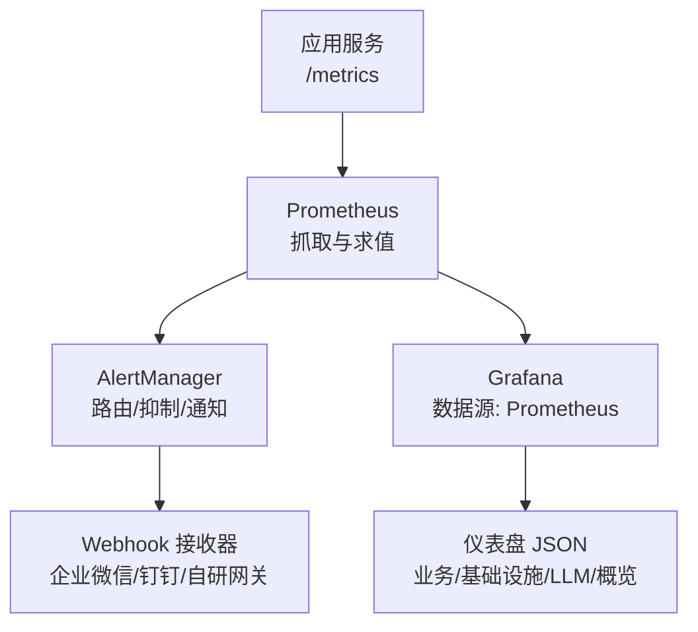
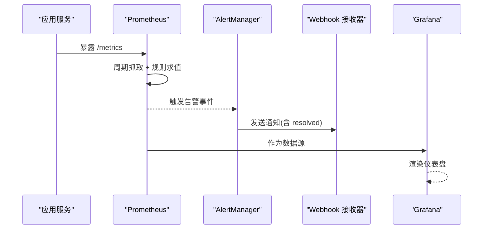
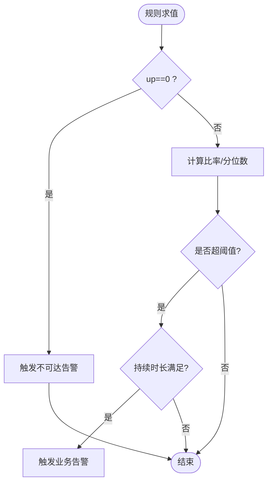
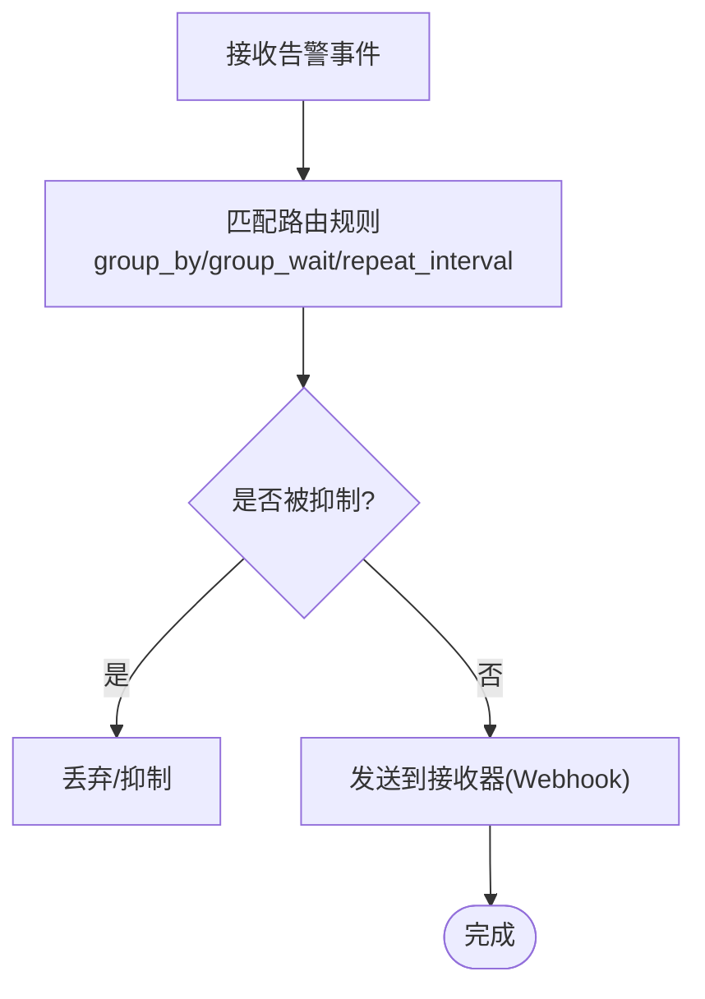
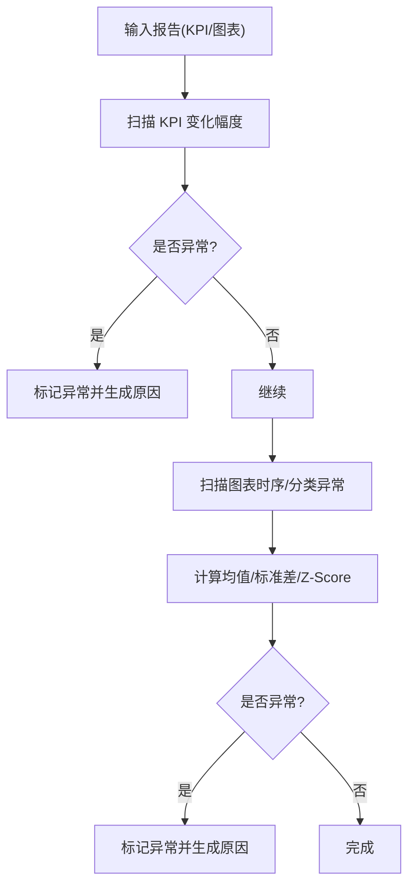
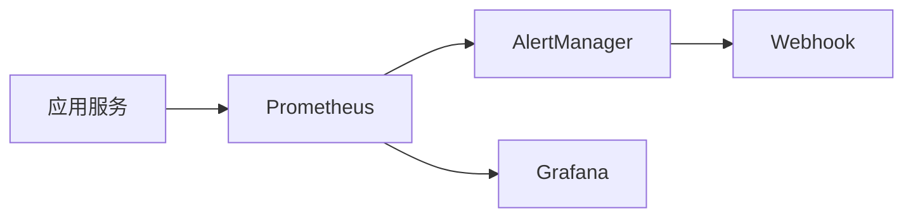

# 告警系统

<cite>
**本文引用的文件**
- [deploy/prometheus.yml](file://deploy/prometheus.yml)
- [deploy/prometheus-alerts.yml](file://deploy/prometheus-alerts.yml)
- [deploy/alertmanager.yml](file://deploy/alertmanager.yml)
- [deploy/alertmanager-entrypoint.sh](file://deploy/alertmanager-entrypoint.sh)
- [server/infra/monitoring.ts](file://server/infra/monitoring.ts)
- [src/utils/anomalyDetector.ts](file://src/utils/anomalyDetector.ts)
- [deploy/grafana/provisioning/datasources/prometheus.yml](file://deploy/grafana/provisioning/datasources/prometheus.yml)
- [deploy/grafana/provisioning/dashboards/dashboards.yml](file://deploy/grafana/provisioning/dashboards/dashboards.yml)
</cite>

## 目录
1. [简介](#简介)
2. [项目结构](#项目结构)
3. [核心组件](#核心组件)
4. [架构总览](#架构总览)
5. [详细组件分析](#详细组件分析)
6. [依赖关系分析](#依赖关系分析)
7. [性能考量](#性能考量)
8. [故障排查指南](#故障排查指南)
9. [结论](#结论)
10. [附录](#附录)

## 简介
本文件为“智能问数据分析系统”的告警系统专业文档，覆盖 Prometheus 告警规则配置、AlertManager 路由与通知、告警分级策略（P0/P1/P2）、抑制/去重/静默机制、测试与调试方法、最佳实践以及常见告警场景的处理方案。文档基于仓库中的部署配置与应用侧埋点实现进行说明，确保与实际代码和配置文件一一对应。

## 项目结构
告警系统由以下关键部分构成：
- 指标采集与暴露：应用通过 /metrics 暴露业务与系统指标，Prometheus 按 job 抓取。
- 告警规则：在 prometheus-alerts.yml 中定义阈值、趋势与复合条件告警。
- 告警路由与通知：AlertManager 根据 severity/service 等标签进行分组、路由与通知（默认 Webhook）。
- 可视化：Grafana 自动加载数据源与仪表盘，用于观测与排障。
- 启动注入：alertmanager-entrypoint.sh 将环境变量替换到 AlertManager 配置模板，完成 Webhook URL 注入。

图表来源
- [deploy/prometheus.yml:1-57](file://deploy/prometheus.yml#L1-L57)
- [deploy/prometheus-alerts.yml:1-144](file://deploy/prometheus-alerts.yml#L1-L144)
- [deploy/alertmanager.yml:1-43](file://deploy/alertmanager.yml#L1-L43)
- [deploy/grafana/provisioning/datasources/prometheus.yml:1-11](file://deploy/grafana/provisioning/datasources/prometheus.yml#L1-L11)
- [deploy/grafana/provisioning/dashboards/dashboards.yml:1-14](file://deploy/grafana/provisioning/dashboards/dashboards.yml#L1-L14)

章节来源
- [deploy/prometheus.yml:1-57](file://deploy/prometheus.yml#L1-L57)
- [deploy/prometheus-alerts.yml:1-144](file://deploy/prometheus-alerts.yml#L1-L144)
- [deploy/alertmanager.yml:1-43](file://deploy/alertmanager.yml#L1-L43)
- [deploy/grafana/provisioning/datasources/prometheus.yml:1-11](file://deploy/grafana/provisioning/datasources/prometheus.yml#L1-L11)
- [deploy/grafana/provisioning/dashboards/dashboards.yml:1-14](file://deploy/grafana/provisioning/dashboards/dashboards.yml#L1-L14)

## 核心组件
- 指标埋点与暴露
  - 应用侧通过 prom-client 注册计数器、直方图等指标，并在 /metrics 端点暴露；所有埋点采用 fail-open 设计，不影响主链路。
  - 关键指标包括：请求计数、端到端耗时、缓存命中、LLM 调用耗时与 token、SQL 执行耗时、HTTP 接口耗时。
- Prometheus 抓取与规则
  - 抓取目标包含应用、Node 节点、Redis、MySQL、Alertmanager 自身；规则文件统一加载并周期性求值。
- AlertManager 路由与通知
  - 默认使用 Webhook 接收器；支持按 severity/service 分组与重复间隔控制；提供抑制规则避免级联告警风暴。
- Grafana 可视化
  - 自动配置 Prometheus 数据源与仪表盘，便于快速定位问题。

章节来源
- [server/infra/monitoring.ts:1-153](file://server/infra/monitoring.ts#L1-L153)
- [deploy/prometheus.yml:1-57](file://deploy/prometheus.yml#L1-L57)
- [deploy/prometheus-alerts.yml:1-144](file://deploy/prometheus-alerts.yml#L1-L144)
- [deploy/alertmanager.yml:1-43](file://deploy/alertmanager.yml#L1-L43)
- [deploy/grafana/provisioning/datasources/prometheus.yml:1-11](file://deploy/grafana/provisioning/datasources/prometheus.yml#L1-L11)
- [deploy/grafana/provisioning/dashboards/dashboards.yml:1-14](file://deploy/grafana/provisioning/dashboards/dashboards.yml#L1-L14)

## 架构总览
下图展示了从指标采集到告警通知的完整链路，以及可视化观测路径。

图表来源
- [deploy/prometheus.yml:1-57](file://deploy/prometheus.yml#L1-L57)
- [deploy/prometheus-alerts.yml:1-144](file://deploy/prometheus-alerts.yml#L1-L144)
- [deploy/alertmanager.yml:1-43](file://deploy/alertmanager.yml#L1-L43)
- [deploy/grafana/provisioning/datasources/prometheus.yml:1-11](file://deploy/grafana/provisioning/datasources/prometheus.yml#L1-L11)

## 详细组件分析

### Prometheus 抓取与指标体系
- 抓取目标
  - 应用主链路（nl2sql-app）、宿主机资源（node）、缓存层（redis）、元数据库（mysql）、Alertmanager 自监控。
- 指标设计原则
  - 低基数 label：仅使用 status/endpoint/channel/model 等枚举，避免 question/userId 等高基数字段进入 label。
  - 旁路埋点：审计落账、缓存命中、LLM 用量、SQL 执行耗时均通过独立函数写入，失败不阻塞业务。
- 指标用途
  - 成功率、时延分位、缓存命中率、降级率、资源水位、监控栈健康度等，直接支撑告警规则。

章节来源
- [deploy/prometheus.yml:1-57](file://deploy/prometheus.yml#L1-L57)
- [server/infra/monitoring.ts:1-153](file://server/infra/monitoring.ts#L1-L153)

### Prometheus 告警规则（阈值/趋势/复合条件）
- 可用性类
  - 应用不可达、MySQL 不可达、Redis 不可达：基于 up 指标判定，持续一定时间后触发。
- 业务类
  - 成功率低于阈值：基于成功与总量比率计算，无流量时天然不误报。
  - P95 时延恶化：基于直方图分位数计算，持续一段时间触发。
  - 缓存命中率异常：比率+流量门槛组合，避免夜间低流量误报。
  - FALLBACK 降级率超标：比率超过基线阈值持续一段时间触发。
- 资源与监控栈自监控
  - 内存高、磁盘空间低、Prometheus 序列数过高、规则求值失败、抓取耗时过长、Alertmanager 不可达等。

图表来源
- [deploy/prometheus-alerts.yml:1-144](file://deploy/prometheus-alerts.yml#L1-L144)

章节来源
- [deploy/prometheus-alerts.yml:1-144](file://deploy/prometheus-alerts.yml#L1-L144)

### AlertManager 配置（接收器/路由/抑制）
- 全局与路由
  - 分组键：alertname、service；分组等待与重复间隔可调；critical 级别缩短重复间隔以加强提醒。
- 接收器
  - 默认 Webhook 接收器，支持 send_resolved 返回恢复通知；可通过环境变量注入 Webhook URL。
- 抑制规则
  - 当应用宕机时，抑制下游业务告警（成功率/时延/缓存/降级），避免连锁告警风暴。

图表来源
- [deploy/alertmanager.yml:1-43](file://deploy/alertmanager.yml#L1-L43)
- [deploy/alertmanager-entrypoint.sh:1-13](file://deploy/alertmanager-entrypoint.sh#L1-L13)

章节来源
- [deploy/alertmanager.yml:1-43](file://deploy/alertmanager.yml#L1-L43)
- [deploy/alertmanager-entrypoint.sh:1-13](file://deploy/alertmanager-entrypoint.sh#L1-L13)

### 告警分级策略（P0/P1/P2）与响应流程
- P0 紧急告警（critical）
  - 典型：应用不可达、MySQL 不可达、Alertmanager 不可达。
  - 响应：立即介入，优先恢复核心服务；必要时升级至值班负责人。
- P1 严重告警（warning）
  - 典型：成功率下降、P95 时延升高、缓存命中率低、FALLBACK 率高、资源水位偏高。
  - 响应：快速定位瓶颈（LLM 负载、SQL 执行、缓存失效联动），制定优化计划。
- P2 警告/观察（warning/monitoring）
  - 典型：监控栈自监控异常（序列数膨胀、规则求值失败、抓取慢）。
  - 响应：纳入巡检清单，评估是否需要扩容或调优。

注：severity 标签由规则定义，AlertManager 路由可据此差异化处理（如 critical 缩短 repeat_interval）。

章节来源
- [deploy/prometheus-alerts.yml:1-144](file://deploy/prometheus-alerts.yml#L1-L144)
- [deploy/alertmanager.yml:1-43](file://deploy/alertmanager.yml#L1-L43)

### 告警抑制、去重、静默机制
- 抑制
  - 通过 inhibit_rules 实现：当上游关键服务不可用时，抑制其下游业务告警，减少噪音。
- 去重
  - AlertManager 对相同 alertname+labels 的告警进行合并；repeat_interval 控制重复频率。
- 静默
  - 未在本仓库中显式配置静默；可通过外部系统或 AlertManager API 按需设置临时静默窗口。

章节来源
- [deploy/alertmanager.yml:1-43](file://deploy/alertmanager.yml#L1-L43)

### 趋势异常检测（报告内嵌）
- 报告扫描引擎对 KPI 与图表数据进行异常检测：
  - 突增/陡降阈值判断；Z-Score 自适应阈值；小样本更严格阈值。
- 该能力主要用于报表层面的异常标注，辅助运营与产品洞察。

图表来源
- [src/utils/anomalyDetector.ts:1-146](file://src/utils/anomalyDetector.ts#L1-L146)

章节来源
- [src/utils/anomalyDetector.ts:1-146](file://src/utils/anomalyDetector.ts#L1-L146)

## 依赖关系分析
- 应用 → Prometheus：通过 /metrics 暴露指标，Prometheus 按 job 抓取。
- Prometheus → AlertManager：规则求值后推送告警事件。
- AlertManager → Webhook：发送通知（可接入企业微信/钉钉/自研网关）。
- Prometheus → Grafana：作为数据源，自动加载仪表盘。

图表来源
- [deploy/prometheus.yml:1-57](file://deploy/prometheus.yml#L1-L57)
- [deploy/alertmanager.yml:1-43](file://deploy/alertmanager.yml#L1-L43)
- [deploy/grafana/provisioning/datasources/prometheus.yml:1-11](file://deploy/grafana/provisioning/datasources/prometheus.yml#L1-L11)

章节来源
- [deploy/prometheus.yml:1-57](file://deploy/prometheus.yml#L1-L57)
- [deploy/alertmanager.yml:1-43](file://deploy/alertmanager.yml#L1-L43)
- [deploy/grafana/provisioning/datasources/prometheus.yml:1-11](file://deploy/grafana/provisioning/datasources/prometheus.yml#L1-L11)

## 性能考量
- 指标采集
  - 合理设置 scrape_interval 与 evaluation_interval，避免过度频繁导致资源压力。
  - 控制 label 基数，避免高基数导致时序爆炸。
- 告警规则
  - 比率类规则在无流量时为 NaN，天然不误报；结合 for 持续时间降低抖动。
  - 对直方图分位数计算，注意窗口大小与 bucket 设计。
- 通知通道
  - 调整 group_wait、repeat_interval，平衡及时性与通知量。
  - 使用抑制规则避免级联告警风暴。

[本节为通用指导，无需特定文件引用]

## 故障排查指南
- 常见问题与定位
  - 应用不可达：检查 /metrics 可达性、Prometheus 抓取目标、实例健康。
  - 成功率下降：查看 nl2sql_requests_total 状态分布、LLM 调用耗时与错误率、SQL 执行耗时。
  - 缓存命中率低：确认数据变更后的缓存失效联动、TTL 配置、查询语义一致性。
  - 降级率高：检查 LLM 输出质量、Schema 同步状态、SQL 白名单与 EXPLAIN 防线。
  - 监控栈异常：关注 Prometheus 序列数、规则求值失败次数、抓取耗时。
- 调试技巧
  - 在 Prometheus UI 中验证 PromQL 表达式结果与时间窗口。
  - 在 AlertManager UI 查看告警分组、抑制与通知历史。
  - 通过 Grafana 仪表盘快速对比业务/基础设施/LLM 指标趋势。
  - 使用 METRICS_TOKEN 保护 /metrics 端点，避免未授权访问。

章节来源
- [deploy/prometheus-alerts.yml:1-144](file://deploy/prometheus-alerts.yml#L1-L144)
- [deploy/alertmanager.yml:1-43](file://deploy/alertmanager.yml#L1-L43)
- [server/infra/monitoring.ts:135-153](file://server/infra/monitoring.ts#L135-L153)
- [deploy/grafana/provisioning/datasources/prometheus.yml:1-11](file://deploy/grafana/provisioning/datasources/prometheus.yml#L1-L11)

## 结论
本告警系统围绕“指标—规则—路由—通知—可视化”闭环构建，覆盖可用性、业务质量、资源与监控栈健康等多维度。通过合理的阈值、持续时间与抑制策略，有效降低误报与告警风暴；结合 Grafana 可视化与报告异常检测，提升问题定位效率与运营洞察能力。建议在生产环境中持续校准阈值与路由策略，并结合实际流量与 SLA 要求动态优化。

[本节为总结，无需特定文件引用]

## 附录

### 常见告警场景与处理方案
- 应用不可达
  - 现象：Nl2sqlAppDown 触发。
  - 处理：检查进程存活、端口监听、网络连通；恢复后观察恢复通知。
- MySQL 不可达
  - 现象：MySQLDown 触发。
  - 处理：检查 MySQL 服务与 exporter；恢复后验证元数据读写。
- Redis 不可达
  - 现象：RedisDown 触发。
  - 处理：检查缓存层；应用将回退进程内缓存，关注多实例共享状态失效影响。
- 成功率下降
  - 现象：QuerySuccessRateLow 触发。
  - 处理：核查 LLM 引擎与数据源可用性；分析 nl2sql_duration_seconds 与 llm_call_duration_seconds。
- P95 时延升高
  - 现象：QueryLatencyP95High 触发。
  - 处理：拆分瓶颈（LLM vs SQL 执行）；必要时限流或扩容。
- 缓存命中率低
  - 现象：CacheHitRateLow 触发。
  - 处理：检查数据变更后的缓存失效联动与 TTL 配置；确认查询语义一致性。
- FALLBACK 率高
  - 现象：FallbackRateHigh 触发。
  - 处理：检查 LLM 输出质量、Schema 同步、SQL 白名单与 EXPLAIN 防线。
- 资源水位高
  - 现象：AppMemoryHigh/DiskSpaceLow 触发。
  - 处理：排查内存泄漏（embedding 缓存/审计缓冲）、日志与数据增长；清理与扩容。
- 监控栈异常
  - 现象：PrometheusCardinalityHigh/PrometheusRuleEvalFailures/ScrapeDurationSlow/AlertmanagerDown。
  - 处理：降低 label 基数、修复规则语法、优化抓取目标性能、恢复 Alertmanager。

章节来源
- [deploy/prometheus-alerts.yml:1-144](file://deploy/prometheus-alerts.yml#L1-L144)

### 告警测试方法与最佳实践
- 测试方法
  - 在 Prometheus UI 中构造并验证 PromQL 表达式，确认阈值与窗口符合预期。
  - 模拟故障（停止服务/数据库/缓存）验证告警触发与抑制效果。
  - 通过 Webhook 接收器本地代理（如 blackhole）验证通知格式与内容。
- 最佳实践
  - 指标命名与标签规范：低基数、语义清晰、避免高基数。
  - 规则分层：可用性→业务→资源→监控栈自监控，逐级细化。
  - 通知策略：critical 缩短重复间隔；warning 保持合理频率；send_resolved 开启以便闭环。
  - 抑制与静默：上游不可达抑制下游业务告警；临时维护期使用静默窗口。
  - 可视化先行：先建仪表盘再定规则，确保可观测性完备。

[本节为通用指导，无需特定文件引用]