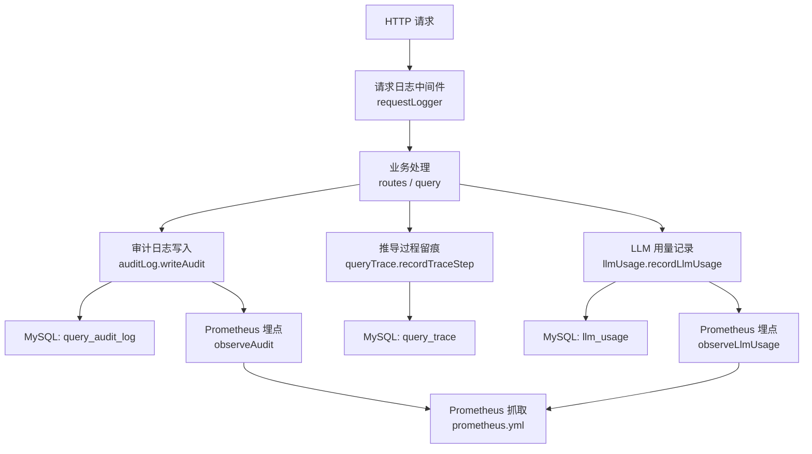
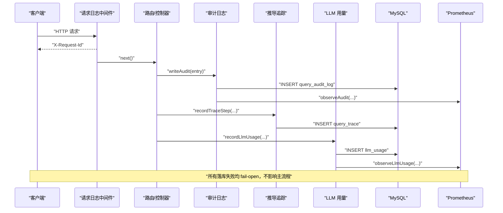
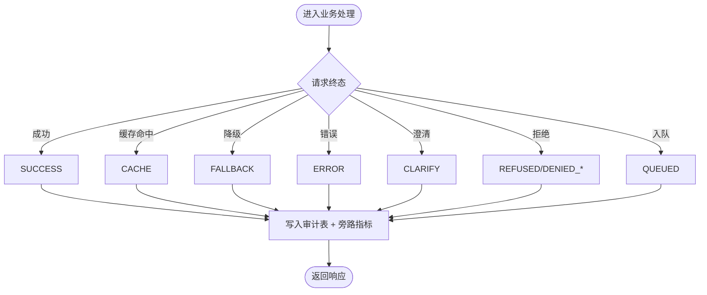
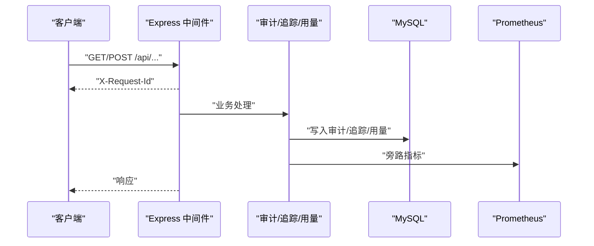
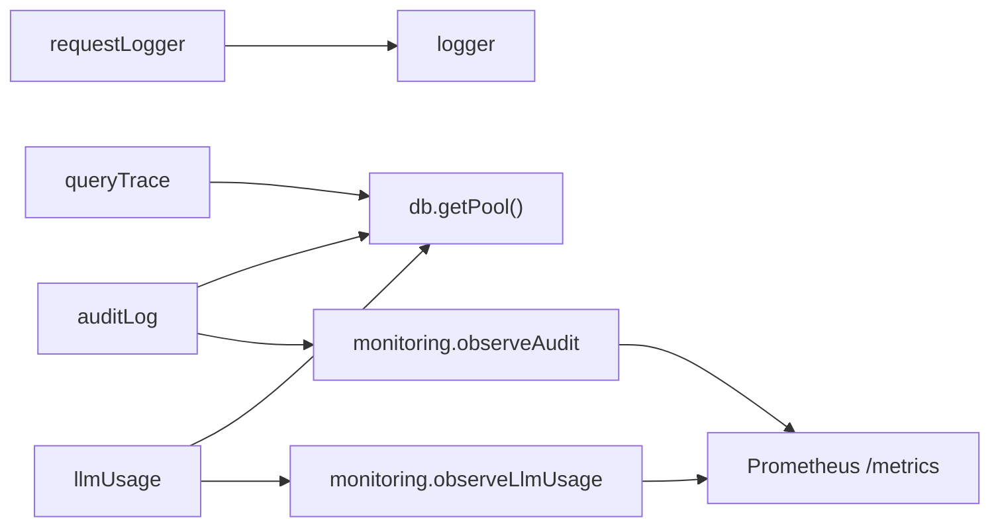

# 日志管理系统

<cite>
**本文引用的文件**
- [server/infra/logger.ts](file://server/infra/logger.ts)
- [server/infra/requestLogger.ts](file://server/infra/requestLogger.ts)
- [server/infra/auditLog.ts](file://server/infra/auditLog.ts)
- [server/infra/db.ts](file://server/infra/db.ts)
- [server/infra/monitoring.ts](file://server/infra/monitoring.ts)
- [server/query/queryTrace.ts](file://server/query/queryTrace.ts)
- [server/llm/llmUsage.ts](file://server/llm/llmUsage.ts)
- [deploy/prometheus.yml](file://deploy/prometheus.yml)
</cite>

## 目录
1. [简介](#简介)
2. [项目结构](#项目结构)
3. [核心组件](#核心组件)
4. [架构总览](#架构总览)
5. [详细组件分析](#详细组件分析)
6. [依赖关系分析](#依赖关系分析)
7. [性能与优化](#性能与优化)
8. [故障排查指南](#故障排查指南)
9. [结论](#结论)
10. [附录](#附录)

## 简介
本文件面向“智能问数据分析系统”的日志管理，系统性说明结构化日志设计、审计日志机制、请求日志收集、存储与保留策略、查询与分析方法，以及性能调优建议。目标是帮助运维与研发人员快速定位问题、评估系统健康度并持续优化成本与性能。

## 项目结构
日志相关能力分布在 infra（基础设施）、query（问数链路）、llm（大模型调用）三个层次：
- 统一日志出口：集中控制级别与输出方式，屏蔽 console.* 散乱输出。
- 请求日志：为每个 HTTP 请求生成唯一 requestId，记录访问路径、状态码与耗时，并在响应头回传以便前端关联。
- 审计日志：对问数全链路的关键事件进行落库，包括成功、降级、错误与被拒绝等状态。
- 追踪日志：按步骤记录问数推导过程，支持事后回放。
- LLM 用量日志：记录每次 LLM 调用的 token 消耗与耗时，支撑多引擎成本对比。
- 监控指标：通过 Prometheus 暴露关键指标，便于采集与告警。

**图表来源**
- [server/infra/requestLogger.ts:19-35](file://server/infra/requestLogger.ts#L19-L35)
- [server/infra/auditLog.ts:38-61](file://server/infra/auditLog.ts#L38-L61)
- [server/query/queryTrace.ts:55-88](file://server/query/queryTrace.ts#L55-L88)
- [server/llm/llmUsage.ts:25-50](file://server/llm/llmUsage.ts#L25-L50)
- [server/infra/monitoring.ts:92-133](file://server/infra/monitoring.ts#L92-L133)
- [deploy/prometheus.yml:16-39](file://deploy/prometheus.yml#L16-L39)

**章节来源**
- [server/infra/logger.ts:1-41](file://server/infra/logger.ts#L1-L41)
- [server/infra/requestLogger.ts:1-36](file://server/infra/requestLogger.ts#L1-L36)
- [server/infra/auditLog.ts:1-62](file://server/infra/auditLog.ts#L1-L62)
- [server/query/queryTrace.ts:1-118](file://server/query/queryTrace.ts#L1-L118)
- [server/llm/llmUsage.ts:1-134](file://server/llm/llmUsage.ts#L1-L134)
- [server/infra/monitoring.ts:1-153](file://server/infra/monitoring.ts#L1-L153)
- [deploy/prometheus.yml:1-57](file://deploy/prometheus.yml#L1-L57)

## 核心组件
- 统一日志出口 logger：提供 debug/info/warn/error 四级输出，受 LOG_LEVEL 控制；测试环境默认仅 error，避免噪音。
- 请求日志 requestLogger：为每个 /api 请求生成 requestId，记录方法与 URL、状态码与耗时，并通过 X-Request-Id 响应头回传。
- 审计日志 auditLog：定义端点与状态枚举，将用户操作、数据访问与安全拒绝事件写入 query_audit_log，同时旁路打点到 Prometheus。
- 追踪日志 queryTrace：以 trace_id 串联一次问数的各步骤，记录输入/输出摘要、SQL、行数与耗时，支持按 trace_id 回放。
- LLM 用量 llmUsage：记录每次 LLM 调用的引擎、模型、通道、token 与耗时，支持按引擎/模型/用户聚合。
- 监控指标 monitoring：集中定义计数器与直方图，fail-open 不阻塞主链路；提供 /metrics 端点（可选鉴权）。

**章节来源**
- [server/infra/logger.ts:1-41](file://server/infra/logger.ts#L1-L41)
- [server/infra/requestLogger.ts:1-36](file://server/infra/requestLogger.ts#L1-L36)
- [server/infra/auditLog.ts:1-62](file://server/infra/auditLog.ts#L1-L62)
- [server/query/queryTrace.ts:1-118](file://server/query/queryTrace.ts#L1-L118)
- [server/llm/llmUsage.ts:1-134](file://server/llm/llmUsage.ts#L1-L134)
- [server/infra/monitoring.ts:1-153](file://server/infra/monitoring.ts#L1-L153)

## 架构总览
下图展示从 HTTP 请求到日志落库与指标上报的全链路：

**图表来源**
- [server/infra/requestLogger.ts:19-35](file://server/infra/requestLogger.ts#L19-L35)
- [server/infra/auditLog.ts:38-61](file://server/infra/auditLog.ts#L38-L61)
- [server/query/queryTrace.ts:55-88](file://server/query/queryTrace.ts#L55-L88)
- [server/llm/llmUsage.ts:25-50](file://server/llm/llmUsage.ts#L25-L50)
- [server/infra/monitoring.ts:92-133](file://server/infra/monitoring.ts#L92-L133)

## 详细组件分析

### 结构化日志设计与规范
- 日志级别
  - debug：调试信息，仅在 LOG_LEVEL=debug 时输出。
  - info：常规运行信息，默认开启。
  - warn：警告信息，始终可输出。
  - error：错误信息，始终输出；测试环境默认仅 error。
- 输出格式
  - 统一通过 logger 输出，便于未来替换为结构化日志框架（如 pino）。
  - 请求日志包含 requestId、方法、URL、状态码、耗时与用户标识。
- 字段标准
  - 审计日志：userId、username、endpoint、dataSourceId、question、status、detail、executedSql、rowCount、durationMs。
  - 追踪日志：trace_id、step_type、title、input_summary、output_summary、sql_text、row_count、duration_ms、status。
  - LLM 用量：engine、model、channel、prompt_tokens、completion_tokens、total_tokens、duration_ms、ok、user_id、username。

**章节来源**
- [server/infra/logger.ts:1-41](file://server/infra/logger.ts#L1-L41)
- [server/infra/requestLogger.ts:1-36](file://server/infra/requestLogger.ts#L1-L36)
- [server/infra/auditLog.ts:10-36](file://server/infra/auditLog.ts#L10-L36)
- [server/query/queryTrace.ts:10-43](file://server/query/queryTrace.ts#L10-L43)
- [server/llm/llmUsage.ts:10-23](file://server/llm/llmUsage.ts#L10-L23)

### 审计日志记录机制
- 覆盖范围
  - 用户操作审计：问数、报表、导出、看板等端点调用。
  - 数据访问审计：附带 data_source_id、question、executedSql、rowCount。
  - 安全事件审计：DENIED_INPUT/DENIED_AUTH/DENIED_RATE/DENIED_SWITCH 等拒绝原因。
- 状态语义
  - SUCCESS/CACHE/FALLBACK/ERROR/CLARIFY/REFUSED/QUEUED 等，反映请求终态。
- 写入策略
  - fire-and-forget：写入失败仅告警，不阻塞主流程。
  - 旁路指标：同步更新 Prometheus 计数与耗时直方图。

**图表来源**
- [server/infra/auditLog.ts:10-22](file://server/infra/auditLog.ts#L10-L22)
- [server/infra/auditLog.ts:38-61](file://server/infra/auditLog.ts#L38-L61)
- [server/infra/monitoring.ts:92-100](file://server/infra/monitoring.ts#L92-L100)

**章节来源**
- [server/infra/auditLog.ts:1-62](file://server/infra/auditLog.ts#L1-L62)

### 请求日志收集
- HTTP 请求日志
  - 仅记录 /api/* 请求，避免静态资源噪音。
  - 生成 requestId 并写入响应头 X-Request-Id，便于前后端关联。
  - 记录方法、原始 URL、状态码与耗时。
- 数据库查询日志
  - 通过审计日志中的 executedSql、rowCount、durationMs 间接体现 SQL 执行结果与耗时。
- LLM 调用日志
  - 记录引擎、模型、通道、token 与耗时，支持按维度聚合分析。

**图表来源**
- [server/infra/requestLogger.ts:19-35](file://server/infra/requestLogger.ts#L19-L35)
- [server/infra/auditLog.ts:38-61](file://server/infra/auditLog.ts#L38-L61)
- [server/query/queryTrace.ts:55-88](file://server/query/queryTrace.ts#L55-L88)
- [server/llm/llmUsage.ts:25-50](file://server/llm/llmUsage.ts#L25-L50)

**章节来源**
- [server/infra/requestLogger.ts:1-36](file://server/infra/requestLogger.ts#L1-L36)
- [server/infra/auditLog.ts:1-62](file://server/infra/auditLog.ts#L1-L62)
- [server/query/queryTrace.ts:1-118](file://server/query/queryTrace.ts#L1-L118)
- [server/llm/llmUsage.ts:1-134](file://server/llm/llmUsage.ts#L1-L134)

### 日志存储策略、轮转与保留
- 存储位置
  - 应用日志：当前通过 console 输出，未实现文件轮转；可在 logger 中替换为结构化日志框架并接入日志采集。
  - 持久化日志：MySQL 中 query_audit_log、query_trace、llm_usage 等表承载审计、追踪与用量数据。
- 轮转机制
  - 代码层未内置日志文件轮转；建议结合容器日志采集或外部日志服务进行轮转与归档。
- 保留策略
  - 建议在 MySQL 侧基于 created_at 定期清理历史数据（例如超过 N 天的审计/追踪记录），以降低存储压力。
  - 指标数据由 Prometheus 负责保留与压缩，可按 Prometheus 配置调整。

**章节来源**
- [server/infra/logger.ts:1-41](file://server/infra/logger.ts#L1-L41)
- [server/infra/db.ts:181-234](file://server/infra/db.ts#L181-L234)
- [server/infra/db.ts:671-691](file://server/infra/db.ts#L671-L691)
- [deploy/prometheus.yml:1-57](file://deploy/prometheus.yml#L1-L57)

### 日志查询语法与分析工具
- 审计日志查询（MySQL）
  - 按用户与时间范围筛选：SELECT ... FROM query_audit_log WHERE user_id=? AND created_at BETWEEN ? AND ?
  - 按端点与状态统计：SELECT endpoint, status, COUNT(*) FROM query_audit_log GROUP BY endpoint, status
  - 慢查询分析：SELECT * FROM query_audit_log WHERE duration_ms > ? ORDER BY duration_ms DESC LIMIT ?
- 追踪日志查询（MySQL）
  - 按 trace_id 回放：SELECT * FROM query_trace WHERE trace_id=? ORDER BY id ASC
  - 步骤耗时分析：SELECT step_type, AVG(duration_ms), MAX(duration_ms) FROM query_trace GROUP BY step_type
- LLM 用量查询（MySQL）
  - 按引擎/模型聚合：SELECT engine, model, SUM(total_tokens), AVG(duration_ms) FROM llm_usage GROUP BY engine, model
  - 按用户聚合：SELECT user_id, username, SUM(total_tokens), AVG(duration_ms) FROM llm_usage GROUP BY user_id, username
- 指标查询（PromQL）
  - 问数请求总数：sum by (status, endpoint)(nl2sql_requests_total)
  - 端到端耗时分布：histogram_quantile(0.95, sum by (le, status)(nl2sql_duration_seconds_bucket))
  - LLM 调用耗时：histogram_quantile(0.95, sum by (le, model)(llm_call_duration_seconds_bucket))
  - HTTP 接口耗时：histogram_quantile(0.95, sum by (le, route)(http_request_duration_seconds_bucket))

**章节来源**
- [server/infra/db.ts:181-234](file://server/infra/db.ts#L181-L234)
- [server/infra/db.ts:671-691](file://server/infra/db.ts#L671-L691)
- [server/infra/monitoring.ts:19-88](file://server/infra/monitoring.ts#L19-L88)
- [deploy/prometheus.yml:16-39](file://deploy/prometheus.yml#L16-L39)

### 故障排查方法
- 快速定位请求
  - 使用 X-Request-Id 在应用日志中检索对应请求。
  - 通过 query_audit_log 查看该请求的终态、耗时与执行的 SQL。
- 分析问数链路
  - 使用 trace_id 回放 query_trace，定位耗时最高的步骤与失败的环节。
- 诊断 LLM 异常
  - 检查 llm_usage 中 ok=0 的记录，结合 llm_call_duration_seconds 指标观察异常率与时延。
- 指标与告警
  - 通过 Prometheus 仪表盘观察 nl2sql_duration_seconds、llm_call_duration_seconds、http_request_duration_seconds 等指标。
  - 配置 Alertmanager 规则对异常率与超时进行告警。

**章节来源**
- [server/infra/requestLogger.ts:19-35](file://server/infra/requestLogger.ts#L19-L35)
- [server/infra/auditLog.ts:38-61](file://server/infra/auditLog.ts#L38-L61)
- [server/query/queryTrace.ts:95-118](file://server/query/queryTrace.ts#L95-L118)
- [server/llm/llmUsage.ts:63-133](file://server/llm/llmUsage.ts#L63-L133)
- [server/infra/monitoring.ts:135-153](file://server/infra/monitoring.ts#L135-L153)

## 依赖关系分析
- 模块耦合
  - requestLogger 依赖 logger，注入 requestId 并记录访问日志。
  - auditLog 依赖 db 与 monitoring，完成落库与指标上报。
  - queryTrace 依赖 db，旁路写入推导步骤。
  - llmUsage 依赖 db 与 monitoring，记录用量与指标。
  - monitoring 集中定义指标与 /metrics 处理器。
- 外部依赖
  - MySQL：承载审计、追踪、用量等持久化数据。
  - Prometheus：采集指标，支持 Grafana 可视化与告警。

**图表来源**
- [server/infra/requestLogger.ts:1-36](file://server/infra/requestLogger.ts#L1-L36)
- [server/infra/auditLog.ts:1-62](file://server/infra/auditLog.ts#L1-L62)
- [server/query/queryTrace.ts:1-118](file://server/query/queryTrace.ts#L1-L118)
- [server/llm/llmUsage.ts:1-134](file://server/llm/llmUsage.ts#L1-L134)
- [server/infra/monitoring.ts:1-153](file://server/infra/monitoring.ts#L1-L153)

**章节来源**
- [server/infra/logger.ts:1-41](file://server/infra/logger.ts#L1-L41)
- [server/infra/requestLogger.ts:1-36](file://server/infra/requestLogger.ts#L1-L36)
- [server/infra/auditLog.ts:1-62](file://server/infra/auditLog.ts#L1-L62)
- [server/query/queryTrace.ts:1-118](file://server/query/queryTrace.ts#L1-L118)
- [server/llm/llmUsage.ts:1-134](file://server/llm/llmUsage.ts#L1-L134)
- [server/infra/monitoring.ts:1-153](file://server/infra/monitoring.ts#L1-L153)

## 性能与优化
- 日志级别控制
  - 生产环境建议 INFO 或 WARN；DEBUG 仅用于排障临时开启。
- 旁路写入与 fail-open
  - 审计、追踪、用量写入均为异步且失败静默，确保主链路可用性。
- 指标基数控制
  - 避免在高基数字段（如 question、userId）上打 label，降低内存与查询开销。
- 连接池容量
  - 应用库连接池根据 EXPECTED_CONCURRENT_USERS 动态计算，上限钳制，避免过度占用。
- 存储与查询优化
  - 对 query_audit_log、query_trace、llm_usage 的 created_at 建立索引，便于按时间范围查询。
  - 定期清理过期数据，减少表膨胀。
- 指标采集间隔
  - Prometheus scrape_interval 建议 15s，平衡实时性与负载。

**章节来源**
- [server/infra/logger.ts:1-41](file://server/infra/logger.ts#L1-L41)
- [server/infra/auditLog.ts:38-61](file://server/infra/auditLog.ts#L38-L61)
- [server/query/queryTrace.ts:55-88](file://server/query/queryTrace.ts#L55-L88)
- [server/llm/llmUsage.ts:25-50](file://server/llm/llmUsage.ts#L25-L50)
- [server/infra/db.ts:29-43](file://server/infra/db.ts#L29-L43)
- [server/infra/db.ts:181-234](file://server/infra/db.ts#L181-L234)
- [server/infra/db.ts:671-691](file://server/infra/db.ts#L671-L691)
- [deploy/prometheus.yml:1-57](file://deploy/prometheus.yml#L1-L57)

## 故障排查指南
- 现象：某次问数耗时过长
  - 通过 X-Request-Id 检索应用日志，定位请求。
  - 在 query_audit_log 中查看 duration_ms 与 executedSql。
  - 使用 trace_id 回放 query_trace，识别瓶颈步骤。
- 现象：LLM 调用失败率高
  - 查看 llm_usage 中 ok=0 的记录，确认引擎/模型/通道。
  - 通过 llm_call_duration_seconds 指标观察异常时段。
- 现象：指标缺失或异常
  - 检查 /metrics 端点是否可达，必要时启用 METRICS_TOKEN 保护。
  - 核对 Prometheus 抓取目标与 job 配置。

**章节来源**
- [server/infra/requestLogger.ts:19-35](file://server/infra/requestLogger.ts#L19-L35)
- [server/infra/auditLog.ts:38-61](file://server/infra/auditLog.ts#L38-L61)
- [server/query/queryTrace.ts:95-118](file://server/query/queryTrace.ts#L95-L118)
- [server/llm/llmUsage.ts:63-133](file://server/llm/llmUsage.ts#L63-L133)
- [server/infra/monitoring.ts:135-153](file://server/infra/monitoring.ts#L135-L153)
- [deploy/prometheus.yml:16-39](file://deploy/prometheus.yml#L16-L39)

## 结论
本系统通过统一日志出口、请求日志、审计日志、追踪日志与 LLM 用量日志构建了完整的可观测性体系。采用旁路写入与 fail-open 策略保障主链路稳定性，结合 Prometheus 指标与 MySQL 持久化数据，支持高效的查询分析与故障定位。建议在生产环境中合理设置日志级别、定期清理历史数据，并结合外部日志采集与告警平台完善运维闭环。

## 附录
- 环境变量参考
  - LOG_LEVEL：日志级别（debug/info/warn/error）
  - MYSQL_*：数据库连接参数
  - APP_POOL_MAX / EXPECTED_CONCURRENT_USERS：应用库连接池容量
  - METRICS_TOKEN：/metrics 端点鉴权令牌
- 常用表
  - query_audit_log：审计日志
  - query_trace：推导过程留痕
  - llm_usage：LLM 用量记录

**章节来源**
- [server/infra/logger.ts:1-41](file://server/infra/logger.ts#L1-L41)
- [server/infra/db.ts:16-27](file://server/infra/db.ts#L16-L27)
- [server/infra/db.ts:29-43](file://server/infra/db.ts#L29-L43)
- [server/infra/db.ts:181-234](file://server/infra/db.ts#L181-L234)
- [server/infra/db.ts:671-691](file://server/infra/db.ts#L671-L691)
- [server/infra/monitoring.ts:135-153](file://server/infra/monitoring.ts#L135-L153)