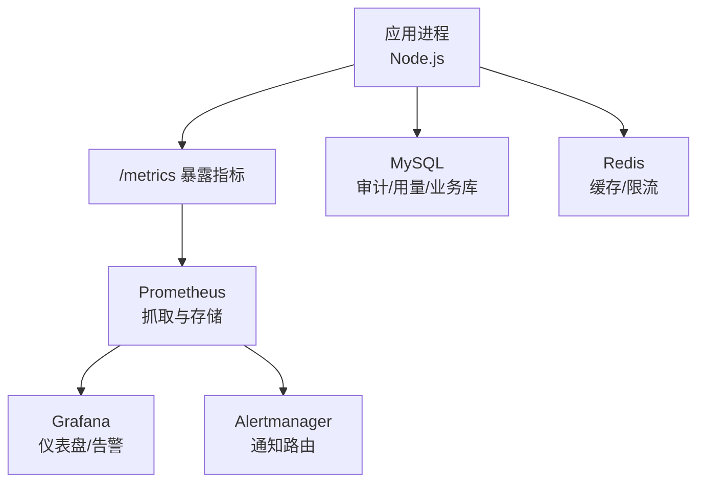
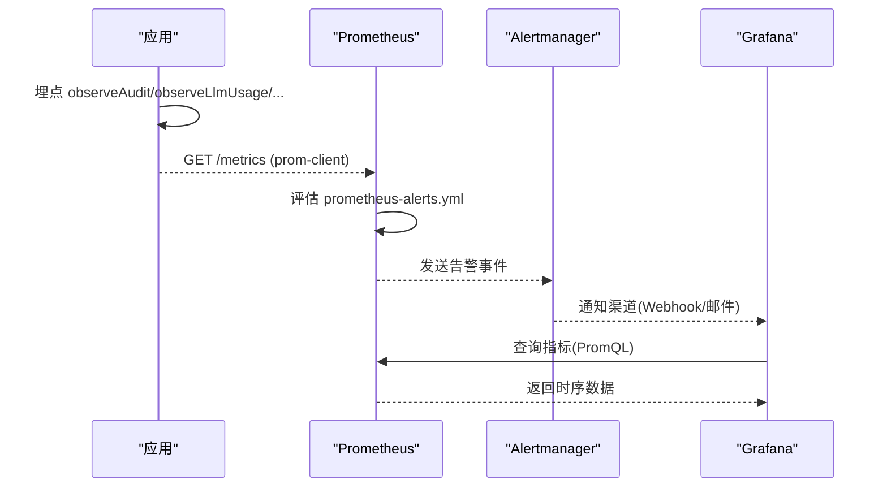
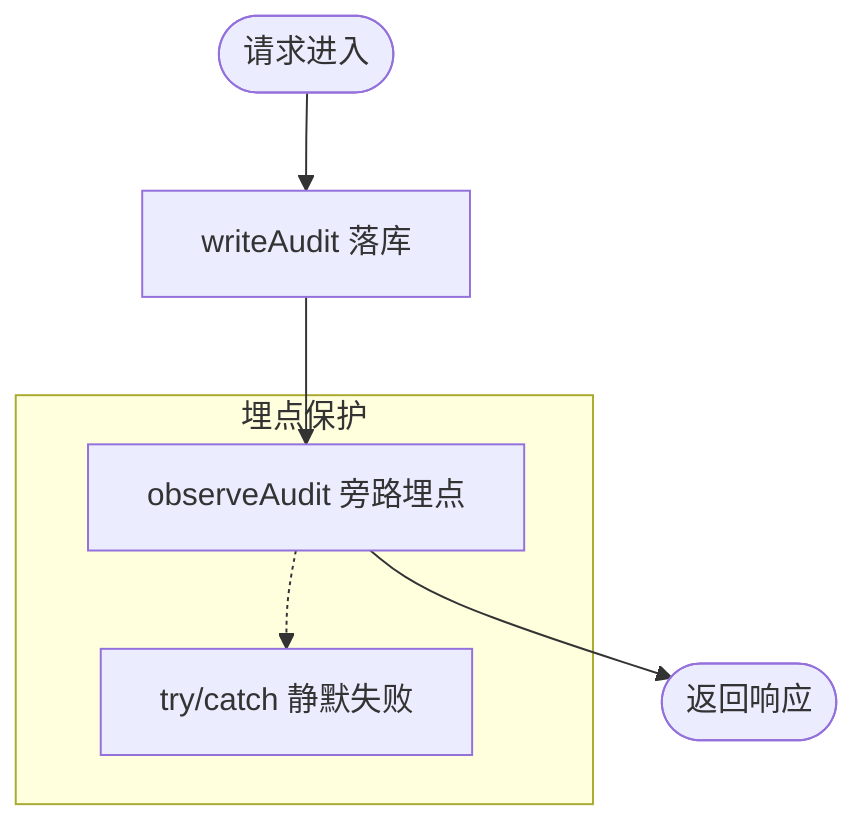
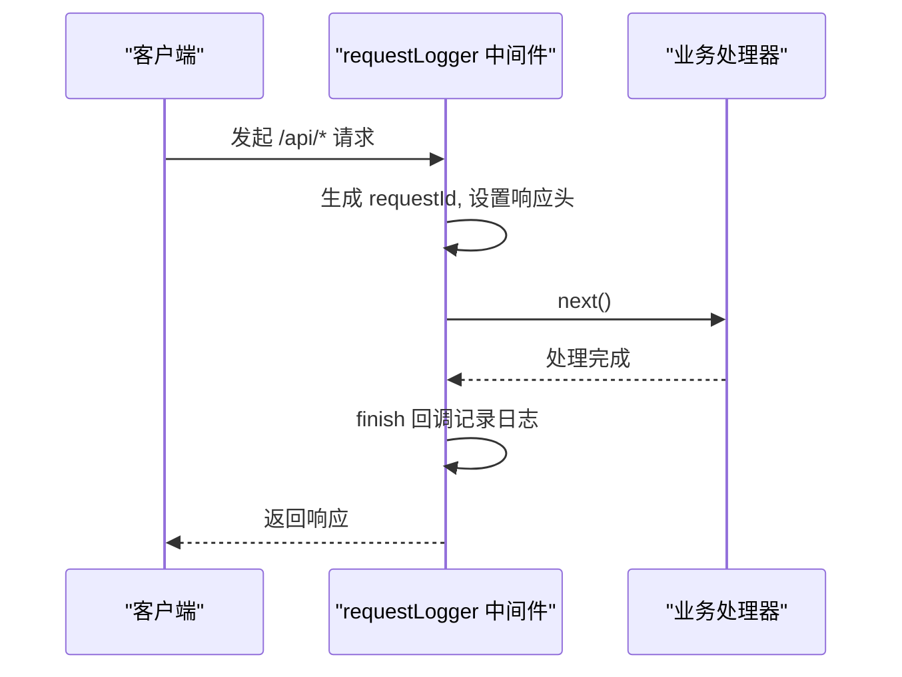
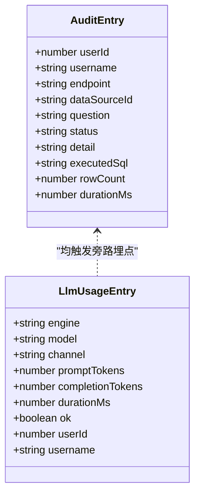
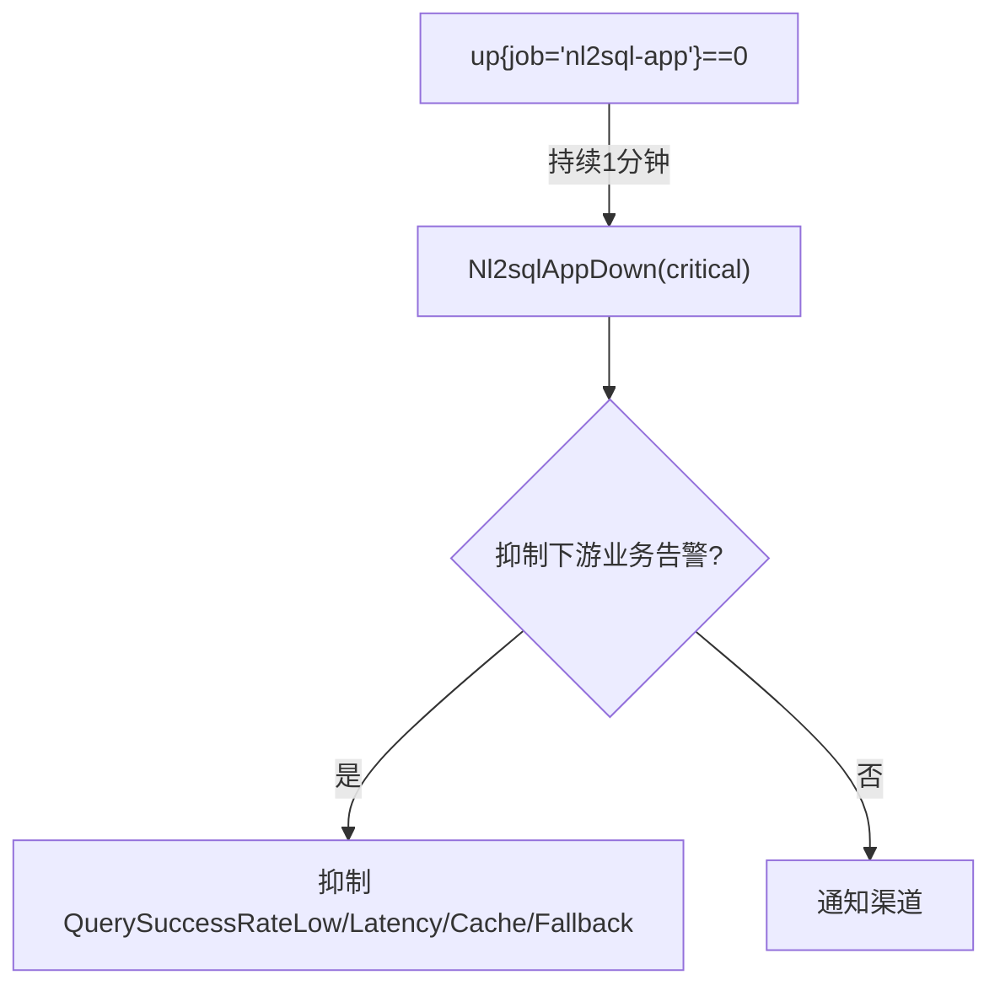
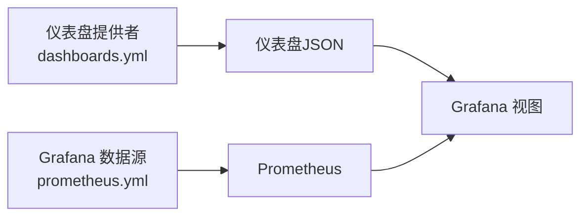
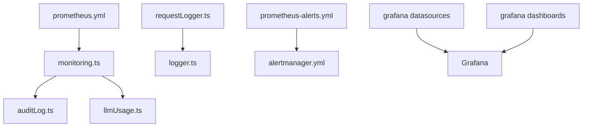

# 监控与运维

<cite>
**本文引用的文件**
- [server/infra/monitoring.ts](file://server/infra/monitoring.ts)
- [server/infra/logger.ts](file://server/infra/logger.ts)
- [server/infra/requestLogger.ts](file://server/infra/requestLogger.ts)
- [server/infra/auditLog.ts](file://server/infra/auditLog.ts)
- [server/llm/llmUsage.ts](file://server/llm/llmUsage.ts)
- [deploy/prometheus.yml](file://deploy/prometheus.yml)
- [deploy/prometheus-alerts.yml](file://deploy/prometheus-alerts.yml)
- [deploy/alertmanager.yml](file://deploy/alertmanager.yml)
- [deploy/alertmanager-entrypoint.sh](file://deploy/alertmanager-entrypoint.sh)
- [deploy/grafana/provisioning/datasources/prometheus.yml](file://deploy/grafana/provisioning/datasources/prometheus.yml)
- [deploy/grafana/provisioning/dashboards/dashboards.yml](file://deploy/grafana/provisioning/dashboards/dashboards.yml)
- [deploy/grafana/dashboards/nl2sql-overview.json](file://deploy/grafana/dashboards/nl2sql-overview.json)
- [deploy/grafana/dashboards/nl2sql-infra.json](file://deploy/grafana/dashboards/nl2sql-infra.json)
- [server/routes/opsMetrics.ts](file://server/routes/opsMetrics.ts)
</cite>

## 目录
1. [简介](#简介)
2. [项目结构](#项目结构)
3. [核心组件](#核心组件)
4. [架构总览](#架构总览)
5. [详细组件分析](#详细组件分析)
6. [依赖关系分析](#依赖关系分析)
7. [性能与容量规划](#性能与容量规划)
8. [故障排查指南](#故障排查指南)
9. [结论](#结论)
10. [附录：配置与脚本示例](#附录配置与脚本示例)

## 简介
本文件面向“智能问数据分析系统”的监控与运维，覆盖指标体系、结构化日志、Prometheus/Grafana 集成、健康检查与服务发现、负载均衡、告警策略、容量规划、性能调优与故障排查等主题。文档基于仓库中实际代码与部署配置进行说明，确保可落地执行。

## 项目结构
监控与运维相关的关键位置如下：
- 应用侧埋点与指标导出：server/infra/monitoring.ts（Prometheus 指标定义与 /metrics 端点）
- 结构化日志与请求追踪：server/infra/logger.ts、server/infra/requestLogger.ts
- 审计与用量落库：server/infra/auditLog.ts、server/llm/llmUsage.ts
- Prometheus 抓取与告警：deploy/prometheus.yml、deploy/prometheus-alerts.yml、deploy/alertmanager.yml
- Grafana 数据源与仪表盘：deploy/grafana/provisioning/*、deploy/grafana/dashboards/*.json
- 运维指标聚合 API：server/routes/opsMetrics.ts

图表来源
- [server/infra/monitoring.ts:16-153](file://server/infra/monitoring.ts#L16-L153)
- [deploy/prometheus.yml:1-57](file://deploy/prometheus.yml#L1-L57)
- [deploy/grafana/provisioning/datasources/prometheus.yml:1-11](file://deploy/grafana/provisioning/datasources/prometheus.yml#L1-L11)
- [deploy/grafana/dashboards/nl2sql-overview.json:1-192](file://deploy/grafana/dashboards/nl2sql-overview.json#L1-L192)

章节来源
- [server/infra/monitoring.ts:16-153](file://server/infra/monitoring.ts#L16-L153)
- [deploy/prometheus.yml:1-57](file://deploy/prometheus.yml#L1-L57)
- [deploy/grafana/provisioning/datasources/prometheus.yml:1-11](file://deploy/grafana/provisioning/datasources/prometheus.yml#L1-L11)
- [deploy/grafana/dashboards/nl2sql-overview.json:1-192](file://deploy/grafana/dashboards/nl2sql-overview.json#L1-L192)

## 核心组件
- 指标采集与导出
  - 统一注册表与默认指标：process、eventloop、GC 等由 prom-client 自动采集并注册到 metricsRegister。
  - 业务指标：nl2sql_requests_total、nl2sql_duration_seconds、nl2sql_cache_hits_total、llm_call_duration_seconds、llm_tokens_total、sql_execute_duration_seconds、http_request_duration_seconds。
  - 旁路埋点函数：observeAudit、observeCacheHit、observeExplainGuard、observeLlmUsage、observeSqlExec，全部 fail-open，不阻塞主链路。
  - /metrics 端点：支持可选 METRICS_TOKEN 鉴权，返回 metricsRegister.metrics()。
- 结构化日志
  - 统一 logger：通过 LOG_LEVEL 控制级别；test 环境仅输出 error；底层 console 零依赖，便于未来替换为 pino 等。
  - 请求级日志：requestLogger 为每个 /api 请求生成 requestId，写入 X-Request-Id 响应头，finish 时记录方法、路径、状态码、耗时与用户信息。
- 审计与用量
  - writeAudit：将十态终态（SUCCESS/CACHE/FALLBACK/ERROR/CLARIFY/REFUSED/QUEUED/DENIED_*）落库 query_audit_log，同时触发 observeAudit 旁路埋点。
  - recordLlmUsage：异步记录 llm_usage（engine/model/channel/token/耗时/ok），同时触发 observeLlmUsage 旁路埋点。
- 运维指标聚合 API
  - /api/ops/metrics：从 audit/feedback/trace 聚合北极星指标与日/周趋势，供管理面板使用。

章节来源
- [server/infra/monitoring.ts:16-153](file://server/infra/monitoring.ts#L16-L153)
- [server/infra/logger.ts:1-41](file://server/infra/logger.ts#L1-L41)
- [server/infra/requestLogger.ts:1-36](file://server/infra/requestLogger.ts#L1-L36)
- [server/infra/auditLog.ts:1-62](file://server/infra/auditLog.ts#L1-L62)
- [server/llm/llmUsage.ts:1-134](file://server/llm/llmUsage.ts#L1-L134)
- [server/routes/opsMetrics.ts:1-327](file://server/routes/opsMetrics.ts#L1-L327)

## 架构总览
监控栈采用“应用侧埋点 + Prometheus 抓取 + Alertmanager 告警 + Grafana 可视化”的标准模式。应用通过 prom-client 暴露 /metrics；Prometheus 按 job 抓取 nl2sql-app、node-exporter、redis-exporter、mysql-exporter、alertmanager；Alertmanager 根据规则进行分组与抑制；Grafana 通过 provision 自动加载数据源与仪表盘。

图表来源
- [server/infra/monitoring.ts:92-153](file://server/infra/monitoring.ts#L92-L153)
- [deploy/prometheus.yml:1-57](file://deploy/prometheus.yml#L1-L57)
- [deploy/prometheus-alerts.yml:1-144](file://deploy/prometheus-alerts.yml#L1-L144)
- [deploy/alertmanager.yml:1-43](file://deploy/alertmanager.yml#L1-L43)
- [deploy/grafana/provisioning/datasources/prometheus.yml:1-11](file://deploy/grafana/provisioning/datasources/prometheus.yml#L1-L11)

## 详细组件分析

### 指标体系与埋点设计
- 设计原则
  - 单点接入：审计、LLM 用量、SQL 执行、HTTP 接口等关键路径旁路打点，避免侵入热路径。
  - 基数红线：question/userId/dataSourceId 不作为 label，仅使用低基数枚举（status/endpoint/channel/model/result）。
  - Fail-open：所有埋点 try/catch 静默失败，绝不阻塞业务。
- 指标清单
  - 问数业务：nl2sql_requests_total（计数）、nl2sql_duration_seconds（直方图）、nl2sql_cache_hits_total（分层命中）。
  - LLM：llm_call_duration_seconds（按 channel/engine/model/ok）、llm_tokens_total（prompt/completion）。
  - SQL 执行：sql_execute_duration_seconds（ok/error）、sql_explain_guard_total（passed/blocked/error）。
  - HTTP：http_request_duration_seconds（method/route/status）。
- 导出端点
  - /metrics：可选 METRICS_TOKEN 鉴权；返回 prom-client Registry 的 metrics。

图表来源
- [server/infra/auditLog.ts:38-62](file://server/infra/auditLog.ts#L38-L62)
- [server/infra/monitoring.ts:92-107](file://server/infra/monitoring.ts#L92-L107)

章节来源
- [server/infra/monitoring.ts:16-153](file://server/infra/monitoring.ts#L16-L153)
- [server/infra/auditLog.ts:1-62](file://server/infra/auditLog.ts#L1-L62)

### 结构化日志与请求追踪
- 日志级别
  - 通过 LOG_LEVEL 控制 debug/info/warn/error；test 环境仅 error。
- 请求级追踪
  - requestLogger 为每个 /api 请求生成 requestId，写入响应头 X-Request-Id，finish 时记录方法、URL、状态码、耗时与用户。
- 扩展性
  - 当前基于 console，后续可无缝替换为 pino 等结构化日志设施。

图表来源
- [server/infra/requestLogger.ts:19-35](file://server/infra/requestLogger.ts#L19-L35)
- [server/infra/logger.ts:12-41](file://server/infra/logger.ts#L12-L41)

章节来源
- [server/infra/logger.ts:1-41](file://server/infra/logger.ts#L1-L41)
- [server/infra/requestLogger.ts:1-36](file://server/infra/requestLogger.ts#L1-L36)

### 审计与用量落库
- 审计日志
  - 十态终态落库 query_audit_log，包含 endpoint、status、executed_sql、row_count、duration_ms 等。
  - 写入失败仅告警不阻塞主流程。
- LLM 用量
  - 异步记录 llm_usage，包含 engine/model/channel/token/耗时/ok，用于成本对比与模型选择。
  - 写入失败仅记日志，不影响主链路。

图表来源
- [server/infra/auditLog.ts:10-62](file://server/infra/auditLog.ts#L10-L62)
- [server/llm/llmUsage.ts:12-50](file://server/llm/llmUsage.ts#L12-L50)

章节来源
- [server/infra/auditLog.ts:1-62](file://server/infra/auditLog.ts#L1-L62)
- [server/llm/llmUsage.ts:1-134](file://server/llm/llmUsage.ts#L1-L134)

### Prometheus 抓取与告警
- 抓取目标
  - nl2sql-app：应用 /metrics
  - node：node-exporter 采集宿主机资源
  - redis：redis-exporter 采集缓存层
  - mysql：mysql-exporter 采集数据库
  - alertmanager：自监控 up 指标
- 告警规则
  - 可用性：Nl2sqlAppDown、MySQLDown、RedisDown
  - 业务：QuerySuccessRateLow、QueryLatencyP95High、CacheHitRateLow、FallbackRateHigh
  - 资源：AppMemoryHigh、DiskSpaceLow
  - 监控自监控：PrometheusCardinalityHigh、PrometheusRuleEvalFailures、ScrapeDurationSlow、AlertmanagerDown
- 告警抑制
  - 当 Nl2sqlAppDown 发生时，抑制其下游 QuerySuccessRateLow/QueryLatencyP95High/CacheHitRateLow/FallbackRateHigh，避免告警风暴。

图表来源
- [deploy/prometheus-alerts.yml:6-144](file://deploy/prometheus-alerts.yml#L6-L144)
- [deploy/alertmanager.yml:16-43](file://deploy/alertmanager.yml#L16-L43)

章节来源
- [deploy/prometheus.yml:1-57](file://deploy/prometheus.yml#L1-L57)
- [deploy/prometheus-alerts.yml:1-144](file://deploy/prometheus-alerts.yml#L1-L144)
- [deploy/alertmanager.yml:1-43](file://deploy/alertmanager.yml#L1-L43)

### Grafana 仪表板与数据源
- 数据源自动配置
  - 通过 provisioning/datasources/prometheus.yml 自动添加名为 Prometheus 的数据源，指向 http://prometheus:9090。
- 仪表盘自动加载
  - dashboards.yml 声明 file provider，扫描 /var/lib/grafana/dashboards 下的 JSON 文件，自动入库。
- 内置仪表盘
  - nl2sql-overview.json：北极星指标（成功率、缓存命中率、端到端 P95、请求速率、状态分布、LLM 时延、缓存分层、SQL vs LLM 时延对比）。
  - nl2sql-infra.json：基础设施（up、内存、事件循环 Lag、MySQL QPS/慢查询、Redis 内存/键/命中率、CPU/磁盘）。

图表来源
- [deploy/grafana/provisioning/datasources/prometheus.yml:1-11](file://deploy/grafana/provisioning/datasources/prometheus.yml#L1-L11)
- [deploy/grafana/provisioning/dashboards/dashboards.yml:1-14](file://deploy/grafana/provisioning/dashboards/dashboards.yml#L1-L14)
- [deploy/grafana/dashboards/nl2sql-overview.json:1-192](file://deploy/grafana/dashboards/nl2sql-overview.json#L1-L192)
- [deploy/grafana/dashboards/nl2sql-infra.json:1-127](file://deploy/grafana/dashboards/nl2sql-infra.json#L1-L127)

章节来源
- [deploy/grafana/provisioning/datasources/prometheus.yml:1-11](file://deploy/grafana/provisioning/datasources/prometheus.yml#L1-L11)
- [deploy/grafana/provisioning/dashboards/dashboards.yml:1-14](file://deploy/grafana/provisioning/dashboards/dashboards.yml#L1-L14)
- [deploy/grafana/dashboards/nl2sql-overview.json:1-192](file://deploy/grafana/dashboards/nl2sql-overview.json#L1-L192)
- [deploy/grafana/dashboards/nl2sql-infra.json:1-127](file://deploy/grafana/dashboards/nl2sql-infra.json#L1-L127)

### 健康检查、服务发现与负载均衡
- 健康检查
  - 应用健康度通过 /metrics 可达性与 up 指标体现；AlertmanagerDown 作为监控栈自监控告警。
- 服务发现
  - 当前为静态 targets 配置；多实例部署时可在 prometheus.yml 中追加多个 app 实例地址，instance label 自动区分。
- 负载均衡
  - 多实例场景下，Prometheus 对多个 target 抓取，Grafana 通过 sum() 聚合口径不变；前端可通过反向代理或网关实现流量分发（如 nginx.multi-instance.conf）。

章节来源
- [deploy/prometheus.yml:17-57](file://deploy/prometheus.yml#L17-L57)
- [deploy/prometheus-alerts.yml:106-144](file://deploy/prometheus-alerts.yml#L106-L144)

## 依赖关系分析
- 组件耦合
  - monitoring.ts 被 auditLog.ts、llmUsage.ts 调用，形成“业务落库 + 旁路埋点”的解耦模式。
  - requestLogger.ts 与 logger.ts 组合提供请求级结构化日志。
  - Prometheus 抓取依赖各 exporter 与应用的 /metrics 端点。
  - Alertmanager 依赖 prometheus-alerts.yml 与 webhook/email 配置。
  - Grafana 依赖 provisioning 配置与 dashboard JSON。
- 外部依赖
  - prom-client：指标注册与默认指标采集。
  - MySQL/Redis：审计、用量、缓存与业务数据。
  - node-exporter/mysql-exporter/redis-exporter：基础设施与中间件指标。

图表来源
- [server/infra/monitoring.ts:92-153](file://server/infra/monitoring.ts#L92-L153)
- [server/infra/auditLog.ts:38-62](file://server/infra/auditLog.ts#L38-L62)
- [server/llm/llmUsage.ts:25-50](file://server/llm/llmUsage.ts#L25-L50)
- [server/infra/requestLogger.ts:19-35](file://server/infra/requestLogger.ts#L19-L35)
- [deploy/prometheus.yml:16-44](file://deploy/prometheus.yml#L16-L44)
- [deploy/prometheus-alerts.yml:1-144](file://deploy/prometheus-alerts.yml#L1-L144)
- [deploy/alertmanager.yml:1-43](file://deploy/alertmanager.yml#L1-L43)
- [deploy/grafana/provisioning/datasources/prometheus.yml:1-11](file://deploy/grafana/provisioning/datasources/prometheus.yml#L1-L11)
- [deploy/grafana/provisioning/dashboards/dashboards.yml:1-14](file://deploy/grafana/provisioning/dashboards/dashboards.yml#L1-L14)

章节来源
- [server/infra/monitoring.ts:92-153](file://server/infra/monitoring.ts#L92-L153)
- [server/infra/auditLog.ts:38-62](file://server/infra/auditLog.ts#L38-L62)
- [server/llm/llmUsage.ts:25-50](file://server/llm/llmUsage.ts#L25-L50)
- [server/infra/requestLogger.ts:19-35](file://server/infra/requestLogger.ts#L19-L35)
- [deploy/prometheus.yml:16-44](file://deploy/prometheus.yml#L16-L44)
- [deploy/prometheus-alerts.yml:1-144](file://deploy/prometheus-alerts.yml#L1-L144)
- [deploy/alertmanager.yml:1-43](file://deploy/alertmanager.yml#L1-L43)
- [deploy/grafana/provisioning/datasources/prometheus.yml:1-11](file://deploy/grafana/provisioning/datasources/prometheus.yml#L1-L11)
- [deploy/grafana/provisioning/dashboards/dashboards.yml:1-14](file://deploy/grafana/provisioning/dashboards/dashboards.yml#L1-L14)

## 性能与容量规划
- 指标基线与阈值
  - 端到端 P95 时延：超过 180s 持续 10 分钟触发 warning。
  - 缓存命中率：低于 15% 且有流量时提示失效联动/TTL 异常。
  - FALLBACK 率：超过 15% 持续 30 分钟触发 warning。
  - 应用内存：常驻内存超过 1.5GiB 持续 15 分钟触发 warning。
  - 磁盘使用率：超过 85% 持续 10 分钟触发 warning。
- 容量建议
  - 合理设置 scrape_interval 与 evaluation_interval（默认 15s）。
  - 关注 Prometheus 活跃序列数，避免高基数 label 导致膨胀。
  - 多实例部署时，确保 instance label 区分，Grafana 使用 sum() 聚合。
- 性能调优
  - 优先优化 LLM 调用时延与 SQL 执行时延（对比两曲线定位瓶颈）。
  - 提升缓存命中率（L1 精确匹配与 L2 语义匹配），关注 invalidateQueryCache 与 TTL 配置。
  - 关注 Node 事件循环 Lag，避免长任务阻塞。

章节来源
- [deploy/prometheus-alerts.yml:35-105](file://deploy/prometheus-alerts.yml#L35-L105)
- [deploy/grafana/dashboards/nl2sql-overview.json:65-189](file://deploy/grafana/dashboards/nl2sql-overview.json#L65-L189)
- [deploy/grafana/dashboards/nl2sql-infra.json:25-124](file://deploy/grafana/dashboards/nl2sql-infra.json#L25-L124)

## 故障排查指南
- 常见问题定位
  - 应用不可达：检查 up{job="nl2sql-app"} 与 ScrapeDurationSlow。
  - 成功率下降：结合 QuerySuccessRateLow 与状态分布面板，查看 LLM 与 SQL 时延。
  - 缓存命中率低：检查 CacheHitRateLow，确认数据源变更后是否触发失效联动与 TTL。
  - 降级率高：关注 FallbackRateHigh，检查 LLM 输出质量与 schema 同步。
  - 资源告警：AppMemoryHigh、DiskSpaceLow、AlertmanagerDown。
- 排查步骤
  - 通过 Grafana 仪表盘快速定位问题阶段（LLM vs SQL）。
  - 使用审计日志与 trace 数据（opsMetrics API）回溯具体请求。
  - 检查 Prometheus 规则求值失败与抓取耗时，排除监控栈自身问题。
  - 利用 requestId 关联前后端日志，快速定位错误链路。

章节来源
- [deploy/prometheus-alerts.yml:6-144](file://deploy/prometheus-alerts.yml#L6-L144)
- [server/routes/opsMetrics.ts:257-324](file://server/routes/opsMetrics.ts#L257-L324)
- [server/infra/requestLogger.ts:19-35](file://server/infra/requestLogger.ts#L19-L35)

## 结论
本系统构建了以 prom-client 为核心的指标埋点体系，配合 Prometheus 抓取、Alertmanager 告警与 Grafana 可视化，形成了完整的可观测性闭环。通过严格的基数控制、fail-open 设计与告警抑制策略，既保证了业务稳定性，又提供了丰富的诊断能力。建议在多实例与高并发场景下持续关注缓存命中率、LLM 与 SQL 时延占比以及资源水位，持续优化性能与容量。

## 附录：配置与脚本示例
- Prometheus 抓取配置
  - 参考 deploy/prometheus.yml，配置 nl2sql-app、node、redis、mysql、alertmanager 等 job。
- 告警规则
  - 参考 deploy/prometheus-alerts.yml，按需调整阈值与持续时间。
- Alertmanager 通知
  - 参考 deploy/alertmanager.yml 与 deploy/alertmanager-entrypoint.sh，配置 Webhook 或邮件。
- Grafana 数据源与仪表盘
  - 参考 deploy/grafana/provisioning/datasources/prometheus.yml 与 dashboards.yml，自动加载数据源与仪表盘。
  - 仪表盘 JSON 位于 deploy/grafana/dashboards/*.json，可直接编辑或扩展。

章节来源
- [deploy/prometheus.yml:1-57](file://deploy/prometheus.yml#L1-L57)
- [deploy/prometheus-alerts.yml:1-144](file://deploy/prometheus-alerts.yml#L1-L144)
- [deploy/alertmanager.yml:1-43](file://deploy/alertmanager.yml#L1-L43)
- [deploy/alertmanager-entrypoint.sh:1-13](file://deploy/alertmanager-entrypoint.sh#L1-L13)
- [deploy/grafana/provisioning/datasources/prometheus.yml:1-11](file://deploy/grafana/provisioning/datasources/prometheus.yml#L1-L11)
- [deploy/grafana/provisioning/dashboards/dashboards.yml:1-14](file://deploy/grafana/provisioning/dashboards/dashboards.yml#L1-L14)
- [deploy/grafana/dashboards/nl2sql-overview.json:1-192](file://deploy/grafana/dashboards/nl2sql-overview.json#L1-L192)
- [deploy/grafana/dashboards/nl2sql-infra.json:1-127](file://deploy/grafana/dashboards/nl2sql-infra.json#L1-L127)