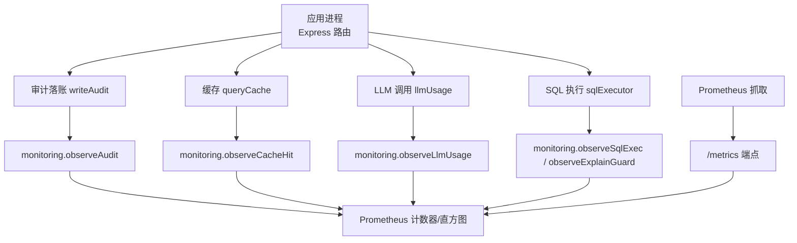
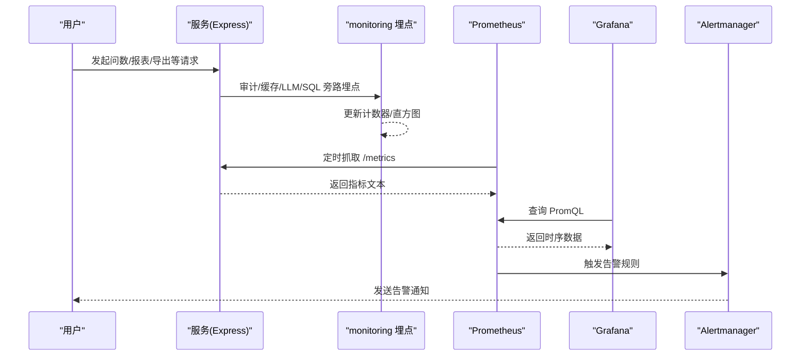
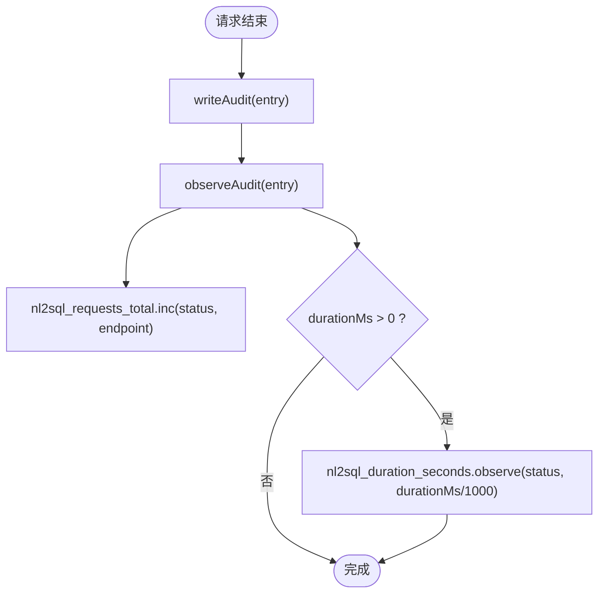
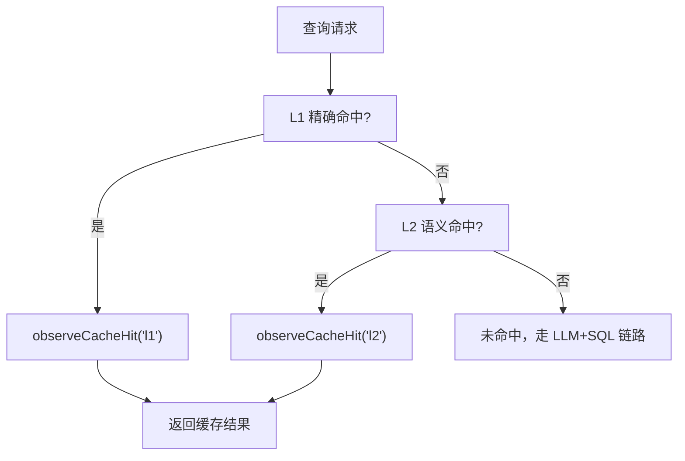
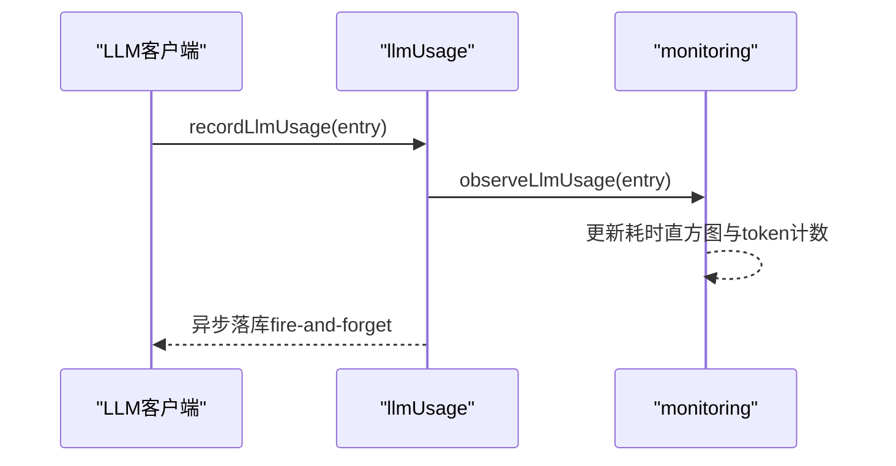
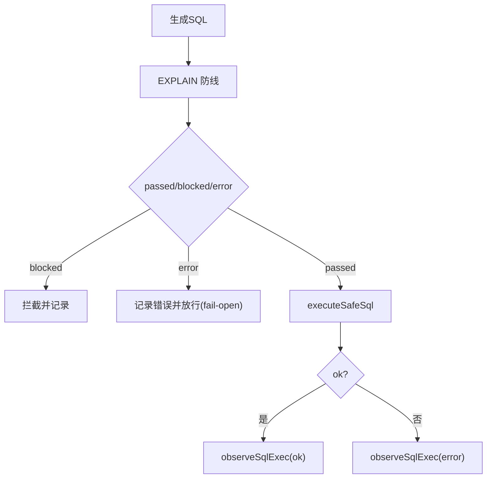
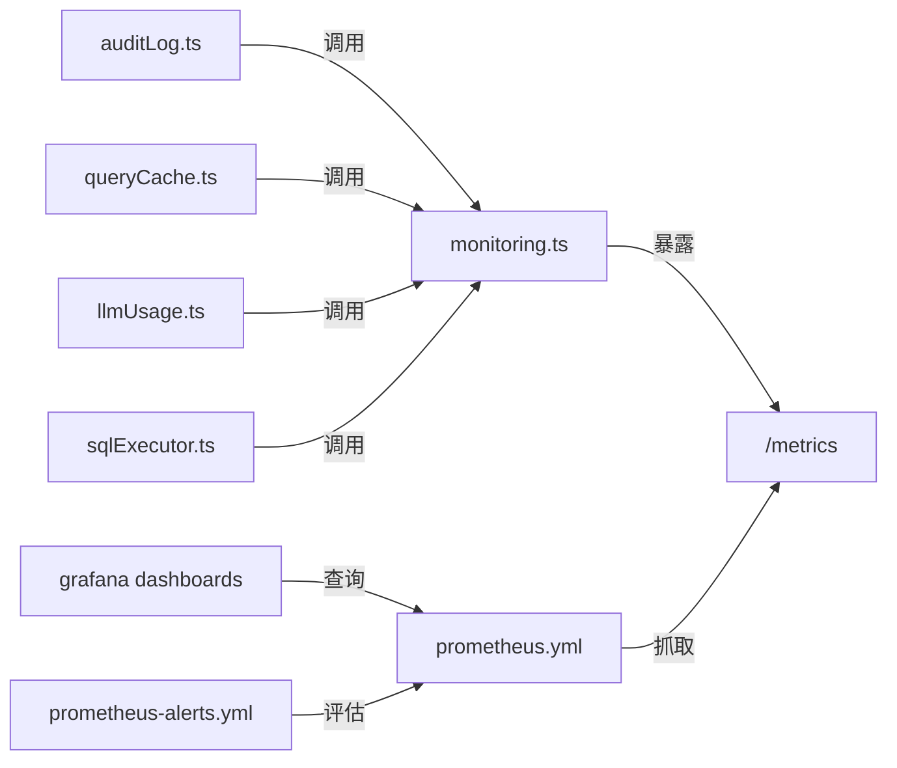

# 监控指标体系

<cite>
**本文引用的文件**
- [server/infra/monitoring.ts](file://server/infra/monitoring.ts)
- [server/infra/auditLog.ts](file://server/infra/auditLog.ts)
- [server/query/sqlExecutor.ts](file://server/query/sqlExecutor.ts)
- [server/query/queryCache.ts](file://server/query/queryCache.ts)
- [server/llm/llmUsage.ts](file://server/llm/llmUsage.ts)
- [deploy/prometheus.yml](file://deploy/prometheus.yml)
- [deploy/prometheus-alerts.yml](file://deploy/prometheus-alerts.yml)
- [deploy/grafana/dashboards/nl2sql-overview.json](file://deploy/grafana/dashboards/nl2sql-overview.json)
- [deploy/grafana/dashboards/nl2sql-business.json](file://deploy/grafana/dashboards/nl2sql-business.json)
- [deploy/grafana/dashboards/nl2sql-llm.json](file://deploy/grafana/dashboards/nl2sql-llm.json)
</cite>

## 目录
1. [引言](#引言)
2. [项目结构](#项目结构)
3. [核心组件](#核心组件)
4. [架构总览](#架构总览)
5. [详细组件分析](#详细组件分析)
6. [依赖关系分析](#依赖关系分析)
7. [性能考量](#性能考量)
8. [故障排查指南](#故障排查指南)
9. [结论](#结论)
10. [附录：指标字典、查询与告警](#附录指标字典查询与告警)

## 引言
本文件面向“智能问数据分析系统”的监控指标体系，聚焦 Prometheus 指标设计、采集机制、Grafana 仪表板与告警配置。内容覆盖 NL2SQL 请求指标、缓存命中率、LLM 调用指标、SQL 执行指标、HTTP 接口指标等核心业务指标；解释命名规范、标签低基数原则、分桶策略；说明旁路埋点、fail-open 容错与性能影响控制；并提供查询示例、告警阈值与基线参考，以及 Grafana 仪表板与自定义扩展指南。

## 项目结构
监控相关代码集中在 server/infra/monitoring.ts，业务侧通过审计落账、缓存命中、LLM 用量、SQL 执行等旁路函数打点；Prometheus 抓取由 deploy/prometheus.yml 配置；告警规则在 deploy/prometheus-alerts.yml；Grafana 仪表板位于 deploy/grafana/dashboards。

图表来源
- [server/infra/monitoring.ts:19-153](file://server/infra/monitoring.ts#L19-L153)
- [server/infra/auditLog.ts:38-61](file://server/infra/auditLog.ts#L38-L61)
- [server/query/queryCache.ts:43-62](file://server/query/queryCache.ts#L43-L62)
- [server/llm/llmUsage.ts:25-50](file://server/llm/llmUsage.ts#L25-L50)
- [server/query/sqlExecutor.ts:15-17](file://server/query/sqlExecutor.ts#L15-L17)
- [deploy/prometheus.yml:16-24](file://deploy/prometheus.yml#L16-L24)

章节来源
- [server/infra/monitoring.ts:1-153](file://server/infra/monitoring.ts#L1-L153)
- [deploy/prometheus.yml:1-57](file://deploy/prometheus.yml#L1-L57)

## 核心组件
- 指标注册与暴露：统一使用 prom-client Registry，提供 /metrics 端点（可选 METRICS_TOKEN 鉴权）。
- 业务指标埋点：
  - NL2SQL 请求计数与端到端耗时（按 status、endpoint 标签）
  - 缓存命中计数（按 layer=l1/l2）
  - LLM 调用耗时与 token 消耗（channel/engine/model/ok）
  - SQL 执行耗时（result=ok/error）与 EXPLAIN 防线统计（outcome/dialect）
  - HTTP 接口耗时（method/route/status）
- 旁路埋点函数：observeAudit、observeCacheHit、observeLlmUsage、observeSqlExec、observeExplainGuard，全部 try/catch 静默失败，确保 fail-open。

章节来源
- [server/infra/monitoring.ts:16-153](file://server/infra/monitoring.ts#L16-L153)

## 架构总览
监控数据采集路径：
- 业务链路在关键节点调用旁路埋点函数，写入 prom-client 计数器/直方图。
- Prometheus 每 15s 抓取一次 /metrics。
- Grafana 基于 PromQL 构建仪表盘，展示成功率、时延分位、缓存命中率、LLM 性能等。
- Alertmanager 根据 prometheus-alerts.yml 评估告警并通知。

图表来源
- [server/infra/monitoring.ts:92-153](file://server/infra/monitoring.ts#L92-L153)
- [deploy/prometheus.yml:1-24](file://deploy/prometheus.yml#L1-L24)
- [deploy/prometheus-alerts.yml:1-144](file://deploy/prometheus-alerts.yml#L1-L144)

## 详细组件分析

### NL2SQL 请求指标（审计旁路）
- 指标
  - nl2sql_requests_total：按 status、endpoint 计数，覆盖 SUCCESS/CACHE/FALLBACK/ERROR/CLARIFY/REFUSED/DENIED_* 等终态。
  - nl2sql_duration_seconds：端到端耗时直方图，按 status 分桶，覆盖 ms 级到分钟级。
- 埋点位置：writeAudit 调用 observeAudit，统一出口，避免分散埋点导致口径不一致。
- 标签设计：status、endpoint 为低基数枚举；question/userId 不进入 label，防止高基数。
- 分桶策略：[0.01, 0.1, 1, 5, 10, 30, 60, 120, 300, 600]，对齐性能基线（SUCCESS avg 约 249s）。

图表来源
- [server/infra/auditLog.ts:38-61](file://server/infra/auditLog.ts#L38-L61)
- [server/infra/monitoring.ts:92-100](file://server/infra/monitoring.ts#L92-L100)

章节来源
- [server/infra/auditLog.ts:1-62](file://server/infra/auditLog.ts#L1-L62)
- [server/infra/monitoring.ts:19-35](file://server/infra/monitoring.ts#L19-L35)

### 缓存命中率（L1 精确 / L2 语义）
- 指标：nl2sql_cache_hits_total，按 layer=l1/l2 计数。
- 埋点位置：queryCache 中 getCachedQuery 命中时调用 observeCacheHit('l1'/'l2')。
- 设计要点：L1 为归一化精确匹配；L2 为 embedding 相似度命中（阈值可配置），两者均计入对应层命中。
- 失效联动：数据源变更时调用 invalidateQueryCache 清理缓存与语义索引，保证一致性。

图表来源
- [server/query/queryCache.ts:43-62](file://server/query/queryCache.ts#L43-L62)
- [server/query/queryCache.ts:86-114](file://server/query/queryCache.ts#L86-L114)
- [server/infra/monitoring.ts:102-107](file://server/infra/monitoring.ts#L102-L107)

章节来源
- [server/query/queryCache.ts:1-200](file://server/query/queryCache.ts#L1-L200)
- [server/infra/monitoring.ts:37-44](file://server/infra/monitoring.ts#L37-L44)

### LLM 调用指标（耗时与 Token）
- 指标
  - llm_call_duration_seconds：按 channel/engine/model/ok 记录耗时直方图。
  - llm_tokens_total：按 channel/model/type(prompt/completion) 累计 token。
- 埋点位置：llmUsage.recordLlmUsage 调用 observeLlmUsage，异步落库，失败不影响主链路。
- 用途：观测模型路由效果、失败率、token 成本与吞吐。

图表来源
- [server/llm/llmUsage.ts:25-50](file://server/llm/llmUsage.ts#L25-L50)
- [server/infra/monitoring.ts:116-126](file://server/infra/monitoring.ts#L116-L126)

章节来源
- [server/llm/llmUsage.ts:1-134](file://server/llm/llmUsage.ts#L1-L134)
- [server/infra/monitoring.ts:46-61](file://server/infra/monitoring.ts#L46-L61)

### SQL 执行指标（安全执行与 EXPLAIN 防线）
- 指标
  - sql_execute_duration_seconds：按 result=ok/error 记录执行耗时。
  - sql_explain_guard_total：EXPLAIN 防线 outcome=passed/blocked/error，按 dialect 区分。
- 埋点位置：sqlExecutor.executeSafeSql 包装调用 observeSqlExec；EXPLAIN 阶段调用 observeExplainGuard。
- 安全约束：SELECT-only、表白名单、敏感列剔除、强制 LIMIT、超时保护。

图表来源
- [server/query/sqlExecutor.ts:15-17](file://server/query/sqlExecutor.ts#L15-L17)
- [server/infra/monitoring.ts:63-78](file://server/infra/monitoring.ts#L63-L78)
- [server/infra/monitoring.ts:128-133](file://server/infra/monitoring.ts#L128-L133)

章节来源
- [server/query/sqlExecutor.ts:1-200](file://server/query/sqlExecutor.ts#L1-L200)
- [server/infra/monitoring.ts:63-78](file://server/infra/monitoring.ts#L63-L78)

### HTTP 接口指标
- 指标：http_request_duration_seconds，按 method/route/status 记录耗时。
- 范围：仅 /api/* 接口，避免静态资源高基数。
- 目的：定位慢接口、异常状态码分布。

章节来源
- [server/infra/monitoring.ts:80-88](file://server/infra/monitoring.ts#L80-L88)

## 依赖关系分析
- monitoring.ts 依赖 prom-client，提供指标注册与暴露；被 auditLog、queryCache、llmUsage、sqlExecutor 等模块调用。
- auditLog.ts 将业务终态统一写库并触发 observeAudit。
- queryCache.ts 在 L1/L2 命中时触发 observeCacheHit。
- llmUsage.ts 在每次 LLM 调用后触发 observeLlmUsage。
- sqlExecutor.ts 在执行前后触发 observeSqlExec 与 observeExplainGuard。
- Prometheus 抓取 /metrics，Grafana 消费时序数据，Alertmanager 评估告警。

图表来源
- [server/infra/monitoring.ts:16-153](file://server/infra/monitoring.ts#L16-L153)
- [deploy/prometheus.yml:16-24](file://deploy/prometheus.yml#L16-L24)
- [deploy/prometheus-alerts.yml:1-144](file://deploy/prometheus-alerts.yml#L1-L144)

章节来源
- [server/infra/monitoring.ts:1-153](file://server/infra/monitoring.ts#L1-L153)
- [deploy/prometheus.yml:1-57](file://deploy/prometheus.yml#L1-L57)
- [deploy/prometheus-alerts.yml:1-144](file://deploy/prometheus-alerts.yml#L1-L144)

## 性能考量
- 旁路埋点：所有埋点函数包裹 try/catch，失败静默，绝不影响业务热路径。
- 低基数标签：禁止 question/userId 等高基数字段进入 label，仅使用 status/endpoint/channel/model 等枚举。
- 分桶策略：针对端到端耗时与 LLM 调用耗时设置合理 buckets，覆盖毫秒到分钟级，减少 cardinality。
- 抓取频率：Prometheus 抓取间隔 15s，平衡实时性与开销。
- 连接池与超时：SQL 执行场景分级配额与超时，避免大任务阻塞交互链路。

章节来源
- [server/infra/monitoring.ts:90-133](file://server/infra/monitoring.ts#L90-L133)
- [server/query/sqlExecutor.ts:44-109](file://server/query/sqlExecutor.ts#L44-L109)
- [deploy/prometheus.yml:1-6](file://deploy/prometheus.yml#L1-L6)

## 故障排查指南
- 应用不可达：Nl2sqlAppDown 告警（up{job="nl2sql-app"}==0）。
- MySQL 不可用：MySQLDown 告警（up{job="mysql"}==0）。
- Redis 不可用：RedisDown 告警（up{job="redis"}==0），应用回退内存缓存。
- 成功率下降：QuerySuccessRateLow（近 5 分钟成功率 < 85%）。
- 时延恶化：QueryLatencyP95High（P95 > 180s 持续 10 分钟）。
- 缓存命中率低：CacheHitRateLow（< 15% 且有流量）。
- 降级率高：FallbackRateHigh（> 15% 持续 30 分钟）。
- 资源问题：AppMemoryHigh、DiskSpaceLow。
- 监控栈自监控：PrometheusCardinalityHigh、ScrapeDurationSlow、AlertmanagerDown。

章节来源
- [deploy/prometheus-alerts.yml:6-144](file://deploy/prometheus-alerts.yml#L6-L144)

## 结论
本监控体系以旁路埋点为核心，严格遵循低基数与 fail-open 原则，覆盖 NL2SQL 请求、缓存、LLM、SQL 执行与 HTTP 接口等关键链路；配合 Prometheus 抓取、Grafana 可视化与 Alertmanager 告警，形成闭环观测能力。建议在生产环境中持续校准分桶与阈值，结合业务基线优化缓存命中率与端到端时延。

## 附录：指标字典、查询与告警

### 指标字典与标签设计
- nl2sql_requests_total：标签 status、endpoint；含义：审计落账请求总数。
- nl2sql_duration_seconds：标签 status；含义：端到端耗时（秒）。
- nl2sql_cache_hits_total：标签 layer（l1/l2）；含义：缓存命中次数。
- llm_call_duration_seconds：标签 channel、engine、model、ok；含义：LLM 调用耗时。
- llm_tokens_total：标签 channel、model、type；含义：token 消耗量。
- sql_execute_duration_seconds：标签 result（ok/error）；含义：SQL 执行耗时。
- sql_explain_guard_total：标签 outcome（passed/blocked/error）、dialect；含义：EXPLAIN 防线统计。
- http_request_duration_seconds：标签 method、route、status；含义：HTTP 接口耗时。

章节来源
- [server/infra/monitoring.ts:19-88](file://server/infra/monitoring.ts#L19-L88)

### 指标采集机制与容错
- 旁路埋点：writeAudit、getCachedHit、recordLlmUsage、executeSafeSql 包装调用对应 observe* 函数。
- fail-open：所有埋点 try/catch 静默失败，确保业务可用性。
- /metrics 端点：可选 METRICS_TOKEN 鉴权，默认无 JWT。

章节来源
- [server/infra/monitoring.ts:90-153](file://server/infra/monitoring.ts#L90-L153)
- [server/infra/auditLog.ts:38-61](file://server/infra/auditLog.ts#L38-L61)
- [server/query/queryCache.ts:43-62](file://server/query/queryCache.ts#L43-L62)
- [server/llm/llmUsage.ts:25-50](file://server/llm/llmUsage.ts#L25-L50)
- [server/query/sqlExecutor.ts:15-17](file://server/query/sqlExecutor.ts#L15-L17)

### 分桶策略配置
- nl2sql_duration_seconds：[0.01, 0.1, 1, 5, 10, 30, 60, 120, 300, 600]
- llm_call_duration_seconds：[0.5, 1, 2, 5, 10, 30, 60, 120, 300]
- sql_execute_duration_seconds：[0.05, 0.1, 0.5, 1, 2, 5, 10, 30]
- http_request_duration_seconds：[0.01, 0.05, 0.1, 0.5, 1, 2, 5, 10, 30]

章节来源
- [server/infra/monitoring.ts:28-88](file://server/infra/monitoring.ts#L28-L88)

### 指标查询示例（PromQL）
- 问数成功率（5m）：sum(rate(nl2sql_requests_total{status=~"SUCCESS|CACHE"}[5m])) / sum(rate(nl2sql_requests_total{endpoint="query"}[5m]))
- 缓存命中率（15m）：sum(rate(nl2sql_cache_hits_total[15m])) / sum(rate(nl2sql_requests_total{endpoint="query"}[15m]))
- 端到端 P95 时延（5m）：histogram_quantile(0.95, sum(rate(nl2sql_duration_seconds_bucket[5m])) by (le))
- LLM 调用成功率（15m）：sum(rate(llm_call_duration_seconds_count{ok="1"}[15m])) / sum(rate(llm_call_duration_seconds_count[15m]))
- SQL 执行 P95 时延（5m）：histogram_quantile(0.95, sum(rate(sql_execute_duration_seconds_bucket{result="ok"}[5m])) by (le))

章节来源
- [deploy/grafana/dashboards/nl2sql-overview.json:30-88](file://deploy/grafana/dashboards/nl2sql-overview.json#L30-L88)
- [deploy/grafana/dashboards/nl2sql-llm.json:25-83](file://deploy/grafana/dashboards/nl2sql-llm.json#L25-L83)

### 告警阈值与基线参考
- 成功率低于 85%（5m）：critical
- 端到端 P95 超过 180s（10m）：warning
- 缓存命中率低于 15%（1h，有流量）：warning
- FALLBACK 率超过 15%（30m）：warning
- 应用内存超过 1.5GiB（15m）：warning
- 磁盘使用率超过 85%（10m）：warning
- Prometheus 序列数超过 40 万（15m）：warning
- Scrape 耗时超过 10s（10m）：warning
- Alertmanager 不可达（2m）：critical

章节来源
- [deploy/prometheus-alerts.yml:6-144](file://deploy/prometheus-alerts.yml#L6-L144)

### Grafana 仪表板配置
- 总览仪表板：nl2sql-overview.json，包含成功率、缓存命中率、端到端 P95、请求速率、状态分布、LLM P95、缓存分层、SQL vs LLM 时延对比。
- 业务明细仪表板：nl2sql-business.json，包含今日总量、FALLBACK 率、澄清+拒答占比、DENIED 拦截、全终态趋势、时延分位、缓存命中趋势、DENIED 明细。
- LLM 性能仪表板：nl2sql-llm.json，包含成功率、调用速率、Token 吞吐、平均输出 token、分模型 P95/P50、模型路由分布、Token 消耗趋势、失败调用。

章节来源
- [deploy/grafana/dashboards/nl2sql-overview.json:1-192](file://deploy/grafana/dashboards/nl2sql-overview.json#L1-L192)
- [deploy/grafana/dashboards/nl2sql-business.json:1-141](file://deploy/grafana/dashboards/nl2sql-business.json#L1-L141)
- [deploy/grafana/dashboards/nl2sql-llm.json:1-135](file://deploy/grafana/dashboards/nl2sql-llm.json#L1-L135)

### 自定义指标扩展指南
- 新增指标步骤：
  - 在 monitoring.ts 中定义新的 Counter/Histogram，指定 name、help、labelNames、buckets、registers。
  - 在业务侧合适位置调用对应的 observe* 函数或自行 inc/observe。
  - 确保 label 为低基数枚举，避免引入 question/userId 等高基数字段。
  - 更新 Grafana 仪表板与告警规则以支持新指标。
- 注意事项：
  - 保持 fail-open，所有埋点 try/catch 静默失败。
  - 分桶需覆盖业务时延范围，避免过密或过疏。
  - 若新增 /metrics 端点逻辑，需考虑鉴权与性能影响。

章节来源
- [server/infra/monitoring.ts:16-153](file://server/infra/monitoring.ts#L16-L153)
- [deploy/prometheus-alerts.yml:1-144](file://deploy/prometheus-alerts.yml#L1-L144)