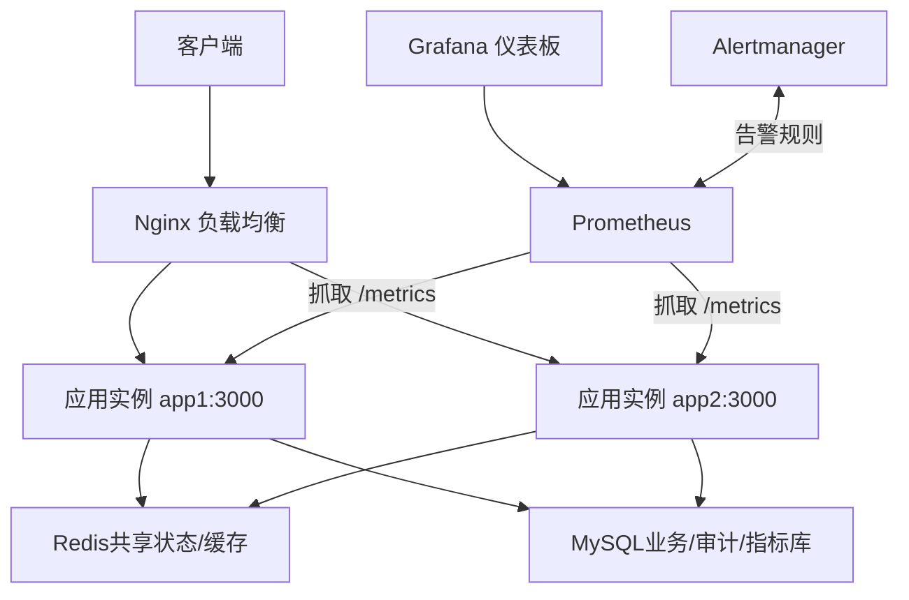
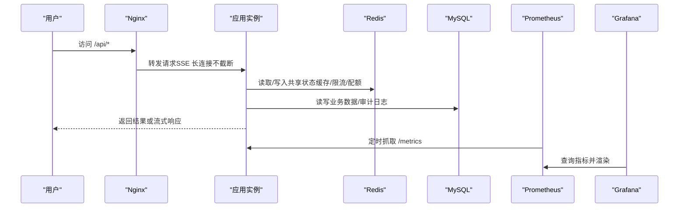
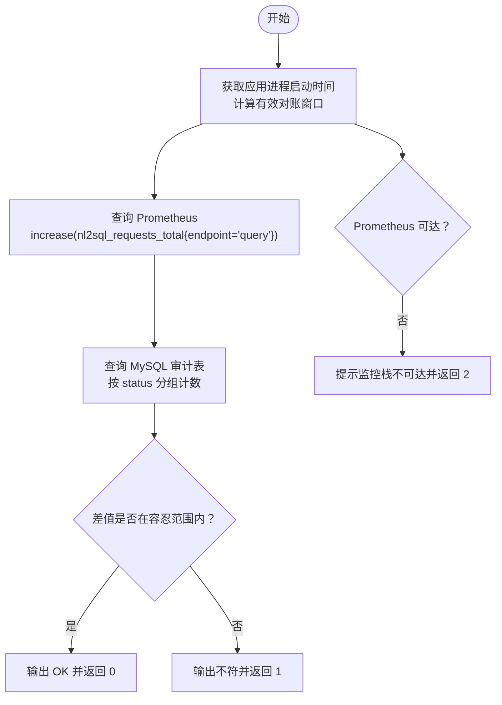
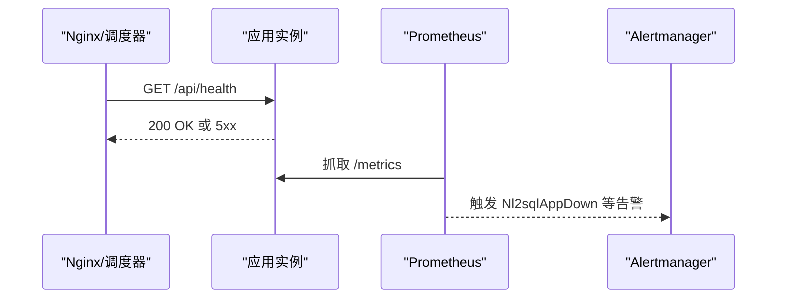
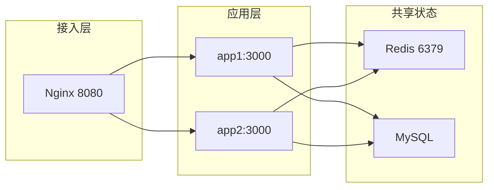
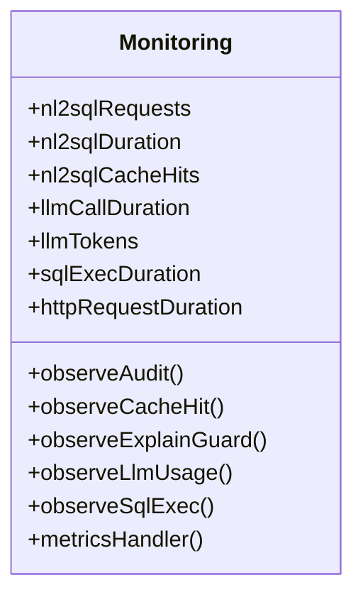
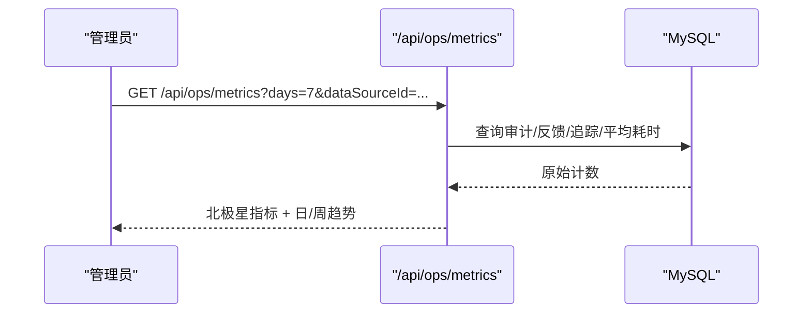
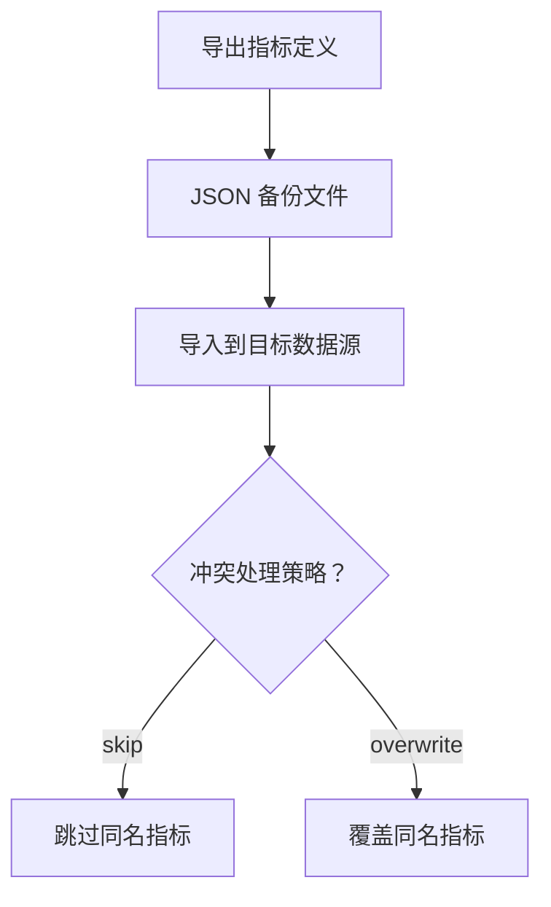
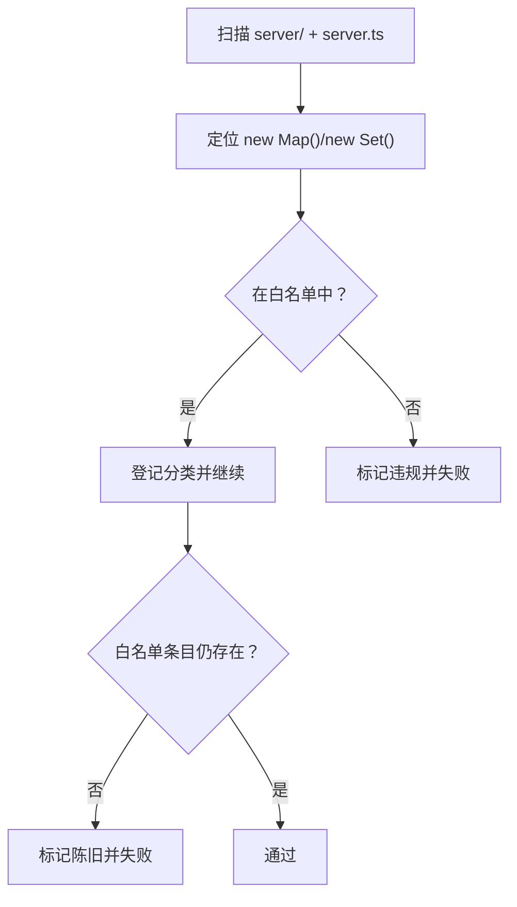
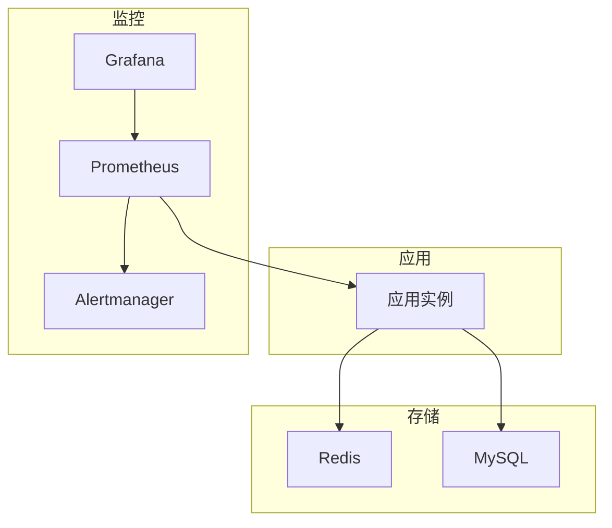

# 运维工具

<cite>
**本文引用的文件**
- [deploy/nginx.multi-instance.conf](file://deploy/nginx.multi-instance.conf)
- [docker-compose.multi-instance.yml](file://docker-compose.multi-instance.yml)
- [scripts/check-stateless.ts](file://scripts/check-stateless.ts)
- [scripts/reconcile-metrics.ts](file://scripts/reconcile-metrics.ts)
- [server/infra/monitoring.ts](file://server/infra/monitoring.ts)
- [server/routes/metrics.ts](file://server/routes/metrics.ts)
- [server/routes/opsMetrics.ts](file://server/routes/opsMetrics.ts)
- [deploy/prometheus.yml](file://deploy/prometheus.yml)
- [deploy/alertmanager.yml](file://deploy/alertmanager.yml)
- [deploy/prometheus-alerts.yml](file://deploy/prometheus-alerts.yml)
- [deploy/grafana/dashboards/nl2sql-overview.json](file://deploy/grafana/dashboards/nl2sql-overview.json)
- [docs/多实例部署指南.md](file://docs/多实例部署指南.md)
</cite>

## 目录
1. [简介](#简介)
2. [项目结构](#项目结构)
3. [核心组件](#核心组件)
4. [架构总览](#架构总览)
5. [详细组件分析](#详细组件分析)
6. [依赖关系分析](#依赖关系分析)
7. [性能与容量规划](#性能与容量规划)
8. [故障应急与排障指南](#故障应急与排障指南)
9. [结论](#结论)
10. [附录：日常维护清单与自动化脚本](#附录日常维护清单与自动化脚本)

## 简介
本文件面向“智能问数据分析系统”的运维人员，聚焦运维工具与能力：指标一致性检查、服务状态验证与健康检查、多实例部署（Nginx 负载均衡与会话保持策略）、容量规划（资源监控、瓶颈识别、扩缩容建议）、运维自动化（部署、配置管理、备份恢复），以及监控仪表板定制与报表生成。内容基于仓库内现有实现与配置进行说明，便于快速上手与落地。

## 项目结构
与运维相关的关键目录与文件：
- 部署编排与反向代理：deploy/nginx.multi-instance.conf、docker-compose.multi-instance.yml
- 监控与告警：deploy/prometheus.yml、deploy/alertmanager.yml、deploy/prometheus-alerts.yml、deploy/grafana/dashboards/*.json
- 指标埋点与导出：server/infra/monitoring.ts、server/routes/metrics.ts、server/routes/opsMetrics.ts
- 运维脚本：scripts/check-stateless.ts（进程内状态巡检）、scripts/reconcile-metrics.ts（Prometheus vs 审计表对账）
- 多实例部署文档：docs/多实例部署指南.md

图表来源
- [deploy/nginx.multi-instance.conf:1-35](file://deploy/nginx.multi-instance.conf#L1-L35)
- [docker-compose.multi-instance.yml:1-50](file://docker-compose.multi-instance.yml#L1-L50)
- [deploy/prometheus.yml:1-57](file://deploy/prometheus.yml#L1-L57)
- [deploy/alertmanager.yml:1-43](file://deploy/alertmanager.yml#L1-L43)
- [deploy/grafana/dashboards/nl2sql-overview.json:1-192](file://deploy/grafana/dashboards/nl2sql-overview.json#L1-L192)

章节来源
- [deploy/nginx.multi-instance.conf:1-35](file://deploy/nginx.multi-instance.conf#L1-L35)
- [docker-compose.multi-instance.yml:1-50](file://docker-compose.multi-instance.yml#L1-L50)
- [deploy/prometheus.yml:1-57](file://deploy/prometheus.yml#L1-L57)
- [deploy/alertmanager.yml:1-43](file://deploy/alertmanager.yml#L1-L43)
- [deploy/prometheus-alerts.yml:1-144](file://deploy/prometheus-alerts.yml#L1-L144)
- [deploy/grafana/dashboards/nl2sql-overview.json:1-192](file://deploy/grafana/dashboards/nl2sql-overview.json#L1-L192)

## 核心组件
- 指标埋点与导出：在 server/infra/monitoring.ts 中定义并暴露 Prometheus 指标；server/routes/metrics.ts 提供指标查询与导入导出接口；server/routes/opsMetrics.ts 提供北极星指标聚合 API。
- 多实例与负载均衡：通过 Nginx 轮询分发到多个无状态应用实例；SSE 流式请求无需会话保持。
- 监控与告警：Prometheus 抓取应用与基础设施指标；Alertmanager 负责通知；Grafana 提供可视化。
- 运维脚本：check-stateless.ts 扫描进程内可变状态并校验白名单；reconcile-metrics.ts 校验 Prometheus 计数与审计表一致性。

章节来源
- [server/infra/monitoring.ts:1-153](file://server/infra/monitoring.ts#L1-L153)
- [server/routes/metrics.ts:1-302](file://server/routes/metrics.ts#L1-L302)
- [server/routes/opsMetrics.ts:1-327](file://server/routes/opsMetrics.ts#L1-L327)
- [scripts/check-stateless.ts:1-192](file://scripts/check-stateless.ts#L1-L192)
- [scripts/reconcile-metrics.ts:1-125](file://scripts/reconcile-metrics.ts#L1-L125)

## 架构总览
系统采用“无状态应用 + 共享状态外置”的多实例架构：
- 前端通过 Nginx 将请求轮询分发至多个应用实例。
- 所有正确性相关的共享状态（缓存、限流、配额、计划等）均外置到 Redis/MySQL。
- Prometheus 采集应用与基础设施指标，Alertmanager 根据规则触发告警，Grafana 展示仪表板。
- 运维脚本用于质量门禁（进程内状态登记）与口径一致性校验（Prometheus vs 审计表）。

图表来源
- [deploy/nginx.multi-instance.conf:1-35](file://deploy/nginx.multi-instance.conf#L1-L35)
- [server/infra/monitoring.ts:135-153](file://server/infra/monitoring.ts#L135-L153)
- [deploy/prometheus.yml:16-24](file://deploy/prometheus.yml#L16-L24)
- [deploy/grafana/dashboards/nl2sql-overview.json:1-192](file://deploy/grafana/dashboards/nl2sql-overview.json#L1-L192)

## 详细组件分析

### 指标一致性检查（Prometheus vs 审计表）
- 目标：确保同一写路径下，Prometheus 计数器与 query_audit_log 审计表计数一致，避免埋点旁路或重复导致口径偏差。
- 机制：
  - 从 Prometheus 拉取窗口内的 increase(nl2sql_requests_total{endpoint="query"}) 按 status 汇总。
  - 从 MySQL 查询同窗口内 endpoint='query' 的审计记录按 status 分组计数。
  - 自动钳制窗口到进程启动时间之后，避免重启前审计记录无对应计数器。
  - 允许低计数下的 ±2 取整误差与 5% 相对误差。
- 使用：支持 --window 参数指定分钟数；退出码 0/1/2 分别表示一致/不符/不可达。

图表来源
- [scripts/reconcile-metrics.ts:1-125](file://scripts/reconcile-metrics.ts#L1-L125)

章节来源
- [scripts/reconcile-metrics.ts:1-125](file://scripts/reconcile-metrics.ts#L1-L125)

### 服务状态验证与健康检查
- 健康检查：滚动发布时通过 /api/health 判断实例是否就绪（见多实例部署指南）。
- 可用性监控：Prometheus 规则 Nl2sqlAppDown 检测 up==0，持续 1 分钟即告警。
- 依赖健康：MySQLDown、RedisDown、AlertmanagerDown 等规则覆盖关键依赖。

图表来源
- [docs/多实例部署指南.md:116-120](file://docs/多实例部署指南.md#L116-L120)
- [deploy/prometheus-alerts.yml:6-33](file://deploy/prometheus-alerts.yml#L6-L33)

章节来源
- [docs/多实例部署指南.md:116-120](file://docs/多实例部署指南.md#L116-L120)
- [deploy/prometheus-alerts.yml:6-33](file://deploy/prometheus-alerts.yml#L6-L33)

### 多实例部署与 Nginx 负载均衡
- 无状态设计：登录会话 JWT 无状态校验；缓存、限流、配额、计划等共享状态外置到 Redis/MySQL。
- 负载均衡：Nginx 轮询分发，无需 ip_hash；SSE 为单连接闭环，天然满足粘性要求。
- 长连接保护：关闭缓冲、放大读超时，避免 SSE 被代理截断。
- Compose 示例：双副本 app1/app2 + Redis + Nginx，端口映射与依赖编排清晰。

图表来源
- [deploy/nginx.multi-instance.conf:1-35](file://deploy/nginx.multi-instance.conf#L1-L35)
- [docker-compose.multi-instance.yml:1-50](file://docker-compose.multi-instance.yml#L1-L50)
- [docs/多实例部署指南.md:25-48](file://docs/多实例部署指南.md#L25-L48)

章节来源
- [deploy/nginx.multi-instance.conf:1-35](file://deploy/nginx.multi-instance.conf#L1-L35)
- [docker-compose.multi-instance.yml:1-50](file://docker-compose.multi-instance.yml#L1-L50)
- [docs/多实例部署指南.md:25-48](file://docs/多实例部署指南.md#L25-L48)

### 指标埋点与仪表板
- 埋点范围：问数请求总数/耗时、缓存命中、LLM 调用耗时/token、SQL 执行耗时、HTTP 接口耗时。
- 暴露端点：/metrics 可配置 METRICS_TOKEN 保护；Prometheus 定期抓取。
- 仪表板：Grafana 预置“总览（北极星）”面板，包含成功率、缓存命中率、P95 时延、请求速率、状态分布、LLM/SQL 时延对比等。

图表来源
- [server/infra/monitoring.ts:16-88](file://server/infra/monitoring.ts#L16-L88)
- [server/infra/monitoring.ts:92-153](file://server/infra/monitoring.ts#L92-L153)

章节来源
- [server/infra/monitoring.ts:1-153](file://server/infra/monitoring.ts#L1-L153)
- [deploy/prometheus.yml:16-24](file://deploy/prometheus.yml#L16-L24)
- [deploy/grafana/dashboards/nl2sql-overview.json:1-192](file://deploy/grafana/dashboards/nl2sql-overview.json#L1-L192)

### 运维指标聚合 API（北极星）
- 数据来源：query_audit_log（十态）、query_feedback（点赞/点踩）、query_trace（自纠错触发）。
- 能力：计算北极星指标、日趋势、周趋势；支持按数据源过滤。
- 权限：仅管理员可用。

图表来源
- [server/routes/opsMetrics.ts:257-327](file://server/routes/opsMetrics.ts#L257-L327)

章节来源
- [server/routes/opsMetrics.ts:1-327](file://server/routes/opsMetrics.ts#L1-L327)

### 指标库管理与备份恢复
- 指标查询：POST /api/metrics/query 安全构建 SQL 并复用 SELECT-only 执行层，结果按角色 DLP 脱敏。
- 指标导入导出：GET /api/metrics/export 导出 JSON；POST /api/metrics/import 支持 skip/overwrite 合并策略与 dryRun 预检。
- 版本控制：支持查看版本历史与回溯到指定版本。

图表来源
- [server/routes/metrics.ts:136-206](file://server/routes/metrics.ts#L136-L206)
- [server/routes/metrics.ts:263-287](file://server/routes/metrics.ts#L263-L287)

章节来源
- [server/routes/metrics.ts:1-302](file://server/routes/metrics.ts#L1-L302)

### 进程内状态巡检（无状态化门禁）
- 目的：防止新增模块级可变 Map/Set 导致多实例状态不一致。
- 机制：AST 扫描 server/ 与 server.ts，匹配空构造器的 new Map()/new Set()，对照白名单双向校验（新增未登记失败、陈旧条目失败）。
- 分类：redis-fallback/local-accel/registry/statestore-impl/cli-local，明确多实例行为。

图表来源
- [scripts/check-stateless.ts:18-59](file://scripts/check-stateless.ts#L18-L59)
- [scripts/check-stateless.ts:107-153](file://scripts/check-stateless.ts#L107-L153)
- [scripts/check-stateless.ts:163-188](file://scripts/check-stateless.ts#L163-L188)

章节来源
- [scripts/check-stateless.ts:1-192](file://scripts/check-stateless.ts#L1-L192)

## 依赖关系分析
- 应用与中间件：
  - 应用实例依赖 Redis（共享状态/缓存）与 MySQL（业务/审计/指标库）。
  - Nginx 作为入口，屏蔽后端实例细节，保障 SSE 长连接不被截断。
- 监控链路：
  - Prometheus 抓取应用 /metrics 与 node/mysql/redis 等 exporter。
  - Alertmanager 接收告警并路由到 Webhook。
  - Grafana 通过 Prometheus 数据源渲染仪表板。

图表来源
- [docker-compose.multi-instance.yml:1-50](file://docker-compose.multi-instance.yml#L1-L50)
- [deploy/prometheus.yml:16-57](file://deploy/prometheus.yml#L16-L57)
- [deploy/alertmanager.yml:1-43](file://deploy/alertmanager.yml#L1-L43)

章节来源
- [docker-compose.multi-instance.yml:1-50](file://docker-compose.multi-instance.yml#L1-L50)
- [deploy/prometheus.yml:16-57](file://deploy/prometheus.yml#L16-L57)
- [deploy/alertmanager.yml:1-43](file://deploy/alertmanager.yml#L1-L43)

## 性能与容量规划
- 资源监控：
  - 应用内存：process_resident_memory_bytes > 1.5GiB 持续 15 分钟告警。
  - 磁盘空间：根文件系统可用率 < 15% 告警。
  - 抓取耗时：prometheus_target_scrape_duration_seconds > 10s 持续 10 分钟告警。
- 性能瓶颈识别：
  - 端到端 P95 时延 > 180s 告警，结合 llm_call_duration_seconds 与 sql_execute_duration_seconds 对比定位瓶颈。
  - 缓存命中率 < 15% 且有流量时告警，检查失效联动与 TTL。
  - FALLBACK 率 > 15% 告警，检查 LLM 输出质量与 schema 同步。
- 扩缩容建议：
  - 扩容：直接新增副本注册进 LB，无状态、无数据迁移。
  - 缩容：摘除副本即可；Redis 并发槽 TTL 保证崩溃实例槽位释放。
  - 滚动发布：LB 摘除 → 等待在途请求完成 → 替换新版本 → 健康检查通过后回挂。

章节来源
- [deploy/prometheus-alerts.yml:35-104](file://deploy/prometheus-alerts.yml#L35-L104)
- [docs/多实例部署指南.md:116-123](file://docs/多实例部署指南.md#L116-L123)

## 故障应急与排障指南
- 常见告警与处置：
  - Nl2sqlAppDown：实例不可达，检查进程与 /metrics 抓取。
  - MySQLDown：元数据库不可用，检查 mysql-exporter 与数据库。
  - RedisDown：缓存层不可达，应用降级运行，尽快恢复。
  - QuerySuccessRateLow：成功率低于阈值，检查 LLM 引擎与数据源。
  - QueryLatencyP95High：P95 时延恶化，对比 LLM 与 SQL 耗时定位瓶颈。
  - CacheHitRateLow：缓存命中率低，检查失效联动与 TTL。
  - FallbackRateHigh：降级率高，检查 LLM 输出与 schema 同步。
  - AppMemoryHigh/DiskSpaceLow：资源告警，排查泄漏与增长趋势。
- 对账异常：
  - reconcile-metrics 返回 1：检查 writeAudit 是否被旁路或重复。
  - 返回 2：检查 Prometheus 是否可达与监控栈是否启动。

章节来源
- [deploy/prometheus-alerts.yml:6-144](file://deploy/prometheus-alerts.yml#L6-L144)
- [scripts/reconcile-metrics.ts:41-125](file://scripts/reconcile-metrics.ts#L41-L125)

## 结论
本系统以无状态应用为核心，配合 Redis/MySQL 共享状态、Nginx 负载均衡、Prometheus/Alertmanager/Grafana 监控体系，形成完整的运维能力闭环。通过进程内状态巡检与指标对账脚本，保障多实例正确性与口径一致性；通过告警规则与仪表板，实现问题早发现、快定位；通过滚动发布与弹性扩缩容，支撑高可用与持续增长的业务需求。

## 附录：日常维护清单与自动化脚本
- 日常维护任务
  - 每日：查看 Grafana 总览面板（成功率、缓存命中率、P95 时延、请求速率）；核对关键告警。
  - 每周：运行 metrics:reconcile 对账 Prometheus 与审计表；评估资源使用趋势（内存/磁盘）。
  - 每月：审查指标库变更与版本回溯；清理陈旧告警规则与仪表板。
- 自动化脚本
  - 部署：docker compose 编排多实例与依赖；Nginx 挂载配置。
  - 配置管理：环境变量集中管理（JWT_SECRET、REDIS_URL、MYSQL_* 等）。
  - 备份恢复：指标库 JSON 导出/导入；MySQL 与 Redis 按策略备份。
  - 质量门禁：state:check 在 CI 中拦截未登记的进程内状态。

章节来源
- [docker-compose.multi-instance.yml:1-50](file://docker-compose.multi-instance.yml#L1-L50)
- [deploy/nginx.multi-instance.conf:1-35](file://deploy/nginx.multi-instance.conf#L1-L35)
- [server/routes/metrics.ts:136-206](file://server/routes/metrics.ts#L136-L206)
- [scripts/check-stateless.ts:1-192](file://scripts/check-stateless.ts#L1-L192)
- [scripts/reconcile-metrics.ts:1-125](file://scripts/reconcile-metrics.ts#L1-L125)
- [deploy/grafana/dashboards/nl2sql-overview.json:1-192](file://deploy/grafana/dashboards/nl2sql-overview.json#L1-L192)