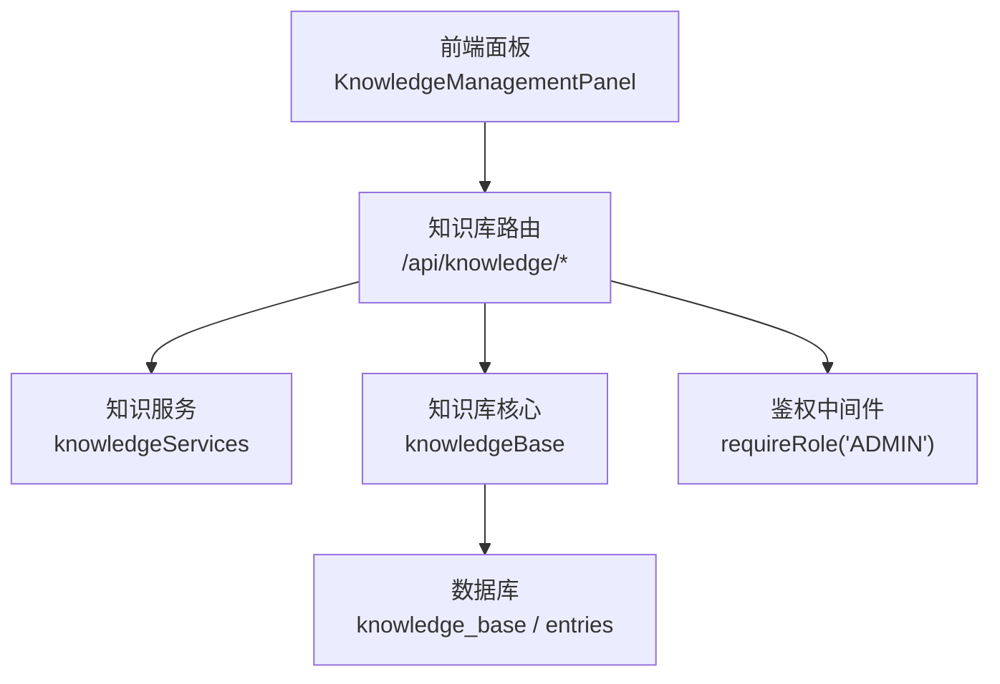
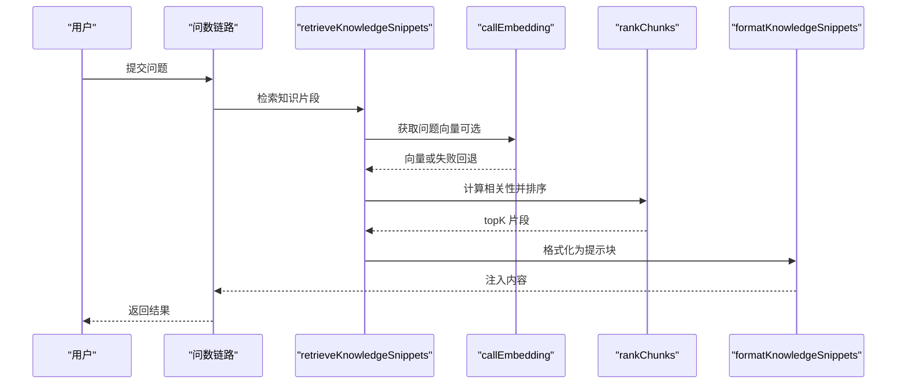
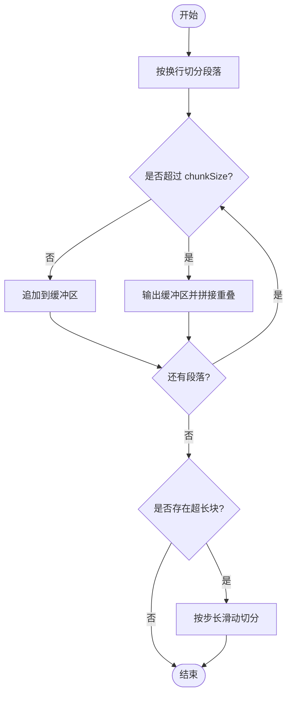
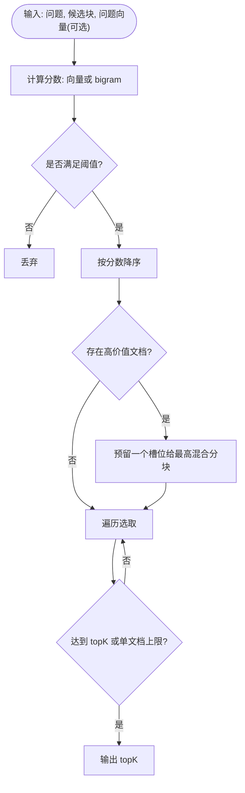
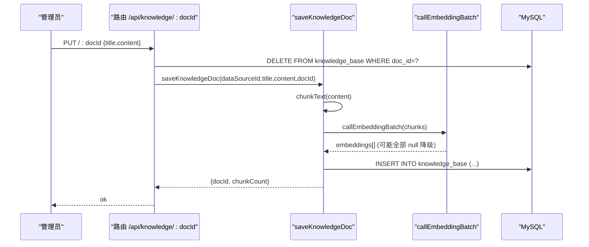
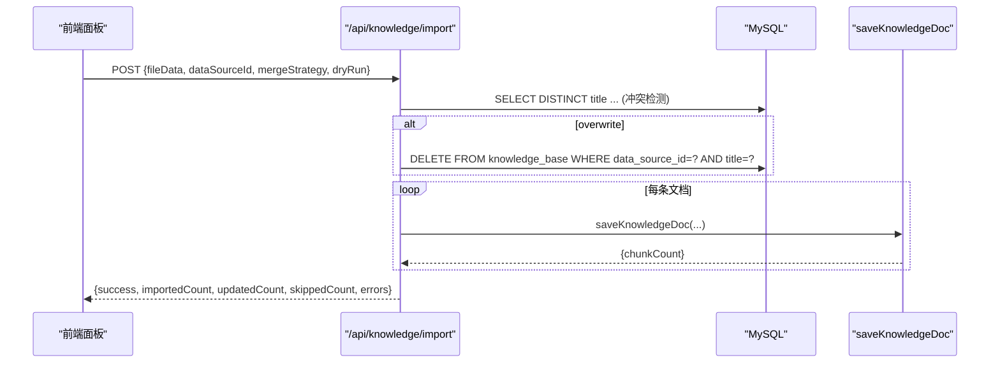
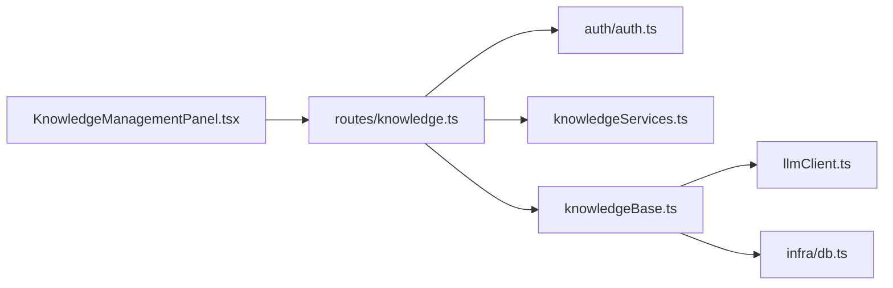

# 内部知识管理

<cite>
**本文引用的文件**
- [server/knowledge/knowledgeBase.ts](file://server/knowledge/knowledgeBase.ts)
- [server/routes/knowledge.ts](file://server/routes/knowledge.ts)
- [server/knowledge/knowledgeServices.ts](file://server/knowledge/knowledgeServices.ts)
- [src/components/knowledge/KnowledgeManagementPanel.tsx](file://src/components/knowledge/KnowledgeManagementPanel.tsx)
- [server/seedDataResources.ts](file://server/seedDataResources.ts)
- [server/infra/db.ts](file://server/infra/db.ts)
- [server/infra/auditLog.ts](file://server/infra/auditLog.ts)
</cite>

## 目录
1. [简介](#简介)
2. [项目结构](#项目结构)
3. [核心组件](#核心组件)
4. [架构总览](#架构总览)
5. [详细组件分析](#详细组件分析)
6. [依赖关系分析](#依赖关系分析)
7. [性能考量](#性能考量)
8. [故障排查指南](#故障排查指南)
9. [结论](#结论)
10. [附录](#附录)

## 简介
本文件面向内部知识库的创建、编辑、删除（CRUD）、切块算法、持久化存储、版本控制、批量导入导出、审核与质量评估，以及界面使用指南与最佳实践。系统采用“文档-切块”模型：管理员登记知识文档后，服务端自动按段落优先、定长兜底、重叠机制进行切块，并生成 embedding 向量用于检索；查询时根据问题召回相关片段注入提示词，提升问数准确性。同时提供 JSON 备份的导入/导出能力，便于迁移与回滚。

## 项目结构
知识库功能由以下模块协作完成：
- 路由层：对外暴露 REST API，负责鉴权、参数校验、调用服务层
- 服务层：实现知识条目 CRUD、种子数据初始化、预置条目保护等
- 知识库核心：切块算法、相似度计算、检索排序、prompt 格式化
- 持久化：MySQL 表 knowledge_base（doc/chunk）与 knowledge_base_entries（条目模型）
- 前端面板：导入/导出操作、状态反馈、冲突策略选择

图表来源
- [server/routes/knowledge.ts:1-457](file://server/routes/knowledge.ts#L1-L457)
- [server/knowledge/knowledgeServices.ts:1-260](file://server/knowledge/knowledgeServices.ts#L1-L260)
- [server/knowledge/knowledgeBase.ts:1-239](file://server/knowledge/knowledgeBase.ts#L1-L239)
- [server/infra/db.ts:302-320](file://server/infra/db.ts#L302-L320)

章节来源
- [server/routes/knowledge.ts:1-457](file://server/routes/knowledge.ts#L1-L457)
- [server/knowledge/knowledgeServices.ts:1-260](file://server/knowledge/knowledgeServices.ts#L1-L260)
- [server/knowledge/knowledgeBase.ts:1-239](file://server/knowledge/knowledgeBase.ts#L1-L239)
- [server/infra/db.ts:302-320](file://server/infra/db.ts#L302-L320)

## 核心组件
- 切块与检索
  - 段落优先切分、定长兜底、相邻块重叠，避免语义截断
  - 向量相似度阈值过滤，bigram 关键词降级
  - 高价值文档（标题含特定关键词）保留槽位，防止被字典类文档挤占
- 持久化
  - knowledge_base：存储 doc_id、title、chunk_text、embedding_json、created_by 等
  - knowledge_base_entries：条目模型（预置/种子数据），支持 is_preset 保护
- 导入导出
  - 导出为 JSON 备份（包含还原后的完整 content 与原始 chunks）
  - 导入支持 skip/overwrite/append 三种冲突策略，支持 dryRun 预检
- 权限与审计
  - 写操作需 ADMIN 角色
  - 审计日志记录关键操作与状态

章节来源
- [server/knowledge/knowledgeBase.ts:13-26](file://server/knowledge/knowledgeBase.ts#L13-L26)
- [server/knowledge/knowledgeBase.ts:44-75](file://server/knowledge/knowledgeBase.ts#L44-L75)
- [server/knowledge/knowledgeBase.ts:106-157](file://server/knowledge/knowledgeBase.ts#L106-L157)
- [server/knowledge/knowledgeBase.ts:172-197](file://server/knowledge/knowledgeBase.ts#L172-L197)
- [server/routes/knowledge.ts:94-107](file://server/routes/knowledge.ts#L94-L107)
- [server/routes/knowledge.ts:164-224](file://server/routes/knowledge.ts#L164-L224)
- [server/routes/knowledge.ts:249-375](file://server/routes/knowledge.ts#L249-L375)
- [server/knowledge/knowledgeServices.ts:121-206](file://server/knowledge/knowledgeServices.ts#L121-L206)
- [server/infra/auditLog.ts:1-62](file://server/infra/auditLog.ts#L1-L62)

## 架构总览
知识库在问数链路中作为 RAG 增强源：用户提问时，系统检索最相关的知识片段，以强指令方式注入到阶段一 prompt，约束口径、术语与枚举写法，但不放开表列白名单。

图表来源
- [server/knowledge/knowledgeBase.ts:207-239](file://server/knowledge/knowledgeBase.ts#L207-L239)
- [server/knowledge/knowledgeBase.ts:106-157](file://server/knowledge/knowledgeBase.ts#L106-L157)
- [server/knowledge/knowledgeBase.ts:162-166](file://server/knowledge/knowledgeBase.ts#L162-L166)

## 详细组件分析

### 知识切块算法（chunkText）
- 段落优先：按换行切分为段落，逐段合并至 chunkSize 以内
- 定长兜底：若单段超长，按步长 step = chunkSize - overlap 滑动切分
- 重叠机制：相邻块保留 overlap 字符，避免语义被截断
- 输出：过滤空块，返回字符串数组

图表来源
- [server/knowledge/knowledgeBase.ts:44-75](file://server/knowledge/knowledgeBase.ts#L44-L75)

章节来源
- [server/knowledge/knowledgeBase.ts:44-75](file://server/knowledge/knowledgeBase.ts#L44-L75)

### 检索与排序（rankChunks）
- 向量模式：余弦相似度，低于阈值（默认 0.35，可环境变量覆盖）视为无关不注入
- 降级模式：bigram 关键词重叠度，score > 0 即通过
- 每文档最多入选固定数量（默认 2），防止字典类文档占满槽位
- 高价值文档（标题含“口径/指南/速查/规则/枚举/对比/模式”）保留一个槽位，采用向量分 + 词法分混合择优

图表来源
- [server/knowledge/knowledgeBase.ts:106-157](file://server/knowledge/knowledgeBase.ts#L106-L157)

章节来源
- [server/knowledge/knowledgeBase.ts:106-157](file://server/knowledge/knowledgeBase.ts#L106-L157)

### 知识持久化与版本控制
- 表结构
  - knowledge_base：存储 doc_id、data_source_id、title、chunk_text、embedding_json、created_by 等字段，用于 RAG 检索
  - knowledge_base_entries：条目模型，支持 is_preset 标记预置条目，禁止修改/删除
- 写入流程
  - saveKnowledgeDoc：切块 → 批量 embedding（失败整体降级为空向量）→ 逐块插入
  - retrieveKnowledgeSnippets：读取所有块 → 计算问题向量 → rankChunks → formatKnowledgeSnippets
- 版本控制策略
  - 编辑场景：先删除旧块，再以同一 docId 重新切块入库，保证向量与内容一致
  - 导入场景：支持 overwrite 覆盖同名文档（删除旧块再重入），skip 跳过，append 新增重复

图表来源
- [server/routes/knowledge.ts:420-442](file://server/routes/knowledge.ts#L420-L442)
- [server/knowledge/knowledgeBase.ts:172-197](file://server/knowledge/knowledgeBase.ts#L172-L197)
- [server/infra/db.ts:302-320](file://server/infra/db.ts#L302-L320)

章节来源
- [server/knowledge/knowledgeBase.ts:172-197](file://server/knowledge/knowledgeBase.ts#L172-L197)
- [server/routes/knowledge.ts:420-442](file://server/routes/knowledge.ts#L420-L442)
- [server/knowledge/knowledgeServices.ts:121-206](file://server/knowledge/knowledgeServices.ts#L121-L206)
- [server/infra/db.ts:302-320](file://server/infra/db.ts#L302-L320)

### 批量导入导出
- 导出
  - 从 knowledge_base 按 doc 聚合，使用 stitchChunks 去重叠还原完整 content
  - 输出 JSON 备份，包含 version、type、dataSourceId、docs 等元信息
- 导入
  - 支持 v2（knowledge-docs）与 v1（knowledgeBase 条目数组）两种格式
  - 冲突判定：同数据源下同 title
  - 策略：skip（跳过）、overwrite（覆盖）、append（新增）
  - dryRun：仅预检不写库，返回统计摘要

图表来源
- [server/routes/knowledge.ts:249-375](file://server/routes/knowledge.ts#L249-L375)
- [server/routes/knowledge.ts:164-224](file://server/routes/knowledge.ts#L164-L224)
- [server/knowledge/knowledgeBase.ts:172-197](file://server/knowledge/knowledgeBase.ts#L172-L197)

章节来源
- [server/routes/knowledge.ts:164-224](file://server/routes/knowledge.ts#L164-L224)
- [server/routes/knowledge.ts:249-375](file://server/routes/knowledge.ts#L249-L375)
- [src/components/knowledge/KnowledgeManagementPanel.tsx:28-125](file://src/components/knowledge/KnowledgeManagementPanel.tsx#L28-L125)

### 知识条目模型与预置保护
- 条目模型（knowledge_base_entries）
  - 支持分类、标签、创建/更新时间戳
  - 预置条目 is_preset=1，禁止更新或删除，保障系统稳定性
- 种子数据
  - 应用启动时可批量初始化预置知识条目，失败单个条目不影响整体事务

章节来源
- [server/knowledge/knowledgeServices.ts:31-67](file://server/knowledge/knowledgeServices.ts#L31-L67)
- [server/knowledge/knowledgeServices.ts:94-119](file://server/knowledge/knowledgeServices.ts#L94-L119)
- [server/knowledge/knowledgeServices.ts:121-206](file://server/knowledge/knowledgeServices.ts#L121-L206)
- [server/knowledge/knowledgeServices.ts:214-259](file://server/knowledge/knowledgeServices.ts#L214-L259)

### 权限控制与操作审计
- 权限控制
  - 读接口对所有登录用户开放
  - 写接口（POST/PUT/DELETE/IMPORT/EXPORT）要求 ADMIN 角色
- 操作审计
  - 审计日志统一落库 query_audit_log，记录 endpoint、status、detail、durationMs 等
  - 写入失败仅告警，不阻塞主流程

章节来源
- [server/routes/knowledge.ts:25-31](file://server/routes/knowledge.ts#L25-L31)
- [server/routes/knowledge.ts:94-107](file://server/routes/knowledge.ts#L94-L107)
- [server/routes/knowledge.ts:164-224](file://server/routes/knowledge.ts#L164-L224)
- [server/routes/knowledge.ts:249-375](file://server/routes/knowledge.ts#L249-L375)
- [server/infra/auditLog.ts:1-62](file://server/infra/auditLog.ts#L1-L62)

### 界面使用指南与最佳实践
- 导出
  - 选择目标数据源后点击“导出知识库”，下载 JSON 备份
- 导入
  - 选择 JSON 文件，设置冲突策略（跳过/覆盖/新增），可勾选“仅预检”确认影响范围
  - 导入完成后查看新增、覆盖、跳过数量及错误详情
- 最佳实践
  - 导入前建议先导出当前知识库备份
  - 对重要口径/指南类文档，确保标题包含“口径/指南/速查/规则/枚举/对比/模式”等关键词，以便检索时优先注入
  - 合理配置 chunkSize 与 overlap（默认 400/80），避免过短导致语义断裂或过长导致检索精度下降
  - 定期审查导入结果与错误列表，及时修正无效条目

章节来源
- [src/components/knowledge/KnowledgeManagementPanel.tsx:28-125](file://src/components/knowledge/KnowledgeManagementPanel.tsx#L28-L125)
- [src/components/knowledge/KnowledgeManagementPanel.tsx:168-252](file://src/components/knowledge/KnowledgeManagementPanel.tsx#L168-L252)

## 依赖关系分析
- 路由层依赖鉴权中间件与服务层
- 服务层依赖数据库连接池与类型定义
- 知识库核心依赖 LLM 客户端（embedding）与 bigram 工具
- 前端面板依赖后端 API 与浏览器下载能力

图表来源
- [server/routes/knowledge.ts:25-31](file://server/routes/knowledge.ts#L25-L31)
- [server/knowledge/knowledgeBase.ts:8-11](file://server/knowledge/knowledgeBase.ts#L8-L11)
- [server/knowledge/knowledgeServices.ts:6-9](file://server/knowledge/knowledgeServices.ts#L6-L9)
- [src/components/knowledge/KnowledgeManagementPanel.tsx:6-8](file://src/components/knowledge/KnowledgeManagementPanel.tsx#L6-L8)

章节来源
- [server/routes/knowledge.ts:25-31](file://server/routes/knowledge.ts#L25-L31)
- [server/knowledge/knowledgeBase.ts:8-11](file://server/knowledge/knowledgeBase.ts#L8-L11)
- [server/knowledge/knowledgeServices.ts:6-9](file://server/knowledge/knowledgeServices.ts#L6-L9)
- [src/components/knowledge/KnowledgeManagementPanel.tsx:6-8](file://src/components/knowledge/KnowledgeManagementPanel.tsx#L6-L8)

## 性能考量
- 切块参数
  - chunkSize=400、overlap=80 平衡了上下文预算与检索精度
  - 超大文档按步长滑动切分，避免单次请求过大
- 检索优化
  - 向量相似度阈值过滤无关知识，减少注入噪声
  - 每文档最多入选固定数量，防止单一长文档占满槽位
  - 高价值文档优先保留槽位，提升口径/指南命中率
- 批量嵌入
  - 使用批量化 embedding 请求降低往返次数，整体失败降级为关键词检索保底
- 导入导出
  - 导出时按 doc 聚合并去重叠还原原文，减少传输体积
  - 导入支持 dryRun 预检，避免误操作

[本节为通用指导，无需具体文件引用]

## 故障排查指南
- 导入失败
  - 检查文件格式是否为知识库导出 JSON（含 docs 或 knowledgeBase 字段）
  - 确认目标数据源存在且具备写入权限
  - 查看错误列表中的 message，定位具体条目问题
- 导入后无效果
  - 确认冲突策略是否正确（skip/overwrite/append）
  - 检查标题是否命中高价值关键词，必要时调整标题
- 检索不到相关知识
  - 检查 embedding 服务是否可用，不可用将降级为 bigram 关键词检索
  - 调整 KNOWLEDGE_MIN_SCORE 阈值（默认 0.35）
- 权限错误
  - 写操作需要 ADMIN 角色，确认当前用户角色
- 审计日志
  - 查看 query_audit_log 记录，确认操作状态与耗时

章节来源
- [server/routes/knowledge.ts:249-375](file://server/routes/knowledge.ts#L249-L375)
- [server/knowledge/knowledgeBase.ts:34-41](file://server/knowledge/knowledgeBase.ts#L34-L41)
- [server/infra/auditLog.ts:38-61](file://server/infra/auditLog.ts#L38-L61)

## 结论
本知识库系统通过“段落优先+定长兜底+重叠”的切块策略与“向量相似度+关键词降级”的检索机制，在保证可用性的同时提升了业务口径与术语的注入质量。配合严格的权限控制、审计日志与导入导出能力，形成了完整的知识生命周期管理能力。建议在生产环境中合理配置阈值与切块参数，并定期审查导入结果与审计日志，持续优化知识质量与检索效果。

[本节为总结性内容，无需具体文件引用]

## 附录
- 预置知识示例
  - 数据资源库内置多份领域知识（如核心概念、四红线规则、术语词典、分析方法），可作为模板参考
- 数据库表结构
  - knowledge_base：RAG 检索用，存储切块与向量
  - knowledge_base_entries：条目模型，支持预置保护与种子数据初始化

章节来源
- [server/seedDataResources.ts:169-800](file://server/seedDataResources.ts#L169-L800)
- [server/infra/db.ts:302-320](file://server/infra/db.ts#L302-L320)