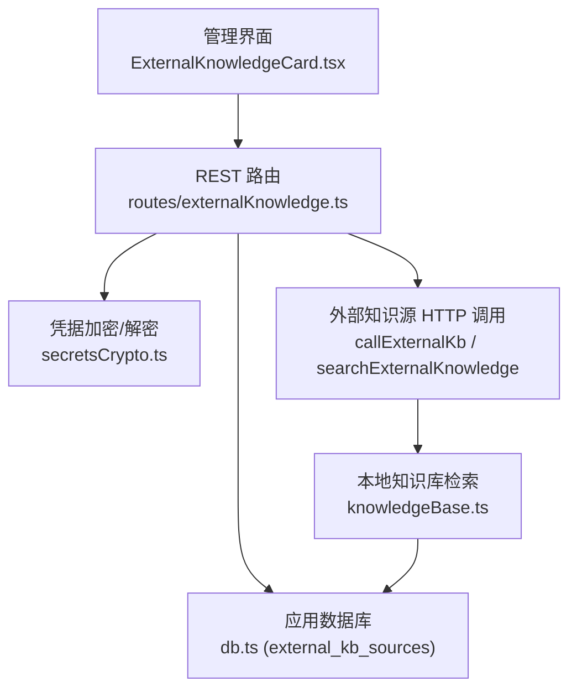
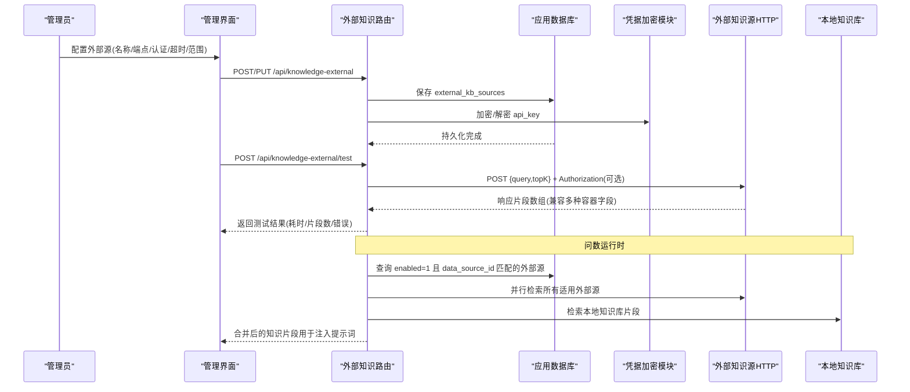
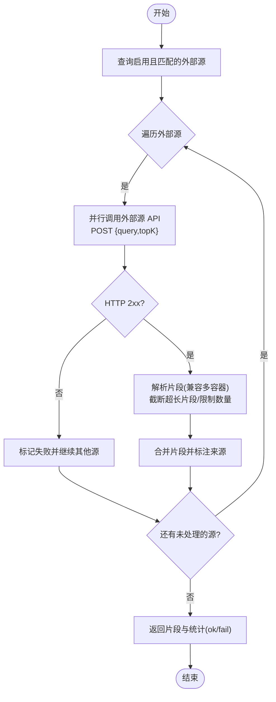
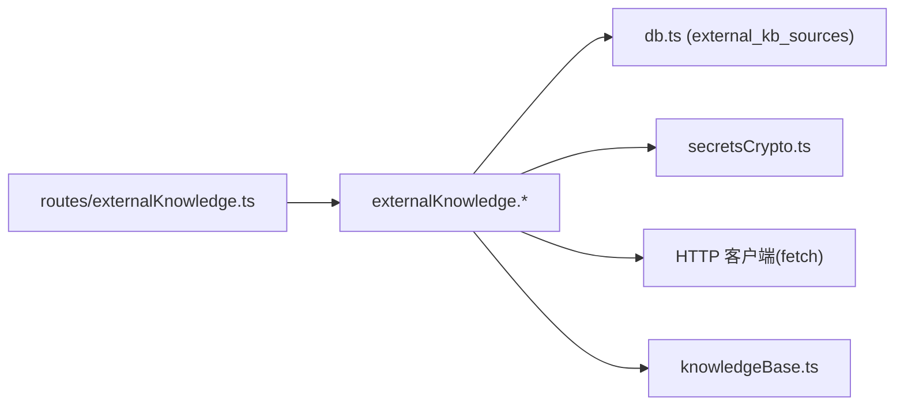

# 外部知识集成

<cite>
**本文引用的文件**
- [server/routes/externalKnowledge.ts](file://server/routes/externalKnowledge.ts)
- [server/knowledge/externalKnowledge.test.ts](file://server/knowledge/externalKnowledge.test.ts)
- [server/infra/db.ts](file://server/infra/db.ts)
- [server/infra/secretsCrypto.ts](file://server/infra/secretsCrypto.ts)
- [src/components/datasource/ExternalKnowledgeCard.tsx](file://src/components/datasource/ExternalKnowledgeCard.tsx)
- [server/knowledge/knowledgeBase.ts](file://server/knowledge/knowledgeBase.ts)
</cite>

## 目录
1. [简介](#简介)
2. [项目结构](#项目结构)
3. [核心组件](#核心组件)
4. [架构总览](#架构总览)
5. [详细组件分析](#详细组件分析)
6. [依赖关系分析](#依赖关系分析)
7. [性能考虑](#性能考虑)
8. [故障排查指南](#故障排查指南)
9. [结论](#结论)
10. [附录：配置示例与最佳实践](#附录配置示例与最佳实践)

## 简介
本文件面向“外部知识集成”能力，系统性说明如何对接企业级外部知识源（如企业 Wiki、文档系统、API 服务等），在问数链路中与本地知识库一并检索注入，提升回答准确性与一致性。内容覆盖：
- RESTful API 调用协议、认证配置与错误处理策略
- 数据同步策略（增量/全量/冲突解决）与缓存机制（本地缓存、过期策略、性能优化）
- 第三方知识源类型适配与接入方式
- 外部知识配置的详细示例（连接参数、认证方式、同步频率设置）
- 故障处理与重试机制，保障可靠性
- 监控指标与日志记录，便于问题排查与性能优化

## 项目结构
外部知识集成的后端由路由层、服务层与基础设施层组成；前端提供管理员配置界面与连通性测试。

图表来源
- [server/routes/externalKnowledge.ts:1-85](file://server/routes/externalKnowledge.ts#L1-L85)
- [server/infra/db.ts:706-724](file://server/infra/db.ts#L706-L724)
- [server/infra/secretsCrypto.ts:1-50](file://server/infra/secretsCrypto.ts#L1-L50)
- [server/knowledge/knowledgeBase.ts:1-239](file://server/knowledge/knowledgeBase.ts#L1-L239)
- [src/components/datasource/ExternalKnowledgeCard.tsx:1-402](file://src/components/datasource/ExternalKnowledgeCard.tsx#L1-L402)

章节来源
- [server/routes/externalKnowledge.ts:1-85](file://server/routes/externalKnowledge.ts#L1-L85)
- [server/infra/db.ts:706-724](file://server/infra/db.ts#L706-L724)
- [server/infra/secretsCrypto.ts:1-50](file://server/infra/secretsCrypto.ts#L1-L50)
- [server/knowledge/knowledgeBase.ts:1-239](file://server/knowledge/knowledgeBase.ts#L1-L239)
- [src/components/datasource/ExternalKnowledgeCard.tsx:1-402](file://src/components/datasource/ExternalKnowledgeCard.tsx#L1-L402)

## 核心组件
- 外部知识源管理路由：提供外部源的增删改查、连通性测试接口，统一鉴权为管理员。
- 外部知识检索服务：从数据库加载启用且匹配数据源的外部源，并行发起检索请求，聚合结果并格式化片段。
- 凭据安全存储：使用 AES-256-GCM 对 api_key 进行加密落库，读取时按需解密。
- 本地知识库协同：外部检索结果与本地知识库 RAG 结果共同注入问数阶段一提示词。
- 前端管理卡片：管理员可配置外部源、选择生效范围（全部或指定数据源）、设置超时与认证方式，并进行连通性测试。

章节来源
- [server/routes/externalKnowledge.ts:1-85](file://server/routes/externalKnowledge.ts#L1-L85)
- [server/knowledge/externalKnowledge.test.ts:1-262](file://server/knowledge/externalKnowledge.test.ts#L1-L262)
- [server/infra/secretsCrypto.ts:1-50](file://server/infra/secretsCrypto.ts#L1-L50)
- [server/knowledge/knowledgeBase.ts:1-239](file://server/knowledge/knowledgeBase.ts#L1-L239)
- [src/components/datasource/ExternalKnowledgeCard.tsx:1-402](file://src/components/datasource/ExternalKnowledgeCard.tsx#L1-L402)

## 架构总览
外部知识集成在问数链路中作为“外部 RAG 源”参与检索，流程如下：

图表来源
- [server/routes/externalKnowledge.ts:1-85](file://server/routes/externalKnowledge.ts#L1-L85)
- [server/infra/db.ts:706-724](file://server/infra/db.ts#L706-L724)
- [server/infra/secretsCrypto.ts:1-50](file://server/infra/secretsCrypto.ts#L1-L50)
- [server/knowledge/knowledgeBase.ts:1-239](file://server/knowledge/knowledgeBase.ts#L1-L239)
- [server/knowledge/externalKnowledge.test.ts:125-206](file://server/knowledge/externalKnowledge.test.ts#L125-L206)

## 详细组件分析

### 外部知识源管理路由
- 权限控制：仅管理员可访问，确保凭据与网络边界安全。
- 接口清单：
  - GET /api/knowledge-external：列出外部源（不返回明文密钥，仅标记 hasKey）。
  - POST /api/knowledge-external：新增外部源（校验输入、加密密钥、落库）。
  - PUT /api/knowledge-external/:id：编辑外部源（留空 apiKey 保留原密钥；authType 改为 none 时清空密钥）。
  - DELETE /api/knowledge-external/:id：删除外部源。
  - POST /api/knowledge-external/test：连通性测试（不落库，按表单值即时检索）。
- 错误处理：统一捕获异常并返回结构化错误信息。

章节来源
- [server/routes/externalKnowledge.ts:1-85](file://server/routes/externalKnowledge.ts#L1-L85)

### 外部知识检索服务（并行检索与降级）
- 适用源筛选：从 external_kb_sources 表查询 enabled=1 且 data_source_id 匹配当前数据源或通配符“*”的源。
- 并发检索：对所有适用外部源并行发起 HTTP 请求，单源失败不影响其他源。
- 请求协议：POST JSON，请求体包含 query 与 topK；Bearer 认证时自动携带 Authorization 头。
- 响应解析：兼容 results/documents/data/items 四种容器字段，每项取 content/text/chunk/pageContent 等文本字段；单片段超长截断，最多取固定数量片段。
- 降级策略：数据库异常或外部源不可用时整体降级为空结果，不阻断问数主链路。
- 密文处理：读取 api_key 后按需解密再组装请求头。

图表来源
- [server/knowledge/externalKnowledge.test.ts:125-206](file://server/knowledge/externalKnowledge.test.ts#L125-L206)
- [server/knowledge/externalKnowledge.test.ts:74-123](file://server/knowledge/externalKnowledge.test.ts#L74-L123)

章节来源
- [server/knowledge/externalKnowledge.test.ts:1-262](file://server/knowledge/externalKnowledge.test.ts#L1-L262)

### 凭据安全存储
- 加密算法：AES-256-GCM，密文格式含 iv/authTag/cipher，支持幂等加密与迁移期兼容。
- 密钥来源：优先 DS_SECRET_KEY，其次 JWT_SECRET；生产环境缺失将 fail-fast。
- 使用场景：外部源 api_key 加密落库；列表不泄露明文，仅返回 hasKey 标记；调用前解密。

章节来源
- [server/infra/secretsCrypto.ts:1-50](file://server/infra/secretsCrypto.ts#L1-L50)
- [server/knowledge/externalKnowledge.test.ts:208-261](file://server/knowledge/externalKnowledge.test.ts#L208-L261)

### 本地知识库协同（RAG）
- 切块与嵌入：管理员登记的知识文档被切块并生成 embedding；检索时根据问题向量相似度排序，阈值过滤无关片段。
- 混合权重：标题命中特定关键词（口径/指南/速查/规则/枚举/对比/模式）的文档优先保留一个槽位，避免字典类文档挤占重要业务口径。
- 注入格式：检索到的片段以强指令形式注入问数阶段一提示词，约束口径/术语/枚举写法，禁止自行编造。

章节来源
- [server/knowledge/knowledgeBase.ts:1-239](file://server/knowledge/knowledgeBase.ts#L1-L239)

### 前端管理卡片
- 功能：新增/编辑/删除外部源；选择生效范围（全部或指定数据源）；设置超时与认证方式；连通性测试。
- 校验：名称必填、endpoint 必须以 http(s):// 开头、Bearer 认证需填写 API Key、超时范围限制。
- 交互：保存成功后提示“问数检索即时生效”，测试结果显示耗时与片段数。

章节来源
- [src/components/datasource/ExternalKnowledgeCard.tsx:1-402](file://src/components/datasource/ExternalKnowledgeCard.tsx#L1-L402)

## 依赖关系分析
- 路由依赖：
  - 鉴权中间件与角色校验（ADMIN）。
  - 外部知识服务函数（验证、CRUD、测试）。
- 服务依赖：
  - 数据库连接池（MySQL），读取 external_kb_sources 表。
  - 凭据加密模块（AES-256-GCM）。
  - 外部 HTTP 客户端（fetch），支持超时与 AbortSignal。
- 本地知识库依赖：
  - 向量检索与 bigram 降级。
  - 阈值过滤与片段格式化。

图表来源
- [server/routes/externalKnowledge.ts:1-85](file://server/routes/externalKnowledge.ts#L1-L85)
- [server/infra/db.ts:706-724](file://server/infra/db.ts#L706-L724)
- [server/infra/secretsCrypto.ts:1-50](file://server/infra/secretsCrypto.ts#L1-L50)
- [server/knowledge/knowledgeBase.ts:1-239](file://server/knowledge/knowledgeBase.ts#L1-L239)

章节来源
- [server/routes/externalKnowledge.ts:1-85](file://server/routes/externalKnowledge.ts#L1-L85)
- [server/infra/db.ts:706-724](file://server/infra/db.ts#L706-L724)
- [server/infra/secretsCrypto.ts:1-50](file://server/infra/secretsCrypto.ts#L1-L50)
- [server/knowledge/knowledgeBase.ts:1-239](file://server/knowledge/knowledgeBase.ts#L1-L239)

## 性能考虑
- 并发检索：对外部源采用并行调用，降低端到端延迟；单源失败不阻塞其他源。
- 片段限制：单片段长度上限与最大片段数限制，防止大文档占用过多上下文。
- 本地知识库阈值：向量相似度阈值过滤无关片段，减少无效注入。
- 批量化嵌入：本地知识库文档入库时批量生成 embedding，减少往返次数。
- 超时控制：外部源请求支持 timeoutMs，避免长尾请求拖慢整体链路。

[本节为通用性能建议，无需具体文件引用]

## 故障排查指南
- 连通性测试失败：
  - 检查 endpoint 是否可达、认证是否正确（Bearer Token）。
  - 查看测试返回的错误信息与耗时，定位网络或上游服务问题。
- 外部源不可用：
  - 检索时单源失败会被降级为空，不影响其他源；关注 okSources/failSources 统计。
  - 若所有源均失败，检查数据库中的 enabled 状态与 data_source_id 匹配。
- 密钥问题：
  - 确认 api_key 已正确加密存储；编辑时留空表示保留原密钥；改为 none 会清空密钥。
  - 列表不返回明文，仅显示 hasKey；如需验证，使用测试接口。
- 超时与中断：
  - 调整 timeoutMs；若出现 AbortError，可能是上游响应过慢或客户端主动中止。
- 数据库异常：
  - 数据库异常时整体降级为空结果，不阻断问数主链路；需检查应用库连接与表结构。

章节来源
- [server/knowledge/externalKnowledge.test.ts:74-123](file://server/knowledge/externalKnowledge.test.ts#L74-L123)
- [server/knowledge/externalKnowledge.test.ts:125-206](file://server/knowledge/externalKnowledge.test.ts#L125-L206)
- [server/knowledge/externalKnowledge.test.ts:208-261](file://server/knowledge/externalKnowledge.test.ts#L208-L261)

## 结论
外部知识集成通过标准化 REST 接口、严格的凭据安全存储与并行检索机制，将企业级外部知识源无缝融入问数链路。配合本地知识库 RAG 与阈值过滤，既保证检索质量，又具备高可用性与可扩展性。管理员可通过前端卡片快速配置与测试，实现“即配即用”。

[本节为总结性内容，无需具体文件引用]

## 附录：配置示例与最佳实践

### 支持的第三方知识源类型
- 企业 Wiki 检索 API（如 Confluence、内部 Wiki 网关）
- 文档系统检索接口（如 Dify、RAGFlow、自建 RAG 网关）
- 任意提供 POST 检索接口的服务（兼容多种响应容器字段）

章节来源
- [src/components/datasource/ExternalKnowledgeCard.tsx:222-228](file://src/components/datasource/ExternalKnowledgeCard.tsx#L222-L228)

### 连接参数与认证方式
- 连接参数：
  - name：外部源名称
  - endpoint：检索接口地址（http/https）
  - timeoutMs：请求超时毫秒数
  - dataSourceId：生效范围（* 表示全部数据源，或指定数据源 ID）
  - enabled：是否启用
- 认证方式：
  - none：无认证
  - bearer：Bearer Token，需在 apiKey 字段填写令牌

章节来源
- [src/components/datasource/ExternalKnowledgeCard.tsx:33-41](file://src/components/datasource/ExternalKnowledgeCard.tsx#L33-L41)
- [server/routes/externalKnowledge.ts:28-53](file://server/routes/externalKnowledge.ts#L28-L53)

### 同步频率设置
- 外部知识集成采用“问数时实时检索”的模式，不落库外部内容；因此无需配置同步频率。
- 若需缓存外部片段，可在上层服务增加本地缓存层（如内存缓存或 Redis），并设置 TTL 与失效策略。

[本节为概念性说明，无需具体文件引用]

### 增量同步与全量同步
- 当前实现为实时检索，不涉及增量/全量同步。
- 若外部源提供变更通知或时间戳字段，可在上层服务实现增量拉取与本地缓存更新。

[本节为概念性说明，无需具体文件引用]

### 冲突解决机制
- 外部片段与本地知识库片段分别标注来源，最终合并注入提示词；不存在直接冲突。
- 若需优先级控制，可在上层服务对片段进行加权排序或去重。

[本节为概念性说明，无需具体文件引用]

### 本地缓存与过期策略
- 当前未内置外部片段缓存；建议在网关或服务层引入缓存（如内存 Map/Redis）。
- 过期策略建议：
  - 基于时间 TTL（如 5~30 分钟）
  - 基于内容哈希变化触发刷新
  - 结合外部源提供的版本/更新时间字段

[本节为概念性说明，无需具体文件引用]

### 监控指标与日志记录
- 建议记录：
  - 外部源调用成功率、失败原因分类（网络/认证/超时/响应格式）
  - 单次检索耗时、各源耗时分布
  - 片段数量与来源分布
  - 数据库查询耗时与错误
- 日志位置：
  - 路由层统一捕获异常并记录错误信息
  - 服务层可追加结构化日志（源名、耗时、片段数）

章节来源
- [server/routes/externalKnowledge.ts:19-82](file://server/routes/externalKnowledge.ts#L19-L82)