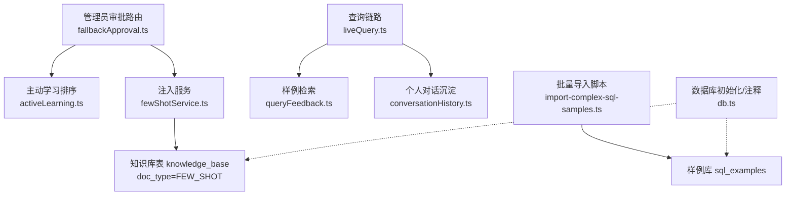
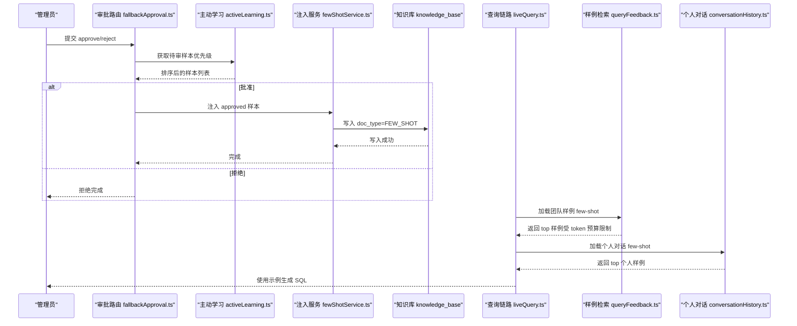
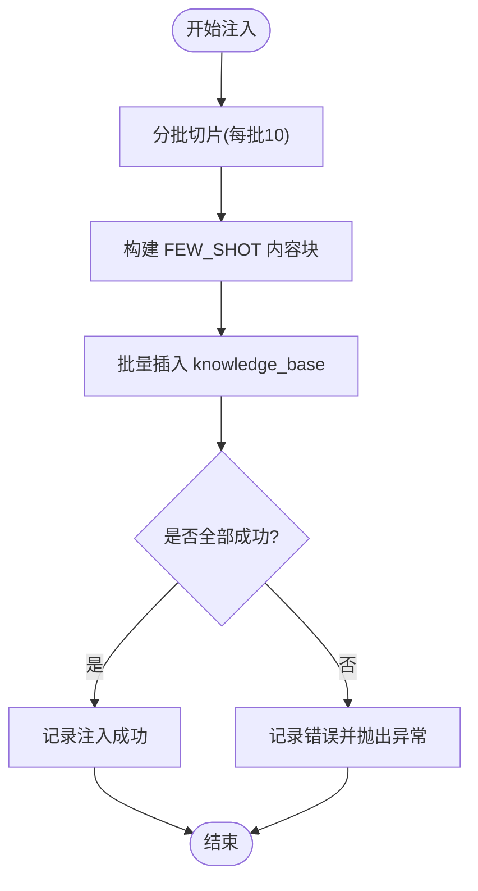
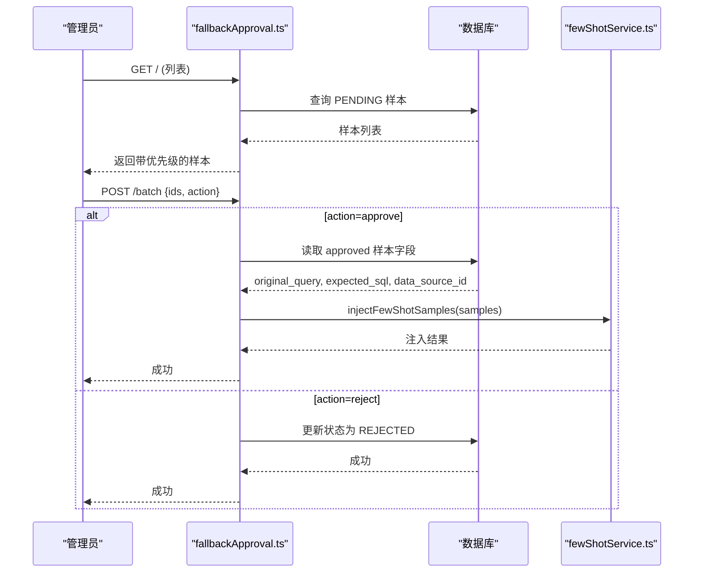
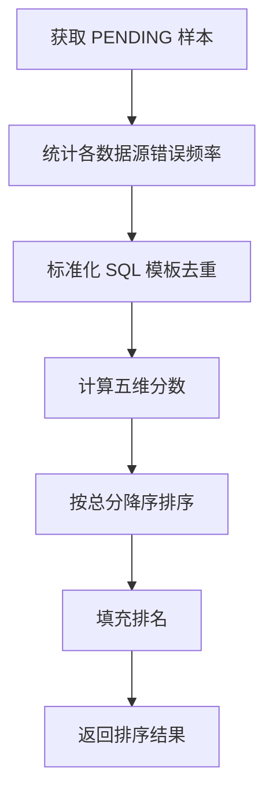
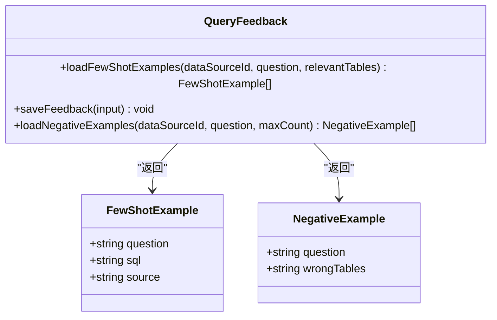
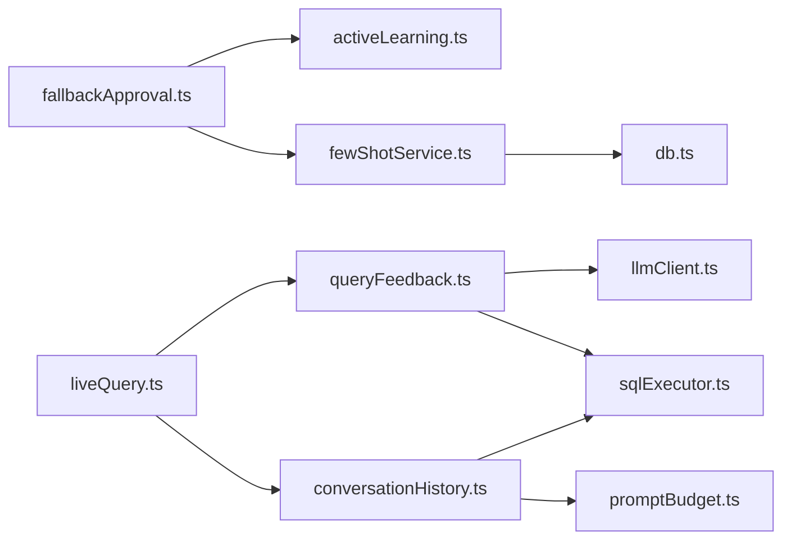

# 少样本注入服务

<cite>
**本文引用的文件**
- [server/utils/fewShotService.ts](file://server/utils/fewShotService.ts)
- [server/routes/fallbackApproval.ts](file://server/routes/fallbackApproval.ts)
- [server/utils/activeLearning.ts](file://server/utils/activeLearning.ts)
- [server/query/queryFeedback.ts](file://server/query/queryFeedback.ts)
- [server/query/conversationHistory.ts](file://server/query/conversationHistory.ts)
- [server/query/liveQuery.ts](file://server/query/liveQuery.ts)
- [scripts/import-complex-sql-samples.ts](file://scripts/import-complex-sql-samples.ts)
- [server/infra/db.ts](file://server/infra/db.ts)
</cite>

## 目录
1. [简介](#简介)
2. [项目结构](#项目结构)
3. [核心组件](#核心组件)
4. [架构总览](#架构总览)
5. [详细组件分析](#详细组件分析)
6. [依赖关系分析](#依赖关系分析)
7. [性能考量](#性能考量)
8. [故障排查指南](#故障排查指南)
9. [结论](#结论)
10. [附录](#附录)

## 简介
本服务为“智能问数据分析系统”的少样本（Few-Shot）注入与检索能力，负责将人类专家采纳的高质量问答对自动沉淀到知识库或样例库，并在后续查询时按相似度与预算策略召回，作为提示词中的示例以提升 LLM 生成 SQL 的质量。其关键特性包括：
- 困难样本主动学习：对失败样本进行优先级排序与人工审核，批准后自动注入 Few-Shot 知识库。
- 多源样例聚合：团队样例库、个人对话沉淀、导入脚本样例共同构成 Few-Shot 来源。
- 语义+词法+结构多维打分：结合 embedding、bigram 重合度与表引用重合度，控制 token 预算，贪心选取 top 示例。
- 降级与容错：embedding 不可用时自动降级为纯词法匹配；注入失败不阻断审批主流程。

## 项目结构
围绕少样本注入服务的代码主要分布在以下模块：
- 注入与检索：fewShotService.ts
- 管理员审批流：fallbackApproval.ts
- 主动学习评分：activeLearning.ts
- 样例库与检索：queryFeedback.ts
- 个人对话沉淀：conversationHistory.ts
- 查询链路集成：liveQuery.ts
- 批量导入脚本：import-complex-sql-samples.ts
- 数据库初始化与注释：db.ts

图表来源
- [server/routes/fallbackApproval.ts:23-121](file://server/routes/fallbackApproval.ts#L23-L121)
- [server/utils/activeLearning.ts:40-129](file://server/utils/activeLearning.ts#L40-L129)
- [server/utils/fewShotService.ts:28-76](file://server/utils/fewShotService.ts#L28-L76)
- [server/query/queryFeedback.ts:168-232](file://server/query/queryFeedback.ts#L168-L232)
- [server/query/conversationHistory.ts:158-203](file://server/query/conversationHistory.ts#L158-L203)
- [scripts/import-complex-sql-samples.ts:23-189](file://scripts/import-complex-sql-samples.ts#L23-L189)
- [server/infra/db.ts:729-735](file://server/infra/db.ts#L729-L735)

章节来源
- [server/utils/fewShotService.ts:1-119](file://server/utils/fewShotService.ts#L1-L119)
- [server/routes/fallbackApproval.ts:1-175](file://server/routes/fallbackApproval.ts#L1-L175)
- [server/utils/activeLearning.ts:1-144](file://server/utils/activeLearning.ts#L1-L144)
- [server/query/queryFeedback.ts:1-471](file://server/query/queryFeedback.ts#L1-L471)
- [server/query/conversationHistory.ts:1-204](file://server/query/conversationHistory.ts#L1-L204)
- [server/query/liveQuery.ts:1-250](file://server/query/liveQuery.ts#L1-L250)
- [scripts/import-complex-sql-samples.ts:1-189](file://scripts/import-complex-sql-samples.ts#L1-L189)
- [server/infra/db.ts:720-740](file://server/infra/db.ts#L720-L740)

## 核心组件
- 注入服务（fewShotService.ts）
  - injectFewShotSamples：将批准的困难样本分批写入 knowledge_base，标记 doc_type=FEW_SHOT，并附带结构化内容（原始问题、期望 SQL、数据源、处理策略）。
  - retrieveFewShotExamples：从 knowledge_base 中按数据源过滤、按时间倒序取最近 N 条 FEW_SHOT 文档，供后续策略使用。
- 管理员审批流（fallbackApproval.ts）
  - 列表：调用 activeLearning 对 PENDING 样本计算优先级分数并返回。
  - 批量操作：支持 approve/reject；approve 时提取 original_query、expected_sql、data_source_id 并调用 injectFewShotSamples。
  - 单个审核：更新状态至 IN_REVIEW，最终确认 APPROVED/REJECTED，必要时写入 expected_sql 与 resolved_strategy。
- 主动学习评分（activeLearning.ts）
  - prioritizePendingSamples：基于年龄衰减、错误频率、SQL 复杂度、多样性探索、重要用户加权等多因子计算总分并排序。
- 样例检索（queryFeedback.ts）
  - loadFewShotExamples：从 sql_examples 检索相似样例，采用 embedding 余弦相似度（可降级）、bigram 重合度、表引用重合度综合打分，按 token 预算贪心取 top。
  - saveFeedback：点赞反馈自动沉淀为 sql_examples，并尝试生成问题向量。
  - loadNegativeExamples：点踩反例沉淀，仅暴露错误涉及的表名特征，避免照抄错误 SQL。
- 个人对话沉淀（conversationHistory.ts）
  - loadConversationFewShot：同用户同数据源的真实成功问答对，近 100 条内按 bigram 与表重合度打分，token 预算内取 top 2。
- 查询链路集成（liveQuery.ts）
  - 在查询阶段加载 Few-Shot 样例（来自样例库与个人对话），组合进 prompt 提升生成质量。
- 批量导入脚本（import-complex-sql-samples.ts）
  - 向 sql_examples 批量导入复杂 SQL 样例，覆盖 WITH/CTE、窗口函数、条件聚合等场景，作为冷启动 Few-Shot 语料。

章节来源
- [server/utils/fewShotService.ts:28-119](file://server/utils/fewShotService.ts#L28-L119)
- [server/routes/fallbackApproval.ts:23-175](file://server/routes/fallbackApproval.ts#L23-L175)
- [server/utils/activeLearning.ts:40-144](file://server/utils/activeLearning.ts#L40-L144)
- [server/query/queryFeedback.ts:50-232](file://server/query/queryFeedback.ts#L50-L232)
- [server/query/conversationHistory.ts:158-203](file://server/query/conversationHistory.ts#L158-L203)
- [server/query/liveQuery.ts:1-250](file://server/query/liveQuery.ts#L1-L250)
- [scripts/import-complex-sql-samples.ts:23-189](file://scripts/import-complex-sql-samples.ts#L23-L189)

## 架构总览
少样本注入服务贯穿“收集—审核—注入—检索—使用”的全链路：

图表来源
- [server/routes/fallbackApproval.ts:23-121](file://server/routes/fallbackApproval.ts#L23-L121)
- [server/utils/activeLearning.ts:40-129](file://server/utils/activeLearning.ts#L40-L129)
- [server/utils/fewShotService.ts:28-76](file://server/utils/fewShotService.ts#L28-L76)
- [server/query/queryFeedback.ts:168-232](file://server/query/queryFeedback.ts#L168-L232)
- [server/query/conversationHistory.ts:158-203](file://server/query/conversationHistory.ts#L158-L203)
- [server/query/liveQuery.ts:1-250](file://server/query/liveQuery.ts#L1-L250)

## 详细组件分析

### 注入服务（fewShotService.ts）
- 功能要点
  - 批量注入：按批次大小（默认 10）并行插入 knowledge_base，构造标准化内容块（包含原始问题、期望 SQL、数据源、处理策略与状态）。
  - 标题生成：以固定前缀 + 数据源 + 时间戳 + 随机串保证唯一性。
  - 检索接口：按 doc_type=FEW_SHOT 与可选 data_source_id 过滤，按创建时间倒序取 limit 条。
- 数据结构
  - FewShotKnowledge：包含 dataSourceId、title、content、metadata（originalQuery、expectedSQL、annotationStatus、resolvedStrategy）、createdAt。
- 错误处理
  - 单批失败记录日志并抛出错误；整体流程保持幂等与可重试。
- 性能特征
  - 批量 Promise.all 并发写入，降低 IO 次数；日志记录注入计数便于监控。

图表来源
- [server/utils/fewShotService.ts:28-76](file://server/utils/fewShotService.ts#L28-L76)

章节来源
- [server/utils/fewShotService.ts:1-119](file://server/utils/fewShotService.ts#L1-L119)

### 管理员审批流（fallbackApproval.ts）
- 功能要点
  - 列表接口：调用 activeLearning 获取 PENDING 样本并按优先级排序返回。
  - 批量接口：支持 approve/reject；approve 时提取 original_query、expected_sql、data_source_id 并调用 injectFewShotSamples。
  - 单个审核：状态流转 PENDING → IN_REVIEW → APPROVED/REJECTED，必要时写入 expected_sql 与 resolved_strategy。
- 错误处理
  - 审批失败返回 500；注入失败不影响审批主流程（fail-open）。
- 安全与权限
  - 所有接口需认证与 ADMIN 角色校验。

图表来源
- [server/routes/fallbackApproval.ts:23-121](file://server/routes/fallbackApproval.ts#L23-L121)
- [server/utils/fewShotService.ts:28-76](file://server/utils/fewShotService.ts#L28-L76)

章节来源
- [server/routes/fallbackApproval.ts:1-175](file://server/routes/fallbackApproval.ts#L1-L175)

### 主动学习评分（activeLearning.ts）
- 评分维度
  - 年龄衰减分：越久未处理的样本得分越高，鼓励尽快审核积压。
  - 高频错误分：同一数据源出现次数越多得分越高。
  - 查询复杂度分：SQL 长度与关键词数量作为复杂度指标。
  - 多样性探索分：基于 SQL 模板的唯一性，鼓励覆盖多样场景。
  - 重要用户加权分：根据 userId 归一化加权。
- 输出
  - 返回带 totalScore 与 rank 的排序结果，用于前端展示与处理顺序。

图表来源
- [server/utils/activeLearning.ts:40-129](file://server/utils/activeLearning.ts#L40-L129)

章节来源
- [server/utils/activeLearning.ts:1-144](file://server/utils/activeLearning.ts#L1-L144)

### 样例检索（queryFeedback.ts）
- 功能要点
  - loadFewShotExamples：从 sql_examples 检索相似样例，采用 embedding 余弦相似度（可降级）、bigram 重合度、表引用重合度综合打分，按 token 预算贪心取 top（最多 3 条）。
  - saveFeedback：点赞反馈自动沉淀为 sql_examples，并尝试生成问题向量；幂等防止重复。
  - loadNegativeExamples：点踩反例沉淀，仅暴露错误涉及的表名特征，避免照抄错误 SQL。
- 数据结构
  - FewShotExample：question、sql、source（MANUAL/FEEDBACK_UP/IMPORT）。
  - NegativeExample：question、wrongTables（逗号分隔的表名特征）。
- 性能特征
  - 单次 embed 问题向量，失败降级为纯词法；相同 SQL 去重保留最高分；token 预算控制注入规模。

图表来源
- [server/query/queryFeedback.ts:106-232](file://server/query/queryFeedback.ts#L106-L232)

章节来源
- [server/query/queryFeedback.ts:1-471](file://server/query/queryFeedback.ts#L1-L471)

### 个人对话沉淀（conversationHistory.ts）
- 功能要点
  - loadConversationFewShot：同用户同数据源的真实成功问答对，近 100 条内按 bigram 与表重合度打分，token 预算内取 top 2。
  - pruneConversationHistory：定期清理历史，保留窗口（默认 500 条）。
- 性能特征
  - 只读近 100 条，窗口 500 足以覆盖检索源；旧记录自动清理避免写放大。

章节来源
- [server/query/conversationHistory.ts:1-204](file://server/query/conversationHistory.ts#L1-L204)

### 查询链路集成（liveQuery.ts）
- 功能要点
  - 在查询阶段加载 Few-Shot 样例（来自样例库与个人对话），组合进 prompt 提升生成质量。
  - 与 queryFeedback 和 conversationHistory 协作，确保示例质量与预算控制。

章节来源
- [server/query/liveQuery.ts:1-250](file://server/query/liveQuery.ts#L1-L250)

### 批量导入脚本（import-complex-sql-samples.ts）
- 功能要点
  - 向 sql_examples 批量导入复杂 SQL 样例，覆盖 WITH/CTE、窗口函数、条件聚合等场景，作为冷启动 Few-Shot 语料。
  - 提供交互式确认与现有数据覆盖选项。

章节来源
- [scripts/import-complex-sql-samples.ts:1-189](file://scripts/import-complex-sql-samples.ts#L1-L189)

## 依赖关系分析
- 组件耦合
  - fallbackApproval.ts 依赖 activeLearning.ts 与 fewShotService.ts。
  - fewShotService.ts 依赖 db.ts 提供的连接池与日志。
  - queryFeedback.ts 依赖 llmClient.ts（embedding）与 sqlExecutor.ts（表引用提取）。
  - conversationHistory.ts 依赖 sqlExecutor.ts 与 promptBudget.ts。
- 外部依赖
  - MySQL 数据库：knowledge_base、sql_examples、conversation_history、adversarial_samples。
  - LLM 嵌入服务：callEmbedding（可降级）。
- 循环依赖规避
  - cosine 相似度内联于 queryFeedback.ts，避免与 knowledgeBase 形成循环 import。

图表来源
- [server/routes/fallbackApproval.ts:1-175](file://server/routes/fallbackApproval.ts#L1-L175)
- [server/utils/activeLearning.ts:1-144](file://server/utils/activeLearning.ts#L1-L144)
- [server/utils/fewShotService.ts:1-119](file://server/utils/fewShotService.ts#L1-L119)
- [server/query/queryFeedback.ts:1-471](file://server/query/queryFeedback.ts#L1-L471)
- [server/query/conversationHistory.ts:1-204](file://server/query/conversationHistory.ts#L1-L204)
- [server/query/liveQuery.ts:1-250](file://server/query/liveQuery.ts#L1-L250)
- [server/infra/db.ts:720-740](file://server/infra/db.ts#L720-L740)

章节来源
- [server/routes/fallbackApproval.ts:1-175](file://server/routes/fallbackApproval.ts#L1-L175)
- [server/utils/activeLearning.ts:1-144](file://server/utils/activeLearning.ts#L1-L144)
- [server/utils/fewShotService.ts:1-119](file://server/utils/fewShotService.ts#L1-L119)
- [server/query/queryFeedback.ts:1-471](file://server/query/queryFeedback.ts#L1-L471)
- [server/query/conversationHistory.ts:1-204](file://server/query/conversationHistory.ts#L1-L204)
- [server/query/liveQuery.ts:1-250](file://server/query/liveQuery.ts#L1-L250)
- [server/infra/db.ts:720-740](file://server/infra/db.ts#L720-L740)

## 性能考量
- 注入阶段
  - 批量写入：每批 10 条并行插入，减少数据库往返。
  - 日志记录：记录注入计数与错误信息，便于监控与定位。
- 检索阶段
  - 单次 embed：问题侧仅执行一次 embedding，失败自动降级为纯词法。
  - 去重与预算：相同 SQL 去重保留最高分；按 token 预算贪心取 top，避免提示词过长。
  - 窗口清理：对话历史定期清理，避免写放大与存储膨胀。
- 评分阶段
  - 多因子评分：综合考虑年龄、频率、复杂度、多样性、用户权重，提高样本价值。
  - 模板标准化：去除数值与字符串，提升多样性评估准确性。

[本节为通用性能讨论，无需具体文件分析]

## 故障排查指南
- 注入失败
  - 现象：注入报错并记录错误日志。
  - 排查：检查数据库连接、knowledge_base 表结构与权限；确认传入字段格式正确。
  - 参考路径：[fewShotService.ts:69-72](file://server/utils/fewShotService.ts#L69-L72)
- 审批流程中断
  - 现象：批量操作返回错误。
  - 排查：检查参数 ids 与 action 合法性；确认 adversarial_samples 表状态与权限。
  - 参考路径：[fallbackApproval.ts:66-121](file://server/routes/fallbackApproval.ts#L66-L121)
- 样例检索为空
  - 现象：loadFewShotExamples 返回空数组。
  - 排查：确认 sql_examples 表是否有数据；检查 embedding 服务可用性；验证相关表引用是否正确。
  - 参考路径：[queryFeedback.ts:168-232](file://server/query/queryFeedback.ts#L168-L232)
- 个人对话沉淀不足
  - 现象：loadConversationFewShot 返回少于预期。
  - 排查：确认 conversation_history 表有 SUCCESS 且 provenance=live 的记录；检查窗口清理策略。
  - 参考路径：[conversationHistory.ts:158-203](file://server/query/conversationHistory.ts#L158-L203)

章节来源
- [server/utils/fewShotService.ts:69-72](file://server/utils/fewShotService.ts#L69-L72)
- [server/routes/fallbackApproval.ts:66-121](file://server/routes/fallbackApproval.ts#L66-L121)
- [server/query/queryFeedback.ts:168-232](file://server/query/queryFeedback.ts#L168-L232)
- [server/query/conversationHistory.ts:158-203](file://server/query/conversationHistory.ts#L158-L203)

## 结论
少样本注入服务通过“主动学习—人工审核—自动注入—多维检索—预算控制”的闭环，持续积累高质量 Few-Shot 示例，显著提升 NL2SQL 的生成质量与稳定性。其设计兼顾了可扩展性（多源样例）、鲁棒性（降级与容错）与性能（批量与预算控制），为系统的长期演进提供了坚实基础。

[本节为总结性内容，无需具体文件分析]

## 附录
- 数据库表说明
  - knowledge_base：存储 FEW_SHOT 文档，doc_type=FEW_SHOT。
  - sql_examples：团队样例库，支持导入、导出与管理。
  - conversation_history：个人对话沉淀，用于个人 Few-Shot 检索。
  - adversarial_samples：对抗训练样本，PENDING/IN_REVIEW/APPROVED/REJECTED 状态流转。
- 参考路径
  - [db.ts:729-735](file://server/infra/db.ts#L729-L735)

[本节为补充说明，无需具体文件分析]