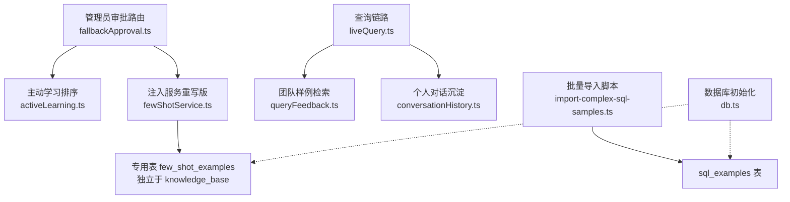
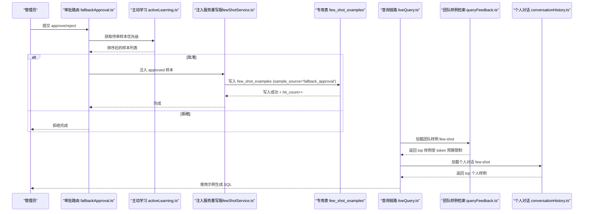
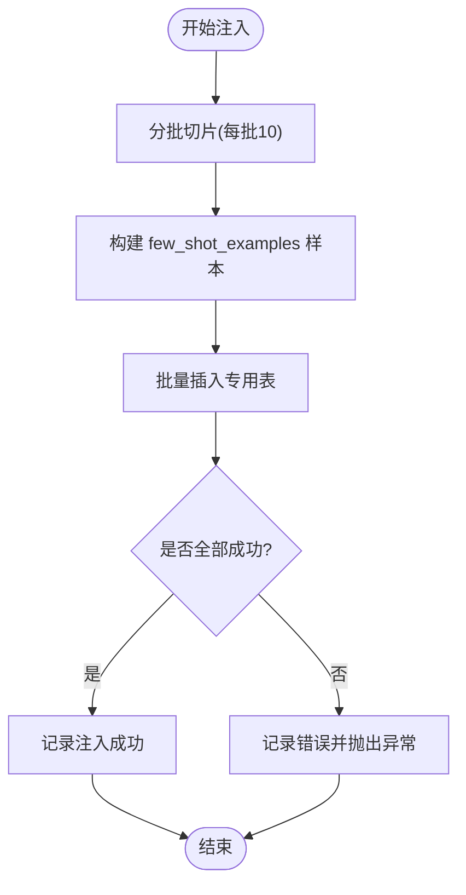
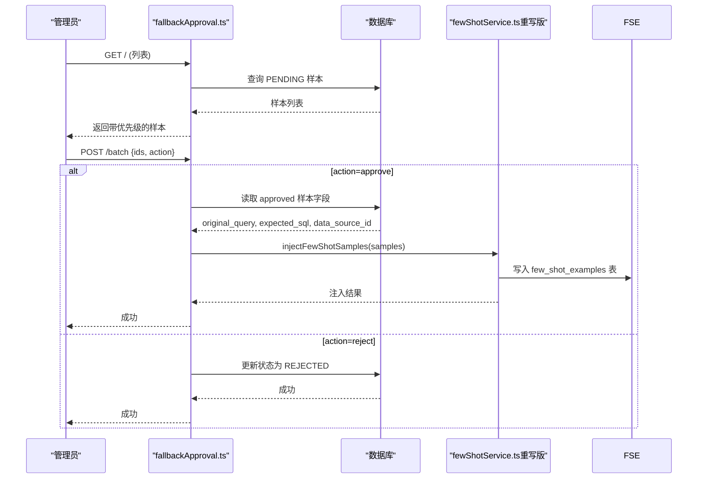
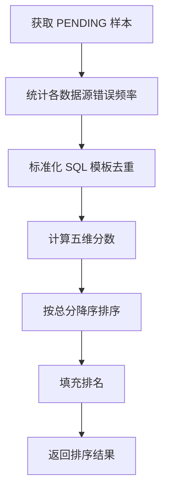
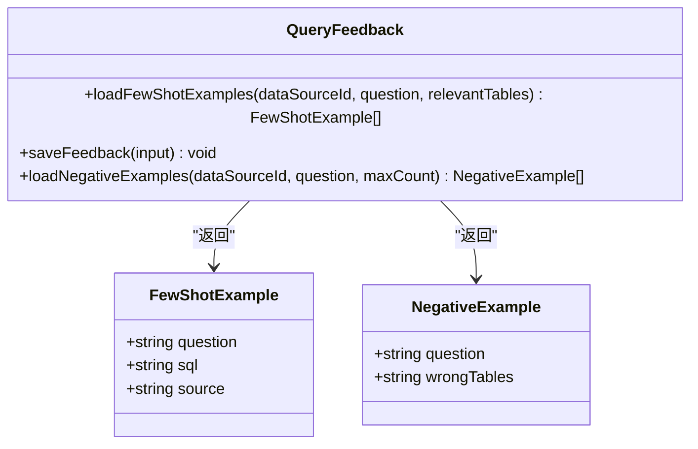
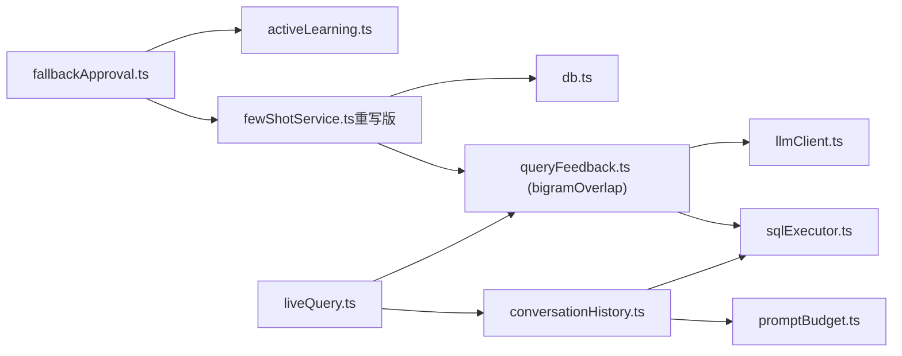

# 少样本注入服务

<cite>
**本文引用的文件**
- [server/utils/fewShotService.ts](file://server/utils/fewShotService.ts)
- [server/routes/fallbackApproval.ts](file://server/routes/fallbackApproval.ts)
- [server/utils/activeLearning.ts](file://server/utils/activeLearning.ts)
- [server/query/queryFeedback.ts](file://server/query/queryFeedback.ts)
- [server/query/conversationHistory.ts](file://server/query/conversationHistory.ts)
- [server/query/liveQuery.ts](file://server/query/liveQuery.ts)
- [scripts/import-complex-sql-samples.ts](file://scripts/import-complex-sql-samples.ts)
- [server/infra/db.ts](file://server/infra/db.ts)
</cite>

## 更新摘要
**变更内容**
- 完全重写少样本注入服务以适配新的专用表结构
- 实现基于bigram的相似度评分来检索相关历史示例
- 添加带适当错误处理的批量插入功能
- 新增用于操作监控的点击计数跟踪
- 提供批量注入能力和单最佳示例检索功能

## 目录
1. [简介](#简介)
2. [项目结构](#项目结构)
3. [核心组件](#核心组件)
4. [架构总览](#架构总览)
5. [详细组件分析](#详细组件分析)
6. [依赖关系分析](#依赖关系分析)
7. [性能考量](#性能考量)
8. [故障排查指南](#故障排查指南)
9. [结论](#结论)
10. [附录](#附录)

## 简介
本服务为"智能问数据分析系统"的少样本（Few-Shot）注入与检索能力，负责将人类专家采纳的高质量问答对自动沉淀到专用知识库，并在后续查询时按相似度与预算策略召回，作为提示词中的示例以提升 LLM 生成 SQL 的质量。**v0.9.47 P0 版本完全重写了服务以适配新的专用表结构**，关键特性包括：
- **专用表结构**：从通用的 `knowledge_base` 表迁移到专用的 `few_shot_examples` 表，避免污染业务知识 RAG 检索
- **Bigram 相似度评分**：基于中文友好的 bigram 重合度算法进行问题相似度计算
- **批量注入能力**：支持分批插入（每批10条），具备完善的错误处理和日志记录
- **点击计数跟踪**：通过 `hit_count` 字段追踪示例被复用的次数，便于运营监控
- **单最佳示例检索**：新增 `retrieveBestFewShot` 方法，专门用于 human_approval 策略
- **降级与容错**：embedding 不可用时自动降级为纯词法匹配；注入失败不阻断审批主流程

## 项目结构
围绕少样本注入服务的代码主要分布在以下模块：
- **注入与检索**：fewShotService.ts（完全重写，适配新表结构）
- **管理员审批流**：fallbackApproval.ts（集成新的注入服务）
- **主动学习评分**：activeLearning.ts（优先级排序算法）
- **样例库与检索**：queryFeedback.ts（团队样例库管理）
- **个人对话沉淀**：conversationHistory.ts（个人 Few-Shot 检索）
- **查询链路集成**：liveQuery.ts（查询阶段集成）
- **批量导入脚本**：import-complex-sql-samples.ts（冷启动语料）
- **数据库初始化与注释**：db.ts（新增 few_shot_examples 表定义）

**图表来源**
- [server/routes/fallbackApproval.ts:23-121](file://server/routes/fallbackApproval.ts#L23-L121)
- [server/utils/activeLearning.ts:40-129](file://server/utils/activeLearning.ts#L40-L129)
- [server/utils/fewShotService.ts:34-64](file://server/utils/fewShotService.ts#L34-L64)
- [server/query/queryFeedback.ts:168-232](file://server/query/queryFeedback.ts#L168-L232)
- [server/query/conversationHistory.ts:158-203](file://server/query/conversationHistory.ts#L158-L203)
- [scripts/import-complex-sql-samples.ts:23-189](file://scripts/import-complex-sql-samples.ts#L23-L189)
- [server/infra/db.ts:770-782](file://server/infra/db.ts#L770-L782)

**章节来源**
- [server/utils/fewShotService.ts:1-121](file://server/utils/fewShotService.ts#L1-L121)
- [server/routes/fallbackApproval.ts:1-200](file://server/routes/fallbackApproval.ts#L1-L200)
- [server/utils/activeLearning.ts:1-164](file://server/utils/activeLearning.ts#L1-L164)
- [server/query/queryFeedback.ts:1-471](file://server/query/queryFeedback.ts#L1-L471)
- [server/query/conversationHistory.ts:1-204](file://server/query/conversationHistory.ts#L1-L204)
- [server/query/liveQuery.ts:1-200](file://server/query/liveQuery.ts#L1-L200)
- [scripts/import-complex-sql-samples.ts:1-189](file://scripts/import-complex-sql-samples.ts#L1-L189)
- [server/infra/db.ts:770-782](file://server/infra/db.ts#L770-L782)

## 核心组件
- **注入服务（fewShotService.ts - v0.9.47 P0 重写）**
  - `injectFewShotSamples`：将批准的困难样本分批写入专用的 `few_shot_examples` 表，标记 `sample_source=fallback_approval`，包含原始问题、期望 SQL、数据源和来源样本ID
  - `retrieveFewShotExamples`：从 `few_shot_examples` 中按数据源过滤，使用 bigram 相似度评分检索最近 100 条，取 top-k 结果
  - `retrieveBestFewShot`：新增的单最佳示例检索方法，专为 human_approval 策略设计
- **管理员审批流（fallbackApproval.ts）**
  - 列表：调用 activeLearning 对 PENDING 样本计算优先级分数并返回
  - 批量操作：支持 approve/reject；approve 时提取 original_query、expected_sql、data_source_id 并调用新的 injectFewShotSamples
  - 单个审核：更新状态至 IN_REVIEW，最终确认 APPROVED/REJECTED，必要时写入 expected_sql 与 resolved_strategy
- **主动学习评分（activeLearning.ts）**
  - `prioritizePendingSamples`：基于年龄衰减、错误频率、SQL 复杂度、多样性探索、重要用户加权等多因子计算总分并排序
- **样例检索（queryFeedback.ts）**
  - `loadFewShotExamples`：从 sql_examples 检索相似样例，采用 embedding 余弦相似度（可降级）、bigram 重合度、表引用重合度综合打分
  - `saveFeedback`：点赞反馈自动沉淀为 sql_examples，并尝试生成问题向量
  - `loadNegativeExamples`：点踩反例沉淀，仅暴露错误涉及的表名特征，避免照抄错误 SQL
- **个人对话沉淀（conversationHistory.ts）**
  - `loadConversationFewShot`：同用户同数据源的真实成功问答对，近 100 条内按 bigram 与表重合度打分，token 预算内取 top 2
- **查询链路集成（liveQuery.ts）**
  - 在查询阶段加载 Few-Shot 样例（来自团队样例库与个人对话），组合进 prompt 提升生成质量
- **批量导入脚本（import-complex-sql-samples.ts）**
  - 向 sql_examples 批量导入复杂 SQL 样例，覆盖 WITH/CTE、窗口函数、条件聚合等场景，作为冷启动 Few-Shot 语料

**章节来源**
- [server/utils/fewShotService.ts:34-121](file://server/utils/fewShotService.ts#L34-L121)
- [server/routes/fallbackApproval.ts:23-200](file://server/routes/fallbackApproval.ts#L23-L200)
- [server/utils/activeLearning.ts:40-164](file://server/utils/activeLearning.ts#L40-L164)
- [server/query/queryFeedback.ts:50-232](file://server/query/queryFeedback.ts#L50-L232)
- [server/query/conversationHistory.ts:158-203](file://server/query/conversationHistory.ts#L158-L203)
- [server/query/liveQuery.ts:1-200](file://server/query/liveQuery.ts#L1-L200)
- [scripts/import-complex-sql-samples.ts:23-189](file://scripts/import-complex-sql-samples.ts#L23-L189)

## 架构总览
少样本注入服务贯穿"收集—审核—注入—检索—使用"的全链路，**v0.9.47 P0 版本的核心改进是独立的专用表结构和基于 bigram 的相似度评分**：

**图表来源**
- [server/routes/fallbackApproval.ts:23-121](file://server/routes/fallbackApproval.ts#L23-L121)
- [server/utils/activeLearning.ts:40-129](file://server/utils/activeLearning.ts#L40-L129)
- [server/utils/fewShotService.ts:34-109](file://server/utils/fewShotService.ts#L34-L109)
- [server/query/queryFeedback.ts:168-232](file://server/query/queryFeedback.ts#L168-L232)
- [server/query/conversationHistory.ts:158-203](file://server/query/conversationHistory.ts#L158-L203)
- [server/query/liveQuery.ts:1-200](file://server/query/liveQuery.ts#L1-L200)

## 详细组件分析

### 注入服务（fewShotService.ts - v0.9.47 P0 完全重写）
**更新** 完全重写以适配新的专用表结构，移除了对 knowledge_base 表的依赖

- **功能要点**
  - **专用表结构**：写入独立的 `few_shot_examples` 表，包含 `data_source_id`、`question`、`expected_sql`、`sample_source`、`sample_id`、`hit_count` 等字段
  - **批量注入**：按批次大小（默认 10）并行插入，构造标准化样本对象（包含原始问题、期望 SQL、数据源、来源样本ID）
  - **Bigram 相似度评分**：使用 `bigramOverlap` 函数计算问题相似度，与个人对话检索保持一致的评分标准
  - **点击计数跟踪**：命中时异步累计 `hit_count`，失败不影响检索结果，用于运营监控
  - **单最佳示例检索**：新增 `retrieveBestFewShot` 方法，专为 human_approval 策略设计
- **数据结构**
  - `FewShotExample`：包含 id、dataSourceId、question、expectedSQL
  - `FewShotInjectionSample`：包含 original_query、expected_sql、data_source_id、sample_id
- **错误处理**
  - 单批失败记录日志并抛出错误；整体流程保持幂等与可重试
  - 点击计数更新失败静默处理，不影响主流程
- **性能特征**
  - 批量 Promise.all 并发写入，降低 IO 次数；日志记录注入计数便于监控

**图表来源**
- [server/utils/fewShotService.ts:34-64](file://server/utils/fewShotService.ts#L34-L64)

**章节来源**
- [server/utils/fewShotService.ts:1-121](file://server/utils/fewShotService.ts#L1-L121)

### 管理员审批流（fallbackApproval.ts）
- **功能要点**
  - 列表接口：调用 activeLearning 获取 PENDING 样本并按优先级排序返回
  - 批量接口：支持 approve/reject；approve 时提取 original_query、expected_sql、data_source_id 并调用新的 injectFewShotSamples
  - 单个审核：状态流转 PENDING → IN_REVIEW → APPROVED/REJECTED，必要时写入 expected_sql 与 resolved_strategy
- **错误处理**
  - 审批失败返回 500；注入失败不影响审批主流程（fail-open）
- **安全与权限**
  - 所有接口需认证与 ADMIN 角色校验

**图表来源**
- [server/routes/fallbackApproval.ts:23-121](file://server/routes/fallbackApproval.ts#L23-L121)
- [server/utils/fewShotService.ts:34-64](file://server/utils/fewShotService.ts#L34-L64)

**章节来源**
- [server/routes/fallbackApproval.ts:1-200](file://server/routes/fallbackApproval.ts#L1-L200)

### 主动学习评分（activeLearning.ts）
- **评分维度**
  - 年龄衰减分：越久未处理的样本得分越高，鼓励尽快审核积压
  - 高频错误分：同一数据源出现次数越多得分越高
  - 查询复杂度分：SQL 长度与关键词数量作为复杂度指标
  - 多样性探索分：基于 SQL 模板的唯一性，鼓励覆盖多样场景
  - 重要用户加权分：根据 userId 归一化加权
- **输出**
  - 返回带 totalScore 与 rank 的排序结果，用于前端展示与处理顺序

**图表来源**
- [server/utils/activeLearning.ts:40-129](file://server/utils/activeLearning.ts#L40-L129)

**章节来源**
- [server/utils/activeLearning.ts:1-164](file://server/utils/activeLearning.ts#L1-L164)

### 样例检索（queryFeedback.ts）
- **功能要点**
  - `loadFewShotExamples`：从 sql_examples 检索相似样例，采用 embedding 余弦相似度（可降级）、bigram 重合度、表引用重合度综合打分，按 token 预算贪心取 top（最多 3 条）
  - `saveFeedback`：点赞反馈自动沉淀为 sql_examples，并尝试生成问题向量；幂等防止重复
  - `loadNegativeExamples`：点踩反例沉淀，仅暴露错误涉及的表名特征，避免照抄错误 SQL
- **数据结构**
  - `FewShotExample`：question、sql、source（MANUAL/FEEDBACK_UP/IMPORT）
  - `NegativeExample`：question、wrongTables（逗号分隔的表名特征）
- **性能特征**
  - 单次 embed 问题向量，失败降级为纯词法；相同 SQL 去重保留最高分；token 预算控制注入规模

**图表来源**
- [server/query/queryFeedback.ts:106-232](file://server/query/queryFeedback.ts#L106-L232)

**章节来源**
- [server/query/queryFeedback.ts:1-471](file://server/query/queryFeedback.ts#L1-L471)

### 个人对话沉淀（conversationHistory.ts）
- **功能要点**
  - `loadConversationFewShot`：同用户同数据源的真实成功问答对，近 100 条内按 bigram 与表重合度打分，token 预算内取 top 2
  - `pruneConversationHistory`：定期清理历史，保留窗口（默认 500 条）
- **性能特征**
  - 只读近 100 条，窗口 500 足以覆盖检索源；旧记录自动清理避免写放大

**章节来源**
- [server/query/conversationHistory.ts:1-204](file://server/query/conversationHistory.ts#L1-L204)

### 查询链路集成（liveQuery.ts）
- **功能要点**
  - 在查询阶段加载 Few-Shot 样例（来自团队样例库与个人对话），组合进 prompt 提升生成质量
  - 与 queryFeedback 和 conversationHistory 协作，确保示例质量与预算控制

**章节来源**
- [server/query/liveQuery.ts:1-200](file://server/query/liveQuery.ts#L1-L200)

### 批量导入脚本（import-complex-sql-samples.ts）
- **功能要点**
  - 向 sql_examples 批量导入复杂 SQL 样例，覆盖 WITH/CTE、窗口函数、条件聚合等场景，作为冷启动 Few-Shot 语料
  - 提供交互式确认与现有数据覆盖选项

**章节来源**
- [scripts/import-complex-sql-samples.ts:1-189](file://scripts/import-complex-sql-samples.ts#L1-L189)

## 依赖关系分析
- **组件耦合**
  - fallbackApproval.ts 依赖 activeLearning.ts 与重写版的 fewShotService.ts
  - fewShotService.ts 依赖 db.ts 提供的连接池与日志，以及 queryFeedback.ts 的 bigramOverlap 函数
  - queryFeedback.ts 依赖 llmClient.ts（embedding）与 sqlExecutor.ts（表引用提取）
  - conversationHistory.ts 依赖 sqlExecutor.ts 与 promptBudget.ts
- **外部依赖**
  - MySQL 数据库：新增的 `few_shot_examples` 专用表、sql_examples、conversation_history、adversarial_samples
  - LLM 嵌入服务：callEmbedding（可降级）
- **循环依赖规避**
  - cosine 相似度内联于 queryFeedback.ts，避免与 knowledgeBase 形成循环 import

**图表来源**
- [server/routes/fallbackApproval.ts:1-200](file://server/routes/fallbackApproval.ts#L1-L200)
- [server/utils/activeLearning.ts:1-164](file://server/utils/activeLearning.ts#L1-L164)
- [server/utils/fewShotService.ts:1-121](file://server/utils/fewShotService.ts#L1-L121)
- [server/query/queryFeedback.ts:1-471](file://server/query/queryFeedback.ts#L1-L471)
- [server/query/conversationHistory.ts:1-204](file://server/query/conversationHistory.ts#L1-L204)
- [server/query/liveQuery.ts:1-200](file://server/query/liveQuery.ts#L1-L200)
- [server/infra/db.ts:770-782](file://server/infra/db.ts#L770-L782)

**章节来源**
- [server/routes/fallbackApproval.ts:1-200](file://server/routes/fallbackApproval.ts#L1-L200)
- [server/utils/activeLearning.ts:1-164](file://server/utils/activeLearning.ts#L1-L164)
- [server/utils/fewShotService.ts:1-121](file://server/utils/fewShotService.ts#L1-L121)
- [server/query/queryFeedback.ts:1-471](file://server/query/queryFeedback.ts#L1-L471)
- [server/query/conversationHistory.ts:1-204](file://server/query/conversationHistory.ts#L1-L204)
- [server/query/liveQuery.ts:1-200](file://server/query/liveQuery.ts#L1-L200)
- [server/infra/db.ts:770-782](file://server/infra/db.ts#L770-L782)

## 性能考量
- **注入阶段**
  - **批量写入**：每批 10 条并行插入，减少数据库往返
  - **日志记录**：记录注入计数与错误信息，便于监控与定位
  - **专用表优化**：独立的 few_shot_examples 表避免了知识图谱检索的干扰
- **检索阶段**
  - **Bigram 相似度**：基于中文友好的 bigram 重合度算法，零依赖、够用即可
  - **窗口限制**：检索最近 100 条记录，避免全表扫描
  - **点击计数**：异步更新 hit_count，失败静默处理不影响主流程
  - **去重与预算**：相同 SQL 去重保留最高分；按 token 预算贪心取 top，避免提示词过长
  - **窗口清理**：对话历史定期清理，避免写放大与存储膨胀
- **评分阶段**
  - **多因子评分**：综合考虑年龄、频率、复杂度、多样性、用户权重，提高样本价值
  - **模板标准化**：去除数值与字符串，提升多样性评估准确性

## 故障排查指南
- **注入失败**
  - 现象：注入报错并记录错误日志
  - 排查：检查数据库连接、`few_shot_examples` 表结构与权限；确认传入字段格式正确
  - 参考路径：[fewShotService.ts:56-59](file://server/utils/fewShotService.ts#L56-L59)
- **审批流程中断**
  - 现象：批量操作返回错误
  - 排查：检查参数 ids 与 action 合法性；确认 adversarial_samples 表状态与权限
  - 参考路径：[fallbackApproval.ts:66-131](file://server/routes/fallbackApproval.ts#L66-L131)
- **样例检索为空**
  - 现象：loadFewShotExamples 返回空数组
  - 排查：确认 sql_examples 表是否有数据；检查 embedding 服务可用性；验证相关表引用是否正确
  - 参考路径：[queryFeedback.ts:168-232](file://server/query/queryFeedback.ts#L168-L232)
- **个人对话沉淀不足**
  - 现象：loadConversationFewShot 返回少于预期
  - 排查：确认 conversation_history 表有 SUCCESS 且 provenance=live 的记录；检查窗口清理策略
  - 参考路径：[conversationHistory.ts:158-203](file://server/query/conversationHistory.ts#L158-L203)
- **点击计数不更新**
  - 现象：few_shot_examples 表中 hit_count 字段未增加
  - 排查：检查异步更新逻辑，确认数据库连接正常；注意这是 fire-and-forget 操作，失败不影响主流程
  - 参考路径：[fewShotService.ts:95-101](file://server/utils/fewShotService.ts#L95-L101)

**章节来源**
- [server/utils/fewShotService.ts:56-59](file://server/utils/fewShotService.ts#L56-L59)
- [server/routes/fallbackApproval.ts:66-131](file://server/routes/fallbackApproval.ts#L66-L131)
- [server/query/queryFeedback.ts:168-232](file://server/query/queryFeedback.ts#L168-L232)
- [server/query/conversationHistory.ts:158-203](file://server/query/conversationHistory.ts#L158-L203)
- [server/utils/fewShotService.ts:95-101](file://server/utils/fewShotService.ts#L95-L101)

## 结论
少样本注入服务通过 v0.9.47 P0 版本的完全重写，实现了从通用知识库表到专用表的架构升级，显著提升了系统的可维护性和性能。**新版本的核心优势包括**：
- **专用表结构**：独立的 `few_shot_examples` 表避免了知识图谱检索的污染
- **基于 Bigram 的相似度评分**：中文友好的相似度算法，零依赖、高效准确
- **完善的批量处理能力**：支持分批插入、错误处理和日志记录
- **操作监控能力**：通过 `hit_count` 字段追踪示例复用情况
- **灵活的检索接口**：提供批量注入和单最佳示例检索两种模式

该设计兼顾了可扩展性（多源样例）、鲁棒性（降级与容错）与性能（批量与预算控制），为系统的长期演进提供了坚实基础。

## 附录
- **数据库表说明**
  - **few_shot_examples**：新增的专用表，存储对抗训练闭环的 Few-Shot 示例，包含 `data_source_id`、`question`、`expected_sql`、`sample_source`、`sample_id`、`hit_count` 等字段
  - **sql_examples**：团队样例库，支持导入、导出与管理
  - **conversation_history**：个人对话沉淀，用于个人 Few-Shot 检索
  - **adversarial_samples**：对抗训练样本，PENDING/IN_REVIEW/APPROVED/REJECTED 状态流转
- **参考路径**
  - [db.ts:770-782](file://server/infra/db.ts#L770-L782)