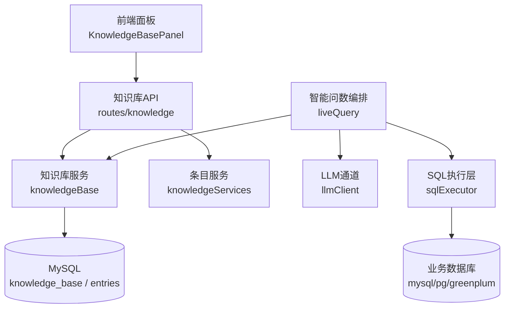
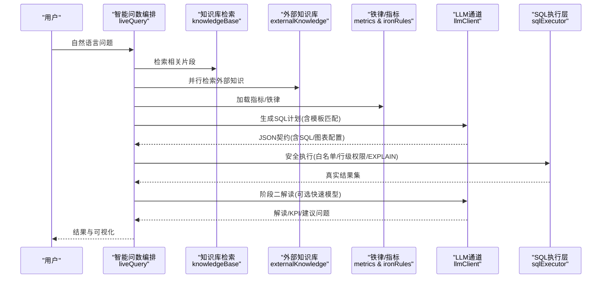
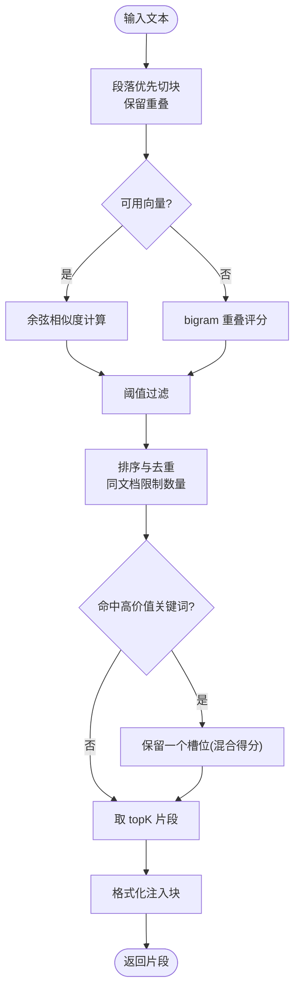
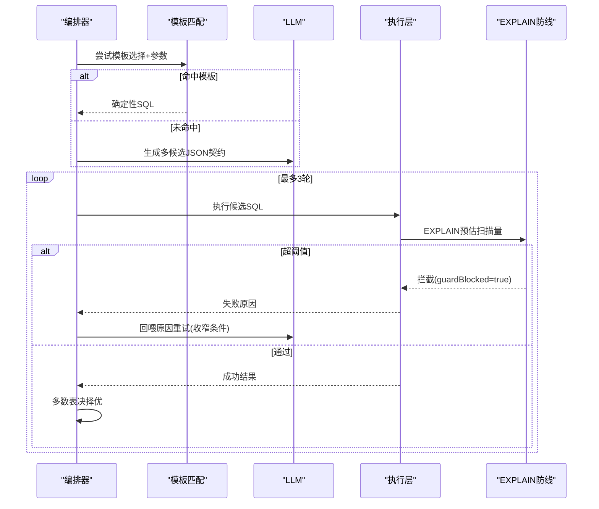
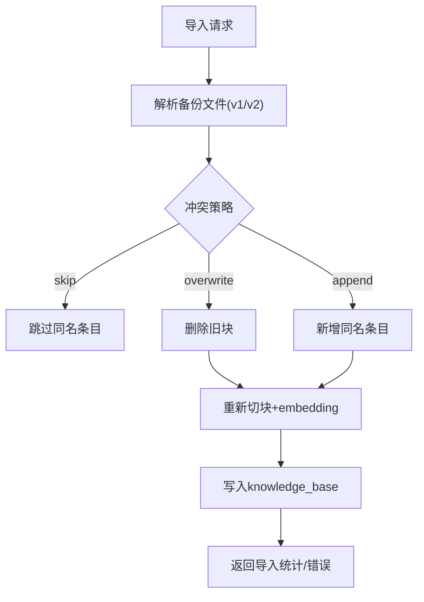
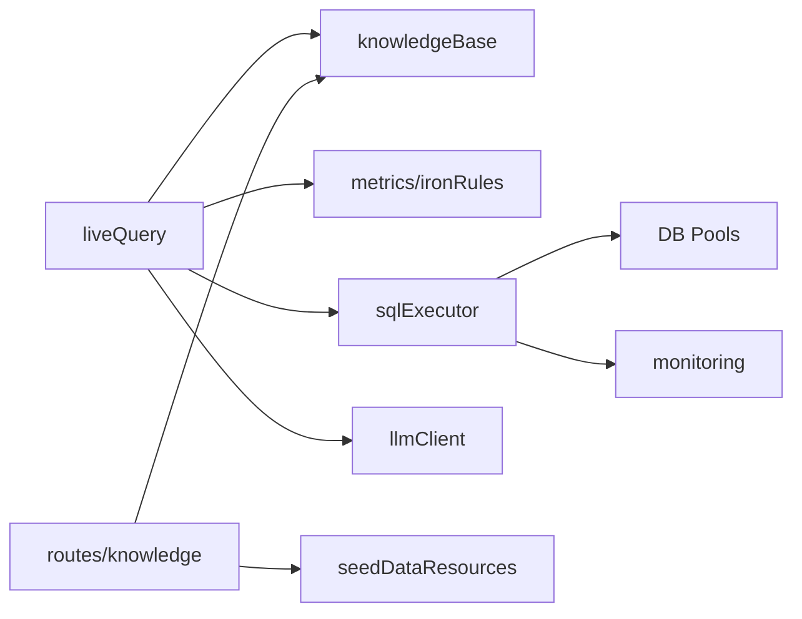

# 知识图谱

<cite>
**本文引用的文件**
- [server/knowledge/knowledgeBase.ts](file://server/knowledge/knowledgeBase.ts)
- [server/knowledge/knowledgeServices.ts](file://server/knowledge/knowledgeServices.ts)
- [server/routes/knowledge.ts](file://server/routes/knowledge.ts)
- [server/query/liveQuery.ts](file://server/query/liveQuery.ts)
- [server/llm/llmClient.ts](file://server/llm/llmClient.ts)
- [server/query/sqlExecutor.ts](file://server/query/sqlExecutor.ts)
- [src/components/datasource/KnowledgeBasePanel.tsx](file://src/components/datasource/KnowledgeBasePanel.tsx)
</cite>

## 目录
1. [简介](#简介)
2. [项目结构](#项目结构)
3. [核心组件](#核心组件)
4. [架构总览](#架构总览)
5. [详细组件分析](#详细组件分析)
6. [依赖关系分析](#依赖关系分析)
7. [性能考虑](#性能考虑)
8. [故障排查指南](#故障排查指南)
9. [结论](#结论)
10. [附录](#附录)

## 简介
本技术文档围绕“知识图谱构建与维护”的目标，结合代码库中的知识库（RAG）与智能问数链路，系统阐述以下能力：
- 实体与关系抽取的落地实现：以“业务知识库 + 语义指标层 + 外部知识库”的组合方式，完成口径、术语、计算规则的抽取与注入。
- 知识推理机制：通过规则引擎（铁律）、模板匹配、EXPLAIN 防线拦截与自纠错多候选多数表决，形成可审计、可回退的推导链。
- 图谱更新同步策略：支持增量导入/覆盖/追加、版本化导出、预置条目保护与事务性初始化。
- 可视化与管理工具：前端面板提供文档列表、详情查看、编辑、导入导出等交互。
- 查询语言：当前以 SQL 为主，并内置模板匹配；SPARQL 未在本仓库实现，但可扩展为上层查询接口。
- 质量评估：基于阈值过滤、结果合理性校验、覆盖率统计与审计留痕。
- 性能优化：向量检索降级、批量化 embedding、并发并行上下文构建、连接池分级与 EXPLAIN 防线。
- 企业集成：鉴权与角色控制、数据源隔离、审计日志与用量埋点。

## 项目结构
与知识图谱相关的后端模块主要分布在 knowledge、query、llm、routes 以及前端 KnowledgeBasePanel：
- knowledgeBase：切块、embedding、相似度排序、片段格式化、持久化入库与检索。
- knowledgeServices：条目模型 CRUD、种子数据初始化、预置条目保护。
- routes/knowledge：REST API（CRUD、导入导出、详情）。
- liveQuery：智能问数编排，将知识库片段作为 RAG 上下文注入阶段一提示词。
- llmClient：统一 LLM 调用通道（重试、熔断、路由、用量埋点）。
- sqlExecutor：SQL 安全执行层（白名单、行级权限、EXPLAIN 防线、超时）。
- KnowledgeBasePanel：前端知识库管理面板（登记、编辑、查看、导入导出）。

图表来源
- [server/routes/knowledge.ts:1-457](file://server/routes/knowledge.ts#L1-L457)
- [server/knowledge/knowledgeBase.ts:1-239](file://server/knowledge/knowledgeBase.ts#L1-L239)
- [server/knowledge/knowledgeServices.ts:1-260](file://server/knowledge/knowledgeServices.ts#L1-L260)
- [server/query/liveQuery.ts:1-749](file://server/query/liveQuery.ts#L1-L749)
- [server/llm/llmClient.ts:1-606](file://server/llm/llmClient.ts#L1-L606)
- [server/query/sqlExecutor.ts:1-832](file://server/query/sqlExecutor.ts#L1-L832)

章节来源
- [server/routes/knowledge.ts:1-457](file://server/routes/knowledge.ts#L1-L457)
- [server/knowledge/knowledgeBase.ts:1-239](file://server/knowledge/knowledgeBase.ts#L1-L239)
- [server/knowledge/knowledgeServices.ts:1-260](file://server/knowledge/knowledgeServices.ts#L1-L260)
- [server/query/liveQuery.ts:1-749](file://server/query/liveQuery.ts#L1-L749)
- [server/llm/llmClient.ts:1-606](file://server/llm/llmClient.ts#L1-L606)
- [server/query/sqlExecutor.ts:1-832](file://server/query/sqlExecutor.ts#L1-L832)
- [src/components/datasource/KnowledgeBasePanel.tsx:1-590](file://src/components/datasource/KnowledgeBasePanel.tsx#L1-L590)

## 核心组件
- 知识库切片与检索：按段落优先切块、重叠拼接、余弦相似度或 bigram 关键词检索、阈值过滤、同文档去重与高价值文档保留槽位。
- 外部知识库聚合：按数据源启用状态与通配符匹配，并行检索多个外部 RAG 源，失败降级不阻断主链路。
- 智能问数编排：七路上下文并行构建（few-shot、本地知识、外部知识、指标、反例、个人沉淀、铁律），模板优先命中，多候选并行生成与多数表决，EXPLAIN 防线拦截与自纠错。
- SQL 安全执行：SELECT-only、表名白名单、敏感列拒绝、AST 复核、行级权限注入、EXPLAIN 预估扫描量拦截、场景化连接池与超时。
- 前端知识库面板：文档列表、详情查看、编辑（重新切块与 embedding）、导入导出（兼容 v1/v2 格式）、冲突处理策略与 Dry Run。

章节来源
- [server/knowledge/knowledgeBase.ts:43-166](file://server/knowledge/knowledgeBase.ts#L43-L166)
- [server/query/liveQuery.ts:220-327](file://server/query/liveQuery.ts#L220-L327)
- [server/query/sqlExecutor.ts:291-387](file://server/query/sqlExecutor.ts#L291-L387)
- [src/components/datasource/KnowledgeBasePanel.tsx:65-130](file://src/components/datasource/KnowledgeBasePanel.tsx#L65-L130)

## 架构总览
知识图谱在系统中的体现为“业务知识库 + 语义指标层 + 外部知识库”的三元组合，服务于智能问数的 RAG 注入与规则约束。

图表来源
- [server/query/liveQuery.ts:189-749](file://server/query/liveQuery.ts#L189-L749)
- [server/knowledge/knowledgeBase.ts:207-239](file://server/knowledge/knowledgeBase.ts#L207-L239)
- [server/llm/llmClient.ts:449-525](file://server/llm/llmClient.ts#L449-L525)
- [server/query/sqlExecutor.ts:734-832](file://server/query/sqlExecutor.ts#L734-L832)

## 详细组件分析

### 实体与关系抽取（RAG 与指标层）
- 文本切块与重叠：按段落合并至 chunkSize，超长块按步长切分，相邻块保留 overlap 避免语义截断。
- 相似度检索：向量模式使用余弦相似度并按阈值过滤；无向量时降级为 bigram 关键词重叠。
- 高价值文档保留：标题命中特定关键词（如“口径/指南/枚举”）时，混合向量与词法得分保留一个槽位，防止字段字典挤占。
- 外部知识库聚合：按 enabled 与 data_source_id（支持“*”通配）筛选，并行调用外部搜索接口，失败降级为空且不阻断主链路。
- 语义指标层：命中指标名/同义词时，模板化注入权威口径，提升 SQL 生成的业务准确性。

图表来源
- [server/knowledge/knowledgeBase.ts:43-166](file://server/knowledge/knowledgeBase.ts#L43-L166)

章节来源
- [server/knowledge/knowledgeBase.ts:43-166](file://server/knowledge/knowledgeBase.ts#L43-L166)
- [server/query/liveQuery.ts:220-266](file://server/query/liveQuery.ts#L220-L266)

### 知识推理机制（规则引擎、逻辑推导、矛盾检测）
- 规则引擎（铁律）：ACTIVE 铁律恒注入，最高优先级强制约束，异常时降级不影响主链路。
- 模板匹配：阶段一优先尝试模板选择与参数填充，命中则确定性拼装 SQL，零偏差兜底。
- 多候选与多数表决：复杂问题并行生成多个候选，执行成功后按结果签名分组，多数派胜出。
- EXPLAIN 防线：执行前评估预估扫描行数，超过阈值拦截并给出收窄指引；二次拦截后终止自纠错，防空转。
- 自纠错：执行失败或结果异常时，将原因回喂 LLM 重试（最多 3 次），模板路径失败自动回退自由生成。

图表来源
- [server/query/liveQuery.ts:359-627](file://server/query/liveQuery.ts#L359-L627)
- [server/query/sqlExecutor.ts:629-662](file://server/query/sqlExecutor.ts#L629-L662)

章节来源
- [server/query/liveQuery.ts:359-627](file://server/query/liveQuery.ts#L359-L627)
- [server/query/sqlExecutor.ts:629-662](file://server/query/sqlExecutor.ts#L629-L662)

### 图谱更新与同步策略（增量、版本、一致性）
- 增量更新：导入支持 skip/overwrite/append 三种冲突策略；Dry Run 仅预检不写库。
- 版本管理：导出包含 version/type/exportedAt/exportedBy 等元信息；兼容 v1（条目数组）与 v2（knowledge-docs）格式。
- 一致性保证：编辑文档先删除旧块再按原 docId 重新切块入库，确保 embedding 一致；预置条目禁止修改/删除。
- 事务性初始化：种子数据批量插入使用事务，失败回滚，记录错误继续处理后续条目。

图表来源
- [server/routes/knowledge.ts:249-375](file://server/routes/knowledge.ts#L249-L375)
- [server/knowledge/knowledgeServices.ts:214-259](file://server/knowledge/knowledgeServices.ts#L214-L259)

章节来源
- [server/routes/knowledge.ts:249-375](file://server/routes/knowledge.ts#L249-L375)
- [server/knowledge/knowledgeServices.ts:214-259](file://server/knowledge/knowledgeServices.ts#L214-L259)

### 图谱可视化工具（节点展示、关系连线、交互操作）
- 节点展示：文档列表显示标题、片段数、创建者、时间；详情弹窗展示每个片段的索引与内容。
- 关系连线：当前以“文档→片段”层级展示；未来可扩展为“实体→属性/关系”图，需引入图数据库与可视化组件。
- 交互操作：新增/编辑/删除、导入导出、冲突策略选择、Dry Run 预检、刷新与通知反馈。

章节来源
- [src/components/datasource/KnowledgeBasePanel.tsx:65-130](file://src/components/datasource/KnowledgeBasePanel.tsx#L65-L130)
- [src/components/datasource/KnowledgeBasePanel.tsx:132-234](file://src/components/datasource/KnowledgeBasePanel.tsx#L132-L234)
- [src/components/datasource/KnowledgeBasePanel.tsx:429-518](file://src/components/datasource/KnowledgeBasePanel.tsx#L429-L518)
- [src/components/datasource/KnowledgeBasePanel.tsx:520-583](file://src/components/datasource/KnowledgeBasePanel.tsx#L520-L583)

### 图谱查询语言（SPARQL 或自定义语法）
- 当前实现：以 SQL 为主，支持模板匹配与自由生成；阶段一输出 JSON 契约（SQL、图表配置、思考过程）。
- SPARQL：仓库中未发现 SPARQL 解析与执行实现；可在上层扩展为“自然语言 → SPARQL 生成器”，对接图数据库（如 Neo4j/Cypher 或 RDF 存储）。
- 自定义查询：可通过模板引擎与 prompt 工程扩展领域查询语法，复用现有安全执行与白名单机制。

章节来源
- [server/query/liveQuery.ts:359-415](file://server/query/liveQuery.ts#L359-L415)
- [server/query/sqlExecutor.ts:291-387](file://server/query/sqlExecutor.ts#L291-L387)

### 图谱质量评估方法（完整性、准确性、覆盖率）
- 完整性检查：导入统计（新增/覆盖/跳过/失败计数）、预置条目保护、空内容拦截。
- 准确性验证：向量相似度阈值过滤、结果合理性校验（空结果/全 NULL 触发重试）、EXPLAIN 防线拦截。
- 覆盖率分析：知识片段字数预算控制、外部知识库成功/失败源统计、few-shot 与个人沉淀条数留痕。
- 审计追踪：每步 trace（理解、链接、知识、指标、铁律、模板、执行、分析），便于回溯与复盘。

章节来源
- [server/knowledge/knowledgeBase.ts:27-41](file://server/knowledge/knowledgeBase.ts#L27-L41)
- [server/query/liveQuery.ts:260-287](file://server/query/liveQuery.ts#L260-L287)
- [server/query/liveQuery.ts:597-627](file://server/query/liveQuery.ts#L597-L627)
- [server/query/sqlExecutor.ts:629-662](file://server/query/sqlExecutor.ts#L629-L662)

### 图谱性能优化策略（索引、缓存、查询优化）
- 向量检索优化：批量化 embedding 请求、bigram 降级、同文档去重、高价值文档保留槽位。
- 并发与排队：七路上下文并行构建、LLM 通道信号量并发限制、自适应超时与熔断。
- 执行优化：场景化连接池配额、EXPLAIN 预估扫描量拦截、MySQL MAX_EXECUTION_TIME hint、结果行数截断。
- 缓存机制：当前未见显式向量缓存；可引入 embedding 缓存与查询结果缓存以提升命中率与吞吐。

章节来源
- [server/knowledge/knowledgeBase.ts:170-197](file://server/knowledge/knowledgeBase.ts#L170-L197)
- [server/query/liveQuery.ts:220-247](file://server/query/liveQuery.ts#L220-L247)
- [server/llm/llmClient.ts:61-161](file://server/llm/llmClient.ts#L61-L161)
- [server/query/sqlExecutor.ts:44-109](file://server/query/sqlExecutor.ts#L44-L109)

### 与企业系统集成方案（数据对接、权限同步、审计追踪）
- 数据对接：按数据源 ID 隔离知识库与指标/铁律；外部知识库支持通配符与禁用开关。
- 权限同步：路由层鉴权中间件与角色控制（ADMIN 写操作），行级权限 AST 注入强制生效。
- 审计追踪：LLM 用量埋点（engine/model/channel/tokens/duration/ok）、SQL 执行监控、EXPLAIN 守卫观察、trace 步骤留痕。

章节来源
- [server/routes/knowledge.ts:25-31](file://server/routes/knowledge.ts#L25-L31)
- [server/query/sqlExecutor.ts:396-489](file://server/query/sqlExecutor.ts#L396-L489)
- [server/llm/llmClient.ts:476-525](file://server/llm/llmClient.ts#L476-L525)

## 依赖关系分析
- 低耦合高内聚：knowledgeBase 专注切片与检索；knowledgeServices 负责条目 CRUD；routes 暴露 REST API；liveQuery 编排上下文与执行；sqlExecutor 保障安全；llmClient 统一通道。
- 直接依赖：
  - liveQuery 依赖 knowledgeBase（RAG）、metrics/ironRules（规则）、sqlExecutor（执行）、llmClient（LLM）。
  - routes/knowledge 依赖 knowledgeBase（保存/检索）与 seedDataResources（种子数据）。
  - sqlExecutor 依赖 db 连接池、secretsCrypto（解密）、monitoring（埋点）。
- 潜在循环：未发现明显循环依赖；模块边界清晰。
- 外部依赖：MySQL/PostgreSQL/Greenplum 驱动、node-sql-parser、Ollama/Gemini/Qwen 接口。

图表来源
- [server/query/liveQuery.ts:16-74](file://server/query/liveQuery.ts#L16-L74)
- [server/routes/knowledge.ts:25-31](file://server/routes/knowledge.ts#L25-L31)
- [server/query/sqlExecutor.ts:11-20](file://server/query/sqlExecutor.ts#L11-L20)

章节来源
- [server/query/liveQuery.ts:16-74](file://server/query/liveQuery.ts#L16-L74)
- [server/routes/knowledge.ts:25-31](file://server/routes/knowledge.ts#L25-L31)
- [server/query/sqlExecutor.ts:11-20](file://server/query/sqlExecutor.ts#L11-L20)

## 性能考虑
- 向量检索：batch embedding 降低往返次数；bigram 降级保证可用性；阈值过滤减少无关注入。
- LLM 通道：信号量并发限制、重试退避、熔断转移、自适应超时，避免雪崩与拖慢。
- 执行层：场景化连接池配额与超时、EXPLAIN 防线拦截大扫描、MAX_ROWS 截断防 OOM。
- 模板优先：命中模板即确定性拼装 SQL，减少 LLM 不确定性与时延。
- 建议优化：引入 embedding 缓存、查询结果缓存、图数据库索引（若扩展 SPARQL/Cypher）。

[本节为通用性能讨论，无需具体文件引用]

## 故障排查指南
- 知识库导入失败：检查文件格式（v1/v2）、必填字段（title/content）、目标数据源是否存在、mergeStrategy 是否合法。
- 检索无结果：确认向量阈值设置（KNOWLEDGE_MIN_SCORE）、是否启用 embedding、文档是否已切块入库。
- 问数拒答/澄清：关注 parseRefusal/parseClarification 分支，必要时放宽筛选条件或调整口径。
- SQL 执行失败：查看 validateSelectSql 与 checkAstSafety 原因；检查表名白名单、敏感列、行级权限注入；EXPLAIN 拦截需收窄条件。
- LLM 调用失败：检查引擎配置（AI_ENGINE/密钥）、熔断状态、超时设置；观察用量埋点与错误码。

章节来源
- [server/routes/knowledge.ts:249-375](file://server/routes/knowledge.ts#L249-L375)
- [server/knowledge/knowledgeBase.ts:27-41](file://server/knowledge/knowledgeBase.ts#L27-L41)
- [server/query/liveQuery.ts:427-467](file://server/query/liveQuery.ts#L427-L467)
- [server/query/sqlExecutor.ts:291-387](file://server/query/sqlExecutor.ts#L291-L387)
- [server/llm/llmClient.ts:61-161](file://server/llm/llmClient.ts#L61-L161)

## 结论
本系统在“知识图谱”层面以 RAG 为核心，结合语义指标与外部知识库，构建了可检索、可注入、可审计的知识增强体系；通过规则引擎、模板匹配、EXPLAIN 防线与多候选多数表决，实现了稳健的推理与纠错；在更新同步方面支持增量导入、版本兼容与事务性初始化；前端面板提供了完整的可视化管理能力。未来可扩展 SPARQL/Cypher 查询与图数据库集成，进一步提升图谱表达能力与查询效率。

[本节为总结性内容，无需具体文件引用]

## 附录
- 环境变量参考：
  - KNOWLEDGE_MIN_SCORE：向量相似度阈值（默认 0.35）
  - LLM_SQL_ENGINE/LLM_SQL_MODEL：阶段一快速模型路由
  - LLM_ANALYSIS_ENGINE/LLM_ANALYSIS_MODEL：阶段二快速模型路由
  - SQL_EXPLAIN_MAX_ROWS：EXPLAIN 防线阈值（默认 100 万）
  - DS_POOL_MAX/DS_POOL_INTERACTIVE/CHAIN/EXPORT：连接池配额
  - QUERY_TIMEOUT_INTERACTIVE_MS/CHAIN_MS/EXPORT_MS：场景超时
- 关键 API：
  - GET/POST/PUT/DELETE /api/knowledge（知识库 CRUD）
  - GET /api/knowledge/export?dataSourceId=xxx（导出）
  - POST /api/knowledge/import（导入）
  - GET /api/knowledge/:docId（详情）

[本节为补充信息，无需具体文件引用]